CONTENTS

ARTICLE 10 Introductory Provisions 1

.1 Title 1

.2 Authority 1

.3 Applicability and Jurisdiction 1

.4 Replacement of Previous Ordinances 1

.5 Compliance Required 1

.6 Minimum Requirements 1

.7 Purpose and Intent 2

.8 Implementation of the Comprehensive Plan 3

.9 Commentary 3

.10 Word Usage and Construction of Language 3

.11 Zoning District Map 5

.12 Conflicting Provisions 6

.13 Transitional Provisions 6

.14 Severability 8

ARTICLE 20 Review and Decision-Making Bodies 11

.1 County Commission 11

.2 Planning and Zoning Commission 12

.3 Board of Zoning Adjustment 13

.4 Planning and Zoning Administrator and Other Administrative Staff 14

ARTICLE 30 Development Review Procedures 15

.1 General 15

.2 Zoning Regulations Text Amendments 20

.3 Zoning District Map Amendments 21

.4 Subdivision 24

.5 Minor Subdivision 25

.6 Major Subdivision 28

.8 Planned Unit Developments 37

.9 Conditional Use Permits 42

.10 Sign Permits 47

.11 Variances 49

.12 Vacations 50

.13 Written Interpretations 51

.14 Appeals of Administrative Decisions 52

ARTICLE 40 Base Zoning Districts 55

.1 Establishment of Base Zoning Districts 55

.2 Zoning District Hierarchy 55

.3 R-A, Agricultural District 55

.4 R-1, Residential Rural District 57

.5 R-1A, Residential Low Density District 59

.6 R-1B, Residential Urban District 61

.7 R-2, Residential Duplex District 62

.8 R-3, Residential Multi-Unit District 63

.9 R-MHP, Residential Mobile Home Park District 65

.10 S&O, Neighborhood Commercial District 69

.11 B-1, Community Commercial District 71

.12 B-2, Commercial Services District 74

.13 I-1, Limited Industrial District 77

.14 I-2, General Industrial District 80

.15 OP Open Space and Parks 82

ARTICLE 50 Overlay and Special Purpose ZoningDistricts

.1 Overlay and Special Purpose Zoning Districts Established……………………………………………………85

.3 PUD, Planned Unit Development District……………………………………………………………………..85

.5 Open Space 87

ARTICLE 60 Use Regulations 89

.1 Use Table 89

.2 Use Standards 93

.3 Accessory Uses 115

.4 Temporary Uses 124

ARTICLE 70 Density and Dimensional Standards 129

.1 Density and Dimensional Standards Table 129

.2 Measurements, Computations and Exceptions 129

ARTICLE 80 Subdivision Design and Improvements 133

.1 General 133

.2 Layout and Design Generally 134

.3 Required Infrastructure and Improvements 136

.4 Lots 137

.5 Blocks 138

.6 Pedestrian Circulation (Sidewalks and Trails) 138

.7 Vehicular Circulation (Streets and Bridges) 138

.8 Construction Standards for Vehicular Circulation (Streets and Bridges) 141

.9 Water Supply and Fire Protection 143

.10 Wastewater Systems 146

.11 Other Utilities 147

.12 Stormwater Management 146

.13 Dams and Water Impoundment Structures 150

.14 Street Signs and Traffic Markers 150

.15 Easements 150

.16 Monuments 151

.18 Subdivision Guarantees 152

ARTICLE 90 Perimeter Roadway Improvements 155

.1 Authority and Purpose 155

.2 Administration 155

.3 Applicability 155

.4 Effect on Other Regulations 155

.5 Improvements as Additional Requirement 156

.6 Construction of Improvements/Payment of Fees 156

.7 Required Road Impact Fees and Road Improvements 157

.8 Deposition of Fees 159

.9 Waiver of Required Improvements 159

ARTICLE 100 Development Standards 161

.1 Off-Street Parking and Loading 161

.2 Number of Uses/Structures per Lot 177

.3 Traffic Impact Studies 177

.4 Intersection Visibility 183

.5 Historic Preservation 184

.6 Residential Design Standards 185

ARTICLE 110 Environmental 187

.1 Dams and Water Impoundment Structures 187

.2 Stormwater Management 189

.3 Renewable Energy 191

.4 Junk, Trash and Derelict Vehicles 192

.5 Liquid Gas Tanks 193

.6 Floodplain Management 194

.7 Floodplain Definitions 196

.8 Floodplain Administration and Procedures 201

.9 General Flood Hazard Reduction Standards 202

.10 Residential and Nonresidential Building Floodplain Protection Standards 204

.11 Floodplain Standards for Manufactured Housing Units and Mobile Homes 205

.12 Standards for Areas of Shallow Flooding 206

.13 Standards for Floodways 207

.14 Floodplain Standards for Recreational Vehicles 207

.15 Floodplain Variances 208

.16 Floodplain Nonconformities 209

.17 Floodplain Violations 210

.18Floodplain Amendments 210

ARTICLE 120 Signs 212

.1 General 212

.2 Definitions 212

.3 Computations and Measurements 216

.4 Signs Exempt from Regulation 217

.5 Prohibited Sign Types 217

.6 Location 218

.7 Permitted Sign Types 218

.8 Special Sign Standards 220

.9 Maximum Total Sign Area Per Lot 223

.10 Number and Dimensions 224

.11 Building Signs in Nonresidential Districts 224

.12 Sign Characteristics 225

.13 Design, Construction, and Maintenance 225

ARTICLE 130 Nonconformities 228

.1 General 228

.2 Nonconforming Uses 228

.3 Nonconforming Structures 229

.4 Nonconforming Lots 230

.5 Nonconforming Signs 231

ARTICLE 140 Violations, Penalties and Enforcement 232

.1 Responsibility for Enforcement 232

.2 Types of Violations 232

.3 Remedies and Enforcement Powers 234

.4 Enforcement Procedures 234

ARTICLE 150 Definitions 238

.1 Terms and Uses Defined 238

ARTICLE 160 Fee Schedule 267

.1 Fees, Charges and Deposits 267

**BLANK**

**Article 10 Introductory Provisions**

**10.1 Title**

This Title shall be officially known and cited as the “Zoning Regulations Ray County, Missouri.” For convenience, it may be referred to simply as the “Zoning Regulations.”

**10.2 Authority**

These Zoning Regulations are adopted pursuant to the powers granted and limitations imposed by the Constitution and laws of the State of Missouri, including the statutory authority conferred by Article 64 of the Revised Statutes of Missouri.

**10.3 Applicability and Jurisdiction**

These Zoning Regulations shall apply to all development, public and private, within unincorporated Ray County. All structures and land uses constructed or commenced hereafter and all enlargements of, additions to, changes in and relocations of existing structures and uses occurring hereafter shall be subject to these Zoning Regulations.

**10.4 Replacement of Previous Ordinances**

These Zoning Regulations shall replace all Articles, Amendments and Ordinances of the Zoning Regulations of Ray County, Missouri, that existed before June 10,2005.

**10.5 Compliance Required**

It shall be unlawful to conduct any development or construct any structure until (1) all applicable development review and approval processes have been followed; (2) all applicable approvals have been obtained; and (3) all required permits or authorizations to proceed have been issued. Violations will be processed according to Article 140 of these Zoning Regulations.

**10.6 Minimum Requirements**

The standards of these Zoning Regulations are minimum requirements. The issuance of any permit, certificate or approval in accordance with the standards and requirements of these Zoning Regulations shall not relieve the recipient of the responsibility for complying with all other applicable requirements of any other county, state or federal agency.

**10.7 Purpose and Intent**

These Zoning Regulations is adopted to promote the public health, safety and general welfare of residents and visitors to Ray County. More specifically, the regulations are intended to:

A. implement the Ray County _Comprehensive Plan;_

B. preserve and protect land, air, water, environmental resources and property values;

C. divide the unincorporated area of the county into zoning districts regulating land use and intensity of development;

1.  promote land use patterns that ensure efficiency in service provision as well as wise use of fiscal resources and government expenditures;
2.  regulate the type and intensity of development;

F. protect the public from fire, flood and other dangers;

G. protect and maintain the county’s unique and irreplaceable natural resources and Agricultural land;

H. preserve open space, clean air, groundwater recharge and wildlife;

I. direct the timely and orderly development of Ray County; and

J. assure adequate light and air is available in developed areas.

**10.8 Implementation of the Comprehensive Plan**

These Zoning Regulations has been prepared in accordance with the county’s Comprehensive Plan. It is intended that decisions made pursuant to these Zoning Regulations will implement and be consistent with the Comprehensive Plan.

A. An amendment to the text of these Zoning Regulations shall be considered consistent with the Comprehensive Plan if it complies with the goals and policies stated in the Plan. A zoning district map amendment shall be considered consistent with the Comprehensive Plan if the map amendment complies with the goals and policies stated in the Plan.

B. Developments that have been legally established under regulations that predate this edition of the Zoning Regulations shall not be deemed inconsistent with the Comprehensive Plan.

**10.9 Commentary**

Commentaries are included in these Zoning Regulations whenever necessary to clarify the intent of a specific provision. These commentaries ­are a guide for administrative officials and the public to use in interpreting and understanding the Zoning Regulations.

**10.10 Word Usage and Construction of Language**

A. Meanings and Intent

All provisions, terms, phrases and expressions contained in these Zoning Regulations shall be construed according to the Purpose and Intent set out in Article 10.7. Also see Article 150.1.

B. Headings, Illustrations and Text

In case of any difference of meaning or implication between the text of these Zoning Regulations and any heading, drawing, table, figure, or illustration, the text shall control.

C. Lists and Examples

Unless otherwise specifically indicated, lists of items or examples that use terms such as “including,” “such as,” or similar language are intended to provide examples; not to be exhaustive lists of all possibilities.

D. Computation of Time

References to days are to Ray County workdays unless otherwise stated. The time in which an act is to be done shall be computed as follows:

1\. periods of time of 7 days or less are inclusive of all days except Saturdays, Sundays and holidays observed by the county;

2\. periods of time of more than 7 days are inclusive of all days.

E. References to Other Regulations, Publications and Documents

Whenever reference is made to a resolution, ordinance, statute, regulation, or document, that reference shall be construed as referring to the most recent edition of such regulation (as amended), resolution, ordinance, statute, regulation, or document or to the relevant successor document, unless otherwise expressly stated.

F. Delegation of Authority

Whenever a provision appears requiring the head of a department or another officer or employee of the county to perform an act or duty, that provision shall be construed as authorizing the department head or officer to delegate that responsibility to others over whom they have authority.

G. Technical and Non-technical Terms

Words and phrases shall be construed according to the common and approved usage of the language, but technical words and phrases that may have acquired a peculiar and appropriate meaning in law shall be construed and understood according to such meaning.

H. Public Officials and Agencies

All public officials, bodies, and agencies to which references are made are those of Ray County, unless otherwise expressly stated.

I. Mandatory and Discretionary Terms

The words “shall,” “will,” and “must” are mandatory. The words “may” and “should” are advisory and discretionary terms.

J. Conjunctions

Unless the context clearly suggests the contrary, conjunctions shall be interpreted as follows:

“And” indicates that all connected items, conditions, provisions, or events apply; and“Or” indicates that one or more of the connected items, conditions, provisions, or events may apply.

K. Tenses and Plurals

Words used in one tense (past, present, or future) include all other tenses, unless the context clearly indicates the contrary. The singular includes the plural, and the plural includes the singular.

**10.11 Zoning District Map**

A. General

1\. The boundaries of the zoning districts established by these Zoning Regulations are shown on a map or series of maps designated as the official “Zoning District Map,” which together with all legends, symbols, notations, references, district boundaries, and other information thereon, is adopted and made a part of these Zoning Regulations as fully as if it were set out herein in detail.

2\. Original copies of the Zoning District Map, which shall constitute the official record, are maintained in the office of the Planning and Zoning Administrator. In case of any dispute regarding the zoning classification of property subject to these Zoning Regulations, the maps maintained by the Planning and Zoning Administrator shall control.

3\. Changes in the boundaries of any zoning district shall be reflected on the Zoning District Map promptly upon approval of the amendment by the County Commission. All amendments to the Zoning District Map shall be signed and attested to by the Planning and Zoning Administrator.

B. District Boundaries

The following rules shall apply in the determination of the boundaries of any district shown on the Zoning District Map.

1\. Wherever a site is divided by a zoning district boundary, the zoning regulations applicable within each district shall apply to each portion of the site situated in a separate district.

2\. Where boundaries approximate street and alley lines or other identifiable property or boundary lines, such lines shall be construed to be the district boundary. Where such boundaries are shown as being within street and alley lines or within identifiable rights‑of‑way or creeks, the centerline thereof shall be construed to be the district boundary.

3\. Where a district boundary divides a non-subdivided parcel, the location of the district boundary shall be determined by the use of the scale appearing on the Zoning District Map unless indicated by dimensions.

4\. Map codes or symbols indicating the classification of property on the Zoning District Map apply to the entire area within the district boundaries.

5\. Where a street, alley or right‑of‑way is officially vacated or abandoned, the zoning designation of the abutting property shall apply to the centerline of the vacated or abandoned street, alley or right‑of‑way.

6\. Should any uncertainty remain about the location or meaning of a boundary indicated on the Zoning District Map, the uncertainty shall be resolved by the Planning and Zoning Administrator, whose decision may be appealed to the Board of Zoning Adjustment.

**10.12 Conflicting Provisions**

A. Conflict with State or Federal Regulations

If the provisions of these Zoning Regulations are inconsistent with those of the state or federal government, the more restrictive provision will control, to the extent permitted by law.

B. Conflict with Other County Regulations

If the provisions of these Zoning Regulations are inconsistent with one another, or if they conflict with provisions found in other adopted ordinances or regulations of the county, the more restrictive provision will control.

C. Conflict with Private Agreements and Covenants

These Zoning Regulations is not intended to abrogate, annul, or otherwise interfere with any easement, covenant, or other private agreement or legal relationship. The county is responsible for enforcing these Zoning Regulations; it does not enforce private agreements.

**10.13 Transitional Provisions**

A. Violations Continue

Any violation of the previous zoning, subdivision or sign regulations of the county shall continue to be a violation under these Zoning Regulations and shall be subject to penalties and enforcement under Article 140, unless the use, development, construction or other activity is consistent with the express terms of these Zoning Regulations, in which case enforcement action shall cease, except to the extent of collecting penalties for violations that occurred before June 10, 2005.

1.  Completion of Development

1\. Applications Submitted Before June 10, 2005.

Any building, development or sign for which a complete application was submitted to the county before June 10, 2005 and pending approval on June 10, 2005 may, at the applicant’s option, be reviewed wholly under the terms of the county’s previous Zoning Regulations, zoning or subdivision regulations. If approved, such projects may be carried out in accordance with the development standards in effect at the time of application. Any re-application for an expired permit shall meet the standards in effect at the time of re-application.

2\. Permit Issued before June 10, 2005

Any building, development or sign for which a permit was duly issued before June 10, 2005 may be completed in conformance with the issued permit and other applicable permits and condi­tions, even if such building, development or sign does not fully comply with provisions of these Zoning Regulations. If construction is not commenced or completed in accordance with the applicable permit terms, the County Commission may, for good cause shown, grant not more than 1 extension of up to 6 months for such con­struction. If the building is not completed in a timely manner, within the time allowed under the original permit or any extension granted, then the building, development or sign may be constructed, completed or occupied only in strict compliance with the requirements of this development code.

3\. Plats Approved Before June 10, 2005

Any subdivision for which a preliminary or final plat was approved before June 10, 2005 may be recorded in accordance with the approved plat and other applicable permits and conditions, even if the subdivision does not fully comply with the ­provisions of these Zoning Regulations. If the subdi­vision is not recorded within the time require­ments established by prior ordinance or resolution or within any sched­ule included in the approval of the plat, the County Commission may, for good cause shown, grant 1 extension of not more than 1 year for the recordation of such subdivision. If the sub­division is not recorded within the time required under the original approval or any extension that may be granted, then the subdivision may be recorded and buildings therein constructed and used only in strict compliance with the requirements of these Zoning Regulations.

C. Zoning District Name Conversions

The zoning district names in effect before June 10, 2005 remain the same after June 10, 2005.

D. Conditional Uses

Any use that was legally established before June 10, 2005 without a Conditional Use Permit and which after June 10, 2005 would require a Conditional Use Permit, shall not be deemed a nonconforming use but rather shall be deemed to possess a Conditional Use Permit (without following the procedures of Article 30.9). This provision shall not apply to mobile homes or manufactured housing units.

**10.14 Severability**

A. If any Court of competent jurisdiction rules any provision of these Zoning Regulations invalid, that ruling shall not affect any Zoning Regulations provision not specifically included in the judgment.

B. If any Court of competent jurisdiction rules invalid the application of any provision of these Zoning Regulations to a particular property, building, or other structure, or use, that ruling shall not affect the application of the Zoning Regulations provisions to any property, building, other structure, or use not specifically included in the judgment.

**BLANK**

**BLANK**

**Article 20 Review and Decision-Making Bodies**

**20.1 County Commission**

The County Commission shall have all of the powers and duties specifically assigned in these Zoning Regulations, including the following:

**A.** **Zoning Regulations Text Amendments**

The County Commission shall be responsible for reviewing Zoning Regulations Text amendment applications and for taking final action to approve or deny such applications. (See Article 30.2)

**B. Zoning District Map Amendments**

The County Commission shall be responsible for reviewing Zoning District Map Amendment applications and for taking final action to approve or deny such applications. (See Article 30.3)

**C. Subdivisions**

The County Commission shall be responsible for reviewing subdivision plat applications and for taking final action to approve or deny such applications. (See Article 30.4).

**D. Planned Developments**

1.  **PUD Concept Plans**

The County Commission shall be responsible for reviewing PUD Concept Plan applications and for taking final action to approve or deny such applications. (See Article 30.7)

**2\. Final PUD Plans**

The County Commission shall be responsible for reviewing Final PUD Plan/Plat applications and for taking final action to approve or deny such applications. (See Article 30.7)

**E. Conditional Use Permits**

The County Commission shall be responsible for reviewing Conditional Use Permit applications and for taking final action to approve or deny such applications. (See Article 30.9)

**F. Vacations**

The County Commission shall be responsible for reviewing Vacations (e.g. utility easements, rights-of-way) applications and for taking final action to approve or deny such applications. (See Article 30.12)

###### G. Comprehensive Plan

The County Commission shall be responsible for reviewing and taking final action on amendments to the County Comprehensive Plan.

**20.2 Planning and Zoning Commission**

The Planning and Zoning Commission shall have all of the powers and duties specifically assigned in these Zoning Regulations, including the following:

**A Zoning Regulations Text Amendments**

The Planning and Zoning Commission shall be responsible for reviewing Zoning Regulations Text amendment applications and for making a recommendation on the application_s_ to the County Commission. (See Article 30.2)

**B. Zoning District Map Amendments**

The Planning and Zoning Commission shall be responsible for reviewing Zoning District Map Amendment applications and for making a recommendation on the application_s_ to the County Commission. (See Article 30.3)

**C. Subdivisions**

The Planning and Zoning Commission shall be responsible for reviewing Subdivision plat applications and for making a recommendation on the application to the County Commission. (See Article 30.4).

**D. Planned Developments**

**1\. PUD Concept Plans**

The Planning and Zoning Commission shall be responsible for reviewing PUD Concept Plan applications and for making a recommendation on the application to the County Commission. (See Article 30.7)

**2\. Final PUD Plans**

The Planning and Zoning Commission shall be responsible for reviewing Final PUD Plan applications and for making a recommendation on the application to the County Commission. (See Article 30.7)

**E. Conditional Use Permits**

The Planning and Zoning Commission shall be responsible for reviewing Conditional Use Permit applications and for making a recommendation on the application to the County Commission. (See Article 30.9)

**F. Vacations**

The Planning and Zoning Commission shall be responsible for reviewing Vacations (e.g. utility easements, rights-of-way) applications and for making a recommendation on the application to the County Commission. (See Article 30.12)

###### G. Comprehensive Plan

The Planning and Zoning Commission shall be responsible for reviewing amendments to the County Comprehensive Plan and recommending approval or denial to the County Commission.

###### H. Rules and Procedures

The Planning and Zoning Commission shall elect its own chairman and adopt rules of procedure consistent with the provisions of these regulations and the provisions of RSMo 64.800 to 64.840 and RSMo 64.845 to 64.880. All meetings of the Planning and Zoning Commission shall be open to the public, and minutes shall be kept of all proceedings and official actions, which minutes shall be a part of the public record, filed in the Planning and Zoning Department.

###### I. Hearings

Hearings of the Planning and Zoning Commission shall be held at the call of the chairman and at such times as the Planning and Zoning Commission may determine. All testimony, objections, rulings, and actions shall be filed in the Planning and Zoning Department.

**20.3 Board of Zoning Adjustment**

# A. Creation

A Board of Zoning Adjustment is hereby created pursuant to RSMo. 64.870.

## B. Composition

The Board shall consist of 5 residents of the county, including no more than 2 residents of the incorporated area of the county and no more than 1 member of the Planning and Zoning Commission.

### C. Terms

The term of each member of the Board of Zoning Adjustment shall be 4 years.

**D. Removal and Vacancies**

Members of the Board of Zoning Adjustment shall be removable for cause by the County Commission upon written charges and after public hearings. Vacancies shall be filled by the County Commission.

E. Rules and Procedures

The Board of Zoning Adjustment shall elect its own chairman and adopt rules of procedure consistent with the provisions of these regulations and the provisions of RSMo. 64.800 through 64.880. The chairman, or in the chairman’s absence the vice-chairman, may administer oaths and compel the attendance of witnesses. All meetings of the Board of Zoning Adjustment shall be open to the public, and minutes shall be kept of all proceedings and official actions, which minutes shall be a part of the public record, filed in the Planning and Zoning Department.

## F. Hearings

Hearings of the Board of Zoning Adjustment shall be held at the call of the chairman and at such times as the Board of Zoning Adjustment may determine. Within the budget established by the County Commission for such purpose, the Board of Zoning Adjustment will require all testimony, objections, rulings, and actions shall be filed in the Planning and Zoning Department.

**G. Powers and Duties**

**1\. Variances**

The Board of Zoning Adjustment shall be responsible for reviewing Variance applications and for taking final action to approve or deny such applications. (See Article 30.11)

**2\. Appeals of Administrative Decisions**

The Board of Zoning Adjustment shall be responsible for hearing all appeals of administrative decisions and for taking final action on such appeal. (See Article 30.14)

## H. Appeals of the Board of Zoning Adjustment Decisions

#### Appeals of the Board of Zoning Adjustment decisions shall be according to Article 30.11D4 and 30.14I.

**20.4 Planning and Zoning Administrator and Other Administrative Staff**

# A. Power and Duties

The Planning and Zoning Administrator and other administrative staff shall have all of the powers and duties specifically assigned in these Zoning Regulations or otherwise assigned by the County Commission.

**B. Technical Review Committee**

A Technical Review Committee (TRC) reviews technical aspects of development, signs or other plans. The Technical Review Committee shall include the following:

1\. Planning and Zoning Administrator

2\. Planning and Zoning Staff

3\. Building Official

4\. Ray County Road and Bridge Department representative

5\. Ray County Engineer or Public Works representative

6\. Special Road District representatives

7\. Ray County Health Department representative

8\. Other public/quasi-public agency representatives, as required for specific reviews.

**Article 30 Development Review Procedures**

**30.1 General**

###### A. Authority to File Applications

Applications for development approval under these Zoning Regulations may be filed by: the property owner of record, a purchaser under a contract for sale from the record owner, or the duly authorized agent of the record property owner. County officials shall be authorized to require proof of legal authority to take the action sought.

**B. Form of Application**

Applications required under this Article must be submitted on forms and in such numbers as required by the official responsible for accepting the application.

# C. Fees

**1\. Application Filing Fees**

Applications must be accompanied by the nonrefundable fee established by County Commission. Fees shall not be required with applications initiated by Review and or Decision-Making Bodies. See Article 160.

1.  **Special Hearing Deposit**

a. Generally

Where the total time of a hearing is expected to exceed 2 hours, as determined by the Planning and Zoning Administrator, a special hearing expense deposit shall be paid by the applicant in addition to the application filing fee. Special hearing deposits are to cover actual expenses. The required deposit amounts have been established by County Commission. At any point prior to the conclusion of all hearings on a matter, the County Commission may, for good cause and based on anticipated actual costs, require a deposit to exceed the amount required for applications falling in the “Other” category of “Special Hearing Deposit,” as shown in the Fee Schedule of Article 160.

b. Application Review

At the time of application filing, the applicant shall state the number of witnesses and the amount of time the applicant anticipates for the presentation of all evidence to applicable review and decision-making bodies. The application must be accompanied by a list of witnesses and exhibits. The Planning and Zoning Administrator will review all applications and make a determination of whether the hearing is likely to exceed 2 hours in length. Such determination shall be based upon: (1) the information supplied in the application, (2) the expected amount of public input, and (3) the Planning and Zoning Administrator’s experience with local practices. If it is determined by the Planning and Zoning Administrator that the public hearing will exceed 2 hours in length, the applicant shall be subject to the special hearing deposit provisions of this Sub-Article.

c. Deposit Required

If at any time either before the filing of the application, or prior to a final decision of the applicable decision-making body, the Planning and Zoning Administrator determines that the hearings are likely to exceed 2 hours in length, the Planning and Zoning Administrator shall notify the applicant in writing of this determination and order the applicant to post a special hearing expense deposit, which shall be held in an account by the County Treasurer in a depository established for that purpose by the County Commission. Upon the issuance of such order by the Planning and Zoning Administrator, all proceedings upon the application shall be stayed until the deposit is received by the county. After such a stay is in effect for a period of 14 calendar days and the deposit is not made with the county, the application shall be dismissed, without prejudice against re-filing of the application.

d. Escrow Account Established

There shall be an escrow account established under the supervision of the County Treasurer's Office for each case for which the applicant pays an expense deposit. The County Treasurer shall disburse payment from the escrow account upon billings supplied by the Planning and Zoning Administrator and approved by the County Commission. These billings shall reflect the actual charges incurred which will be charged against the amount on deposit in escrow. When each billing is made, the Planning and Zoning Administrator shall simultaneously mail a copy of the billing to the applicant at the address listed in the application.

e. Additional Deposits

At any time that the escrow account falls below a balance of 20 percent of the initial total expense deposit, the County Treasurer shall immediately inform the Planning and Zoning Administrator, whereupon the Planning and Zoning Administrator shall write to the applicant at the address shown on the application and direct the applicant to make deposit equal to the amount of the initial expense deposit. After the Planning and Zoning Administrator make such order, all proceedings on the application shall be stayed until the county receives the additional deposit. If the additional deposit is not received within 14 calendar days of said order, or if the applicant indicates a refusal to make such additional deposit, the application shall be dismissed without prejudice against re-filing.

f. Refunds

Upon final disposition of the application or dismissal of the application, the balance of the deposit in escrow with the County Treasurer, after all expense payments are made, shall be returned to the applicant upon the applicant’s written request.

**D. Complete Application**

Applications that do not include required information or that are not accompanied by required fees will be returned to the applicant and no further processing of the application will occur until the deficiencies are corrected. Applications will be reviewed for completeness within 10 days of filing. If the official responsible for accepting the application determines that the application is complete, the application will be processed. If the official responsible for accepting the application determines that the application is incomplete, the application will be returned to the applicant along with a written explanation of the application’s deficiencies.

**E. Preapplication Conferences**

All applicants are encouraged to schedule and attend a preapplication conference meeting with Planning and Zoning Department staff prior to submitting an application for review under this Article. The purpose of a preapplication conference is to inform the applicant of applicable procedures, submittal requirements, development standards, and other pertinent matters before the applicant finalizes the development proposal. Staff opinions presented during a preapplication meeting are informational only and do not represent a commitment on behalf of the county regarding the acceptability of the development proposal.

**F. Establishment of Processing Cycles**

Officials responsible for accepting applications, after consulting with review and decision-making bodies, may promulgate processing cycles for applications. Processing cycles may establish:

1\. Deadlines for receipt of complete applications;

2\. Dates of regular meetings;

3\. The scheduling of staff reviews and staff reports on complete applications;

4\. All required steps in the application process (including public hearings, and reviews by other agencies); and

5\. Required time frames for action by review and decision-making bodies.

**G. Planning and Zoning Administrator and Agency Review**

In conducting required reviews, the Planning and Zoning Administrator shall be authorized to distribute the application and other submittals to other departments and agencies for the purpose of soliciting comments and ensuring that the proposal complies with all applicable standards and requirements. The Technical Review Committee (TRC) may be convened to review technical aspects of applications. See Article 20.4C.

**H. Notices**

All notices required under these Zoning Regulations must: (1) indicate the time and place of all scheduled public hearings; (2) describe the property involved in the application by street address, legal description or map; (3) describe the nature, scope and purpose of the proposal; and (4) indicate the location and source of additional information about the proposal.

**1\. Written Notice**

a. Unless otherwise expressly stated, when the provisions of these Zoning Regulations require that written notice be provided, the official responsible for accepting the application shall provide written notice by regular mail to all owners of the subject property and all property owners within 600 feet of the subject property. (RSMo 64.863) Written notice shall also be sent by regular mail to the City Clerk of any municipality within 1½ miles of the subject property. (RSMo 64.830,64.860)

b. Written notices shall be deposited in the U.S. mail at least 15 days before the first scheduled public hearing.

c. The applicant shall be responsible for providing the Planning and Zoning Department with a list of the names and addresses of the owners of record of all property within 600 feet of the subject property. The ownership information shall be obtained from a licensed abstractor, title company, registered surveyor or similarly qualified person whose services have been secured by the applicant. This information should be provided in electronic and printed form. Failure to notify all adjoiners may invalidate the public notice requirements and cause the application to be tabled until proper notification is completed.

**2\. Published Notice**

When the provisions of these Zoning Regulations require that notice be published in the newspaper, the official responsible for accepting the application shall ensure that notice is published in a newspaper of general circulation within Ray County at least 15 days before the first scheduled public hearing.

**3\. Constructive Notice**

Minor technical deviations from specified notice requirements shall not be deemed to impair notice where there is actual notice. Written notice shall be conclusively presumed to be properly given if placed, postage prepaid, with the United States Postal Service addressed in accordance with the list provided by the applicant. When required written notices have been properly given, failure of a party to receive such notice shall not invalidate any subsequent action. In all cases, however, the requirements for the timing of the notice and for specifying the time, date and place of a hearing and the general location of the subject property shall be strictly construed. If questions arise at the hearing regarding the adequacy of notice, the body hearing the matter shall determine whether there was compliance with the notice requirements of this Article.

**4\. Delay in County Commission Hearing**

If there is a delay in forwarding a recommendation to the County Commission based on technical reasons, and no specific date is announced at the Planning and Zoning Commission public hearing, written notice shall be sent by regular mail to all adjoiners within 600 feet at least 15 days prior to the County Commission hearing at which the application will be heard.

**I. Action by Review and Decision‑Making Bodies**

1\. Review and decision-making bodies may take any action on an application that is consistent with the notice given, including approving the application, approving the application in modified form or denying the application. Decision-making bodies shall also be authorized to remand an application back to a review body for further consideration and recommendation.

1.  Review bodies may recommend and decision‑making bodies may modify or allow amendments to the application if the effect of the modifications or amendments is to allow a less intensive use or zoning district than indicated in the application or to reduce the impact of the development or to reduce the amount of land area included in the application. (See Zoning District Hierarchy, Article 40.1)

3\. Decision‑making bodies may not approve an application for a greater density of development, a more intensive use, a more intensive zoning district, reduced setbacks, more dwelling units, greater height, more access points or fewer improvements than indicated in the notice.

**Figure 30-1**

**Review and Approval Procedures Summary**

|  |  | Review and Decision-Making Bodies |
| --- | --- | --- |
| Procedure | Article No. | Staff/TRC | BZA | PZC | CC |
| ZONING REGULATIONS Text Amendments | 30.2 | R | - | R | DM |
| Zoning District Map Amendments | 30.3 | R | - | R | DM |
| Minor Subdivision | 30.5 | R | - | R | DM |
| Preliminary Plat |  | R | - | DM | - |
| Final Plat |  | R | - | R | DM |
| Major Subdivision | 30.6 |  |  |  |  |
| Preliminary Plat |  | R | - | R | DM |
| Engineering and Construction Plans |  | DM | - | - | - |
| Final Plat |  | R | - | R | DM |
|  |  |  |  |  |  |
| PUD Concept Plan | 30.8 | R | - | R | DM |
| CD Concept Plan | 30.7 | R | - | R | DM |
| Final CD Plan and Plat | 30.7 | R | - | R | DM |
| Final PUD Plan and Plat | 30.8 | R | - | R | DM |
| Conditional Use Permits | 30.9 | R | - | R | DM |
| Variances | 30.11 | R | DM | - | - |
| Vacations | 30.12 | R | - | R | DM |
| Written Interpretations | 30.13 | DM | - | - | - |
| Appeals of Administrative Decisions | 30.14 | - | DM | - | - |

Staff = Planning & Zoning Administrator BZA = Board of Zoning Adjustment

PZC = Planning & Zoning Commission CC = County Commission

R=Review Body (Review and Recommendation)

DM=Decision-Making Body (Final Action)

**J. Inaction by Review and Decision-Making Bodies**

**1\. Review Bodies**

When a review body fails to take action on an application, upon request of the applicant within 90 days from the first public hearing the application shall be forwarded to the decision-making body with no recommendation.

**2\. Decision-Making Bodies**

Unless otherwise expressly stated, when a decision‑making body fails to take action on an application within a required time frame or 90 days, whichever is greater, that inaction will be deemed a denial of the application, unless an extension is granted.

**K. Continuation of Public Hearings**

A public hearing for which proper notice was given may be continued to a later date without again complying with the notice requirements, provided that the continuance is set for a date and time certain and announced at the time of the public hearing.

**L. Compliance with Missouri Revised Statutes**

The development review procedures of this Article are intended to implement the procedural requirements of Missouri Revised Statutes. In the event of conflict between the procedures of this Article and those of the Missouri Revised Statutes (RSMo 64.800-840 and RSMo 64.845–880) the state statutes shall control.

**M. Burden of Proof Persuasion**

The burden of demonstrating that an application complies with applicable review and approval criteria is on the applicant. The burden is not on the county or other parties to show that the criteria have not been met.

**30.2 Zoning Regulation Text Amendments**

**A. Planning and Zoning Department’s Review and Report**

The Planning and Zoning Department shall review each proposed Zoning Regulations text amendment and provide a report to the Planning and Zoning Commission.

**B. Public Hearing Notice**

Published notice of the Planning and Zoning Commission’s public hearing shall be provided in accordance with Article 30.1H-2.

**C. Planning and Zoning Commission’s Review and Recommendation**

The Planning and Zoning Commission shall hold a public hearing on the proposed text amendment and make a recommendation to the County Commission based on the Approval Criteria of Article 30.2I.

**D. County Commission Review and Decision**

After receiving the recommendation of the Planning and Zoning Commission, the County Commission shall take action on the application based on the Approval Criteria of Article 30.2I.

**E. Approval Criteria**

In taking action on Zoning Regulations text amendments, review and decision-making bodies shall consider whether the proposed amendment advances the stated purpose and intent of Article 10.7.

**30.3 Zoning District Map Amendments**

**A. Application Filing**

All property located within unincorporated Ray County are considered agricultural (R-A) district unless the property has been rezoned according to past or current zoning regulations of Ray County. Zoning District Map Amendment (“Rezoning”) applications shall be submitted to the Planning and Zoning Department on forms available in the Planning and Zoning Department.

1.  **Adjacent Property Owners**

The applicant for a proposed rezoning shall provide the Planning and Zoning Department with a list of names and addresses of the owners of record of all property within 600 feet of the property in question, as specified by RSMo 64.863. A property abstractor, title company, registered surveyor, or similarly qualified person whose services have been secured by the applicant shall have originated such list. Such list shall be provided with the application. Failure to properly notify all adjacent property owners may invalidate the public notice requirements and cause the application to be tabled until proper notification is completed.

**2.** **Water Supply Approval**

Written approval from the respective public water supply district (PWSD) or a municipal water supplier for the proposed project shall be submitted with the application. If water service from the PWSD is not available, this should be noted in writing from the district. If the project is not within the boundaries of any PWSD or not capable of being served by any other water supplier, arrangements shall be made in accordance with this Article.

**3\. Sanitary Sewer Approval**

In instances where seven or more lots are being created that are less than 5 acres or any expansion of three or more lots less than 5 acres in an existing subdivision , written approval from the Missouri Department of Natural Resources (DNR) must be submitted at the time of application. (Missouri Clean Water Commission Regulation 10.CSR.20-6.030)

**4\. Ray County Road and Bridge or Special Road District Approval**

Written approval from the Ray County Road and Bridge or Special Road District of all roadways and accesses shall be required for subdivision approval.

**5\. Missouri Department of Transportation (MoDOT) Approval**

If the project abuts a State maintained highway, written approval from MoDOT shall be required for subdivision approval.

1.  **Preliminary Plat**

Rezoning applications must be accompanied by a Preliminary Plat application, according to the specific type of application.

**B. Public Hearing Notice**

Written and published notice of the Planning and Zoning Commission’s public hearing shall be provided in accordance with Article 30.1H-1 and Article 30.1H-2.

**C. Planning and Zoning Department’s Review and Report**

The Planning and Zoning Department shall review each proposed Zoning District Map Amendment and provide a report to the Planning and Zoning Commission.

**D. Planning and Zoning Commission’s Review and Recommendation**

The Planning and Zoning Commission shall hold a public hearing on the proposed Zoning District Map Amendment and make a recommendation to the County Commission based on the Approval Criteria of Article 30.3F. The Planning and Zoning Commission’s hearing shall be set for a date not later than 60 days after receipt of a complete application. Transmittal of the recommendation shall be made to the County Commission within 90 days of the Planning and Zoning Commission’s hearing, unless the applicant requests a delay or withdrawal in writing.

**E. County Commission Review and Decision**

After receiving the recommendation of the Planning and Zoning Commission, the County Commission shall take action on the application based on the Approval Criteria of Article 30.3F.

**F. Approval Criteria**

In acting on proposed Zoning District Map Amendments, review and decision-making bodies shall consider the following:

1\. Whether or not the proposed amendment corrects an error or inconsistency or meets the challenge of a changing condition in the area;

2\. Whether or not the proposed amendment is consistent with the _Comprehensive Plan_ and the stated purpose and intent of Article 10.7;

3\. Whether or not the proposed zoning district as a whole allows development that is compatible with existing uses and zoning of nearby property;

4\. Whether or not the county and other service providers will be able to provide adequate public facilities and services to the subject property, while maintaining adequate levels of service to existing development; and

5\. Whether or not the proposed amendment would result in significant adverse impacts on other property in the vicinity of the subject tract or on the environment, including air, water, noise, stormwater management, and natural resources.

**G. Protest Petitions**

**1\. Majority Vote Required**

If a valid protest petition is submitted to County Clerk within 14 days of the date of the conclusion of the Planning and Zoning Commission’s last hearing on the proposed Zoning District Map amendment, approval of the Zoning District Map amendment by the County Commission shall require a favorable vote of at least 2/3 of all the members of the County Commission. If the County Commission returns the application to the Planning and Zoning Commission for reconsideration, previously filed petitions shall be invalidated and a new protest petition must be filed.

**2\. Definition of “Valid” Protest Petition**

a. In order to be deemed “valid,” a protest petition must be:

(1) Signed and acknowledged by the owners of 30 percent of the frontage within 1000 feet to the right or left of the frontage proposed to be changed;

(2) Signed and acknowledged by the owners of 30 percent of the frontage directly opposite, or directly in the rear of the frontage proposed to be altered; or

(3) Made by resolution of the city council or board of trustees of a zoned municipality located within 1½ miles of the subject tract. (RSMo 64.875)

1.  The term “owner” for purposes of protest petitions shall include all those individuals that have ownership in the subject real property or property within 1,000 feet as provided in this Article. If the property is owned by joint tenancy, all such owners must sign the petition by their own hand to be valid, unless the petition itself clearly indicates that one tenant has the legal authority to sign for and on behalf of the other. If a corporation, partnership or entity other than an individual meets the requirements to protest an action and desires to sign a petition; the following must appear on the petition in order for such organization to be counted with the petition:

(1) The proper name in which title to its property is held;

(2) The address of its property;

(3) The name of the individual signing on behalf of the corporation, partnership or entity;

(4) The title or authorization of the individual to sign on behalf of the corporation, partnership, or entity; and

(5) The signature of each owner signing the petition must be properly notarized.

**H. Successive Applications**

1\. If the County Commission denies an application for a Zoning District Map Amendment, an application for the same or more intensive zoning on the subject parcel, whether the parcel is in its original configuration or expanded or reduced in area, shall not be accepted for 6 months from the date that the County Commission acted to deny the amendment.

2\. If the County Commission denies an application for a Zoning District Map Amendment, for I-1or I-2 zoning, an application for the same or more intensive zoning district shall not be accepted for 3 years from the date that the County Commission acted to deny the amendment.

a. The Planning and Zoning Administrator may permit a re-filing of an I-1 or I-2 district zoning amendment application after 6 months if the Planning and Zoning Administrator determines, based on clear and convincing evidence provided by the applicant, that a substantial change in circumstances has occurred since the County Commission denied the rezoning which is the result of new facts that were not discoverable by the applicant during the previous proceedings with the use of reasonable diligence or as a result of material facts which have arisen since the previous decision. Such showings must be made prior to acceptance of the application.

1.  The decision of the Planning and Zoning Administrator on a request to re-file an I-1 or I-2 Zoning District Map amendment must be provided in writing and forwarded to the applicant with a copy of the decision to the Planning and Zoning Commission within 30 days of the submission of an application. Any person aggrieved by a decision of the Planning and Zoning Administrator under this Article may appeal the decision of the Planning and Zoning Administrator to the Board of Zoning Adjustment within 30 days of decision of the Planning and Zoning Administrator.

**I. Appeals**

Any person aggrieved by a decision of the County Commission on a Zoning District Map Amendment may present to the Circuit Court of Ray County a petition, duly verified, setting forth that such decision is illegal, in whole or in part, specifying the grounds of the illegality. Such petition shall be presented to the Court within 30 days of the date of the County Commission’s decision on the matter.

**30.4 Subdivision**

This Article sets out the review and approval process for Subdivision process and Plats. The process consists of 3 required steps: (1) Preliminary Plat review and approval; (2) Engineering Plan review and approval; and (3) Final Plat review and approval.

**A. Applicability**

The procedures of this Article shall apply to all subdivisions of land unless otherwise expressly exempted. No building permit shall be issued for any structure that is located upon a lot in a subdivision that has not been subdivided in accordance with the subdivision procedures of this Article.

**1\. Exemptions**

The following shall be exempt from the procedures of this Article:

a. A transaction between owners of adjoining unplatted property that involves only a change in the boundary between the land owned by such persons provided no additional tracts are created and such tracts comply with the lot size and setback standards of the underlying zoning district.

b. Property, which is created by adjoining unplatted tracts parcels that involve the combination of contiguous, parcels of land into one larger parcel.

c. The conveyance of land for street or railroad right‑of‑way, utility or drainage easements, or other public utility purposes subject to local, state, or federal regulations, and where no new street or access easements are created.

d. The conveyance of land for public recreation, trails or similar easements and public purposes.

e. The division of land into parcels 40 acres or larger in area .

f. The division of land into parcels 40 acres or larger in area after the date of adoption of this Article, provided such tracts have at least 100 total feet of frontage along a state or county maintained roadway, and access to the tracts and any remnant parcels comply with the county or state minimum sight distance requirements.

The exemption for cemetery plots exempts those creating individual subdivision plots from the subdivision process. It does _not_ exempt those creating a cemetery.

g. The division of land into cemetery plots.

h. The division of land by any court action pursuant to the law of eminent domain.

i. A division of property through the probate of an estate, or by

order or judgment of a court of law of competent jurisdiction of the State of

Missouri.

**30.5 Minor Subdivision**

A Minor Subdivision refers to a reconfiguration of land that contains 4 or fewer residential lots of not less than 5.0 acres. The intent is to streamline the process to accommodate subdivisions of land that are determined to be minor in nature. It requires possible Rezoning, technical reviews, and Final Plat review and approvals by the Planning and Zoning Commission and the County Commission. After considering all prior subdivision activity on the greater parcel, a determination will be made by the Planning and Zoning Administrator whether or not the application may proceed as a Minor Subdivision.

**A. Prerequisites**

1.  Creates no more than 4 residential lots of not less than 5.0 acres
2.  Does not require the extension of public facilities or the creating of significant public improvements, as determined by the Planning and Zoning Administrator
3.  Has access to an existing street and does not involve any new interior streets
4.  Shall be under one ownership
5.  Shall be split from one contiguous parcel
    1.  Does not create a nonconforming lot
    2.  Does not contain a “phased development” plan
    3.  In the case of an existing nonconforming parcel, does not increase the nonconformity
    4.  Not more than one Minor Subdivision involving any part of the original property per every 5 years
    5.  Does not adversely affect the remainder of the parcel or adjoining properties and is not in conflict with any provisions of the Ray County Comprehensive Plan or these regulations.

**B. Process**

**1\. Pre-application Meeting**

Applicants may schedule and attend a pre-application meeting with Planning and Zoning Department staff prior to submitting an application for review under this Article.

**2\. Application Filing**

A Minor Subdivision application shall be completed and submitted to the Planning and Zoning Department on forms available in the Planning and Zoning Department. All required information must be filed with the Planning and Zoning Department at least 15 days prior to a regular meeting of the Planning and Zoning Commission at which the Final Plat is to be considered.

**3\. Final Plat**

A Final Plat prepared by a registered surveyor shall be submitted 15 days prior to regular meeting of Planning and Zoning Commission and shall conform to the requirements of Figure 30.6-2.

1.  **Rezoning and/or Final Plat Application**

A completed application for Final Plat, along with the appropriate application fees, shall be submitted at least 15 days prior to the meeting at which the Planning and Zoning Commission shall review the application. If Rezoning, application and appropriate application fees shall be submitted at least 15 working days before Planning and Zoning meeting.

**5\. Planning and Zoning Department’s Review and Report**

The Planning and Zoning Department shall review each proposed Final Plat application and provide a report to the Planning and Zoning Commission.

**6\. Planning and Zoning Commission Review and Decision**

Within 30 days of receipt of a complete Final Plat application, the Planning and Zoning Commission shall review the Final Plat and take action on the application based on the Approval Criteria of Article 30.3F.

a. Approval Criteria

The Planning and Zoning Commission may approve final Plat if they determine that all of following approval criteria has been met:

1) The subdivision complies with zoning regulations of the district in which it is located, the Subdivision Design and Improvement Standards of Article 80 and with all other applicable standards of these Zoning Regulations; and

2) Adequate public safety, transportation and utility facilities/services will be available to serve the subdivision while maintaining adequate levels of service for existing development.

b. Transmittal

Transmittal of the recommendation to the County Commission shall be made within 30 days of the Planning and Zoning Commission’s hearing.

c. Denials

A recommendation of denial of a Final Plat by the Planning and Zoning Commission shall be forwarded to the County Commission for action, unless the applicant requests the application be withdrawn in writing within 30 days of the public hearing.

d. Appeal

Any person aggrieved by a decision of the Planning and Zoning Commission on an application may appeal to the Ray County Commission.

**7\. County Commission Review and Decision**

After receiving the recommendation of the Planning and Zoning Commission, the County Commission shall take action on the application based on the Approval Criteria of Article 30.3F.

a. Approval Criteria

A Final Plat may be approved by the County Commission if they determine that the application complies with the Zoning Regulations.

**8\. Lapse of Final Plat Approval**

The County Commission’s approval of the Final Plat shall lapse and be of no further effect if the Final Plat is not recorded with the Recorder of Deeds within 1 year of the County Commission’s approval.

**9\. Appeals**

Any person aggrieved by a decision of the County Commission on a Final Plat

Application may present to the Circuit Court of Ray County a petition, duly verified, setting forth that such decision is illegal, in whole or in part, specifying the grounds of the illegality. Such petition shall be presented to the Court within 30 days of the date of the County Commission’s decision on the matter.

Applicants for subdivisions are encouraged to discuss possible development site design possibilities and related issues with the Planning and Zoning Department prior to submission of any plat.

**30.6 Major Subdivision**

A Major Subdivision refers to a reconfiguration of land that contains any zoning district other than residential, residential with four or more lots, or any residential that requires interior streets. It requires application, Rezoning (if necessary), Preliminary Plat, technical reviews by staff, Rezoning and Final Plat review and approvals by the Planning and Zoning Commission and the County Commission. All subdivision applications shall be processed under the Major Subdivision regulations unless determined by the Planning and

Zoning Administrator to be eligible for Minor Subdivision status.

**A. Preliminary Plats**

1. **Application Filing**

Preliminary Plat applications shall be submitted to the Planning and Zoning Department on forms available in the Planning and Zoning Department.

a. Number of Copies to be Submitted

The applicant shall submit at least 10 paper prints of not less than (18” x 24”), 6 paper prints (11” x 17”), of the Preliminary Plat, with a vicinity map showing the location of the proposed subdivision. All required information shall be filed with the Planning and Zoning Department at least 15 days prior to a regular meeting of the Planning and Zoning Commission at which the Preliminary Plat is to be considered. Information to be shown on the Preliminary Plat is indicated in Figure 30.6-1. Preliminary Plat shall be prepared by a licensed Missouri Land Surveyor or Civil Engineer.

b. Water Supply Approval

Written approval from the respective public water supply district (PWSD) or a municipal water supplier for the proposed project shall be submitted with the preliminary plat application. If water service from the PWSD is not available, this should be noted in writing from the district. If the project is not within the boundaries of any PWSD, or not capable of being served by any other water supplier, arrangements shall be made in accordance with this Article.

1.  Sanitary Sewer Approval

In instances where seven or more lots are being created that are less than 5 acres or any expansion of three or more lots less than 5 acres in an existing subdivision , written approval from the Missouri Department of Natural Resources (DNR) must be submitted at the time of application. (Missouri Clean Water Commission Regulation 10.CSR.20-6.030)

If sanitary sewer service is to be provided from a sewer district or private sewer company, written approval of such service shall be provided from the service provider with the preliminary plat application.

d. Ray County Road and Bridge or Special Road District Approval

Written approval from the Ray County Road and Bridge or Special Road District of all roadways and accesses shall be submitted with the application.

e. Missouri Department of Transportation (MoDOT) Approval

If located on a state highway, written approval from MoDOT shall be submitted with the preliminary plat application.

f. Surrounding Owners

The applicant shall submit with the preliminary plat, a complete list of the names and mailing addresses of all owners of record of all property located within 600 feet of property being proposed for subdivision. (RSMo 64.863) The applicant is responsible for providing the list of the surrounding property owners at the time of application. Such list shall be provided with the application. Failure to properly notify all adjacent property owners may invalidate the public notice requirements and cause the application to be tabled until proper notification is completed.

g. Certificate of Ownership

The applicant shall submit a certificate proving ownership or contract of the entire tract to be platted. If not the current owner, a signed and notarized Owners’ Authorization form is required.

1.  Title Search

The applicant may be responsible for completing a title search locating any existing utility easements, ingress/egress easements, restrictions, and the like.

i. Grading and Drainage Plan

If required by the Planning and Zoning Administrator, a preliminary grading and drainage plan including location and size of all storm sewers, existing and proposed land elevations and contours, and necessary widths of all open drainage ways shall be submitted with the application and to the Planning and Zoning Department to distribute for review purposes. These plans are not intended to be detailed suitable for construction, but shall be adequate for review of the drainage of the site.

j. The term “centerline of a creek” may be used in a legal description. If it becomes necessary to use the centerline of a creek as the boundary between two lots or ownerships, a complete metes and bounds legal description is required on the Final Plat for those affected lots.

**Figure 30.6-1**

**Information Required on All Preliminary Plats**

| (1) | The proposed name of the subdivision. The name shall not duplicate or too closely resemble the name or names of an existing subdivision. |
| --- | --- |
| (2) | The location of the boundary lines of the subdivision and reference to the Section or quarter Section lines. (Legal Description) |
| (3) | The names and addresses of the developer or owner and the engineer or land surveyor who preparedthe plat and date of preparation located in the lower right corner of the plat.* |
| (4) | Scale of the plat, on inch equals 100 feet or larger. |
| (5) | North arrow. |
| (6) | Vicinity map with major streets labeled. |
| (7) | Existing Conditions: |
|  | a. Location, width and name of platted streets or other public ways, |
|  | railroads and utility rights-of-way, parks and other public open spaces |
|  | and permanent buildings in or within 100 feet of the proposed subdivision. |
|  | The Planning and Zoning Administrator shall be authorized to reduce the |
|  | 100-foot distance requirement if it is determined that such reduced |
|  | distance will provide adequate information. |
|  | b. All existing sewers, water mains, gas mains, culverts or other underground |
|  | installations in or within 100-feet of the proposed subdivision, with pipe |
|  | size and manholes, grades and location. The Planning and Zoning Administrator |
|  | shall be authorized to reduce the 100-foot distance requirement if it is |
|  | determined that such reduced distance will provide adequate information. |
|  | c. Names of adjacent subdivisions, together with arrangements of streets and |
|  | lots. |
|  | d. Topography, unless specifically waived, with contour intervals of not more |
|  | than twenty feet, referred to U.S.G.S. datum. Where the ground is |
|  | too flat for contours, spot elevations at 100-foot distances may be requested. |
|  |  |
|  | e. Location of water courses, bridges, ponds, lakes |
|  | and such other features as may be pertinent to the subdivision. |
|  | f. Current zoning classification. |
|  | g. On all subdivisions |
|  | the boundaries and elevations of the 100-year floodplains along |
|  | drainage ways included in the official Flood Insurance Study (F.I.S.) for the |
|  | County shall be shown. Source document shall be noted. |
|  |  |
|  | i. The location of any uncovered existing wells. |
| (8) | The general arrangements of lots and their approximate size and dimensions. |
| (9) | Front building setback lines. |
| (10) | Location and width of proposed streets, alleys and pedestrian ways, trail easements and easements to accommodate local flooding and along major drainage ways to accommodate 100-year flooding. |
| (11) | The general plan of sewage disposal, water supply and drainage , including a map showing the drainage area of each major drainage way in which the subdivision is located. |
| (12) | Location and size of proposed parks, playgrounds, churches, school sites or other special uses of land to be considered for reservation or dedication for public use. |
| (13) | General layout of adjacent property within 100-feet to show how streets and other public facilities in the proposed subdivision relate to the adjacent property. The Planning and Zoning Administrator shall be authorized to reduce the 100-foot distance requirement if it is determined that such reduced distance will provide adequate information. |
| (14) | Approximate gradient of streets. |
| (15) | Stages of development if the total area is not proposed to be developed as a single unit. |
| (16) | Proper approval from the proper highway authorities for driveway permits and entrance way permits, acceptance of water meters from appropriate water districts. |

**2\. Planning and Zoning Department’s Review and Report**

The Planning and Zoning Department shall review each proposed Preliminary Plat application and provide a report to the Planning and Zoning Commission.

**3\. Planning and Zoning Commission Review and Decision**

Within 30 days of receipt of a complete Preliminary Plat application, the Planning and Zoning Commission shall review the Preliminary Plat and take action on the application based on the Approval Criteria of Article 30.3 F.

**4\. Approval Criteria**

A Preliminary Plat may be approved by the Planning and Zoning Commission if they determine that all of following approval criteria have been met:

a. the subdivision complies with zoning regulations of the district in which it is located, the Subdivision Design and Improvement Standards of Article 80 and with all other applicable standards of these Zoning Regulations; and

b. adequate public safety, transportation and utility facilities/services will be available to serve the subdivision while maintaining adequate levels of service for existing development.

**5\. Transmittals**

Recommendations of a Preliminary Plat by the Planning and Zoning Commission shall be forwarded to the County Commission for action within 30 days, unless the applicant requests in writing that the application be withdrawn or delayed for technical reasons.

**6\. Lapse of Approval**

An approved Preliminary Plat shall lapse and be of no further force and effect if a complete Final Plat application for the subdivision or a phase of the subdivision has not been submitted within 18 months of the date of Preliminary Plat approval by the Planning and Zoning Commission. If the subdivision is to be developed in phases, a phasing plan shall be approved as part of the Preliminary Plat approval.

**7\. Appeals**

Any person aggrieved by a decision of the Planning and Zoning Commission on a Preliminary Plat application may appeal to the County Commission by requesting the application be moved forward in the process, as outlined.

**C. Engineering and Construction Plans**

After approval of the Preliminary Plat and prior to submittal of the Final Plat, applicants shall prepare and submit Engineering and Construction Plans for the public improvements that are to be constructed to serve the subdivision. These Engineering and Construction Plans shall be submitted to the Planning and Zoning Department who shall be responsible for ensuring that the plans are reviewed for compliance with all applicable standards and requirements. After conducting a complete review of the Engineering and Construction Plans, the Highway Administrator and/or Planning and Zoning Administrator shall approve or deny the Engineering and Construction Plans and provide notice of the action taken to the applicant. (See Article 80)

**D. Final Plats**

It is intended that final plat documents reflect approved Preliminary Plats. If the County Commission determines that a Final Plat contains substantial changes from the approved Preliminary Plat, they shall be authorized to require that the Final Plat documents be revised to be consistent with the approved Preliminary Plat or that the developer re-apply for Preliminary Plat approval based on the modified subdivision design.

**1\. Application Filing**

Final Plat applications shall be submitted to the Planning and Zoning Department on forms available in the Planning and Zoning Department.

1.  Number of Copies to be Submitted

The applicant shall submit at least 20 large paper prints of not less than (18” x 24”) and 6 small paper prints (11” x 17”) of the Final Plat to the Planning and Zoning Department for review and consideration by the Planning and Zoning Commission at least 15 days prior to the meeting of the Planning and Zoning Commission. The applicant shall submit 3 paper and 1 Mylar copies for recording. Information to be shown on the Final Plat is indicated in Figure 30.6-2.

b. Names and Signatures

The names and signatures of the owner or owners of the property duly acknowledged and notarized shall appear on the original copies submitted.

c. Format

The Final Plat, prepared for recording purposes by a licensed land surveyor, shall be drawn at a scale of at least one inch equals 200 feet. The size of the sheet on which such final plat is prepared shall be not smaller than 18 inches by 24 inches or more than 24 inches by 36 inches. Where the proposed plat is of unusual size, the final plat shall be submitted on two or more sheets of the same dimensions. If two or more sheets are required, an index map of the same dimensions shall be filed showing the entire development at a smaller scale.

d. Additional Information

The Final Plat shall be accompanied by other required approvals, such as those of the water and sewer service providers. The Planning and Zoning Administrator and review and decision-making bodies shall be authorized to require such other information, (e.g. stormwater plans, erosion and sediment control plans, shared sewerage treatment facility designs, engineered construction plans, traffic study) as determined necessary to ensure adequate review of the proposed plat.

1.  A “re-plat” will be processed the same as a Final Plat, with the exception that all structures (houses, accessory buildings, ponds, etc.) should be located on the submission copies of the Final Plat for Commission review; then removed for the recording copies of the Final Plat.

The final plat shall contain the following information:

1. all the information required for a preliminary plat drawn accurately to scale;
2. the location and description of all monuments;
3. street names;
4. lot numbers;
5. building setback lines;
6. the location and dimensions of all easements;
7. areas to be dedicated to public use with the purpose indicated;
8. certification by a registered land surveyor to the accuracy of the survey and plat;
9. notarized certificate of ownership and dedication;
10. protective covenants, if any, in full; and
11. such other information as may be required by the County Commission.

**2\. Planning and Zoning Department’s Review and Report**

The Planning and Zoning Department shall review each proposed Final Plat application and provide a report to the Planning and Zoning Commission.

**3\. Planning and Zoning Commission’s Review and Recommendation**

Within 30 days of receipt of a complete Final Plat application, the Planning and Zoning Commission shall review the Final Plat application and make a recommendation to the County Commission, based on the Approval Criteria of Article 30.3F. Recommendations will be forwarded to the County Commissioners within 30 days of the Planning and Zoning Commission hearing unless the applicant requests in writing that the application be withdrawn or held for technical reasons.

**4\. County Commission Review and Decision**

After receiving the recommendation of the Planning and Zoning Commission, the County Commission shall take action on the application based on the Approval Criteria of Article 30.3F.

**5\. Approval Criteria**

A Final Plat may be approved by the County Commission if they determine that the Final Plat complies with the approved Preliminary Plat and includes all corrections and conditions imposed by the County Commission during their approval of the Preliminary Plat.

**6\. Lapse of final Plat Approval**

The County Commission’s approval of the Final Plat shall lapse and be of no further effect if the Final Plat is not recorded with the Recorder of Deeds within 1 year of the County Commission’s approval.

**7\. Appeals**

Any person aggrieved by a decision of the County Commission on a Final Plat application may present to the Circuit Court of Ray County a petition, duly verified, setting forth that such decision is illegal, in whole or in part, specifying the grounds of the illegality. Such petition shall be presented to the Court within 30 days of the date of the County Commission’s decision on the matter.

**30.8 Planned Unit Developments**

A Planned Unit Development (PUD) is a type of overlay zoning district and a type of

development plan that primarily address the issues of mixed-use development. PUD zoning districts are inextricably linked to PUD plans in that no rights of development apply to a PUD zoning designation other than those of the approved PUD plan.

**A. Overview of Procedure**

PUDs shall be processed in 5 stages: Preapplication Conference; Concept Plan; Rezoning to PUD district, Final Plan, and Final Plat. Concept Plans and Rezoning may be processed concurrently, provided that no rezoning to the PUD district may occur until approval of a PUD Concept Plan.

**1\. Preapplication Conference**

Before submitting a PUD Concept Plan, the applicant shall confer with the Planning and Zoning Administrator or other officials designated by the Administrator such as Missouri Department of Conservation, Soil & Water Conservation District or other such agencies. The purpose of this preapplication conference is to discuss the proposal and the applicable development review procedures.

**2.** **Application**

A complete application for PUD Concept Plan approval shall be submitted to the Planning and Zoning Administrator in a form established by the Planning and Zoning Administrator along with a nonrefundable fee that has been established by the County Commission. No application shall be processed until the application is complete and the required fee has been paid.

**3\. PUD Concept Plan**

A PUD Concept Plan is a generalized land use plan for the entire area proposed to be included within a PUD. The purpose of a PUD Concept Plan is to allow early review of a proposed PUD before substantial technical planning work has been undertaken.

a. The PUD Concept Plan is not intended to be a highly detailed site plan, but rather to

provide enough information to officials to allow an accurate determination of the merits of a proposed project prior to beginning detailed planning work. Much of the information required at the Concept Plan stage can be conveyed in written form, although some generalized drawings will likely be required to comply with the following list of required information. (Figure 30.8-1)

b. The PUD Concept Plan is reviewed with respect to such issues as density, including the number, type, and location of dwelling units and other uses; impacts on surrounding areas; and the adequacy of facilities and services. The result of this review is the establishment of the basic parameters for development of the PUD. PUD Concept Plan approval establishes the maximum development “envelope” with regard to density, lot sizes, overall scale, open space, environmental protection, and other land development and service provision issues.

**Figure** **30.8-1**

**Information Required with All PUD Concept Plans**

| 1. | Name of the project, address, boundaries, date, north arrow and scale of the plan. |
| --- | --- |
| 2. | Name and address of the owner of record, developer, and seal of the engineer, surveyor, architect or landscape architect who prepared the development plan, and date of preparation located in the lower right-hand corner. |
| 3. | Name and address of all owners of record of all property within 600 feet of the property in question. |
| 4. | All existing lot lines, easements, and rights-of-way. Include area in acres or square feet, abutting land uses and structures. |
| 5. | The general location of all existing and proposed streets adjacent to and within the development. |
| 6. | The location of steep slopes, significant stands of trees; creeks, watercourses and drainage ways, floodplains, and any environmentally sensitive features. |
| 7. | Zoning district boundaries adjacent to the site’s perimeter shall be drawn and identified on the plan. |
| 8. | The full legal description of the boundaries of the property or properties to be included in the Planned Unit Development. |
| 9. | A generalized summary of land use arrangements within the PUD, showing types of uses and intensities proposed within areas of the PUD. |
| 10. | A vicinity map showing the general arrangement of streets within an area of 1,000 feet from the boundaries of the proposed Planned Unit Development. |
| 11. | Evidence that the applicant has sufficient control over the tract to effectuate the proposed plan, including a statement of all the ownership and beneficial interests in the tract of land and the proposed development. |
| 12. | If the PUD calls for construction over a period of years, a schedule showing the proposed time and sequence within which the applications for final approval of all Articles of the Planned Unit Development are intended to be filed shall be submitted. |
| 13. | A written statement by the applicant shall be submitted setting forth the reasons why, in his or her opinion, a Planned Unit Development would be in the public interest and would be consistent with the intent of Zoning Regulations and the Comprehensive Plan. |
| 14. | A written summary of the project proposal, including the following: |
|  | Gross area of PUD |
|  | Number of dwelling units and density |
|  | Amount of nonresidential floor area and floor area ratio |
|  | Building coverage |
|  | Common open space |
|  | Natural features to be preserved |
|  | Recreation, open space and other amenities |
|  | Proposed building materials and architectural styles |

c. Public Hearing Notice

Written and Published notice of the Planning and Zoning Commission’s public hearing shall be provided in accordance with Article 30.1H-1 and Article 30.1H-2.

d. Review and Report—Planning and Zoning Administrator

The Planning and Zoning Administrator shall prepare a staff report that reviews­ the PUD Concept Plan application in light of the PUD zoning standards of Article 80 and all other applicable development standards and planning policies. The Planning and Zoning Administrator shall provide a copy of the report to the Planning and Zoning Commission and the applicant.

e. Review and Recommendation—Planning and Zoning Commission

The Planning and Zoning Commission shall hold a public hearing on the PUD Concept Plan. At the close of the public hearing, the ­Planning and Zoning Commission shall recommend approval or denial of the PUD Concept Plan application and transmit a written summary of its action and pro­ceedings to the County Commission.

f. Review and Action—County Commission

After receiving the recommendation of the Planning and Zoning Commission, the County Commission shall act to approve, approve with conditions or deny the proposed PUD Concept Plan. If the County Commission acts to approve the PUD Concept Plan, it shall establish required time frames for development of the entire PUD and its individual phases, if any.

g. PUD Concept Plan Review Criteria

Applications for PUD Concept Plan approval shall be approved if the County Commission determines that the following criteria are met:

1) The PUD Concept Plan complies with the PUD standards of Figure 30.8-1;

2) The county and other agencies will be able to provide necessary public services, facilities, and programs to serve the development proposed, at the time the property is developed;

3) The development is consistent with and implements the planning goals and

objectives contained in _Comprehensive Plan_ and other adopted policy

documents;

4) The PUD Concept Plan is consistent with sound planning practice and the development will promote the general welfare of the county; and

5) A PUD is necessary to address a unique situation or represents a substantial

benefit to the county, compared to what could have been accomplished through

strict application of otherwise applicable base zoning district standards; and

1.  The same development could not be accomplished through the use of other

techniques, such as rezoning to a non-PUD district or Variances.

h. Effect of PUD Concept Plan Approval

Approval of a PUD Concept Plan shall constitute acceptance of the overall planning concepts for the proposed PUD development and is a prerequisite for the filing of a PUD Final Plan and approval of a PUD zoning classification.

i. Lapse of PUD Concept Plan Approval

An approved PUD Concept Plan shall lapse and be of no further force and effect if a PUD Final Plan for the PUD (or a phase of the PUD) has not been approved within 2 years of the date of approval by the County Commission of the PUD Concept Plan. In the event of such lapse, the PUD zoning classification shall be of no effect, and the property shall be developed solely in accordance with the underlying zoning classification. In the event of lapse of approval pursuant to this Article, the Planning and Zoning Commission shall initiate action to remove the land from the PUD overlay zoning district and may initiate action to rezone the property to its former base zoning district classification.

**4\. PUD Zoning District Map Amendment**

After approval of a PUD Concept Plan, or concurrently with the processing of a PUD Concept Plan, a Zoning District Map amendment request for PUD zoning may be reviewed and approved. PUD zoning requests shall be processed in accordance with the Zoning District Map amendment procedures of Article 30.3.

**5\. PUD Final Plan**

The PUD Final Plan is the document upon which building permits and other applicable approvals are issued. The PUD Final Plan review stage is the point at which developers bring forward detailed plans for carrying out the type of project conceptually approved during PUD Concept Plan review. The applicant must submit the detailed and technical information necessary to demonstrate that all applicable standards, requirements, and conditions have been met.

a. Application

After approval of a PUD zoning classification and before lapse of a PUD Concept Plan, a complete application for PUD Final Plan approval must be submitted to the Planning and Zoning Administrator in a form established by the Planning and Zoning Administrator along with a nonrefundable fee that has been established by the County Commission. No application shall be processed until the application is complete and the required fee has been paid. A PUD Final Plan application may include the entire area covered in the PUD Concept Plan or it may include one or more phases of the approved PUD Concept Plan. The final PUD plan shall include the same information as required with a Preliminary Subdivision Plat (see Figure 30.6-1).

b. Review and Report—Planning and Zoning Administrator

The Planning and Zoning Administrator shall prepare a staff report that reviews­ the PUD Final Plan application in light of the approved PUD Concept Plan and all other applicable development standards and planning policies.

c. Review and Recommendation—Planning and Zoning Commission

The Planning and Zoning Commission shall hold a public hearing on the PUD Final Plan. At the close of the public hearing, the ­Planning and Zoning Commission shall recommend approval or denial of the PUD Final Plan application and transmit a written summary of its action and pro­ceedings to the County Commission.

d. Review and Action—County Commission

The County Commission shall consider the PUD Final Plan application and act to approve or deny the PUD Final Plan application.

e. PUD Final Plan Review Criteria

A PUD Final Plan shall be approved by the County Commission if it is determined by the County Commission to be in substantial compliance with the approved PUD Concept Plan. The PUD Final Plan shall be deemed to be in substantial compliance with the PUD Concept Plan so long as, when compared with the PUD Concept Plan, it does not result in:

1) An increase in project density or intensity, including the number of housing

units per acre or the amount of nonresidential floor area per acre;

2) A change in the mix of housing types or the amount of land area devoted to

nonresidential uses;

3) A reduction in the amount of open space;

4) Any change to the vehicular system which results in a significant change in the amount or location of streets, parking areas, or access to the PUD;

5) Any change within 50 feet of any residential zoning district;

6) Any change determined by the Planning and Zoning Commission to

represent an increase in development intensity; or

7). A substantial change in the layout of buildings.

**6\. Final Plats**

To complete the platting process, the applicant need only to submit and record a Final Plat for the phase(s) under development in accordance with Figure 30.6-2.

a. The PUD Final Plan and the Final Plat for the first phase(s) may be reviewed

concurrently, at the option of the applicant.

b. A note shall be included on the Final Plat stating:

_\[Example:\]_ “Rezoned to Residential (R-1, R-3) Zoning District with a Planned Unit Development (PUD) overlay.”

c. A Final Plat shall be recorded for each phase of the plan after the infrastructure to be built by the developer has been constructed and approved, or adequate bonding or letter of credit submitted to the County.

**30.9 Conditional Use Permits**

The purpose of a Conditional Use Permit is to allow for acceptable uses in the Zoning Regulations; however, additional review and conditions are necessary for permitting the use. The use is restricted to the individual applicant and is not transferable to another. The County Commission may make specific requirements that are not explicitly detailed in the Zoning Regulations, as deemed necessary for the activity to be conducted on a given parcel of land. Conditional Use Permits are not transferable to another person or parcel of land.

**A. Application Filing**

Conditional Use Permit applications shall be submitted to the Planning and Zoning Department on forms available in the Planning and Zoning Department.

**1\. Adjacent Property Owners**

The applicant for a proposed conditional use permit shall provide the Planning and Zoning Department with a list of names and addresses of the owners of record of all property within 600 feet of the property in question, as specified by RSMo 64.863. A property abstractor, title company, registered surveyor, or similarly qualified person whose services have been secured by the applicant shall have originated such list.

1.  **Water Supply Approval**

Written approval from the respective public water supply district (PWSD) or a municipal water supplier for the proposed project shall be submitted with the application. If water service from the PWSD is not available, this should be noted in

writing from the district. If the project is not within the boundaries of any PWSD, and not capable to be served by any other water supplier, arrangements shall be made in accordance with this Article.

1.  **Sanitary Sewer Approval**

In some instances, written approval must be submitted at the time of application from the Missouri Department of Natural Resources (DNR). If sanitary sewer service is to be provided from a sewer district or private sewer company, written approval of such service shall be provided from the service provider with the preliminary plat application.

1.  **Ray County Road and Bridge or Special Road District Approval**

Written approval from the Ray County Road and Bridge or Special Road District of all roadways and accesses shall be submitted with the application.

1.  **Missouri Department of Transportation (MoDOT) approval**

If the project abuts a State maintained highway, written approval from the MoDOT shall be submitted with the application.

1.  **Legal Description**

One copy of a legal description of the property on which the use is to be located.

1.  **Site Plan**

20 copies of a site plan for the property on which the use is to be located shall accompany Conditional Use Permit applications. The site plan shall be prepared by a licensed Missouri Land Surveyor. The site plan shall be drawn to scale, on an 11” x 17” sheet of paper. Information to be shown on the site plan is indicated in Figure 30.9-1.

**Figure** **30.9-1**

**Information Required on All Conditional Use Permit Site Plans**

| 1. | Project address, boundaries, date, north arrow and scale of the plan. |
| --- | --- |
| 2. | Name and address of the owner of record, developer, and name, address and phone number of plan preparer, if different. |
| 3. | All existing lot lines, easements, and rights-of-way. Include area in acres or square feet, abutting land uses and structures. |
| 4. | The location and use of all existing and proposed buildings and structures within the development. Include all dimensions of height and floor area, and show all exterior entrances and all anticipated future additions and alterations. Show typical elevations and building materials. |
| 5. | The location of all present and proposed public and private ways, driveways, sidewalks, ramps, curbs and fences. Location, type, and screening details for all waste disposal containers shall also be shown. |
| 6. | Location of required parking areas including parking stalls, setbacks and loading and service areas. |
| 7. | The location, height, size, materials, and design of all proposed signage. |
| 8. | The location of all present and proposed utility systems including: |
|  | -- sewer or septic system; |
|  | -- water supply system; |
|  | -- telephone, cable and electrical systems; and |
|  | -- storm drainage system including existing and proposed drain lines, culverts, catch basins, head walls, end walls, hydrants, manholes, and drainage swells. |
| 9. | Existing and proposed topography shown at not more than 20-foot contour intervals. All elevations shall refer to USGS datum. |
| 10. | Zoning district boundaries adjacent to the site's perimeter shall be drawn and identified on the plan. |
| 11. | Traffic flow patterns within the site, entrances and exits, loading and unloading areas, curb cuts on the site and within 100 feet of the site. |
|  |  |

1.  **Business Plan**

A business plan for the proposed conditional use shall be submitted using the form provided by the Planning and Zoning Department. This plan shall include information as to the hours of operation, shipments, receiving and similar items that may have some affect on the adjacent property owners.

1.  **Public Hearing Notice**

Written and Published notice of the Planning and Zoning Commission’s public hearing shall be provided in accordance with Article 30.1H-1 and Article 30.1H-2. Within five (5) days of filing a Conditional Use application, the applicant shall place a sign on the lot or street in a conspicuous location. Said sign shall be of a type which will withstand the elements, not less than two and one half feet by three feet in size, with the following notice, clearly lettered with not less than two inch in height: **THIS PROPERTY IS** **BEING CONSIDERED FOR** **A CONDITIONAL USE PERMIT BY THE PLANNING AND ZONING COMMISSION FOR \_\_\_\_\_\_\_\_\_\_\_ USE. WRITTEN OBJECTIONS MUST BE FILED WITH THE ABOVE COMMISSION BY _( fill_ _in date of meeting)._**

1.  **Planning and Zoning Department’s Review and Report**

The Planning and Zoning Department shall review each proposed Conditional Use Permit and provide a report to the Planning and Zoning Commission.

1.  **Planning and Zoning Commission’s Review and Recommendation**

The Planning and Zoning Commission shall hold a public hearing on the proposed Conditional Use Permit and make a recommendation to the County Commission based on the Approval Criteria of Article 30.37F. The Planning and Zoning Commission’s hearing shall be set for a date not later than 60 days after receipt of a complete application.

1.  **County Commission Review and Decision**

After receiving the recommendation of the Planning and Zoning Commission, the County Commission shall take action on the Conditional Use Permit application based on the Approval Criteria of Article 30.7F.

1.  **Approval Criteria**

A Conditional Use Permit shall not be approved unless the County Commission determines, based directly upon the particular evidence presented, that all of the following conditions exist:

a) the proposed use complies with all applicable provisions of these Zoning Regulations;

b) the proposed use in its proposed location will not have a substantial adverse impact on the public health, safety or general welfare;

1.  the proposed use will not cause substantial injury to the value of other property in the vicinity;
2.  adequate access routes will be provided and designed to prevent traffic hazards and to minimize traffic congestion in public streets;
3.  adequate public safety, transportation and utility facilities/services will be available to serve the subject property while maintaining adequate levels of service for existing development; and
4.  the proposed use is compatible with adjacent uses in terms of scale, site design, and operating characteristics (i.e., hours of operation, traffic generation, lighting, noise, odor, dust, and other external impacts).
5.  **Conditions of Approval**

In acting to approve a Conditional Use Permit, the Planning and Zoning Commission may recommend and the County Commission may approve conditions deemed necessary to eliminate or minimize any potential adverse impact upon other property in the area, or to carry out the general purpose and intent of these Zoning Regulations, so long as the condition relates to a situation created or aggravated by the proposed use and is roughly proportional to its impact. Such conditions may include site design requirements and time limitations on the Conditional Use Permit.

The CUP Lapse of Approval provisions do not apply to uses that do not require a building permit. (e.g. a plant nursery)

1.  **Lapse of Approval**

If a building permit for an approved Conditional Use has not been issued within 18 months of the date that the Conditional Use Permit was approved by the County Commission, the Conditional Use Permit shall lapse and be of no further effect. The time frames of this sub-Article may be extended for up to 1 year by the County Commission if an extension request is filed with the Planning and Zoning Department prior to expiration of the Conditional Use Permit. (See also, Conditional Use Permit Revocation, Article 140.4F)

1.  **Successive Applications**

a. If the County Commission denies an application for a Conditional Use Permit, an application for the same or more intensive use shall not be accepted for 6 months from the date that the County Commission acted to deny the amendment.

b. If the County Commission denies a Conditional Use Permit for a use first allowed in the I-1 or I-2 zoning districts, an application for the same or more intensive use on the subject parcel, whether the parcel is in its original configuration or expanded or reduced in area, shall not be accepted for 5 years from the date of the County Commission’s action to deny the Conditional Use Permit.

1) The Planning and Zoning Administrator may permit a re-filing of a Conditional Use Permit for a use first allowed in I-1 or I-2 zoning after 6 months if the Planning and Zoning Administrator determines, based on clear and convincing evidence provided by the applicant, that a substantial change in circumstances has occurred since the County Commission denied the rezoning which is the result of new facts that were not discoverable by the applicant during the previous proceedings with the use of reasonable diligence or as a result of material facts which have arisen since the previous decision. Such showings must be made prior to acceptance of the application.

2) The decision of the Planning and Zoning Administrator on a request to re-file a Conditional Use Permit for a use first allowed in I-1 or I-2 zoning must be provided in writing and forwarded to the applicant with a copy of the decision to the Planning and Zoning Commission within 30 days of the submission of an application. Any person aggrieved by a decision of the Planning and Zoning Administrator under this Article may appeal the decision of the Planning and Zoning Administrator to the Board of Zoning Adjustment within 30 days of decision of the Planning and Zoning Administrator.

*   1.  Appeals

Any person aggrieved by a decision of the County Commission on a Conditional Use Permit may present to the Circuit Court of Ray County a petition, duly verified, setting forth that such decision is illegal, in whole or in part, specifying the grounds of the illegality. Such petition shall be presented to the Court within 30 days of the date of the County Commission’s decision on the matter.

**30.10 Sign Permits**

This Article sets out the procedures for review and approval of Sign Plans and Sign Permits for signs requiring permits under Article 120.

#### A. Sign Plans

**1\. Applicability**

Sign Plan approval shall be required for any site containing or proposed to contain more than 1 sign. No Sign Permit shall be issued for a site that is subject to Sign Plan requirements until a Sign Plan has been approved. Temporary signs shall be exempt from sign plan requirements.

**2\. Application Filing**

Sign Plan applications shall be submitted to the Building Official on forms available from the Building Official. In addition, a graphic shall be submitted that will give the location of the proposed sign(s) on the property measured in feet, accurate dimensions of the proposed sign(s), type of construction proposed, lighting, language to appear on the sign, logos, and other information to illustrate the proposed sign.

**3\. Staff Review and Action**

The Building Official shall review each proposed sign application in accordance with the Sign Plan review criteria set forth in Article 30.9A and act to approve, approve with conditions or deny the Sign Plan.

**4\. Sign Plan Approval Criteria**

A Sign Plan may be approved only if the Building Official determines that all of the following approval criteria have been met:

1.  the Sign Plan complies with all applicable standards of this Land Development

Code, including the sign regulations of Article 120;

b. the Sign Plan is consistent with any approved or concurrently proposed PUD, subdivision or site plan for the site.

.

**B. Individual Sign Permits**

**1\. Applicability**

Signs identified with a “P” in Table 120-1 shall be erected, installed or created only in accordance with a duly issued and valid sign permit. Sign permits shall be required for new signs, new sign structures and prior to changing the sign face on an existing sign structure.

**2\. Application Filing**

Sign Permit applications shall be submitted to the Building Official on forms available from the Building Official.

**3\. Staff Review and Action**

The Building Official shall review each proposed Sign Permit application for the purpose of determining whether the proposed sign complies with all applicable sign regulations of Article 120 and the Sign Plan, if applicable. Based on that review, the Building Official shall:

a. Issue the Sign Permit, if the sign complies in every respect with the standards of Article 120 and the Sign Plan, if applicable; or

b. Deny the sign permit if the sign fails in any way to comply with the standards of Article 120 or the applicable Sign Plan.

**3\. Lapse of Approval/Inspections**

If an approved sign has not been erected or otherwise put in place within 6 months of the issuance of the Sign Permit, the Sign Permit shall lapse and be of no further effect. The applicant shall request that the Building Official inspect the sign at the end or following the end of the 6-month period following issuance of the Sign Permit. If, upon inspection, the construction is substantially incomplete, the Building Official shall give the property owner or tenant notice that the Sign Permit has lapsed. If, upon inspection, the construction is found to be substantially complete but not in full compliance with Article 120 or other applicable codes, the Building Official shall give the property owner or tenant notice of the deficiencies and shall allow an additional 30 days from the date of inspection for the deficiencies to be corrected. If the deficiencies are not corrected by such date, the Sign Permit shall lapse and the sign shall be removed immediately. The failure to remove sign for which permits have lapsed shall be unlawful.

**30.11 Variances**

When an applicant has a condition of development that requires a variance from the requirements of these Zoning Regulations, an application may be submitted to request a Variance from the Board of Zoning Adjustment.

**A. Application Filing**

Variance applications shall be submitted to the Planning and Zoning Department on forms available in the Planning and Zoning Department.

**B. Public Hearing Notice**

Written and Published notice of the Board of Zoning Adjustment’s public hearing on the Variance request shall be provided in accordance with Article 30.1H-1 and Article 30.1H-2.

**C. Board of Zoning Adjustment Action**

The Board of Zoning Adjustment shall hold a public hearing on the proposed Variance and take final action based on the Approval Criteria of Article 30.11D.

# D. Approval Criteria

**1\. Use Variances**

A Variance that would have the effect of allowing a use that the underlying zoning district prohibits may be granted by the Board of Zoning Adjustment if the Board of Zoning Adjustment determines that all of the following conditions have been met:

a. the requested Variance arises from conditions that are unique to the subject property, that are not ordinarily found in the same zoning district and that are not a result of the owner's intentional action;

b. the granting of the permit for the Variance will not be contrary to the public interest and will not adversely affect the rights of adjacent property owners or residents;

c. the strict application of the provisions of which the Variance is requested will constitute a practical difficulty because the property cannot be used for an otherwise permitted use without coming into conflict with applicable site development standards; and

d. the Variance desired will not adversely affect the public health, safety, or general welfare, nor destroy the intent of the _Comprehensive Plan_.

**2\. Non-Use Variances**

A Variance that does not have the effect of allowing a use that the underlying zoning district prohibits may be granted by the Board of Zoning Adjustment if the Board of Zoning Adjustment determines that all of the following conditions have been met:

a. the requested Variance arises from conditions that are unique to the subject property, that are not ordinarily found in the same zoning district and that are not a result of the owner's intentional action;

b. the granting of the permit for the Variance will not be contrary to the public interest and will not adversely affect the rights of adjacent property owners or residents;

c. the strict application of the provisions of which a Variance is requested will constitute an unnecessary hardship upon the property owner represented in the application; and

d. the Variance desired will not adversely affect the public health, safety, or general welfare, nor destroy the intent of the _Comprehensive Plan_.

**3\. Conditions of Approval**

In acting to approve a Variance, the Board of Zoning Adjustment may impose conditions deemed necessary to eliminate or minimize any potential adverse impact upon other property in the area, or to carry out the general purpose and intent of these Zoning Regulations, so long as the condition relates to a situation created or aggravated by the proposed use and is roughly proportional to its impact. Such conditions may include site design requirements and time limitations on the Variance.

**4\. Appeals**

Any person aggrieved by a decision of the Board of Zoning Adjustment on a Variance application may present to the Circuit Court of Ray County a petition, duly verified, setting forth that such decision is illegal, in whole or in part, specifying the grounds of the illegality. Such petition shall be presented to the Court within 30 days of the date of the Board of Zoning Adjustment’s decision on the matter.

**30.12 Vacations**

This Article sets out the required review and approval procedures for vacations of any street, avenue, road, alley, public easement, ingress/egress, utility easement, public square or common area included as part of a recorded plat, in accordance with RSMo 71.270

**A. Application Filing**

Vacation applications shall be submitted to the Planning and Zoning Department on forms available in the Planning and Zoning Department. The application shall include evidence of the vacation application to all utility providers in the general area of the application. The application shall be made by all owners of lands adjoining on both sides of the street, avenue, road, alley, public easement, public square or common area sought to be vacated. If

the application is not submitted by all such owners, that fact shall be noted on the application along the with names and addresses of all adjoining owners who are not party to the application.

**B. Planning and Zoning Department's Review and Report**

The Planning and Zoning Department shall review each proposed Vacation application and provide a report to the County Commission.

**C. Public Hearing Notice**

Written and Published notice of the County Commission's public hearing on the Vacation request shall be provided in accordance with Article 30.1H-1 and Article 30.1H-2.

**D. Planning and Zoning Department’s Review and Recommendation**

Within 30 days of receipt of a complete Vacation application, the Planning and Zoning Department shall review the application and make a recommendation to the County Commission, based on the Approval Criteria of Article 30.3F.

**E. County Commission Review and Decision**

After receiving the recommendation of the Planning and Zoning Department, the County Commission shall take action on the application based on the Approval Criteria of Article 30.3F.

**F. Approval Criteria**

A Vacation application shall be approved by the County Commission if they determine that all of following approval criteria have been met:

1\. Due and legal notice has been provided as required by this Article;

2\. No private rights will be injured or endangered by the Vacation;

3\. The public will suffer no loss or inconvenience from the Vacation; and

4\. In justice to the applicant, the Vacation should be approved.

**G. Easements**

The county may retain or require easements in the vacated property if deemed necessary to protect the public welfare.

**H. Recordation**

Upon approval of a Vacation request, a certified copy of the approval shall be recorded in the office of the County Recorder of Deeds. The applicant shall pay any costs.

**30.13 Written Interpretations**

**A. Application Filing**

Applications for Written Interpretations of the provisions of these Zoning Regulations shall be submitted to the Planning and Zoning Department on forms available from the Planning and Zoning Department.

**B. Planning and Zoning Administrator’s Review and Decision**

Within 30 days of receipt of a complete application for a Written Interpretation, the Planning and Zoning Administrator shall: (1) review and evaluate the application in light of the text of these Zoning Regulations, the Official Zoning District Maps, the _Comprehensive Plan_ and any other relevant documents; (2) consult with County Counsel and other staff as needed; and (3) render a written interpretation.

**C. Form**

The interpretation shall be provided to the applicant in writing and shall be filed in the official record of interpretation.

**D. Official Record of Interpretations**

An official record of interpretations shall be maintained and made available for public inspection in the Planning and Zoning Department office during normal business hours.

**E. Appeals**

Appeals of the Planning and Zoning Administrator’s written interpretation may be taken to the Board of Zoning Adjustment in accordance with the procedures of Article 30.14.

**30.14 Appeals of Administrative Decisions**

**A. Authority**

The Board of Zoning Adjustment shall be authorized to hear and decide appeals where it is alleged there is an error in any order, requirement, decision or determination made by an administrative official in the administration or enforcement of these Zoning Regulations.

**B. Right to Appeal**

Appeals of Administrative Decisions may be filed within 30 days by any person aggrieved by a decision of an administrative official in the administration or enforcement of these Zoning Regulations.

**C. Application Filing**

Applications for Appeals of Administrative Decisions shall be submitted to the Planning and Zoning Department on forms available in the Planning and Zoning Department. Appeals of Administrative Decisions shall be filed within 30 days of the date of the decision being appealed.

**D. Effect of Filing**

The filing of a complete application for appeal stays all proceedings in furtherance of the action appealed, unless the official whose decision is being appealed certifies to the Board of Zoning Adjustment, after the appeal is filed, that, because of facts stated in the certification, a stay would cause immediate peril to life or property. In such case, proceedings shall not be stayed other than by a restraining order that may be granted by the Board of Zoning Adjustment, or by a court of record.

**E. Record of Administrative Decision**

The official whose decision is being appealed shall transmit to the Board of Zoning Adjustment all papers constituting the record upon which the action appealed is taken.

**F. Notice**

Published notice of the Board of Zoning Adjustment’ public hearing shall be provided in accordance with the requirements of Article 30.1H-2.

**G. Board of Zoning Adjustment’s Review and Action**

1\. The Board of Zoning Adjustment shall hold a public hearing on the Appeal.

2\. In acting on the appeal, the Board of Zoning Adjustment shall grant to the administrative official’s decision a presumption of correctness, placing the burden of persuasion of error on the appellant.

3\. In exercising the appeal power, the Board of Zoning Adjustment shall have all the powers of the official from whom the appeal is taken, and the Board of Zoning Adjustment may reverse or affirm wholly or partly or may modify the decision being appealed.

4\. If the Board of Zoning Adjustment determines that it is necessary to obtain additional evidence in order to resolve the matter, it shall remand the appeal to the official from whom the appeal is taken, with directions to obtain such evidence and to reconsider the decision in light of such evidence.

**H. Approval Criteria**

An appeal shall be sustained only if the Board of Zoning Adjustment determines that the administrative official erred.

**I. Appeals**

Any person aggrieved by a decision of the Board of Zoning Adjustment on an Appeal of Administrative Decision may present to the Circuit Court of Ray County a petition, duly verified, setting forth that such decision is illegal, in whole or in part, specifying the grounds of the illegality. Such petition shall be presented to the Court within 30 days of the date of the Board of Zoning Adjustment’s decision on the matter.

Intentionally Blank

**Article 40 Base Zoning Districts**

**40.1 Establishment of Base Zoning Districts**

The following base zoning districts are hereby established:

![](data:image/x-wmf;base64,183GmgAAzf+D6mcKMwDPBAAAAADETAEACQAAA3EgAAADAGwBAAAAAAUAAAALAoPqzf8FAAAADAKwFZoKBQAAAAYBAQAAAAgAAAD6AgUAAQAAAAAAAAAEAAAALQEAAAcAAAD8AgAAAAAAAAAABAAAAC0BAQA2AAAAJAMZAIcBO/6MATv+nQE7/qoBO/6rATv+qwHZ/asBL/urAQ7yqwEZ66sBtuqpAbbqnwG26n4BtupkAbbqYwG26mMBGetjAcPtYwHk9mMB2f1jATv+aAE7/nkBO/6GATv+hwE7/ocBO/46AAAAJAMbAGYB4P9nAeD/cAHg/44B4P+lAeD/pwHg/58B0v9uAW//xwAd/kcAG/1AAAz9PgAN/TYAEv0YACH9AQAt/QAALf0HADz9NwCe/d8A8f5eAfL/ZgEAAGcBAABwAQAAjgEAAKUBAACnAQAAZgHg/xgAAAAkAwoAZgEAAGsB/v96Aff/hgHx/4cB8P+MAfP/mgH6/6YBAACnAQAAZgEAADYAAAAkAxkA7gId/egCG/3ZAhP9zQIN/c0CDP3FAhv9lAJ+/e0B0P5tAdL/ZgHg/2cB4f9wAeX/jgH0/6UBAACnAQAArgHy/98BkP+GAj3+BgM8/Q4DLf0JAyv9+gIk/e4CHv3uAh397gId/WwAAAAkAzQA6AL06+gC9uvoAv3r6AIX7OgCK+zoAizs5AIw7M4CR+yDApXsSgLR7EcC1OxKAtTsYALU7K0C1OzoAtTs7ALU7OwC1uzsAt7s7AL77OwCEe3sAhLt5gIS7cECEu1CAhLt4gES7d0BEu3dARHt3QEJ7d0B7uzdAdns3QHX7OAB1Oz1Ab3sQAJv7HgCNOx8AjDseQIw7GUCMOwiAjDs7wEw7O0BMOztAS/s7QEn7O0BC+ztAfbr7QH06/EB9OsUAvTriQL06+MC9OvoAvTr6AL067AAAAA4BQIAKgArACYDXOwrA1jsNwNP7FMDQ+xzAz7sfAM97IYDPuyZA0DsugNK7NQDXOzaA2Hs3gNn7OUDcuzvA4ns8wOj7PQDqezzA7Ls8gPB7OkD3OzZA/Ps1AP47M4D/uzDAwbttQMN7ZYDFe18AxbtcwMW7WQDFe1IAw7tMQMC7SwD/ewmA/jsGwPs7AwD0uwGA7PsBgOq7AYDo+wHA5TsEAN57CADYuwmA1zsJgNc7GED0+xiA9bsZgPa7GsD3exvA9/seQPg7HwD4Ox+A+DshAPg7I4D3eyXA9bsmQPT7JoD0eydA8zsoAPG7KMDt+ykA6nsowOl7KMDneygA4/smgOF7JkDguyXA4DskwN97IoDd+yAA3XsfgN07HsDdex1A3XsawN57GIDgOxhA4LsXwOF7FwDiuxYA5fsVgOm7FYDquxWA6/sVgO37FkDxuxfA9HsYQPT7GED0+yoAAAAJANSAGQEQuxkBEPsZARI7GQEWOxkBGTsZARk7GYEYexsBFvsdwRR7IMESeyGBEfsiQRG7I8EQ+ycBD/sqwQ+7LAEPey1BD7svwQ/7NAERezfBE/s4wRS7OUEVuzqBF3s8QRw7PQEiOz1BI7s9QSR7PUEo+z1BOHs9QQQ7fUEEu3zBBLt6AQS7cMEEu2nBBLtpgQS7aYEEO2mBAHtpgTL7KYEo+ymBKDspQSd7KUEl+yjBI3soASG7J8EhOydBIPsmgSB7JQEfuyMBH3sigR87IcEfeyDBH3segSA7HMEhexyBIbscASJ7G4EjexsBJPsagSh7GoEruxqBLDsagS+7GoE7exqBBHtagQS7WgEEu1dBBLtOAQS7RwEEu0bBBLtGwQO7RsE8uwbBJHsGwRH7BsEQuwcBELsJgRC7EgEQuxiBELsZARC7GQEQuxeAAAAOAUCABYAFgB4BfTreAX263gF/et4BRbseAUp7HgFKux2BSrsawUq7EYFKuwpBSrsKAUq7CgFKewoBSLsKAUJ7CgF9usoBfTrKQX06zQF9OtZBfTrdgX063gF9Ot4BfTreAVC7HgFR+x4BWPseAXE7HgFDu14BRLtdgUS7WsFEu1GBRLtKQUS7SgFEu0oBQ7tKAXy7CgFkewoBUfsKAVC7CkFQuw0BULsWQVC7HYFQux4BULseAVC7KgAAAAkA1IA9QVC7PUFQ+z1BUjs9QVY7PUFZOz1BWTs9wVh7P0FW+wHBlHsEwZJ7BYGR+wYBkbsHgZD7CwGP+w7Bj7sPwY97EQGPuxOBj/sYQZF7G8GT+xzBlLsdgZW7HsGXeyCBnDshQaI7IYGjuyGBpHshgaj7IYG4eyGBhDthgYS7YQGEu15BhLtVAYS7TcGEu02BhLtNgYQ7TYGAe02BsvsNgaj7DYGoOw1Bp3sNQaX7DMGjewvBobsLgaE7CwGg+wqBoHsJwZ/7B8GfewaBnzsFwZ97BMGfewLBoDsBAaF7AMGhuwBBons/wWN7PsFmuz6Bars+gWu7PoFsOz6Bb7s+gXt7PoFEe36BRLt+AUS7e0FEu3IBRLtqwUS7aoFEu2qBQ7tqgXy7KoFkeyqBUfsqgVC7KsFQuy1BULs2AVC7PMFQuz1BULs9QVC7FQBAAA4BQIAegAtAJAHQuyQB0bskAdh7JAHveyQBwTtkAcH7ZAHCO2QBwntkAcM7ZAHD+2QBw/tjwcT7Y8HGe2NByXtiQcx7YgHNO2GBzftgwc97XwHR+1zB1DtcQdR7W4HU+1qB1btXwdc7VEHYO1OB2HtSgdi7UMHZO0zB2btIgdm7R4HZu0TB2btAQdl7eIGYO3MBlftyAZU7cQGUe29BkrttAY57bEGJ+2xBiHtsQYg7bEGHO2xBhjtsQYW7b0GGO3hBhzt/AYf7f4GH+3+BiHt/wYk7QMHKu0HBy7tCAcu7QkHL+0MBzHtEwcz7RsHNO0dBzTtHwc07SUHNO0uBzHtNgct7TgHK+06BybtPAch7T8HFu1ABwrtQAcG7UAH9+xAB+zsQAfr7D4H7uw6B/LsMgf67CoH/+woBwDtJAcC7R4HBO0RBwjtAwcJ7QAHCe35Bgnt7AYH7dUG/ezBBuvsvQbl7LoG4ey1BtjsrgbC7KsGqeyrBqHsqwaZ7KwGiuyzBnHsvwZd7MMGWOzHBlTszwZN7OMGQuz5Bj7sAAc97AMHPuwLBz7sGQdB7CUHRewoB0bsKgdI7C8HS+w5B1TsQwde7EYHYexGB13sRgdO7EYHQ+xGB0LsRwdC7FEHQux0B0LsjgdC7JAHQuyQB0LsBAfI7AUHyuwIB87sDAfQ7BAH0uwVB9PsGgfT7B0H0+wfB9PsJAfT7CwH0Ow0B8rsNgfH7DcHxuw6B8HsPQe97D4Ht+w/B6rsQAem7D8Ho+w/B5zsPAeQ7DcHhuw2B4PsNAeC7DAHf+wnB3rsHgd47BwHd+wZB3jsFAd47AwHe+wFB4HsBAeD7AIHhez/Bors+waV7PoGo+z6Bqfs+gar7PoGsuz9Br7sAgfH7AQHyOwEB8jszAAAADgFAgA5ACoAeAIo7n4CKe6KAinuoAIs7rMCMe64AjLuuwI07sICOO7QAkLu3AJO7t8CUe7hAlXu5gJb7u4Cau70Anru9gJ+7vcCg+75Aozu+wKe7vsCsu78Arbu+wK+7vsCzO75AuXu8wL47vIC/O7wAgHv7AIJ7+MCGO/YAiXv1gIo79ICK+/LAjDvvgI477ACPu+tAj7vqAJA758CQu+NAkXvfAJG73gCRu91AkbvYwJG7yYCRu/3AUbv9QFG7/UBQe/1ARrv9QGU7vUBLu71ASju9wEo7gkCKO5GAijudQIo7ngCKO54AijuTgIF71ECBe9bAgXvYwIF72QCBe9oAgXvcAIF734CA++IAgDviwL/7owC/u6QAvvulgL17psC7O6dAunungLn7qAC4O6iAtHuogK+7qMCuO6iArHuogKj7p4Cje6XAn3ulQJ67pICeO6MAnPuhAJv7nwCbO5pAmruZAJp7mMCae5gAmnuVgJp7k4Cae5OAmnuTgJt7k4Cgu5OAsvuTgIC704CBe9OAgXvXgAAADgFAgAWABYAeQMo7nkDKu55AzHueQNK7nkDXe55A17udwNe7mwDXu5GA17uKQNe7igDXu4oA13uKANW7igDPe4oAyruKAMo7ikDKO40AyjuWgMo7ncDKO55AyjueQMo7nkDdu55A3vueQOX7nkD+O55A0LveQNG73cDRu9sA0bvRgNG7ykDRu8oA0bvKANC7ygDJu8oA8XuKAN77igDdu4pA3buNAN27loDdu53A3bueQN27nkDdu4wAQAAJAOWAOwDBe/uAwzv8gMT7/cDGe/5Axnv+gMa7/4DHO8FBB7vDgQf7xEEH+8TBB/vGAQf7yEEHe8nBBrvKQQY7ywEFu8uBBLvLwQO7zAEDO8vBAjvLgQG7y0EA+8rBALvKQQA7ygE/+4jBP3uHgT87hEE+e4FBPbu/gP17vID8+7dA+/uzgPr7swD6e7JA+juxAPl7roD3+6yA9fusQPU7q8D0u6sA83upwPC7qUDtu6lA7LupQOv7qUDqe6pA53urwOS7rEDj+6zA43uuAOJ7sIDge7PA3zu0wN67tYDee7dA3fu7wNz7gQEcu4KBHHuEARy7hsEcu4uBHTuPQR37kEEd+5JBHvuUwSB7lwEiO5fBInuYASL7mQEj+5rBJrucASn7nIEqu5wBKvuZgSs7kMEr+4oBLHuJwSx7iUEre4kBKruIASl7h0Eou4YBKDuEQSd7ggEnO4GBJvuAASc7vkDnu70A6Du8wOg7vEDoe7vA6Pu7QOn7u0Dq+7tA6zu7QOu7u0DsO7uA7Pu8QO27vQDuO75A7ruBAS97hIEv+4XBL/uHQTA7ikEwu4+BMbuTgTK7lIEy+5UBM3uWgTQ7mUE1+5tBODubwTi7nAE5e5zBOrudwT07nkEAO96BALveQQF73kEC+92BBfvcAQj728EJe9tBCjvaAQu710EOO9PBEDvTARB70cEQ+8/BEXvKwRJ7xIESu8MBErvAgRK7/IDSu/VA0bvwAM+77wDO++4AznvsQMy76UDI++eAxHvnQMM754DDO+pAwvvzgMI7+oDBu/sAwXv7AMF77wAAAAkA1wA/wR27gUFdu4aBXbuKgV27isFdu4rBXjuKwWA7isFm+4rBbDuKwWx7ioFse4kBbHuDwWx7v8Ese7/BLHu/wSz7v8Eve7/BN/u/wT57v8E+u7/BPzu/wQA7/8EBu8ABQvvAQUM7wMFD+8IBRHvDgUS7xAFEu8RBRLvFAUS7xwFEe8lBQ7vKAUN7ygFD+8oBRbvKwUw7y0FQ+8uBUTvKQVF7x8FR+8MBUnv+gRK7/YESu/xBErv6ARK79kESO/NBEXvywRD78gEQu/EBD/vvQQ477cELu+3BCvvtQQp77MEI++xBBTvsAQA77AE+u6wBPnusATv7rAEze6wBLPusASx7q8Ese6rBLHunQSx7pMEse6TBLHukwSw7pMEqO6TBI3ukwR47pMEdu6XBHbupQR27q8Edu6wBHbusARx7rAEX+6wBFLusARR7rwES+7hBDju/QQp7v8EKO7/BCru/wQ17v8EWe7/BHXu/wR27v8Edu6AAAAAJAM+AJwFdu6cBXfunAV87pwFjO6cBZnunAWZ7p0Flu6hBY/uqAWE7rAFfO6zBXrutAV57rgFd+7BBXPuywVy7s4Fce7RBXLu1wVy7uQFdu7xBXzu9QV97vQFf+7xBYbu5gWh7t0Fte7dBbbu2gW17tYFs+7OBbHuxwWx7sYFsO7DBbHuvgWx7rYFtO6vBbvurgW97qwFwe6oBcnupAXd7qIF+e6iBQDvogUC76IFC++iBSzvogVF76IFRu+gBUbvlQVG73AFRu9TBUbvUgVG71IFQu9SBSbvUgXF7lIFe+5SBXbuUwV27l0Fdu6ABXbumgV27pwFdu6cBXbuXgAAADgFAgAWABYAVQYo7lUGKu5VBjHuVQZK7lUGXe5VBl7uUwZe7kgGXu4jBl7uBwZe7gYGXu4GBl3uBgZW7gYGPe4GBiruBgYo7gcGKO4SBijuNwYo7lMGKO5VBijuVQYo7lUGdu5VBnvuVQaX7lUG+O5VBkLvVQZG71MGRu9IBkbvIwZG7wcGRu8GBkbvBgZC7wYGJu8GBsXuBgZ77gYGdu4HBnbuEgZ27jcGdu5TBnbuVQZ27lUGdu7qAAAAJANzAG4H/u5sBwLvagcJ72MHF+9bByPvWQcm71YHKe9RBy/vRgc47zgHQO81B0HvMQdD7ykHRu8XB0nvAgdK7/0GSu/3Bkrv7QZK79kGSe/JBkbvxgZE78IGRO+7BkLvrQY876IGNO+gBjHvnQYv75gGKu+PBiDviAYU74cGEe+FBg7vgwYH738G9+5+BuXufgbg7n4G2+5+BtHugQa+7ocGru6KBqruiwao7o0Go+6UBpnunAaR7p8Gju6hBo3upQaJ7q8Ggu65Bn3uvAZ77r8Geu7HBnfu2gZz7vEGcu73BnHu/wZy7g4Hc+4qB3juQAeB7kUHhO5JB4juUAeO7l4Hn+5oB7Tuage57mgHuu5eB7vuOwfA7iEHw+4gB8PuHwfB7h0Hve4YB7buEwew7hIHru4NB6zuBQeq7vsGqe75Bqju9Qap7u8Gqe7kBq7u2wa17tkGt+7XBrru1Aa/7s8GzO7NBt3uzQbh7s0G5u7NBu7u0Qb77tcGBu/ZBgjv2wYL798GDu/pBhTv9QYW7/gGFu/6Bhbv/wYW7wgHE+8QBw/vEgcN7xMHDO8XBwnvHAcC7yAH+O4iB/XuLQf37lEH++5sB/7ubgf+7m4H/u68AAAAJANcAPMHdu75B3buDQh27h0Idu4eCHbuHgh47h4IgO4eCJvuHgiw7h4Ise4dCLHuFwix7gMIse7zB7Hu8wex7vMHs+7zB73u8wff7vMH+e7zB/ru8wf87vMHAO/zBwbv9AcL7/UHDO/3Bw/v+QcQ7/0HEu8CCBLvAwgS7wcIEu8PCBHvGQgO7xwIDe8cCA/vHAgW7x8IMO8hCEPvIghE7xwIRe8SCEfv/wdJ7+4HSu/qB0rv5QdK79wHSu/MB0jvwAdF774HQ++7B0Lvtwc/77AHOO+rBy7vqgcr76gHKe+mByPvowcU76IHAO+iB/ruogf57qIH7+6iB83uogez7qIHse6hB7HunQex7pAHse6GB7Huhgex7oYHsO6GB6juhgeN7oYHeO6GB3buigd27pcHdu6hB3buogd27qIHce6iB1/uogdS7qIHUe6uB0vu1Ac47vEHKe7zByju8wcq7vMHNe7zB1nu8wd17vMHdu7zB3bugAAAACQDPgBNAlzwTQJe8E0CbPBNApvwTQK/8E0CwPBOAsDwXALA8IkCwPCsAsDwrgLA8K4Cv/CuArHwrgKC8K4CXvCuAlzwrwJc8LsCXPDlAlzwBQNc8AcDXPAHA2LwBwOJ8AcDD/EHA3XxBwN68QUDevH5AnrxzwJ68a8CevGuAnrxrgJ48a4CaPGuAjLxrgIJ8a4CBvGsAgbxngIG8XECBvFOAgbxTQIG8U0CCfFNAhnxTQJP8U0CePFNAnrxSwJ68T8CevEVAnrx9QF68fQBevH0AXXx9AFO8fQByPD0AWLw9AFc8PUBXPABAlzwKwJc8EsCXPBNAlzwTQJc8F4AAAA4BQIAFgAWAI4DXPCOA17wjgNl8I4DfvCOA5HwjgOS8IwDkvCBA5LwXAOS8EADkvA/A5LwPwOR8D8DivA/A3HwPwNe8D8DXPBAA1zwSwNc8HADXPCMA1zwjgNc8I4DXPCOA6rwjgOv8I4Dy/COAyzxjgN28Y4DevGMA3rxgQN68VwDevFAA3rxPwN68T8DdvE/A1rxPwP58D8Dr/A/A6rwQAOq8EsDqvBwA6rwjAOq8I4DqvCOA6rw5gAAADgFAgBVABsACAQm8QgEKvEJBDDxCwQ58RAEQfESBELxFARF8RgESfEiBE7xLQRQ8TAEUPExBFDxNQRQ8T0ETvFFBEvxRwRK8UoESPFOBETxUgQ+8VQEPPFgBD7xhARC8aAERfGiBEXxngRK8ZgEVPGKBGPxewRv8XcEcfFyBHTxaAR38VIEfPE2BH7xLwR+8SgEfvEbBH7xBAR78fEDdfHtA3Lx6QNx8eIDbPHUA2HxyQNT8ccDTvHEA0rxvwNC8bkDLvG3AxjxtwMS8bcDC/G5A/zwwQPh8NEDyvDWA8Tw2wPA8OcDt/ACBKzwIwSn8C0EpvA0BKfwQQSn8FoEq/BtBLLwcgS08HYEt/B+BLvwiwTH8JcE1vCaBNrwmwTf8J8E6fCkBP7wpgQX8acEHfGnBB7xpwQf8acEI/GnBCbxpwQm8aMEJvGOBCbxQwQm8QsEJvEIBCbxCAQm8UoE3/BIBN7wRATb8DwE1/AxBNbwLwTV8CwE1vAmBNbwGwTb8BIE4vARBOTwDwTm8A0E6vAKBPLwCAT98AgEAPEJBADxFAQA8TkEAPFVBADxVwQA8VYE/fBUBPbwUATq8EsE4fBKBN/wSgTf8IAAAAAkAz4AFwWq8BcFq/AXBbDwFwXA8BcFzfAXBc3wGAXK8BwFw/AjBbjwKwWw8C4FrvAvBa3wMwWr8DwFqPBGBafwSQWm8EwFp/BSBafwXwWq8GwFsPBwBbHwbwWz8GwFuvBhBdXwWAXp8FgF6vBVBerwUQXo8EkF5vBCBeXwQQXk8D4F5fA5BeXwMQXp8CoF7/ApBfHwJgX18CMF/fAgBQbxHQUe8R0FNPEdBTbxHQU/8R0FYPEdBXnxHQV68RsFevEQBXrx6gR68c0EevHMBHrxzAR28cwEWvHMBPnwzASv8MwEqvDNBKrw1wSq8PoEqvAVBarwFwWq8BcFqvBsAQAAOAUCAIYALQCABebwgQXj8IMF3fCHBdLwjAXJ8I4Fx/CPBcXwkQXB8JkFuvChBbTwpAWy8KYFsvCqBbDwswWt8L4FqvDCBanwxQWp8MwFqPDaBafw6AWn8OwFpvDxBafw/AWn8BAGqPAhBqrwJQaq8CgGq/AvBq3wPAay8EcGufBKBrvwSwa98E4GwPBUBsjwWAbS8FoG1PBaBtfwXAbc8F4G5vBfBvDwYAby8GAG9PBgBgHxYAYr8WAGTPFgBk3xYAZQ8WAGVfFgBl3xYAZk8WEGZfFhBmfxYgZq8WUGcPFoBnjxaQZ68WcGevFdBnrxOgZ68SAGevEfBnrxHgZ58RwGd/EaBnLxGQZv8RkGbvEYBmzxGAZq8RcGZfEWBmDxEwZj8Q4GZ/EDBm/x+QV18fcFdvHzBXjx7AV68dwFffHKBX7xxgV+8b8FfvG0BX3xoAV58ZEFcfGOBW7xigVr8YQFZfF9BVfxegVI8XoFRPF6BUDxegU58X8FK/GGBR/xiQUc8YsFGvGQBRXxlwUR8aoFCvG7BQXxwgUE8c8FAvHkBf3w8wX68PYF+fD4Bfnw/AX48AUG9fAPBvHwEgbw8BEG6vAPBuLwDAbd8AwG2/AIBtnwBQbY8P0F1vD2BdXw8gXW8OwF1vDiBdjw2gXb8NkF2/DXBd3w1QXf8NEF5fDNBezwzQXt8MsF7fDABezwnAXp8IEF5/CABebwgAXm8PAFIvHrBSPx5AUl8dkFKfHSBS3x0QUu8c8FMPHNBTLxywU38coFPfHKBT7xygVA8coFQ/HMBUfxzwVL8dEFTPHSBU7x1AVQ8dcFUfHeBVLx5AVS8eYFUvHqBVLx8gVR8foFTvH9BUzx/gVL8QEGSfEHBkTxCwY+8Q0GPPEPBjjxEQYw8REGJ/ESBiTxEgYi8RIGHPESBhjxEgYX8Q8GGPEJBhrx/gUe8fIFIvHwBSLx8AUi8YAAAAAkAz4A2gaq8NoGq/DaBrDw2gbA8NoGzfDaBs3w2wbK8N8Gw/DmBrjw7gaw8PEGrvDyBq3w9gar8P8GqPAJB6fwDAem8A8Hp/AVB6fwIgeq8C8HsPAzB7HwMgez8C8HuvAkB9XwGwfp8BsH6vAYB+rwFAfo8AwH5vAFB+XwBAfk8AEH5fD8BuXw9Abp8O0G7/DsBvHw6gb18OYG/fDiBhHx4AYt8eAGNPHgBjbx4AY/8eAGYPHgBnnx4AZ68d4GevHTBnrxrgZ68ZEGevGQBnrxkAZ28ZAGWvGQBvnwkAav8JAGqvCRBqrwmwaq8L4GqvDYBqrw2gaq8NoGqvDsAAAAJAN0AC4IMvEsCDbxKgg98SMIS/EbCFfxGQha8RYIXfERCGPxBghs8fgHdPH1B3Xx8Qd38ekHevHXB33xwgd+8b0HfvG3B37xrAd+8ZkHffGJB3rxhgd48YIHePF7B3bxbQdw8WEHaPFfB2XxXAdj8VgHXvFPB1TxSAdI8UcHRfFFB0LxQwc78T8HK/E+BxnxPgcU8T4HD/E+BwXxQQfy8EYH4vBIB97wSQfc8EwH1/BUB83wXAfF8F8HwvBhB8HwZQe98G4HtvB4B7Hwewev8H4HrvCHB6zwmgeo8LEHp/C3B6bwvwen8M4HqPDqB63wAAi28AUIuPAJCLzwEAjC8B4I0/AoCOjwKgjt8CgI7vAeCO/w+gf08N8H9/DeB/fw3Qf18NwH8fDYB+rw0wfl8NIH5PDQB+PwzQfh8MUH3vC7B93wuQfc8LUH3fCvB93wpAfi8JsH6fCZB+vwlwfu8JQH8/CPBwDxjQcR8Y0HFfGNBxrxjQci8ZEHL/GXBzrxmQc88ZsHP/GfB0LxqQdI8bUHSvG4B0rxugdK8b8HSvHIB0fx0AdD8dIHQfHTB0Dx1wc98dwHNvHgByzx4gcp8e0HK/ERCC/xLAgy8S4IMvEuCDLxqAAAACQDUgCbCFzwmwhf8JsIbfCbCJ/wmwjE8JsIxvCdCMTwowi+8K0ItvC4CLDwuwiu8L0IrfDDCKvwzwio8N4Ip/DiCKbw5win8PAIqPACCa3wEAm38BQJuvAWCb7wHAnG8CMJ2PAmCfDwJwn28CcJ+fAnCQvxJwlJ8ScJePEnCXrxJQl68RoJevH1CHrx2Ah68dcIevHXCHjx1whp8dcIM/HXCAvx1wgI8dYIBfHWCP/w1Aj18NAI7vDQCOzwzgjr8MsI6fDFCObwvQjl8LsI5PC4COXwtAjl8KwI6PClCO7wpAjw8KII8vCgCPfwngj88JsICvGbCBbxmwgY8ZsIJvGbCFXxmwh58ZsIevGZCHrxjgh68WkIevFNCHrxTAh68UwIdfFMCE7xTAjI8EwIYvBMCFzwTQhc8FgIXPB9CFzwmQhc8JsIXPCbCFzwhgAAACQDQQCTCarwkwmt8JkJwPCtCQHxvQky8b4JNPG+CTLxxAkf8dYJ3vDlCa3w5gmq8OcJqvDyCarwFgqq8DIKqvA0CqrwMgqv8CcKzfAACjXx4gmE8eEJiPHeCY/x2gma8dEJrPHGCbrxxAm88cAJv/G4CcTxpQnL8YwJzvGGCc7xggnO8XwJzvFrCc3xVgnL8VEJyvFPCcLxTAmo8UoJlPFKCZLxTQmT8VMJlfFfCZfxbAmY8XAJmPFyCZjxdgmY8X4JlvGFCZLxhwmQ8YsJjfGOCYrxkwmC8ZcJevGVCXbxiQla8WAJ+fBACa/wPwmq8EAJqvBMCarwcwmq8JEJqvCTCarwkwmq8EIAAAAkAx8A8AGs9fABp/XwAYD18AH79PABlfTwAY/09AGP9AICj/QMAo/0DQKP9A0ClfQNArj0DQIw9Q0Ci/UNApD1DgKQ9RwCkPVLApD1bwKQ9XECkPVxApH1cQKV9XECovVxAqz1cQKs9W4CrPVcAqz1IAKs9fIBrPXwAaz18AGs9a4AAAA4BQIAKgAqAK4CfvWyAoP1ugKK9c0Ck/XjApf16QKX9e4Cl/X5Apb1DQOP9R4Dg/UiA371JQN69SwDcfU1A131OQNG9ToDQPU5Azr1OAMt9TEDGPUlAwX1IgMA9R4D/fQVA/b0AgPt9OsC6fTmAuj04ALp9NYC6vTDAvH0sgL99K4CAfWqAgb1owIP9ZoCI/WWAjr1lgJA9ZYCRvWXAlL1ngJn9aoCevWuAn71rgJ+9ZoC7/SfAur0qgLh9MMC1PTfAs/05gLO9O0Cz/T8AtD0GAPZ9DED6fQ3A+70PAP09EQDAPVRAxr1VgM29VcDPfVWA0b1VANV9UsDcfU8A4r1NwOP9TEDlfUlA5/1DAOs9fACsvXpArL14QKy9dICsPW3Aqf1nwKW9ZoCkPWUAov1iwJ/9X4CZfV5Akj1eQJA9XkCOfV7Ain1hAIO9ZQC9fSaAu/0mgLv9IQAAAAkA0AAXATU9GAE1PRuBNT0eQTU9HoE1PR4BNn0bgT29EsEW/UxBKj1MASs9S8ErPUtBKz1JASs9R4ErPUeBKz1HQSp9RYEk/X+A0b17AML9ewDB/XrAwv15AMh9c0DbvW7A6n1uwOs9boDrPW4A6z1rwOs9akDrPWpA6z1pwOo9Z0Di/V8Ayb1YgPZ9GED1PRlA9T0cwPU9H0D1PR+A9T0fwPY9IUD7vSdAzr1rwNz9bEDdvWxA3P1uANd9c8DEfXhA9j04gPU9OUD1PTvA9T09gPU9PcD1PT3A9j0/gPu9BUEOvUnBHP1KAR29SkEc/UwBF31SAQR9VoE2PRcBNT0XATU9M4AAAA4BQIASQAbAJ4ESPWeBE71oARa9acEbvWzBH/1twSC9boEhvXDBIz11QSU9eoEl/XwBJf18wSX9fsEl/ULBZP1GAWM9RwFivUfBYj1JQWE9S8FefU3BWv1OgVn9T4FZ/VNBWf1WAVn9VkFZ/VWBW31UAV49UMFjPUzBZv1LwWe9SoFofUhBaf1DQWv9fcEsvXyBLL16gSy9dsEsPW/BKf1pwSW9aIEkPWcBIv1lAR/9YcEZfWCBEj1ggRA9YIEOPWDBCn1jAQN9ZsE9PShBO70pgTq9LIE4fTMBNX06gTQ9PMEz/T6BND0CQXS9CQF2/Q7Ber0QQXv9EUF9fROBQL1WgUe9V8FP/VgBUf1YAVI9WAFSPVcBUj1QQVI9eYESPWhBEj1ngRI9Z4ESPUlBfv0IQX49BkF8/QIBez08wTp9O4E6PTpBOn03wTq9M0E7/S8BPn0uQT89LUEAPWvBAf1pQQY9Z8ELPWfBDH1ogQx9bgEMfUEBTH1PgUx9UIFMfVABSz1PAUh9TMFDvUoBf/0JQX79CUF+/QcAQAAJAOMAI8FZ/WPBWj1jwVo9Y8FbPWPBXL1kgV+9ZgFiPWaBYr1nAWM9aAFkPWoBZX1swWX9bYFl/W4BZf1vQWX9ccFlPXPBY710QWM9dIFi/XVBYf12QV/9dsFdvXcBXP12wVs9dgFY/XUBVz10wVa9dEFWfXOBVb1xQVQ9bgFSvW1BUj1rwVG9aQFQvWTBTr1iAUy9YYFL/WEBS31gQUo9X0FHPV8BQ/1fAUL9XwFB/V9Bf/0ggXx9IsF5PSOBeH0kQXf9JcF2vSlBdP0tQXQ9LoFz/S+BdD0xgXQ9NUF1fTiBdz05QXe9OcF4fTsBef08wX29PYFBvX3BQr19gUK9fIFCvXkBQr12QUK9dkFCvXYBQP11wX/9NMF+PTQBfP0zgXy9MsF8PTDBez0ugXr9LgF6vS1Bev0sQXr9KoF7vSjBfL0ogXz9KAF9fSdBfj0mQX/9JgFCPWYBQr1mAUM9ZgFD/WZBRT1mwUZ9ZwFGfWeBR31nwUf9aQFI/WoBSX1qQUm9awFKPWzBSz1vAUv9b8FL/XBBTD1xgUy9c0FNPXSBTb10wU29dYFOPXcBTv15gVC9e8FS/XxBU318gVQ9fUFVfX5BWD1+gVu9fsFcfX6BXb1+QV+9fMFjvXpBZv15gWe9eIFofXcBab1zAWt9boFsPW2BbD1sQWw9acFr/WWBar1iAWh9YUFnfWCBZr1fAWT9XUFgvVyBW31cgVn9XYFZ/WEBWf1jgVn9Y8FZ/WPBWf1eAAAACQDOgAuBvD0LQbw9CcG8PQVBvD0Bgbw9AYG8PQGBuz0Bgbf9AYG1fQGBtT0DAbU9B4G1PQtBtT0LgbU9C4G0/QuBsr0Lgap9C4GkfQuBo/0MgaP9D8Gj/RJBo/0SgaP9EoGkfRKBpr0Sga79EoG0/RKBtT0UAbU9GMG1PRyBtT0cwbU9HMG1fRzBtn0cwbm9HMG8PRzBvD0cgbw9GwG8PRZBvD0Sgbw9EoG8PRKBvT0SgYO9UoGZvVKBqn1Sgas9UkGrPVFBqz1OAas9S4GrPUuBqz1Lgap9S4Gj/UuBjf1Lgb09C4G8PQuBvD0eAAAACQDOgAAAs/2/wHP9vkBz/bmAc/21wHP9tcBz/bXAcv21wG/9tcBtfbXAbT23QG09vABtPb/AbT2AAK09gACs/YAAqr2AAKJ9gACcPYAAm72BAJu9hACbvYZAm72GgJu9hoCcPYaAnn2GgKa9hoCs/YaArT2IAK09jMCtPZCArT2QwK09kMCtfZDArn2QwLF9kMCz/ZDAs/2QgLP9jwCz/YpAs/2GgLP9hoCz/YaAtP2GgLt9hoCRPcaAof3GgKK9xkCivcVAor3CQKK9wACivcAAor3AAKH9wACbfcAAhb3AALT9gACz/YAAs/2rgAAADgFAgAqACoAgwJd94YCYvePAmn3ogJy97gCdve+Anb3wwJ2984CdffhAm738wJi9/cCXff6Aln3AQNQ9woDPPcOAyX3DwMe9w4DGPcNAw33BgP39voC5fb3AuD28wLc9uoC1fbXAsz2wALI9rsCx/a1Asj2qwLJ9pgC0PaGAtz2gwLg9n8C5fZ4Au72bwIC92sCGfdrAh73awIl92wCMfdzAkb3fwJZ94MCXfeDAl33bgLO9nMCyfZ/AsD2mAKz9rMCrfa7Aqz2wgKt9tECr/bsArj2BAPJ9goDzvYPA9T2GQPg9iYD+fYrAxX3LAMc9ysDJPcpAzT3IANQ9xEDavcMA2/3BgN19/oCfvfhAov3xQKQ974CkPe2ApD3pwKP94sChvdzAnX3bgJv92gCavdgAl73UwJF904CKPdOAiD3TgIY91ACCfdZAu32aALU9m4CzvZuAs72fAAAACQDPADwAWr58AFl+fABPvnwAbn48AFU+PABTvj0AU74AgJO+AwCTvgNAk74DQJR+A0CYvgNAp74DQLL+A0CzfgPAs34IgLN+GECzfiSAs34lQLN+JUCy/iVArr4lQJ++JUCUfiVAk74mQJO+KUCTvivAk74sAJO+LACVPiwAnv4sAIA+bACZfmwAmr5rwJq+asCavmfAmr5lQJq+ZUCavmVAmj5lQJW+ZUCGvmVAuz4lQLp+JIC6fh/Aun4QALp+A8C6fgNAun4DQLs+A0C/vgNAjr5DQJo+Q0CavkMAmr5CAJq+foBavnwAWr58AFq+fABavlYAAAAOAUCABQAFQDiAnr44gJ0+OICX/jiAk/44gJO+OYCTvjyAk74/AJO+P0CTvj9Ak/4/QJV+P0Cavj9Anr4/QJ6+PwCevj4Anr47AJ6+OICevjiAnr44gJ6+OIClPjmApT48gKU+PwClPj9ApT4/QKZ+P0Ctvj9Ahr5/QJm+f0Cavn8Amr5+AJq+ewCavniAmr54gJq+eICZvniAkn54gLl+OICmfjiApT44gKU+CYBAAA4BQIAZgAqAGQDmflnA5v5bQOe+XoDovmJA6P5jQOj+ZIDo/meA6L5sgOc+cMDkPnIA4v5ywOH+dEDfvnZA2n53QNR+d4DSvneA0f53gNF+d4DRPnbA0j51QNO+coDWvm+A2P5uwNk+bcDZvmvA2r5oQNu+ZEDb/mOA2/5hgNv+XcDbflbA2T5QwNV+T4DT/k4A0r5LwM++SMDJPkeAwb5HgP++B4D9/gfA+j4KAPM+DgDtPg+A674QwOp+E4DoPhnA5T4hAOP+IwDjviQA4/4mQOP+KkDkvi3A5f4uwOY+L4DmvjEA5740AOn+NsDs/jeA7b43gOx+N4DofjeA5X43gOU+OIDlPjuA5T4+AOU+PkDlPj5A5j4+QOw+PkDBPn5A0P5+QNG+fgDUPn3A2H57wOA+eADmfncA5751wOk+cwDrfm0A7n5lgO++Y4DvvmIA775fAO9+WcDuPlUA6/5UAOs+UsDqflDA6P5NwOT+S8DgfkuA3v5MwN7+UIDe/lOA3v5TwN7+U8Df/lSA4X5WAOP+WEDmPlkA5n5ZAOZ+VQDPPlXA0D5YANH+XIDUfmHA1X5jQNV+ZIDVfmcA1T5rwNN+cADQPnEAzz5yAM4+c8DL/nZAxv53QMG+d4DAPndA/v43APv+NUD2vjJA8b4xgPB+MEDvfi5A7b4pgOs+JIDqPiNA6f4hwOo+HwDqfhoA7D4VwO8+FQDwPhPA8X4SQPO+D8D4vg8A/j4PAP9+DwDBPk9Aw/5QwMl+U8DOPlUAzz5VAM8+bwAAAAkA1wAPwRO+D8EUPg/BF34PwSK+D8ErPg/BK34QASr+EQEpvhNBJ74VwSY+FoElvhdBJX4YwST+G8Ekfh9BJD4gQSP+IgEkPiVBJH4rASY+L8EpfjDBKn4xgSu+MsEuPjTBNL41gT0+NcE/fjXBAD51wQP+dcEQfnXBGj51wRq+dYEavnSBGr5xgRq+bwEavm8BGr5vARo+bwEWfm8BCb5vAT/+LwE/Pi7BPX4uwTn+LcE0PiwBL/4rgS7+KsEufilBLT4nwSw+JcErfiDBKr4fgSp+HsEqvh1BKr4agSs+GAEsPheBLD4WwSy+FcEtfhPBLv4SATE+EcExvhGBMj4RATL+EIE0vhABNn4QATa+D8E3fg/BOH4PwTu+D8E/vg/BAL5PwQF+T8EE/k/BEP5PwRo+T8Eavk+BGr5OgRq+S0EavkjBGr5IwRq+SMEZfkjBD75IwS5+CMEVPgjBE74JwRO+DQETvg+BE74PwRO+D8ETvjOAAAAOAUCAEkAGwATBQf5EwUN+RYFGfkdBSz5KAU9+SwFQPkwBUT5OAVK+UsFU/lgBVb5ZgVW+WkFVvlxBVb5gAVS+Y0FS/mRBUn5lAVH+ZoFQvmkBTj5rQUq+a8FJvmzBSb5wgUm+c0FJvnOBSb5ywUs+cYFN/m4BUv5qAVa+aQFXfmfBWD5lgVm+YIFbflsBXD5ZwVw+V8FcPlQBW75NQVl+R0FVfkYBU/5EgVK+QkFPvn9BCT5+AQG+fgE/vj4BPf4+QTn+AEFy/gRBbP4FwWt+BwFqPgnBaD4QQWU+F8Fj/hoBY74cAWP+H8FkPiaBZn4sAWq+LYFr/i7BbX4wwXB+NAF3fjVBf741gUG+dYFB/nWBQf50gUH+bcFB/lcBQf5FgUH+RMFB/kTBQf5mwW6+JcFuPiPBbL4fQWr+GkFqPhkBaf4XgWo+FQFqfhCBa74MgW4+C8Fu/grBb/4JQXG+BsF1/gVBev4FAXw+BcF8PgtBfD4egXw+LQF8Pi4BfD4tgXr+LIF4PipBc34ngW++JsFuvibBbr4IgEAACQDjwADBib5AwYn+QMGJ/kDBiv5AwYx+QcGPPkNBkf5DwZJ+RAGS/kUBk/5HgZU+SkGVvksBlb5LgZW+TMGVvk8BlP5RAZN+UYGS/lHBkr5SwZH+U0GQ/lPBj/5UAY6+VAGNflRBjL5UAYr+U4GI/lKBhv5SQYZ+UcGGPlEBhX5OgYP+S4GCvkrBgj5JQYG+RoGAvkJBvn4/QXx+PwF7vj6Bez49wXn+PMF3PjxBc748QXK+PEFxvjyBb749wWw+AAGpPgDBqD4Bgae+AwGmfgbBpL4KwaP+DAGjvg0Bo/4PAaP+EsGk/hYBpv4Wwad+F0GoPhiBqb4aQa0+GwGxPhtBsj4bAbI+GgGyPhaBsj4TwbI+E8GyPhOBsb4TQbC+EsGuvhGBrT4RQay+EMGsfhABq/4OAar+C8GqvgtBqn4Kgaq+CYGqvgeBq34Fwax+BYGsvgUBrT4Ega3+A8Gv/gOBsf4DgbI+A4GyvgOBs34DwbT+BEG2PgSBtn4FAbc+BUG3vgaBuL4Hgbk+B8G5fgiBuf4KQbr+DEG7vg0Bu74Ngbv+DsG8fhCBvP4Rwb1+EkG9fhMBvf4Ugb6+FwGAfllBgr5ZwYM+WgGD/lqBhT5bgYf+W8GLflwBjD5bwY1+W4GPflpBk35XwZa+VwGXflYBmD5UgZl+UIGbPkwBm/5LAZv+ScGb/kdBm75DAZp+f4FYPn7BVz5+AVZ+fIFUvnrBUH56AUs+egFJvnsBSb5+AUm+QIGJvkDBib5AwYm+XgAAAAkAzoApAav+KMGr/idBq/4igav+HsGr/h7Bq/4ewar+HsGn/h7BpX4ewaU+IEGlPiUBpT4owaU+KQGlPikBpP4pAaK+KQGafikBlD4pAZO+KgGTvi1Bk74vwZO+MAGTvjABlD4wAZZ+MAGevjABpP4wAaU+MYGlPjYBpT45waU+OgGlPjoBpX46AaZ+OgGpfjoBq/46Aav+OcGr/jhBq/4zwav+MAGr/jABq/4wAaz+MAGzfjABiT5wAZn+cAGavm/Bmr5uwZq+a4GavmkBmr5pAZq+aQGZ/mkBk35pAb2+KQGs/ikBq/4pAav+C4AAAAkAxUA8AFJ+/ABRPvwAR378AGY+vABM/rwAS369AEt+gECLfoLAi36DAIt+gwCM/oMAlr6DALf+gwCRPsMAkn7CwJJ+wcCSfv6AUn78AFJ+/ABSfvwAUn70AAAACQDZgBYAnL6WAJz+lgCd/pYAoP6WAKM+lgCjPpaAor6XgKF+mgCffpzAnj6dgJ2+ngCdfp+AnP6igJx+pgCcPqcAm/6nwJw+qcCcPq1AnL6wgJ2+sYCd/rIAnn6zgJ9+tgChfrhAo764wKQ+uQCk/rmApf66gKg+u0CqvruAqz67gKv+u8CtfrwAsP68ALV+vEC2vrxAt368QLs+vECIPvxAkf78QJJ+/ACSfvsAkn74AJJ+9YCSfvWAkn71gJH+9YCN/vWAv/61gLU+tYC0frVAsv61QLA+tACrPrJAp36xwKa+sQCmPq+ApP6uAKP+rACjPqdAor6mAKJ+pUCivqPAor6gwKM+noCkPp4ApD6dQKS+nAClfpoApv6YgKk+mECpvpgAqj6XgKr+lwCsfpaArn6WgK6+lkCvfpZAsH6WALO+lgC3fpYAuH6WALk+lgC8vpYAiL7WAJH+1gCSftXAkn7UwJJ+0cCSfs9Akn7PQJJ+z0CRfs9Aij7PQLD+j0Cd/o9AnL6QQJy+k0CcvpXAnL6WAJy+lgCcvp4AAAAJAM6ADADjvovA476KQOO+hYDjvoHA476BwOO+gcDivoHA336BwNz+gcDcvoNA3L6IANy+i8DcvowA3L6MANx+jADaPowA0f6MAMv+jADLfo0Ay36QAMt+koDLfpLAy36SwMv+ksDOPpLA1n6SwNx+ksDcvpRA3L6ZANy+nMDcvp0A3L6dANz+nQDd/p0A4T6dAOO+nQDjvpzA476bQOO+loDjvpLA476SwOO+ksDkvpLA6z6SwMD+0sDRvtLA0n7SgNJ+0YDSfs6A0n7MANJ+zADSfswA0b7MAMs+zAD1fowA5L6MAOO+jADjvrSAAAAOAUCAEsAGwCaA+f6mgPt+pwD+PqkAwz7sAMc+7QDH/u3AyP7wAMp+9IDMvvnAzX77QM1+/ADNfv4AzX7BwQx+xQEK/sYBCn7GwQn+yEEIvsrBBf7NAQK+zYEBvs7BAb7SQQG+1UEBvtWBAb7UwQM+00EF/tABCr7MAQ5+ywEPPsnBED7HQRF+wkETPvyA0/77QNP++UDT/vWA037uwNE+6MDNPueAy77mAMp+48DHfuDAwT7fgPm+n4D3vp+A9b6fwPH+ogDq/qYA5P6ngON+qMDiPquA3/6yANy+uYDbfruA2z69gNt+gUEb/ohBHj6OASJ+j4EjvpCBJT6SwSh+lcEvfpcBNz6XQTk+l0E5fpdBOb6XQTn+l0E5/pZBOf6PgTn+uMD5/qdA+f6mgPn+poD5/ohBJn6HQSX+hYEkvoFBIv68AOI+usDh/rlA4j62wOJ+skDjvq5A5f6tgOa+rIDnvqsA6X6ogO2+pwDy/qcA9D6nwPQ+rUD0PoBBND6OgTQ+j4E0Po8BMv6OQS/+jAErPokBJ36IQSZ+iEEmfrOAAAAJANlAJYEcvqWBHP6lgR3+pYEg/qWBIz6lgSM+pgEivqcBIX6pgR9+rEEePq0BHb6tgR1+rwEc/rJBHH61wRw+tsEb/reBHD65gRw+vQEcvoBBXb6BQV3+gcFefoNBX36FwWF+h8FjvoiBZD6JAWX+igFoPorBar6LAWs+iwFr/otBbX6LwXD+i8F1fowBdr6MAXd+jAF7PowBSD7MAVH+zAFSfsvBUn7KwVJ+x4FSfsUBUn7FAVJ+xQFR/sUBTf7FAX/+hQF1PoUBdH6EwXL+hMFwPoPBaz6CAWd+gYFmvoDBZj6/QST+vYEj/ruBIz63ASK+tcEifrUBIr6zgSK+sIEjPq5BJD6twSQ+rQEkvqvBJX6pwSb+qEEpPqgBKb6nwSo+p0Eq/qaBLH6mQS5+pkEuvqYBL36mATB+pYEzvqWBN36lgTh+pYE5PqWBPL6lgQi+5YER/uWBEn7lQRJ+5EESfuFBEn7fARJ+3wESft8BEX7fAQo+3wEw/p8BHf6fARy+oAEcvqMBHL6lQRy+pYEcvqWBHL6HAEAACQDjABqBQb7agUH+2oFB/tqBQv7agUR+20FHPtzBSb7dgUo+3cFK/t7BS77hAUz+48FNfuSBTX7lAU1+5kFNfujBTL7qwUt+60FK/uuBSr7sQUm+7UFHvu3BRX7uAUS+7cFC/u0BQL7sAX7+q8F+fqtBfj6qQX1+qAF7/qTBen6kAXn+ooF5fp/BeH6bwXZ+mMF0fphBc76XwXM+lwFx/pYBbv6VgWu+lYFqvpWBab6VwWe+lwFj/pmBYL6agV++m0FfPpzBXj6gQVx+pAFb/qVBW76mQVv+qIFb/qxBXP6vgV7+sEFffrDBYD6yAWG+s4Fk/rRBaT60gWo+tEFqPrNBaj6vwWo+rUFqPq1Baj6tAWm+rQFovqxBZn6rQWS+qwFkPqmBY76nwWK+pYFifqUBYj6kQWJ+o0FifqFBYz6fgWR+n0Fkvp7BZT6eQWX+nUFnvp0Bab6dAWo+nQFqvp0Ba36dQWy+ncFt/p4Bbj6eQW8+nsFvvp/BcL6hAXE+oUFxfqIBcf6jwXK+pgFzvqbBc76nQXP+qEF0PqoBdL6rgXU+q8F1PqyBdb6uAXZ+sIF4PrKBej6zAXq+s0F7frQBfL61AX++tUFDfvWBRD71QUV+9QFHfvPBS37xQU6+8IFPfu+BUD7twVF+6gFTPuWBU/7kQVP+4wFT/uCBU77cgVJ+2QFP/thBTv7XgU4+1gFMftRBSD7TgUM+04FBvtSBQb7XwUG+2kFBvtqBQb7agUG+1gAAAA4BQIAFAAVAPcFWfr3BVP69wU++vcFLvr3BS36+wUt+ggGLfoSBi36EwYt+hMGLvoTBjT6EwZJ+hMGWfoTBln6EgZZ+g4GWfoBBln69wVZ+vcFWfr3BVn69wVy+vsFcvoIBnL6EgZy+hMGcvoTBnf6EwaU+hMG+foTBkX7EwZJ+xIGSfsOBkn7AQZJ+/cFSfv3BUn79wVF+/cFKPv3BcP69wV3+vcFcvr3BXL6eAAAACQDOgBSBo76UQaO+ksGjvo5Bo76KgaO+ioGjvoqBor6KgZ9+ioGc/oqBnL6MAZy+kIGcvpRBnL6UgZy+lIGcfpSBmj6UgZH+lIGL/pSBi36VgYt+mMGLfptBi36bgYt+m4GL/puBjj6bgZZ+m4GcfpuBnL6dAZy+ocGcvqWBnL6lwZy+pcGc/qXBnf6lwaE+pcGjvqXBo76lgaO+pAGjvp9Bo76bgaO+m4GjvpuBpL6bgas+m4GA/tuBkb7bgZJ+20GSftpBkn7XAZJ+1IGSftSBkn7UgZG+1IGLPtSBtX6UgaS+lIGjvpSBo76VAAAACQDKACwBnL6sQZ2+roGjvrZBuD68AYf+/IGIvvzBh/7/AYH+x0Htfo2B3b6OAdy+j0HcvpLB3L6Vwdy+lgHcvpVB3j6RQef+g8HJPvmBor75AaP++MGj/vfBo/70QaP+8YGj/vGBo/7xgaO+8oGhfvXBmT74QZL++IGSfvgBkX71QYo+64Gw/qRBnf6kAZy+pUGcvqjBnL6rwZy+rAGcvqwBnL6BwAAAPwCAQAAAAAAAAAEAAAALQECAAQAAADwAQEAAwAAAAAAAA==)|  | District Name | Type | Development Zone |
| --- | --- | --- | --- |
| R-A | Agricultural District | Agricultural | Rural Low Density |
| R-1 | Residential Rural District | Residential | Rural Low Density |
| R-1A | Residential Low Density District | Residential | Low Density |
| R-1B | Residential Urban District | Residential | Urban Density |
| R-2 | Residential Duplex District | Residential | Urban Density |
| R-3 | Residential Multi-Unit District | Residential | Urban Density |
| R-MHP | Mobile Home Park | Residential | Urban Density |
| S & O | Service and Office District | Commercial | All |

The zoning district hierarchy is generally based on development intensity, not use. Under this system, the R-A district is listed as the most restrictive (also referred to as least intensive) because it allows the lowest density development (1 dwelling unit per 19 acres).

| B-1 | Community Business District | Commercial | Urban Density |
| --- | --- | --- | --- |
| B-2 | General Business District | Commercial | Urban Density |
| I-1 | Limited Industrial District | Industrial | All |
| I-2 | General Industrial District | Industrial | All |
|  |  |  |  |
| PUD | Planned Unit Development | Mixed-Use | All |
| OP | Open Space/Park/Public Uses | Public | All |

**40.2 Zoning District Hierarchy**

References in these Zoning Regulations to less restrictive or more restrictive zoning districts are references to the “intensity” of development allowed, not necessarily the range of uses permitted. Under the hierarchy established by these Zoning Regulations, the R-A district is the most restrictive base-zoning district, while the I-2 district is the least restrictive base-zoning district. Overlay and Special Purpose zoning districts are not included in the zoning district hierarchy.

**40.3** **R-A Agricultural District**

**A. Description**

The agricultural district (R-A) is primarily intended to help retain large tracts of land for agricultural and open space purposes and to minimize conflicts between agricultural uses and adjacent development. It is possible that parts of this district will change to more intense urban zoning districts as utility services are extended. Minimum lot area in R-A zoning shall be 19 acres, and shall have one single family residence.

**B. Use Regulations**

The following table shows which uses are allowed in the R-A district. For a summary of uses allowed in all zoning districts, see Article 60.1. (P = Permitted by-right; C= Allowed only if reviewed and approved as a Conditional Use (See Article 30.9)

| Residential |  |  |
| --- | --- | --- |
| Group Home, Class I (General) | C |  |
| Group Home, Class I (Limited) | C |  |
| House, Detached | P |  |
| Mobile Home | C | Subject to 40.9D6. |
| Civic/Institutional |  |  |
| Cemetery | C | RSMo 214 |
| Club or Lodge | C |  |
| College or University | C |  |
| Community Recreation, Private | P |  |
| Day Care, Family (1-5 children/adults) | P |  |
| Day Care, Group (6 or more children/adults) | C |  |
| Parks & Recreation | P |  |
| Religious Assembly, standard | P |  |
| Religious Assembly, mega | C |  |
| Safety Services | P |  |
| School, Primary | P |  |
| School, Secondary | P |  |
| Utility Service, Major | C |  |
| Utility Service, Minor | P |  |
| Commercial |  |  |
| agricultural Sales/Services | C |  |
| Animal Services | C |  |
| Archery Range | C |  |
| Bed and Breakfast | C | Subject to 60.2K |
|  |  |  |
| Cabins | C | Subject to 60.2M |
| Campground/Recreational Vehicle Park | C | Subject to 60.2N |
| Communications Towers, Commercial | C | Subject to 60.2G |
| Firearm Sales (only with shooting range) | C | Subject to 60.2T |
| Funeral Services | C |  |
| Greenhouse, Nursery (Wholesale & Retail) | C |  |
| Guest House, for rent | P | Subject to 60.3C |
| Kennel | C | Subject to 60.2W |
| Landscaping and Lawn Care Services | C |  |
| Marina | C |  |
| Motorized Vehicle Tracks | C | Subject to 60.2P |
| Organic Recycling | P |  |
| Recreational Equipment Storage | C | Subject to 60.2R |
| Recreational Entertainment, Outdoor | C |  |
| Shooting Range | C | Subject to 60.2T |
| Stable, Training and Riding, Public | C |  |
| Veterinary Services | C | Subject to 60.2W |
| Agricultural and Other Uses |  |  |
| Accessory Apartment | P | Subject to 60.3A |
| Accessory Dwelling Units | P | Subject to 60.3A |
| Accessory Structure | P | Subject to 60.3B |
| Air Strip, Private | C | Subject to FAA Regs. |
| Animal Production | P | Subject to 60.2E |
| Animal Refuge, Public or Private | C | Subject to 60.2D-7 |
| Communications Antenna, Amateur | P | Subject to 60.2F |
| Crop Production | P |  |
| Feedlot Operations | C | Subject to 60.2E |
| Guest House, Private | P | Subject to 60.3A& 3.c |
| Horticulture | P |  |
| Soil Excavation | C | DNR Permit |
| Stable, Private Boarding | P |  |
| Vineyard | P |  |
| Zoological, Public or Private | C | Subject to 60.2D-7 |

**C. Density and Dimensional Standards**

The following standards shall apply to all development in the R-A district:

| Minimum lot size | 19 acres |
| --- | --- |
| Minimum lot width | 300 feet |
| Minimum front/street side setback | 50 feet |
| Minimum interior side setback | 25 feet |
| Minimum rear setback | 50 feet |
| Maximum building height |  |
| Principal structures | 40 feet |
| Farm structures | No limit |
| Non-farm accessory structures (e.g. garages) | 30 feet |
| Accessory Structures | Subject to 60.3B |

.

**40.4 R-1 Residential Rural District**

**A. Description**

The Residential Rural district (R-1) is primarily intended to accommodate very low density residential development, at density not to exceed 1 dwelling unit per 9.0 acres. The purpose of the district is to provide residential areas where property owners can maintain a limited number of animals and accessory buildings in a quiet rural setting without maintaining a agricultural operation.

**B. Use Regulations**

The following table shows which uses are allowed in the R-1 district. For a summary of uses allowed in all zoning districts, see Article 60.1. (P = Permitted by-right; C= Allowed only if reviewed and approved as a Conditional Use (See Article 30.9)

| Residential |  |  |
| --- | --- | --- |
| Group Home, Class I (General) | C |  |
| Group Home, Class I (Limited) | C |  |
| House, Detached | P |  |
| Civic/Institutional |  |  |
| Cemetery | C | RSMo.214 |
| Community Recreation, Private | P |  |
| Day Care, Family (1-5 children/adults) | P |  |
| Day Care, Group (6 or more children/adults) | C |  |
| Parks & Recreation | P |  |
| Religious Assembly, standard | P |  |
| Religious Assembly, mega | C |  |
| Safety Services | P |  |
| School, Primary | P |  |
| School, Secondary | C |  |
| Utility Service, Major | C |  |
| Utility Service, Minor | P |  |
| Commercial |  |  |
| Bed and Breakfast | C | Subject to 60.2K |
| Funeral Services | C |  |
| Stable, Riding and Training, Pubic | C |  |
| agricultural and Other Uses |  |  |
| Accessory Apartments | P | Subject to 60.3A |
| Accessory Dwelling Units | P | Subject to 60.3A |
| Accessory Structures | P | Subject to 60.3B |
| Communications Antenna, Amateur | P | Subject to 60.2F |
| Crop Production | P |  |
| Guest House, Private | P | Subject to 60.3A&3.C |
| Horticulture | P |  |

**C. Density and Dimensional Standards**

**1\. Conventional Development**

The following standards apply to all Conventional (residential and nonresidential) development in the R-1 district:

| Minimum lot size | 9 acres |
| --- | --- |
| Minimum lot width | 300 feet* |
| Minimum front/street side setback | 50 feet |
| Minimum interior side setback | 25 feet |
| Minimum rear setback | 50 feet |

_\*_Shared driveways excepted

1.  **Open Space Development**

Open Space may be included in all residential developments with the following conditions:

*   1.  the number of units cannot be increased
    2.  The size of the lots may not fall below the minimum for the zoning district
    3.  Homeowner Association Protective Covenants are required in order to maintain the open space.
    4.  Open Space may be utilized for active or passive recreation purposes for the development.
    5.  Open Space should be accessible from all lots within the subdivision.

**3\. All Development**

The following standards apply to all development in the R-1 district:

| Maximum Building Height |  |
| --- | --- |
| Principal Structures | 40 Feet |
| Farm Structures | No Limit |
| Non-Farm Accessory Structures | 30 Feet |
| Minimum Residential Living Area |  |
| 1-Story | 1,000 Square Feet |
| 2 or More Stories | 1,400 Square Feet |

**40.5 R-1A Residential Low Density District**

**A. Description**

The Residential Low Density district (R-1A) is primarily intended to accommodate low density residential development, at a density not to exceed 1 dwelling unit per 3 acres. The purpose of the district is to provide a transition between rural and higher density areas.

**B. Use Regulations**

The following table shows which uses are allowed in the R-1A district. For a summary of uses allowed in all zoning districts, see Article 60.1. (P = Permitted by-right; C= Allowed only if reviewed and approved as a Conditional Use (See Article 30.9)

| Residential |  |  |
| --- | --- | --- |
| Group Home, Class I (General) | C |  |
| Group Home, Class I (Limited) | C |  |
| House, Detached | P |  |
| Civic/Institutional |  |  |
| Cemetery | C | RSMo.214 |
| Community Recreation, Private | P |  |
| Day Care, Family (1-5 children/adults) | P |  |
| Day Care, Group (6 or more children/adults) | C |  |
| Parks & Recreation | P |  |
| Religious Assembly, standard | P |  |
| Religious Assembly, mega | C |  |
| Safety Services | P |  |
| School, Primary | P |  |
| School, Secondary | C |  |
| Utility Service, Major | C |  |
| Utility Service, Minor | P |  |
| agricultural and Other Uses |  |  |
| Accessory Apartments, Private | P | Subject to 60.3A |
| Accessory Dwelling Unit | P | Subject to 60.3A |
| Accessory Structure | P | Subject to 60.3B |
| Communications Antenna, Amateur | P | Subject to 60.2F |
| Crop Production | P |  |
| Guest House, Private | P | Subject to 60.3A&3.c |

**C. Density and Dimensional Standards**

**1\. Conventional Development**

The following standards apply to all Conventional (residential and nonresidential) development in the R-1A district:

| Minimum lot size | 3 acres |
| --- | --- |
| Minimum lot width | 200–300 feet* |
| Minimum front/street side setback | 50 feet |
| Minimum interior side setback | 25 feet |
| Minimum rear setback | 25 feet |

\* Lots with an area of 3 to 4 acres located on interior subdivision streets or cul-de-sacs shall be subject to a minimum width of 200 feet at the building line. All other lots shall be subject to a minimum lot width of 300 feet.

**2\. Open Space Development**

Open Space may be included in all residential developments with the following conditions:

a. the number of units cannot be increased

b. The size of the lots may not fall below the minimum for the zoning district

c. Homeowner Association Protective Covenants are required in order to maintain the open space.

d. Open Space may be utilized for active or passive recreation purposes for the development.

e. Open Space should be accessible from all lots within the subdivision.

**3\. All Development**

The following standards apply to all development in the R-1A district:

| Maximum building height |  |
| --- | --- |
| Principal structures | 40 feet |
| Accessory structures | 30 feet |
| Minimum residential living area |  |
| 1-story | 1,000 square feet |
| 2 or more stories | 1,400 square feet |

**40.6 R-1B Residential Urban District**

**A. Description**

The Residential Urban district (R-1B) is primarily intended to accommodate urban density residential development in areas where the full range of urban services are available.

The R-1B district is appropriate for application only where a central sewage treatment and water system are available.

**B. Use Regulations**

The following table shows which uses are allowed in the R-1B district. For a summary of uses allowed in all zoning districts, see Article 60.1. (P = Permitted by-right; C= Allowed only if reviewed and approved as a Conditional Use (See Article 30.9)

| Residential |  |  |
| --- | --- | --- |
| Group Home, Class I (General) | C |  |
| Group Home, Class I (Limited) | C |  |
| House, Detached | P |  |
| Civic/Institutional |  |  |
| Cemetery | C | RSMo.214 |
| Community Recreation, Private | P |  |
| Day Care, Family (1-5 children/adults) | P |  |
| Day Care, Group (6 or more children/adults) | C |  |
| Parks & Recreation | P |  |
| Religious Assembly, standard | P |  |
| Religious Assembly, mega | C |  |
| Safety Services | P |  |
| School, Primary | P |  |
| School, Secondary | P |  |
| Utility Service, Major | C |  |
| Utility Service, Minor | P |  |
| Agricultural and Other Uses |  |  |
| Accessory Apartment | P | Subject to 60.3A |
| Accessory Structure | P | Subject to 60.3B |
| --- | --- | --- |
| Communications Antenna, Amateur | P | Subject to 60.2F |
| Crop Production | P |  |

**C. Density and Dimensional Standards**

1\. The following standards apply to all residential and nonresidential development in the R-1B district:

| Minimum lot size | 12,000 square feet |
| --- | --- |
| Minimum lot width | 80 feet |
| Minimum front/street side setback | 35 feet |
| Minimum interior side setback | 10 feet |
| Minimum rear setback | 25 feet |
| Maximum building height |  |
| Principal structures | 35 feet |
| Accessory structures | 30 feet |
| Minimum residential living area |  |
| 1-story | 1,000 square feet |
| Other | 1,400 square feet |

  

2\. Homeowner Association Protective Covenants are required when there are common areas to be maintained.

**40.7 R-2 Residential Duplex District**

**A. Description**

The Residential Duplex district (R-2) is primarily intended to accommodate urban density residential development in areas where the full range of urban services are available. The R-2 district is appropriate for application only where a central sewage treatment and water system are available.

**B. Use Regulations**

The following table shows which uses are allowed in the R-2 district. For a summary of uses allowed in all zoning districts, see Article 60.1. (P = Permitted by-right; C= Allowed only if reviewed and approved as a Conditional Use (See Article 30.9)

| Residential |  |  |
| --- | --- | --- |
| Duplex (2 units per structure) | P |  |
| Group Home, Class I (General) | C |  |
| Group Home, Class I (Limited) | C |  |
| House, Attached | P | Subject to 60.2H |
| House, Detached | P |  |
| Transitional Housing | C |  |
| Civic/Institutional |  |  |
| Cemetery | C | RSMo.214 |
| Community Recreation, Private | P |  |
| Day Care, Family (1-5 children/adults) | P |  |
| Parks & Recreation | P |  |
| --- | --- | --- |
| Religious Assembly, standard | P |  |
| Religious Assembly, mega | C |  |
| Safety Services | P |  |
| School, Primary | P |  |
| School, Secondary | P |  |
| Utility Service, Major | C |  |
| Utility Service, Minor | P |  |
| Agricultural and Other Uses |  |  |
| Accessory Structures | P | Subject to 60.3B |
| Crop Production | P |  |
| Communications Antenna, Amateur | C | Subject to 60.2F |

**C. Density and Dimensional Standards**

The following standards apply to all residential and nonresidential development in the R-2 district:

| Minimum Lot Size |  |
| --- | --- |
| House | 8,000 Square Feet |
| Duplex | 12,000 Square Feet |
| Other | 8,000 Square Feet |
| Minimum Lot Width | 80 Feet |
| Minimum Front/Street Side Setback | 35 Feet |
| Minimum Interior Side Setback | 10 Feet |
| Minimum Rear Setback | 35 Feet |
| Maximum Building Height |  |
| Principal Structures | 35 Feet |
| Accessory Structures | 30 Feet |
| Minimum Residential Living Area (per unit) |  |
| 1-Story | 1,000 Square Feet |
| 2-Story | 1,400 Square Feet |
| Homeowner Association Protective Covenants |  |
| are required when there are common |  |
| areas to be maintained Under Open Space |  |

**40.8 R-3 Residential Multi-Unit District**

**A. Description**

The Residential Multi-Unit district (R-3) is primarily intended to accommodate urban density residential development in areas where the full range of urban services are available, at a maximum density of 10 dwelling units per acre.

The R-3 district is appropriate for application only where a central sewage treatment and water system are available.

**B**. **Use Regulations**

The following table shows which uses are allowed in the R-3 district. For a summary of uses allowed in all zoning districts, see Article 60.1. (P = Permitted by-right; C=

Allowed only if reviewed and approved as a Conditional Use (See Article 30.9)

| Residential |  |  |
| --- | --- | --- |
| Duplex (2 units per structure) | P |  |
| Group Home, Class I (General) | C |  |
| Group Home, Class I (Limited) | P |  |
| Group Home, Class II | C |  |
| Group Residential | P |  |
| House, Attached | P | Subject to 60.2H |
| House, Detached | P |  |
| Multi-Unit Housing | P | Subject to 60.2Q |
| Retirement Housing, General | P |  |
| Retirement Housing, Limited | P |  |
| Transitional Housing | C |  |
| Civic/Institutional |  |  |
| Cemetery | C | RSMo.214 |
| Community Recreation, Private | P |  |
| Convalescent Services | C |  |
| Day Care, Family (1-5 children/adults) | P |  |
| Parks & Recreation | P |  |
| Religious Assembly, standard | P |  |
| Religious Assembly, mega | C |  |
| Residential Treatment Facility | C |  |
| Safety Services | P |  |
| School, Primary | P |  |
| School, Secondary | P |  |
| Utility Service, Major | C |  |
| Utility Service, Minor | P |  |
| Commercial |  |  |
| Bed and Breakfast | C | Subject to 60.2K |
| Convenience Store | C |  |
|  |  |  |
| Agricultural and Other Uses |  |  |
| Accessory Structure | P | Subject to 60.3B |
| Crop Production | P |  |

**C. Density and Dimensional Standards**

The following standards apply to all residential and nonresidential development in the R-3 district:

| Minimum Lot Size |  |
| --- | --- |
| House | 8,000 Square Feet |
| Duplex | 12,000 Square Feet |
| Multi-Unit | 8,000 Sq. Ft. for 1st dwelling unit + 4,300 Sq. Ft. for each add'l unit |
| Other | 8,000 Square Feet |
| Minimum Lot Width | 70 Feet |
| Minimum Front/Street Side Setback | 35 Feet |
| Minimum Interior Side Setback | 10 Feet |
| Minimum Rear Setback | 35 Feet |
| Maximum Building Height |  |
| Principal Structures | 40 Feet |
| Accessory Structures | 20 Feet |
| Minimum Residential Living Area for houses and duplexes |
| 1-Story | 1,000 Square Feet |
| 2-Story | 1,400 Square Feet |
| Apartment | 800 Square Feet |

**40.9 R-MHP Residential Mobile Home Park District**

**A. Description**

The Residential Mobile Home Park district (R-MHP) is primarily intended to accommodate the grouping of mobile homes within mobile home parks on spaces rented or leased to the occupant of the manufactured housing unit. The district is intended to provide a safe and healthy living environment; to assure the compatibility with nearby land uses and to promote affordable housing opportunities, consistent with the provisions of the _Comprehensive Plan._

The R-MHP district is intended for application only in urban area. Full urban services will generally be required for all development in this district.(i.e. central sewage and water systems)

**B. Use Regulations**

The following table shows which uses are allowed in the R-MHP district. For a summary of uses allowed in all zoning districts, see Article 60.1. (P = Permitted by-right; C= Allowed only if reviewed and approved as a Conditional Use (See Article 30.9)

| Residential |  |  |
| --- | --- | --- |
| Mobile Home | P |  |
| Mobile Home Park | P |  |
| House, Detached | P |  |
| Civic/Institutional |  |  |
| Community Recreation, Private | P |  |
| Convenience Store | P |  |
| Parks & Recreation | P |  |
| Religious Assembly, standard | P |  |
| Religious Assembly, mega | C |  |
| Safety Services | P |  |
| Utility Service, Major | C |  |
| Utility Service, Minor | P |  |
| --- | --- | --- |
| Commercial |  |  |
| Retail Sales & Service, Convenience | C |  |
| Agricultural and Other Uses |  |  |
| Accessory Structure | P | Subject to 60.3B |
| Crop Production | P |  |

**C. General Standards**

**1\. Platting**

Each mobile home park shall be platted as one lot.

**2\. Minimum Site Area**

Mobile home parks shall contain a minimum gross area of 15 acres, including all private streets, parking spaces, mobile home spaces and common areas within the mobile home park. The minimum width of a mobile home park shall be 300 feet.

**3\. Site Conditions**

A mobile home park shall be located on a well-drained site and be properly graded to ensure rapid drainage .

**4\. Access**

Mobile home parks shall be provided with at least 2 permanent entrances, both of which shall be at least 40 feet in width.

**5\. Density**

There shall not be more than 7 mobile homes per gross acre within a mobile home park.

**D. Mobile Home Space Standards**

**1\. Area**

Individual mobile home spaces within a mobile home park shall have a minimum area of 4,000 square feet.

**2\. Frontage**

Every mobile home space shall have at least 35 feet of frontage on a paved street (with curb and gutter) constructed to county standards. Turn-around streets (cul‑de‑sacs) shall have a minimum diameter of 80 feet.

**3\. Perimeter Setbacks**

Mobile homes shall set back at least 25 feet from all mobile home park property lines.

**4\. Mobile Home Setbacks and Separation Distances**

Minimum building setbacks shall be provided on each mobile home space measured from the space boundaries as shown on the mobile home park site plan, as follows:

Minimum front yard: 15 feet

Minimum rear yard: 10 feet

Minimum side yard: 10 feet on one side and 15 feet on the other side.

**5\. Access to Mobile Home Spaces**

All mobile homes shall front onto a street within the mobile home park. Mobile home spaces may be arranged with the long or short side of the mobile home fronting the street.

**6\. Placement and Anchoring**

a. Every mobile home shall be placed on a solid concrete slab or on 2 runners, with a minimum width of 2.5 feet. These runners shall be under at least 80 percent of the length of the mobile home and have a design strength adequate to support the structure. Each transportable Article of a mobile home shall be placed on such slab or runner.

b. All mobile homes shall be blocked at a maximum of 5-foot centers along the weight bearing beams of each mobile home and this blocking shall provide 8 inches by 16 inches bearing upon the concrete stand with 16-inch dimension at a 90-degree angle to the length of the beams.

c. Tie‑downs and ground anchors shall secure all mobile homes to the ground in accordance with state law and shall include anchors at each comer of the mobile home and at the center of the length of the mobile home frame.

**7\. Parking**

Each mobile home space shall be provided with two paved off‑street parking spaces designed in accordance with the off‑street parking requirements of these regulations.

**8\. Storage Buildings**

Each mobile home space without an enclosed garage shall have a separate, enclosed accessory structure of at least 100 square feet in area and a height of at least 5 feet. This storage building shall be securely fastened to the ground.

**9\. Landscaping**

Each mobile home space shall be provided with landscaping of at least 2 shade trees with a caliper of at least 1.5 inches.

**10\. Refuse**

Each mobile home shall be provided with a weather‑tight metal container with a tight fitting cover for refuse. Centralized refuse containers may be provided instead of individual ones if they are so located as to be easily accessible to all mobile home residents and sized to accommodate the trash from those residents. The park owner shall insure that containers are emptied regularly, at least weekly, and maintained in a usable sanitary condition.

**11\. Electricity**

Each mobile home space shall be provided with an electrical source supplying at least 240 volts, in accordance with county construction codes.

**12\. Skirting**

Each mobile home shall be skirted within 30 days after placement in a park by enclosing the open area under the unit with a metal or synthetic material that is compatible with the exterior finish of the mobile home.

**13\. Patios**

Each mobile home space shall be provided with a paved patio area of not less than 200 square feet. Parking spaces shall not be counted as patios.

**E. Mobile Home Park Improvements**

**1\. Sidewalks**

A sidewalk of a width of at least 3 feet shall be constructed along one side of each street within the mobile home park, except on turn around (cul‑de‑sac) streets, in accordance with county construction standards.

**2\. Lighting**

Lighting shall be provided for sidewalks and streets in accordance with county standards.

**3\. Storm Shelters**

An underground storm shelter shall be provided that is sufficient to accommodate 2 persons per mobile home and shall be located so that no mobile home is more than 660 feet away from an underground storm shelter.

**4\. Recreation Space**

A minimum of 500 square feet of recreational or open space shall be provided per mobile home space. Each recreational or open space shall contain a minimum of 5,000 square feet in area, and shall be fully developed by the time the park is 50 percent occupied.

**5\. Phasing**

If the development is shown to be divided into phases on the approved plan, the recreational or open space areas may also be phased, as long as the amount of park land is equivalent to 500 square feet for each mobile home space in each phase, the park land is fully improved when the appropriate phase is 50 percent occupied, and each park area is accessible via a paved road or sidewalk to all residents within the developed areas of the mobile home park.

**6\. Maintenance**

All developed park or open space areas shall be maintained in a neat and usable manner with at least the improvements shown on the approved site plan.

**7\. Ground Treatment**

Exposed ground surfaces in all parts of every mobile home park shall be paved, covered with stone screenings, or other solid materials, or protected with a vegetative ground cover capable of preventing soil erosion and controlling dust.

**8\. Sewer and Water**

Every space within a mobile home park shall be provided with public sanitary sewer and public water service with all utility lines constructed in accordance with county approved plumbing, sanitary, and construction codes. Water and sewer lines under all streets shall be the same diameter and materials as required for public streets and shall "loop" or connect to each other as is practical. All utility lines, including electrical service, shall be placed underground.

**F. Mobile Home Park Approval Procedure**

An application for R-MHP zoning shall be processed as a Zoning District Map amendment in accordance with the procedures of Article 30.3. At the time of submission of the rezoning application, the applicant shall submit a site plan for the mobile home park. The site plan shall accompany the rezoning application and be reviewed concurrently with the rezoning application by the Planning and Zoning Commission and County Commission. A list of the information required to be shown on the site plan may be obtained from the Planning and Zoning Department.

**40.10 S & O Service & Office District**

**A. Description**

The Service & Office District (S & O) is intended to accommodate limited retail, service and office facilities for the convenience of the residents in the immediate vicinity of the district. The district is intended for uses that are designed and operated to be compatible in scale and appearance with nearby residential development. S & O districts are generally appropriate for application along arterial and minor arterial streets at existing or planned intersections with another arterial streets, minor arterial or collector streets.

The S & O district is appropriate for application in the Rural Density, Low Density or Urban Density Development.

**B. Use Regulations**

The following table shows which uses are allowed in the S & O district. For a summary of uses allowed in all zoning districts, see Article 60.1. (P = Permitted by-right; C= Allowed only if reviewed and approved as a Conditional Use (See Article 30.9)

| Residential |  |  |
| --- | --- | --- |
| Duplex | C |  |
| Group Residential | C |  |
| House, Attached | C | Subject to 60.2H |
| House, DetachedMulti-Unit Housing | CC | Subject to 60.2Q |
| Civic/Institutional |  |  |
| --- | --- | --- |
| Cemetery | C | RSMo.214 |
| Convalescent Services | C |  |
| Cultural Services | P |  |
| Parks & Recreation | P |  |
| Religious Assembly, standard | P |  |
| Religious Assembly, mega | P |  |
| Safety Services | P |  |
| School, Primary | C |  |
| School, Secondary | P |  |
| Utility Service, Major | C |  |
| Utility Service, Minor | P |  |
| Commercial |  |  |
| Convenience Store | P |  |
| Financial Services, without drive-through | P |  |
| Office | P |  |
| Personal Improvement Service | P |  |
| Repair Service, Consumer | P |  |
| Restaurant, Fast Food | C |  |
| Restaurant, General | C |  |
| Retail Sales & Service, Convenience | P |  |
| Retail Sales & Service, General | P |  |
| Vehicle Service, Limited | C |  |
| Agricultural and Other Uses |  |  |
| Accessory Apartment | C | Subject to 60.3A |
| Crop Production | P |  |

**C. Density and Dimensional Standards**

The following standards shall apply in the S&O district:

| Minimum lot size | 3acres* |
| --- | --- |
| Minimum lot width | 150 feet |
| Minimum front/street side setback | 35 feet |
| Minimum interior side setback | 25 feet |
| Minimum rear setback | 25 feet |
| Maximum building height (principal/accessory) | 35/35 feet |
| Maximum building cover | 60 percent |
| Maximum gross floor area | 12,000 square feet |

\* Not less than 20,000 square feet where central sewer treatment and water available

**D. Other Regulations**

The following additional regulations shall apply in the S & O district.

1.  Outdoor storage/display of equipment, materials and merchandise is prohibited.

2\. Drive-through windows shall require review and approval in accordance with the Conditional Use Permit procedures of Article 30.9.

3\. No vehicle or equipment, other than a passenger vehicle or light truck, may be stored or parked in areas visible from off-site for more than 48 consecutive hours.

4\. Lighting sources shall be designed and located so that the direct source of the light is shielded from view at all property lines abutting residential or agricultural zoning districts.

5\. Storage of items shall not constitute warehousing or distribution in the normal sense but shall be limited to that quantity of stock necessary to the normal administrative, service and sales functions.

1.  Any loading dock or loading area shall be fully screened from any property zoned agricultural or residential within 300 feet.

7\. Premises selling alcoholic or cereal malt beverages for on‑premise consumption shall be located at least 200 feet from any property zoned residential or agricultural and 500 feet from buildings occupied as a church or school of general instruction. However, if any residential, church or school of general instruction use is established after such premises have been licensed for selling alcoholic or cereal malt beverages for on‑premise consumption, then such premises shall be deemed to comply with this sub-Article for relicensing certification.

Measurements shall be made between the exterior wall of the principal building in which alcoholic or cereal malt beverages are offered for on‑premise consumption and the nearest property line of the existing property occupied as a church or school of general instruction or zoned residential or agricultural.

8\. If a S&O district abuts a residential or agricultural district, a solid screen fence of at least 6 feet in height, or equivalent landscaped buffer, may be required if deemed necessary by the County Commission upon recommendation of the Planning and Zoning Commission.

**40.11 B-1 Community Business District**

**A. Description**

The Community Business District (B-1) is intended to accommodate retail sales, service and office facilities that have a countywide or regional market area and that are conducted entirely indoors. Uses in the B-1 district are intended to be compatible in scale and appearance with nearby development. It is also intended that development in the B-1 district be located, designed and operated in such a way as to mitigate the impacts of traffic generation, noise and light on nearby residential neighborhoods. B‑1 districts are generally appropriate for application along arterial streets at existing or planned intersections with another arterial street or collector street.

The B-1 district is appropriate for application in the Urban Density Development. Full urban services are required for uses in the B‑1 district. (i.e. central sewer treatment and water system)

**B. Use Regulations**

The following table shows which uses are allowed in the B-1 district. For a summary of uses allowed in all zoning districts, see Article 60.1. (P = Permitted by-right; C= Allowed only if reviewed and approved as a Conditional Use (See Article 30.9)

| Residential |  |  |
| --- | --- | --- |
| Congregate Living | C |  |
| Group Home, Class I (General) | C |  |
| Group Home, Class II | C |  |
| Multi-Unit Housing | P | Subject to 60.2Q |
| Civic/Institutional |  |  |
| Cemetery | C | RSMo.214 |
| Club or Lodge | P |  |
| College or University | P |  |
| Convalescent Services | P |  |
| Cultural Services | P |  |
| Day Care, Group (6 and more children/adults) | P |  |
| Guidance Service | P |  |
| Hospital | C |  |
| Parks & Recreation | P |  |
| Postal Facility | C |  |
| Religious Assembly, standard | P |  |
| Religious Assembly, mega | P |  |
| Residential Treatment Facility | C |  |
| Safety Services | P |  |
| School, Primary | C |  |
| School, Secondary | C |  |
| Utility Service, Major | C |  |
| Utility Service, Minor | P |  |
| Commercial |  |  |
| Animal Services | P |  |
| Bar or Lounge | P |  |
| Bed and Breakfast (B&B) | C | Subject to 60.2K |
|  |  |  |
| Business or Trade School | P |  |
| Cabins | P | Subject to 60.2M |
| Campground/Recreational Vehicle Park | P | Subject to 60.2N |
| Communication Towers, Commercial | P | Subject to 60.2G |
| Convenience Store | P |  |
| Financial Services, with drive-through | P |  |
| Financial Services, without drive-through | P |  |
| Firearm sales, retail | C |  |
| Food Sales | P |  |
| Funeral Services | P |  |
| Greenhouse, Wholesale | P |  |
| Greenhouse, Retail | P |  |
| Hotel-Motel | P |  |
| Kennel | C |  |
| Liquor Sales | P |  |
| Marina | P |  |
| Office | P |  |
| Parking, Commercial | P |  |
| Pawn Shop | P |  |
| Personal Improvement Service | P |  |
| Recreation & Entertainment, Indoor | P |  |
| Recreation & Entertainment, OutdoorRecreational Equipment Storage, Commercial | CP | Subject to 60.2R |
| Repair Service, Consumer | P |  |
| Restaurant, Fast Food | P |  |
| Restaurant, General | P |  |
| Retail Sales & Service, Convenience | P |  |
| Retail Sales & Service, General | P |  |
| Service Station | C |  |
| Utility Trailer and Stock Sales | P | Subject to 60.2V |
| Vehicle Repair, General | C |  |
| Vehicle Service, Limited | P |  |
| Agricultural and Other Uses |  |  |
| Accessory Apartment | C | Subject to 60.3A |
| Crop Production | P |  |

**C. Density and Dimensional Standards**

The following standards shall apply in the B-1 district:

| Minimum lot size | 40,000 square feet |
| --- | --- |
| Minimum lot width | 150 feet |
| Maximum residential density | 10 units per acre |
| Minimum front/street side setback | 25 feet |
| Minimum interior side setback | 25 feet |
| Minimum rear setback | 25 feet |
| Maximum building height (principal/accessory) | 40/40 feet |
| Maximum building cover | 70 percent |
| Maximum gross floor area | 75,000 square feet |

**D. Other Regulations**

The following additional regulations shall apply in the B-1 district.

1\. Outdoor storage or display of equipment, materials and merchandise is prohibited.

1.  No vehicle or equipment, other than a passenger vehicle or light truck, may be stored or parked in areas visible from off-site for more than 48 consecutive hours.
2.  Lighting sources shall be designed and located so that the direct source of the light is shielded from view at all property lines abutting residential or agricultural zoning districts.

4\. Storage of items shall not constitute warehousing or distribution in the normal sense but shall be limited to that quantity of stock necessary to the normal administrative, service and sales functions.

5\. Any loading dock or loading area shall be fully screened from any property zoned agricultural or residential within 300 feet.

6\. Premises selling alcoholic or cereal malt beverages for on‑premise consumption shall be located at least 200 feet from any property zoned residential or agricultural and 500 feet from buildings occupied as a church or school of general instruction. However, if any residential, church or school of general instruction use is established after such premises have been licensed for selling alcoholic or cereal malt beverages for on‑premise consumption, then such premises shall be deemed to comply with this sub-Article for relicensing certification. Measurements shall be made between the exterior wall of the principal building in which alcoholic or cereal malt beverages are offered for on‑premise consumption and the nearest property line of the existing property occupied as a church or school of general instruction or zoned residential or agricultural.

1.  If a B-1 district abuts a residential or agricultural district, a solid screen fence of at least 6 feet in height, or equivalent landscaped buffer, may be required if deemed necessary by the County Commission upon recommendation of the Planning and Zoning Commission.

**40.12 B-2 General Business District**

**A. Description**

The General Business District (B-2) is intended to accommodate moderate- to high-intensity commercial uses, which may include outdoor display or storage. B‑2 districts are generally appropriate for application along arterial streets near existing or planned intersections with other arterial or collector streets.

The B-2 district is appropriate for application in the Urban Density Development. Full urban services are required for uses in the B‑2 district.(i.e. central sewage treatment and water system)

**B. Use Regulations**

The following table shows which uses are allowed in the B-2 district. For a summary of uses allowed in all zoning districts, see Article 60.1. (P = Permitted by-right; C= Allowed only if reviewed and approved as a Conditional Use (See Article 30.9)

| Residential |  |  |
| --- | --- | --- |
| Congregate Living | C |  |
| Group Home, Class I (General) | C |  |
| Group Home, Class II | C |  |
| Transitional Housing | C |  |
| Civic/Institutional |  |  |
| Cemetery | C | RSMo.214 |
| Club or Lodge | P |  |
| --- | --- | --- |
| College or University | P |  |
| Cultural Services | P |  |
| Day Care, Group (6 or more Children/Adults) | P |  |
| Guidance Service | P |  |
| Hospital | C |  |
| Parks & Recreation | P |  |
| Postal Facility | P |  |
| Recycling Collection, Drop-Off | C |  |
| Religious Assembly, standard | P |  |
| Religious Assembly, mega | P |  |
| Residential Treatment Facility | C |  |
| Safety Services | P |  |
| School, Primary | C |  |
| School, Secondary | C |  |
| Utility Service, Major | C |  |
| Utility Service, Minor | P |  |
| Commercial |  |  |
| Adult Use | C |  |
| Agricultural Sales/Service | P |  |
| Animal Services | P |  |
| Bar or Lounge | P |  |
|  |  |  |
| Business or Trade School | P |  |
| Cabins | P | Subject to 60.2M |
| Campground/Recreational Vehicle Park | P | Subject to 60.2N |
| Communication Towers, Commercial | P | Subject to 60.2G |
| Construction Sales/Services | P |  |
| Convenience Store | P |  |
| Financial Services, with drive-through | P |  |
| Financial Services, without drive-through | P |  |
| Firearm Sales, retail | P |  |
| Food Sales | P |  |
| Funeral Services | P |  |
| Greenhouse, Retail | P |  |
| Greenhouse, Wholesale | P |  |
| Hotel-Motel | P |  |
| Kennel | P | Subject to 60.2W |
| Landscaping and Lawn Care Service | P |  |
| Liquor Sales | P |  |
| Marina | P |  |
| Office | P |  |
| Parking, Commercial | P |  |
| Pawn Shop | P |  |
| Personal Improvement Service | P |  |
| Recreational Equipment Storage (Commercial) | C | Subject to 60.2R |
| Recreation & Entertainment, Indoor | P |  |
| Recreation & Entertainment, Outdoor | P |  |
| Repair Service, Consumer | P |  |
| Restaurant, Fast Food | P |  |
| Restaurant, General | P |  |
| Retail Sales & Service, Convenience | P |  |
| Retail Sales & Service, General | P |  |
| Self-Service Storage | P |  |
| Service Station | P |  |
| Shooting Range | C | Subject to 60.2T |
| Vehicle Repair, General | P |  |
| Vehicle Sales/Rental | P |  |
| Vehicle Service, Limited | P |  |
| Vehicle Storage | P |  |
| Veterinary Services | P | Subject to 60.2W |
| Industrial |  |  |
| Wholesale Sales | C |  |
| Agricultural and Other Uses |  |  |
| Accessory Apartments | P | Subject to 60.3A |
| Animal Production | P | Subject to 60.2E |
| Crop Production | P |  |

**C. Density and Dimensional Standards**

The following standards shall apply in the B-2 district:

| Minimum lot size | 40,000 square feet |
| --- | --- |
| Minimum lot width | 150 feet |
| Minimum front/street side setback | 25 feet |
| Minimum interior side setback | 25 feet |
| Minimum rear setback | 25 feet |
| Maximum building height (principal/accessory) | 40/40 feet |
| Maximum building cover | 85 percent |
| Maximum gross floor area | None |
| Accessory structures Subject to PR-Aes 115-118 | Subject to 60.3B |

**D. Other Regulations**

The following additional regulations shall apply in the B-2 district.

1\. No vehicle, other than a passenger vehicle or light truck, may be stored or parked in areas visible from off-site for more than 48 consecutive hours.

1.  Lighting sources shall be designed and located so that the direct source of the light is shielded from view at all property lines abutting residential or agricultural zoning districts.
2.  Storage of items shall not constitute warehousing or distribution in the normal sense but shall be limited to that quantity of stock necessary to the normal administrative, service and sales functions

4\. Any loading dock or loading area shall be fully screened from any property zoned agricultural or residential within 300 feet.

5\. Premises selling alcoholic or cereal malt beverages for on‑premise consumption shall be located at least 200 feet from any property zoned residential or agricultural and 500 feet from buildings occupied as a church or school of general instruction. However, if any residential, church or school of general instruction use is established after such premises have been licensed for selling alcoholic or cereal malt beverages for on‑premise consumption, then such premises shall be deemed to comply with this sub-Article for licensing certification. Measurements shall be made between the exterior wall of the principal building in which alcoholic or cereal malt beverages are offered for on‑premise consumption and the nearest property line of the existing property occupied as a church or school of general instruction or zoned residential or agricultural.

6\. If a B-2 district abuts a residential or agricultural district, a solid screen fence of at least 6 feet in height, or equivalent landscaped buffer, may be required if deemed necessary by the County Commission upon recommendation of the Planning and Zoning Commission.

**40.13 I-1 Limited Industrial District**

**A. Description**

The Limited Industrial district (I-1) is intended to accommodate research and development activities with or without light fabrication and assembly operations; limited industrial/manufacturing activities; and wholesale trade or warehousing which may include associated administrative office uses within a planned employment center environment and generally arranged in a business park, office park, industrial park, campus style setting.

The I-1 district is appropriate for application in the Urban Density Development this district may also be appropriate for application in the Rural and Low Density Development for low-intensity uses located on collector or arterial roads that are adequately buffered from adjacent residential districts.

**B. Use Regulations**

The following table shows which uses are allowed in the I-1 district. For a summary of uses allowed in all zoning districts, see Article 60.1. (P = Permitted by-right; C= Allowed only if reviewed and approved as a Conditional Use (See Article 30.9)

| Residential |  |  |
| --- | --- | --- |
| Transitional Housing | C |  |
| Civic/Institutional |  |  |
| Cemetery | C | RSMo.214 |
| College or University | P |  |
| Day Care, Commercial (21+ children/adults) | P |  |
| Detention Facilities | C |  |
| Hospital | P |  |
| --- | --- | --- |
| Parks & Recreation | P |  |
| Postal Facility | P |  |
| Railroad Facility | C |  |
| Recycling Collection, Drop-Off | P |  |
| Religious Assembly, standard | P |  |
| Religious Assembly, mega | P |  |
| Safety Services | P |  |
| Utility Service, Major | C |  |
| Utility Service, Minor | P |  |
| Commercial |  |  |
| Adult Use | C |  |
| agricultural Sales/Service | P |  |
| Amusement Park | P |  |
| Business or Trade School | P |  |
| Communication Towers, Commercial | P | Subject to 60.2G |
| Construction Sales/Services | P |  |
| Convenience Store | P |  |
| Financial Services, with drive-through | P |  |
| Financial Services, without drive-through | P |  |
| Funeral Services | C |  |
| Greenhouse, Retail | P |  |
| Greenhouse, Wholesale | P |  |
| Hotel-Motel | P |  |
| Kennel | P | Subject to 60.2W |
| Landscaping and Lawn Care Service | P |  |
| Office | P |  |
| Organic Recycling | P |  |
| Parking, Commercial | P |  |
| Recreational Equipment Storage (Commercial) | P | Subject to 60.2R |
| Recreation & Entertainment, Outdoor | P |  |
| Repair Service, Consumer | P |  |
| Restaurant, Fast Food | P |  |
| Restaurant, General | P |  |
| Retail Sales & Service, Convenience | P |  |
| Retail Sales & Service, General | P |  |
| Scrap and Salvage Service | C |  |
| Self-Service Storage | P |  |
| Service Station | P |  |
| Shooting RangeUtility Trailer and Stock Sales | PP | Subject to 60.2TSubject to 60.2V |
| Vehicle Repair, General | P |  |
| Vehicle Sales/Rental | P |  |
| Vehicle Service, Limited | P |  |
| Vehicle Storage | P |  |
| Veterinary Services | P | Subject to 60.2W |
| Industrial |  |  |
| Aviation & Surface Transportation | C | Subject to 60.2I |
| Industrial Service | C | Subject to 60.2O |
| Manufacturing and Production | P |  |
| Warehouse and Freight Movement | P |  |
| Wholesale Sales | P |  |
| Agricultural and Other Uses |  |  |
| Accessory Apartment | C | Subject to 60.3A |
| Air Strip, Private | C | Subject to FFA regs. |
| Animal Production | P | Subject to 60.2E |
| Animal Refuge, Public or Private | C |  |
| Crop Production | P |  |
| Horticulture | P |  |
| Recycling Center | C |  |
| Zoological, Public or Private | C | Subject to 60.2D-7 |

**C. Density and Dimensional Standards**

The following standards shall apply in the I-1 district:

| Minimum lot size | 60,000 square feet |
| --- | --- |
| Minimum lot width | 200 feet |
| Minimum front/street side setback | 35 feet |
| Minimum interior side setback | 30 feet |
| Minimum rear setback | 40 feet |
| Maximum building height (principal/accessory) | 45/45 feet |
| Maximum building cover | 50 percent |

**D. Other Regulations**

The following additional regulations shall apply in the I-1 district.

1\. All manufacturing and repair activities shall be conducted within an enclosed building.

2\. Outdoor storage areas that are visible from public rights-of-way or residential zoning districts shall be screened from view of such rights-of-way or zoning districts by buildings, solid, opaque fences or walls or by dense vegetative plantings that effectively block views of the material being stored. The height of the building, fence, wall or vegetation shall be at least as tall as the material being screened.

3\. Direct access to and frontage on at least one arterial or minor arterial street shall be required.

4\. All uses shall be operated so as to comply with the following performance standards:

1.  All uses shall be so operated as to comply with all applicable state and federal standards governing radiation, smoke, dust, particulate matter, toxic or noxious waste materials.

b. No use shall be operated so as to produce ground vibration, noticeable without instruments, at the lot line of the premises on which the use is located.

c. No use, activity, or process shall be conducted which produces electromagnetic interference with normal radio or television reception in any residential or commercial district.

d. Each use shall be operated so as to minimize the danger from fire and explosion and to comply with the regulations of Zoning Regulations.

e. Any activity producing humidity in the form of steam or moist air, or producing heat or glare, shall be carried on in such a manner that steam, humidity, heat or glare is not perceptible at any lot line.

**40.14 I-2 General Industrial District**

**A. Description**

The General Industrial district (I-2) is intended to accommodate intense industrial and manufacturing operations in locations which are suitable based upon adjacent land uses, visual impacts, access to transportation and the availability of public services and utilities.

The I-2 district is appropriate for application in the Rural, Low or Urban Density Development, provided that uses are adequately buffered from residential areas and commercial properties that are used by the general public.

**B. Use Regulations**

The following table shows which uses are allowed in the I-2 district. For a summary of uses allowed in all zoning districts, see Article 60.1. (P = Permitted by-right; C= Allowed only if reviewed and approved as a Conditional Use (See Article 30.9)

| Civic/Institutional |  |  |
| --- | --- | --- |
| Cemetery | C | RSMo.214 |
| Detention Facilities | C |  |
| Hospital | P |  |
| Postal Facility | P |  |
| Railroad Facility | P |  |
| Religious Assembly, standard | P |  |
| Religious Assembly, mega | P |  |
| Safety Services | P |  |
| Utility Service, Major | P |  |
| Utility Service, Minor | P |  |
| Commercial |  |  |
| Agricultural Sales/Service | P |  |
| Amusement Park | P |  |
| Motorized Vehicle Tracks | P | Subject to 60.2P |
| Organic Recycling | P |  |
| Recreational Equipment Storage (Commercial) | P | Subject to 60.2R |
| Recreation & Entertainment, Outdoor | P |  |
| Scrap and Salvage Service | C |  |
| Self-Service StorageUtility Trailer and Stock Sales | PP | Subject to 60.2V |
| --- | --- | --- |
| Vehicle Repair, General | P |  |
| Vehicle Sales/Rental | P |  |
| Vehicle Service, Limited | P |  |
| Industrial |  |  |
| Aviation & Surface Transportation | P | Subject to 60.2I |
| Industrial Service | P | Subject to 60.2O |
| Manufacturing and Production | P |  |
| Warehouse and Freight Movement | P |  |
| Wholesale Sales | P |  |
| Agricultural and Other Uses |  |  |
| Air Strip, Private | C | Subject to FFA Regs. |
| Animal Production | P | Subject to 60.2E |
| Animal Refuge, Public or Private | C | Subject to 60.2E |
| Crop Production | P |  |
| Horticulture | P |  |
| Recycling Center | P |  |
| Resource Extraction | C | Subject to 60.2S |
| Waste-Related Use | C | Subject to 60.2X |
| Zoological, Public or Private | C | Subject to 60.2D-7 |

**C. Density and Dimensional Standards**

The following standards shall apply in the I-2 district:

| Minimum lot size | 80,000 square feet |
| --- | --- |
| Minimum lot width | 300 feet |
| Minimum front/street side setback | 50 feet |
| Minimum interior side setback | 40 feet |
| Minimum rear setback | 50 feet |
| Maximum building height (principal/accessory) | 45/45 feet |
| Maximum building cover | 50 percent |

**D. Other Regulations**

The following additional regulations shall apply in the I-2 district.

1\. Outdoor storage areas that are visible from public rights-of-way or residential zoning districts shall be screened from view of such rights-of-way or zoning districts by buildings, solid, opaque fences or walls or by dense vegetative plantings that effectively block views of the material being stored. The height of the building, fence, wall or vegetation shall be at least as tall as the material being screened.

1.  All uses shall be operated so as to comply with the following performance standards:

a. All uses shall be so operated as to comply with all applicable state and federal standards governing radiation, smoke, dust, particulate matter, toxic or noxious waste materials.

1.  No use shall be operated so as to produce ground vibration, noticeable without instruments, at the lot line of the premises on which the use is located.

c. No use, activity, or process shall be conducted which produces electromagnetic interference with normal radio or television reception in any residential or commercial district.

d. Each use shall be operated so as to minimize the danger from fire and explosion and to comply with the regulations contained in the County Code.

1.  Any activity producing humidity in the form of steam or moist air, or producing heat or glare, shall be carried on in such a manner that steam, humidity, heat or glare is not perceptible at any lot line.

**40.15 OP Open Space and Parks**

The Open Space and Parks (OP), district is intended to accommodate areas reserved for public uses, which may include passive or active recreations areas, shelter houses, historical buildings, marinas, and other uses that are funded primarily by a government agency and available for public use. All buildings and structures will be supportive of the recreational aspects of the land use.

The OP District is appropriate for application in all development of the Comprehensive Plan.

A. Use Regulations

The following table shows which uses are allowed in the OP district. For a summary of uses allowed in all zoning districts, see Article 60.1. (P = Permitted by-right; C = Allowed only if reviewed and approved as a Conditional Use (see Article 30.9)

| Civic/Institutional |  |
| --- | --- |
| Accessory Structure | P |
| Amphitheater | P |
| Arboretum | P |
| Archery Range, Public | P |
| Archery Ranges | P |
| Arena | P |
| Athletic Field | P |
| Batting Cages, Public | C |
| Bike Paths | P |
| Botanic Gardens | P |
| Business Operations | P |
| Cabins | P |
| Campgrounds (RV) | P |
| Campgrounds (Tent) | P |
| Club House | P |
| Community Center | P |
| Conference Center | P |
| Driving Range, Public | P |
| Educational Facility | P |
| Fishing Pier | P |
| Fleet Maintenance Facility | P |
| Gift Shop | P |
| Golf Course | P |
| Historic Site | P |
| Marina | P |
| Meeting House | P |
| Miniature Golf, Public | C |
| Model Airplane Flying Facilities | C |
| Motorized Vehicle Tracks, Public | C |
| Museum | P |
| Natural Habitat Area | P |
| Nature Preserve | P |
| Open Space (Permanent) | P |
| Parks, Public | P |
| Picnic Area | P |
| Playground | P |
| Pro Shop | P |
| Race Track | C |
| Recreational Facilities | P |
| Refreshment Center | P |
| Shooting Range | C |
| Skateboard Park | P |
| Skating Rink, Public | C |
| Stables, Riding and Training, Public | P |
| Stadium | P |
| Swimming Beach | P |
| Swimming Pool | P |
| Tennis Courts | P |
| Trails | P |
| Water Park, Public | C |
| Zoological Park | C |

B. Density and Dimensional Standards

There are no set standards for density and dimensions that shall apply in the OP District.

C. Other Regulations

The following additional regulations shall apply in the OP district:

1.  All uses within the OP district shall be owned by a public entity and constructed with public and/or foundation funds.
2.  Specific uses may be operated by contract, rather than by government staff.
3.  Conditional Use Permits are required on uses that may have more significant impacts on neighboring uses, environmental concerns, traffic generation, impervious surfaces, and require more in-depth review.

**BLANK**

**Article 50 Overlay and Special Purpose Zoning Districts**

**50.1 Overlay and Special Purpose Zoning Districts Established**

The following Overlay and Special Purpose zoning districts are hereby established:

|  | District Name | Type |
| --- | --- | --- |
|  |  |  |
| PUD | Planned Unit Development | Overlay District |
|  |  |  |
| OPPUD, Planned Unit Development | Open space and Parks Master Plan | Overlay District |

The PUD, Planned Unit Development district is an overlay zoning district that permits greater flexibility of land planning and site design than conventional zoning districts. Its intended use is for large scale design-oriented developments, commercial, industrial and mixed-use developments. The PUD regulations:

1\. Provide flexibility in architectural design, placement, and clustering of buildings; use of open areas and outdoor living areas; provision of circulation facilities and parking; and related site and design considerations;

1.  Encourage the conservation of natural features;
2.  Provide for efficient use of public services and improvements;
3.  Encourage and preserve opportunities for energy efficient development;

5\. Promote attractive and functional business environments in nonresidential zoning districts that are compatible with surrounding development; and

6\. Promote an attractive and safe living environment in residential zoning districts.

**A. Applicability**

A PUD district may be approved only when the applicant demonstrates to the satisfaction of the County Commission that a proposed PUD project would result in a greater benefit to the county than would development under conventional zoning district regulations.

**B. Developer's Statement of Intent**

Each PUD Concept Plan application shall contain a statement from the applicant describing how the proposed development departs from the otherwise applicable standards of this Land Development Code and how the proposed development, on balance, is an improvement over what would be required under otherwise applicable standards.

**C. Review and Approval Procedures**

PUDs shall be reviewed and approved in accordance with the procedures of Article 30.8.

**D. Effect of other Zoning District Standards**

Except as expressly authorized by the regulations of this Article and approved as part of a PUD plan, all of the standards of these Zoning Regulations apply to development within a PUD. Otherwise applicable standards of these Zoning Regulations may be modified by the County Commission as part of its approval of a PUD if such modifications are consistent with the _Comprehensive Plan_ and if the development is found to be an improvement over what would be required under otherwise applicable standards.

**E. Use Regulations**

The County Commission shall determine the types of uses allowed within a PUD at the time of Concept Plan approval. Only uses that are consistent with the _Comprehensive Plan_ may be allowed within a PUD.

**F. Development Intensity**

The total number of dwelling units and level of nonresidential development allowed within a PUD shall be consistent with the _Comprehensive Plan_ and not exceed the level that can be adequately served by public facilities. To evaluate the capacity of streets and other facilities

serving a PUD, the Planning and Zoning Administrator may require the applicant to conduct a traffic impact study or other infrastructure capacity analysis to provide information on the development's expected impacts on existing and planned facilities.

**G. Roadway Access**

Unless otherwise expressly approved during the PUD approval process, principal vehicular access to PUDs must be from collector and higher classification streets. Any PUD containing over 50 dwelling units or 30,000 square feet of nonresidential floor space must provide at least 2 access points, wherever possible.

**I. Open Space**

At least 30 percent of the gross land area in PUDs must consist of common open space.

**J. Preservation of Natural Features**

Mature trees, vegetative cover, watercourses and other natural site features must be preserved to the maximum extent feasible.

**K. Additional Conditions**

The Planning and Zoning Commission shall recommend and the County Commission shall impose such other conditions as are necessary to accomplish the purposes of these Zoning Regulations such as a Drainage and Stormwater Plan, shared sewage treatment facility plans and approvals from the PSC, and Construction Plans. Such conditions and/or plans shall be submitted 4 weeks prior to the next scheduled public hearing and reviewed by the Planning and Zoning Department and the Highway Department. (Article 30.6A1i and 30.6D1d)

.

**50.5 Open Space and Parks Overlay**

##### The purpose of the Open Space and Parks Master Plan Overlay is to provide intentional and organized development of park and recreational facilities for the residents of Ray County. The overall goal is to provide connections between historical sites, connections between neighborhoods, and provide ample open space for recreation.

**B. Parks Master Plan**

No Master Plan has been developed for Ray County

**BLANK**

**Article 60 Use Regulations**

**60.1 Use Table**

The following table summarizes the principal use regulations of the Zoning Regulations’ base zoning districts. In the event of conflict between this table and the standards listed in Article 40.3 through Article 40.15, the Use Table shall control.

**Uses Permitted By-Right**

P

A “P” indicates that a use category is allowed by‑right in the respective zoning district, subject to compliance with all other applicable regulations of these Zoning Regulations.

**Conditional Uses**

C

A “C” indicates that a use category is allowed only if reviewed and approved as a conditional use, in accordance with the Conditional Use Permit procedures of Article 30.9. and subject to all other applicable standards of these Zoning Regulations.

**Uses Subject to Specific Standards**

51-6.2

A number in the final (“Use Standards”) column indicates that the listed use type is subject to use-specific standards in one or more of the districts in which the use is allowed. The number provides a cross-reference to the use-specific standards.

**Uses Not Allowed**

A blank cell indicates that a use type is not allowed in the respective zoning district, unless it is otherwise expressly allowed by other regulations of these Zoning Regulations.

**New or Unlisted Uses**

If an application is submitted for a use type that is not listed as an allowed use in one or more zoning districts, the Planning and Zoning Administrator shall be authorized to make a similar use interpretation in accordance with Article 30.13. In the event that a similar use interpretation cannot be made, the proposed use type shall be allowed as a conditional use in the I-1 district and as a use permitted by-right in the I-2 district.

|  | ZONING DISTRICT USE STANDARDS |
| --- | --- |
|  | R-A | R-1 | R-1A | R-1B | R-2 | R-3 | R-MHP | S &O | B-1 | B-2 | I-1 | I-2 | OP | Reference |
| Residential |  |  |  |  |  |  |  |  |  |  |  |  |  |  |
| Congregate Living |  |  |  |  |  |  |  |  | C | P |  |  |  |  |
| Duplex |  |  |  |  | P | P |  | P |  |  |  |  |  |  |
| Group Home, Class I (General) | C | C | C | C | C | C |  |  | C | P |  |  |  |  |
| Group Home, Class I (Limited) | C | C | C | C | C | P |  |  |  |  |  |  |  |  |
| Group Home, Class II |  |  |  |  |  | C |  |  | C | P |  |  |  |  |
| Group Residential |  |  |  |  |  | P |  | P |  |  |  |  |  |  |
| House, Attached |  |  |  |  | P | P |  | P |  |  |  |  |  | 60.2H |
| House, Detached | P | P | P | P | P | P | P | P |  |  |  |  |  |  |
| Mobile Home | C |  |  |  |  |  | P |  |  |  |  |  |  |  |
| Mobile Home Park |  |  |  |  |  |  | P |  |  |  |  |  |  |  |
| Multi-Unit Housing |  |  |  |  |  | P |  |  | P |  |  |  |  | 60.2Q |
| Retirement Housing, General |  |  |  |  |  | P |  |  |  |  |  |  |  |  |
| Retirement Housing, Limited |  |  |  |  |  | P |  |  |  |  |  |  |  |  |
| Transitional Housing |  |  |  |  | C | C |  |  |  | C | C |  |  |  |
| Civic/Institutional |  |  |  |  |  |  |  |  |  |  |  |  |  |  |
| Cemetery | C | C | C | C | C | C |  | C | C | C | C | C |  | RSMo.214 |
| Club or Lodge | C |  |  |  |  |  |  |  | P | P |  |  |  |  |
| College or University | C |  |  |  |  |  |  |  | P | P | P |  |  |  |
| Community Recreation, Private | P | P | P | P | P | P | P |  |  |  |  |  |  |  |
| Convalescent Services |  |  |  |  |  | C |  | C | P |  |  |  |  |  |
| Cultural Services |  |  |  |  |  |  |  | P | P | P |  |  | P |  |
| Day Care, Family (1-5children/adults) | P | P | P | P | P | P |  |  |  |  |  |  |  |  |
| Day Care, Group (6 or morechildren/adults) | C | C | C | C |  |  |  |  | P | P |  |  |  |  |
| Day Care, Commercial (21+children/adults) |  |  |  |  |  |  |  |  | P | P | P |  | C |  |
| Detention Facilities |  |  |  |  |  |  |  |  |  |  | C | C |  |  |
| Guidance Service |  |  |  |  |  |  |  |  | P | P |  |  |  |  |
| Hospital |  |  |  |  |  |  |  |  | C | C | P | P |  |  |
| Parks & Recreation | P | P | P | P | P | P | P | P | P | P | P |  | P |  |
| Postal Facility |  |  |  |  |  |  |  |  | C | P | P | P |  |  |
| Railroad Facility |  |  |  |  |  |  |  |  |  |  | C | P | P |  |
| Recycling Collection, Drop-Off |  |  |  |  |  |  |  |  |  | C | P |  |  |  |
| Religious Assembly, Standard | P | P | P | P | P | P | P | P | P | P | P | P |  |  |
| Religious Assembly, Mega | C | C | C | C | C | C | C | P | P | P | P | P |  |  |
| Residential Treatment Facility |  |  |  |  |  | C |  |  | C | C |  |  |  |  |
| Safety Services | P | P | P | P | P | P | P | P | P | P | P | P | P |  |
| School, Primary | P | P | P | P | P | P |  | C | C | C |  |  |  |  |
| School, Secondary | P | C | C | P | P | P |  | P | C | C |  |  |  |  |
| Utility Service, Major | C | C | C | C | C | C | C | C | C | C | C | P | C |  |
| Utility Service, Minor | P | P | P | P | P | P | P | P | P | P | P | P | P |  |
|  |  |  |  |  |  |  |  |  |  |  |  |  |  |  |
|  | ZONING DISTRICT USE STANDARD |
| --- | --- |
|  | R-A | R-1 | R-1A | R-1B | R-2 | R-3 | R-MHP | S&O | B-1 | B-2 | I-1 | I-2 | OP | Reference |
| Commercial |  |  |  |  |  |  |  |  |  |  |  |  |  |  |
| Adult Use |  |  |  |  |  |  |  |  |  | C | C |  |  |  |
| Agricultural Sales/Service | C |  |  |  |  |  |  |  |  | P | P | P |  |  |
| Amusement Park |  |  |  |  |  |  |  |  |  |  | P | P | C |  |
| Animal Services | C |  |  |  |  |  |  |  | P | P |  |  | C |  |
| Archery Range | C |  |  |  |  |  |  |  |  |  |  |  |  |  |
| Bar or Lounge |  |  |  |  |  |  |  |  | P | P |  |  | C |  |
| Bed and Breakfast (B&B) | C | C |  |  |  | C |  |  | C |  |  |  |  | 60.2K |
|  |  |  |  |  |  |  |  |  |  |  |  |  |  |  |
| Business or Trade School |  |  |  |  |  |  |  |  | P | P | P |  |  |  |
| Cabins | C |  |  |  |  |  |  |  | P | P |  |  | P | 60.2M |
| Campground/Recreational VehiclePark | C |  |  |  |  |  |  |  | P | P |  |  | P | 60.2N |
| Communication Towers,Commercial | C |  |  |  |  |  |  |  | P | P | P |  |  | 60.2G |
| Construction Sales/Services |  |  |  |  |  |  |  |  |  | P | P |  |  |  |
| Convenience Store |  |  |  |  |  | C |  | P | P | P | P |  |  |  |
| Financial Services, with Drive-through |  |  |  |  |  |  |  |  | P | P | P |  |  |  |
| Financial Services, without Drive-through |  |  |  |  |  |  |  | P | P | P | P |  |  |  |
| Firearm Sales, Retail |  |  |  |  |  |  |  |  | C | P |  |  |  |  |
| Firearm Sales (only with shootingrange) | C |  |  |  |  |  |  |  |  |  |  |  |  | 60.2T |
| Food Sales |  |  |  |  |  |  |  |  | P | P |  |  | C |  |
| Funeral Services | C | C |  |  |  |  |  |  | P | P | C |  |  |  |
| Greenhouse, Retail | C |  |  |  |  |  |  |  | P | P | P | P |  |  |
| Greenhouse, Wholesale | C |  |  |  |  |  |  |  | P | P | P |  | P |  |
| Guest House, for rent | P |  |  |  |  |  |  |  |  |  |  |  | P | 60.3C |
| Hotel-Motel |  |  |  |  |  |  |  |  | P | P | P |  |  |  |
| Kennel | C |  |  |  |  |  |  |  | C | P | P |  |  | 60.2W |
| Landscaping and Lawn CareService | C |  |  |  |  |  |  |  |  | P | P |  |  |  |
| Liquor Sales |  |  |  |  |  |  |  |  | P | P |  |  | C |  |
| Marina | C |  |  |  |  |  |  |  | P | P |  |  | P |  |
| Motorcycle Tracks |  |  |  |  |  |  |  |  |  |  |  | P | C | 151-6.2P |
| Office |  |  |  |  |  |  |  | P | P | P | P |  | P |  |
| Organic Recycling | P |  |  |  |  |  |  |  |  |  | P | P |  |  |
| Parking, Commercial |  |  |  |  |  |  |  |  | P | P | P |  |  |  |
| Pawn Shop |  |  |  |  |  |  |  |  | P | P |  |  |  |  |
| Personal Improvement Service |  |  |  |  |  |  |  | P | P | P |  |  |  |  |
| Recreational Equipment Storage | C |  |  |  |  |  |  |  |  | C | P | P |  | 60.2R |
| Recreation&Entertainment, Indoor |  |  |  |  |  |  |  |  | P | P |  |  | P |  |
|  |  |  |  |  |  |  |  |  |  |  |  |  |  |  |
|  |  |  |  |  |  |  |  |  |  |  |  |  |  |  |
|  | ZONING DISTRICT USE STANDARD |
|  | R-A | R-1 | R-1A | R-1B | R-2 | R-3 | R-MHP | S&O | B-1 | B-2 | I-1 | I-2 | OP | Reference |
| Recreation & Entertainment, Outdoor | C |  |  |  |  |  |  |  |  | C | P | P | P |  |
| Repair Service, Consumer |  |  |  |  |  |  |  | P | P | P | P |  |  |  |
| Restaurant, Fast Food |  |  |  |  |  |  |  | C | P | P | P |  | C |  |
| Restaurant, General |  |  |  |  |  |  |  | C | P | P | P |  | C |  |
| Retail Sales&Service, Convenience |  |  |  |  |  |  | C | P | P | P | P |  |  |  |
| Retail Sales&Service, General |  |  |  |  |  |  |  | P | P | P | P |  |  |  |
| Scrap and Salvage Service |  |  |  |  |  |  |  |  |  |  | C | C |  |  |
| Self-Service Storage |  |  |  |  |  |  |  |  |  | P | P | P |  |  |
| Service Station |  |  |  |  |  |  |  |  | C | P | P |  |  |  |
| Shooting Range | C |  |  |  |  |  |  |  |  | C | P |  | C | 60.2T |
| Stable, Training and Riding, Public | C | C |  |  |  |  |  |  |  |  |  |  | C |  |
| Utility & Stock Trailer Sales | C |  |  |  |  |  |  |  | P |  |  |  |  | 60.2V |
| Vehicle Repair, General |  |  |  |  |  |  |  |  | C | P | P | P |  |  |
| Vehicle Sales/Rental |  |  |  |  |  |  |  |  |  | P | P | P |  |  |
| Vehicle Service, Limited |  |  |  |  |  |  |  | C | P | P | P | P |  |  |
| Vehicle Storage |  |  |  |  |  |  |  |  |  | P | P |  |  |  |
| Veterinary Services | C |  |  |  |  |  |  |  |  | P | P |  | C | 60.2W |
| Industrial |  |  |  |  |  |  |  |  |  |  |  |  |  |  |
| Aviation & Surface Transportation |  |  |  |  |  |  |  |  |  |  | C | P |  | 60.2I |
| Industrial Service/Yard |  |  |  |  |  |  |  |  |  |  | C | P |  | 60.2O |
| Manufacturing and Production |  |  |  |  |  |  |  |  |  |  | P | P |  |  |
| Warehouse and Freight Movement |  |  |  |  |  |  |  |  |  |  | P | P |  |  |
| Wholesale Sales |  |  |  |  |  |  |  |  |  | C | P | P |  |  |
| Agricultural and Other Uses |  |  |  |  |  |  |  |  |  |  |  |  |  |  |
| Accessory Apartment | P | P | P | P |  |  |  | C | C | P | C |  |  | 60.3A |
| Accessory Structure | P | P | P | P | P | P | P |  |  |  |  |  | P | 60.3B |
| Accessory Dwelling Units | P | P | P |  |  |  |  |  |  |  |  |  |  | 60.3A |
| Air Strip, Private | P |  |  |  |  |  |  |  |  |  | C | C |  | FAA Regs |
| Animal Production | P |  |  |  |  |  |  |  |  | P | P | P | P | 60.2E |
| Animal Refuge, Public or Private | C |  |  |  |  |  |  |  |  |  | C | C | C | 60.2D-7 |
| Communications Antenna,Amateur | P | P | P | P | C |  |  |  |  |  |  |  |  | 60.2F |
| Crop Production | P | P | P | P | P | P | P | P | P | P | P | P | P |  |
| Feed Lot Operations | C |  |  |  |  |  |  |  |  |  |  |  |  | 60.2E |
| Guest House, Private | P | P | P |  |  |  |  |  |  |  |  |  |  | 60.3A&3.c |
| Horticulture | P | P |  |  |  |  |  |  |  |  | P | P | P |  |
| Motorcycle Tracks, Private | C |  |  |  |  |  |  |  |  |  |  |  |  | 60.2P |
| Recycling Center |  |  |  |  |  |  |  |  |  |  | C | P |  |  |
| Resource Extraction |  |  |  |  |  |  |  |  |  |  |  | C |  | 60.2S |
| Stable, Private Boarding | P |  |  |  |  |  |  |  |  |  |  |  |  |  |
| Soil Excavation | C |  |  |  |  |  |  |  |  |  |  |  |  | 60.2U |
| Vineyard | P |  |  |  |  |  |  |  |  |  |  |  |  |  |
| Waste-Related Use |  |  |  |  |  |  |  |  |  |  |  | C |  | 60.2X |
| Zoological, Public or Private | C |  |  |  |  |  |  |  |  |  | C | C | C | 60.2D-7 |

**60.2 Use Standards**

**A. Accessory Dwelling Units**

See Article 60.3A

**B. Accessory Structures**

See Article 60.3B

**C. Animals, Domestic**

**1\. _Domestic animal_ means any animal that is livestock, a companion animal, or both.**

a. Livestock means any animal commonly used by persons for use, draft or pleasure purposes. The definition of livestock includes but is not limited to: poultry, cattle, buffalo, swine, sheep, goats, horses, mules, emus, ostriches, elk, alpaca and llamas.

1.  Large animal standards equal no more than an average of 1 adult plus 1 young under 6 month. This standard applies to cattle, horses, mules, emus, and the like, but not to chickens and other small domestic animals.
2.  Livestock is permitted on lots 3 acres or larger in size.
3.  _Companion animal_ means any animal that is commonly kept by persons as a pet for companionship. The definition of companion animal includes but is not limited to: domesticated dogs and domesticated cats.
4.  Companion animals are limited to 3 domesticated dogs per household over six months of age, 4 domesticated cats over six months of age per household, and 1 horse plus 1 foal based per acre in all residential zones. Horses and other such large animals are only allowed on lots of 3 acres or larger.
5.  The number of companion animals is not limited by code on agricultural (R-A) zoned land.

**2\. Bee Keeping**

It shall be unlawful to keep or harbor any bees except in agricultural zoned property and then 50 feet from property lines. Any beehive used or occupied by bees in violation of this Article is hereby declared to be a nuisance and shall be removed.

**3\. Animal Nuisances**

1.  It is unlawful to keep an animal in the county in such a manner that it creates a nuisance by reason of excessive noise (barking), odors, flies, disease, or unsightly appearance.
2.  Owners are responsible for companion animals that cause injury to other animals or humans.

c. Feral cats and stray dogs are not permitted.

**4\. Cruelty**

Cruel treatment, animal abuse or neglecting to provide adequate shelter and nutrition is unlawful. Animal abandonment is also an act of cruelty and is punishable by law. Animal abuse is a Class A misdemeanor, unless the defendant has previously plead guilty to or has been found guilty of animal abuse or torturing a live animal which is a Class D felony.

**5\. Mistreatment**

Any animal that is deemed by the Ray County Sheriff to be cruelly mistreated or suffering may be seized from the property of its owner or keeper to abate the mistreatment or the suffering of that animal, and it may be confined at an animal shelter for disposition.

**6\. Abandonment**

It shall be unlawful for any owner or keeper to abandon any animal. For the purpose of this Article, the term “to abandon” includes but is not limited to any instance where the owner or keeper leaves an animal without demonstrated or apparent intent to recover or to resume custody; or leaves an animal for more than 12 hours without providing for adequate food, water and shelter for the duration of the absence; or turns out or releases an animal; or dumps or releases an animal from a vehicle. Abandonment is a Class C misdemeanor upon first conviction and for each offense, punishable by imprisonment or a fine not to exceed five hundred dollars, or both, and a Class B misdemeanor punishable by imprisonment or a fine not to exceed one thousand dollars, or both, upon the second and all subsequent convictions.

**7\. Animal Control**

1.  Complaints shall be made to the Planning and Zoning Department, unless the issue is of an urgent nature, when a call should be placed to the Ray County Sheriff’s Department.
2.  Ray County sheriff is permitted entry without warrant on any private or public property where an exotic/dangerous/wild or diseased animal is kept or running at large where such animal is to be found in plain sight for the purpose of enforcement of this Article and to seize such animal from such private property to abate ordinance violation(s).
3.  An animal responsible for an unprovoked severe or fatal injury shall be quarantined. Owners of the animal are considered responsible for the animal’s actions.

**8\. Fencing**

Fencing requirements shall conform to the RSMo Chapter 272 regarding livestock.

**D. Animals, Exotic/Dangerous/Wild**

It is the intent of Ray County to protect the public against health and safety risks that exotic, dangerous or wild animals pose to the community and to protect the welfare of the individual animals held in private possession. By their very nature, exotic animals are wild and potentially dangerous and, as such, do not adjust well to a captive environment

1.  _Exotic/dangerous/wild animal_ means any animal that is not normally domesticated in the United States or is wild by nature. Exotic animals include, but are not limited to any or all of the following orders and families, whether bred in the wild or in captivity, and also any or all of their hybrids with domestic species. The animals listed in parentheses are intended to act as examples and are not to be construed as an exhaustive list or limit the generality of each group of animals, unless otherwise specified:

a. Artiodactyl (hippo, antelope, giraffe, camel, yak, zebra)

b. Bats (bat, flying fox)

c. Canine (wolf, coyote, fox, jackal, dingo)

d. Crocodilian (alligator, crocodile)

e. Edentata (anteater, sloth, armadillo)

f. Feline (lion, tiger, bobcat, cougar, leopard, jaguar, lynx, ocelot)

g. Fowl (raptors, fowl not native to the continental United States, _Canary, finch, parakeet, lovebirds, parrots, pheasants, and peacocks bred domestically, legally imported, or naturally occurring population are exempt._

h. Hyaenidae (hyena)

i. Marine animals and sea mammals (seal, dolphin, whale, walrus) _Fish for aquarium use and native fish are exempt._

j. Marsupial (kangaroo, opossum, wombat, koala)

k. Mustelid (weasel, otter, badger) _Ferret, mink, and sable bred domestically or legally imported are exempt._

l. Perissodactyl (rhinoceros, tapir)

m. Non-human primates (monkey, chimpanzee, baboon, ape, gibbon, gorilla)

n. Proboscidian (elephant)

o. Procyonidae (raccoon, coatis, panda, mongoose)

p. Reptiles (all venomous snakes, constricting snakes, iguana, turtle, lizard and nonpoisonous/nonconstricting snakes more than six (6) feet in length)

q. Rodents weighing more than one (1) pound. _Guinea pigs and rabbits are_

_exempt._

r. Ungulate (wild cattle, wild deer, wild boar, takin, water buffalo)

s. Ursine (all bears)

t. Viverrine (mongoose, civet, and genet)

u. Any other poisonous creature such as certain spiders or tarantulas.

v. Endangered species shall be considered exotic/dangerous/wild animals and are not permitted as pets.

2\. It shall be unlawful for any person to own, possess, keep, harbor, bring, or have in one’s possession an exotic animal(s) within unincorporated Ray County.

3\. It shall be unlawful for the owner, possessor, or any other person in control of a lot, tract, or parcel of land within unincorporated Ray County or any residence or business premises situated thereon to knowingly permit any other person to be in possession of an exotic animal upon the property, residence or premises.

4\. No person or corporation shall possess, house, shelter, pen, sell, offer for sale, or keep as a pet within the limits of unincorporated Ray County any exotic animal as defined in Article 60.2D-1.

5\. It shall be unlawful for any person to own a dangerous animal that has inflicted severe or fatal injury on a human being or domestic animal, livestock or poultry without provocation on or outside the owner’s property. “Severe injury” shall include an animal bite or action that results in broken bones or inpatient hospitalization.

6\. Any person finding or capturing any exotic/dangerous/wild animal, as outlined in this ordinance, shall make a report to the Ray County sheriff’s office within six (6) hours of the time of capture.

7\. Exemptions

a. Provisions of this act shall not apply to:

*   Institutions accredited by the American Zoo and Aquarium Association
*   Licensed Humane Societies
*   Licensed veterinary hospitals or clinics
*   Any wildlife rehabilitator, licensed by the state of Missouri who temporarily keeps exotic animals within the limits of unincorporated Ray County when the purpose is to return the animals to the wild
*   An organized event sponsored by a federal, state or county agency.

b. Uses listed in Article 60.2D-1 are required to apply for a Conditional Use Permit (CUP) from Ray County.

c. Should a CUP be granted for an exotic animal, a display sign shall be placed upon the premises stating that there are dangerous animals on the property. The sign shall be visible and capable of being read from the public street that abuts the property.

d. Such CUPs may be granted in agricultural (R-A) zoning districts only.

8\. Violations and Penalties

a. Conduct made unlawful by this Article of this ordinance constitutes a crime subject to the provisions set forth in Ray County’s penalty Article.

b. Persons found guilty of violating the provisions of this ordinance shall be guilty of a Class C misdemeanor.

c. For the purpose of enforcement of this Article, the Ray County sheriff is permitted entry without warrant on any private or public property where an exotic/dangerous/wild or diseased animal is kept or running at large where such animal is to be found in plain sight, and to seize such animal from such private property to abate ordinance violation(s).

9\. Nonconforming

The owner or possessor of an exotic animal(s) who owned, possessed, kept, or harbored the exotic animal(s) on or before the effective date of this ordinance may keep the same exotic animal(s) as long as he/she satisfies licensing requirements of the Missouri Department of Conservation, the United States Department of agriculture or such other applicable federal agencies and complies any other housing and maintenance regulations which may be adopted by the Board of County Commissioners.

In addition, the animal must be registered with the Code Enforcement Officer of Ray County within 30 days of the effective date of this ordinance.

10\. Owner’s Responsibility

Permitted exotic/dangerous/wild animals shall be confined on the owner’s premises either indoors or in a securely enclosed and locked pen suitable to prevent the entry of young children and designed to prevent the animal from escaping.

**E. Animal Production**

Animal production and accessory raising of farm animals shall be allowed only on lots or parcels having a minimum area of at least 19 acres, provided that all buildings used to house such farm animals are set back at least 100 feet from the front property line and at least 50 feet from side and rear property lines.

1.  Animal production is limited to domestic farm animals such as cattle, horses, and chickens or as noted in Article 150.1, “Farm Animals.”

2\. Feedlots are permitted on agricultural zoned land subject to Missouri Department of Natural Resources regulations and with the approval of a Conditional Use Permit.

3\. Normal (once annually) breeding of domestic dogs and cats with placement of pups and kittens in private homes is permitted; however, breeding pets for commercial sales is not permitted in the county.

4\. Animal care and boarding regulations are covered under Article 60.2W.

1.  Animal shelters for the care of impounded animals may be permitted in the R-A, I-1, I-2, or OP zoning districts though applying for a Conditional Use Permit. (See Article 30.9)
2.  Diseased Animals. No animal afflicted with a contagious or infectious disease shall be allowed to run at large, or to be exposed in any public place whereby the health of man or beast may be affected; nor shall such diseased animal be shipped or removed from the

premises of the owner thereof, except under the supervision of the county sheriff. Disposal of diseased animals shall be under the direction of a veterinarian.

**F. Antennas and Towers (Amateur)**

Amateur antennas and towers are permitted in R-A and R-1, and may be approved through applying for a Conditional Use Permit in R-1A and R-1B zones. These antenna are specific to recreational transmission such as “Ham Radios,” with evidence of federal licenses and permits, and may not be used for commercial purposes.

**G. Antennas and Towers (Commercial)**

**1.** **Federal Requirements**

All towers must meet or exceed current standards and regulations of the FAA, the FCC, and any other agency or department of the federal government with the authority to regulate towers and antennas. These regulations shall also include radio frequency emissions. If such standards and regulations are changed, then the owners of the towers and antennas governed by these Zoning Regulations shall bring such towers and antennas into compliance with such revised standards and regulations within 6 months of the effective date of such standards and regulations unless a more stringent compliance schedule is mandated by the controlling federal agency. Failure to bring towers and antennas into compliance with such revised standards and regulations shall constitute grounds for the removal of the tower or antenna at the owner's expense, in accordance with this Article.

**2\. Abandoned Towers**

Any tower that is no longer in use for its original communications purpose shall be removed at the owner’s expense. Should this installation remain unused for a period of more than 12 consecutive months, then it shall be deemed abandoned, and the owner shall be notified that the tower will be demolished at the cost of the owner, by order of the County Commission. A bond, irrevocable letter of credit, or other form of surety acceptable to the county, shall be kept on file with the County Clerk's office equal to an amount of a binding bid for the demolition of the proposed tower structure, if the county deems the tower abandoned by the owner. Such binding bid and corresponding surety shall be updated every 5 years. In the case of multiple operators sharing use of a single tower, this provision shall not become effective until all users cease operations.

**3\. Location on County Property**

Antenna supports or towers located on property owned, leased, or otherwise controlled by the County Commission shall require a conditional use permit in accordance with the provisions of this Article. The placement of antennas on existing supports or towers shall be approved by the County Commission and may be exempt from the provisions of this Article. However, this shall not be construed to eliminate the requisite building permit.

1.  **Inspection**

At least every 24 months, and at other times deemed reasonable and necessary by the Planning and Zoning Department, the tower shall be inspected by a structural engineer

registered in the State of Missouri, who is regularly involved in the maintenance, inspection and/or erection of communication towers. At a minimum, this inspection shall be conducted in accordance with the tower inspection check list provided in the Electronics Industries Association (EIA) Standard 222, "Structural Standards for Steel Antenna Towers and Antenna Support Structures." A copy of such inspection record shall be provided to the county.

**5\. Accessory Equipment Storage**

Mobile or immobile equipment not used in direct support of a tower facility shall not be stored or parked on the site of the communication tower, unless repairs or necessary maintenance are being made to the tower.

**6\. Fences**

Towers shall be enclosed by security fencing not less than 6 feet in height, maintain a locked gate, and be equipped with an appropriate anti-climbing device. Signs shall also be posted on each outward face of the fence indicating "No Trespassing," "High Voltage" and any other pertinent information.

**7\. Design and Construction**

A building permit shall be issued for the construction of a tower, and meet all requirements of the county's building codes. All plans and specifications shall be from a professional engineer, registered in the State of Missouri experienced in the design and/or analysis of communication towers. Facilities should be architecturally compatible with surrounding buildings and land uses in the zone district or otherwise integrated, through location and design, to blend in with the existing characteristics of the site to the extent practical.

**8\. Lighting**

Towers shall not be artificially lighted unless required by the FAA or other applicable authority. If lighting is required, the County Commission may review the available lighting alternatives and approve the design that would cause the least disturbance to the surrounding views.

**9\. Landscaping**

Tower facilities shall be landscaped with a buffer of plant materials that effectively screens the view of the tower compound from adjacent property. The standard buffer shall consist of a landscaped strip at least 4 feet wide outside the perimeter of the compound. The landscaping may be placed outside of the fenced complex on the landowner's property through the use of a landscape easement, granted to the tower owner from the property owner, to maintain the landscaping.

**10\. Co-location**

Unless otherwise exempted in this Article, all towers shall be constructed for a capacity

of 3 times the intended use in order that secondary users may lease the balance of the

tower capacity at a fair market rate. Proof must be presented to the county that there

are no other suitable sites within a 1-mile radius of the proposed tower site. To

encourage co-location, the following table establishes the minimum number of users on

a tower based on its height:

| Height (feet) | Minimum Number of Users |
| --- | --- |
| 0–80 | 1 |
| 80–120 | 2 |
| Over 120 | 3 |

The county shall be notified by letter of all additional users of the tower and related facilities. This letter shall also include an engineering certification that additional equipment was properly installed. Public safety and emergency agencies shall, if technologically feasible, be allowed to co-locate on the tower without charge.

**11\. Accessory/Principal Uses**

Antennas and towers may be considered either principal or accessory uses. A different

existing use or an existing structure on the same lot shall not preclude the installation of

an antenna or tower on such lot. For purposes of determining whether the installation

of a tower or antenna complies with district development regulations, including but not

limited to set-back requirements, lot coverage requirements, and other such

requirements, the dimensions of the entire lot shall control, even though the antennas or

towers may be located on leased parcels within such lots.

Towers that are constructed, and antennas that are installed, in accordance with the

provisions of these Zoning Regulations shall not be deemed to constitute the

expansion of a non-conforming use or structure. Accessory uses shall include only

such buildings and facilities necessary for transmission functions and satellite ground

stations associated with them, but shall not include broadcast studios, offices, vehicle

storage area, nor other similar uses not necessary for the transmission function.

1.  **Separation from Existing Towers**

| New Towers | Existing Towers |
| --- | --- |
| Lattice | Guyed | Monopole |
| Lattice | 5,000 feet | 5,000 feet | 1,500 feet |
| Guyed | 5,000 feet | 5,000 feet | 1,500 feet |
| Monopole | 1,500 feet | 1,500 feet | 1,500 feet |

The County Commission may, upon recommendation of the Planning and Zoning Commission, grant a deviation from the setback and separation standards. In support of a deviation request from the separation requirements, the applicant shall submit a technical study acceptable to the county, which confirms that there are no other suitable sites available within the separation requirements.

**13\. Height and Setback**

The maximum height for all wireless telecommunication antenna and their support

structures shall not exceed 300 total feet above ground level. Towers and support

structures must be set back a minimum distance equal to 66 percent of the height of the

tower from all adjoining property lines.

**14\. Installation of Antennas on Existing Structures**

No conditional use permit shall be required to install antennas on existing structures such as radio towers, elevated water storage structures, church steeples, silos, and other buildings, provided no structure height is added. When such antennas are installed on an existing structure, a building permit is required from the Planning and Zoning Department. The information submitted for the building permit by the applicant shall also include a report from a structural engineer, registered in the State of Missouri, indicating that the existing structure is capable of supporting the additional antenna. Such report shall be obtained by and at the expense of the applicant.

1.  **Permitted Districts**

Commercial towers are allowed by a Conditional Use Permit in R-A, B-2, I-1 and I-2 zones only.

1.  **Transferring Ownership of an Existing Tower (Adopted January 18, 2012)**

Because commercial towers periodically change ownership with the definition of the use of the structure changing, the Conditional Use Permit may be transferred with ownership. Written request must be submitted to the Ray County Planning & Zoning Department a minimum of 30 days prior to the transfer of ownership. The Planning & Zoning Department will then forward the request to the Ray County Commission for approval, which shall not be unreasonably withheld.

**H. Attached Houses**

Attached houses shall be allowed in the indicated districts, subject to the following standards.

**1\. Lot Width**

Attached housing is exempt from lot width standards.

**2\. Setbacks**

No interior side setback is required on the “attached” side of a lot containing an attached house. The street, side, and rear setback standards shall apply around the perimeter of an attached housing development.

**3\. Number of Units**

In the R-2 district, no single structure may contain more than 2 dwelling units.

**I. Aviation and Surface Transportation Facilities (Landing Fields)**

The following standards shall apply to airplane landing fields, public or private.

1\. The use shall be subject to all requirements pertaining to public general aviation airports as set forth by the Federal Aviation Administration.

1.  All Federal Aviation Administration recommended clear zones that are below 75 feet from ground elevation and not under the same ownership as the landing field shall be acquired as easements by the applicant.
2.  Runways shall not be located within 1½ miles of any city or residential zoning district.
3.  A private landing field shall not require a significant increase in services such as roads, water, or sewer.
4.  All development within an aviation district is subject to the Airport Guidelines in the Comprehensive Plan and Article 50.4.

**K. Bed and Breakfast Inn**

1\. All applicable local, state and federal regulation shall be met, including those pertaining to construction, health, safety and welfare.

2\. The minimum site area of the parcel occupied by a bed and breakfast use shall be 4 acres, all of which shall be contiguous and under the same ownership.

3\. No food preparation, other than beverages, is allowed within individual guestrooms. Meal service shall be restricted to residents and overnight guests only.

4\. In addition to required parking of the principal dwelling unit, a minimum of 1 off-street parking space shall be provided for each guestroom. All guest parking areas shall maintain a minimum of a chip/seal surface.

5\. No common dining or lounge areas may be leased for social or business events. Services of the facility shall be provided to guests of the inn only.

6\. The maximum stay shall not exceed 14 consecutive days.

7\. A maximum of 6 guestrooms shall be permitted on the premises. Unless otherwise noted in this sub-Article, all guestrooms shall be located in the principal residential structure.

8\. The owner/operator of a bed and breakfast inn shall be a resident of the principal residential structure and there shall be no employees except immediate members of the family household.

1.  In the R-A district on parcels of over 20 contiguous acres, up to 2 guestrooms may be

located in an accessory building or guesthouse.

**M. Cabins, Rental**

The following standards apply to rental cabins.

1.  Overnight rental cabins are permitted in S&O, B-1 and OP zones and require a Conditional Use Permit on R-A zoned land.
2.  A single cabin shall contain no more than two rental units.
3.  800 sq. ft. shall be the maximum footprint for each unit.
4.  Cabins may contain kitchens.
5.  Rentals may not exceed 30 consecutive days.

**N. Campgrounds and Recreational Vehicle Parks**

The following standards shall apply to campgrounds, including recreational vehicle parks.

1\. All campgrounds shall be at least 10 acres in area.

2\. All portions of campgrounds shall be located at least ¼ mile from any residential zoning district. Measurements shall be made between the utility box of the closest parking site to the nearest residential zoning district boundary.

3\. Driveways shall be provided for all traffic on the site. These driveways shall be at least 24 feet wide with a dust-free surface capable of supporting the weight of recreational vehicles. Dead-end roads and driveways must have a turn around with an adequate radius for the turning of recreational vehicles. No vehicles shall be permitted to drive on other than such a designated driveway.

4\. Campgrounds must contain a County Health Department approved sewage disposal dumping system providing for the sanitary collection of wastes and their adequate treatment. Public toilets shall be provided in adequate numbers to support the planned visitor load of the campground.

5\. Every campground shall provide a water loading station that will not create runoff onto adjacent properties.

6\. Trash containers with secure lids shall be provided for the collection of garbage from campground visitors. Trash containers shall be provided at a minimum rate of 1 per 2 sites and shall be emptied regularly.

7\. Individual campground spaces that will be used for recreational vehicles shall be surfaced with a material adequate to support these vehicles.

8\. There shall be no more than 12 campground sites per gross acre.

9\. Campgrounds shall have direct vehicular access onto a dust-free county or state road.

10\. All public use areas shall be graveled, hard surfaced or maintained with grass.

11\. Space rentals are limited to 30 days maximum.

**O. Industrial Yard**

The following standards shall apply to auto wrecking yards, junk yards, salvage yards, and scrap processing yards.

1\. Such uses shall be located at least 300 feet from a residential zoning district. Measurements shall be made between the exterior of the required building, fence or wall surrounding the yard and the nearest residential zoning district boundary.

2\. The operation shall be conducted wholly within a noncombustible building or within an area completely surrounded on all sides by a fence or wall at least 8 feet in height. The fence or wall shall be of uniform height, uniform texture and color, and shall be maintained by the proprietor so as to ensure maximum safety to the public, obscure the stored material from view of the public, and preserve the general welfare of the neighborhood. The fence or wall shall be installed in such a manner as to retain all scrap, junk, or other material within the yard. No scrap, junk or other salvaged materials may be piled above the height of the enclosing fence or wall.

3\. No material shall be loaded, unloaded, or otherwise placed either temporarily or permanently outside the enclosed building, fence, or wall, or within the public right-of-way.

4\. Burning of paper, trash, junk or other waste materials shall be permitted only after approval of the County Commission and the chief of the applicable fire department or fire district, except when prohibited by the State Department of Natural Resources. A DNR permit may be required.

**P. Motorized Vehicle Tracks**

Motorized vehicle tracks are not a protected use on agricultural zoned land, per the Missouri Farmland Preservation Act.

1.  **Private**
    1.  Privately owned motocross, motorcycle, ATV, or other motorized vehicle racing tracks are allowed in the agricultural district on parcels of land 20 acres or more in size by a Conditional Use Permit.
    2.  Hours of use will be limited, as stated in the Conditional Use Permit.
    3.  No part of the track or course may be located within 500’ of the property line.
    4.  The operations may **not** include overnight camping, sales of food or beverages, or any other commercial activities.
    5.  Temporary restroom facilities are not allowed at any time
    6.  All tracks are subject to MoDNR regulations (e.g. clean air, dust control).
2.  **Public**
    1.  Publicly owned or operated motocross, motorcycle, ATV, or other motorized vehicle racing tracks are allowed in the OP district on parcels of land 20 acres or more in size by a Conditional Use Permit.
    2.  Publicly owned or operated motocross, motorcycle, ATV, or other motorized vehicle racing tracks are allowed in the I-2 district on parcels of land 20 acres or more in size.
    3.  When dues or fees are assessed, whether informal or legally formed, the operation is considered _public_ and not permitted in any districts other than I-2 or OP.
    4.  Overnight camping is limited to 3 successive nights
    5.  Temporary restroom facilities are not allowed at any time.
    6.  All tracks are subject to MoDNR regulations (e.g. clean air, dust control).

**Q. Multi-Unit Housing**

These standards shall apply to multi-unit housing in the R-3, S&O and B-1 districts.

**1\. Access**

Primary access to all multi-unit housing developments shall be provided from an arterial street. A minimum of one secondary point of ingress-egress shall also be required. No vehicular access entering and leaving the property is permitted from multi-unit housing developments into local streets serving single-family residences; however, emergency vehicle access may be provided.

**2\. Perimeter Landscaping**

Perimeter landscaping shall be provided and shall include plant materials consistent with adjacent neighborhoods as approved by the Planning and Zoning Administrator. Planting strips at least 15 feet in width from back of curb shall be maintained abutting arterial and collector streets. Meandering pathways or sidewalks shall be provided within the right-of-way or setback area. Additionally, a minimum 10-foot planting strip shall be provided and maintained abutting all residential property with a less intensive zoning classification. This planting strip shall contain shrubs and 3-inch diameter trees planted no more than 25 feet on center.

**3\. Open Space**

400 square feet of open space, a minimum of 75 percent of which is usable, is required to be provided and maintained for each dwelling unit within the multi-unit housing development.

**4\. Building Setbacks**

Building setbacks shall be provided according to the following:

a. Multi-story buildings shall maintain setbacks equal to or greater than their height.

b. No multi-unit housing structure exceeding 1-story or 20 feet in height shall be constructed within 40 feet of an adjacent residential property line.

c. Minimum building separation shall be 20 feet. Walls containing windows shall be separated from opposing windows in the same, or any other, residential development by a distance of not less than 30 feet.

**R. Recreational Equipment Storage, Commercial**

The following standards shall apply to the Commercial/Recreational/Equipment Storage uses in the R-A, B-2, I-1 and I-2 districts:

1.  A Conditional Use Permit is required in an R-A and B-2 districts; uses are permitted in the I-1 and I-2 districts.
2.  All commercial and equipment storage shall be totally enclosed within a building, or behind an 8’ fence in the I-1 district.

3\. All recreational vehicles (campers, motor homes, boats, watercraft, etc.) may be stored outdoors; however, shall be enclosed within an eight foot fence with locking gate.

4\. Front/street side setbacks shall be required in accordance with all district standards.

5\. All storage facilities that house more than 4 pieces of recreational equipment shall have direct vehicular access to a paved public road.

4\. No recreational equipment shall be used for living, sleeping, or housekeeping purposes while in storage.

5\. Facilities shall be used strictly for the storage of private recreational equipment. Such facilities shall not be used for sale, rental, repair, or construction of such recreational equipment.

6\. All customer use areas shall have a dust-free surface_._

7\. Depending on the location of the ingress/egress point for the storage site, all driveway entrances for such storage sites shall be reviewed and approved by the County Highway Department or the Missouri Department of Transportation. The minimum width of such driveways shall be 24 feet.

**S. Resource Extraction**

1\. The conditional use permit application shall be accompanied by a plan for the proposed operation and rehabilitation of the site (I-2 zoning, only) that shall include the following:

a. An outline of the area to be excavated.

b. The proposed locations of sorting, grading, crushing, and similar equipment necessary to the operation and initial distribution of the excavated products;

c. The proposed locations of any buildings, scale-house, equipment storage areas, and equipment repair sheds or areas;

d. The sequence of operations and the schedule of rehabilitation measures; and

e. A plat of survey or a map, at a scale of no greater than 1 inch equals 100 feet, showing the site’s existing topography at 10-foot contour intervals.

2\. The operation and rehabilitation of extractive products areas shall be in accordance with the following conditions:

1.  Excavation to a depth of more than 10 feet shall not take place within 100 feet of any right-of-way or property line.

b. All above-ground soil extraction, mining or quarrying operations shall be located at least 680 feet from any lot within a platted subdivision. Measurements shall be made between the outer limits of the area be mined and the nearest lot boundary.

3\. All mining and quarrying operations shall have direct access to arterial roads capable of handling the expected heavy truck traffic. All roads and drives leading to a quarrying or mining operation must be paved or maintained by the applicant in a dust-free condition.

4\. All operations shall be conducted in a safe manner, especially with respect to hazards to persons, damage to adjacent lands or improvements, and damage to any street by slides, sinking, or collapse of supporting soil adjacent to an excavation. No extractive operation shall be conducted in a manner so as to lower the water table on surrounding properties;

5\. No excavation, removal, or fill shall be permitted if the finished conditions would contain the following:

a. Deep pits having side slopes of greater than 30 degrees;

b. Serious on-site erosion problems or erosion problems which could extend to neighboring properties; and

c. Undrained depressions other than artificial lakes, or drainage problems that adversely affect neighboring properties.

6\. Cliffs and embankments with a drop of 30 feet or more which are created as part of the mining or quarrying operation shall be fenced so as to prevent pedestrian access.

7\. Unless otherwise approved in accordance with state requirements, after completion of operations, the premises shall be cleared of debris, and a layer of soil capable of supporting vegetation shall be spread over the premises to a depth of at least 3 inches (except for areas under water) and shall be seeded with grass or other ground cover to prevent erosion.

8\. Unless otherwise approved in accordance with state requirements, a performance guarantee in the form of a letter of credit or cash bond shall be furnished to the county in an amount adequate to assure compliance with the approved rehabilitation plan. The exact amount and a termination date for the completion of operations and the rehabilitation of the tract shall be established in the conditional use permit review process and imposed at the time of approval based upon the estimated costs of rehabilitating the site and the estimated length of time the operation will be conducted.

9\. The hours and days of operation may be specified in the Conditional Use Permit.

1.  The lifespan of the permit may be specified. Extension of the lifespan shall be

subject to review and approval by the County Commission.

11\. The site and its operations shall be subject to an annual review and inspection for compliance with these Zoning Regulations.

12\. In addition to any other remedies provided by law, the Conditional Use Permit for soil extraction, mining or quarrying facilities may be revoked at any time by the County Commission when a violation of any of the provisions of these Zoning Regulations has occurred. Before revocation of the Conditional Use Permit the county shall give written notice to the permit holder and a hearing before the County Commission shall be held.

**T. Shooting Ranges**

The following standards shall apply to the development of a shooting range. The County Commission may, upon recommendation of the Planning and Zoning Commission, vary from these standards where the applicant has demonstrated that the proposed facility includes designs and features, either natural or man-made, that otherwise mitigate the potential adverse impacts to the health, safety and welfare of the owners or users of neighboring properties and the general public.

1\. The minimum site area shall be 15 acres.

2\. The facility owner shall provide to the county a hold-harmless agreement signed by all owners of the facility and to remain valid throughout the term of the Conditional Use Permit.

3\. The minimum distance from any firing point measured in the direction of fire to the nearest property line shall not be less than 500 feet and at least 3,000 feet from any existing dwelling unit.

4\. A site plan must be submitted and approved with a Conditional Use Permit that illustrates the general design of the facility, including but not limited to, shooting areas layout, parking areas, proposed and existing buildings, sound deflection devices, absorbent barriers, and other safety provisions.

5\. A landscape plan shall be submitted and approved with the facility construction plans. Such plan shall indicate the location and types of plantings to be made to aid in noise suppression and visual enhancement.

6\. Hours of operation shall be limited to 8:00 a.m. to 9:00 p.m.

7\. The facility shall be monitored at all times by an attendant, and no unsupervised clients shall be permitted in any of the shooting areas.

1.  All facilities to be designed and constructed in accordance with nationally recognized guidelines for such facilities, such as the National Rifle Association's _The Range Manual: A Guide to Planning and Construction._
2.  All construction of such facilities shall comply with all codes including the county adopted fire code and building code, as amended.

10\. The entire perimeter of all outdoor shooting ranges shall be fenced and signed to reduce the potential for trespassing into firing zones. Warning signs identifying the range shall be posted around the perimeter of the parcel or parcels on which the shooting range is located at intervals of not more than 75 feet.

11\. All firing lines should be aimed at target lines to the northeast, north, or northwest unless there is sufficient standing timber or other natural topographic features on the property controlled by the range operator to mitigate the effects of glare from the sun.

12\. No sales or consumption of alcoholic beverages shall be permitted on the property. Signs announcing this restriction shall be posted in at least 3 locations on the property, including the parking area.

13\. The following information shall be submitted with all applications for a shooting range conditional use permit:

a. A list of the types of firearms, ammunition, and shooting to be allowed at the facility, such as trap, skeet, high power rifle, pistol, black powder.

b. All existing and proposed structures and appurtenances on the range including landscaping, screening, buildings, driveways, parking areas, walkways, utilities, etc.

c. Information pertaining to firing lines, firing positions, target lines, safety fans, shotfall zones and related data.

d. The location, composition and dimensions of all baffles, safety berms, backstops and related safety features.

e. A list of all property owners and land uses within 3,000 feet of the perimeter of the property proposed.

f. Other information deemed appropriate by the Planning and Zoning Department, the Planning and Zoning Commission, or the County Commission.

**U. Soil Extraction**

The following standards shall apply to the removal of surface dirt or soil.

1.  Removal of surface dirt or soil is allowed by a Conditional Use Permit in R-A or 1-2 districts only.
2.  All aboveground soil extraction operations shall be permitted by the Missouri Department of Natural Resources and through a permit issued by the Ray County Planning and Zoning Department.
3.  The area of the soil extraction shall be located on a site plan with the exact location of disturbance designated.
4.  The area of extraction shall be located at least 100 feet from any right-of-way or property line.

5\. All operations shall be conducted in a safe manner, especially with respect to hazards to persons, damage to adjacent lands or improvements, and damage to any street by slides, sinking, or collapse of supporting soil adjacent to an excavation. No extractive operation shall be conducted in a manner so as to lower the water table on surrounding properties;

6\. No excavation, removal, or fill shall be permitted if the finished conditions would contain the following:

a. Deep pits having side slopes steeper than 1 on 4 (1 foot vertical to 4 feet horizontal;

b. Serious on-site erosion problems or erosion problems which could extend to neighboring properties; and

c. Undrained depressions other than artificial lakes, or drainage problems that adversely affect neighboring properties.

7\. Unless otherwise approved in accordance with state requirements, after completion of operations, the premises shall be cleared of debris and shall be seeded with grass or other ground cover to prevent erosion.

8\. The length of the permit may be specified. Extension of the length shall be subject to review and approval by the County Commission.

9\. The site and its operations shall be subject to an annual review and inspection for compliance with these Zoning Regulations.

10\. In addition to any other remedies provided by law, the Conditional Use Permit for soil extraction may be revoked at any time by the County Commission when a violation of any of the provisions of these Zoning Regulations has occurred. Before revocation of the Conditional Use Permit, the county shall give written notice to the permit holder and a hearing before the County Commission shall be held.

**V. Trailer Sales**

The following standards shall apply to retail utility and stock trailer sales in the B-1, I-1 and I-2 districts.

1.  All applicable local, state, and federal regulations shall be met regarding the conduct of the business.

2\. Signs for such facility shall comply with the sign regulations of Article 151-12.

3\. All facilities associated with the business shall have direct access onto a public road.

4\. All open, off-street parking and loading areas shall be graded and paved or otherwise improved with an all-weather, dust-free surface, a minimum of chip-and-seal.

5\. In addition to the required parking spaces, dust-free surfaced, off street loading areas, at least 10 feet in width and 60 feet in length, shall be provided to accommodate a minimum of 2 parked vehicles with attached trailers.

**W. Veterinary Service or Kennel**

Dog and cat kennels and outdoor dog boarding facilities shall be subject to the following standards.

1\. Kennel areas shall be completely enclosed or screened so that they cannot be viewed from locations other than on the subject parcel.

2\. No kennel or outdoor boarding facility for more than 3 dogs or 6 cats shall be located within 300 feet of any residential zoning district.

3\. Kennels shall be developed and maintained so as to meet all county and state health codes and so as to minimize pollution or health risks to adjacent property owners.

**X. Waste-Related Uses**

The standards of this Article shall be considered the minimum requirements for approval and maintenance of a Conditional Use Permit for a waste-related use, including sanitary landfills and waste processing facilities. Sanitary landfills shall include Demolition Landfills as referenced in 10 CSR 80-4.010 and RSMo. 260.200 (6). Waste Processing Facilities shall include uses as referenced in 10 CSR 80-5.010 and RSMo. 260.200 (30).

1\. The applicant shall be responsible for demonstrating that:

a. The site is environmentally compatible with the surrounding land uses.

1.  That the applicant is financially responsible and able to satisfy the requirements for closure and post closure care, of a solid waste disposal area, contained in 10 CSR 80-2.030 or other applicable federal, state, or county regulations. Any financial assurance instrument shall be in a form satisfactory to the County Commission and to the State of Missouri which may satisfy the requirements of both jurisdictions without the necessity of separate assurances provided the financial assurance shall not be in the form of a corporate guarantee or letter of credit.

2\. The application shall contain plans prepared or approved by a professional engineer and shall include:

a. A detailed description of the solid waste to be accepted, the procedure for handling the various types of solid waste, and the storage areas for accepted solid waste.

1.  Land use and zoning within ¼ mile of the facility boundary, including any buffer

zone, showing the location of all residences, buildings, roads, wells, water ways,

creeks, streams, drainage areas, and wetlands.

1.  The location of utilities and the effects of the facility using the utilities with regard to availability, capacity and loading.

d. The identity of the roads, which serve the route to the facility and the potential effect upon such roads from increased traffic volume and vehicle weights.

e. A report evaluating the effect of noise, odors, air pollutants and potential explosions or fires upon existing land uses within ½ mile.

f. Provisions for control of surface water run off and for collection of process or wastewater for on site treatment, recirculation or discharge.

g. Provisions for dust control on site.

h. A specification of the facilities and methods for extinguishing fires.

1.  The application shall contain a Statement which shall be reviewed at the expense of the applicant by a firm or person selected by the Planning and Zoning Commission, and which shall assess the environmental, social and economic impact of the facility, and which shall include the following:
    1.  A detailed and comprehensive soils report describing the overburden soils (above bedrock). This report must include sufficient borings to identify the soils from the ground surface to the top of bedrock. Soils must be classified according to the Standard test Method for Classification of Soils for Engineering purposes ASTM D-2487. Boring logs must be submitted for each boring in accordance with Standard Practice for Description and Identification of soils ASTM D-2488 and must be submitted to verify the initial visual classification. Standard split spoon sampling ASTM D-1586 should be performed and recorded in a representative number of borings. Representative rock core borings extending a minimum of five feet into the bedrock must be taken to delineate the type and extent of bedrock in the area, and the porosity or voids in the rock that could conduct groundwater.

b. A mapping of all individually identifiable vegetation community types found on the site, and an analysis as to the impacts of the proposed facility on the site’s vegetation.

c. An assessment of the wildlife resources on the site, and an analysis of all impacts of the proposed facility upon wildlife resources.

d. An assessment of existing water quality of all creeks, streams and ditches and all surface bodies of water on or adjacent to the site, and an analysis of all impacts of the proposed facility upon such existing water.

e. A statement of overall site activity which will generate, create, cause, or sustain air or noise pollution including differentiation and identification of point sources or complex sources, both during construction and after construction is completed.

f. An archeological survey, together with data as to artifacts which have already been uncovered at or near the site and knowledge estimates of the degree to which development of the site would inhibit or eliminate the possibility of significant archeological finds.

g. A financial impact statement indicating the financial feasibility of the proposed development, the local economic impact of the proposed development, the immediate and future impact of the proposed development on the value of adjoining properties and an interpretation and evaluation of the extent to which the proposed development will add to (or detract from) the tax base of the county.

4\. All applicable national pollution discharge elimination systems (NPDES) permits necessary and other permits necessary to comply with the requirements of RSMo 644.006 through 664.141. shall be a condition of any permit before any facility shall go into operation.

5\. Air quality shall be addressed in the application, which shall contain a copy of all applicable permits, approval, and authorizations in accordance with RSMo 643. or a local air pollution exemption certificate authorized by RSMo 643.

6\. Any facility shall be designed so that it is physically attractive. This includes provisions to screen from public view the unloading, storage and processing of solid waste. Facilities shall be enclosed within a fence with a height of at least 6 feet of adequate construction to deter access by children, animals, and vandals, and to deter unlawful entry.

7\. There shall be a minimum distance of 500 feet from the area utilized for the operation to the property boundary, which shall be maintained as a buffer zone that cannot be used for any building or storage, with the exception of an administrative building. The buffer shall be dedicated to wildlife, habitat or agricultural use during the active life of the facility.

8\. There shall be no operations between 7:00 p.m. and 8:00 a.m. nor on Sundays or legal holidays, within 1,000 feet of a residential structure.

9\. A centralized site with access over State Highways is preferred. All access roads utilized by the facility must be capable of carrying the maximum weight allowed by law. The applicant shall agree that any damage to county roads or bridges resulting from the facilities operations shall be remedied by the operator of the facility. Access on local roads through residentially zoned areas shall be prohibited.

10\. That portion of an access road within the area of permit and located within five hundred feet of a lot line shall be provided with a hard surface which shall be dust free. Drainage along access roads, including culverts, shall also be provided to direct and control storm runoff.

11\. Excavation and operations shall not be located in a 100 year flood plain.

12\. The site shall have adequate drainage for run-off as well as protection from storm water run-on. Level areas should be given a minimum slope of 1 to 2 percent to prevent water pooling. Drainage swales shall be marked and properly maintained to keep organic material from being deposited into drainage areas. A storm water drainage plan shall be submitted with topographical intervals of no more than 2 feet. The storm water drainage plan shall be approved by the Planning and Zoning Administrator whom may also require a storm water detention/retention area to avoid adverse effects on other property.

13\. The slope of material in any excavation shall not exceed the normal angle of repose or 45 degrees whichever is less.

14\. Before approval is granted for a landfill operation, a plan for rehabilitation, showing both existing and proposed final contours, shall be submitted and approved. Where topsoil is removed, sufficient arable soil shall be set aside for retention on the premises and shall be brought to final grade by a layer of earth of five feet, or better, a capable of supporting vegetation.

15\. Upon request, operators of landfills shall agree to provide to the County Health Department records of the type of waste and origin of all wastes received; and annually shall file with the Recorder of Deeds either a detailed description or a licensed surveyor’s plat showing the general type and location of wastes, depth of fill and upon closing of a landfill, this information and the location of leachate or gas control facilities.

16\. The design and operation of a landfill must be in accordance with the rules and regulations adopted by Ray County, Missouri, the Missouri Solid Waste Management Law and the Department of Natural Resource Regulations, or RECRA Sub Title D, whichever is more stringent.

17\. Any facility may be inspected by the county and/or its designated agent, during business hours Monday through Friday, to determine compliance with all of the provisions within these regulations.

18\. For composting plants of more than 2 acres, Refuse Incineration, and Waste Processing Facilities, the applicant shall comply with the following requirements in addition to those listed above.

a. Water source in the form of a statement from a public water supplier, or provision for on site water supply, shall be provided sufficient for anticipated use and adequate fire protection.

b. A statement as to the method of operation shall be submitted and shall include information regarding the type of waste proposed to be accepted. Such operation must meet or exceed applicable standards under federal, state or county regulations.

*   1.  Waste Processing Facilities, Solid Waste Transfer Stations and Recycling Facilities, which are totally enclosed within a building, shall require no greater buffer zone or setback than required by zoning classifications.

**60.3 Accessory Uses**

Permitted uses and approved conditional uses shall be deemed to include accessory uses and activities that are necessarily and customarily associated with, and appropriate, incidental, and subordinate to the principal use. All interpretations regarding allowed accessory uses shall be made by the Planning and Zoning Administrator.

**A. Accessory Dwelling Units**

1\. Accessory dwelling units that are never rented (e.g. ‘mother-in-law’ apartments, guest suite, guest house, maid’s quarters,) are permitted in R-A, R-1, and R-1A districts and may be allowed in all other zoning districts through a Conditional Use Permit.

1.  An accessory dwelling unit may be incorporated within the principle structure or may be a separate unit located within 100 feet of the principle structure.
2.  No more than 1 accessory dwelling unit shall be allowed on any lot or parcel.
3.  The accessory dwelling unit shall not have a separate address or utilities from the primary residence, whether attached or detached
4.  No accessory dwelling unit shall exceed 33 percent of the size of the principal dwelling unit or 850 square feet, whichever is greater.
5.  No more than 2 bedrooms shall be permitted within the accessory dwelling unit.
6.  Limited kitchen facilities in an accessory dwelling unit shall be as follows:

a. Permitted

*   *   *   Single basin hospitality sink, 16” x 16” maximum
        *   Apartment-sized refrigerator, 16 cu. ft. or less
        *   Microwave
        *   Built-in oven
        *   Dishwasher

b. Not permitted are:

*   Range top/stove/burners/hot plates
*   Double basin kitchen sink

1.  Internal conversions shall not result in a reduction in the number of off‑street parking spaces below the minimum required for the principal dwelling unit. At least 1 off-street parking space must be provided for the accessory dwelling unit.
2.  The combined total number of individuals that reside in the principal and accessory

dwelling units shall not exceed the number that is allowed for a single household.

**B. Accessory Structures**

All accessory structures shall be subordinate to the principal structure.

**1\. In agricultural districts:**

a. Accessory agricultural uses shall include all residential accessory uses and those

accessory uses and activities customarily associated with agricultural operations, as

determined by the Planning and Zoning Administrator. Farm animals shall be allowed as an accessory use only on lots having a minimum area of at least 3 acres, provided

that all buildings used to house such animals are set back at least 100 feet from the

front property line and at least 50 feet from side and rear property lines.

b. Guest House and Accessory Dwelling Units, subject to Article 60.4.3.

c. The retail sales of firearms and law enforcement equipment shall be allowed as

an accessory use to a shooting range in the R-A zoning district. Such use shall

require review and approval of a Conditional Use Permit in accordance with the

procedures of Article 60.3.9.

**2\. In Residential districts:**

a. Accessory apartment or dwelling units, subject to Article 60.3A;

b. Fences and walls, subject to Article 60.3F;

c. Keeping of horses and raising of farm animals, provided that the minimum lot size shall be 3 acres and all buildings used to house such animals are set back at least 100 feet from the front property line and at least 50 feet from side and rear property lines;

d. Garages, carports and off‑street parking areas;

e. Gate houses and guardhouses;

f. Home occupations, subject to Article 60.3D;

g. Playhouses, patios, cabanas, porches, gazebos and incidental household storage buildings;

h. Radio and television receiving antennas and support structures;

i. Amateur radio antenna, as permitted by the FCC, subject to Article 60.2F;

j. Recreational and play facilities for the use of residents;

k. Solar collectors, subject to Article 60.3H;

l. Swimming pools and hot tubs, subject to Article 60.3G;

m. Other necessary and customary uses determined by the Planning and Zoning Administrator to be appropriate, incidental and subordinate to the principal use of the property, subject to compliance with any development and performance standards imposed by the Planning and Zoning Administrator as a means of ensuring land‑use compatibility.

**3\. Commercial and Industrial**

The following uses and structures shall be allowed as accessory uses and structures to allowed commercial and industrial uses:

a. Accessory dwelling units for security or maintenance personnel;

b.. Fences and walls, subject to Article 60.3F;

c. Gates and guard houses;

d. Off‑street parking areas;

e. Radio and television receiving antennas and support structures;

f. Recreation areas and facilities for the use of employees;

g. Solar Collectors, subject to Article 60.3H;

h. Other necessary and customary uses determined by the Planning and Zoning Administrator to be appropriate, incidental and subordinate to the principal use on the lot, subject to compliance with any development and performance standards imposed by the Planning and Zoning Administrator as a means of ensuring land‑use compatibility.

**4\. Institutional and Civic**

The following uses and structures shall be allowed as accessory uses and structures to allowed institutional and civic uses:

a. Refreshment stands and food and beverage sales located in uses involving public assembly;

b. Cafeterias, dining halls and similar food services when operated primarily for the convenience of employees, residents, clients, patients or visitors to the principal use;

c. Gift shops, news stands and similar commercial activities operated primarily for the convenience of employees, residents, clients, patients or visitors to the principal use;

d. Recreation areas and facilities for the use of employees;

e. Solar collectors, subject Article 60.3H;

f. Other necessary and customary uses determined by the Planning and Zoning Administrator to be appropriate, incidental and subordinate to the principal use on the lot, subject to compliance with any development and performance standards imposed by the Planning and Zoning Administrator as a means of ensuring land‑use compatibility.

**5\. General Standards**

The following standards shall apply to all accessory uses and structures unless otherwise expressly stated. (See also standards applicable to specific accessory uses in Article 60.3C through Article 60.3H)

a. Time of Establishment

No accessory use shall be established and no accessory structures shall be allowed on the subject parcel until after all required permits and approvals for the principal use or activity have been obtained. This provision shall not apply to agricultural-related structures and uses in R-A, R-1 and R-1A districts.

b. Setbacks and Location

Accessory structures shall not be located in a front or street side setback. In a residential district, no accessory building or structure shall be erected forward of the principal dwelling unit.

1) Detached accessory structures shall not be erected closer than 5 feet to any other building.

2) In residential districts, accessory buildings or structures shall be set back at least 15 feet from rear and interior side lot lines. In other zoning districts, accessory structures shall be set back at least 15 feet from the rear lot line and be subject to the minimum interior setback requirements of the underlying zoning district.

c. Setbacks from Public Easements

No accessory structure, other than a fence or wall, may be located within any recorded public easement or over any known public utility.

d. Height

Accessory structures shall not exceed the height of the principal building on the lot or the maximum allowed height of the underlying zoning district, whichever is less. This provision shall not apply to structures accessory to agricultural uses.

e. Building Coverage

Detached accessory structures may not cover more of the lot than does the principal building. This provision shall not apply to structures accessory to agricultural uses in R-A district~s~.

f. Prohibited Accessory Uses

1) The use of recreational vehicles or accessory buildings as dwelling units, shall be prohibited, even during periods of construction of a principal dwelling unit on the same property, unless permission is granted by the County Commissioners in a public hearing.

2) The use of an accessory building for commercial, service, or industrial purposes shall be prohibited except in zoning districts in which such activities are allowed uses or in conformance with the home occupation standards of Article 60.3D.

**C. Guest Houses**

Guest house are permitted in the R-A, R-1 and R-1A districts.

1.  **Size**
    1.  Guest house shall be subordinate to the principal structure.
    2.  Guest house shall be a maximum of 850 sq. ft.
2.  **Rental**
    1.  Guest House may be used for private use (not-for-rent) in R-A, R-1 or R-1A districts.

**D. Home Occupations**

Some types of work can be conducted at home with little or no effect on the surrounding neighborhood. The home occupation regulations of this sub-Article are intended to permit residents to engage in home occupations, while ensuring that home occupations will not be a detriment to the character and livability of the surrounding area. The regulations require that home occupations (an accessory use) remain subordinate to the principal residential use of the property and that the viability of the residential use is maintained.

A permit must be obtained from the Planning and Zoning Administrator in order to establish a home occupation on an R-A, R-1, R-1A, R-2 or R-3 districts.

**1\. Where Allowed**

Home occupations that comply with the regulations of this sub-Article shall be allowed as an accessory use to any allowed residential or agricultural principal use.

**2\. Allowed Uses**

The home occupation regulations of this sub-Article establish performance standards rather than detailed lists of allowed home occupations. Uses that comply with all of the standards of this sub-Article will be allowed as home occupations unless they are specifically prohibited.

**3**. **Prohibited Uses**

a. Vehicle/Equipment Repair, Rental or Sales

Any type of repair, rental, sales or assembly of vehicles or equipment with internal

combustion engines (such as autos, motorcycles, scooters, snowmobiles, outboard

marine engines, lawn mowers, chain saws, and other small engines) or of large

appliances (such as washing machines, dryers, and refrigerators) or any other work

related to automobiles and their parts is prohibited as a home occupation in all

residential districts, except by conditional use in R-A district.

b. Restaurants and Lodging

Restaurants, food service establishments and lodging uses (other than Bed and Breakfasts) are not allowed as home occupations in any zoning district.

c. Employee Dispatch Centers

Dispatch centers, where employees come to the site to be dispatched to other locations, are not allowed as home occupations.

d. Animal Care or Boarding

Animal care or boarding facilities (including animal hospitals, kennels, stables and all other types of animal boarding and care facilities) are not allowed as home occupations.

e. Medical Offices or Clinics

Medical offices and medical clinics are not allowed as home occupations. This includes doctors’ offices, dentists’ offices, psychologist’s offices, hospitals and all other medical care facilities. The prohibition shall not be interpreted as preventing medical practitioners from seeing patients in their home on an emergency basis.

f. Funeral Homes

Funeral homes and funeral service activities are not allowed as home occupations.

**4\. Employees**

No home occupation shall have nonresident employees. For the purpose of this provision, the term “nonresident employee” includes an employee, business partner, co-owner, or other person affiliated with the home occupation, who does not live at the site, but who visits the site as part of the home occupation.

**5\. Resident Operator**

The operator of a home occupation shall be a full-time resident of the dwelling unit.

**6\. Customers**

Customers may visit the site only during the hours of 8 a.m. to 8 p.m. No more

than 6 customers or clients may visit the site of a home occupation in any single

day.

**7\. Floor Area**

No more than 25 percent of the total floor area of the dwelling unit may be used to

house a home occupation. Up to 1,000 square feet of an accessory structure, such as a

garage, may be used for a home occupation. These figures represent storage of

materials, inventory and finished products.

**8\. Signs**

Home occupations shall be limited to nameplate signs, not exceeding 2 square feet in

area, on each side.

**9\. Outdoor Activities**

All activities and storage areas associated with home occupations must be conducted

within completely enclosed structures.

**10\. Exterior Appearance**

There shall be no visible evidence of the conduct of a home occupation when viewed

from the street right-of-way or from an adjacent lot. There may be no change in the

exterior appearance of the dwelling unit that houses a home occupation or the site upon

which it is conducted that will make the dwelling appear less residential in nature or

function. Examples of such prohibited alterations include construction of parking lots,

paving of required setbacks, or adding commercial-like exterior lighting.

**11\. Operational Impacts**

No home occupation or equipment used in conjunction with a home occupation may

cause odor, vibration, noise, electrical interference or fluctuation in voltage that is

perceptible beyond the lot line of the lot upon which the home occupation is conducted.

No hazardous substances may be used or stored in conjunction with a home occupation.

**12\. Trucks**

No truck or van with a payload rating of more than the manufacturers rating of 1½ ton

may be parked at the site of a home occupation.

**13\. Deliveries**

Deliveries or pick-ups of supplies or products associated with home occupations are

allowed only between 8 a.m. and 8 p.m.

**14\. Retail Sales**

Retail sales of goods shall be prohibited except when conducted entirely as an

accessory activity to any services provided on the site (e.g., hair care products sold to

hair style customers).

**15\. Number**

No more than one home occupation may be conducted on a single site.

**16\. Home Care Services**

Notwithstanding any other provision of this Article, home care services shall be

considered a home occupation, subject to state and federal requirements.

**17\. Workmen’s Compensation**

Pursuant to RSMo 287, each applicant for an occupational or business license

must produce a Certificate of Insurance for Workmen’s Compensation, if required, to

cover the applicant’s liability under RSMo 287.

**F. Fences**

Except as otherwise expressly provided in other county codes or regulations, the following regulations shall apply to the construction of fences:

1\. Fences with a height of 4 feet or less may be constructed in the required front setback. Such fences front shall not have a visual density greater than 50 percent per square foot.

2\. Fences may be located in required rear or side setback areas.

3\. No fence shall be constructed that will constitute a traffic hazard.

4\. No fence shall be constructed in such a manner or be of such design as to be hazardous or dangerous to persons or animals. No fence shall be constructed of barbed wire, sharp glass or any other material likely to inflict damage, except in an R-A or R-1 district, or in commercial or industrial zoning districts when located along the top of a fence at least 8 feet above the ground. Electrical fences shall only be allowed in an R-A or R-1 district.

5\. No person shall erect or maintain any fence that materially damages adjacent property by obstructing views, shutting out sunlight or hindering ventilation.

6\. No person shall erect or maintain any fence that adversely affects the public health, safety, or welfare.

7\. No fence shall be constructed of a height greater than 8 feet, except:

a. fences erected upon public or parochial school grounds or in public parks, in public playgrounds or on other public lands; and

b. fence heights of greater than 8 feet authorized by Conditional Use Permit (See Article 30.9).

8\. For emergency purposes, a gate or other access shall be provided for all rear yards that are totally enclosed by a fence with a height greater than 30 inches.

9\. All fences shall comply with the construction standards of the building code, as

applicable.

10\. Landscaping walls of two angles shall not be considered fences.

1.  **Swimming Pools and Hot Tubs**
2.  Outdoor swimming pools, hot tubs and spas should be enclosed by a fence or wall with a self‑latching gate.
3.  The fence or wall should have a minimum height of 36 inches.
4.  Enclosing the entire yard containing the swimming pool, hot tub or spa in accordance with these requirements shall satisfy the intent of this Article, but in no case shall swimming pool or hot tub covers, in‑lieu of the required fence or wall, satisfy the requirements.
5.  Swimming pools, hot tubs and spas shall be setback at least 5 feet from all side and rear property lines, as measured from the water's edge.
6.  Swimming pools, hot tubs and spas shall not be allowed within utility easements.

**H. Solar Collectors**

Solar collectors shall be permitted provided that the following performance standards are met:

1\. Roof-mounted residential building solar collectors located on front or side building roofs visible from the public right-of-way shall not extend above the peak of the roof plane where it is mounted and no portion of any such solar collector shall extend more than 24 inches as measured perpendicularly to the roof at the point where it is mounted.

2\. Roof-mounted residential building solar collectors located on the rear or interior side building roofs shall not extend above the peak of the roof plane where it is mounted and no portion of any such solar collector shall extend more than four feet as measured perpendicularly to the roof at the point where it is mounted.

3\. Ground-mounted solar collectors shall not exceed 8 feet in total height and shall be located within the rear yard at least 12 feet inside the property lines.

4\. All utility service lines serving a ground-mounted solar system shall be located underground.

5\. Any system incorporated into a nonresidential building shall be integrated into the basic form and main body of the building. If roof mounted, all collector panels shall fit into the form of the roof; if the building's roof is sloped or if "rack" mounting is used on a flat roof, the mounting must be concealed from view at street level. Exposed rack supports and freestanding collectors apart from the main building shall not be permitted.

6\. Roof mounted solar energy systems mounted on "accessory or detached buildings" are allowed on detached garages or swimming pool equipment buildings. Detached "greenhouses" are also acceptable. No freestanding panels or panel racks shall be allowed.

7\. If an active solar or photovoltaic solar system is utilized, all components servicing the collector panels shall be concealed including mechanical piping, electrical conduits, and the like.

8\. All exposed metal, including the framework of active collector panels or exposed mullions and framework of passive systems shall be colored to visually blend into the surroundings.

60.4 Temporary Uses

The following temporary uses may be allowed in any zoning district, subject to the standards of this Article. Unless otherwise expressly stated, no temporary use shall be established until the Planning and Zoning Administrator has issued a temporary use permit for the use. The Planning and Zoning Administrator shall be authorized to forward any temporary use permit request to the County Commission for final review and approval.

**A. Street Sales**

The outdoor retail sale of merchandise shall be allowed for a period not to exceed 3 consecutive days. No more than 2 street sales shall be allowed per calendar year. Street sale displays need not comply with zoning district setback standards, provided that no merchandise shall be displayed in required intersection visibility triangles. (See Article 100.4)

**B. Holiday Sales**

Holiday sales (such as Christmas trees and pumpkins) shall be allowed in nonresidential zoning districts for a period not to exceed 60 days. Display of sales items need not comply with setback requirements, provided that no merchandise shall be displayed within the required intersection visibility triangle. The site shall be cleaned and returned to its previous condition at the conclusion of the activity.

**C. Contractor's Office**

Contractor’s offices, security and equipment sheds (containing no sleeping or cooking accommodations) accessory to a construction project shall be allowed only during the duration of construction, and must be removed from the site within 30 days after a Certificate of Occupancy is issued.

**D.** **Real Estate Office**

Real estate offices (containing no sleeping or cooking accommodations unless located in a model dwelling unit) incidental to new housing developments shall be allowed only until the sale or lease of all dwelling units in the development.

**E. Seasonal Sales**

Seasonal sale of farm produce in an R-A or R-1 districts shall be allowed when the items offered for sale have been grown on the premises on which it is to be sold.

**F. Carnival or Circus**

1.  A carnival or circus may be allowed as a temporary use, but only on a site abutting a paved road that is zoned R-A, R-1, S&O, B-1, B-2, I-1, and I-2 or is located in a public park.
2.  The temporary use shall not exceed 2 weeks.
3.  Carnival and circus permits shall be approved by resolution of the County Commission.
4.  Such use need not comply with the front setback requirements, provided that structures or equipment that might block the view of operators of motor vehicles on the public streets shall comply with the intersection visibility standards of Article 100.4.
5.  Carnivals and circuses must comply with all local building codes.

**G. Garage, Yard and Rummage Sales**

The sale of personal items on an infrequent basis at a residential use shall be allowed as a temporary use. Such sales shall be limited to no more than 3 days in any 1-month period and shall not be conducted within any public right-of-way. No temporary use permit shall be required.

**H. Fireworks Sales**

1.  Fireworks sales may be allowed as a temporary use if a permit for such sales is obtained from the Planning and Zoning Administrator.
2.  Such uses shall be allowed only in an R-A, R-1, S&O, B-1, B-2, I-1, or I-2 District and for a time period not to exceed 15 days.
3.  Display of merchandise need not comply with the setback requirements of these Zoning Regulations, provided that all display areas shall comply with the intersection visibility standards of Article 100.4.
4.  The site shall be cleaned and returned to its previous condition within 2 weeks after Independence Day.
5.  Compliance with all applicable state regulations (RSMo 320) shall be required.

**I. Temporary Use of Manufactured Buildings**

1.  Manufactured housing may be used for a period not to exceed 180 days when a natural disaster requires temporary shelter and only when approved by resolution of the County Commission.
2.  The County Commission may grant extensions of time at the end of the 180-day period if they determine that an extension of time is necessary to allow construction of permanent structures. Although there is no limit on the number of extensions that may be granted by the County Commission, each extension shall be limited to a maximum of 90 days in length.
3.  The Planning and Zoning Administrator shall be authorized to approve a temporary use permit for manufactured buildings that are to be used for nonresidential public purposes, such as libraries or polling places. Such uses shall be limited to a maximum period of 30 days.

**BLANK**

**Article 70 Density and Dimensional Standards**

**70.1 Density and Dimensional Standards Table**

The following table summarizes the density and dimensional standards applicable in the Zoning Regulations’ base zoning districts. In the event of conflict between this table and the standards listed in Article 40.3 through Article 40.15, this table shall control.

|  | R-A | R-1 | R-1A | R-1B | R-2 | R-3 | S&O | B-1 | B-2 | I-1 | I-2 |
| --- | --- | --- | --- | --- | --- | --- | --- | --- | --- | --- | --- |
| Minimum Lot Area (sq. ft.) |  |  |  |  |  |  |  |  |  |  |
| House | 19 Ac. | 9 Ac. | 3 Ac. | 12,000 | 8,000 | 8,000 | [4] | N/A | N/A | N/A | N/A |
| Duplex | N/A | N/A | N/A | N/A | 12,000 | 12,000 | [4] | N/A | N/A | N/A | N/A |
| Multi-Unit | N/A | N/A | N/A | N/A | N/A | 8,000 [3] | N/A | [5] | [5] | N/A | N/A |
| Other | 19 Ac. | 9 Ac. | 3 Ac. | 12,000 | 8,000 | 8,000 | 20,000 | 40,000 | 40,000 | 60,000 | 80,000 |
| Min. Lot Width (ft.) | 300 | 300 | 300 [2] | 80 | 70 | 70 | 150 | 150 | 150 | 200 | 300 |
| Minimum Setbacks (ft.) |  |  |  |  |  |  |  |  |  |  |
| Front/Street Side | 50 | 50 | 50 | 35 | 35 | 35 | 35 | 25 | 25 | 35 | 50 |
| Interior Side | 25 | 25 | 25 | 10 | 10 | 10 | 25 | 25 | 25 | 30 | 40 |
| Rear | 50 | 50 | 25 | 35 | 35 | 25 | 25 | 25 | 25 | 40 | 50 |
| Maximum Building Height (ft.) |  |  |  |  |  |  |  |  |  |
| Principal/Access [1] | 40/30 | 40/30 | 40/30 | 35/30 | 35/30 | 40/20 | 35/35 | 40/40 | 40/40 | 45/45 | 45/45 |
| Minimum Residential Living Area (sq. ft.) |  |  |  |  |  |  |  |  |
| 1-Story | N/A | 1,000 | 1,000 | 1,000 | 1,000 | 1,000 | 1,000 | 1,000 | 1,000 | N/A | N/A |
| Other | N/A | 1,400 | 1,400 | 1,400 | 1,400 | 1,400 | 1,400 | 1,400 | 1,400 | N/A | N/A |
| Max. Build. Cover (%) | N/A | N/A | N/A | N/A | N/A | N/A | 60 | 70 | 70 | 50 | 50 |
| Max. Floor Area | N/A | N/A | N/A | N/A | N/A | N/A | 10,000 | 30,000 | N/A | N/A | N/A |

\[1\] No height limit for farm structures unless regulated by airport height regulations.

\[2\] Lots with an area of 3 to 4 acres located on interior subdivision streets shall be subject to a minimum lot width of 200 feet at the building line. All other lots shall be subject to a minimum lot width of 300 feet.

\[3\] For first dwelling unit; plus 4,300 square feet for each additional unit beyond the first.

\[4\] Residential uses in S&O district are subject to R-2 district (conventional) standards.

\[5\] Residential uses in B-1 and B-2 districts are subject to R-3 district (conventional) standards.

\[6\] Nonconforming parcels in R-A or R-1 zoned prior to 2005 are exempt from minimum lot area requirements.

**70.2 Measurements, Computations and Exceptions**

**A. Density**

Density refers to the number of dwelling units per unit of land area. Density is calculated by dividing the number of dwelling units on a site by the gross area (in acres) of the site on which the dwelling units are located. The number of dwelling units allowed on a site is based on the presumption that all other applicable standards will be met. The maximum density established for a district is not a guarantee that such densities may be obtained, nor a justification for adjusting other dimensional or development standards.

**B. Lot Area**

Lot area refers to the horizontal land area within lot lines. No building permit or development approval may be issued for a lot that does not meet the minimum lot area requirements of these Zoning Regulations except in the following cases:

1\. The minimum lot area standards of these Zoning Regulations shall not be construed to prohibit the construction of a detached house on a legal lot, provided that it is constructed in compliance with all applicable setback standards.

2\. Utilities using land or an unoccupied building covering less than 1,000 square feet of site area are exempt from the minimum lot area standards.

**C. Lot Width**

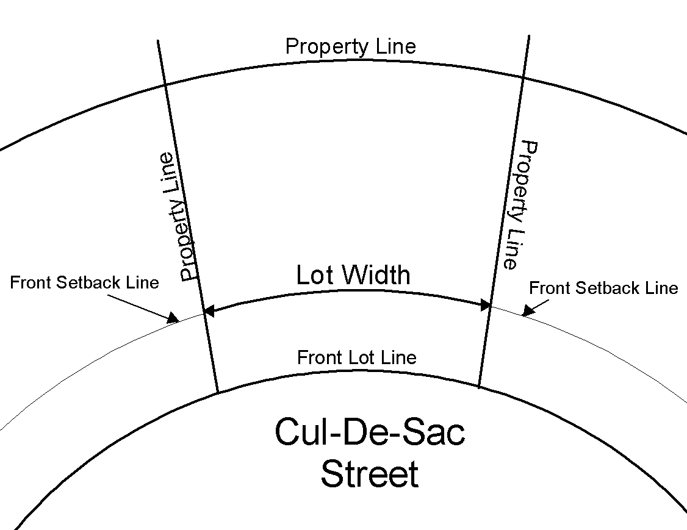

Lot width is measured between side lot lines along a line that is parallel to the front lot line or its chord and located the minimum front setback distance from the front lot line.

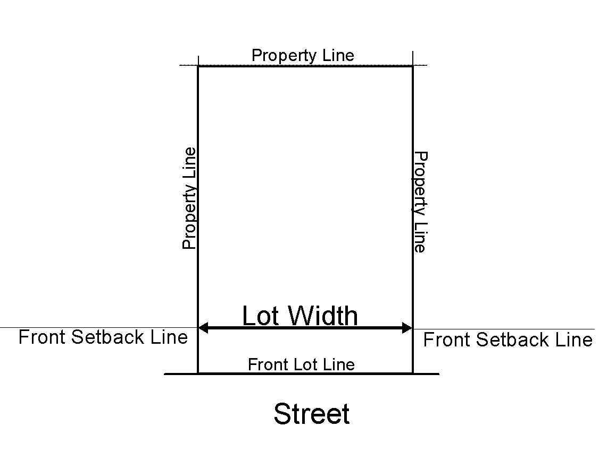

D. Lot Depth

Lot depth is measured from the center (mid-point) of the front lot line to the center (mid-point) of the rear lot line.

**E. Setbacks**

Setbacks refer to the unobstructed, unoccupied open area between the furthermost projection of a structure and the property line of the lot on which the structure is located, except as modified by the standards of this Article. Setbacks must be unobstructed from the ground to the sky except as specified in this Article.

**1\. Exceptions to Setbacks**

Every part of a required setback must be open and unobstructed from the ground to the sky except as set out in this sub-Article:

a. Trees, shrubbery or other landscape features may be located within any required setback;

b. Fences and walls may be located within any required setback, subject to Article 60.3F;

c. Driveways and sidewalks may be located within any required setback;

1.  Utility lines, wires and associated structures, such as power poles, may be located within any required setback.

e. Signs, where permitted, may be located within any required setback but may no obstruct views of vehicular traffic;

1.  Uncovered porches, uncovered steps to building entrances, uncovered patio decks and uncovered balconies may extend up to 10 feet into any required front, rear or street side setback and up to 3 feet into any required interior side setback;
2.  Openwork fire balconies and fire escapes may extend up to 3½ feet into any required setback;

h. Sills, belt courses, cornices, buttresses, eaves and other architectural features may extend up to 3 feet into any required setback;

1.  Off-street parking and loading areas may be located within required front or rear setbacks, subject to Article 100.1D.1;

j. Chimneys and flues may extend up to 2 feet into any required setback;

k. Accessory structures may be located within setbacks only if expressly stated in Article 60.3;

l. Solar panels and other apparatus needed for the operation of active and passive solar energy systems, including but not limited to, overhangs, movable insulating walls and roofs, detached solar collectors, reflectors, and piping may project into a required rear setback by up to 10 feet and into a side setback by up to 3 feet. In all cases, however, they must be located at least 3 feet from all lot lines; and

m. Satellite dish antennas may be placed in required rear setbacks.

1.  **Reduction for Public Purpose**

When an existing setback is reduced because of conveyance to a federal, state or local government for a public purpose and the remaining setback is at least 50 percent of the required minimum setback for the district in which it is located, then that remaining setback will be deemed to satisfy the minimum setback standards of these Zoning Regulations.

**3\. Alleys and Rear Setbacks**

In computing the depth of a rear setback for any lot abutting an alley, one-half the width of such alley may be included in the rear setback dimension.

**F. Building Coverage**

Building coverage refers to the area of a lot covered by buildings (principal and accessory) or roofed areas, as measured along the outside wall at ground level, and including all projections, other than open porches, fire escapes, canopies and the first 2 feet of a roof overhang.

**G. Height**

Building height refers to the vertical distance between the average finished grade (based on an average of the highest and lowest ground points) at the base of the building being measured and: 1) the average height level between the eaves and ridge line of a gable, hip or gambrel roof; 2) the highest point of a mansard roof; or 3) the highest point of the coping of a flat roof.

**1\. Fences or Walls**

In the case of fences or walls, height shall be measured from ground level on the higher side of the fence or wall.

**2\. Exemptions from Height Limits**

The height limitations contained herein shall not apply to any of the following:

1.  grain bins or other farm buildings in the R-A and R-1 districts;

b. electrical power transmission lines;

c. belfries, cupolas, spires, domes, monuments, flagpoles, chimneys, radio/television receiving antennas or chimney flues; or

1.  bulkhead, elevator, water tank, or any other similar structure or necessary mechanical appurtenance extending above the roof of any building if such structure does not occupy more than 33 percent of the area of the roof.

**3\. Exceptions for Towers and Antennae**

Towers and antennae for 2-way or commercial broadcast, wireless telecommunications, or towers for wind-powered generators or pumps may be allowed to extend above the district height standards if approved by Conditional Use Permit.

**Article 80 Subdivision Design and Improvements**

**80.1 General**

**A. Applicability**

The standards of this Article shall apply to all subdivisions of land unless otherwise expressly exempted.

**B. Technical Specifications and Design Criteria**

Standards and specifications for public improvements and technical subdivision design standards are addressed in the Ray County Road Standard. Compliance with the standards of the Ray County Road Standard shall be required on all publicly dedicated rights-of-way.

**C. Exemptions**

The standards of this Article shall not apply to the following subdivisions:

1\. A transaction between owners of adjoining unplatted property which involves only a change in the boundary between the land owned by such persons provided no additional tracts are created and such tracts comply with the lot size and setback standards of the underlying zoning district.

2\. Property which is created by adjoining unplatted tracts which involves the combination of contiguous parcels of land into one larger parcel.

3\. The conveyance of land for street or railroad right‑of‑way, utility or drainage easements, or other public utility purposes subject to local, state, or federal regulations, and where no new street or access easements are created.

4\. The conveyance of land for public recreation, trails or similar easements and public purposes.

1.  The division of land into tracts 40 acres or larger in area after the date of

adoption of this Article, provided such tracts have at least 100 total feet of frontage along a state or county-maintained roadway, and access to the tracts and any remnant parcels comply with state minimum sight distance requirements.

The exemption for cemetery plots exempts those creating individual subdivision plots from the subdivision process. It does not exempt those creating a cemetery.

8\. The division of land into cemetery plots, provided that such

division complies with RSMo 214.

9\. The division of land by any court action pursuant to the law of

eminent domain.

1.  A division of property through the probate of an estate, or by

order or judgment of a court of law of competent jurisdiction of

the State of Missouri.

**80.2 Layout and Design**

**A. Compliance with Plans and Regulations**

The design of subdivisions shall be consistent with:

1\. The _Comprehensive Plan_ and all other adopted plans and policies of the County Commission; and

2\. The requirements of the zoning district in which the property is located and all other applicable standards of these Zoning Regulations.

**B. Traffic Movement and Pedestrian Circulation**

1\. The design of subdivisions should create an integrated system of lots, streets,

trails, and infrastructure that provides for efficient movement of people,

bicycles, and automobiles within the subdivision and to and from adjacent

development.

2\. All subdivisions should provide for the efficient movement of through traffic by providing a completely interconnected hierarchy of streets in order to avoid isolation of residential areas and over-reliance on arterial streets.

3\. Subdivisions should be designed to provide safe and attractive pedestrian routes to nearby commercial centers, employment, recreation, and other uses.

1.  Street layouts should be uncomplicated, so that emergency services, public

services, and visitors can find their way to their destinations.

1.  The proliferation of individual driveways on state and county roads should be

Avoided. Homeowners are responsible for all maintenance of driveway easements. Specific address signage may be required.

6\. Residential subdivisions involving 5 or more lots should be served by internal street systems rather than relying on the state and county roads for direct access to all lots, unless exempted by the Ray County Road and Bridge or the state regulating

authority. If the decision-making body allows direct residential driveway access to state or county roads, the decision-making body shall be authorized to require shared access drives and other mitigation measures to reduce the number of access points on to state and county roads and thereby promote public safety and efficient movement of traffic.

**C. Streetscape Appearance**

1.  Lot and street designs should be designed to avoid extended distances of back yard frontage on arterial streets, and where that cannot be avoided, buffering of back yards from those streets should be landscaped with buffers and fences.

2\. Edges of subdivisions should include adequate landscaping and buffering to improve the image of the area, and to protect future residents of the subdivision and adjacent developments from adverse impacts caused by significant differences in use, development intensity, or development height.

3\. Lots and streets should not be designed to require significant numbers of adjacent dwelling units with front-loaded garages that dominate the streetscape.

**D. Open Spaces**

1\. Open spaces should be integrated into and throughout the subdivision, should be connected with each other and with open spaces in adjacent development.

2\. Open spaces anticipated for use as active or developed parks should be located on relatively flat, well-drained terrain.

3\. Open spaces not anticipated for use as active or developed parks should be located on prominent high points with significant views, or along significant and interesting geological features or wooded areas, or along significant drainage.

4\. Subdivisions should be designed and laid out in a manner that creates the least damage to the natural environment, avoids to the maximum extent feasible, significant natural resources such as prime agricultural lands, wooded areas and wetlands.

**E. Specifications and Standards Generally**

1\. All public improvements shall be constructed in compliance with the standards and specifications established by this Article, the County Code and adopted regulations, including all design standards and requirements set forth .

2\. No subdivider shall be relieved of the duty to construct public improvements for the subdivision until all public improvements are constructed, approved and accepted by the county. This may be accomplished by an irrevocable letter of credit, cash escrow, performance bond, or other financial improvement guarantee acceptable to the County.

**80.3** **Required Infrastructure and Improvements**

Infrastructure and subdivision improvements shall be required in accordance with the following table:

| Zoning District | Streets / Roads | Water | Fire Protection | Wastewater Systems | Sidewalks |
| --- | --- | --- | --- | --- | --- |
|  | See 80.7-80.8 | See 80.9 | See 80.9 | See 80.10 | See 80.6 |
| R-A | Per County road standard, chip & seal may be required | Municipal, PWSD or well [1] |  | Central (gravity) system, package plant | Not |
| R-1 |  |  |  | or septic [1] | required |
| R-1A |  |  |  |  |  |
| R-1B | Chip & seal required |  |  | Central (gravity) |  |
| R-2 | Asphalt may be required [2] and |  |  | system or |  |
| R-3 | Perimeter road | Municipal or |  | package |  |
| R-MHP | improvements [3] | PWSD [1] |  | plant [1] | Required [5] |
| C-1 | Asphalt, curb and gutter [2] and perimeter road improvements [3] | Municipal or PWSD [1] | Hydrants required unless exempted pursuant to 80.9-B | Central (gravity) system, package plant or septic [1] | Not required in Rural or Low Density Development Zone. Required in Urban Density Dev't Zone [5] |
| C-2 |  |  |  |  | Required [5] |
| C-3 |  |  |  |  |  |
| I-1 |  |  |  |  | Not required |
| I-2 |  |  |  |  | in Rural or Low Density Development Zone. Required in Urban Density Dev't Zone [5] |
| PUD | Infrastructure/improvements as required by decision-making body as part of PUD approval (30.8) |  | Hydrants required unless exempted pursuant to 80.9-B | Infrastructure / improvements as required by decision-making body as part of PUD approval (30.8) |  |

\[1\] As approved by required by decision-making body.

\[2\] See Street Design Requirements (Article 80.7-L). Ditch Sections may be approved in all

zoning districts.

\[3\] See Article 90

\[5\] Sidewalks not required if all lots within subdivision are 5 acres or more in area

**80.4 Lots**

**A. Width to Depth Ratio**

The width to depth ratio of any lot shall not exceed 1 to 4 (width to depth).

**B. Lot Area**

Minimum lot area shall be subject to the underlying zoning district in which the subdivision is located, unless modified by Planned Unit Development.

**C. Land Remnants**

Remnants of land containing less area than prescribed by the underlying zoning district regulations shall not be permitted unless designated and accepted for utility or public purposes.

**D. Side Lot Lines**

All side lot lines shall bear between 60 and 90 degrees from the street right‑of‑way line on a straight street, or from the tangent of a curved street.

**E. Setbacks**

Front building or setback lines shall be shown on the final plat for all lots in the subdivision and shall not be less than the setbacks required by the underlying zoning district or any other regulations adopted by the County Commission.

**F. Double Frontage**

Double frontage lots shall be avoided except along arterial streets unless, in the opinion of the decision-making body, a variation to this rule will give better street alignment and lot arrangement.

**G. Street Access**

Every lot shall abut on and shall have direct access to a public street, shared drives along common lot lines may be approved. The decision-making body may approve lots with access to private streets when included as part of a Planned Unit Development.

**H. Existing Structures**

The subdivision or re-subdivision of a tract or lot may not be permitted where the subdivision or re-subdivision causes an existing permanent structure to violate the standards of these Zoning Regulations.

**80.5 Blocks**

**A. Width**

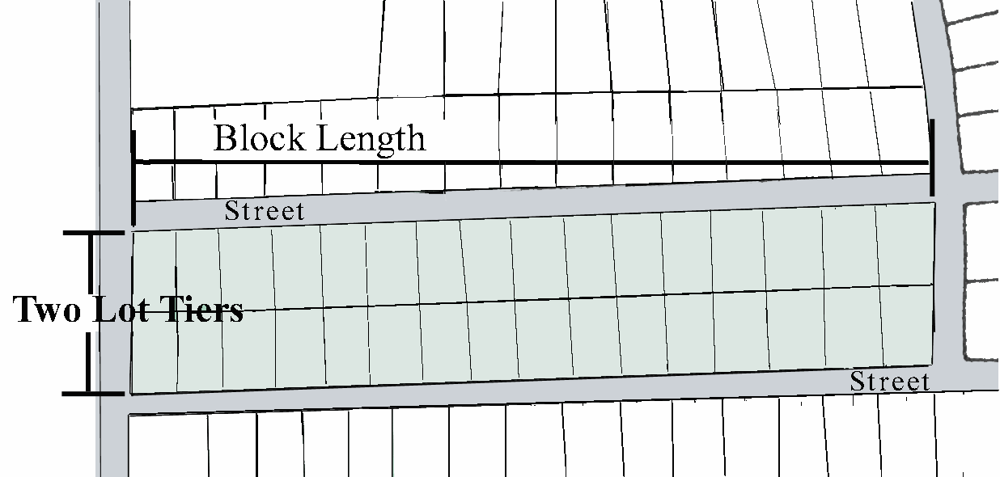

Blocks must have sufficient width to provide for 2 tiers of lots, except where single tier lots are required to separate residential development from through vehicular traffic, to separate lots from another type of incompatible use, to allow for unusual topographic conditions or when adjacent to the outer perimeter of the subdivision.

**B. Length**

Block lengths shall not exceed 1,320 feet, and when blocks longer than 800 feet are proposed, pedestrian crossings may be required near the center of the block.

**80.6 Pedestrian Circulation (Sidewalks and Trails)**

Where required (See Article 80.3), sidewalks shall meet the following standards.

**A. Location**

Sidewalks shall be constructed in the road right‑of‑way within 1 foot from the property line. Sidewalks shall also be installed in any pedestrian easements as may be required by the decision-making body.

**B. Paving Width and Depth**

Sidewalks shall be constructed in accordance with the _Technical Specifications and Design Criteria Manual,_ unless different design criteria are approved by the County Commission (e.g. trails instead of sidewalks).

**C. Responsibility for Installation**

Construction of sidewalks along streets shall be the responsibility of the builder on each lot adjacent to the street. Sidewalks in common open spaces, greenways or parks shall be the responsibility of the subdivider.

**D. Maintenance**

The maintenance of sidewalks shall be the responsibility of the adjacent property owner or homeowners association and shall not be the responsibility of the County.

**80.7 Vehicular Circulation (Streets and Bridges**)

All new public street and bridge construction shall comply with all applicable state and county requirements. It is furthermore intended that all streets be dedicated, along with required rights‑of‑way, to the county. The standards of this Article shall apply to any street or bridge regardless of location in a Rural Density, Low Density or Urban Density Development Zone, unless otherwise expressly stated. In the Urban Density Development Zone, compliance with more restrictive standards of the nearest municipality may be required if such property lies within the Stated Annexation Intent Area of the subject municipality.

**A. Street Curvature**

On streets with reverse curves, a reasonable tangent shall be provided between curves to permit a smooth flow of traffic.

**B. Street Layout**

Proposed streets shall conform to topography as nearly as possible to reduce drainage problems and grades. Intersections shall be designed with a flat grade. Except in unusual circumstances (as determined by the County Highway Department), in hilly or rolling areas, at the approach to an intersection, a leveling area shall be provided having not greater than 2 percent rate for a distance of 60 feet, measured from the nearest right‑of‑way line of the intersecting street. Where any street intersection will involve earth banks or existing vegetation inside any lot corner that would create a traffic hazard by limiting visibility, the developer shall cut such ground, and/or vegetation (including trees) in connection with the grading of the public right‑of‑way to the extent deemed necessary to provide an adequate sight distance within the right‑of‑way. Sight triangles shall conform to the requirements of Article 100.4. The cross‑slopes on all streets, including intersection, shall be 3 percent or less.

**C. Arterial Street Intersections**

The number of intersections and private vehicular access points along arterial streets shall be held to a minimum. Unless otherwise expressly approved by the decision-making body, the distance between intersections shall not be less than 1,200 feet.

**D. Arterial Streets**

Arterial streets through subdivisions shall conform to the major street plan of the _Comprehensive Plan._

**E. Collector Streets**

Unless otherwise expressly approved by the decision-making body, collector streets (as designated in the _Comprehensive Plan_) on either side of an arterial street shall be offset by at least 600 feet (measured centerline to centerline).

**F. Alleys**

Alleys may be required in commercial, industrial, and residential areas. Dead‑end alleys shall be avoided wherever possible, but if unavoidable, such alleys shall be provided with adequate turnaround facilities at the dead‑end.

**G. Cul‑de‑sacs‑‑**

An adequate turnaround of not less than 120-foot diameter right‑of‑way shall be provided at the closed end of a dead‑end local street longer than one lot in length. The maximum length of a cul-de-sac street shall be as follows:

| Maximum Length* | Temporary | Permanent |
| --- | --- | --- |
| Rural Density Development Zone | 1,600 feet | 1,620 feet [2] |
| Low Density Development Zone | 1,600 feet | 1,620 feet [2] |
| Urban Density Development Zone | 1,000 feet [1] | 1,000 feet [1] [2] |

\[1\] Or more restrictive standard of the nearest municipality or fire district.

\* Length shall be measured from the centerline of an intersection of a cross street to the center

of the cul‑de‑sac.

\[2\] Length may be extended because of terrain or site conditions.

**H. Offset**

Local streets shall be at least 150 feet apart (measured centerline to centerline).

**I. Right‑Angle Intersections**

Under normal conditions, streets shall be laid out to intersect, as nearly as possible, at right angles. Where topography or other conditions justify a variation from the right‑angle intersection, the minimum angle shall be 60 degrees.

**J. Existing Half Streets**

Whenever there exists a dedicated or platted half street or alley adjacent to the tract to be subdivided, the other half of the street or alley shall be platted and dedicated.

**K. Streets Adjacent to a Railroad, Freeway, Principal Highway or Arterial Street**

Where lots front or side, but do not back on railroad right‑of‑way, limited access freeways, or principal highways or arterial streets, the decision-making body may require a marginal access street or frontage road adjacent to the boundary of such right‑of‑way in order to ensure traffic safety and maintain adopted levels of service on the adjacent street. The distance from said right‑of‑way shall be determined based on a consideration of minimum distance requirements for approach connections to future grade‑separated intersections.

**L. Street Design Requirements**

Unless otherwise specified herein, the minimum design criteria, construction methods and material specifications for public improvements required by the Article shall conform to any specification as to procedure, equipment, or materials not covered in the street specifications and standards APWA, and subsequent amendments and/or revisions thereto, or the Ray County Highway Department's special instructions, shall be subject to the Missouri Department of Transportation (MoDOT) Standards for Highway Construction, 2004 Edition and subsequent amendments and/or revisions thereto, for all Ray County roads in the unincorporated area. The right‑of‑way, grades and widths for proposed or existing abutting streets and alleys shall conform to the designation in the _Comprehensive Plan_ and shall not be less than the minimum for each classification as follows:

| Feature | Street Types |
| --- | --- |
| Major Arterial | Minor Arterial | Collector | LocalRural/Low | LocalUrban (Res) | Local(Comm/Ind) |
| Minimum Right-of- Way Width [1][2] | 100’ | 80’ | 60’ | 60’ | 60’ | 80’ |
| Pavement Width | 36’ | 32’ | 28’ | 24’ | 24’ | 32’ |
| Degree of Curvature | 28 | 28 | 28 | 28 | 28 | 28 |
| Side Street Return Radii | 50’ | 30’ | 25’ | 25’ | 25’ | 30’ |
| Drainage Structures (type) | [6] | [6] | [6] | [6] | [6] | [6] |
| Driveway tubes | [5] | [5] | [5] | [5] | [5] | [5] |
| Pavement Article | [3][4] | [3][4] | [3][4] | [3][4] | [3][4] | [3][4] |

\[1\] When existing or anticipated traffic on arterial and collector streets warrants greater widths of right‑of‑way, an additional width may be dedicated.

\[2\] Road must have minimum 3 to1 back slopes.

\[3\] Roadbed shall consist of 400 tons of rock per mile (200 tons of rolled 2 in. to 3 in. rock for base;200 tons of ¾ in. to 3/2 in. clean rock for top, back slopes 3 to 1 cut section; 4 to 1 fill section.

\[4\] The County Commission may require dust free surface.

\[5\] Minimum 15 inch Corrugated Metal Pipe or double wall ribbed Plastic pipe.

\[6\] Corrugated Metal Pipe or Double Wall Ribbed Plastic Pipe and must meet Soil and Water Dept. specifications or engineers design.

**80.8 Construction Standards for Vehicular Circulation (Streets and Bridges)**

The subdivider shall install, construct, or provide for the construction of the improvements required by this Article and in conjunction with all laws, restrictions, and codes established by this Article, the Statutes of the State of Missouri, and all other applicable regulations. All required improvements shall conform to the specifications of this Article and compliance therewith shall be confirmed by the County Highway Department prior to release of the surety by the County Commission.

**A. Assignment of Responsibilities to the Subdivider**

The dedication of right‑of‑way and the construction of improvements for new interior roads shall be at the expense of the subdivider. All right‑of‑way dedication and road construction shall be in conformance with the provisions of this Article, and other pertinent codes of Ray County.

**B. Location of Street Paving**

All street paving shall be located in the center of the right‑of‑way.

**C. Construction Plans**

No grading or other construction shall take place within a street right‑of‑way until construction plans have been examined and approved by the County Highway Department and all necessary permits have been obtained.

**D. No Use Prior to Acceptance**

No right‑of‑way may be used for vehicular access until the required improvements are accepted by the County Commission, in accordance with the provisions of this Article.

**E. Access to Adjoining Land Required**

In instances where proposed development abuts undeveloped land on at least 2 sides, a minimum of 2 street accesses shall be provided to such undeveloped property. This requirement may be waived by the decision-making body in cases where a traffic study conducted by a licensed engineer determines that 1 or more such accesses are impractical due to topography, water courses, or traffic.

**F. Connecting Streets Required**

Streets in the proposed developments shall connect with existing streets that abut the proposed development.

**G. Street Trees**

Street trees may be planted by the subdivider on all streets in the subdivision. Such trees, if provided, shall be planted on private property and located at least 5 feet back from the right‑of‑way line.

1.  **Street Names**

Street names shall conform to the County's 911 Emergency Response standards. Streets that are obviously in alignment with other already existing and named streets shall bear the names of the existing streets in accordance with the County’s master street name plan and adopted policies. Street names may be changed by the County Commission after a duly advertised public hearing held to discuss such name change. At least 15 days prior to such hearing, notice of such proposed change shall be published in the official county newspaper and the local newspaper in the area where the change is proposed. After a street name change, notification shall be made to the 911 coordinator, County Assessor, telephone company, post office(s), and other public and quasi-public agencies requiring such information.

**I. Required Improvements to Existing Roadways**

The improvement of existing roads should be improved in accordance with the requirements of these Zoning Regulations. Such regulations apply to all roadways abutting all new and expanded development.

**J. Existing Subdivisions With Unimproved Internal Roadways**

If an existing subdivision has an unimproved road or an improved road that has not been accepted into the County system or is not under an approved 2 year developer maintenance bond, then prior to issuing a building permit for any construction upon any lots within this subdivision, these roads shall be improved to the current County standards.

**K. Bridge Standards**

New or replacement bridge and concrete box culvert construction on all roads in the unincorporated area of Ray County shall be to the MoDOT Standards for Highway Construction, 2004 Edition using the Federal‑Aid Highway Off‑System Bridge Replacement and Rehabilitation Program specifications and subsequent amendments and/or revisions thereto. Minimum standards are:

1\. H S‑20 load design

2\. Traffic lane deck width 12 feet per traffic lane

3\. Equipped with safety guide rails

4\. Designed to the 50 year flood level minimum in the Rural Density Development Zone, the 50 year flood level minimum in the Low Density Development Zone, and the 100 year flood level minimum in the Urban Density Development Zone, or as determined by the U.S. Army Corps of Engineers.

All new bridges and box culverts will meet these standards and minimums regardless of the source of funding.

**L. Bridge Responsibilities**

Bridges of primary benefit to the subdivider shall be constructed at the full expense of the

subdivider without reimbursement from the County. The sharing expense for the construction of bridges not of primary benefit to the subdivider may be established by special agreement between the County Commission and the subdivider. Such costs shall be charged to the developer pro rata as the percentage of his land developed and so served. Determination of benefit to the subdivider shall be made at the time of preliminary plat between the subdivider and County Commission. Final approval of benefit and any special agreements shall be made by the County Commission and recorded with the Recorder of Deeds Office.

**M. Requirement of Final Platting**

No roadway improvements shall be constructed nor shall any work preliminary thereto be done until such time as a final plat and the engineering drawings accompanying it shall have been approved and there shall have been compliance with all of the requirements relating to financial guarantee, as specified in these regulations.

**N. Acceptance of Improvements**

No roadway improvements shall be accepted into, or recommended for acceptance into the County Highway Road System until after the 2-year maintenance period by the contractor and/or developer has been successfully completed and approved by the County Commission. Ten days prior to the conclusion of the 2-year maintenance period by the contractor and/or developer, a written request shall be submitted to the County Commission for the streets, roads or subdivision improvements to be accepted into the County Road System. Upon receipt of this written request, the County Commission shall mail a standard form to the contractor and/or developer, to be signed and notarized by the contractor and/or developer, and returned promptly to the County Commission. Upon determination by the County Commission that all street specifications and standards have been met by the contractor and/or developer, the County Commission shall accept the particular streets, roads or subdivision improvements into the County road system and record the ordinance with the Recorder of Deeds.

**80.9 Water Supply and Fire Protection**

**A.** Unless otherwise expressly exempted, all proposed development shall be connected to an approved water system that meets the following minimum requirements:

| Improvement |  | Development Zone |
| --- | --- | --- |
|  |  | Rural | Low | Urban |
| Minimum Line Size (diameter in inches) |  | 4 | 4 | 6 |
| Minimum Distance from Fire Hydrant to Structure (ft.) |  | N/A | N/A | N/A |
|  | . |  |  |  |
|  |  |  |  |  |
|  | . |  |  |  |
|  | . |  |  |  |

All development shall be encouraged to join Rural Fire Protection Associations and may be required in R-2, R-3, R-MHP, S&O, B-1, B-2, I-1, I-2 and PUD Zoning Districts.

**B. Exemptions**

Exemptions from the standards of Article 80.9-A may be approved only in the following 2 instances. As a condition of any approved exemption, the property owner shall sign a notarized statement that they will connect within 90 days to a public water supply district or other approved water source when service becomes available within 200 feet of the property. This agreement and connection requirement shall be noted on all Final plats.

1\. Single dwelling units located on parcels with a minimum area of at least 9.0 acres in the Rural Density Development Zone and accessory farm buildings shall be exempt from the minimum standards of Article 80.9-A.

2\. Decision-making bodies may approve subdivisions that do not comply with the standards of Article 80.9-A if both of the following conditions are met:

a. The applicable water supplier has reviewed the proposed development and stated in writing that it has budgeted improvements to provide water supplies consistent with the standards in Article 80.9-A within 2 years, or that there is no feasible way to meet the water supply standards within 5 years; and,

b. The decision-making body determines that the proposed development:

(1) will be adequately served for normal water demands;

(2) will not reduce system water pressures or supplies so as to create a hazard to the public health or safety within other development served by the water system;

(3) will not pose a threat to life or property within or adjacent to the proposed development due to inadequate fire protection; and

(4) will not impede the logical extension of services to serve growth in the county in accordance with the _Comprehensive Plan._

In acting on exemptions pursuant to the preceding paragraph, the decision making body shall give due consideration to any recommendation submitted by the applicable fire district. The fire district shall be authorized to recommend, and the decision-making body shall be authorized to approve alternative strategies for providing fire protection to the subject development.

**C. Technical Specifications**

All water supply systems shall be designed and constructed to meet APWA and AWWA standards or other standard adopted by the water supplier. Written authorization from the water supplier shall be required prior to approval of any system which does not meet these standards.

**D. Off-Site Water Improvements**

The developer of a parcel shall provide for on-site and off-site improvements required to adequately serve a proposed development, provided that the decision-making body may authorize development to proceed if the water provider certifies that the necessary capital improvements have been funded for construction within 18 months.

**E. Approved Supply Required**

In no event shall a certificate of occupancy be granted prior to connection to an approved water supply that meets all applicable state standards. The decision-making body shall be authorized to require that a licensed engineer, registered in the State of Missouri, certify that the water system serving the development will be adequate to meet all state requirements and the standards of these Zoning Regulations without adversely affecting service to existing dwelling units.

**F. Water System Construction**

Public water services, including rural water districts, shall be used whenever available. Lines shall be installed to form a closed service loop wherever possible.

**G. Water Meters**

Water meters shall be connected to every lot within a subdivision.

# H. Well Water

Well water for residential or commercial use may be approved only under unusual circumstances, as determined by the Planning and Zoning Commission, Ray County Commission and approved by the MO Department of Natural Resources.

**80.10 Wastewater Systems**

It is the intent of the _Comprehensive Plan_ to protect the natural environment of Ray County and provide for densities that would support common sanitary sewer systems either from existing municipalities, a regional sewer district, or private provider. The _Comprehensive Plan’s_ adopted growth strategy (Development Zones) is based largely on these goals. Provisions set forth herein shall govern the provision of sanitary sewer service in the county.

**A. General Standards**

Sanitary sewer disposal connections shall be required of all properties and uses in the County according to the following general standards:

**1\. Rural Density Development Zone**

Sanitary sewer service may be provided by on‑site disposal methods (septic systems) approved by the Ray County Planning and Zoning Department.

**2\. Low Density Development Zone**

Sanitary sewer service may be provided by on‑site disposal methods (septic systems approved by the Ray County Planning and Zoning Department. Additionally, if any lot of the subdivision lies within 1,000 feet and within the same service basin of a central sanitary sewer system with capacity to serve the subdivision, then on‑site disposal systems will be prohibited and connection to the central system will be required.

**3\. Urban Density Development Zone**

Sanitary sewer service will be provided through use of, or connection to, a central sanitary sewer system except for residences on lots zoned R-A, R-1, and R-1A unless such lots lie within 1,000 feet and within the same service basin of a central sanitary

sewer system with capacity to serve the lots. In that case, on‑site disposal systems will be prohibited and connection to the central system will be required.

**B. Service and Ownership Requirement**

The subdivider and /or lot owners shall be required to install sanitary sewer facilities, or individual sewage disposal systems, designed in accordance with the rules, regulations and standards of the Missouri Clean Water Commission and the Missouri Department of Natural Resources. Installation of a central sanitary sewer system that is not connected to a municipal or other public authority treatment plant shall require the dedication of the treatment facility to a utility agency approved by the County Commission. This provision shall not be interpreted as allowing the County Commission to approve control of a treatment facility by a property owners’ association.

**C. Connection Requirement**

Sewage from a building or premises shall be discharged directly into the community or county sewage system when the system is available within 200 feet (or other applicable requirement) from the building or premises measured along a street, alley, or easement to the encasement of the sewer system. Abandoned or disconnected septic tanks or pits shall be pumped out and filled with clean earth or sand, in accordance with State and County regulations.

**D. Adjoining Properties Service Requirement**

Where a development is proposed to have a central sanitary sewer system and is adjacent to an undeveloped tract of land, the proposed sanitary sewer system should be extended to the exterior boundary lines of the proposed development so as to provide for future connection to the adjacent tract of land.

**80.11 Other Utilities**

**A. Electrical and Communication Lines**

All telephone, cable television, electrical service and distribution lines shall be placed underground, except that this provision shall not include meters, service pedestals, transformers, three phase feeder lines, sub-transmission and transmission lines (34.5KV and above), electrical substations, and other such facilities as the utility may deem necessary to install utilizing overhead type construction.

**B. Gas Meters**

All gas meters must be located within 3 feet of the building foundation, and located within front yards in all subdivisions.

# C. Water Towers

All private or public water towers will require a review and building permits from the Ray County Building Official.

## D. Blasting Permits

Any entity desiring to use blasting materials in their construction process must notify the Planning and Zoning Department, Building Official, County Sheriff, and all residents located within 1,000 feet of the blasting area at least 24 hours in advance of the blasting.

**80.12 Stormwater Management**

A. Stormwater management is a requirement of all development within Ray County. New development is required to be responsible for potential runoff onto and off of his property. Specific requirements are noted in the “Technical Specifications and Design Criteria Manual” and “Drainage Easements” Article 110.

B. When required by the Planning and Zoning Commission, two copies of the final stormwater plan shall be submitted to the Planning and Zoning Department for review by the County’s engineer, or designee, and one copy to the Ray County Highway Department. Appropriate plan review and inspection fees will be paid at the time of submitting the plans.

C. Criteria for stormwater plans shall include:

Methodology of analysis – In developments where the area contributing runoff is one hundred (100) acres or less, the Rational Method of calculating the quantity of runoff shall be utilized. Development where the area contributing runoff exceeds one hundred (100) acres shall be designed using the unit hydrograph method (SCS) or other methodologies approved by the County Engineer.

1.  Criteria for drainage system – Property adjacent to the study area which is undeveloped

shall be considered as fully developed in accordance with the most probable anticipated future land use. In areas where this cannot be adequately projected, the average runoff

coefficient to be used shall not be less than 0.65 for use in the Rational Method or an appropriate equivalent value as approved by the County Engineer for any other method.

1.  Roadways – The primary function of roadways within a development shall be for the conveyance of traffic. The use of streets as a storm runoff facility shall be restricted to the requirements established and set forth in these design criteria.
2.  Onsite or on stream detention and natural drainage ways – are recommended and encouraged where feasible.
3.  Minimum Standards of Design

a. Enclosed Systems – Enclosed systems consisting of underground pipes, culverts,

and similar functional underground structures shall be used to convey storm water

at all locations:

*   *   1.  Where the design peak discharge of a 10 year return period storm is equal to or less than the capacity of a seventy-two inch diameter round pipe having a Manning’s “n” of .013.
        2.  Within the right-of-way of improved streets, regardless of system design capacity.
        3.  Within 60 feet of any existing or proposed habitable building, regardless of system design capacity.
        4.  Where the design peak discharge of a 10 year return period storm equals or exceeds 8 c.f.s . and the collected drainage is generated from more than 1 lot.

1.  Open Systems – Open systems consisting of natural and/or improved open channels with intermittent culverts or bridges crossing streets and other surfaced areas may be used to convey storm water at all locations where the use of an enclosed system is not required by the foregoing criteria.
2.  Overflow Systems – Ease conveyance element of the storm water drainage system shall include an overflow system having sufficient hydraulic capacity when combined with the capacity of the conveyance elements to convey the peak discharge generated by 100 year return period storm without damage to land or buildings, as defined as follows:

i. One hundred (100) year stage; plus 1 foot freeboard, at an elevation

equal to or greater than the lowest elevation at which water may enter

any proposed or existing building or structure.

ii. Design Storm Frequencies – Enclosed and open channel conveyance

system components shall be designed for the following return period storms, irrespective of the land use in which the system is located or the land use in the drainage area tributary to the system:

iii. In-System Capacity:

Floodway in 100 year Flood Plain 100 year

Bridges, Pipes, and Culverts

(any crossing of and/or under roads 50 year

All other system components 10 year

iv. Overflow Channels:

The combined capacity of the overflow channel and in system conveyance element shall be sufficient to convey the 100 year storm at all locations.

v. Runoff Computation – The Rational Method of calculation storm water

quantities, Q + KCIA, shall be used with the following definitions of

terms and arbitrary values:

*   Q” is the quantity of runoff in cubic feet per second and is the basis for design of the storm drainage system.
*   “K” is a dimension less coefficient to account for antecedent precipitation.
*   “C” is the weighted coefficient of runoff from the tributary area and shall have the following values where applicable:
*   “I” is intensity of rainfall in inches per hour and shall be determined for the yearly frequency stipulated previously and as derived from the intensity duration curves included as part of this criteria.

**D.** All construction improvements shall be guaranteed in the same manner as street improvements.

Also see Technical Specifications and Design Criteria Manual and “Drainage Easements,” Article 80.15B, and Article 110.

**80.13 Dams and Water Impoundment Structures**

**A. New Dams**

New dams and water impoundment structures shall comply with the standards of Article 110.1B.

**B. Existing Dams**

1.  **Within Minor Subdivisions**

Dams and ponds within a minor subdivision (4 or fewer lots) may be required to be inspected by the Ray County Soil and Conservation District or a registered engineer to insure stability. (not required for lots 19 acres or more)

1.  **Within Major Subdivisions**

An engineering report may be requested to be submitted to the county with the Preliminary Plat on all existing dams within a proposed major subdivi­sion (5 or more lots). Any dam found to be structurally unsafe or inadequate to accommodate the proposed development shall be reconstructed, reinforced or removed in accordance with all applicable standards, including those of Article 100.5.

**80.14 Street Signs and Traffic Markers**

The subdivider shall install street signs and other traffic control devices at all intersections within the subdivision. Such signs shall meet the size and design standards established by the Missouri Department of Transportation.

**80.15 Easements**

**A. Utility Easements**

Where alleys are not provided, permanent easements shall be provided of not less than 7 ½ feet in width on each side of all rear and side lot lines, for utility poles, wires, conduits, underground conductors, storm and sanitary sewers, gas, water and heat mains, and other public utilities and a minimum of 20 feet along all front lot lines. These easements shall provide for a continuous right‑of‑way. Where the utility company or agency has the need for a wider easement than required above for a specific location, this easement shall be shown on the plat. Permanent easements shall not be obstructed by structures, retaining

walls, ponds or trees. A property owner may install fences and landscape over the easement with grass and shrubs at their own risk. Property owners shall be responsible for the maintenance on their property.

**B. Drainage Easements**

If a subdivision is traversed by a watercourse, drainage way or channel, the decision-making body shall be authorized to require the provision of drainage easements or no-build zones to protect such watercourses. Required easements and no-build zones shall be of such width or construction, or both, as may be necessary to provide adequate storm water drainage for a 100‑year storm and for access for maintenance thereof. Parallel streets or parkways may be required in connection therewith. The subdivider shall have an engineer's study prepared for review as part of the plat process. The study shall address the required width of easements for each watercourse or drainage way that contains flowing water for more than 90 days per year. Such study shall be based on a 100‑year storm, using build-out assumptions derived from the _Comprehensive Plan._ Wherever possible, drainage ways should remain open, unpaved and maintained so as not to become overgrown.

**C. Landscape Easements**

Landscape easements or buffer strips may be required by the Planning and Zoning Commission wherever the proposed subdivision contains or is adjacent to a railroad right‑of ‑way or limited access highway, or where lots back onto a public street. When in residential districts, landscape easements should be at least 50 feet in depth, in addition to the normal required lot depth when provided adjacent to the railroad right‑of‑way or limited access highway. Landscape easements shall be a part of the platted lots and shall have the following restriction letter on the face of the plat: "This strip reserved for the planting and maintenance of trees or shrubs by the owner; the building of structures hereon is prohibited".

**D. Topographic Preservation Easements**

If greenways or drainage ways influenced by topographical features such as streams or ponds, ravines, wooded areas or other natural features are to be provided within the proposed plat, their width and location shall be determined as may be necessary to preserve such features.

## E. Stream Setback Easements

Any development adjacent to an existing stream shall be set back 100 feet from the center of the stream. (See Article 110.2C)

**80.16 Monuments**

Permanent survey monuments shall be placed at all lot and block corners, angle points, points of curves in streets, and at intermediate points as required prior to final acceptance by the County. Such permanent monuments shall be set with top of the monument flush with existing grade. Such monuments shall be installed in accordance with minimum standards as established by the Missouri Department of Natural Resources.

**80.18 Subdivision Guarantees**

Two types of subdivision guarantees are established for the purpose of assuring proper, safe and timely installation and maintenance of required subdivision improvements: (1) performance guarantees and (2) maintenance guarantees. Subdivision guarantees shall be required for all subdivisions, except for those with no engineered improvements.

**A. General Requirements**

All restoration, performance and maintenance guarantees shall be prepared in a format acceptable to the County and shall be submitted to the County Commission. The Treasurer of Ray County shall be the beneficiary of all subdivision guarantees. Upon acceptance of a subdivision guarantee, the County Commission shall deposit the guarantee with the County Clerk or, in the case of a cash bond, may place it in an account with the County Treasurer. The following forms of subdivision guarantees may be used for required restoration, performance and maintenance guarantees.

**1\. Cash Bond**

A Cash Bond is an acceptable form of subdivision guarantee. The bond shall be made payable to “Treasurer, County of Ray.” Cash Bonds may be provided in the form of a cashier’s check, bank draft, certified check or bank money order. A Certificate of Deposit is not an acceptable form of guarantee.

**2\. Irrevocable Letter of Credit**

An Irrevocable Letter of Credit is an acceptable form of subdivision guarantee provided the form and content of the documents are found acceptable to the County.

**B. Performance Guarantees**

**1\. Purpose**

Performance guarantees are established for the purpose of assuring that the developer properly installs all proposed subdivision improvements in accordance with the approved Construction Plans and Final Plat for the subdivision. Should the developer fail to properly install all subdivision improvements within the term of the guarantee, the county may draw on the guarantee and use the funds to complete subdivision improvements.

The county also may draw on the performance guarantee if the developer fails to provide a maintenance guarantee to the county. The county may use the funds to ensure proper maintenance of subdivision improvements.

**2.** **Amount**

The amount of the performance guarantee shall be 100 percent of the engineer’s estimate of the probable cost of subdivision improvements, as approved during the review of Construction Plans.

**3\. Term**

The performance guarantee shall be posted as a prerequisite to recordation of the Final Plat. The guarantee shall be posted for a minimum 2-year period. However, should the end of the 2-year period fall between December 1 and June 14, the guarantee shall expire the first business day after June 14. The County Commission, for good cause and with the approval of the provider of the guarantee, may extend the term for not more than 1 year.

**4\. Release of Development Improvement Agreement and Guarantee**

The county’s final acceptance of improvements will follow the receipt of signatures of all entities accepting the constructed improvements and documentation showing that the developer owns the improvements in fee simple and that there are no liens or encumbrances on the improvements. The county will then execute a resolution accepting the improvements and releasing the developer from the performance guarantee, after which the developer shall record such release.

**C. Maintenance Guarantees**

**1\. Purpose**

Maintenance guarantees may be required by the County Commission for the purpose of assuring that the developer maintains the structure, function and integrity of subdivision improvements in accordance with the approved Construction Plans and specifications for the subdivision during the term of the guarantee. In the event the developer has failed to maintain subdivision improvements within the term of the guarantee, the county may draw on such guarantees and use the funds to correct the deficiencies.

Furthermore, if at any time during the term of the maintenance guarantee the county identifies that the developer’s failure to maintain subdivision improvements has created a clear threat to the public’s health, safety and/or general welfare, the county may, after appropriate notice and demand requirements, draw on the maintenance guarantee and use the funds to correct the identified threat.

**2\. Amount**

The amount of the maintenance guarantee shall be determined by the County Commission. Generally, the maintenance guarantee shall be 15 percent of the engineer’s estimate of the probable cost of subdivision improvements, as approved during the review of Construction Plans. The County Commission may waive the requirement for a maintenance guarantee when it finds that the guarantee is not necessary.

**3\. Term**

The maintenance guarantee shall be posted as a prerequisite to the release of the performance guarantee, unless waived by the County Commission. The guarantee shall be posted for a period of 1 to 3 years, as deemed necessary by the County Commission. The County Commission, for good cause and with the approval of the provider of the guarantee, may extend the term not to exceed the total maintenance period to more than 3 years.

**Article 90** **Perimeter Roadway Improvements**

**90.1 Authority and Purpose**

Pursuant to the _Comprehensive Plan_, and the power vested in the County Commission to require road improvements as provided for in RSMo 64.825 , the development, subdivision or re-subdivision (involving additional lots) of land, may only be accomplished by requiring land development to bear a proportionate share of the cost of road improvements attributable to the need for such facilities generated by the proposed project to promote the public, health, safety and welfare. It is the purpose of this Article to require developers to pay a pro‑rata share of the cost of improving existing county roadways abutting their project to the Ray County Road Standards. The amount of road improvement fee required is included in this Article. Developers are only responsible for the amount of additional traffic created by a project, not any traffic generated by the use on the property at the time of application.

**90.2 Administration**

The County Commission shall be responsible for the administration of this Article. The County Commission shall be responsible for developing administrative procedures for road improvement, considering changes in the land use and density, establishing standards for the improvements, and all other activities related to the intent of the program.

**90.3 Applicability**

The fees required by this Article shall be imposed upon all development occurring after June 10,2005. These regulations shall not apply to any rezoning, conditional use permit, or subdivision application made prior to the date of the approval of these regulations by the County Commission. Development for the purpose of any activity requiring platting, replatting, or a building permit, where fees were not previously paid, shall be deemed eligible for payment. Any expansion of use by more than 25 percent over the level of the original use, shall be deemed to be an expansion of such activity, and shall require the payment of fees.

**90.4 Effect on Other Regulations**

This Article shall not affect, in any manner, the permissible use of property, the density of development, design and improvement standards and requirements, or any other aspect of the development of land or the provision of capital improvements subject to these Zoning Regulations or other regulations of Ray County, which shall be operative and remain in full force and effect without limitation with respect to all development.

**90.5 Improvements as Additional Requirement**

# All subdivisions filed under the Major Subdivision application are subject to a review of needed off-site improvements. If, during staff review, there are concerns, a study may be ordered to assess the actual off-site impacts of the subdivision.

# A. Off-Site Improvements

When a proposed development is projected to have off-site drainage or traffic impacts, the subdivider may be required to complete certain off-site improvements that are intended to mitigate the effects of the increased runoff or traffic counts. Such improvements will be supported by a Traffic Impact Study done by the applicant and included in the conditions of the Final Plat approval. Improvements may include, but are not limited to:

1.  Streets and thoroughfare facilities
2.  Traffic control facilities
3.  Bridges
4.  Storm drainage facilities
5.  Utility undergrounding
6.  Street lighting
7.  Street trees and median landscaping
8.  Accel and/or decel lanes
9.  Turn lanes
10.  Raised medians

## B. Substitution

The improvements required by this Article are additional and supplemental to, and not in substitution of, any other requirements imposed by Ray County on the development of land. It is intended to be consistent with and to further the objectives of the _Comprehensive Plan_ and other county policies, ordinances, and resolutions by which the County seeks to ensure the provision of public facilities in conjunction with the development of land.

**90.6 Construction of Improvements/Payment of Fees**

Unless otherwise required by the County Commission, the subdivider/builder may elect to either construct the required road improvements or contribute the amount of road improvement fee outlined by this Article, but may not combine the two methods.

**90.7 Required Road Impact Fees and Road Improvements**

**A. R-A, R-1, R-1A and R-1B Zoning Districts**

**1\. Four or Fewer Total Parcels per Subdivision (Minor Plat)**

*   1.  Road Impact Fee:

$25.00 per Lot fronting on State Highway

$50.00 per Lot fronting on existing County or Special Road District maintained gravel or chip & seal road.

b. No road improvement required.

**2\. Five or More Total Parcels per Subdivision**

*   1.  Road Impact Fee:

$25.00 per Lot fronting on State Highway

$50.00 per Lot fronting on existing County or Special Road District maintained gravel or chip & seal road.

$25.00 per interior Lot fronting on new road.

*   1.  In addition to Road Impact Fees, existing County or Special Road District maintained gravel or chip & seal roads adjacent to and providing access to a new subdivision may be required to be improved to the minimum County Road Standard by the County Commission. At a minimum, the developer shall be responsible for fifty per cent of the improvements recommended. The County Commission may require a traffic impact study at the cost of the developer or make a determination from existing information from Ray County Road & Bridge or Special Road District.

1.  **R-2, R-3, R-MHP, S&O,B-1, B-2, I-1, I-2 and PUD Zoning Districts**

1\. All subdivisions in Zoning Districts above.

a. Road Impact Fees:

$50.00 per Lot fronting on State Highway.

$100.00 per Lot fronting on existing County or Special Road

District maintained gravel or chip & seal road.

$50.00 per interior Lot fronting on new road.

*   1.  In addition to Road Impact Fees, existing County or Special Road District maintained gravel or chip & seal roads adjacent to and providing access to a new subdivisions may be required to be improved to the minimum County Road Standard by the County Commission. At a minimum, the developer shall be responsible for fifty per cent of the improvements recommended. The County Commission may require a traffic impact study at the cost of the developer or make a determination from existing information from Ray County Road & Bridge or Special Road District.

1.  **New Road Connections to State Highways**

1\. If a new road connects to a State Highway, the developer shall be responsible for all construction and fees as required by MoDot.

**90.8 Deposition of Fees**

**A.** Road Impact Fees shall be paid in full before the final plat can be recorded. The

fee shall be made payable to the Ray County Road and Bridge Fund or Special Road

District Fund of which the subdivision is a part.

**B.** The County shall maintain records of payments of Road Impact Fees in accordance with normal County accounting practices. Records shall open to public inspection in the same manor as other financial records of the County. No building permit shall be issued unless the Road Impact Fees are paid in full or waived by the County Commission.

**C.** When existing roads are required to be improved by the developer, an agreement with the County Commission may be entered into for payment in lieu of construction of needed improvement. Such payment shall be in the form of an escrow account for that project and 100% payment of engineer, County or Special Road District estimate. Any escrow funds not spent for improvement project shall be returned to the developer. No Certificate or Occupancy shall be issued without road improvement constructed or escrow account provided.

**90.9 Waiver of Required Improvements**

In cases where existing County roadways are to be improved in accordance with these regulations, upon written request of the subdivider/builder, filed at the time of application, the decision-making body may waive the requirement for public improvement in situations listed below. If the decision-making body waives the requirement, it shall be done by resolution stating the reasons why such improvements were not required. The grant of such waiver shall be limited to unusual and extraordinary circumstances.

**BLANK**

**Article 100 Development Standards**

**100.1 Off-Street Parking and Loading**

**A. Applicability**

**1\. New Development**

The off‑street parking and loading standards of this Article apply to any new building constructed and to any new use established.

**2\. Expansions and Alterations**

The off‑street parking and loading standards of this Article apply when an existing structure or use is expanded or enlarged. Additional off‑street parking and loading spaces will be required only to serve the enlarged or expanded area, not the entire building or use, provided that in all cases the number of off‑street parking and loading spaces provided for the entire use (preexisting & expansion) must equal at least 75 percent of minimum ratio established in Off‑Street Parking Schedule “A” of this Article.

**3\. Timing of Installation**

Required parking spaces and drives shall be ready for use and approved by the Planning and Zoning Administrator prior to issuance of a certificate of occupancy. The Planning and Zoning Administrator shall be authorized to allow issuance of a certificate of occupancy before installation of required parking if the applicant provides a letter of credit, performance bond, escrow deposit or other acceptable financial security adequate to ensure that all required parking will be installed when weather conditions permit. The amount of the financial guarantee must be equal to at least 100 percent of the estimated total cost (labor and materials). The county shall be authorized to use such financial guarantee to complete the work if the required parking is not in place by the date stated on the approved performance guarantee.

**4\. No Reduction Below Minimums**

Existing parking and loading spaces may not be reduced below the minimum requirements established in this Article. Any change in use that increases applicable off‑street parking or loading requirements will be deemed a violation of these Zoning Regulations unless parking and loading spaces are provided in accordance with the provisions of this Article.

**B. Off-Street Parking Schedules**

**1\. Off-Street Parking Schedule “A”**

Off‑Street Parking Schedule “A” lists minimum off‑street parking requirements by land use category.

# Off-Street Parking Schedule “A”

| Use Categories | Specific Uses | Minimum Number of Spaces Required |
| --- | --- | --- |
| Residential |  |  |
|  |  | - 1.5 per efficiency dwelling unit |
| Household Living | Multi-Dwelling Structures | - 2.0 per 1-bedroom unit |
|  |  | - 2.5 per 2-bedroom or larger unit |
|  | All Other Household Living | 2 per dwelling unit |
| Institutional |  |  |
| College |  | Schedule C |
| Community Services |  | Schedule B or Schedule C |
| Day Care |  | 1 per 500 square feet |
| Detention Facilities |  | Schedule C |
| Hospital |  | 1 per patient bed, plus 1 per 300 square feet of administrative office, plus 1 per 200 square feet of outpatient clinic space |
| Parks and Open Areas |  | Schedule C |
| Religious Institutions |  | 0.33 per seat in main worship area* |
| Safety Service |  | 1 per employee or Schedule C |
| Schools | Elementary, Middle/Junior High | 1 per teacher/employee + 10 visitor spaces or Schedule C |
|  | Senior High | 1 per teacher/employee + 1 per 5 students or Schedule C |
| Utilities, Basic |  | None |
| Utilities, Major |  | 1 per employee or Schedule C |
| Commercial |  |  |
| Entertainment Event, Major |  | Schedule C |
| Office | Medical | 1 per 200 square feet |
|  | All Other Office | 1 per 300 square feet |
| Parking, Commercial |  | N/A |
| Recreation andEntertainment, Outdoor |  | Schedule B |
| Retail Sales/Service | Bank or Financial Service | 1 per 250 square feet, plus stacking spaces per this Article |
|  | Car Wash | Stacking spaces per this Article |
|  | Health Club | 1 per 200 square feet |
|  | Hotel, motel or other temporary lodging | 1 per guest room, plus required spaces for associated uses |
|  | Restaurants (Sit-Down), Taverns, Drinking Establishments | 1 per 75 square feet |
| Use Categories | Specific Uses | Minimum Number of Spaces Required |
| --- | --- | --- |
|  | Restaurants, Drive-in or Fast-Food | 1 per 75 square feet of customer service and dining area or 1 per 150 square feet of gross floor area, whichever is greater, plus stacking spaces per this Article |
|  | Theater | 1 per 4 seats |
|  | Vehicle and Equipment Sales | Schedule B |
|  | All other Retail Sales and Service uses not specifically listed | 1 per 250 square feet |
| Self-Service Storage |  | 1 plus 1 per 2,500 square feet of storage space |
| Vehicle Service/Repair |  | 5 per service bay |
| Industrial |  |  |
| Industrial Service |  | 1 per 500 square feet or Schedule B |
| Manufacturing and Production |  | 1 per 500 square feet or Schedule B |
| Warehouse and FreightMovement |  | 1 per 750 square feet or Schedule B |
| Waste-Related Use |  | Schedule B or Schedule C |
| Wholesale Sales |  | 1 per 500 square feet or Schedule B |
| Other |  |  |
| Agriculture |  | None |
| Aviation/Surface PassengerTerminals |  | Schedule C |
| Wireless CommunicationsTowers |  | None |

\* Religious assemblies may reduce their parking requirements based on shared parking arrangements

with uses that are inactive during religious activities.

**2\. Off‑Street Parking Schedule “B”**

Off‑street parking spaces for Schedule “B” uses must be provided for all components of the use, as follows:

| Activity | Number of Spaces Required |
| --- | --- |
| Office or administrative area | 1 per 300 square feet |
| Indoor sales area | 1 per 200 square feet |
| Outdoor sales or display area (3,000 square feet or less) | 1 per 750 square feet |
| Outdoor sales or display area (over 3,000 square feet) |  |
| - Motor vehicles/equipment sales | 1 per 2,000 square feet |
| - Other sales/display | 1 per 1,000 square feet |
| Indoor storage/warehousing/vehicle service/manufacturing area |  |
| - 1-3,000 square feet | 1 per 250 square feet |
| - 3,001-5,000 square feet | 1 per 500 square feet |
| - 5,001-10,000 square feet | 1 per 750 square feet |
| 10,001-50,000 square feet50,001< square feet | 1 per 1,250 square feet1 per 1,250 square feet |

**3\. Off‑Street Parking Schedule “C”**

Schedule “C” uses have widely varying parking demand characteristics, making it impossible to specify a single off‑street parking standard.

a. Parking Study

Anyone proposing to develop or expand a use requiring Schedule “C” parking must submit a parking study that provides justification for the number of off‑street parking spaces proposed. A parking study must include estimates of parking demand based on recommendations of the Institute of Traffic Engineers (ITE), or other acceptable estimates as approved by the Planning and Zoning Administrator and should include other reliable data collected from uses or combinations of uses that are the same as or comparable with the proposed use. Comparability will be determined by density, scale, bulk, area, type of activity, and location. The study must document the source of data used to develop the recommendations.

b. Review by Planning and Zoning Administrator

The Planning and Zoning Administrator shall review the parking study and any other traffic engineering and planning data relevant to the establishment of an appropriate off‑street parking standard for the proposed use. After reviewing the parking study, the Planning and Zoning Administrator shall establish a minimum off‑street parking standard for the proposed use.

c. Appeals

Appeals of the Planning and Zoning Administrator ’s decision may be taken to the Board of Zoning Adjustment in accordance with the procedures of Article 30.14

**C. Rules for Computing Requirements**

The following rules apply when computing off‑street parking and loading requirements.

**1\. Multiple Uses**

Lots containing more than 1 use must provide parking and loading in an amount equal to the total of the requirements for all uses.

**2\. Fractions**

When measurements of the number of required spaces result in a fractional number, any fraction of ½ or less will be rounded down to the next lower whole number and any fraction of more than ½ will be rounded up to the next higher whole number.

**3\. Area Measurements**

Unless otherwise expressly stated, all square-footage‑based parking and loading standards must be computed on the basis of gross floor area, which for purposes of computing off‑street parking requirements, shall mean the gross floor area of the building measured from the exterior faces of the exterior walls or from the centerline of walls separating two buildings and shall include the following areas:

a. the area of each floor of the structure and

b. all attic space having headroom of 7 feet-10 inches or more

4\. **Occupancy‑Based Standards**

For the purpose of computing parking requirements based on employees, students, residents or occupants, calculations shall be based on the largest number of persons working on any single shift, the maximum enrollment or the maximum fire‑rated capacity, whichever is applicable and whichever results in the greater number of spaces.

**5\. Unlisted Uses**

Upon receiving a development application for a use not specifically listed in an off‑street parking schedule, the Planning and Zoning Administrator shall apply the off‑street parking standard specified for the listed use that is deemed most similar to the proposed use or require a parking study in accordance with Off-Street Parking Schedule “C.”

**D. Location of Required Parking**

**1\. On-Site Parking; Setbacks and Buffering**

Except as expressly stated in this Article, all required off‑street parking spaces must be located on the same lot as the principal use. Unless otherwise expressly stated, off-street parking areas shall be set back at least 10 feet from all front (street right-of-way) and rear property lines.

a. Street Buffers

Off-street parking areas containing more than 5 parking spaces shall be screened from view of adjacent street rights-of-way by principal buildings or by landscape buffer strips as follows:

| Parking Area Size Number of Spaces | Buffer Width Minimum (feet) | Minimum Planting Requirements |
| --- | --- | --- |
| 5-15 | 5 | Hedgerow (shrubs planted maximum of 3 feet on center) |
| 16-50 | 10 | 1 small tree + 8 shrubs per 25 linear feet |
| 51+ | 20 | 1 medium tree + 8 shrubs per 25 linear feet |

Minimum sizes: shrubs = 1 gallon, small deciduous tree = 1½-inch DBH, small evergreen tree = 4½-foot height, medium deciduous tree = 2½-inch DBH, medium evergreen tree = 5½ feet height (DBH=Diameter at Breast Height)

The Planning and Zoning Administrator may permit the use of existing (pre-development) vegetation as a substitute

for landscape buffer strips if such existing vegetation will provide a visual buffer

.

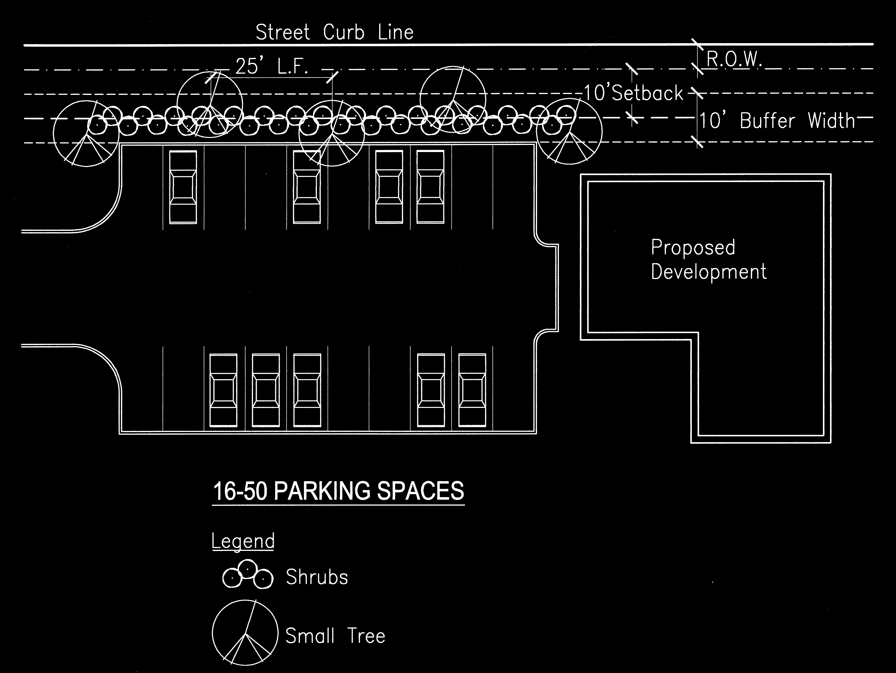

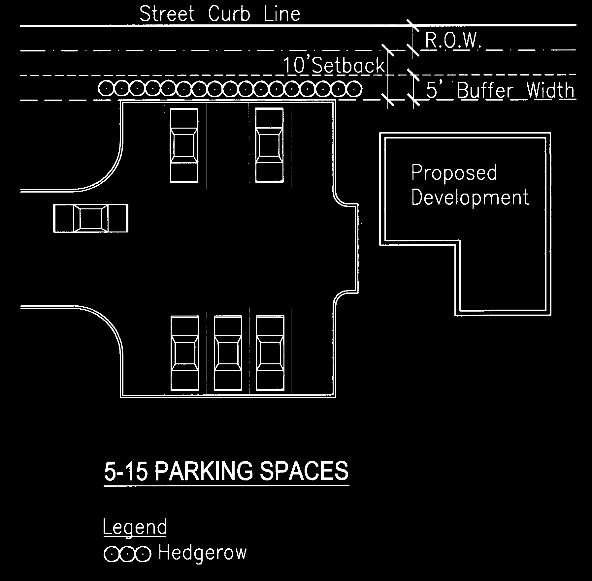

Fi**gure 100.1-1**

**Figure 100.1-2**

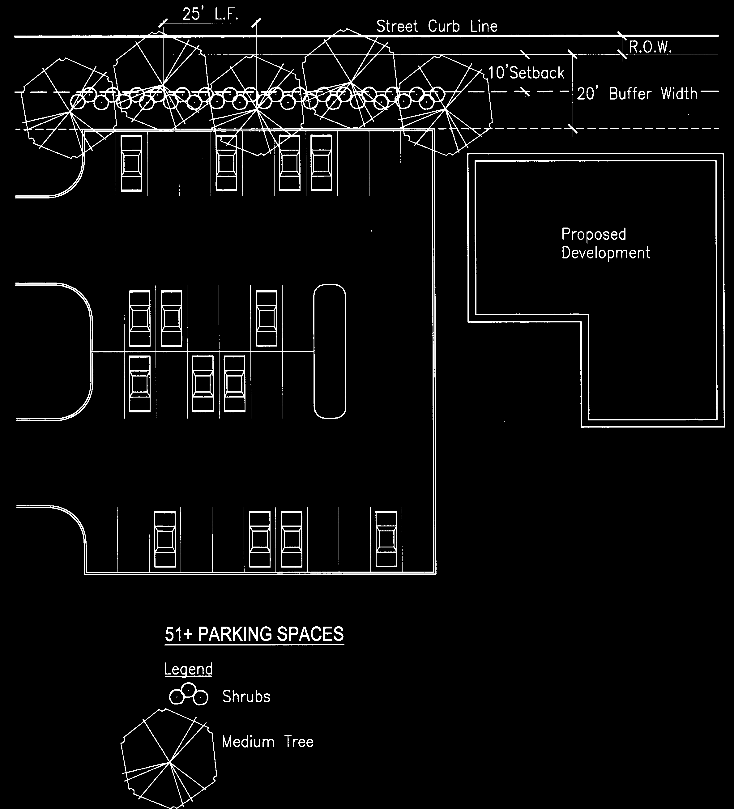

**Figure 100.1-3**

b. Residential Buffers

Off-street parking areas containing more than 5 parking spaces shall be screened from view of adjacent residential zoning districts by buildings, fences, walls or dense landscape planting screens with a minimum height of 5 feet. Preservation of existing (pre-development) vegetation is the preferred method of screening.

**2\. Off‑Site Parking‑**

Off‑street parking spaces may be located on a separate lot from the lot on which the principal use is located if approved in accordance with Conditional Use Permit procedures of Article 30.9 and if the off‑site parking complies with the all of following standards.

a. Ineligible Activities

Off‑site parking may not be used to satisfy the off‑street parking standards for residential uses (except for guest parking), restaurants, convenience stores or other convenience‑oriented uses. Required parking spaces reserved for persons with disabilities shall not be located off‑site.

1.  Location

No off‑site parking space may be located more than 1,000 feet from the primary entrance of the use served unless shuttle bus service is provided to the remote parking area. Off‑site parking spaces may not be separated from the use that it serves by a street right‑of‑way with a width of more than 80 feet, unless a grade‑sep­arated pedestrian walkway is provided, or other traffic control or shuttle bus service is provided to the remote parking area.

c. Zoning Classification

Off‑site parking areas serving uses located in nonresidential zoning districts must be located in nonresidential zoning districts. Off‑site parking areas serving uses located in residential zoning districts may be located in residential or nonresidential zoning districts.

d. Agreement for Off‑Site Parking

In the event that an off‑site parking area is not under the same ownership as the principal use served, a written agreement will be required. An attested copy of the agreement between the owners of record must be submitted to the Planning and Zoning Administrator for recordation on forms made available in the Planning and Zoning Department. Recordation of the agreement with the Recorder of Deeds must take place before issuance of a building permit for any use to be served by the off‑site parking area. An off‑site parking agreement may be revoked only if all required off‑street parking spaces will be provided in accordance with this Article.

**3\. Shared Parking**

Developments or uses with different operating hours or peak business periods may share off‑street parking spaces if approved in accordance with the Conditional Use Permit procedures of Article 30.9 and if the shared parking complies with the all of following standards.

a. Location

Shared parking spaces must be located within 1000 feet of the primary entrance of all uses served, unless remote parking shuttle bus service is provided.

b. Zoning Classification

Shared parking areas serving uses located in nonresidential zoning districts must be located in nonresidential zoning districts. Shared parking areas serving uses located in residential zoning districts may be located in residential or nonresidential zoning districts.

c. Shared Parking Study

Those wishing to use shared parking as a means of satisfying off‑street parking requirements must submit a shared parking analysis to the Planning and Zoning Administrator that clearly demonstrates the feasibility of shared parking. The study must be provided in a form established by the Planning and Zoning Administrator and made available to the public. It must address, at a minimum, the size and type of the proposed development, the composition of tenants, the anticipated rate of parking turnover and the anticipated peak parking and traffic loads for all uses that will be sharing off‑street parking spaces.

d. Agreement for Shared Parking

A shared parking plan will be enforced through written agreement among all owners of record. An attested copy of the agreement between the owners of record must be submitted to the Planning and Zoning Administrator for recordation on forms made available in the Planning and Zoning Department. Recordation of the agreement with the Recorder of Deeds must take place before issuance of a building permit for any use to be served by the off‑site parking area. A shared parking agreement may be revoked only if all required off‑street parking spaces will be provided in accordance with this Article.

**E. Accessible Parking for Physically Disabled Persons**

A portion of the total number of required off-street parking spaces in each off-street parking area shall be specifically designated, located and reserved for use by persons with physical disabilities.

**1\. Number of Spaces**

The minimum number of accessible spaces to be provided shall be a portion of the total number of off-street parking spaces required, as determined from the following schedule. Parking spaces reserved for persons with disabilities shall be counted toward fulfilling off-street parking standards.

| Total Parking Spaces Provided | Minimum Number of Accessible Spaces | Minimum Number of Van-Accessible Spaces | Minimum Number of Car-Accessible Spaces |
| --- | --- | --- | --- |
| 1-25 | 1 | 1 | 0 |
| 26-50 | 2 | 1 | 1 |
| 51-75 | 3 | 1 | 2 |
| 76-100 | 4 | 1 | 3 |
| 101-150 | 5 | 1 | 4 |
| 151-200 | 6 | 1 | 5 |
| 201-300 | 7 | 1 | 6 |
| 301-400 | 8 | 1 | 7 |
| 401-500 | 9 | 2 | 7 |
| 501-1,000 | 2% of total spaces | 1 out of every 8 | 7 out of every 8 |
| Over 1,000 | 20+ 1 per each 100 spaces over 1,000 | accessible spaces | accessible spaces |

**2\. Minimum Dimensions**

All parking spaces reserved for persons with disabilities shall comply with the parking space dimension standards of this Article, provided that access aisles shall be provided immediately abutting such spaces, as follows:

a. Car-Accessible Spaces

Car-accessible spaces (also referred to as “universal spaces”) shall have at least a 5-foot wide access aisle located abutting the designated parking space.

b. Van-Accessible Spaces

Van-accessible spaces shall have at least an 8-foot wide access aisle located

abutting the designated parking

space.

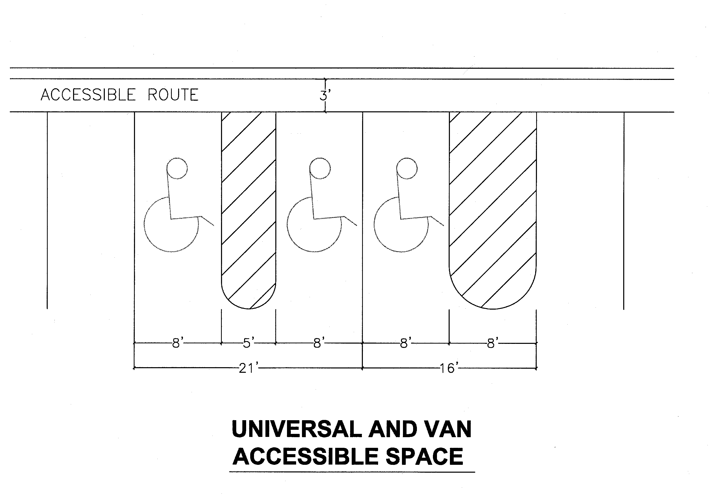

**F. Parking Space and Parking Lot Design**

**1\. Parking Space Dimensions**

Required off-street parking spaces shall have minimum dimensions of 8.5 feet in width by 18.5 feet in length.

**2\. Aisle Widths**

Drive aisle widths adjoining off-street parking spaces shall comply with the following standards:

| Minimum Aisle Width for Specified Parking Angle (feet) |
| --- |
| 90 | 75 | 60 | 45 or less |
| 24 | 22.5 | 18 | 14 |

Note: Two-way drive aisles shall always require a minimum width of 24 feet

**Figure 100.1-4**

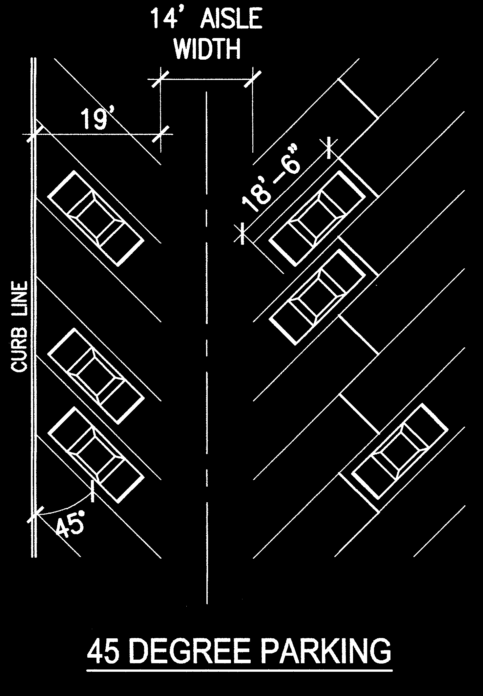![](data:image/png;base64,iVBORw0KGgoAAAANSUhEUgAABooAAAhMAQAAAABBF5ZEAAAABGdBTUEAALGOfPtRkwAAAAlwSFlzAABcJwAAXCAB5JtTnwAAqjNJREFUeNrtvc/PNbmV31fVJatkjKCSs8jIgKASEAPeZZRVFFhWteEgDgID/gOysJwfMLJJ5JW1EN6qThvTWSTpLIPASM8uyCpGVgECuKvRiNtAgvQAWSSLTLqUNiAZCazqaGBdjW7fSvGQhzxkFclDVt3neZ93LmfU7/ve5z5V/PDH4ZeHh2RRPNIjPdIjPdIjPdIjPdIjPdLLTvXw3Dk4PbXTc+fg9NS/eUjL/Nw5OB/p8tw5ODuVy/W5s/BA+tOIVCy3587B6al/82qpe1OQqmn9TyMMeKuRqvV/XxG9a1YffOef/p2PhufOKTvVItvLsqxIui+16/9eCdAr/Lm2yfUL03PnlJ2ai6iOZRlJLXXDSgmgg/gTfv6CkNoVqV5zPBedriWh9pahBI6VSiLNz51TduouooUBkhZEK1K5KNAXjHQpeoM0rxSD/PQFIonRqJVIOtMLIIlPrwbp5YjaRSFdS2MARI1skObcNzx1KmFEkkg607KWuvXTW6mRpux3PHGqRS11y38pMo+ZBkyJtJhaGp87q9zUAtK1aFYkzLRAWmtnEVQKafjm9587p+zUAdJlNXrQxAjSO+t/6/W/gFQU33zunLJTLxpZN6+ZB50AqRKYK8y8/k0hDflveAakKyBVy/DKRhoWMeCOWEsvJ2EtVSTXlZgMrkgj/PcFIl03SLVCWmH64o1D+uELROo+lRavtpAWMA+j+MfLQ2qaFakXRtxGKl8uEkwBxbhE3EPNy66lQtTSOp/tKdKXYjb7jhRILxVp+Yj6JZvfCKRBTjZeLNJiIV0k0vUFIzX2DK+9rN1oRbq9cUgdKLsXjDQTpLmXSBeNNDx3NpOQlNNrMh91cz+B7+GqkZaXVE+ilip70tpN3SQ9RINBGp47owlIF4k02UgrSr1Itwp6Y19MarS3Vad+6mfpbb0YpCnz+c+BdJVIxOL1UwdeVuhBL7GWlMUjQ20/toDULWDMXx7SZaMeViRwHLfUzf+SkEAQlXShdrXfgLRW3ly+UIvX3VYqG0mglNTN/9z5TEi1mi+ZPIshCZDAySeR/v7XnjufiUi98OMNBKmWKM3aHF+gIKqvgFSZXFd6xeKtXiIVL6nZSfOwGrbKmDSBpFCMT/y5s3ka0trDxOcvcHKxZtusW4CWUEjV8lLnS+Aq3kd6gQ5kjdRbSMubgGTXkkSBhbM3Aal5I5CGDdI70m6/xPUl0HhOLV0Q5WWuL0Et9RaSiCrqXzJSvbF4iPRDgjQ8dzZT0tY8rFNaQOo10gvTeLUUREQ9dLNwEkmYF9nwmquK7NJILSKNL9mIW5MLXUvTC0bqL3QKKGImuy9UdMpLRBJ9yfY9CKR2Xt5d54Hty0USMVAu0tCv2vXFTi4g8s4gjbDEJOPxChmUd/uTFzQ0bRc2he1rrjJqEpCWj15UiKFG0j5xkArtVQeCrulnLyoQVLv5TY7B3fWlikAuXyiSvb4kkOorrC+JOPGXh1RfHJ83mDeBpKL5Xx5SJbLaU583IF0W+HR4iUiQWrpi9oP1f+X8Q/HpTW2KeVkWD1Kzu3xUi5oRo9PQv6wFpkCq8C8//M5zZ+WRHumRHumRHumRHumRHumRHumRHumRHumRHumRHumRHumO6e3nzsDR9NOinItqaoZqgQNuxPKLcO5/+7kzlp9uRXUp6rkda7GOXsEiWbd+3j13xrKTOMPrWjSXbhKrzrBOu1z6Qa7cvsxkI40Q33rBHZsvM9lIU/3GIc1vBtLQ3IpWIV3eEKT2JnanTxBnIy3ei0cStTR3gHST49KLR1prSWy4by4iDK+obyrK/81AEiGUGD/+cpHg1ELYcN/I7Zt6L8YLRhq7RWy4n9oLhCPXbwKSqaU3EEnEwb8RSKLhjZ1oeG8a0ptTSyvNMiik4s1AWruRQeqnNwFptd9vGhLU0oJI8xsgiKCW3lnraWrfGKRV3i0fLQMYcTip8U1oeL3YeSob3huCNIvtIkP/hiF9LCQRnOLzRiC1UEsKqVFIy8s6rcdFuryRSD+zkcqXjvSbZfn8zaulz29vXC39/FZI9bD+r3n5SM2ydL9GpDejlgTSci06gvTS+5JC0g3vDailellaqCVq8d555++9aUjDixZE9XJ705Cq5dZopDdDtlq19GZMLgDpUrxJs1qFpHwPbwRStVwbqKVGXSLz8pHK5Sq2Br+xSG+GaxIa3ox96U1CUm7+6U1Yq62WS7OS9Nb60stGKkVIylS8SetLCql/g1YBi+VSYS29IcvPe0jikKX+5SLphtfI+6XeiFqaxTnI0JeaNw9JXMYLTq/hpR0zuYcEfUkc8PXm1JKMmnxDkPq51EiX1wOpeWc+hiSuvilk1OT8miB9fOwq4x6u6ZBI0+uB1B5GErUkw3XHQnpbXzhSN4oDymQtDW9GLXVws303dvLqkUrMBAv5v4Opyi2V9pNjSF8piq+uPXKo5VGa5SwuDZX/O5iabKSDtYSpso/C+/rxJ7bPjVT82//iOc/R6VXuLx414ndL5TX3N19bJDj68c1Caqbc3zytL52d8k9AfG2Rsq3Da4tU5mfr6FB7r5RvHV7bWmrGNw7pgEh8XRte9kC7VvDriXSgK72utZQtw19fpGwZ/voi5Q+0r6vFy5fhxesqW6vpwC+/ng0vX4YXr2vDO+S6eD2RjliH1xPpgAwvXlPzcMg6ZNVSlfwbqZkanxqpHhK+XKZ8WaVjjs0cI56EVI3pmToy0IpaSv/9OuXLGa7t6lj3bj9Jv8vq3kgHZrQKKfmdaQ0vHemIDBe//nH6tS73Rjo00Ipa+k1yy713w7sl/4aV1ol6sn24s8Wr52NIqxFPdsbcueEdtA4CKXmsvnPDa48RCaR6Skf61h2Rjq7zroKoTrUPlTiQMQEpbZXzmAyXSMkWZs0l36SsX/5B2tOno0ifXJNDHOuh5JfCipQ2zhxx4SmkS7KWr4eKr6KqMfHC5MMnb4qGlzoQ1PSe2ijSkBhvyO+mHssrkFK9ZpXnrjkPUpV07VxCZjzWHuZLiWK8Epfs8pHqJBWZ4O/yNFFASpS+9dAl9KUVaUx4eELH9mSiE0iJEqQWVwfzkRKqtEiZpPsGMKilxGlkXSz8Bp/EX6RM0uvRgwTulDT70JQLvwyqoU8ZyhNK19dEpTslbTCs30244LR6J6FKk6yDz9q3n4jcpdmHukmwYdVHCVWaMtBWvpKSSGn2oWkTbFj1cdKdtfxG6p1AtO+JMkzTD99IsOFF/X7KsJQgw73V0L4HNEkm7xspNqxKsuHHB1qNlDTtapYEG1Z/mILU8b/rNToKKck+NCk2rE7hTyha/7RKmoe0ztSkdPgkpISu5HcvKKSk2XGKDV+REh6dEJTib6IKKUk/JEwt1O3W3JSgWf1NVPWlpCWdlGEpEYn9zcC0CpFSBtsuxYYlzZb4wizgdEGklNCqJB2aMiylaFb/UxGJax+6b/35d5dbwmplktKY+I8N0CokZp3DhQLx9OVvfv3ZZ1/8+T/62fibFBue0PoD5kwj8XomE4mmBFua0JUCjUoj8UqoTEfi948Eh2dIC2okvn2QNvzPDA24Ut8qvtFU3/n5X7r+9r/7TDS5A0gJJirUpjQSX4wnSesUG36GDLeQ2A05xYYlKY0zZLiFxJ4i321Y4luHoLVHjZcwKCTNFlKq9IQZrY3E7Zxl2gSIj5SwdBcccUzD43oyqiSkhY90igy3kZhiPG1Ol4DE93eVc+inBIkpR+rlf+UjVQkHafJlRtjaEyRmZ2qX/5yPVC8/5yKdI8PFT9/XIEwx3i3f4CM1yyds+on91HATJUjMJcX+loDULu+xvzpyvxkpe9LwmP1zuSYgdQs7OuccGe4gsZbny+WSgNTfuNE5VcLC0sRGYtmHapkTkJYrFylloB3YSKzF7FVaN+yXi8OkmF9t+EiRJkrNA8t9u0prfi2tVcrtSx2/4UW+SWuJ5RlfpTUfaa1Sbi31bKRYE7WQOEPDKq35SGuVMpESxHDM2ncUKayd1ANvCUhrlTKR6s/5SLGf077EEePtNamWuCGW7UdsfRvLpI3EGGxXy5TQl25cpG7g6tuobussJIYoWQevBIt35cb2XtlHF0WdLmZWKxLDPpRTAtJaorxaWjWOOM+Rk6Jm2bJ4HDFeDglIxcxEWsuSixSdqdpIPO2YgMSNwF6LnosUHb8cJJZn/A5Ir8S5YKxvxmeKDhJLjJ+PJNRly0PyxXd5kVgr6+cjiTlAw3k1R7TZFo/n0zgfSXhymFI8rgacWmKJ8fORxBDPnDDFy9xF4tiH85FE0dcsKc4YOV0kjhg/HQmGQ95MnaFvXCTOZJ0/q2UiQTlWLCnO6BiueeDYh9ORwIrxljUZ2XNrieMZPx1JahaObuW4ZDdIjME2DYmR0SsbieO33yAxtg+lmYd4RlX/5ew54qx9bpAYk/WzLZ6yYhzdypHV7Xt/7HwS74CnIw3wB0O3slY3NrXEmKx7+tKPcpF+orIyR7/JWt3YIsV7oKeW9nMUR8J5JwOJtaq3RYqXhAdpv1HEkXB0ZyCxIiO2SHH7cHItYdEzpDhrNN4ixa1KGtIQexx23iZqmHjrlDtI0UnWybWERR/Xrby1zx2k6FT43L6kiz6uW3kB+hvZyjD+59aSLvq4buXtad6ppehgey6SLvo4Em+9Zg8pJsbPbXjGGsUc/dzAjB2kWJM9F8n8WkyKM8Nn9pBihuXUhkeKPqZbmSGIe0ixwfZUJLIQ0UWQmJERe0ixbngqEmnlESnO3b2+ixQR46cikaKPiDzuHqtdpEg/PBOJapwIEjfWfxcpYh/ORKJFH/GKc/cj7SJF5OGZRpwWfUSKcwMjdpGKf/hkSLTbhr3i7Fj/faTwYHtmw6NFH5bi7BDE9r29b4Z74olIVtGHpTh7n+x+LYUr+UQkq+jDupUdgriPFO6KJ85q7bWfkG7lb5P1IAUNpudWDQ9S8PV2OG0IiX+IlAcpuHJ2YsOzW0NoisffVOdBCj7gPCPu9NmQFOfH+nuQgvbhPCSn5EJI/ABlD1JQ9Z7X8BzDHJDiCZvoPUjBej4PySn6bvZ+MyHW34cUGthOQ3KLPiDFE3YC2SGGvFI5DcmdAQV0a8IRc75aCjnzTkNyF1EDujXh0AgfUsijfhqSW/R+pJRTAXwNL1TTpyG5ZtUvxVOuVPDWUqA/njUubSrFL8VTjqvZn1wUQftwVi1t1hNKr8hLOVTIixQY285C2hS991TKpNNqvA0voEDOQtq+wYeUdB2TH8lvH85C2ha9T+QlXbjiR/KL8ZOQdoreh5R0pYIfyV/ZJyHtlJnPK550JKEfye6SPz4faWchwiPFOTt2OEh2bdNB8CSknT2vHt2adjx4AIna2Op8pD3DvOrWatzJyVgkpAASNTM1HdfPQdor+hVpr5GlnfQcQKL2oaHj+jlIe0UvamlH56UdeB5Aov2noYNgmsYb9r+9u0xZX/d0XuK9hyEkUt8cpP0HeWtpr+hXnh2kxJvNQkjEPpyPtFv0K89OBHziEe4hJNKBrbN3TkHaNcyrFN/pS4kXroSQiOerzu9LvhcPe58utm2V2Ui8UiGERIrnfKT9ol+GbQhb6q2oDlIHZdRP9F/l74vN5nGk/Tf7LJ4qgP/D/rQft30pvgkriLSIPlPiAXCtOCeyEyeNlWebB1X07pJSP24dX6lXKthI1SIg9LE8cGzainRbkUhRnYGkit6dmnfTFin1ZhEbqQaIVp20U8J5ff2yLOcjqYHWvV1iRXIfk3zhijypGlMDEGu9TOJflagfiVSdjfQKy3C0Pm7n1iVIvqXHOklA1I+EmOX7RHUpJFKaJyBh0btnzbUXMb+wIJLvUrIbXieyv3YhibTW2frGXmCejYRF75493FxXJFuMJ99dZHtbe6gXPE1xrbP1jb1ojGcrcRxo3ROia4FkN7Xke8nsWgKkEo/x1EiXosmfLw17n+KMuXGOoqyv61zdkqnpdxfZSMttbdzVcpFWvFveWwtxGf/Wd09HwqJ3karbivTDt8kn6TebOUjzaq3rZZayYf3v+kboRRykBEGkNc4WaVUuVlNLOIASkWiceLm2s2VaxwrZdfqL+H+JxPA9JCDp3uKeNl4u/WhruvR7D61aEgNqP4kDT4Bj5enUaRnWIsNxJG2Yq+X6TRtpbSUUKeP6caeWbKRJnGcDI4dVcp4tWfPup7tIJDbcKYgVyZp2JA+0jhEX4nRFuhbyYi+BtCjX+9vkdw6bB1L0rljol9Fqahn3HjoND1TWVY2s/ShG9+1qgqeW+O4UUueuSu2Wj2zrkEy0gzS3VzWXAKQvuEgeL+9ewyPLzlukd63nZFww7EOaFNKXvzlaSzufUdeTG/qwvD+Sf+ZcMLzT8FYkaRME0qXfIh22eKS3bJGsGVSGddhFulCkdnvI+VGNR2dArquhsZHSB1pXPYiZxSTkPTS89XnNpVk2R68etXhWbLhTS7VdgDkXDNtIPwWki0JqxaFkFU41SDYOIpkZ0E92kCb6z5zrxzdOr2XWSIU4W7DcHtx+tJb0wtU6PrlhRPbMPdXfpZDc4XvqLmbRtLvoqUYUiT0uaQlc3cQRYVayb+/MumDY3d5YKiT1pv4iGp7jozmIZIq+3YZuVIetwyaGaJV5FtIM10AcQdp+Muocb5Fq66Os68c3x8HYSMsESHZhHexLZovmEkHKu2DYbXhr9xTL2gqpPAFp84ku+moHyTrLP+/68c05RAus1HeI9IenIxkZ3uwg9dQLlnf9uIvUWEiV8ET88gPH2eaJ5mf2JWodNsNOudB35V0wvEG62UhDtdRfOEjHZKuR4Ts3ldhIOQPtzpleV4q0NsPyWl5d/+H+o+bdTzfmQRvmatneVNLSixFzZPgO0mruCJJwq1yKm/PqQ33JLL/Ui1P74vXvE/WVI8OL7bjUXyEAXSG1cgXNEXmHkEzR792YeG3Ju2Jbh31IjhFfrFqS/jzX2XYIyQy07U5XutIPswbaTcMrbSR5fHR9JpLx/7TbrlRPxArmDbQ7SNMWyfVMHbJ4ZiFi5y6+diRIWTK82DS8SiEp9aCe351YS8Yw7yi8vuh+pTtY4r3hPiQxAxPmQSLhHc8tC4lVS6To2x3rULRfaNC8gXZj8cSqnJGtlWrtzRGkwfon0TjbCIdV03U/00iZ1qFoP7WQhGoEpNlCsl9+pOGR1rSNQ1l5uwkFZYY3fBepW+TGKMmCi8MnIpGiF9LEplp5DVL9j3ORbIsnLvXSHiK9ONzYbz7Ql6hhXgWks6D+SrR49BHkWge3lvoLRcKJdGPPLg7UEjXMK1JnDQ8iyKufMAo5tyu55gEiObSHCM2sMygeqCW64l8uH9luDTHjk25EkXK7krrt3rxFIqlgFNEMxfKvI10OrFxQw1wun9hIYtrRjwopb0YLSE4M0aSQICNipBWPbi9WTPcBI251yuVT21MjeJdBISVGf1Ik+2x+jTQWqs7EkmZ3sYa9/L5kyza4r3I0/74CkhoEs/xdEsmqJTBxDa4vVULoCwPeXa2NiPkLm3ZoHSCZ3xLTjvXFKiAv2zo45gFMnF4FhDoTSP0sAyrekt/KryXbMPc2khAWAgkaZ65mLdxakkg38KaN0j/dwGqGNZTn15ItVHv7olTgFc6OU5Fgygcr6sIsNAbJCk7Kdk06GqdbbpUz4ytRUbAuCfAgWeYB5kcrz0rVzNJNKNwPa+ugTSa74TlF360Wlfi9xN+qRQVS5srwDRKUmYhOuQm7B82wFnFSs2VTs2vJCa0TI7i5VhUGIo2UPdBuFjbh+PVlWhvgOpuB19XCOzlZDqjsvuQYZoFk5oEw7RDbE0TbyPR3bZHAahci0usqulUvm8IF9BAZbLMFkWOYRV81bn3gFeZO6Nb8gXaDJMY+uUgmwrxEPF6lxkPSuHPVg+sfkUj4czBAAkno1uToTx9SDRCFRFoACVYBwUyYrOV6W11Xo6ghHWGqmtq3JdIB62AjNXLsg9GiWyp5C7paBST5ybV4puhl4JioEo1kmpoQeQesg23xDNK8NjxAuslwXavD5poHU/TSdAvpo7cJGN4VKT36M4h0kXHiLSJ1cvmZzKkzJxdmoFVrZRJpdHnX4eOIddhBuoqgl0lFPKxIrdJh5rSlJKRKI5mBtl503CIi0RK7HJDhxZ55mMUfQq4qpEatmZiSy7R4pjc2ck4BsWEKiQiLtfKSY8MtJFpLyuKVcupXyjrDu47NS5PMg6klo6l6srKEfrXJ/MY1bbfzBom6UyqJBE6VaiqUUFaahayxpiAZ82CsGJ1TKCSiIavlgAwHJNpevvK//fg/WJ/9wxluluvkq1uVFz3257n5TZGUFtJoP1x0qwMyfIMUTLrP5lk8MwpUdJok3XZ02lEuSWchbJF+zkbSzT3JPOi+ZLzhtYUET7WCtpPunt9BCm1vtJN+bV4tGcPcLFdzO60aIUbyK/x7XveRPuX/PorxPCTTW1ZlbxZipHmwrDZG++QifcK+gdRcdZCDRARVhzsgAGkW/7WaGvOGwADSwP7uGESag0hk4FlHBbMWst0sUGzXcFORxq8zv4s+3a/u/9hjHpzyKKCv6N2zUhDZZ51u13ATkX41s26hLKwp3I/YSJiIYe5nF8nSdNVRpPe+uLBFomnxP9n5adDO0IFHIOn7OuS+AfrVht8V9pE+mV/xro8oyARgd9ExfCgz+elq0RTSVU3Urcf1Hx0iEkgtu6L1zZ67R6TNoV+loXX9rLZLVousEnvh5ZAML2CobdgWRhd1vWf5g7VEG3c3K90I64AOL/N+wBDSfzPXbCTd3uq95j6HfpX6u7qLinmoll+D+LE6M/OuzQDSJwlIOmPtHtKPQr9J89nBhrxC6lfxF6teDk3SFVLDN5pYnB1fcshkFf3a6nqNdHF3PmWGrJHHv5dgHnSj71Pbu9Vb2qs8VwKR7KbGN+EeibDWUuduE/EnFC5Lqla2xol2+R01B5RzQXu3M//RnrDh9pNLv/A7pHxfmYykrYNQIMoRVaATwnKtMi8XFsnTVFak5Zoqxit+vcpEZrRXhQTtqxMNsMyU4b4go/aTL5aZH9si+0SCjVS/pr8vZEOtl9Jhm1yV2ZV8Tpf2k98uEz9sQnp2k1WYsWJikJZIU6FOabF3O/MNj291o31vLa+EBSp1akIaEdE4zaJ8a2vbrQpYqrUG2oSu5FPbAml4i9/b1akJaURk4BEVDD5PcYjECB9ZkS+BI8V3s7KH9IlozgkH34tspPo7ftfkE3SHQpLZt5sIe1bgX91YkW4pIgS+mWD15UtMPkGqdGIl7qpUkfXuhK7kzfOKdE0JqyphtYH9dZnIdAFkvzgxpVfL23YvT+jVXjO99iXxFH5LupqQ15Tf0e8Tv1vC+pVCstakE2S4N8vte1Dk/CCkLn1YqiykWTocGoVkD5j8hSX/6sba8ET++CvYa32nDks0vssgLTK8x7EO/HKaAkjihXz7UE/JwxItLwjAFEjrmAu1ZGvWBOsw+n7SfgZFzt+ysZZqlzi1sGa0EmkQk3QYC+wZ7cx+qGd1o1u+XAeIz27/0bJ8+fkPi3/t7//+X//3/tz03R+9LX74Ff218e2CvPdV8myJ9pZ+ucr9wIhk9eKECI6f7n8MAXEpSayuL7dVzPz7H/KJLFeqQhpgA+/VnR7xrYNPsyYjkTRzX25cZfKVKn5j7U/tNV+z+jbVNeWq7n/7JebyJirgDkj0H4tEAhMhTvezennKXTeD/0cyb2+Fn/a3xX/+XPMX/tpf+U//nxXnn/zyf1y+y3671VuWny+6lsQpAlYvT3AOBQZSHdXOH2wXvvtFJHtMXD6GfqTXJ6ymxrcOoRrQSPwl38RhyW71gFRDLQ2F28v5A21of6pG4pdQ4mzJCaR+R3gb5LhUuIHj/JYS2r2ukfijXOJsyTbMfamQpA8613Uc8pZoJx5/U1eix8s2zN8qIKJn3EOK3IRKUygLxonHrfUyLSxhMwOiSI4MH7kPDQUZlSaoguv5qhKR3HyKbYZyvuTK6XOsQ7X8WgdoMMuoTrPhG6RO7viSGwfoDxNcx6Ego3rRATfc8KqEhY7d1MK+lOKQDA91knrRu8zYF2CnOvH2kK5ys0XmQOuT4ZCaxYQYMj1fyWtLe0jLhzC7tUwH3zoEG1RraolrHw4GLcFWm046kK2slfyiCh6a3pFaYorGVCeeD2nM93cFp1U9qSXeM5OdeG4Sjv5WLsZYujLhWJHgELqQWuIdr57sxNs+QPiYYHCzmvA5MlyMtCTEkGUfEoelfaQKVgGd+C7+E6bg40nD4w22RyN8CqlbRY+0veEJA20on/XyGUFiDbbNQRsu534w0bdaRYp1CP2wWj4gfYlVUO3ReBiIIITABNsbnuSW96dysaL5OWK8OTgsSSSYGln10rKfG4n1v1pInMH2cIiPOvHD1XQdGyli7a/WSQKcwTZ/h7/OPN6eMNBP+VOWSMF/30Li+NEO7ZaSWVJvsaM/v2AjxbqHva+WU/njYaTrzsvqkW1JY5lsP7bCyo5k9bvM7ykDYw8Z3cAd76JDjY10ZO+ndcFjEEk2MdffxV1Lj95dZB80cii8j2sKVaiuZR3WXsydLkVDwO2+lHvYWRqS7DWuDOciRQdPu5aS7zrKQVIH6NonzIzcEK94qTvHlB3ZKslHEi9xBlp21Fp8EHGQ8k5KTUUaN2+6em9B3WQ4mkPb4h0536Ng/6rcZkE/EbKNGeMVH2ecvnRkczjbtACS9SJhaZlI8Qy6SAd2B7CRxC4yu5cL2cabXTCakdPw8s87S0SyrYMwzLwwDobTxT31PfP41yQkMQJZvRyqjIfE2HLr7tg8sJeajSRagjVgQmviuSYZ669uX0pw1GQjib2EtnUY4c1D/Fc5voTNdQP59iFFTDkyXL6ZgcQZZNp3nS9lD7Z+pbKzy85+y20X6UdF7Pc8SG7Dy5+IXxJ+YFsH2Zr60f7OHhJnJ+YGKV+Mp9SS7e+a4A+OFOf4sDrnpOrwclQe0rc3n9jlpgyzFT61n1jlvamlfDGegLQblMKIEWD5crZI2YOtF2l7mIItp9UYyxB5LEeCK4gOiHFvjrZ72m1v+MxGYgU6dRukbDHORyp3BlqWa5qVtW0tZQ+2XqTt7R0z/Rd23joq8ngNaAcp9zAWL1I1uowT/Rca5rhurf+AhfTJFmni/OI2zb4flC6SNYPRhjmuW3nGeAcpd7D1/toGaW+gFUjfjLyBF7m10/By7YMfaXI+2LUOjEkAL2M7tZTrGfdX7mz/c0+GA9IQfgFzeLFqSY2JmfbBj+SIPNurbYre1a1uYk4SrFpS3TYhepEm/285SPvWIe6cZB6IYiHhFUV59sGP9H37n/vWIa5bmXGdFlJ6zDhN/oKwdevW31XIxhjxt3ItsY10tV5zJyS7XaviE4NhBIm7pGoj4fUC47lIthTfeMNFEm0+olu563kUqcR72PLmF/4M2brVXnae5Z8iciASf8AdWxwkyZJ3EYg/Q7Zu3YvvgpC4iAuZmyk6LpkI66wz9/xI5rzJYiPD5R9wa1VYt7LncRSp0nc0ZNkHJtKuDIdrl8JI7N5AG544tEAVGvfXeUiWbt0daMVp6REpzi5mitQseLJc1mSdibQb/bnEkdiDpY30kQpczbIPAXs1kb/bMnyQ75NNPojEzpKN9A4OtjmT9QDSj81fbbWlrINq8iGvOL/hUKR2GboD9iGARHTrrgzvbr1ACvlb+cN/+y49A1KfbJUz2AaQiG615LQeaK+deHFIiiecsvGxhVQdGGx5SLvndy1zE0NKOCaGNLz+ZgLbM8JUAkhGtzrbLAb4o14m2G8TmF2kbLklSMvV7Kjgnj/JQzJHVdlyWi0pwP0nU1C3JvQEF6nNH2wDSEa3bpedC7jXpQaRF1C+Qw6SvG4JB9v0mW3gN4xu3fWGry+uI7o1QXUS81DKoxgmqwBPQhqKUhbVnr8LbjsB3epFSjFXpJYqeQaI+nf6YBtAWnWr7ET7C0uwZSEoxVMUGqkleZ4axmunx4QG3iqQ5D0Q1lPxVaL/hpFSujYJ5ZAH16B9iIaQbtJ3A0ij6ie2DFevhlLEQxP2U8oEjjQ8uRUTN2QeOx/fSSUi7fm75FgokEqvvzXFZ7VB0oNt/v1oO2mSSLv+LqlYQF36kJLEjIUED0SkYwfk7yPtHqMrN3l1ISme1GSIeVCSVYvxM5FmOYzu+rtk75VI4/6vJ3nhSC11EumAfvCnb0mk3YFWbitpQ7o1aS2FhOuq6kExfuTurU36gdRvVpgIngcvWzo0e5+/Nalfd6aW8NYR3JJ5eO8VSd+G/TDVngwvyd24HqQ0KdOZKSB6vFA/HNpTskWaPf4uZZWkFN9HSpuQkni8Rc+a1buG85C+A0jWQFsZGQ7/hHN296sjLSfGPGh1p/XDnPKgcPoGIO0uLKnXVgEpntZejBHXSPUd7EMNM9a9+C4t/QWSR4qn9eodpOIO+qEeViR7wFRDOe6mDkjxxL16BslsPu+xBZ6HVA3rkLM70OJu6tLvb01U0KYvGSS0D+li3JvKcUXaXVjSm0/9/tZEp6JBModiNufbB0DatQ64y1YOi7tIiR3AIJljXo4483xIUzfuyvDSNHefFE/NhkEi59kf8Yx7kOZ+DMhw+MAnxVMbC0XSj0Nn3omD7U/6cS+QmhzFCap5T4qn5sIgkZNrjnjG/Ui7Mrwnc5txX4qnCrNdpOb8wfb7y7C3sFSYk1h8LuSEAygV0sf4TLKVvzpfjP/lxd4J4Qy0hV+KJ3sUSS1RpNPF+HeW9yb6by3D9Sc+KZ48OhokcuxdrVfWUx/nTc3y4UD+idaBnPFReRz9yat3Gqm0kFThnef5auzzHPRAaz716dZktw5Boou2qCVPsw+1jaSDUkzDk0gbW5A+3uspIL2Oo1lOF+O1fciUHmgp0m40R/qRGbqW6ClQ7aJnuMNpSCP5V6llOFFAeOCz84snIX0KzeSrJw629r1aWoZbSLu6Nd3o6nGJFqO4KWJ91Vsn2ge7RamZU7nQk3r7Xa94etPXtURvYere++2RMJU4kppcVsvy2WTeCmsyo/17GQaKIJny6d/9EnvzWYOtvUcEfVDL8r6D5EZzZDQTgmQ+XMqrFuNj8iP330OrWy8sLQuRC7su5IwwGY1EVGt5K2/a8zUlP3I3Wcc5ahn+5c1FcnVrRivR5oGO47fidvbKmXXKsPZ3/eZa0wF+3OjWZBleEDc/RboWt+pAmMpOqi2kV/jhx1eigJod3ZpTog06vUjLWJGWkz3j9ac7SM1SXUuqLKeNbs3pytqPR4pxnfn1A2rkc+xD9z6pbZxZtrf6UlIpPm9cyDmuRDQPVLXWgIST9fkMpFf08EOcAfWXtZmFkXI0JgYJWKp1XoeH+kwxXl7oEZVKhldwiZrxQu25kHNejkqcIq2GtJu05jtDjNczHcnNJH19U1CKZ51chw3PUq2joOpPtA/t1P5KI+kZ7QKvMahbr3iWCxuRahtJtL0TB9uuaH+tc4dF312F/CEKaIuUVZwGyTy6A6TmRPvwqmi/0CWjlupF17GRti7krFMNEIkefL62hRUp5Pn6btpLxFFxBkkVvXj++iaigMDzSv2teaYJLR7tvgvY8eq8MBVxVNw047/IsnNvibpNNEfeuZZYS5YQl3MBHeY6pj/Wecma+enH6h80vmuxFJCU4uRteW9GI95ZqhV8AKlhKj/2/qQXhY/h79rfdQEBGZpd5LUPrKXOUq1gANvlD+DfXOnob/hXiqQXlmbw2gWkeI4ML4zGI0IcXrS+sE4U48Hdz8uIseLEG17b12QBEqm1zIkNBtwQIS6RLslhKn6kiSKR+C7RNCq/FM9UzNiXbNUq/b1dmmc8aHGXUW3bNDJc+YRMG5BIBjHTiaiMuOU+nsE5OWj7wGwAYaRBhb9j0a+tWrqP/VI8c/apZrWlrVrXLraMevhljngRJBX+rv1dIjYc3Fz6OzL2XoPkzgHUrNYR4kX30fr4Mk2Mz4GflSvSAH/DmAp56cBAV5yd2UWuuFS1RIW4GBn6UdgLbR8GzqNChVotg9y2WRIfW3frLSRHt+bOp9W4RIW4GL/FrNYsDPIeHkJaM1rBQ/RAC7twxKuoboWAcUTMFWLK4rlIC3SkJPsQuX1CHTeirYNo1xdo4wTJkuK5vmtl8eg8WrQEuaFIT9ZZTw83PLVtU7VhcRzt2p3AEpnCbGk0R/YRkarhNbYQF4MFtQ+sNhBDgiyS+K5mkeOFiySLMX/qqZAcIS6qRQy0OoxtYDwqVKrCjomf40ArmtjaU+FKSmvLqNGt2cetqr5EL1VSKgXsQ8pkPVRLYrQRexy1v0vaU4HjQ8oOYFK15M4tLlJXYntkhakEkRYRK25ts4D/Xa1nW1I829mmxiVXiKv9Znr6znECBPPQy22bZKAVRVZdvbo1f32h+xR+1XYfS4UvPtMrZ8NBpAKQ6EDbqj7r8Yrnn1ysaskR4mCFupupPY4YZ7QU9DZ1yg9Q2lKc6tZ896HsSxshPhWys3YJYWxz/Ct6t/PFhOe6SKoh5jt5EcnkB5DGAofDET5kDLacoVEPtJPSK7YUr4xuPeCKl0iWk39SIgW8AzjYMkwqIxPWQCvwXCmuveIHfLyyL1ke8QlLM1GMx5EqS4bDK8aNFJcBKgc8bR1oPMd9rN7SEWceQ4zHkai/Sz7YleJatx7wh0okx32smncDk3VZhoxhgnHsqnxWCdYBHgi6lRSn1q0HQkhkX7KEuDZCwuvV8O1DHFpZMWJ3dqX4eGwhv1W19J/sIBVpk/V4LWnroAsRdKvJfosBKkdWgDpVS+aTxWgUah/io3kUiQ60ShA3l30X8oFbDxRSvRXi8MMUMR4fSfRAa0pKSBXXhSyQjqymysO3a9OXSuKntuxDNMfRLxBvOLZnj1f80Jo3DrUjfkBfUoFnXP0oah/m2Bd0fJdRJR4pfijMZ6Pxatq6pdND/j2qH2Il68pw+Mz2ikPRrkiHNnuoKaDx8mshjh+zV85iSNTfhZOZ0vWKDyDFD63ia98DlotWrVigbPsQQ9KB1FdT9aWtW8HyrpP6Q7FY2jWJFBZSTT3jsc4UQ+qQYiJuQ6NV4CtwufrtWPipmgL+Gf0Oy1tIjVPUsMaQrlhMA1Erlm6VlVctx0ItMB7PXHpP35EkxiNIJpCa+tgs3SonBOVybMG7/dRZ2DRCHP5FJusxMR5BorudjTWykPAQjWNhjZsgAbtxSzlmF3Mmkj44YDabiZx2rjKxHOpKK5L8fd1hVyTLqo7swTaCtJXhiKTHDMWi96XmIuEpD+o5vTVQiA5bLX+sfxRIERFjtlkMNBSGSnE07f1UHEnte6pZYVtYrOF87Uj//EPm0adhJGy27c3y7VKxgi3FDX9PRfpENQL1GkehwL30C2+wncMvkq8R67NO0KmlkqEYjyF1n/x2ps9zpDHcS7/wxHgYiRyUuRDnTU3eh6Xq7rtIRvrCCshzkRqahbB9CAKXN/o8k2cqxRe0VMMxpE+/kM3qz0r7AKp1JlmBLKgPwvohjKQbl2nIgGQaOnrejsxoJdKsWrkso+Zi+TcUElqrKfCksLdVT9LF4+hQeiPeG5mRo8G061CrVIEsO2epUSD9c71jLxgTGjbiWPRQQuSbRIqj5D+6Zar9dK5QP4i3ikZHjagowRrtQ3jRPLa+BIVC27FkHBBJCa/DG1dW2arqvZEn/s22PhXtvFlYYjyYFT3QXovPLSQdzYGm/XDEs1gy+xD+Jh8pxgRqcaS54IjxYC0ZGe5YVCOTtXUYjyK9P+FDcMekFawo+lY3a/sQet0c+JmO4FhuzvimpTgOtId3D3TvzxjoC53p5kxfpVLuGGI8WEt6YWl21InRrb1C4luHZv9jgaQY5MGcO2/sBxz9QjPokBE3mlVcam/tq0CkSrWEhNtdvrP/sUBSdS1UoyvxVFPnrJyFkIjr2J68qDs7JqNZE7qSZ5lf9CXZLN4WrhtRgFbvBXPB8oyHkHCM7gGpcDsrYKmGwJ/R+poM1JKym+sLq4tT9SoHjKPLQkjaOTSrODKTcHah3pDgHPJZe0BSvX59qivx0ALiZD2Q7xCSdg7JbSPuKLEW1PdQswae4iRfEwWkQk/WxROtra03DLKe9L/TkfRlhovMCJUnlTzd8F9R428Ckq9fSyTZMNZ2AcMQQdLmAkd8f2cKIGETERMiGBXoG2SASpOuWX1NtIOeozLaX50wRnghjIzxZegAktasFxWDQJGkVcfOyh9ovcJJIimL1C1yGDI/hkY3F+Q0Nt+DQkh6x9Isn2b1Vjm7QM3KX1jyFi4YccxODfNN2ka1t6OJDrYBJOIcAiTLpsrZBR7P6H+Ip5x2fiArCOeVShOZosAZYXwDpx+JRnBshwlAwulfwozWO+rLWtL2Yfk/t6oVjGUZFeN+JLS20B9d54acXeABGpxbulU5eV8nLR42zH5Z/mgrxOFn0ZhxPxI2ESiVciPFB9GJlXPo+ECrG171hzK/xNEgC3hCt5qOGfd1YD+Sdh3Dq/ZUZIddiW8d/FpQIZXo+XKQzDqGXhLyFaQXqSTLzoUOcKal1qI7gnGjtVNOe0jq8JJXqiD3kGTGYvbBi0QH2h0k6ilMcB37mygiqV7veNnExyT6RmZh8Dxq8nyurYNy4g+OUSXv5MvwQBNVDQ8DuDvjLpbvN+0G7YOvX3prSVlbrGZReNQA0/6bMKMdo0hajFseazpv16EKnvLZ3EpLngFFgSputJE6g5RyMczgR8KDgNDjOTlHjugqjq2c+WoJtzBjkYAUJxnqjGcv4aD5QBPtcCTXYlz7NQp7aaaMbOD0IeGeBL1ZcrLNAFka4cvwkO8GG54W4xe6cqBVq/qRLMtx90k+JLJGK399tpCq5Z99o0+3DrP/Z7rhqYyuZenESGlB1obFuA9JaRwtEp2FBNGeVVNP2LEUCjLStaSe969ai3Qgm/H1ddg+eDKE7VbXfX2xOk27DPjC3+Frh1AT1UhajA/EPljrGHpp/wcpSDWV4chIpPhCZrQDGykUoGyQlGFdm7w5plOHwUOecfRIQxp01g2S8TCUizn/g79jKXgNrEFCMX4lET62deqC3deHpP7Qrbm0XIVi1MDnJsjwMfBDg6SMSLeQHRj2GEJ317GRsMD0AG7PLoRHMn1GG5wpGqQSD1EhR7jaAUU0QD4dSf/Vml105uK+BNdxMNbfIBV438RIYqQG6hqlm29TkUijtfbawzg46pfxUnimSJBUbYpdh9iZ7Bipylq+S0Mi67P0oeKR6Do+Z6C1kNQQCpf0TTsFSrp4MhLdIEWleG3GjOoUGW4joRi/memePV1r8muJxtjQIEboSslrtGEtqNwpkHCyPqCcK28OUuitfKTJ9Ju1hqpk6xBxupBa0jNy3bydba9tvsWzNhtOJv+k4/Jdx5EwOS1bC31gBrxmRCQyUHdHkEhlGyRiHRIG2sghUrSW0DN+RTFe257Rjk7h05BovCoRjgJHjRj1Cd7wLZLKVKP1gyXE1U0Ux5FIQbVG9ycsO0c21VEkLcZHNTI6AUXLASRSHMQrvpCBlo8UaaK0L6keWsLhV0Ox2am35MhWjTRoJN1DKyrD2Q0vtlBoIbmTdVuIl0eQuj2HRq3bg2U/IinmdLGQlGbXg62tWiNvDSPR8/f0aNea8IPq52yk2IKNhaTDVNTCCWyI0D+tgnooijTqv+s4JSrDP2ZLvNgXu78xbb4N0zLYDlpsdpDnIlHlgS7kklqHd4K2h74nugPHapnoGVdjur25qA5KvAQknLJAV0J/V8lFis4UrYaHnalXg629BSws8WKxra4UH2RjNMvO3Ljj6NqnXUsmTAW2Aaao1ggSnWuh1RHGDiM4JjZS1CVr11KJR+3CLKa0t1MeRLJnF9D4LjS+ixnDH1/7tGtJD7bg+YIx0TwhLMQjSK5u7UZ4C7o7X7G3JcSdLg6SEuM92IfqYg3V3REkuilJ6SxhHYgM991V66T4TNFueNozLjZVTklCPFpLG93amkn6JsDMn+IzRaeWjOdrbekY/adSWIjHZjG9jSROEjceAfGWhify4rbeRTJhrjJGiq1a/auA6kW2FK8vJbEOworxkBi71x0kpX8qEOPO+RIxpJmLVEIIntxfKz8RVqlmiTxGvJ6LpBZuQIwLc2D8heVRJPMkGByE2O/IwhJvWstwurhIGDN+VTFSbCEeQ6JDAKiSzniqoeh5tcRY+3SRiH2AWRtbiKcgiYfezJkwUuPwXJMMve4YceoZ78ymlROQLCleiFm/keEwwFec2QUnyMitJe35muRiA3Ufh/McQaqd2cWCM5gCnQkcKc65f2CDhCtnYj+tI/EOIpmfgxQX1sGK/uToVs7qxgaJivEhQbXGkGi7BSluZDiWIiO7nLXPDZIOYxtFkVju49OQIMrv6i4scXQrx4RskHQYGwTeV1z3cRTJleL9pFcGlTecgcQau7ZIaB9mMaxZQnw4C0k8lfi71A8YUjziOvYhqQ/Wtr62DyLEI6o1GltCdesMEe/OsjNDirPWPjfjEmZttQ8rHF+IpyCtzbm86hAcLHqGV5zlGNsiqZ1Oa99dC5M0huUokiXFK708ojVOXIrzDpHaNjwdxia2yZCQrNjxH5HJhaNbVyR0wCJqXOTx1j53kLRnvLrwPeLxWrJdyOImLmUdsOjjSLy1zx0kXFkXt8GZ4a+K+eHjSCZDN9HK3OjPuG7lBRnt9CW9wbu8WUiRhhxDsg5/XO0OTtK1qzEe+MBbCdhB0oPtR4vlPj6MZN7UrwNEQ2U4PCCmW5lBRjsNz9iHPkGIR5Fs3dpO3SYoJYbEGmgdpB9av9pf+nfIiH8UyXIhD92Iy86/MEhDJK9MJNrw+rfly+VH7dK/Sw8YnMJPiiNRF3I32DIckCJZZkZGWLWkcq0n68vH3DgOBpIdzdE7m7BEJGLs/CHmOqEVJGCfkVItyyenIlEpvjjRn8IzFdGt3CAjGwn3Isg/luWXdG4xHEUituaLBa0Dnug0RpG4pzXSvlThS1GM01NO+qNIVCTWv7nZ8V0wSEWkODfWn9ZSpc9Qkp81dEdJTIjHkahuNdssRoMUkeLcJXeKVOszj67OvwvGoXUMpIEiyUfrQ6Rm6zapncTeVEcbXq3PnvmhKjqDFFWtcSQqxXHniNlJNMd0KzsEkSI1emsUOjhoJmL1nohkFpbkz6JI7BBEKx5v+QyvAhzdTESFeByJ6lY0POhqXHbuqnUSOwSR9qV2ec/ett1QpOjhuXEk86qe7KKDp8N9CiEk/pZbitTdnG2Z5ADFqBBPRZJP1pvqRFcNSnF+rD9teN3NuQqQhELH3McMJCp8e8sbLrYgxpCYMrxwwnWv7rZtEyQXVa1xJCrFUYarT5Yb+PTUDZj7GeUSuUj6QFP5qdn2E5V4HCRdQKU70M6bi13dxA9Qpkji0B60D+qVuim00XWFKBIZBxwZvtafPJV/8v9ywg4005fkXQ1qRoYrZ5jPqGqNOr1oNAeaUrN7fXOxq5NSYv1NLUFr0GcoqVwkIM2RLxBNhQtL6lfW9u1e7OqmhJ1AdM+FyD/d0FuQw4qjQjwJCQOpJ1WW1yhSwu0kFtJkmoSyD3rbUcx9zGl4Woo7/q4SQhqnoAuZH+tvbfYRT9V7RVGMD2ykmY2E1qE3/4Ty9C8fpZzW6CJp/fADqzwZp0fHkXR/dM7vEv+USN6XJOxep0hSVvaWGMcBhBHGHUfSYxvGd6nfgJt4Qbd6X5Jylisx4iqC376XG7eAMZCiBamluG0d5D/DSCmnNdK9gIDUuIPtIJHiiz9zHGlS5SP/JNeAKSSfFE+6nYQgSetWupP1Sf4RzTAfaTPQin/K29qG/d9MOsuVNDw8rkWVCIa5XmhuQkjRb2C59O4kHT60LnZ1CyP67H0kpY61GJePl52JgxQtSTXnKp1JuhyBwcL7kJKORSYNTyHpMxjlD6QLMRbHwUJSHbKi8V3aqJo7v3bST5OQTC05x3lrz/hYcOYWDCRVPdp1PCjQUZekR7em3V1E9qirTrTxjE9FPDSFhaSaGM5TsIHLf8KnntOiOPFdISQ9lVUnvQJhXLXykZzT/Xo8VXrNd7tfHWmHppuGp+dGaB9QjN8KhvuYhdTLLT7yi+hM0O199LqQ0w5Np0jqb82OfYirVjaSM9AiYQgpQYZbSDqs0bkqFFoE4xoXDpJoviiLfoglOZgS3ZfiiXd1m76kkRxnnngXZ/Mh48XSBKiB1tIOeLbmbsklDbS0lox/17mXG+6tOQlpNP4u9V5U/qVf5DGXnbdIxgfkDrbXU5FQho+GRJacFynx7iLT8MxhL1hfysw2N4b7mIXU4PS10NaBXAHm84qnXhJoasmcbqJtH4axcYQ4B6mGUG3Jogda/CG0wD3Dmnqlgqkls8+DXlwkCeMecY4Sh5LB6E/3ECm/FE+0DkWnHU0kqhErTInx5cIQ4rxamvU0WX27051UesXHnSymEZnz8ehJf84Za/2VIcQ5SKsU12chyNIiayNer3jqzWam4dEIYcc+LAzVykFahzft7xoUpH6wz4WcfIWoMQ/0nqdNmMpZSLfdSbr5646/NeFsCwfJukrdvl2gsk8JzUdapaIyQror0c3V4y5S8t1FGsm6St0JU1kYqpVj8Qp9q48eaJ3WvuNC5h8xF0JqEUGfxsZBmuPf6Z1jdKkq8enWNBleEPNA9xd12Hf0ZJ1hdZhI8sGv8KUkHn7fhZx+dxFBGimSehCurJ+EhNWvt1mQ6ofOvPW38pedde71iaD0KvUPtX0Y5dsYtc9DsgOpe9qi93Vr+jVg+0gfLLue8cNIjWsdLKTrXpxAkr/LRqKnLi7NL53OxBjueEjybfpKBTo69HtICYemb5Do7uRb87k9sz0PSRKYSwLJ9E5K8cH+jYxrwLR5sJDqLxwxzsguB6m2/V2rdSDLyru6Nd06mFqi24tu9cXxjDMSB6lyglKWG3FGwiKhq1szLgk0SGTQu1SXyIHHmUjFj+G/2hv++ZUgSd1qI+VcbK0bHpUmF7kpHp7J7p4JrikMpF4+vpLNhs2OFM+5JFDXEhXic3XVk3X2bCUBSS8svTcTBbQnxVNntBTJEuLi9kN9yf35SOaSwGau6JRm3EwlEk56Nr+DZ/NT1ToVi7mdiFtOfCQT39VMGyS7oefc1Y21VBHVuhrWxfWMn4lklp3bqaSzi2kjxdMHWoNkCfFx7cD4Advm8JFMUMqK5Bzea0vxhGvACFKDSCMtxW4o7ZjxE5HIsrM4JMp8vvWKZwy0ppYs1SqQjH0YeE9iI+mB9iLeRCat22iO5BltAKkdXc/4eUja3zUBknmvQLJdyBkDrWl4NNBzAaOnPePM57KR9DYLaHXETMOKCZXiGTKcIFmqFUy3drExZyxsJLzCY4G/Uinu6tasrmRu9jEVDkgX1zMeT0wkLcNvYCiIAoI80NCHvLu6sZaoEFdnyHVp9oFbS9g3F3kAH91NAC7k/4JkLoeo6JQUpkL8CmtKsdtHcpF0IPXkXnnhSvFk17FC+mDCMtPFeJEGEMU4s5NykbS/a4S2QEZTN5oja6A1fYnuEL3ILRa6M/GEFhPJ+LvgmK3CnV0QKZ4jww2SLcTVri9chuY1aSYSynARHCJ6q6tbCVKODDdIjhCXl4PHrwrNQNKbsC7KzeX4W0nfyhpoCdJkIfUfLOQqwInzJCaSMtJCFcOm1w2S2WuSZx0QyRHiRf8uvHJKeDYTCX2ewjqAX5oMiLYUz7QOBmm0ynEpwT5YMaGnIFHrID3irlfc7C8aMpGkWWlcJOhIS8pgy0PSA+1F9FW4MtQ8HKS4WWLPI1qRRolEHgx+3JYMtqxtKTwk5cqo5C4c545AYWLNnDBnkg5IsuE5QlxdxqyXoTm55SFpbzjEqUC3NW+2ojly/F02kvlI3o9Uw4Gdk/yIY055SHpGO4iWIarfJ8UzvOGIBDlx5hZCE5GzIFn2gYWkB1rZrAXSRrcqpMyBVteSo1rri/xIX0/IeDwLSZ+FIJW+c36vjEIe+cXIRVKHOYsiQ6vBaQQsJCLDxUR9F0lRZw60GskV4rOSyvbK2XEkchsvPP9iee5o6EN2V8IYIssjLkuugmjJycrKUSS6zQLmLzYS1a0J+xk3SCLT1ukzs5q09LMR45+dg2S84fJ/cBuSE82hYsVztQMiWaEpk7I2HbEPDDHOWtiUj9Fqq9zRrUrkZcrwAvuSdZLTpAxpS8Q4Q0JykIi/S77Si5Tn7yJIGyE+FHI/SYJ94CBp64C7VfpiI8VlQ+RNaDxIs4Ok77iDeHG+54sTvIYy/IaDu33fCQmszrcOyuJthbhIdGYb762cQFBVcMsFH9wX9vneWornyvACzYMlxAdsC22S54vRNs3BAWhjhR2iLmQdzZFvHVRfcoR4ZY5O0cvQc/RR8W9Y1mGET0Zbt+Iex4SbzXaQZhupNEji1SV7sGVA2zIc/jpa3UbvnsvXDntI5u5VaBx6o9ZxJC3Dr7pBw20QJvvSKz4ekOHiIZ9KJPPeq/HSiCkA3/MVRVL+LJDhSlRudOsgG2K2DNdIjYOkcgceURTjsRwz9qgPCsl4akAjO4fwrWN9wq2oO0hqXBrxA3qrCunHDIMWRdJBKaMeCEG3GusGg0l3OdSVFJLxTFb0LkBZnuof0YKLIdFtFnoj1tVCqpVX/MBAq51eWuO9JbS9NqswJjI94/GjldQXhEMSl7PMhXoGaW2I7JCYXSTpezCzWvCII1KfIMbjB2BN8nvg1MBm7F7EVUCtHelKiGRMHgjxgbxCL0NHshw/TE7+UcMkHb+8WFIciq++HpDhgkUimd08lmvNmqxHNEoUiex2NgLMvl0aSKvbIeuwXbkQA521OUuXaKQzRU8E1dGf1Mdm6VZpiqrbIetgVgGxDpxiu5o9tZERPXq6rvq5MDdm/R50KxLIBhE/AzKCpMYgc+DQQBt3ezNFGmkO0fPEZYlIGW72lo0ESQ3rR5HUddaNRtqYID2GhPMcQyLWgcw4LaTePhckG8ncPgIZu1ljX0W2jUbCVGJIOiiFWgfrSlw07bGzkKNIV/U4+Zzyak1W5IVjKrNhLRm7YEX9uDMyXCQqxbHs9jYEJiGpnqJEgnMpt9jo0emjT4Ovit2/NKsyutq+3dnICmwpjF16EST5AGUEajtgRCw+6r0eYfsQuyVrkEW2PoweakT9rXjS82GkX9EzUtx7xsW2CL25MWwfIkg9fZ4pm4pI8d7u1vlIX5h7d4vNpdzi+FF9BHPYxxG5vdFss7C2wxAXsr7ZjHsnqhdploO3MjeWai3kFiP3HGFPCiLpI8lIQ4bnX81OjHOsg0DCnWQ3RKIhcQLpl6zOFJ4jqpqvaAnBb5nzWrF2jg20gKQyqg5eG20ksIC6M4VyHblHXT5TdiX6GBP6oARME5HHHCR6RooU4uTn4Ir4FWsZOoikZ7TX8kvrWAId+oADLfNG1CCSPgNBPAuvmsYE167+TJ8jPPifFKwl9NrDGGftq9CTGedsi2NIcsiQWrIfbPeM6Nbt1DFiOoJIemHpN85QLkWeyACescW9qTuIRMNbF2euJ0q0Gzkx40EkfazIR7azgehWPMuV35W+4UfSVwG+LeM4LKRJvLHm2IcALjk4YHFeALpV/Cq5YJiZvuNBem+mBxYS97F5Yz8kxXTsJBJIbTsbjL9VD7QT+6mezMB8CY91mDeqFXtvWkzoJpFQyU1nJTEJInHucFTJU59QS0ouLDe8lpn8fJAbFvjL0HtJmRVRaOJdrkkFs6oOguB3JZ/khFpSEP0yuKoVC7XhesY9b1HZX2tiM/Bd5P/6ZOvgK15AqlACT9JmUyTlEU3doGUnEsEBInIgSDIKOWOg9Q1g0PD06eGTtNnk54tUlcfsgzWjnRxdLHWrHmhH9lN9fgPpTsGrOi6d+0I06j1LjHsSPUYXZi803zdAQp8uX7N6ZbJaBVRINz2WY/miUWd6vjwvUQ/DOHCraUurjgMtH8lrqWTDU72+BcntqlYw6qzB1peI67jYM0DrK+ld3bzkFWcSSanoeouEGahYM1tPMgOtD+kdPIByYj/UO0TiYoz8F8yhad0DErym5y5Db5N1ul+5GcwF0nvo1Bm4D/XbXkQaEOmTD1y5IsMYE2K+3IQHLEBNbCQXdF88JoYvw/1BRqrh6R2B9jRaqVbxN+ec8ZSkil4ZtZur9aei6hb7bAtG8tspVUtq5GhcJDOKpMSEOgkvZVBOfFfrz8IsXfDv3ORf+1RLZkpJgj+INjxwRaiMqdclD7YVtQ5ajxgk4ilMCJX0Z0Mh6at8bJcUFZm42zFZjKMMVwZmI8WJZy9hRutvLKovYfl0t576QqkrIluMa9fxqB9JzWZtWsYJMrww60t6sG0X6sARltA9M9b/MM8rMOsKabQnRaT/Jgy0gcOrEYmcHt6RsiKxp7livLSd+CYcGEvNOMnPGGgNklIFIt8kRqokFjdtg5ZJNL5LJFeKE+uQMKMNLN9hX8KCgyUy/eSSxnEnn6Yik5bh6kWOFBdKC9s0v7BCQ4muJdXrxc5xYx8s9ZI52JIdSwbJPELg9MkyPHQOvEZS7eP31jeYwbairohMMf5T/O1B/cX2t4rRKmOgHRhIhZ6sk0ALSzbrxbsk+1DaA62ar5jMr81Z+7tG9lNDp5/ovqTGCmEEzJoVbimRCWvvBylIKC/1coXjV1txsAITZsyhUjW1pB7Y3UhAkd3uMeLs2ylIqtWbLRC2FK+NiU0IlQzG+ptaUu8Wz9evp1EJdjQ5/+2b37V81CJWBF3HCf6uIJKuJWUfRCvQ0Xn2GEJ3facmMthZKwnUOvCfHtSZppZKc2+e7spEiBf2cQOpiZz6QUSWGgdloSX4u4JN1NQSDnRwV9qgfjpQdVzlI9E9X9J/gp+bQ9MTZrTBfBAk1Wm6qxls7Y0rh5DMr1IXsqihdG94WN4SJL3MNFiH25Crwg80POuqe6PmGtNzE0bw8Pym1X0Jl/GofXAj2aZcIvuqezMEddechaXwLJQimSARnO658cHB0gkjmccQM1oS63B8YQmBDdJWjFtC/BAS3YtMVkeIdUjQrBUfSU/WMdiqsre9HgnuIUacqCxRdGrGmbKwFM4GMQ9mso692VkT7A6s39Or7o0WNq9KWXaOTNgoUmmWoeVg6/ivGZcwcZBKI8X7i5YkCUiRmSIxDzgEieFHjhXOmmDPb+7borOnyrW6e+6iO2jHbngx5wftS2gc164szZBo8QTpSLAzud/NbB0BGX7TL2Wm2JZb2vCw065VJPWD48zhHJTuS3RM024nIsPL37LLK+ZItGqpMp4vcI2Kcf4OSDqaA2S4/Lz+GRsp5s6x+lJhAqyhPdhexPJISLp11T26kMmMtn2HbXtiBWs1POLRh51Etq+XcRuqP1WubhUkENivPiu4g158U5FVSzjYXmWg6WlC3Jbi2J5Bhqv2dmUjRb3MdsNT61BiAwacJmch1QcmtQW9pAOX7Rsz0K6zAG6UbtQzatdSiZ4vGQhlq9YY0o+CP3V0K8wwrmagnUL3wts5jn2ht5AqMllf3L2HMdU6B39KkBqFBNZBPnNt8VykaIe2a4k481aB7AjxyG2osWj+jW4V2hj3GL1iz5fiZ1vYFo9M1qtldJyIXbgDR5CI9IBYtZnONUXhtTx7Wg+xbzi1ZInxKkmIR5DIbys13FnWgXWXRsFxyTpI2jO+6oerI8Rjcws2kopXI9ZBaBymFP9p9Buds1yAK+tCPzgnF8SEeAxpwL/KPlqShSVhmHnOVkaMgtOXdBibGGw/m1LmFrH9S7YUL6+V8XdBQfKmtYxIs9ZpeHoDhggYGKkLNHZjUWyXGUECx5OQQipuAIqe53xgrOe7fYksQ/eANJiMhOs8ijTpv4vmtnQ3vZ4A+axYupVxrL6LZGJCJZIR4lHVGkayTm8SSGSghXIrWSKPUZVuw8OJfa/6LhXi4TxHkczPQYqTtXv5Eg4S5xCpDRIdbAdaKgeRaLuVSKOenMs/OLqVExqzaXi/K8uhWwApQbUmIMHs4mY2vs5sJE7c1AZJ2YdKRqkneMQj5qF0datZIMH4BAZSfKDdQSqMGF8LM0GIx2abFGn9anehMhyyEi4yzjvk4zZIaoq1Nop1mK347uPY63pb5PXGOmDUSzy/rCPmtrWk9EILR5DyhXj0hBvHhdxDRUFZqHcwdCsrBHFbS9pdPQgk8Y/SzVIWUmcjmYEWxT4DiRXeuEXSk/VpraIEj3j0CAtbt5ptFrgQwdCtHOuwg2RmttUlxSMePcLC0q3lTctwLHoG0hz9RrHXl3Cw7a+ruSNhPVGPeOR9reVvXSuKLDVCiuvWUHwXQXImF4W55H4RuzsIUqQQY7Vku5DXFrDY1oER984LUN6pJb1Ba7wlCPFoLdG72Puhnkvj7+Ii8UIQd/qSHmxXpBSPeATJ0q2rNdXecP2KqG7lLTPs1BLOSZZLPyQI8RhSZenWZuq0N5yLxDzLda+WtBjvBuo+PoxEXIICSXvDNdIYfgLPOuzWEnrGl+6dhNCU6AFYlgu5HdXzSDxQTOQx9xHsWDwjxpePUkJTIkh0FFjr6F1VJ2QGFENiDbT7SDpmfPk8IY4jqpKpv3Xu3nMGWvHX8BO4tyHtNbzib6o8LJ87J1sGU+SNpeVC7lGGE8MckeLcnZW7SKoxtPRIkKgQjzY8a3ax4EY8MjREgqq5twHvImlnnnVdfOxRMSTLhbw4MhzyHIkNimXgp/I/u31Ji3G6ZhxDiq+hEin+5WJP0uX7wkNpdKC9yf/sIqkGXlKkeBxHDIm6kPXGL1r0YRdytMhglb70IaEYJyYhHvSQhqRKiBrmcKB4dKDVSHt9yYSpkEwcRqJes2U70MZ0a1yGq4bX7iLpDZwaqToDyXyj3+lKkRjkqAwvsS/tImn9MBmkqGcg9gUbSbLYa3qhcSK+sBRGIjHjbKT4gcF0dmGWnZlI8S2IESQTprKTn0wkWipk2ZmkUMRufKANWzyycoZPjIemRJlJd8ToT/uhId0al+HCQzP4a0mvnGHZxCVe3H1jhrZyK8NjSIyFpTBSgafz40vORWp3BtoiKMU5u3nh1i2fEdeHS5mdTPEFrehLjSew2xloi6AUZ8hw6dDy15JrH05BMoc5K+vgWNGAFOf4uwRS6UcyYa4yxecWcSTzDNffpVIgmoOxmbdEpH2LR5x5KhPRuUV80qmR6l3tENStnJvHRF8K1JI+umxSSHGLE0XSJsZjHZyr7i3Y6MNhkAsjmZUziXSCD157xbv9rhSQ4pxl5zLSl8gGb/j6GUjahbxYy84m+aM5WFtuYw3P1g+MgOp4X0KkP+PpSoHZBcvfpcYlL5L2fI3yj3j/jCKhTkRv+DZ4xofEOoOmjCKhZ3yWSNEMxxOWS7P1d6nkC31g+btiQ602R53e8HE46VPdnYUl8k4PEu+8lkWewuIbl4x9gCI9sLORIsnGjJP07SN9upXlDS8RyVtLerI+FCzVynknmE88zGLHP+KLQuZdPh2tJWuyfgqSGq/1svOwRdrPDPOm7ChS8aH6ovhCdw4SNGKUwjtWzIPE84bj0ecBJDzaUOSgP3gSO0XyWwefFOctOzOQqBg/srPRJKlbA6f7ec4SZ66V9fLM/dZrHrAFgzPv4J0nGmk04n7vpJR9Kc4/7O1rXymKgMVDFQL24RwkMDI4mdyzYvtSPPHIrUAtKZMkbwc8sA3QJBjdUAjvPXFfiiecfBNDUoNtf2MJcRbSbGT4tIe022UTLxgONTyzp+TQNkDyQLhOWj51dyFiH4m57KyR/BavMPcQ1OcgVW5s+BZp59PUoyBDSOac8SPncVhIl6B12Jfi7AuGe3nhRKgv4XiwXE5RrVK3KtvpKfo9JLZ1WBhIeNrSrT0L6YaGxqNx9mYX3CPmGOqBbPD+4BSJJ4a3KjDQFvuzC66xZSEVOvLmJKT+1nj8XSrt6Fb2QMtD0ivrp6hW0YE/c6I/nbSjW5nxXYh0iSChGI/7WrlIPn8XIm2tBn+gVRYvNNTSo5HPQepiZ3/uRHMkHY0tlrXDSHqyfopqBaRB/mXwvHCDlDbQiklQG2x42pl3ElKL1e3TONvA6rST80VGg+OSEeOnqFa4fkn+xVf0W5GXpFlBi4bNA9lzFk5f572ywWVn30u3SIz9jPT5UxQJw1xjDfr7vFfWEeuw40JOah/gdIwgYRhbDOnHvFdq7eD9hjsAps1ooc+HLZ4W47EHs5FkQfmtjStTkqyDDHSK1BLXOTPyvobuTn+lu1I8yTrIOVAMKeEgPn4KzIBcKZ50LLZ0oMaQuJHMSSkwA3KkeNrh5dKBGutLGRcmMF4doLWzk2QdlCLA66y96STdYKU/8f/IkeK8hSX8shz1okiHbx7cplDROyNg0kCrlldifSnn9pFYChW9g5RkHVQoZqwvpV+YEE8hw2zPLtJ6MmsKKNJJipWkUNHbSEkDLW9WK1LG7USRV4eK3o7mSBpoeb4HeOx4MlLw6DRbiifZJoM0rf/6WigH08lIQcNsIyV1JY0UMw/nD7Zh2UileNpdDXyk3KtCvSlsbyhS0kCrkGZGX0q9fST65nDRUyme+Oa/Wvz4X/i33mYhjfGnJaTIQgTVrUnawTwhjnTyYBsxzGQ2k3mhJwOJ++Qf8b4WO8HY5CezLBlIXPvAy0Dsgg4ixTNbPMPicQc8HlKs6IluzbzCmIPEW1lkzn9jO1wIUmpXAiP+h0XHEAe8Ns1EilW50a2pPgItWxmXHvHsAzMHsWcZr3iqEuPL1oJ7TwgLKSqvDFLqEF+lILFMD6+WoicYG92aKsSSaokXAMxCis6ANFLyQJuExBLjPCMSn1Cibk0faNmzWl5GuLUUL3pESpPhIn1t+je//t0fMZE4PZWFxCh6lOKZ3rafcJEYj2chMW7RRCme5xMtb0wkzn2evOP44mWD18lwHreL1LPuF6z++CQkzhml8jns+K4NEq+WOGMEB4ljmBVSppeXj8ToqxwkjmFW54pnug9Fw4u5+WVilBkHiWOYlW7NdPKKWuLd1ckoXg4SZwYkA6tzl+qglli/y+kEjAdxil7q1oQ7k10kZl9i2AdGufKEFSDletoSkOJinIHEk7+gW/P8XYX/0J5titsHBhLrvCcIrM72WkMtRfMqv3rCJlSmYRZreZkDbRJSvGczkHiGWejWdBlukJgWj2F/40jMGRDekpOLxO1LjOlo9EFMjSOkeOI2izykuNMg+iDmMuWKdGBNKwEp+pY4EtM/Iq6TmXKJUmopmqH4yWjMom8uqTuWcpFiPTZ+WhTzTStS/sJjElKsc0eRuAcrrlI8T4b/3S+vf3dJGJeiJjh+iiHzRfU1c2EJdz+zZ48xMR5F4hZ9fcub0TI2dG8K4RgS23ta3fKsQ5lcSzH7ED1PnPuiMnPvQEYtRfIUPZs/XCI0a3kDbQZSJFYkes8FO2+5eym1m59/9e2hW7ISDHPulrZ++XD5cFqVOL/hhss5gpRgmLlXU/p+veXvtgrfUxNBSpBtBzcedu0v2e8K5yp2e+PAfU11cONh98HnbKSwfSjDz+F3pSPXtQNSO/FfFpyYhWspwS/X/f4hIjHU8mVvcLANIyVonKNbKftm4suP4BbXMBLfmcC7HzD0qmbiF2A40DaIxG8KzOtDg0j8ESM4Lw0iJTgTGJdlRZESAgxCg20QKcE68K297wFrs+M3ilC3CyIlhNbxrYMnFLxvp4T3hQo7iMQPrUsIpP62H4mvVULvCyLx23ZCE/W0rt6+KS+WAlkLqgf+GzgXHoYzI5AS3LWBZZ9QLSUMtAla0PNCQOK39IDjKlRL/NGcd7ewzIvnhYDEX/oIdLtQLfFtaooW9H0uWPkLVIFCDCHxNU7CPl5fOUEtJYztWUgJ0z++dfBmuoNiSRDj/lf4852wpscfaL06DmopQSf7cxeoJf7jE8SZtz57sBv8YvR3u0At8QeJBBnubS/S23qGGPcjpcjwiftNf30qB/IJYtyPlGAd+P5Lfy1I85DwKO9g6+9LCQMt39r7Z9jSPCSIcW+389cSX5xEDzQxyV9OvYRJEONzMtJxjZP0UFVLJwy2XqSEZydY+8BZJcrG8EvSNyx7ke4y0Aa0IC6Z8e2DrxF7zUPCjDZBC45+pA8k0vHB1ltLd5HhgSpQ5uGEwdZXSwlRqglrtIGOgn0pYSrteZov6ymuYzZSyLegl5/5Ld7zTV/DS7AO/K4UKieNxI0d8Y7bPqS7+LtC1l43vMODrQ8poehn9ldDJqdDpIQi2v+mpy8lrNEentFK92unmzrf1u5Pfzy1dB8ZvvvQahnERQK64SUEm++f7+epDn4fjV8Nr9N+d26Wn4mzLA0S/92eHE27H3+Vn0++KPu93U/b5VfixFHdl/JDs8NI/JQwgO2bnE5Ep0xaPRSJx8ncAemwDO8V0gcaKTuQ+SSkhK60/yo8DsY4MDKPV9BIB2s5wRu+rwXxhBtjHo6eoXT0vMPD3vBy+WS5dBeKdPDYl6MNL2Htc78+y6VcpuZCzcNB+3C0lhIWlvYzuk4gl3EdCUgtHexMB5HqBC04epEGQDI/PzbYHkU6LMNXpH5YjQwN183dUqiQpiO/fcKy80oDSLThHTPDB2uJ7+D3ZVPQFA7SsTPWDtZSz0by1edqNbZIh+zDQSR+JLWvy0sk24jn78A7jlTzD5YPnOu/9qVL8YoiHdIPx5Caz9lG3PdFUUGDW0tpByGeitS+w1WtXmu/i5S/57g4avGu7DmttylpJDO5KI6dwXgIaTXMXCSvS9ZYPIp05MDjQ0irZOa6Wr0jzT7SETF+qC+tRc+VrV7LWH1Z9B9t+lLm6Y7HkTq2F89f6nhMWW+3tQMHHh9qeK/8d9U6yT+t0kh2pEH+htZDSGL0YIY8+J0uHqQDnq8jDU/IFmYwtV+H6pPXbKQDYvxILYmi50nxQAYrdfJa77TNfM/XESRR9DykUIyjbng2Ur5+ONDwoOh5/uOQslb31fYf2DnJP/D4ABL0YJ4fjzH/cczDAftwYJiGhQhehACD2214+fbhQF+CoaPiiDyOh6JzG2f2ZP1Aw4OiZ0nx8IzuexLJ7TzZg20+kupFHN0azB2cYHTZ9KUDx+XkI01spGAbElfh1tctUv6hRnMukvKPcHYIB3t6K24c345L+beP5CMprczQrWGr2gvpcNlByhXj2Ug4o2Ho1nCvWKVDuezVUq5nPLsvYVkwdGvkiozlJnxnrno4cNheLpIO+Ym/OLxXeZVDrb0KiD/JHGyzkXAGFNet4ayVy8+XfhcpV4xnI6EQiuvWsLenWt6Bu4J3kDI947lIuujjujUsA8SSmTh2ZWse+DcTn4OkNU5ct4YLG5Auu0i5R/XOeUg6A3GkcGcTq4Di2BXb2yrzlnnATF5JmKKP6taIy1648ISosmpJbSfOE+O5SOYSiBhSZGEFkAoHSdm6vFMRM5GMxiljujUy4xa+40vhzGpVY848UisPibwsplsjFlEgzQ5SqY6WyevouUjDmUjDBmli/a4HKasgaMeNSPGYJYYV9aKwXJMVrpdmifG8WqILCxGkmPMKkah5qPHIs6yZbV4tUZEckeIxqwXrSxskZUazBts8JFp6EaToBTr7SJIla7DNa3hU44SleHRt3JgHg9QseIxbzmCbh0SLPhwZFR1aBNL4NdvitQvah5xl6KyGZ7WH8Owi6o2TKxeTHY+3fHjAPmTVkqVxwrOLaMvRizFkot4tNdqH+YmQrKIPS/HoYLm3vtQtFQ62GfYhC8kaAYO6Ne4SqXQEskHqbyXah4xlpiwku+hDujXeF/ZqqV/nUOodGWI8B8lp4KHQh7ivvtRIJiervcNjGjPsQw6S85oQEsPJgxbPmAfhqayVGM+wDzlG3GkMASnOG/1LeApFuhRoHzLCVHJqyamWgG5NifU3fQlsQ69+Nd3zlYHkFlxA5CWsIRPzUAmk7pb8CMzfnPobG2dCwIWcMN8hceK1aHTaPkz8Zyik5N/YGKEAUoILmNQSIOGhqen2IQPJbd1+KZ4yN7CQxF+zJ+sZSO47Gu9LOY0GxqXRMg/yCFi0D9+5P9JmBuQXeZxFr0qOtNSIS6ROdaaEw7VykTauRr8U51gHKYishidhmuUP5Bfuj7TRON7jvXl3UQHSsEWqlXJNnqynI21mQF4pzjJWBknnpJf3ouHmh9RDbpORdhSKT4qz1oekbB1pLSkVjpP1VP2QjLRT9D7dypsY6Im6RlIsbeZkPRlp5wU+3cp077xdvmMhYYtrVO2nrqwnI+00A49uTdhy2807SFXmYJuMtPN8D1LCjp2GTgErNHU4WU/0jKci7ZlUjxRPiD6rbST1jg6deWNaFuekr+8WvUe3JnhKaxpUXS+/UM9VM9tE/ZCKtFf0Ht2a0AWs4LUa+xD+JVGMpyLtOaH2/a0po761vRErx3SmtDCVVKS93O8jpczdStrwGj10d1mer0TzsLsQsS/FUzp1RR3I5noJPbO9J9Ju0e8jpayjWH2p05oR4dI2cCYi7S6O7ErxJAFd0YZnkKqslbNEpP2i35PiSTLGqqXelBDObJPEeBqSp7j2pHiS2LSOsCDXbSFdkhhPs3ieot/TrUlWqrWQjAHN8nylIXlMzx5SinUoLTc/2ffe5HjG05A8DWBHt/K3ZLuH9tBL0eocz3haX/I8eUeEsa1D5SJV5FK0BvFSxHhSLfmM6Q5S+wdJSGT5ubaQUIwPd0Kqf7H/+Y4UZ3elyvU9aNVawHlfkiVlsE1C8gmTHSnOHkmMH29CpJEiyX+k2IekvuRr0Vvdyi+pSt50aJAagtQvGZP1JCTfc7dIKWekQlcySPRStF6HqSSsrKcgeWt/6zhJ6M5/9tP/6L8dSTweRVo6jPlK0PUpfcl/KPmm56THBmrz0BHFeGs/xWWm6S5IXo2zdSGnLxrrVcDePKy8tT/HMFf+E1Mantcwb5ASzsXSSFhLRIiX12ZG+8CfrCcghc43H+1/Z0RD675EVGt1redQmMo3jyIFhjvXK56kX25gd7TFIxKvulSX9DCVBKTAQ91aSlKZVxgE9pDqFQmdK3x3dIJ5CMzDnONGkk5Gqm/gE0IkS4hfymuZ3JkSkALF5MwuktwfrUTCe9QtIT6vVYiIbNXIRwr5NByveFJEan8DDYROr4qo1tXK3NI943ykUNE7ujUpLnA1ac3yixVJ5oQK8ZXilj5Z55uHkMaxx6G0OShEqpntjZYQH4slPYyNjxQyzLZuTfMUqLCubg9JHN2kO9eX3CeyXx8qehspyd9VQWiK8RBZQhyo9HLT2UjBorddyEknNUD4U2Nck5YQh7aXah/YDS9Y9LbIS5LhUBqN2dBNhfgCbo0mcbLORgq7GilSWuwmIAkHstqx2VEhDkjYu7iecTZSeKSjSGmL+iB0xMKmagaWEAdPjdYPzMGWixQpIqpb00Iv4MHkdF2CJGibGwlTGXhPZCJFZkBUt6at2YEeJOfj0bnFRSKhfWCWFdfiRR5HkdJmtNDwyCmGlmqVq5xNWkwot5YigwLRrYkHlDpIJVGtolO2a0eqcPTlPZlbS5GiJ7o18RhZbfHaP4R/UiE+ycNiEsU4EylW9MSFnHgkkkGCorBU6yRs+oWsnLEezUSKFT1BSty+BydorUOtmi+5SP2Ha0dCMc5rAEykWNGT2UVqXJbo+60+PrOxhXjRw8lLKMZ5Wzh4SDGNY2x88vHFIFt1w2tsIV7AfjPdwVjFxUOKahwjxZM3HIFDXMfjtdTJP4gVEGofWGKchxQdEYwUTz4wrbtBB8I7Nu25hYjEuZk9JawwFR5StOiNVzzZG96pJTOpxB0hXl0BMkmM85CiFa4PskjfQtWqoOq/KZGIar0BUkPtAye3PKT4mh4ipZ9a1VirgJ0txFezI4R4mTLYspAYMxVESt+OWMlVQKXEe6JaJRJ8lLLBm4XEKHrUrembRks4thVryRXis6y4FM8XC4mx4o8u5IyjQSDsQSM5QnxKF+MsJMZwoJwhCbHh5lcBSd2ESpFm+Vg52Mrnc6wPa3LBeI6S4jln2pW/Fq1KIlEnf6OQxHxDf844gJRTS5zaVrq1fTsdSabuM4FE5xYgxMdCXnmCYpwxknOQOH1S6db8y16kEq9sj7j0aQjb0PL3nHGQOBpH6db8I/WlEa9dIQ7PXm0D/uCr8fGEg8QpeqlbD9wiIgXRRojDU2GwVRmNFxoDiaVxpG49cH2NNOKWah1QtoAYZ2/QYiCxrJg83jnvqDQP0qLVsBhse/YGbwYST9ED0oGrHLpOIplPbnrOIuR5wz5tiTEusYoekI5cuNG1DlK56JFbzAv5MeOMWuLlU7SYI9eqKSR7bqHsaElnttFZQRyJuWAgOnP+efpoxFvbI44uDYHDtg9xJKbbVowiB6zDDtLFOJ5AjHPtQ7wvMYte9O78uykQqTF9CYV4oT6uuRs447XEtGJrVzh0XZccamuDhKpVpArswyhzHHtLvJaYVkws10WLJ5CkeSAaD2Z/GolM1mNtIVpL3BX/dXaRfIzBFonMl7QQx4+5K2dRJG5QSHM5MtBqJBMzCR5xROqIGI+prigS14qtuvXAQKtntWasBSGOL0+ZrEeRuDOg+nbssk+FZGYXAknz1dCZJvmPSNHFkNgap7oduSWuwJULM1MXNaSR3kpYOYsh8Xe43Jw4w1QkZVwoEgnWFs485mlLMST2DKhcDlkHHRaFTnGiWgGD2IeIZzyGxNc4/BtEd1OvxA+KBCFPSauvqRgPvymGxN8rSRwhOalr5KtovkmwhRDjNU+MR5ASrFjseGcmkj7A4mbHjyxqB41IYf9OBClhxf8o0vuqepQREIKR2qZe7XOK5yqClLChlfh2spA++LXMijICAofuXmvUbjTADWY6gsR3NbKuywohNV9cVd5HRKKisVbbICHT4ctAwsD8rlQfRpqvqmwAhM4tICvqmE355XykhMDbQ5dqF6AeZK8v5WgAQnywkK49yz6EkRKWxw9dfa6QRvibzLf2iKsErgjsTEH7EEbiF/0xzVrARF21Ceme3ENqcLdjcP4cRuILgkPXhIu0arwS7YN4lqVaC+WK+BnnnPEgUoIz4cD9sjIJd4rMqFxjslUrmgvOOcJBpASv/RF/FyQxuVDr5WAf+mKL1I06TCWQsyBSQtEf06yFrCWVURDjN0eeSgvICVMJIvF3uCRYB89xmB+uSNo+jNLJTx8qzQXHMx5E4hc940azSDnBrFY2K5iVu0iiZfdyqUmkgH0IDaYJVizBG+5xw8GsFu3DxfKIa6SFzGwH/xsC2U5wJvBdxz4rCg5kNdcXW5ouTtUrC8iZrP/I/6OEmXfCAObJC0zUVbsQIXqzU6RqTbBOixl3U4IM57/A12KgllTPXu2aK8RVcN6Rc8aLpIE2oYn6ykkioRif5TBEfi6D84xTLOu66wQrdoIWVOtLA/xjuULPGsjvoQXU+mEs0lPCVlJ+E/VaUbW+JCn6q+U+LsiaIK65Z136w89nwkDrVTISSQ+2i4OkLWDWaUuY+B3wjJmidCCX6MxTAsJGgm8cuBQsoegTBlpv1atAUHTmLbtCHNgTN3DSh/DzyZfhfv2lkFRGhTPIstPGAubfQ5AyXeBrB7/G6qSBVSMxBI9vhLhEyjxHuLiXdfCWk0JS3bJxkYwFPDDYJvi7JvZX/R1AIWkx7iINet6efSlYygnGI/ur/pJVS2akMy3U9UBcETjYJl8KlpDPBC0YOFFGIeFgK7ctmB8X2qhzJuu7KcFGJjRRfy5wX60ZbBe6vGOC8/Iv/UmYAfEfHbCiiGTEOI0ZL4krIvuccX4+z2mi+rQo4xnv7Ug2vcyZKcZTJun8cgo0UY2Enq/Zije8ko6oT0sYkpDu4g0PlZNBGuGP/kojrEGIz+ofDW8ZevMG/lfPGGgJksr5OokguxWsBbSa4xnfpISh+aQFG41U4mUDg1aohe2KSNvAqfPJ//YZMpwiFWZl3WwMtBfQcLD9QQpSwkXzZ8hwC0nV5VpFOgYCcEzZYUzo15KQ2Pk8RYZbSCjGbyTg0EZqqK44P53g74JELoWQT1ztg9n6Y7siqoNhI5GUYEmDQ6M5Ir1CMT6azY5EiBf2Lqc7pATrELS5vfEFys4kQmy0fbDXBO+MdJZLliCp4Wu5mb0/asVJpfquSGf4uyDRewFlhtcq0p1msdYE67v2pXNkuI1UmTA2nNnaa4J049b5KUGGh619R/zVMvPCY6dGIEuI3xvptMgIUkvaPlzw+AdnAa2967jED0GMWHuKpOzDOolQuxKcSLa7IqUs2IxsJOXCXycRalejE8nWHQzBCqaUC2nDP+5JllW3EfZBDrbOmmDPbxvpqeHXUkTbU6TSFeNOJNtdkTo2UjTUma4k4mT9oroNWZqGzw8HjgRSz354TAtaSK4Yhy0lgy6deyJVC7sJxJwuFpIW48odZAtxetzA6an5nI0UiziwkAq0D6PsNyo0RSPN90Nq3+UiRbWgjfRK5x3sg8AhuwTvifSKc6QEpKgWtJHMkYYgUV0hPhV3S9eCO45HtaCNZMJU5DbhJxPi6yjPRYpqQRtJmXwU40+nWtei525LiJpdG4l4xtfOVF7foqr1nkgdO0gkrgUdJGnzRatrluEJhfit8N2C6qa4XxBPfcdsy1/oxWA7O0I8plp5WdpNwjB7bkF1UxP9hlNLyj5Iz7gTnBdBSr2Q0n0tU7fGQ/t6G0nHjI+rfUgT4keQRHtnIsVFmYX0XRxZhX1oF9EmnwapZyMxwrKchkfEeL2ILbfEXxhRrUeQ1BnTjMQIQXSRMGZcTNbhhM1BZ/l+SKBxKpbIY6xuuEhKFIIYtyPZ7ogEhpmHxAj87d53cmI84xA1RN3H4cZ+AAlae8lB4rhke3tcwmIQzrzGRooK8XykV/KVjG9ynC5uw9NhrnLlLEW15iPJoueIE87hTBskKsYH230cRspveOqV7tVLu9llPG6DpGQh3CczJgnxbCS8HmCMf5Uzdm2QyGR91cYVVa3hV+bXklrT66foN3nnWW6QMIxtFsNsghDPR8IQ9DgSa3l+i2RuiWgmW4iHkbIbHhpmhhRnBe9skYx9WFV4wtwiu5bQ1cjYxsCKyOo2DyrRPog9JQnu42wkLHqGbmXJwC2S3qA1rR2Juo/vhYQaJ65bebsjdpBUqfViVpvgEc9F0honHm3Ei4zY9iUtxi/ioPRBv/leSNrVGNetvBDEHSS9sr6qoRQnfyaSdjXGkXiRETtIerD96Ea0fDSOI7eWtGGO6lbmG/aQtH1YUkJTcpF00UeRmEFGe0hajPfvJISmZCKRGVBsLGedkbqPpAfb/h2+EM/tS6ToY7qVuZV1D8mEwX+cIMQza4ksRMRcyMxFyD2kEu3D8jFfiOciqaIXwZUR3cp9wR6SEuPVsvzcIEVVayaSKnpRWZHjGLlBRrtI6BlfiEmIxnHkIaF1ED01IsW5MfS7SGgf6I6SOyGpV8HuyTasW7nRvLtIWowTpGgcRx6SKnpYdAxLcXYMfbc7fsl5SbUQkxCPS8hCUgNtHUdiR/Pu1pIebClStJBykLDo4e608OyCOdB6kSRKb6xcXLVmNTyU4XB3Wli3sncC9buWU4txjVTdBwlj/eHYsLALmR2g3O/Wkl45I0jRM5BzkJQ7qoR9omEk9uP3G54W4yN+wAhNyUHS+wyF9QlKcX6svwfJ7DlTKa5ac2oJPZ/tAsNeSKDwN6t5kHC3re5AcaScWsKiXy4yZmkMZJT9UA+S3nPGR8qpJWWY14EW3hSS4vxYQA8S8YwXCm6MPCkHSbka1wk0uKcDUpx/pbkXCfUD/vQ+SEq2rZYVpmMBpIRY/96DhGFsegdqdI0uAwkH2l7tXAm4kBO2svpqSY3AWqz28WXHdCRjHeQaY0DkJYTV+pAqXFkfuEgZtaSGCjGzqCMiL+Hhna+yncE2LsQzkJRhlmdHB5FSzgry1ZJyHWOILiOgOgNJy3D1Ij9SyoktPvPg2Ie7IBHrICO2/VI8Zat/7/NhqPfhac/xGPF0JDTM8GzQrd4OmxJ07214Be45G++GpLqSHPzAtvqQkp7tR6JHn7JixJOR0N8FVlUiDfvfTNgVHuhL2j5c5Wun6KNSkfSys7y8TCD5dGvSETT+WjLL0DykBBUmE3YleXBBG5LiSQeBBJBmWUBy288dwt6VTVXjhJTinrck7V/xIxX06PS4ak1P6A2Xj24CUjztUJ0AknyltA9Rj3hGsqyDLDqPCznt6KMAktlTwlKtqYkOtIWKjfMgpZ32FkDCmLLbfZBU0evbKAJSnH+2RQSJivE7IGlv+KSQZp/ISxzEA0jkaGSGEE9OqujxVBMwfPvRHKmnBAWQzAEQd9jZaA+0Qd2aeHBiH0BSrX253AMJZ0C4+VQi7bbvxOMtQ0hGP8Q94slJyTazDdQvxRMbfQhJr5zd44gRS4ZDTkSp7SGlnl4X6kulFOPr8N6cj4QHCGoIrxRPvdkshFTgPSXzHZDUA8lVdzD+7SClngQZang6zPXanq5a8bVma7pXiqee1+mdqIukJ+vnI6Gr0VS/z4WcfOFKGAn1w4enC3Fbhsu3jLvRHMlIwb6kJ+vL6Uja3zXgJz4pzl525iHhytlytsRzZLhEmnaRki9cCSOpH/anI2l/lxnCfV7x5EE+jKSPRj5btarFMapKPFI8/TqmMJJeWT8bSQelkEunhTTaIiX5uyAFLZ6ZrJ8s8bDoO9qixUu2Ujz9OqYIkmwgpwtxnAFZnXR/dpF+s1kXRkIxfvKpKXqSTs+Q3o/mSC/McF/Se85ORtIynA54/d7sIuMSigiSqvdDl4DvJD3QLmTGuivFk4/6jiOpyfq5SJWxDqTdg6/Q1a0ZFzb0EaSMCxPiSVuHX9Frnts9pIx7D2NIh2/p20va3/WzK1kq3pPiOfcexpAO36W4l1TRN8vHF+tsli1SfQekVF8GK+EWzeW9i3vcjKNbc+49jCIdvkxxm9B+drd6rsK6Nee6pzjSxHlMUkKTs1ya2d0E7yDlqJY+luU72AcTwdFOJdWts6tbs3pytJbybi8LJi3Dh7W+nAMlbKR0Gc5BOnzJ7yaZ2HChisndBlvdmtWRGUjjyUh6oL2IgdUJRbeRsi4Yjval8zsTWVjqB+pa2HrFsxp9F0XKvN0w8Er1XIU06h9Ir7hBzLsLrljiRvro9dJuIv6uxRKRnSvFM2R4wWl4ZyPpSfoVJnyWFC9sr3jyvUhcpJP1g47+lEiWbi1sKZ627KxLJr7UcfL8T3UeYR3g+m+KNFjHjWRK5rgRP3uw1TJ8gHHVPcqkM4iZZclAOrczlVqGrww2kivFM6efjL50bmfCohcWW/wvIMUzi5JTS8yVxR+xvkWDUmCHD9WtNlJmg+fUErNN876l1IKoEXmUs1eKJ9wJlIzEsw9ML5KR4WIjVlG4utUgZcnwYufktUA2zkDS/q4buPG2SEa35nZhFhJLjPO0oF52vgjrAAORzrmDlOv14DQ8nhjn1RKR4SuBkApEAVku5GzfVFyJF8wK4CGRbRblOlEfrSbQ0z2OeTK8YCnxgtcGeEhEhjfC97DVrSjF82R4wWx4rCM+WEj4JVEf7Q1w6HUoVLd2b98ViWN8WEh4/eUC1gH+6ZPi2TKMocQL3t3uLCQl2yoIW5xAKni84vmTaR4S50IXFpKO7xrAQgjN6nrFlW7Nd3nwGh7HPnCQtAy/yY5T2bqVSvF8rcxEYoSIcJC0v4vI8HJfiufPaFjjEkuMc5B0UMosI45LV4rPKPIOLAJxJhcFq2VzkPRAO6ndI16kA642JhKj0DhIlnUYCnnthHMUmkRKjf6kSMzFlvhgy0AqqQwHPPviQaJb8/xdSUhxMc5AotZBBrzArTTDDtIBfwcXieFIiiMpw1xJGY4lRTx32it+xCvF7EuM7spAUk2sgd3OEyJtpPhwbG2BW0tx30YcCW0b+Luk4Bbqxz0bVvwkW4anIEUbNwNpNhlX8eFCKmy84uOxdTo2UlQ/xJG0DL/q+HDnKg0doHLEG8pGirbueG/T1mHWG7FAijsuZHGMefRZQSTmb0fFeLyWiHXA+PCNFB/BK35goE2opah9iCLZ/i7599qV4gP0r0Mu657tS4/12CgSOm2FjxW3WlS3HaQL+16zg0gxuxpF0rudya41uD7W6FaovOZ6LBbrFRspZh+iSNjW8KQUSLYUh3Gpvh5b8eYjxYouhmQCqelWCwtJnipRX4/FNfKRYiunMSS6Y8nsWrK84vJ2kPrGufHiFKTIYBvzjqq+CDVh4s5F7jWB3Al/NCo9ASliH6J3rqqnkFGpkFJBI8k91kfv8nzFj7eLDLaxIyyUxhE7r8h5ylSKI8vBLW2vWn4th78ZaXj6dL8vcUYr/zmaZWa8aOfg/q9XLX8ZJzxZj9QSWgflOtZIk5HiWHkHz5Z41fJH6rBMifQl9cs1DLTmq9Qrjre3H0XqfjlyvxtePI3UkrYOt7f/GuksAgeRcMJxGOmTifvd8KAeriVzcMBibYepzQ2RaB2ag0h9+9FJt32Ha0nvZwQk8rmZXaB1ODbQwrjEn0EGxXi4lrRmFYkUYmlmF6iSjm6lXJH48/zgYBuuJeVqrACJwJfG0a+6Um4EB0Xi64egGA8j6fiu5eeLNZQa3ap00OHtXysSX8oHxXhwqDUyfK7srdT6fmk07Ye3D6xICROuULcLIun4LpHvD+g3e0TCM7aSdzvvICVEVIWc70EkHd/1+cVZ+QUpDijqEtbDW3EEEt95EdoCH2y/uiu9e3Uix7SjX+0aTtix9APPu1YZzPfWhrIdNA86gqO8OrkGKT6YrpTg7/J0A1FLnPVylQLfDCHp8+pvMA7Rp6AUx3NhmLdaF35jBUj8zhSwDyEkcozuzRl5RK0IJJRB/IHfF/kITi/+YBuwDyHzQM7gWJwtzqBb119t1NGjCbZq8LxMtGX+wReBwZaBBBd3DnYUBTj6Z3Om3MxG8lUE+B74IZcB+xBAomu0whRQFScYanNqWMJA67P2N+ia/KLxt4sAEj2/C5YyB/IzKcXTZbjXqEkPEb9P+ifrASQ90M6yGqhAUDE3eGoUf6D1HzgLSGeI8QASPb/LRVJSvE+2Dl7hJJHOsA9+JFweh5oQ61k04kDG3OgZ7Ql6UyLx40j9Gtc/BSQ7lqR1s2wASHEcaBO84d76VN5WfuF4PeN+JDLQSjVk61bxE/S/Jgy0k+8nCon/KO9g61cP2hsuvlG5uhWk+IfSOrDuUrce6kdKEOO+R/mRdDCU+NVd3dqjDE+wDt6fKKQTBls/ktkarJBs3fqL73VL+ozW367UwmbCzNb3TS8SPlu6S8DC0cqQnj35y/wZbSDDuBhzXIx7rSa2AFUTdggeIhWIy0wBLYhIx8W4F0kVPd4v4SI1gug0GU6QjtsHLxLZz6iQik0tmfAbZgqsoiASP1rM914fknuMrivFO9KVPKW1kwL1iUj8k4Z80X8+JBoqifkmZSxdyjITfBkeyq5eqz08Ivgsnr42Sv1cGGqS93r5n99VSxnRa4XJQ0cGEj8+1tPtfEgtZh1fNFnGWnQx9IbzR5KQNdNIfM+Xp9v5kKgMh7/MblRhhus4JOB0DBHfPnj0gwcJW32HY44TVbgauyrZOgSjeU3cA78z7bcPj3mgO5Yk0oUiiRpC886827mIlP8rXTT8U4y+n4Qkn28CoSprdiG6GM5oz5DhAkl39gPx8yGkb6hM6AXYypLiYrRKX1gKah3T8A4FXxaxJTNzUYYtxTsTM3DOQEsb3tFj/cJIJNTpRpHWLoYRHPyuFM4qORnx4BppEIlGbyzEYglj16bPaINIJBA055QzLlJF1mepC1l0MbyI66SuRBpe+pHQSUizhYTjrlj6Q3/XXHBTuIneDNLBY1/YSFS39qcPtFaI4cEzGNlI4o1Kt5ZgHeTfE7zhc/DHpOEdPPYlHCRAIlJgRWtQpKOO7+Jbp4gcpXHixwbbsMeWGHFc9yssGZ4w0EbySWNbjw22fKTZ3GpuulLCyyOh0BTpmH1gI4nXyHlESQZa7naWuNOFIh07FiqMRA7hx6VMW4aTU6IiKTazs4KqDw22YTvUGSQTgidkeIfRn+y+FBs/LaRDe2zCtURuJTZSvDUDbc2Pd4+5HKkRP3YGYxiJXGhR6tCHtYZ0UMonXIkX7R5WLR0abCMhhiRiDXVrCRcky8+7d7nuoagRszcoRMzjAaTGQRJ1UpmuVFzZQjxq7W2kI3s/w0i1I8Vh79WiT/0vL2wnXjSPNtKRjUPhvmTp1kHq1vamDd3ai7mh1FEzYpmH/OOMimhQ9Q7Sqh2wK7XjvZCO2IcYknm0CsFz/F1MJR6PpHH2Lx0Q4+EatqT4BFi1maSLWS5zvhTvGw7SATEeQ7J1qwjWFDLcTNKZsYVxp4uDlHvMXhHdRrLYIm+tqbUr6YF2ZOvWuK13kBJ8Gm6KmBZXt07iiLyaTNJ5SIygNHcvYL4YjyGZcUfuhhETJRr9yZsDMhZYXjlSNd8+xPYvubqVyvAbH2mIfsWtpXzPVxRJPxlC8C6ihsxAyw0QZ5h6FylfjEeQqBSHqML+ZlkHZrANQwm6SPn2IYpkXgShDzDQys9AtrHWYji+hM1W4WwxHtuxSXQrhD4If5fqXzISh6NbOcuvm8MRssV4xOLVrgtZrJXRZWcWEifIaFNL2ZP1BCSI5rgVlnXgbaflNM5XLne2fojtfnaluHHhqVLlIHF6ujsu5duHKJLtQu4v7jaLPvwAkViexg1Stn2IIFHdKqS4uBJCrZVhJE4ciTVF3R6OkCvGY9NHW4qLXdu9uud+ZiOx1j63SPwwFTvFDkewdWt51b0LX8jQrazReIuUexZLrJaobp1Fl8W96DhsxJcBef1851SOTDGegLRmbdV5qCf0um00w7wGtIPEX6y3Uqzh2VJ8Fakow3UkTrQseWPmDlKmGI/VUme5kJtLaQ+0HCTezGcHKXOwjSER3SqQJu06RtJosC5zsWgHKTNMJdbwqAv5to4wiKRXgKqYyGMu6e0d2pO3/zhWS5YLeUXS3nBdJjEk5vBiIX1T/pEnxmO1ZCN142IPtAwkZr4sb6vSQnme8Xgt6cyv/acftrudY4f1MEcXq5ZuAytzeUhWNMfQY3A/0V99GInr3baWn9Vb8jzjcSQqxZfWluG/E0fiukWoEseCyxPjsb5kuZCnm5rR6ksCh6hXnDs5pbWkyzHLPpRj5AvEhdx8cVMyXB/YM0TjBLiqxgrlwHLMOusj2gMp0q9wm4XeVDfCIZOhxNWeNwtJvTRLjMcaniXFf4XbLPSW2zE2u2ArACuGSB/jlGMfouXQG5FX6xOj9D7BKSbF2fM4B2lSn+YgTZEvUBcybsIyV4jOMd3Kdl1RpFYfetTcA4m6kPHEKOvkmzASe85Dkbql/1IhxbJ3EKlY7IEW3MlhFzJ/sKRI/YIe3RzPVxTJiuZwrcP2rlon8SPrLKSb3mT0k3SkqMWzvOLUGw69+BqJFOd7eSykq94KljHYRpGIbi0dGd7JDY5+KT4k5IgirY/Ft2Z4xqMNrzYiD3WKPoDyqo+w3y+uIWESR4Oq1/fgHsSMlbNoLVUUSX4ZVd0ywYQwsMSX0LstpFlbpQz7EEUi0RzaGy7/WLuwRBq9v5ww4SFH0YoJTZU/2DKQ9LjTuwPtCLY24EJO6AmklmAmrTvT+UjGK45wesvtTTaPgMhLcC5aSGOBrvcMz3i8aWgpXtrecEHYRHRrggv45iChTzR9sh7/DS3FHW94hSvRft2a0rdJLUGf1dtfk+0DB0mSaNexHmiHzV21TkpRaC5SnW0f4n2pc5AweEP8E+ySX7emjJNkRV0a8OzBNo6kdat6B7mrO4aUUsCklmQ3wpWthE1fCin6Cyjy9LKzJJS3mgWleJLPiiKpgzkznpKG5Pi7oK3L26R8Ii9pgwtpeLJ+tBhPXTmLI6Fu7exlZ9XgLwEXctKQQmpJnUCDnSlVjMctHiJhUAq+6KY/9OnWpLwQJDwZHw8GSSkZJtKFFhoWvZQSQSme1GKIxlMsuEiSOlmPW7xKZl5Hf+Knk36tR7emiWhTSyiUc8V4vJaUtGvcGS28rwvo1rSpjkHClQXtGU8cbDnXs5kmRk++GfQf3S92fy9tjDRI2B5yJ+vxhqd0q7PsjDs2A1I8rXC3SHpmm2gfOEgLKTL1eHMi/+j1iqeNJ2Zc0g6cNk+Mc5Gs6E8jJWq/FE/s1eQIC301Nv4lrXAYSKBbW9cbPhik/SjkRNu7g5RpHxjLHYCEZyHM+Bm+dfbp1kQFbZBMqIUebJMexbljcxk3x+jiywBpP5oj0fQaJBPjg2I8bThgNDzRXTcyXP1a6XUhpwpogqQfp+3DnPIkhjVpYMeSfCE5vFomfQuqm1L3mRskEwKozXmSfWAjDeKvzkCrkYad3xr9T/xWGEkD6AiFpEbMQKp/Pesj+NUrTNvwSvFQbPjeKU8GiazhLzmDLQNpLSs9ssp8Eg9s73Mhp07cCBLZf4jL0PFcmsSweNVyaXAaOKhP9Cv0xa7uL8Wf60Gy9h+q+k+yNQyLtxpwHP20DNcMUopvkZJXHAiS+VU9RKXUOaNKVyQMSnEOoCxUOe5EXCQHaWmkykKaVckNpyIV+qIieu+hSj4pnuxQ1Eg0XK7DRpgSE8poeOJCKfktPdBSpHHP1ZZ+VAhBMtnvcSk1pR1zaqlfXH8XOVJlX4qnr3SZsybJkNDnhKlwLFO32NGfjYu01a3pSyi7SEuPVZawrMNpeN1m2ZkcqbLvQk5fNTaHnBKkW5fhGecgtfZAW9Cb2qRu3SClL0cSJPPwqy69BPvAicRq7UO2S3qf3r5XPCOCUyORU3XKtZbSxTjHPDSudViIAtp1IWcc96SReorU/jJ9ss5BqtVNWHqgJWfZSWXp6taMrUcGidieS/Mz7S5iP4nT8Crb37W2bys4ptgGVmeEyWikxUKa0sU4p5YUtvaGr0jmt3ZdyBk7j9DpRVVrM9dzh2Eq85lI+FL1G8uvL8T7AwbK2eOYE3JmkEzem6me2+SVswQkPdC+N5Mi24vmyNmlo49Ip6p1qi7pK2eccckupm55f66dKY2jW3M2LuNijCXEx0rfS8MX43wkE5SytoewFM8JstVn8xNT043lzcR8jcwn8RueWXZe24OD5OjWnH2Je0j9sCJ1qc48fi1pf9fUTiRSckeKZ52riJt9LCEuHNb4ATvinF9LZq0M2oN+wNaFnLXHFy2eJcTF/yeHqbBriSw7dzQacgcp61gDfXUHEVcLOJ9SJ+tsJCz6/iJeY+TJjhTPOpxmB0m0hV6fp8peCmEjaRk+qcKjSFYUct55niiy6PGWV3U+lXouc7BlI2kZDlc5kkawkeJ5p65iLfU2Ujsmr5xxkYg3vLRPJ9sEVuedAKCRqGoFf5peOWOKYS6SluFXaGVEAS1uNEfe1lFEck6/FcND4soZF0lP0i+yPZhf20jxvA2+GokKcTgzsWjTYsa5SMQbbt8PsYnmyDzzRCGVLtJCVs54T+YOteSyNjEIBaR45slVeJcZ3fQ6iwIbjUbibeBk1lKlZfgAx4G6SES35m1ZRiRrH+8E952vmP+fevtwIhKJDYcIbjK7cKV45ilweIke9YiP6qK+tJhxphjUjoGLCmr1u5CzBlqCZLINx1PBbblJ9oGJZGS4DGazpPj6osasr2aeiKQaHt0BBpdeikbQJK2c8RqeiQ0XgzkMRPpnUrdqxNxD6D1IN1FiujWyxgdeLaFdFK2g3UMy/tbc08UUUmvPLeQFsmWSZ5znmKXRn8t1KQpLiltIWTvlKZJ5MNyJKy1SSsw4b1wi2yyq5QK3oJLCpIHVCfce2kmZByrEb/oy5iZlsOXVEk7/oStNYnggurWn0Ry7Mvxtxiv6LdJVXZk9mhA9ThtgmQe67Lw2diEVHCStW3eHDg6SqiV64JYUXmLnnvaEcTZosZCsgfYG6mejW9W/dwf47/KRFntuITqP6KspMeMsi6f9XRf4n8AhttrSrXkyvNANj65sX5TMu5n2yJlespDUoUPSOsyA40HKP5q0h3p3z5EWHwq7nuIZZzU8a6Ad4V0b3TqxS3E/vVJI5LmT/J+ULKMiPweJxneJ/zV+3Zp/54asJetsy0laoRLEuPqcYR84DU8HpdykeZNHBxOkUevW/MOYpXnYCHFRROKd2vM1xpGm6FdoUIr22pVUik/aOZltHTSSyTKM6PD+pcD7njjjKKeWyCYsuRHrtpXiEqn642wkafEad24hXzCkeL44wWtk54jaiFVQ3VqaKOSsQ3YQaSocJ/+gat3a4B1vB4xa0v4uPT7sIcEPdgLz0pCsY02wLeB4WPBewWib2CM/vOpdMj6kA1c5IJJ5rL53B+wSDljxlTOGEtf+rguelLAjxaE8j9xuJcclerTlTRsdAdqxw1TifQnzWcOp/CNCUq846tYjd5BJi7cV4vLVozEc0WKL9yW6RVPthBbt2Y3mELWW6e+SD9kgGQ+ovB9JdaboofiMfbWTepSZXaJUKcxPwIWcEoHqJrmw2dlCXG/xuJENWlPkSXEkS4bPmtJ1IQuk/IFWmwdyKNpsst+RzhRt3YwjLNST4Oq8Sb+NeO5QimdP0kV65Vo8mFeo3IHfmjvYxg8a0V1p1KNGva9bD126KGuJCCJ17Q4kMdiaLYKxHM+RL2wHWq8UP9KVlMUjsSni33pcBdcUc5kpflrUuH0oSHHS6kVrWRGPtDvte9AP0UIcMGiBRrIcPx9PoZN9Wa5uhXfV1wOX8RTGQ2S2mI1EosA9xkzPVxSJLCzp0Q7kl+nIULL19cCVSQX2JaJb1xoyxVaZcT6qUWINT7uOF2qOLN0qFWV1O3SLJAbc6Bm5kCMGqQQ1NivYY0g6guNG27mFJK1UuRy7C3izVnuz6qO/FtwNWlGkQUHM1C9g6VZp2qlvJyephqfzTYS4SKKV6A2c4c4UPchefY1aB3X7HJaV6rZL5ElRJDwSQSFdrbxL5TroHwVSZFyirmMy4xRVr7WWaio7W83SkGRG8S2VvchtDbbhJh5BoocOEZVMdStWHv+ubg/SovMOf9qhCGJXxMKLCY3dv6R+ub9uIhLwfahhDiK9aj+VD8ANHhd7UG0FEivmK3bxV6GKbvnHf5d0FoqkSnd3c21C6ttP5POVEaBCHP4N1aSyM+cjmRntQveOqNvn5N9xyy33TlRPetV+LLOippnkRnCShdHK1hEkWkQaSW1qUm3/yIxWIk2vVN7hSSDETSGKhrLoc4SD112HjbgeaMXjyAQPzBFaqCn+Fg5SN/UKCcpITJVo96ypfQiWX+SiZPVMeNxMfstIcTyY7dhAC+rBisgDIU5+vpbgj1qWfQjXEjqiaaXrH8gfqhMBc6/hoUjqGeocqsEOXIQ1QezPwWWmYC3ZXWkXCXVQXqgkSUIQYVMWz+oL25cB5uLnnJivIBIaNdgMaFW29rdq63CQCHwPaDsn9XQLaf2w/YgTYB1EQs0KWzatMApoFkNhrMMxGV7IWlJdF4zAzYmhAMEycsR4UBDpQ7Y/vzr6F26fGwozCz00o0Uk1Xox7soKqAdXxMBZhg4iqUdWy+ebMhuVFF/sk2+OII0FsQ/lphBHUYgtQ4yHGh7mc33OzXkKSnF06x62DjAFLI0YFwVoNXV5QTjnHOEQEvF3LQ4SKjDniLlDSBMORMJ1U+/2XtbRhqFxSQ+0l2Ip7E0IgDSbMyYOWweJhJ1plsKY5k3loI97vkK1pCM4JmfdT3ZPuN/a3nJ7FEm1i+66Ua3oimAsQweQcIgWzuiNPLnIGY3ysORfAawT+B4qPVkXtUDXMNEVwdntGEBSBQFr9KOji6VuxaZ9zN8FSXqItBh3hThawIrhGX/b+xMtw6+2zx3fUJlbUY/K8EIvbMqnL9NuGYo6zD0nFJIyKjBBl2M3QZIu5OYkGV7oIAH5jv6ix3JEwkln8m5HmpQ0BP+nO21WurU7a6DVizHyHd1NBz2opI161tFEmDCEHnaZzlubuv7vLBleYF8qcQl9d9QA6LQNGFaigdSekQ+tw6GFJY0E71O+lC3SpFp+yRHjnqT9XeDEvzpSEdr6e6cNtNqBrJTyOj37r5utEIcv8jzje0lbB/Gq8uqMpxD68Jnydx0faE2c+IRIy0IfayxgFx9sfUkVvVwdgZHOesVkTrrJu77PfZ3aRiIz2rlIZk2QI8b3k3NQpivFG7GEdZoMF0jqKSjGjW9VZmPA0TX/Ug8awVEUW91K3BHHZTggTSSjpeNlo66I7Bv20KDgukTh7DQl/tcjERwGSXV35Rxw3Lvi/Vik2fZBy3D5izoqU6Xa+F8zr5X1IOFgu/y/lk+KNPy8c0JtGQ6vGG2B0pr+e4IML8ypHGp2/nvre4l9oGuCuYf2Yz5xfuLKyM50pRNkeEEO7UHP1+iJZGMvQ7tJy3AUvpONRNYRTpDhFAnF+GzuWLGRdO0lWlo0JzrkfLJmF7U5y/UMGU6RZKX/1eVCA4osQZYpxrW/Sz3VkeKNaRdHQiVJ0ueJy14vTDhZ74bt6vivtN2OmFzr4OpWYXXOHGgJkjRsy6drofU6zxaSDqBMEuPk4ABVdnZwFwkWOUOGFybuQQ22/c/Xx5uAIi3EARp1xbfYTxdIKp9alFj9E7oYVuAZMlww6EqAztRP64iq24gzq+5zBvdaFY5uzXawiOi4yryfM9Ba1w2MgNRdSUCRPYa0B9aFTfSGjSTMq3Oz2XlIIOy7SRSZXnm0XRF0Z0Y6kv6rpVtFJAmG7g6pD91Ppi+BfegnUZw6EMteE6yt5bvE95gxx1rC6i/6hLRTZHhh3RkjVEE3ixdo/WCvCdLL3VMTUVn0oSUE/A3w93MGWvsuM0CiJsiZ2xyoJbozj8ZlggA7adlZP9/UkuieIvr3qptCac9A2yNIJBh8NB1UdLH+TBleWA2vlLtPGyPGN0jjGUjUjIJ9neVfh/ORhAexlRJPDfWON4ceN5CMZEqGLCWUpJVnOAj3E2l4wuS0cmcRLvbYA313BIkEg096/Jb3Ng5YfOckWkvrYKtWetRrHIXZ5yMVLpJ8a21GjNOsg3Wr8PpU4ZfsFrQPlmq1rqtPTvSqe1NQ67ju3mx2PNGGt9a9QGq1fXCmNssBBw5BIlK8v4N1sJDWAVDEPFR6UmYJcWtvfnKiV93rHiqtA777LkjdCOfLrFX0u/Aie059KH6b7gnVdpTI8PO6kojHM/9oJBLML8bC9U+VywEnPBnTjBS/gwwvrAspxWAL0X4dBjrYQrw6gmTdC48mG3a5njpJ3yAVV0AC0yreZAvx6oBqdZFk1+nNWSZnyfAN0itAqlCM20K8OYJEVTyWFPWwnbGwtIvUvCPvrFUy5ZWDNOW/xzpRYpSlJd7Rnj3Qukj1z/AaXsiCrVpPQxKvFDVFZfiY81AfEs1n+cUiMw8n0Tq7ZA4IcXsEACfNitSZGe053vA9JDUiisF2bRHVaULc1q3K71QazXqeDPchleCnNnEc9Ge5ierWWZ2iOultFidaB0uJF9o3JcX4RogfeRFBUmqYOG5OHGg3taRc/FKMO0J8OYS0leLdzdyRO9wPqVQ7L0CMk4kNIEWU5RT86Va39td7DLQbJLVprQT7AJG0Ixcptn/J1a10kn7ajBYQnNBOtQ9vfV27fDDSaUxMiMd2mbm6tSIyPPyriWlxkWb5x02sdDtIYbMUQaLeZxjC69MXllR65TY8iQQzaNEqzMJsTIhHFh5cKX5rTfTnqV3JEUQmalasnAkk6hEP5zlaS+bnoFthrUy+/KSFJXy62/BwA+ckOzRfiEeQNlLc+N7PWlhSaXEbnio4pftLvhCPIjkuZNEOlAwP/2ZqcvvS8iv57+4Kjo4E1RpBol0RducR6zCcirQZar/AO8AHsa3IUq2HkFwpTlYTDm/CCiKtZSk7k1h4WZt8gvs4Fely+sKSB+nTixyJwD4MVIjHVGvscARHivf3keHFxojXH1x0zDhcdnEeknM0rFnyOXNGK9IrG6l5/6Lsz2pgxQY0k8+Yao0i2VL8duY2C/tFNlLbXHWA9bBWEV+1RpFsKV7edKzSuQPtBumHKxLuhh7FnIYgRXpxGpI6OLo4c2FJI1k5+UF9xYbQi6vT+EI8qgFsKb4idXcZaDe19NMVSc2a+2t9SXEfJyAV4Ne4iwwvNrV0qW9oVNtbdSVCPBr0ED3hxpLi9XyXGa1Ir6xCKmfhQUYx/s41QYhHa4nK3l7cPXhufJcPqZoEkgwxXeXKrUiI44gh2VK8ne400LoNrxrF0fi4AWNeEoR4/AAs6hVfke7h74JkK/F6FGeGoX249VWCRzyORKM52vFOA62L1AxwFBqK8eVdvhBnIFHd2r17Hxm+QWrlyW4oxpf3EuI4YkiWV3zu31fPO70rORrvhxIJY8aXT2aCFHlSdLptSfEF9zOej2QPtT+Vx0mgGF9+OZkvRpGmyBeIA7qeb8o6HDoo04dEn3mRRzXpPSXUqxMLTIgiUSn+G71jaTgfySqmWR36oTdojfpH0dCUaMMjvbH+crmTDC+cvlQiknxRRZDicRwpSJXesXR+V7IbnhDF4BTH01ToMeOxl0eRqBTH7XlnLjvvIokpMyBp+6CR4nEc8XNbqW49Pb6LIpGHCocaIKnCI6uz8ejjRCT593N2LLlIJCdiPJKrMSjGz0Uyj8Beeuay8y7SqwKHWdzAqX8YD02JIllS/PT4Loo0mn9cNQxu4NSvjAdUx491Jt3x/Pguk6jGA4v6ffgrer605Y7HcURriejW6m4yvHBiW02mVIswmz/icRxRtwgZ2u7l71JIJifUoqphQ9dNPI6Dceq72Q9zfnzXPhJtBsYzLlM8jiMF6cRjRfaQRoNBPlc11mE5noFknnEnbzgimZxQFafmMXrbTzw0JQHpXt5w9Rp7G4nJIJ6mMqhMRIOe40i6P94jvmsXyW7ZeMrDqJCinmsOknzYfa0DIH1T/tWeYEr7gE2kOgNJD9d383dBEn3p++qNI/2B6rroi48HVDMuWMGdXveI7zKpX02bGvDsEwK0GJeA8ejjeC0hEg6095DhhWx4qmU7TcucllCwAqrjtYTlcqdlZ4KkDrt23U/maMOCFX3MQVIjw8n7GZ0kTteVFeGOe6pryWwwdjbGl76wQ95rYUmlH9SDmuhJhO/on6jFdDmz6aJCnIV0lX/IJ9/B34VJDadSDvU666ohyTg6RkA14+IviXRXGY5I5A0qHm9Nb6EzT2SAsw0wiqR06x22WbhJNi257lJai0DykwsTKZ4kUnvXgVYiye1RwEJVglIT8sq0U5D6pTAD7b2sQ6ErRnaiml4vLJHA5B7Z2UiRBjMHO33Z2ST1ClQJJO949Ol4+BoXitTuj+xnJmmAKvTcEST0jE8c1cpJMBTcb2GJIA2FvvatplM9GW0jGmb121MyAG6m+8pw9Z5BZ1+eNokJPeNXywV3IAlZdd8ZrUzynM4FX0qQzDnjR87jcJCeYKCVDQHdJhaSOWf80M5GijTfW4ZDkkPptIOk7OxqHw5tAzRJtN/TDw7YQ5pFrgfx16+MlsXTK2fzoW2AJq1SXB8cMNyPCIYl1e76W21Zax3GdmzPHHnXtb7fsrOFhIsuy80egPTRp+foIYHUPIF1gBh3vMtp+ci21jj+LucglcsN47vmuyLJK0Jk1mfbtKF9OLYN0CR9Kux9XMeY60XfctMuywVNn+IdMSfnvKzHZefkk1IT32KcoMvVfheunJ0jxOFl8okHb2CLvgW7jzhu9C37pyjGTxoY++VOgdRWWom+Z17oNjC8h+CkLHQYwTHdkai0Vu43lk0OtoeOGLEe9xTWgRz/uc7zNr4ts6fkJKS7bMJy8kzDhLbCBz3j87lvu+dAS8+PrJZxEzmNYvwkpPoprAM98Hitok2nkasL1XgS0j12O7uJnAFZ2adUy3RSqy/VH7N86HhPJMIgot57t0mc5CJQSMoje0d/l23DBVLnIt1lqnZX60BsOCC1rvK5R0++R/SnSdTE1dZt4Jg+vMNL53si0SMLKvtWZpXuoJnv6e+ya0Ug1RukO7gQ72od1mGpVAx/AkjV1m9yfsO/a1dajXYlkcSxQ4s+Doam083TXf1dYlhSR5h3yyCRJvcrp7f8O2yzIKnUSP0CG8x2bpo/fai/r3VYh6VasS0T+Ce3nuLTTe5dB1rhc68V2zKDaTDLzzqdPdje1zqIg7sGhXQF07Az2Tu5VO870Ao7J5FqROq2SCf7eu/q75JLR4ptuRaAtG1mJ1uoO8V3YRI70hHpAtau3SKdvKp6X+vwrfqikHqopX2kc+3DfWV48bV1lin70iKODRBIzY5f9VRNdt9J+ppGifTWasLhooHthKk4ebC970ALSdXSXP4BjEnNjkP/VDF+365kkKRaFWNSvYN0avO/q79LIcF/5cHUHiRmyY6s181Pi3TdmwMWzME2HmIo0hN0JbiDRCG1V7227nxnZDyIZ8rOPzhgm0gteZFYrYWHdJ9tFl4kMSaVuwvNnD7NQrqvNxyRBoX0Sp7xt4vEsQ8spLsPtBSpEf8/eJA49oFlHu47SVepKiRSJ5ZiRg8SJycspDvLcJmUbB375QLe5F0kjhhntamn6EpoHj5aRLTN7KklTlY4tXTP6E+TICqgFEiLWGX2IDFCOTi19BTaQaVy+blYTYdLGnaRGLNrDtJTaAdMy69FkArcWbX7VoYY5zhRn8Q6qNTDPbjdsq/xWJ2AUUt3ntHaCe7Bndtl8CAxLt5hID2NdVBpraWfL/M63PounYxfJcxAurO/y0W6lSJKc+481REX4wyk+y4sbZBEbHDlXAxPUtw+MJCeZKDFJAInO0DyNfdoN4gjPal1WJGmdW4hLrufPd+IivE40pNoVgepWBZvjDs5wTUX6SkHWrnJdEXqlu3CpkrRzhRHOilANgGpXorGHz0dFQfxs1NiTzg3ifiHWqxA+0syZq6iSIld6SsnIFUCya8SYoNKHGlMytLXT0HaCV4jXxkiSHPkHU860OLOi6H4hj9fsXYTraXz7mdkI1XhjRWxgTKG9MTWAUI4yshekYhXMYb0tAOtikqJIEX6QgzpyCr213J+ye9J0SlisWJIT7CwZCe/24Gb58iPn8R17CLFailiH6rxCPE9kK7RWoo0nUien3RGK994g3i8YAp38BhS8JfvkUQ0UWwsDNuHCNITD7SFvNYi9taw5AkjPb11ELuumuh8Jmgfwkj3PDjAk8QcPdo2gp6vagz99Km1g0KKto2gGA/XUtwPeH5iIY3ZSE+x7Oymfolv+AvahyDSk7qOMbUL4wCEUD1WY+CHd93P6EuN3zlEuENIU+Yv3i3VLKTAV4JITzbQ0mlIydmHHlqYDCE9nev4m/QfnHuQQ1kLId15m4UPiZUCtjiE9PQynJ8CeroKZPs5BlpuCki1ENLTa1Z+CnSKANLTdaWc5LcPgb50363BR5Pf8xVAevoZbUry5y6A9OT+rqTktw8BpOeQ4fzk7+l+pNfbOgQakR/pGWa0ScnbmfxIT7ywlJy8BtmP9PT+rrTkzbn3B8/g70pMvsHWi/SEoZKZyWcfvEiv90AbymE1en7hdZbhMvk8I16k174reQdOX8N7Fn9XYvLYZB/S6y3DZfKMnD6k1986eD3jPqTX3zp4xbgH6WlDJTOTxz54kF7/gVak/XKvxt2PX4J1KIrv7SNN+0jPndsDyYP0jefO1xGk8blz8EBiIE3PnYMnQXor+SmvVarG587BA4mBND13Dh5ID6Q3Iz2QXkJ6IL2E9EB6CakanzsH5yNNz52D85HG587BA4mBND13Ds5HGp87B+cjTc+dgwdSNH3tzUMqqvG5c/BA+tOJND13Dh5IfzqRxufOwflI03Pn4Hyk8blz8EBiIE3PnYPzkcbnzsED6U8n0vTcOXggMZDG587B+UjTc+fggfRAejNSNT53Dh5IDKTpuXPwQGIgjc+dgwcSA2l67hycjzQ+dw7OR5qeOwcPJAbS+Nw5eCDFE15P/EiP9EiP9EiP9EiP9EiP9EiP9EiP9EiP9EiP9EiP9EiP9EiP9EiP9EiP9EiP9EiP9EiP9EiP9EiP9EiP9EiP9EiP9EiP9EiP9EiP9EiP9Eh/KtK/89wZSE7Nxfy3KLplgWvZfu+2fCZvXG+W/+G5s5iaZMbxwvh+WZZZ/bkso/zb+t92/ddV/bksUwF/KGTxb5H+8rD+560f/dPfiD+Lt8V/3JtXfm98CiSZoX4ZNdKNIpXyD0CZEWkuJdKgkL4EiH5WzF+KPy/wj6Ff8cXnnfhPvTzFbanVslwg47NGWihSTVCuupZKu5ZkeWgk8QvdFZ4yrB+KFxS9+E+Hr7lraqBWagBDlIEgiSxeEMVXS/KXDdKK00mEwqqlHl9z19RCThtlFSTKRJA62RJb9W/558WtJfjl5YJIN1VLK/SiaqmTbWF5gps4O0SCIpcoF4K0UKTJqSWNtNhI67Mkwq0Q370qpBq/eX+kAf47aqSrQSqtBudHEr9smURRS9X6ieh3gDQrpOHuSD28pbeQbgapVoWuUHx9SbTVkiDNCukCSDeF1C7a4N8baVz/+xlBUowGSfchby3tItWiIyHSRTbiJzB5y6UWI+e1lsW3RbqBge8WWX3BWrpppItCWp8shmWKdHeTV4pSXMtyrhTS/JO/AdX22w8/+KN/KGpH1Aw2uJu3lmYY4TTSDZAa8aC5AHSNdHeTV8q3ihfPEklYjEkOI5BDYSJWLDlyFq2oibfFr731tvxGc/v4L/ai7G2kFsblAsYlQJqFqRnb+yNVopGtPKMc3gGpWZF6hbQOlgapU0iyJFRqrqobKSRgl0jil6HhjQrpVrzV392K1wLpYiPVKwJFEta5k10fkQqDBAwL9BxRG7o6r1ILE6QahNLdrXgNo2JpIVUEqQcNe5U53UdS36BInUSCAW6SwhiQRlCyd0cqAGmQeQEU0dCwL0kxc5XCuvE1PGXfIMvIfpXNEWppBvPQPBESyLFyKQhSQWpJSk5VS/UeEnzSgn3TSCt7J5BmVUsz1FKzwDNGVsaOIbXXykZas2MhNbIdCVviqaVdJBgXoJYuEun2NEhXRGosJN3wJlU7F/hzD+mmqqr9Uny5weq8ytxrpAsWy72RRA6ai+hRMrMS6YZIMutrVTpIxU4ttVeB1BqkRiPJ+RNMoaq7izzI0CCQGgupp0iNqqUqDamFAQCRZmlTy7sjyR7kRarAPlU3F2mvL3VXmNErJGFSboBUyinhUyPdLKS1eG2kq2w0u31JWm2R6YuD1N+wlmCkUCPf/ZEuO0iNizRjTr1I0Ft6G0m6mgjS/CRI0gyIxlPvIdUSaYghNRLpQvtSKT1DK9KncuLeA8zdNZ5CullIopARCTN+KTxDbYMNrzdIMJBV0se5In0ikGZVTD+9PxKaBpl7RNK1ROtiXz0QpCsdaqW5XgBpBCSope/dHekiZkQOUqWRGgup2ZOt2uL1M60lgTQC0leWjyXS3QdZmdaiXcvRW0stIjmTi43Guwnt1F4pewP9UDS8j2BOWT4RUvcbIVe8SA36sNswUieQJpBF6ovdVWpu4QX4SDgvng7pt2IgJEhTAQ1PmYdWI4H1uhUejScqca2lm5kvddfuVuhakkjT0yCBV2Tbl7rlt++rH5haAnfKu3/hx2/LeYNCgmmsmEpMDSL1wp3SS6/yijQKpMtTIYH3YxB5qRwkzYpI36q0h2gsjbOnuRkkNUeBLyokUUtjf3nKhgc5bHdqSSKhP6dRDM0WSblT1hyDoL/+S8X/vog5Y48teZmeHmlqt+ZBIrWIZHtbXSThrUAk/OJ10UgjTMDuP1PKQZo9SM36k0ogGed5p5yxEmntW5enQ/rDRpoqWxApJGHJyl/95p85KxcjcZyit9VCkl8UCGJyIRr2U9bSUCokWz0YJJG5oVUOYx/SJDRtpZFGvbzTA9ICtTQ8HdKl9Vm81kK6+ZFGoRgqvcQhV6wmRBICaRZI5XL/1RhwiF7MuNTtI42tQtixeIqhpkjytyRSAS1SNrzqCVZjepidbc0DQeo0kl6G3kNaa0IMph2pTvGsRSKNT4fUgWuytWvJtnim4U17SFgtCqlVSzPtcoUpICBVT43UXncanggx+Z6DNMh/fLgUbi1dpYpApEHU7UXPalekSfalp0AS9dNcdzSefHGj+9KX/0snLFiznS9htcD8QiKNAmnurwpptRBPiARW+tp6kW6IdIVlSh/SQJD+M9VCpw49RGs7nZ+w4UWQFjQPwsU9a6TSRtKLtHOB7K3UJLLhrTNNqfGeCqnZQSITdawl8PjsI02Fklbg+K7k0tiova1PjHTZ70tkVlv9nV+u2bvIdbFmdwr4toVUSms/2EgwX3oqpPq2o/HkiyVnpZBuhc/pZSEB+8oDzgeJ1F2lO6V8ooZX3wJ+vEEhXeUya7Pveyh0qI4MBoCP1cqF+G536y4FCXG7P1KtkeRQe9siyba0Z/FsJFxJhz6lkZpFIE1PggTLd7fqBssTfqRBSvJxD+lKkEy8Q6tWAaXFW5HmJ0MC81DbDa9xkMq1q19lPAQLSbQ4tHy9qqUPEQnXF+9bS1d3MYasL42yltqLDAnyIy0SCVYMJJJefoboKox/eSqkJYoEHobZb/GEif6aDA7AWoIIA4lULRg9+WQNz0G62mu1qi+JUt+xeFfziVp6r1WIoYx7KJ8YSYS8b5efr/ZaraolglTs1pJao4XqRCRdSxcYrp4CSRioyzbuwQoS0EgX38oFmBC5poYt9CrHZjnUlhCi90S1pEM5GvPCniDNhR5qS7UgYCMpSOh1qpZKFWLYUSRZceqJ90YSS0GDWrXFgBtE6i8GSTSk1jfUgv+HVucV4/Gg8fYCyTTtuyKB78FB6kmk15UgmZULD1JJ2MHyDaovSSQjjO+ZTPBaawWv6VpScT+I1PiMeC1radRLHMqYa6SLCvJ6GiSYykgIGc49ayRoLJ3UeOIfYaTV7Mn1pZsy5hqpW1Tw2lMgybdOKtBCoDQaUIXP9QqpvRn7tkG6FRLpYpAqgyTCfiFMqry7eRBvFUYJe4/4b7+MuizX+bYMs/UubCqkBpHUKqBEmhBJLATUcuia7owEQdWAZMeJS9fkP1BZkYYMZqq3rxb/8vfW3vJ/ayQJCWvvpVyCFjMrGUc5KyO+/vgC/4MI7XsjQXzCcq0oEv4pIh3B84qBoNLruhq0RaG7tTSrFXU95EpBpJZrrtL03TktN+hOGM3fOUj1YmZ2BKncIMkWuSIhO1i+CyKJChMNuHqCTRemnY0a6YZoM/g/NFItlmM3tXSjSBfNrlalVcMTA4MIn6yX+68y9cvuZh9EKhftngOkbcNTBkNJxIv+okLqCVKv1m3unLpld0uWRMJ9EnKuIPpG66slpUkRacaxmSJhq75zanEvINk4N5taUkvuEmnt/d6GJzVpf23VF9GYK6RSr+Tcf89mA+2swh0rvV54ULXUyoJVOb3sIF1JLXU20mr1VV8q9LPuv7+xxk2o8lWdKkeNVCsyOTG4eC2eRGpv+ovKmKtaAnFSLU/gmYTXQCEuf6iRLgVpeMrlq3J69daS0lMbJKwl3LH5FGvQKjxBvaqjTnvc2j1qg3b1DrVSQSGS6lPrkNcTJPGsp9j+/I3/Xvz3d5wm/tZXf/fP/73fF1n+i1Brv/OHkNNfNKpBbpDUSH1Tk+MtkkBunmSrcDxVKV+evgpoX/1R9d1CLlStA4BAamdAfKJorydM3Z88dw4e6ZEe6ZEe6ZEe6ZEe6ZEe6ZF4qRz+3D8o/uNChJ993T4m7SvPnbXcJOfdofThsnz22Z982S+/6of+//ruf/XW14tvf2UQhfD14l8vvvncADlIB9I/e/VHy9/61ce//ur4V8qv/PWv/egNQPKl6c1Dmh9Iaal+IL0ApJ303fX/IL39zbKoivmf/BtL2U2//OQffXgW0vTUSIz0zdAP/8P3/t3l9ovmb/+j/2lZPl1++Zdut6W3kYbnzv8LTm8/dwYe6ZEe6ZEe6ZEe6ZEe6ZEe6ZEe6ZEe6ZEe6ZEe6ZEe6ZEe6ZEe6ZEe6ZEe6ZEe6ZEe6ZEe6ZEe6ZFe6/T2c2fgkR7pkZ4iDc+dgUd6pEd6pEd6pEd6pEd6pEf6U5j+f3bdDBtEITVBAAAAAElFTkSuQmCC)![](data:image/png;base64,iVBORw0KGgoAAAANSUhEUgAABboAAAigAQAAAADRgKmEAAAABGdBTUEAALGOfPtRkwAAAAlwSFlzAABcKAAAXCYBQ5dGzAAAXGxJREFUeNrtvXuwJcd52Ndz53LnklzuXIKqaJlAmEuUQvIPlbgUJREskpjLRyzFZlRWlasslyNhESqQXKVQ69giIRWyMyBQgl1FcaFUxYFLjnZTqortlGU6sRPKpZA7CGiCsikuEqlsuvjYsUAFkilqBwbEPYudezrT3fPonkc/zvT09CznI7j33DNzen7nu19//fXXLwBWWWWVVVZZZZVVdpGjuQF2FC+bm2BX8Hxugh0lWCz4dm6CHSWEcxPsDB7PjbAr+NwEO4PHcyPsJsFSNe4vC/x116pXXhvcoV8nc4O2JYQp+hEg8Lh8zy3e8hPgwBz/RFYEYTY3KStOSRTGwK01jqKWIEG4CfqJvh2Em7lRWfFKoigpwOPyTb94K0xBhK4VPwF6BS0LCPySqABvbLwEx2oOMzvBC3PAIUphFH4L3MG0FoMjXgeB10FWgMFdiL6UraaCql1MwJuwFr0K08L8iy9Vg1tWORFSUjjA4p+wBe4j8Lg2FevAbyBwr/DmYY0WbhE4siKY2qpxmDkEPCHVkAIPYRJW4MncnF3wFP1HwNMWeF6Yvq3gSN1Ritx5CoIaPIIYfIO+l83gGfKKCYlKGvAMmU60IeDpbsVPCR5jKgTu1e+W4Oh9ezUeY9suY8RSkGsvwRPiDi0Ex1FJoeMe8ALZS6w1FUIVIZ/IghMjAdaaCkGDNLgDsXMkfn0F1wyOmxqC2gHfWAwOcDhVxFg0uLstzL6onFaDA1w52+AFbRFk5faD+73guEdkqR9HUrhwP6fRPBhkGDwGVmschSkseI7Bfdwo2axx1GvrBUdGbq/GSXeTbtQL8A3pc9bgTB2wRHB3c0Pr1M/9Denlpw14ulPh04IXkW3GgG/8nCSENqDOq2Rzc3YEJbBgyoJ7GDyEcFngAQbfkKRnZSr2gftb1J1gwDOicR9Ztr3gQR84Tr15CNde8DBH9ZMGDzN3i2zbsRu8cB0IPKbAU5ckOwOYW+zHC10W9ZPReOHCMbAPt6VXSffnxuwF9yGgG5godQi4U2drk52KnlRciN0H3TRGdXo5qMDTncqeGByPUtG1L8LpZcTqlz9t1DhOd0ImjYx+I/kU12JwH+VQuuAE2Cm/gI3gqIM2qHF7s7UF07YN7jQjEVaD5yV4tkDwoAueEfDIXnAE7N2G8EZavVP0fK7aD+6QhsehYhF3W6X1QZWztRDcLVtMGhyiyNZ2cK8kptCKYByD+7HN4H4514MGR9NrNmGKZqrYDA6GwFFAW4Gnc3N2pJqXOgBur1eJuuB+BY4GaDNrwfMu+AZpHQ+Ju/a2nFWI0gcOE99acAfe+rm9FnhQggfwG2j2RIauPj03aBe87LTR4BkZlCgn2qAbIuvmHbpVeEWBo0rpwnpqE7rBvok2XhWJ0+AZAr+auTX4xr7JZL3gKTKhevoe+jeC5Sw/a4QHXk6YNKfx45HgQQWOM4aWmopbgYfNe3im0MUgLicFoxtCO8Gz4sU9zXteXPxzt4emN0M8+bZo963zKiC6PZyIdVCFxOAWzh+XkLvmBlhllVVWWWWVVVZZZZVVVllllVVWWWWVVSyR47kBFMTJgJcAP76frAnC6ef44eLCw3OTCcTNgJ+CILmIMvkbMvfz6bz4Qnbl87vi5QCvoSEDmzGepfX8FlB7l1gqCBxt7UGDvwSXAL6lwZNlgTemQrZveH4J4GiO/gZEpcazBtyucdlB8FLjuV9XzoWAJwR8iwduH1uCV0HgOQHPPoCGCcPNsbsIcFhqHM2/RjPMCh/jLsJUIJqeBbHG8Sqywse4S6icDkQT4mCMp+qjPcqQxhcFjnbJcClw223cIaYSY1PBi2oXBF5rHM3NXhA43BaaLsGXpPEYgQNcOTH4QrwKqMDxOpoSfAl+HNAaXzB4uiDwRyF0S3eIJrovx8afLsCRQ4wa8EVoPKrAKY2v4FODPwbB8mw8eh7CJyqNh2WTb91c4B4JEXhOgWeLA0+XCp7hue+VqdgeZBXgW/hsrfGs1rj94C9so2uLBL9JwJPKVJYCHsACfFOGtUuycQR+Y4leJYB5CGuNl+AHh/a3nBU4UzkX0Ock4BlrKosIsvwSPCHb1S6ml1+Ab4IGPLM16Zn2g1c2HmUcUzmaEzwZBKc13h+PzzpkOwCeUR2JQVO5MCd42nnHgxsfb0aOwLm5QyvBQQNe2ngXfFZTGQaPWY07CwDP0CaepcZ52VrLwN0SvJ3Yt8yr9IGnfsFbppljTnrCPnCPgJdjQNlCvEphKhhcPHhlncYzr6qcHhf8vnnB3dY7TgmO9mxAm65Yq3G8MpkBT93KxkMu+LnOlzYK3pwaUYEnyLSxV4m2gBMdXgB+LPWQacDR1hgseIrBCxt30VL2Ya9yX+ezRsHD1nL1ylSScg0+r3KG8y11T/FBIy1wh2i8AH+ZDx6dzAaedcALZAJersHH4HG/V5lxc4HU6WxvTYOnGNzpjw7vc+YEdzv7HyBwUJpKAnjxuNv50gbBvc6ZljDGR9Uk5fFd/mA8fp83J3j3aMgoBoWGI7QvCfLdfoYnBPdMCn7Yn/Egz7R7Um4IwCMA4GnYyIS9FJ+OAbrm/HAwJ3jYN736AIB9snl3oeoYNe598vCcZ76m0fC88M/+Ysz97H3hjNmttOPG5eW+OTe3+Xcj9nl515yb2zw/Yj/xd8+5F/mNEQ8P5wWPd/5sNCO4M2Ywbc6DpJ0xjmHWo7vHgEdzDlKM8WhzunFnhBufMxoHYyLq2aJxF/zKn78MP/Ome9965Th2Ds6d/sTh3n/29CFAARZ4n3MAHHB4GhzhgKuQOMafcuLqJAlvLm/4NqhDYvPgwQo+g0R9juHw0Hk1ses3gVMgOXCKV285LLoXD53dP79/7KZPPRqDg/cUHbv9u+fBJvvT7/zZGb3hgt347uDunODeCHBvTnB/BLgPf2s+8GAEeABnHAMK83Tnz0bbGcGjzYXdP5vPCA6zbPfPbuYDd2B6YffPZkLwbCpwFyY7l11E4yJwZzJ/6cH4wu6fTYTgk3XtfLj7X9OHsQjcm6wzHWx3nwERQOFYvj9Z+qIAz3b9bLgVggeTgRfR+M7gUS4EnyzThYLancGLEGs2cDTHbXfwbE7wZPfKWXzp98wGHsYjKmciUTmnAg9GtMpB3AJ3r2DWlHwtNCg93TDomTHg7TlZHiqqWgMSoTFSbzJ3uD8C/HQHfEMOdYgB/gLFN3CnTLpcGPFZFhyfHgTLMx2WBI5mC/mwHI2eHjzTBl4d2tiAT2fjOsFxfigkk4pKcH/KoRb94JsSfAOCRYB7PeBTjhFpA0crWQr37ZbgKSB+ZjK5oBc8JYlrMoFrGeBhCR4QjWPwbELwMWUz0SE27ijBBx6W4H5qKTijcQacmIqXLAq8sfFJ5cJ3OrgDry0HnKmc0bPEq1CVc1LJRnyWdYc+5Q4NaHwMOLO44xCpGi3/JF5l8gGiMeBsWIs1viGT+N3p9x+4oBU8hGTktO4JTSeZNvAAB1kv1OBjSjYK7lMdCQ9ObuRjwNlMlld23SrwiSdsXRjx2a7Gqz6nByffZCPTCu6XlZIctzupnNcK7pUJIW/6KTgXJgJ/aWp/qBE8b/y3D9MHJp7cpxGcymR528lnJeoD9yiv4uY4828rOOvHfcqPozFlfGj6dHJ+xGf7Ws5n66Z+xKoRGbmgF3zj1hMCJwYfU3rLVMqwtmrqJzaVCyM+2xOPZ02mc+LVtZlW8MKT+MsDJy6wzuZPmjnU7Q6LZtMUeDbisx1TcfBxNnH9+5RyQR94zgc/YzV4vETwDQZ3FgDeaYDIMvgSPFgcePHajbt+3F7wvDEVtEDbYvCzfeAAg2dWg/e0nKWN+z3xuK8XPBvx2WF3GEwPfkEveNkABXk3HrfIVHoqJ45VPPvB0S4JFHgZZAVx0NNZtgj8LHCTFjiOx4MEBeU94DpnymcjPnsfM3aMwTMEHqV+T17lDN6LwxZw6uMYfIv/y3x4JWin4ApwnQncC6PA6XgE9zlxXhxtbXazk/Q8Axx7wOk9Tmhwtydbe0bvIOI4cHqPEzQiQWYIwY3bkx8/o3dy2Thw2AOeleBtuzijdwb/KHBmZWSTO4Qbp2cM6IzeyWWjwBmX16SZC/aoO+p2Ru/OCaPAme2mUChLEvtoZlZ3nPNM/zrjWcB92lc7KZm2h6eWB92RlDOj1hl3ZExZ97Ez29HrEO8eh4LbzjDnGUdrqv/CGPCeXZvqsOuoA+5qHc4aBa40enxG7wT+ceAqte2M3oVYY8Dfq1TbzujdDmwMeKhU286EWqclZKPAExVwrW58pMZjhbvHLKXXDq5yt693xNYkeGILeKRU2zSvwxoDrjbtSvPKtxHgiluFaF7qMQo8Vbldrxvf1Y+j+PU66lg+AGH0DZjDG9duviO6dg1+K3e//JT75o8Vdzhf/Oq5s4+4MTg+Tg7jokbsHTg7Pk4f+K4bJ+kDv7Dbx/ylgoN/ee6hCLnx8/eCs+nb3RQkH/Ifyw/dh/30Zx5785f+xq1nwP0PwRd+cRvdfP7qNnqxsKsTeNUCcKDoxvc8zdP5dleB4h6PurdFGAOu1v5onrJ6YedPKm43pXtX4d3BPTVT0b2P5u7gPvy/VG7XPbt5d/AAinZCoMWxBzxU2ifLhV+yBVxtuykPftIWcKgE7lsDLrPdFCXB1pZxTontpmgJrQEv+r4qXiXK7QGPVcDh5h5LwAPYmmjDFQemtmi8iD0UwF17wItoXMFUihphC3gRGyqABzC2ZYZQJN5uigbf6p6vku36wTBVAfdyaybaBImKqXgbe8BjFXA3swbcV5uplFpj46eAisb1g18Y8Vm1uWErOJFsqeAXVnDD4NkKPhLce1QNxRy4IDoMHtMJfqgTvH1mbAv8CbWh/gsjrqqBh5cSLvizauAZ9yq/LEXwy3zwZ8yBq8QqYnBFjV8YAa523ohmUxkDrqhxEXimVBz/bpM2ruhVDIILNK5YOS9wr/JPC7fYHS4WXKtXEfnxTK6cUi5wr/I1ruhVrnHBQ3u9ij2mwv97tCXS23KOAVfTeGTSHZpsOQ2C641VDDZAmmMVW23couhQb5Blr8ZX8NHgs3bd+OAmvcpj3yHucAz4YoOs7xA/rjk6NAd+57rDTK4c68ANRod6O8v2mspi3eHqVSTA+ROtZ/UqfPDFapxflsIsOP3g2QjwNVaxG3y5fpyfrbV48GqplTO6zgcXDl4dzQQeCsCF0eEFzm9t0drnHGsqGfPbMfderQ3QWK+SAXnRuenCaI2nM4GLKqcQ/MJSwbO5wMeGtXOBC2w8vCQAQ7tCzQIu0ri94Hwbt1jjwRjw+4DD/fiU4KKJNlzwR5Zq4xfnNBXuk/ngDlQCd/SCx2PAY2srJ9fGPZgs08ZdmM3nVfga53uVecHj3cHRPqGzgQtiFT54lNtaOYNLXLBwq6TxTOFeMTiXTNAABXBGjccjwH34aDIbOPfJgiDLg0+ntoJzwVyLwTPeZQe+OB94zLss8CoA3uJ+75ZkCveKwblPFvWAopP5wOMx4GobiNpj4xaDP5FyPx4obVKYKdw7Fvwa/2Fqe5kaBBflVdS2hdQbHXKfLLJxtU3AM4V7xeAx77LIj6ttu64VXOAO/ezgUQA++PrT73dP7YNz8d4HwSHYB+ffCBwADvf/HNzgrdn3pR5m1B2q7VXJ1YIA3Hv3j3/x9tvD2xD+7iff++gjX3zDU3/9MPkx7zHwn3z6HXvg7U/efdoDDz514e53xR9849lTAlNRBedqQQAeqT1KlGZWKy01B67Wcp6rXx1h2y4icgXD5d/qvHT/9qHoZw6/cfjtgusmhNvoFgzhreLldZif3K6IT2TAhflxJUduUZOP9nCbCVxUOQVc84GP6iwrbn5qF7jCHqImM1miJl9pc02DGheCg+sKew3bZCrgBQVwUVlK4KLoUPAw5wWFzptW8LGV83kFf2jQjwvjcSdV8IdGvUomAE/mAh+XVynAFbZ3tifpicAD+S3MbfLjTqJw9odFSU818EwreMIHFzzMSRQicqtsPFUIbOcOsiLqPSdRSK3Mna2lI1knYb4HX6S/oQy4usYd+pBPBM4tgZaZ3aFLp08K8JBbgkXgPp0+cVIgvy+1ziN8dgPPaPDT0g+T0rj7+l8+OkQv9songJ4jF3cKa336eFK9syccuSSWBHioFTwT3eAqgKuHtR59ku0s4DHYadrH7uBCU5EET8BO0z4ceJlyD3OAY43zx4D6wb3mTd0avwlzWVOJeSX1Nvn0fCbd4Gn9qtWxakY73F1tnBG9M4RocLZj5XTARfMOReAJkBc1cKZkr/ldSuMSXTcF8EwJnHly2AWPeSUZnrFPgW/YNHAEa1BPTuM6wTPRDTQ4c86oA/MaXLJy6gRX0jhz5KkHN3X0LAfui8AmA2fO6wxhUoNKVs5s4Ir/dfxjMq+SAabN2QI1UxkGj4hfnc5U2AHbjTJ4OvSI8hnTgQc0eEqDo5tEscrQOKdfhoiT+fENG3HFihofBA8hCSYmBHcYEwdqlbO/yX+YzBiYFDwDdO3MgarGe8FzUij65ISVEzTxoaMO3mcqzpb8GTNj4IAFT3YFh6TiYHDuxycCjyXA+xaiuhCdpnkZu5UpNX6xubBVN5VBcNJHmcVUMPgOA7QFOIqAiMa537slmegGJXDuk3vBCxtHZ6eT4bYUyIsujaN/RR2JvugQgW+rg3fNgPc1QFzwcMBUgkIF3hQ2Xj2uVTn7vAoXfMhUwg0K7oFRd5jUN0mBp903TYFTfTcEXl+SqZxDptKAp0Be9DZA3CcPmUqUlQXM1wDtsEq80DgaaXNx5eR+fBw461XaneXLz/FKGjSVxCx4YSphUt+EwQXucEjjSdkQzNJyAjF4r6kgr5LuAi6h8aq4Hq9SX9q5l+/S4CmQl0x0Aws+JqwNh7xKOpGp1ODZyHhcCJ4qgBvtug2AZ2UDpDvIqh7nsDbeE2SJxoB6LhddCAyu7A4z0Q0qNi6aP94D7uCUGMlT6zaVfnBHOToM+02FgE8dj2vvczplhsZcn9PpSU/sEKs4JCcWTWHj/eC7NEBp902HTASIpu4st1rOmAUXrS4cBHfxHIr5evm7bFOC876eOvioHlBnDCjmldQ/eOUScHRpUR0JAK4W4GTV73y5w51Wpey/AWXhElXwTHSDTq/S/zDn4i7gChp3Roe1af+Fg3Jk2mB6IqlvwuCiwats8CFEIdyP6wJ31JOew+BE11NqPGou6OlIdPElJRPdMHF+nJEUyMs48KS+CYOP1LjuWXAc8JgFH7s1pgq4SAlKXmXUdlOzJj25KhNsqWaqyXfYIAs9c8zWmEfAWJCl1cZRzkYzuDPkx3VFh1j8jXZwfSm4gJpG27k2xchyDZ6PHLziaDycopdfgTsT2ng4Re6wepxEXoX7ZK7Gp8hkDYD3hbUJryTeNt4TgDu8jkQDnorBQ6GpcD+uCs71Kglzkyg65JhKMGl+PB9pKn9/GNw3mPRUB+eYij/pDKG803JWoJ5UrMIB9zDHVOCMxp2tssY5Nu5k2sG5sYoaOC8ex5e4H1cFZ/MqY2xcOGN/KlNxhL38kedITLXUQJzJ4i87CYS7NqmAa9W44HQaUddtSq/Cr5xjV14lQF5ESmh5lXEN0CD4R8ijBF+Mkd2bfI3u0CsXGHE/rg5ePQ7161vzDuP6pgTsmq09g6fs45fcj6uDV8X1TJhswNGr3fIqcAOqie/cj48Az0cmPXvB0XZku8zYF67LVwHfReM+hC6Ekw5eOeJe/nNc8N7KWYA/ZmCpgQCcq7J+jRcV8xosV+drBXcYUxFMtOGD98YqIVnj8gowOWEyuFLflIwEn3LCpCN0h7uA4+VzX55kxn71OLZy7jDq1gtO1kJN0Flu9iPi9DkJuOgIwP7ZExtUMyef2jRqyVj/DKE0LJ4w6VIDHI+z4El9kwx4n6k4MEE7vZP549yPq4NXeihMhdlsRcuQeAGO1gGRWcWawavHiddz7jBA66DJKklZAPd7jwL3B1fQYvCd5h3GXq1xreAODc4s/c3oxR0J2NVUcBrM0Z/0ZNLM0ea0d/rv/fBPnzwbPhupLrYeAndrcO7HdwcvNM6sy8+7lfMKF7zfq+APT6xxZlc/D8YahgtL8Anmj9M2zuyjWHyLdp+Tv+2s2FS0gtMtJ7vlJtzotnEV8IdFNzR7a7ubkNmLJ8o7Qyk7gddeZbJY5YTdRjFoDgMYZePTg3e24rkes+A7mUrTAE3mVXibHyHkXTJZLopVqiBLKzjV5LfAAb2HkAy4KDpUMhVhXkW0+94L5Mfu4FkEN1PEKip7we3aA8rLdUAZkJdHZgfHXfwJVolLbtQoAz7YWS7TE/OB79B1qzuDquDizUjlwGMJjQ+l4JDk2jUOohsy2wbiOwUdiaFM1gsY/Oz0B0QfdN86vzN4AOGzEKVW7tetcXnZqXJ6ED6KwS/OBy7YF7Af3CUjEikoqslc4LvNnij6roWdx0Xbr9mrTA2OrhRu3F0iuIujlWxGG+eD82dPFPAq4FZovARX8uPCIEtBdsqPN187n89URoEXPXEVcGEvXwV8Fz/eXIazgY+b2uTDeC7w0B8D7sFUBdykV+GDu2rgWjW+S3RYS9FtVgE36Q4F0/fghn+dFZ2mImw5BWdq5irgOjUu7EjwwdUOiNbbAAnAM2vBEy6YYMKkp3RcscnoUADuzgd+jQ8uMBWlc0WNmopoNrPKuaJmwcuHnRq4IVLxzUYr5wmEF6OTny869Tdvn5zAMPoYvLGFJ9ev/5vr8OvRdbi99a7rj7/ra1+Povd87O88MBr8ICY/nd6rh/Lgz8pl8ypJuVT8WCVUe5QA/Bm10riFCTSuF/yxzeHe2aM/OPcjT4Ire+Dpj4P9xx78wn/7lkdPPfgP3Pc++tZPvBPe/Fe/95a/9a3PfBre/vUvXeXbgagVVhKRHxfY5eQnW1deYZ/kP8/jX85JLDUQPGzGk6354M+KHjbXAdGyfnwYXMGR6+3l88GFq1LmOiBa2AAJNS5/IKpeGx9ZOamTkcyCj7bxjwkaHVpM2rgoOgQ3FRy50Xhc9LAXFRy51hTc6LVuM4GLTOUxkcbTSN4ATII/k4nAQ3lHbnQoRfSwCzOdbD0aPPOXCu7JO3KrYpVMISLXm2bmg4s1bufJ1uJY5YJCRG6Xjc91JPd4cLSJunnwsSk4BJ4ASbEozYzA/dhG8GfEpuJJP0wFPBFcH+8OFWDEfjySygXFQINXOa8TXHLCpDz4e9KvfPeN2yfv/vc3fuMffOSzr/3H737lv9r++4/+7B/8L6/7sdzd+4eH4Hv33nQkBtc501POxuX+gomISyu4lMblysts0rhZcIVp2HJdN7nyUhGXROUkX/4Qr4moydL4DFpqEMeHnzgH9lwpcGzjCn/BseBp/WpwjYQjDw7gn/3CyydP/eCp934Rwl94wx+e/Jub8Manv30d3oARhNe/eq2gjnRqHIMzYK4qOIlVGqa2IgJqsYhm8Iy+4iuDb9rg7P2hCrjKhgInbP46hFdb4HJepf72bYOAWjVO74QQsov0tq39DuX6nA34lv0LOnrBKVPJfbo8F2Y1uIqpRHUZ24jJ/3iwnozmamk5qwc5OTO/IaBOtpYC99umsmXTKD6sT2XUrfFW4wHa4Hwb959pg3tMIj/cUou3heBCYcAjmnsLdjKVhmnrMJ36KFPRuFCYrXgCGnyjqPG2jTtbcJVyU4VNagVnNO6x4QQFnoo17j+GS6I0XljHFwCIP5ejiKKwm+nAmUAjVjSV0sYbr9L6C0JAgXNLkgSvSkNbwUS0ie9o45UiCo37bJ2ZTuOtjWFqv7tbrLJl/4KZOXDVyknAq/KqY8SbOjMbuLKpMBNi4slsfKMfPIAniPnb8GYLXIfGa3ChxqXGOVmNN58IY0DFKjrAqwc5wzuT7dhyUiUQ8OqSDnBPu40PgEfaTUUeXK7Jz/pKmNpUxmg8fKYLztq45uiwKmN85cTIrFehwMF8pqLoVS5OWjkHwS+qN/k9fnwGcKgM/oywcloKLq9xxzA438ZD0xqv1SAMawWVs9uRmKtyKraczxiunFUZrVhlSq8yqY2r94DaNk5/9bbGuSWNA1c3FXGs0oCnYKwoxSrcx9nSAPV5FT74Na7GgxnBF2MqauB+u3Lm1AayBhugi8rRYduP56Y6Ehs9LWdGlWCJqcjF4ylVwiA4t6TR4OPTE/P7cfQgu9IT2oOseWycDbJ2yo/bEGQtSOMagizLKicB5z7OZvCEV5JF4Ds1QLN3lvV0JOIGHNBehVvSOPBdw9p5TCXkgitGhzPlDvUEWfEs4CO9Sj4mOjxUAx84rEtuREJry6k2X2VcWPtMy1RG9YBUwIU9ILkUXEqVsPuIxCMK4FbFKruD71A5cUmaOhJabVww6ibfA5JY82a+clLT9zp+vPq8ngmTw+DUgzD4dT74s4a9SlUG8ir8Jl9qZFlTekLxSG6qAZo5zWzSxp/oCbJi8+AX5+26qdi4VSPLo0xFb35crcnXauMCr3JNZwrOYMtZgWd9JSiDK5wHZFd6wryN3wHgo8bytYLLJYRqptbIslpeZVQ8PtIdsumJQC3NPKrlbIEHo8BNepU5c4cSplKVMXGsojjT057OsuJYvnlwPabi7G7jNLjCQtT5OxLqYa1WcPFOCHaaisROCNpGJHytsYpWjcv18jOqBLrJN9QAOT1hrVxepQZnNf6A2vxxPSdbq0xC0DQnS9GrwOdPXnoggu9880PuzrMnBsCnMxUUP7Nr3RoLlYlVfJUJkxOCj5+Gjar30wD89VcdAAccw0nDWnaXhXZYu8MMoaElY5rBhxeiYo3vMFxoCJxZf7nZMTqkwSNGEdOBMytec9WWk2zUyFTOnddzOmrg9NaV4Vax5eyZ2uSwiphM40xl92GimNh/ogNemN5V9N/tcs1y9Xnd4MxAATrZugWumB/fghDuoa3A98ARWpOaaPXj9BiQz+wVAfORQdaWOcfAVVuXrxRkBTl9hdrtY8c+J7OXhQM3KmNACqbi5uy2stTJ1nLgl7qbZsTU9SinokOd4O0dbbzOjjaqpsLu9hrAicJap7XLtjsaPGptU1LnZbTvIcReap9srTib2YHs1j5uszWPHo0XctLaxeomJG319sZt51u3rt6+vgt48cX/pKUIBfBcdIPKlmoi8KwE3wOni0D21aTOHDvgVIxviPRrXBJcamqTXHlCcF37HWJwQWdZK/g50Q2SD8LgAj/+hE5wsWi0cbPgb/uTFAYnL9w48ze2H/vda/DkpT/9pdvwBXza9TuL/18MrkH4PHaUIht/TOcOkxJyLHuj3JwsOfBYA7i0SO+iGmNtPPj4IfkVHe10+PrCRRavDo7elx695pxJbNkm30IZvW+treDC/cdnAxf1ObO5CXcDf0C4jbel4Bbb+GLBl+pVIqmhFAtFbizfQhGtyxduVT8b+FJt/I5tOe1tgKT6nBbK6HMkZgNfrMalOssWSrSCG5blVk6pBUwWirhyvu/nvuvUkeMAcO7U3h7Ye+rw7W8FR8dgr7i6/1qctkCv9gFIDsGTBsFFsYpc9k1HFi4YKPPkxc/BG8XPF6JoC1+6+XYIgxvp01CkcXPgodqjBA3QE2qlJXKMvSKX56tFFGS9gn8WJn54WPzcI28foP+c007xT2Hd+wd7zusdPGIxRoLoWk31mc98SwS+2LDW5j7n3lLBebLY6FCUnrDXxhcbZC0VfPT5nLOBL9arLDYFx9d4eC2bm3CIjB8XhZdsBRdUzhUcy3md4NT8+8nBdZYlAA+0ghs8IFqvxldwYNjG9Wo8XSp4Yg5cZ1kicK2TEIQTJlXARTaeanyYUVNZLHhG/3pY/P90330H5sEFpkIm5EvlxLbCh+kFj/ngGZCe8hqLHmYQPMAa13VcsXGvskCNh1o1brTJVwCPRQ/LdILLmUoK9o7A/sGhc7J10LhP9NHP/OrXz5/6y2+AcHPxx3/pqd/5DPwfTWtcAJ4BZveQ9mKRsL4ksd9hphNcJqxlwGP28yrgxuNxBpy5n1pXZBpckDsswaubnBN2JZfbjCF5OrZw0AYetsHzkGlFAlj/xYxrPOaDpyz4JmBCknA7G7icO6zBc3Z1IdxYC54BdjMlZimxQ51Nbht4CliNA5jvl7/ECFYF/GWD4H4HPGSaebAUjW/aB0SrgGfmwdMKPEdtTiOb9i5QXDHedWPAmVAxbTaDNW4qMe9yT+Vs7R5CaZxbkn5wrp4qd/gcBU7XTmCvjfeA/+8f+l5w/I3j171qPwLzmYpqrIL336k/raZx45msFnjzCRY8NQqu7FXaGq9+M23jAo1fI+DVTTaBx7zLEuDVJcvi8W6sYg0493E9sQq99b0ieDYjuD0aVw5rhytnDAQyN3jziYvxfF5FPciiNH7R+lgl7QcP7bVxi8Fj3mWJyll9J9v8eAYEsUr1edtsPAUdjVOfLsCv1OAxEIhJjZejbjV4t+WscCXAM53gcsOFz9HgzScUo0O9o24C8BToa/Izg+DdvAoDHtM2ngKBzNkDGmUqM/jxGpz1Khdn7AGNjlUsBb+jwloWvLpkZw8orcC3HfArNfhzoocZ1HjQBrfIq6S8y0p9Tm5JSDKt4Anvcgd8ywGPgUC0giva+GJ6+YtNT9ibZl6sH9cGLrGnp0nwO6ZybgfTE6bHOUV9zhZ4R+N+dckyjfPB6bDWspFlsR+vfrPMq2itnDOAVzdZBL5DCq75hP0aZ8Dj5tOxtX6cM0B7sKgGaJRXmXO4cDsmVrHEVMCCTcXmMSAu+Kwaj3mXlcC5JQGZQxdVwEWTgjPASQiFSn5cMzj3cb2TEHYFtyset3WGkHw8bhm4eLiwAU+Ngo/qAYXWz4KrwTf2+HE+uLgHVP1mWwOUAZ6pxPNNQlA0lW1n1K265MEnbQbnzYKLRQ/LtIJzH1eN5acVuEVBFvdxFucOFzsioWWG0OEM4KNMJWTGOW0Er25yXrHGVEb1gObMj2vzKhLgmU5wbbOZLRuRsDdbu8s453H96djaeLxP43C748qr2cF3XTI2s42z200sR+PtZZEK4JlB8G5nmTmbPLM3zZy1wZmlvxtrbbxnsXVh5ocx2XXxsr2LrTuJfYc+hNafcV2+YrY2Zw6IVlyXP2tHwmfqINyonLOsdf64KnjIHhC9nSvICuUaoAY8YtTm0/urGAWX9Co1+Alknu62D5zmSqYTXLEj0TqbHChtxaMVXM7G/6ABZ++3dQ+hCrySm02jeb0+9TsqXqLXqVXgKQNuz5ZqIq9i8V5wfHBrNS634a6N4HyNByrgsUXg9WakD771yb/21P7/+7lj8DffDOLP/4Unv+unD171Pb+y/znwf/6l/bf8UPzdN3//R4UPm3/7132wk8wPvqNkOsFlmnxdYryXr0u0bvAl8io6wc3vFGwjuMnKuW5VbxpcZ1nrqQbWgae2gi/WVATgWg8yWjW+aHB+5bT4WB2T4MaztbpEa16lXmS3MHCpdflWgi+2I6Fu48dWgAtHJCDJxJ6gPG1EfpCsbXQTXYggvHH9U7/92a/fvPmTX7v5k/yHCbyKcyR3VgwWocblklhyySy+xkO1R4kOwFArjasFzeACjf9ZvHf4mrecOv+vPnH6hw5+59an0ofTZ778bz/wk59NNp/6L24/dCv/tRvfPoFfgbfv337k/zaqcQF4BgRyKLqhEWHL6QC3+OpniyKdUgWnwRH68YXTIPlEfC4FHwZnTm1/Eb4xHg+uIAYPebE4yJLKjy8RPLUUXGpIfAXXWNZyc4fL7eWnvMs2e5WFgi+2cgrI7AWP+J3lwOLKyQXXG2TpzKuEi62cfCPWC/6wTvClRofLBb+U8C/bCr7Yk61FpqL1gOjFdt20+nGTNq7VHYpiFZ3gqzsEC9b4goMsLri97lAEbm08Hl56bpngEd+PW+xVBLGKVhvX2QAtd2SZT6ZX4yb9uLXgd6ofX67Gra2cix0DWm5nWQBur40bBNe6UaNJcJMat9iP36Eatxh8udHhUsHv0FhFrx/Xm4IzB756FUx2h3oVi1vOxXqVxdr4taWCL1bjdyq4ve7wDk0IWQx+h9q4Vo2b7OVbbCp3qI3rBV87EmLw1VRMg6+msoLX4PyOxOoOsSy2cq4aXzS4ybyKSVPR2ec0EY8H5T8W+/EB8BjgUwAstvEC/B704n72bfvBi5YTn0wUsm+X4Ba3nIVXiRAl/kcd/Gg28EsVOPu2LLiSGAS3OAWHwEEHPIqdCTSuexp2D3gYu6nt4Ek/uJdZ7g4xuJt0TMXP7NZ4dA0x+2nLHdoPjm0cUbbBPfyWxe7wcqVx9u0SXK+Nn9MNHveDazcVnTIIPoWNawW/NGwq1oOHCLwdHZbgWpt83eAcjeutnAbB7TaVvsr5h1fzf2G/xnEDxL5dbtdlPfh/OA3Zt0twy00FUzJvR4sAh13wZWh8seCVXXTAdWeyDIAH8OZN+LLt4GHXVOovYG+Tf60E71+Wa7HGTQ5eaQU3OSJhENxijfcPpbxqPwGO3eD9Nh6g+rq1GpyYynH77UU0QD3uMFoEeFTaBf32csD7gqylgm9t9+M94EFp9jaDp302jtn/yGpTuTwUZAVoh2i7wTFl2r4Sob+BxeCkAQq7G3Djv4HNNo6Jo46lePjoU9s17nRN3F8EuNc6WRagRj8G9ptKT90k/tF2jUedrrJD/gaWgzvd5qc0nuBZq8F7TDwg/tFmjaf9Jk4SRBaDX0v7mp/KP9rrVfBuH9266ZVHhtsN7vZFWDmIge2m4nfrZriIXn6I6uYR8/YSOsu9HYkFgd9JnWWo26ucmx48mgRc+5ysLrg/iVfRvd9hfy8fi8XglcZNDKXoX2pQnXc0MbjWyWQmx4DWlVdgeAzoeKHg0wylGFjcMU2Tr32NRNcdLgPc2FCKgSZ/miBrEvAejePKqfNh2qdhDwylWA8e9gZZp/Blq00lWGSQxTkcYImrC8k12xcwYbmnF9xmjaflCwPgk8TjUc81uzVegcfTg09yyEs4DL5Hv3nWEvCAbyp6z1nmg7u/+s2Dc4fFi33n1D44LFrAoit8eAD2i7eOGX3tAdpUuiWhlVdawbWes8wBx6ZiTuOK4NX0vWGvcvBxcNfe48Xv8X7xZ3Pe5O39xaJLetfx5wB4P/jRe+89BuCLR78Bjoq/4GE8QuMB3OoF1ycCdyg6u32vUI5Tvj4V8W3c7uiwouxcsxq8NpUueLSIIGvAVOwF51ROu8FFfnxp4IeFd7J7zXI/eIB9vNUaR5MQMHjMvF2Ch1rnq0ySO2TXAUUVuL0ar2Z6mlgyZix3aDN4cC0dXutmM3idZm6vdSN/BIttvN9UTu29Zu+7jqzeVJq/SM9ijV9Owd3bPD88tzBw0aGL1oKvI8vGwRe7Vf1iDxY1WTkvSN2Fs217orvkbHyf/LbPu5V7UVYiqVxQjO68zgUv/bh8eePEkU/0ya1Zli/PCHgK+KNuloNLaFzhL2gEPJEAv2QtuJRXMQeeXXjHf/yh02++7waEvwHhn354+/3bF59/5fanr0H4SvTKA/AG/PsluMxOwQ48+fpv/bPnv3T/F/4yhLefee833vGpExhto/D2C5j4Bryd+ze0gKeN7tlLjV5cKXDScg6X1yyv8PRovHkQU5zbAZezcQo8Zm6IpgNP6St+A+6o+PF0oLzOX1Ab+AlkIhsfBi1wORtPB8qj/oKaNZ5HzAyaaNsGVzSVVnl+PYakHTxgahPMa3CXNEBqGget8oJtUF3y9XqVnCnPhRkFngDZsLYB37KKDXM/ZcobC57V4MzqpOJbtE1FJjqkFeEwi4ZgWmtct6m0QlJAgacS4B0bB7QiXEoRejROPSikuXOg6FW64IUirsITCIOiEaUVoUfj1IN8GnwDFL1K28bzMq1YylY3eNaAe2wku4sfd2lFeOxf0K8+r7tysqFiPFLjzha1OY1kYLrKycSkAKi5wx4bZ8pLJjQVNJ4WgwPgfPL0tS0Aiu6wHR3m7LySqcGr3xB4xbCzxgn4bTy7BJgBBz0alzpyhPYq5IyJg0N8uWN6Y8FpDVHBhbqpdFpOZr5cpF3j9IP4GlduOacEZ/wuuNgPTv60gkxW1Kqcbs6MQV+lynutFvCMflD9vqMMHl5jwVsaD7VrvAJ3hsEdLvjZFPw6EJtKPINXcbk2XgTu6LqCjev3Kru4Qw/muFtMUotO08Pugqf1R57TDD5QOUtTQeBRod6YKcEjgYgQvDCVK/VHntQAnpWvUOWkerc9lfNyhjaaaGcdfBIDg9BvgW86Gq9+87Tkx+kHCcCTWr2UBCRm7QdP6tsuMl5Fh8Yr/bXAc0pDLhmRuFwup2HBwxp8I9J4Az5e464CeFCO5bMjYuFtSHbfa9v4hllNYRQ8qW9KSo1HpXopiTKYe33gr5hq8jeMV2E1zoC3Ns1Iwo2D5mT1gQ9pXCe4y0aHOVW1miYf3oLQ7wMHR1UDVIMbs/G8o/EWeKFxGEeZ2wKPgwx9415wVuMVrnEbjzG409o0A7WIsOsOXVPgLg88rsBBmHbAyQkNof9HoO1ejWmcWzlRmhiBgwFwcaxypQZPwFiR9OMJKG0c/RlaNl5rvAtOBW0XtWs8q14N9zkrU0n7wfttfJypHItuUGzycQKwx1Qo8JgqjwIvNB5Wj5IAT0U3sJWTtXHKj2PwEIOnAvABjV+kLF4CPFMDb5Cc/lhlO2DjxQejEvy5QXAVUxHOEJLUOHpVVs6uxtFbcdHLTwHdKxuXnpDQeP0gYazSr/GLKH0cVRp3h5p8VuM6wKtbxF4lKL1Kx8aTxlTcIRvfqpmKENzhtZyNxjH4gB8vk9LV7rDVh7qmUpuehMYVbNzp9jkb8ARQNj4EnoJOk0+Bx0peRbFyCntAsCceb4FXyhznDlXAO/F4HVuQm6LLz/UdqxOVAy+9sUrS3MaAJ0AgKqYiZeMc8J5YZVDjOsHZvIqT98cqInCXA67SA8oUwBk/3gvea+Nvq9ITQUvjXRtvwEUad3YGH6icPZ3lSgi4ywHX3HLS4KyN1zZZgce8TewkwKvy9JoK+uu0kp5djXNEHB1OBN6ycXnwA2nw6pLBJj/hgEcJqXpCd2hE4wOVs/erZ0CuIzFhPC5s8iv1MiXkxf+tsfG+yln4caReh3WHHprQIQee1B8ZD+4omMrlmKh3e0yX4KO5P1JB1oQa52eyigf7aMYTq/GgaO/RDEPjNk4/SFg5AzRDqbMQ9VEoBmczWbo1LgQvKEF7E7tb8NnBwSsWXK/Ga/BcbijlsTZ4Gl3D45xzeRXZEYlLrTGgKAnxdF/jXqUqTcKrFOBp1B7nxOBA9+BVLrpBtc+ZRO0FDlEcYuOx21QwOFsCjANsPEp+nP3uu4FXZfSYSn2p9uOwqJ6tv2JUHt2hFGQJwUfFKj0dCVjYRUsZFwGZliAYy9ev8QpcqgHaViejMODbQfAhjcdAIIrglBUMVM52u4lzh/jvGs0ZHbbSE70ab3eVC3D8FL1+fOeEkDNUOYN2kTixj36KR90a8AQIZFRivy+vAoJsAFwwXDidxlteZTsEnrZKqMH57lAxyMpEN0gOie8CPnV0WNPJ9IC2PeA/GsiAT+hVMqEfjwG10KEGr3OH3LF8k6Nu/UMpbY1XedDepOfxZBpX6CzDKlvbisfLzHOvO2TAqZHlBAhECK7kVWIAe+ZkDWncZCZLPF9lYAwIgV+eEVxYOXngpalUH5o8HudofACcNZXX3qZnekqOLAs1ruhVWqNubfCkDxzg/fdkwFUGaBU1jpYGkF0/HuUMpQyMSIgnBSuAK7ac1LrI/lE3jvQGWc1l3abCpieYxYB9DRAPvC/Iig/Ry/vA8YQNUPGnZRbVaQHvV4R2d8gsY4wlRyQOjsjUr94mfwicqwIkEjZefbcCPKDB024PqPdxISx3MelpgAYUoT1WYcA3kqYSlU1SpwHKWdNLlNZzCsEZU6FTJmHe15GIOhP2iSeKe6fvvZYGz6ZrOanNANBAQ5+p9LjxiKizz4+HNHg+HThjeh6zHJ0GbyVWonLZRAVelVeAw5Oi3u6fcwB4dfElpuvlM7keh9kJgQFnn9oGr768s3Fpq/JhTGn8ikZwZ8PmeuCmZ2S5tFZawqrr1jEVnzY9tCVEAy7UeCa6gdY4SxRuh6LDTqHO1bxP4yHj9WCuucmvNX6rvTHM1ZbGL5fTPrqF+r2jbmzgHsKp8iqtWuc1W+k04EiibnTo9oHD9kYz15O66AQIRAmc7dk49NY5CLlqOTtpT3RvL3jKPqlWhA5wBz4PDr4AnL3zRbN5+UeOfvnzxwAc7T18DI5q8DNsy+kJwQ/BPoibrXcOAPg4/iJX5MElvIqU0OBOF5ye9iEl84D37FurCh6LuDJN4IkA/KKt4FjjlTvr13iVydIDLuHH1cE12Ph4jYPoBF4TPwjfWcXjXY071EQbU+DyUveAeODkhsKFx6ffB+KDs8A5qrYnPQbOx1Ff5Rb44LHwYVr3Zi7Beypn03KK5RtSd2VTgHdt3K8rpy6ZAtztghf9PFG+SFG0mkpZOVsraIsG/biZhq1LsgnAw57EPsqh8OcMzwle+vGoZygls1rjQW9HAr+VynuVOcB7+5ywBNdbOQ2AR2VLKMiJ2gCedsBRdY0eSHcp1SR4wrztl3+D0E92KNQIeJk7HJgSaHPljHH2Z6BMu8E5YrEfHzbis3aDD/i7e8iZYJFW8CmCrM77pGthsY0j8Pd0lQHRBFCrwVH4Bzt9ZZSf1R+r6O66Fd02p9XT9WHsNIl9K8ELU3ERZdICR4MAQLQBpaJkOsELjWP1pszbaAAmyu3uSGBw0B5K2ZJOkd2VMyjtgn57U45IVH78sLxQHV57bAM4WmLVGpGIMpTwRg1rX8rqduv3k/rdeAy4+xT6+PEjWFfOMw44fvDJ4tXdSElofelpQJ2Bg6PDTWdEApk8SezLZd/ksnB88EjtUQg864xIoFlFZJ8sm8GRel02BQdr8PRU/L0AnEdvHoPjH0B/xCvxAYIobjkCT8Sn3geOzjju9394Hxz8Et8W+OChOngM2i0Q3pkJmvcqg4dbx+03omozm/b+KuSfyGp3iM27vYfQFOC6m3zM3KNxNj9uIXifqcQLBne0g2e6weMueELA7bZx4g7ZtzPS5FscZKH540kHPNzQ0z50id4eUAyitNPk47DWcvDeICuAiQvtjscLG8c9BhYcB4WZ1eBFkx/A2G1lPfGE3NRu8KTe+poW9FZitY1fTmq7aIPHVmscpydgZ3pPCKnl7bpEt8adnr5LQHL9doOjTlN7RLycNaY3zawdPBgcSrG7I4Gc3/LGgHBy8MfODly2HXxQVnAsU0xtMgKe6QQvZzMPgZsedRMexV2DCzRuuM8pl8SSATdrKiozPQWrC+0F5xuxXnDh5kdK4Ik58Ex0g8ps5kt8cLOZrB0mvg+Bm22A8Njqsec8AX4EQvfg7uKdw+/bO+e4//q46En6b/nRN93I3nDdysqZ1q9g60p7VUq9HGYAXPgwBVFYwOS2+mTu0HKaQfAU6BOVlVetXnDQAbcqOqSXMbJdhKg5klsO3KxXocFDdllk3ga3zFSyii732YWoG0WNmwb/oxrco408gEndxMvthDCXjaM1y6VsSaOzy6bSukTJxtkQdyu5Lr8Sw7PgGPCABt/0nXnFEcMJIebQRWYLh0R1tw+zXTcGnIlxd9umRJeomUp7m5IWuKByml1Ow+6TFbn3eODC4RkA/rj/tEgeuOl4nAZv7SHUgMcS4LO5wxwIzqA12QCpgscD4Oh9mzU+eAYtAhedJW42IcR6FeGhizxws16FPSB68EjuWALctB+nwQU2ziWbF7y5oN5yztWRaNm4egNkCXjOeBX0SmALNnmVuHzdbNRoDFxny7kQrwKp09abs8QXAN6j8etcstVUNILLeZUZ+5zDQZYMuCUtZ5+pLBY84ZVkI7gjp/EM6BPFJp+vcZttPGbAK5IS/BofnN8+6QevaBbXWc6GwSsSO02lepw4HhcN0GZAn0gMiVeP43qVGEj08nWCazUVgY3PlTsUggtUam8DFFo1CUGhybcaPGbAK5IZ3OHDiuDNhW7XLbz+HBfcogYoqW9CTOG1hFeScXeYisHlGiCz0z6kkp6SXsUoOGsqA0eOlOBWtZyuSmeZD262ckqBy/lx0zYuAS5nKqbnZFWPG6/xFOiTncGdZcUq49zhjOB8Gxe0nBaOLNupcRp80FTQTXY1QFKdZRsboAVXzupxQnDbkp7S4DZrnPUq9W57doJng+CWa7wG3ywqrNWocStnCGFwWychdMAXUjndjcirtNe1zwxePc4dXTkzoE/u5B5Q9TixVxGsA/LmAl9adFiDj/UqlpjKRQrcxrwK5VVGt5yGwavHidPMloKP13hqFrx6XNfGlwluv42v4HONuoHR4BnQJ1r9uGUdiepx4xP7OsF3H6CdOVaRAK8eh3v51yCEL8Hb8J3Qfq9SPQ5rvH+tm50NEA3OLtJbTljLLIuMbdc4Bc4sRE1B2AIXTUIwDJ414P7A0l+78yoFODk/jGwzTR/J7chN3zMK7tLxOH1+GH0ktxz4E0bBaY0zBy3QR3Lb7cfRTggxc0GxyfdmAndyn9kZhto0Q07jphNCDXjATGgNti3wwCS4SpC1iTL6ig8tb4Bq8BM2jew1O9pYDj68h5DlkxBauzYVoWIL3LKuW7WdSiVX4dXbv138iy/cetGDr9znWWkqUnJHg5sOsrSB64xVHKMaz/SBixsgya0xYyCxutAsuPsFfJ5LDI5QIH4fOrYoSd5xcBa8r3j32DneO7qQkjXbAvDIrDtUEKNB1oDGD9RKkQO39qwUu1pOjeBae0DiyqkPXGsPaAWXALd2G+871sa1usNzOsFNTgrWKUb9+Ap+J4NrTXqaBNfqDk2CL9ZUFgtur6mYHLwyCb5Yr2KvxhdbOU2uEjcK/vJfefLpX/5xAO578F8CcBacOwJHAOz/BHgan9LtAHD+SfDW4z2nL2g9nBNcLilGZ/UaOQdUxO8WF8Db8DKas5KHxW/5i4/C27chvAmv33wBimx8DLiiDtUeJdL4K//6r4Zf+3/+7Pfe+Z/+z7+2vXz13d+GMPrWx7729e0DN0/+7Mb1q9d/aPtT0XVU0jc/1TkdbkpwPe7QkbpLIB/8CbAf333O//i9APw5kOyB7Oj1T51Pvu152YPu390+89iXX3rhY//lV8/d+tLjXxOCa+3l6xSj6Qmt4IuNVRbbci42rF2sja8aNw1uchKCVvA7tiOxWPBsbsIdwe3tLN+xTb6t4KLpe9aCL1bjd256YqngqMk/nBuyl+xObYCWWjkDrZMQtILfoaYSLNVULNY4HzzS2uc81Aqeci+/RSe41vkqJk1FPEMogk9AGEL4sevf8xL8/+DJ9hcg/Lf/PA5+98UX/rt3vj0F0ZtefEoO3PAMIfksvFFwscb1gRs2FQVwq2Z6Ss4fT4HYq5he66ZgKnxw8xrPv/L17ROfvA7hbxe/bH/+1o6mMtsivfZAWEgtEcLg/Ol70Vx7T4gXMIlmT2RAmzhq4AyY8pIxs2skGHDmydQiPSBVOefbCYE9dj6AtU07loNHTO2Mtp2dELjg0XxbOPjsmuXm2Hk7d/towD16lbgLU6t3tAHUVjwuvHX5deAD7tnPA+/cZRgvZelv3gq46N0+EJOo6zbjhrsBzb1R3H/cOHjWgDO7fWRdcC7ZnKbisnGV5TZePa69McysW/HILETNGvDWVjyKu33MuodQc4HdQwgx2dVZVtibObBsQwFpcHuDrJH71tq7F5xVscqgxi/Ou8XxqE3smmN8bd8na9xmpJac69azFxz/ZGvBmYyKMupwAMVN7Gbc4KvVctZ7wUkeV5wBfWL0HImZwNEuqiEDrhqrpPOA27Wnp15T4ZJZFKtYvYuqlFep0sxcMotMZbE2XoO7UjZujx+nTAUhq+THd9p5ZkdwIDQVywavqsdJ2Dgf3N7DAUTTPrjfazrwsccx2AmeiMGXu8d+oBM8F92g8YBoe9MTJjvL43r5LXCr5h3aepKeHnBXaotj0xpP+8EvKucO7TUVfl7F8JIx7jnLaX0TBjc5eLUz+Nz5cUVwtuum6MfnBLcnVtEFngLbpmFzOxJpfVMiA54Cg8LtSLTBuWSzehVB5bQT3B3pVSKz6zn1HTuvd6fgUeCKaWZLwPNOdCgY5JkVfMDGS3B+5ZzVVEY1+ZaYSk+aWRSPp7aAtzVuchq2TnDBDKEo4F6eDrzV5MMeryIAT82CV4/rOQQ9thjcZcCp6czKfnw2jbv54AHRcg3QbKayYTS+XY6Nb4QatwncZUyF3+QLMlkjwI/VP0K5w40Q/DleSfNVzqXaeAs8Z/x4LAa/fzY/zlbOvNsA8dv0+RqgLnhS30TAY15JxsGzClzsVbhks2q81XWL65tiDB7zSrpoNjp05RogAs4lm68B4rlDDC6yce73mhZ8kU0+G2Q5O7hD7mX94Fn1KheZCt+rGK+cNR2vAcLgVmmcG9a2wEU2bhRcxR1apXG2zxmdAuD1p2Nw9o0OVLXxeVvOZuVVrt4AcS9PB+4OLxmTAp+tyXe7i/RiFtxky5mKbmBMhVnPGc/qDjN58MKPMytoU2V3KNTSNODOprP0twFPZMC5lxVFZU7Whjm9nT523oVPiskMg9Mab+IWgE48UI4OdYJnohuaWMXZePVrQI6dj1lwk51lCfDqcc6GOb3doXZCkPIq98/lVZxNyEyvjDZztpxC8OHT26lj5+208bR6dYvdGMZv9lchNwlaTr1NvoI7dFtb8VA72hjquh1RrzN58M7mR7DebqUylZhXkl5wCT+efxj8zq8CJyk0fuZiFd28/tTZcxB+uXi1B8B7PPPRYSa6QXJnslisUuOVUwE85oOnGsElTEUfeGIhOGKyy49L2vgVMZlhPy65USNRaWwOPBPe4XBojqt7MgKe2gQuL3Z1JHSCpyu4ZvD/iQuud/aEVnCr0hM6wRO5cuwDT1dwidWFKuAmg6xMJ7hooo214FYlhPSBWxyrrO5QQhYbq2Qr+JLB7+DKGRc/9/FvLvXv7OACU/HFfe6o1f8eFr5Xcf+J87c/f99H3/7YPzksfjv+6MNfeP3dxzH4jzzw0yA+DxKkMgf1mU9pAm/nmHbVeKT2KFHltBZcYON4deFBfHiIzq4uLD3eP1eljo/2Do6Kt37qoQ8fpUcHD771+/62cy+XTAAeKoKnfHDu91KUbHQJFJnAVPh/EEUx2lm2Fpy/gEnvNOxMJ7ho/ngiV4558KV2JEKrxoAURECmNwWnFXyxCaHFZmuX2pEQraC1tnIKwVNLwe0aEtcJnloKLtonS+smdjrLmnBZ5MTggj2E7AVfbO7QqhlCKuCXYu5le8HvVD+udfMjreAiG18oeNNBOgbv28Mv6B2aj2YEl+kBSU6VMgouFdbqAtfrx7lqIOCSs+qED8uEdyiA84fEiakozGO0BTzSCq7TVIRhrQJ4InqYwVglLCsnvun00b4LXzm6C4Dz4OjU+4/APfEVH37jq//wH9330Kf+10tmTUXKq1CrXNgFAGgJQIXrGbZxmbCWBt+yeJGl4CEekaDBW3iNZXtW2Xhb4273+OPqixgGl8rWOjWdc4s+GRbR1mssJMAzneBylbMG30SM2oJt3Q4YtnHhHvspYNf5B8xUtgeaBVGmweWiQwqcCUlgpqJxvZUz5V72WXC0zJL6pi5MwwacqwLd4FJJT3qZpQOpxxfNDwUeA4FoBZfZ75AGr5cxbPE/QAU80wgu5cdpU2HXQFNLie1sgOIGnFkuTy3ets2PI3BG40yMm9ptKoyNAzYEn88dcsHJIWTsfi0h081UMRXjPSDGVED4+OOXvQfuch9845MLA28uXwRKppLpBBdM+8Cm4moCN6jx+3sqpx0aFwylXOSDRzNqXC2stQdcatRN0lS4JekGV205c2sqpyA67MTj1oDLzPSke0C2gItiFQzuDoFH1tp4qAKe2gSu0uRzS9IOLlM5mY6EJTYuBE9YcOQOG0BFjWc6wWWmqOoyFZ3goh3fL7fARzVAOsGFsQoXfM5YRSbIciwMsiQHr6qb3KVUzl6Ns+DVJeOVkw+uNcjSCS7V5LcqZwMYqWl8ziY/tybIEp1s3QJfTHSotZc/p8btMRXFyokOnzquL1+MF2PjrVglpr3KFaPggiCrr3LG9WXWHcZAIAZH3UJ+Z5lj4wc9pRnPZNnYyxce5cqC98QqDTi3JNPg4pazumSZVynBYxo8ri9H1Amrxr1Kwr0sboCqS6bjcUUbz8d0lo1WzkQePAYCmcHGGfAGkDUVbkm6wSVnM9fg1vSABOdYhq1RN/eVjsYbcK4KkMzZcuZjwHVu8LWLV2HBq0umwZfbWU6VwDfWNPkm8ypzBlmLBc+Z49ZmjQ754Jda4FtrKqegAWqD2+MOR3UkWBu/YhY85YMnwNbKKQBPgaV+XLFy2tNyjgOP6T6nYfCUfzkTgVeXbANPgZ2mIupIlODVTYsDr5jsAR+f2F8QeGwHeMK/bC94qg2cW9JM4NVNy9G4SibLKvDFJvbbNt4dvLIVPAMdU2k+wSb2DYOn3MsqDRC3JO3g19TB4wHwBAjEqMYzsEx3WGp8CJzpSHBLQqI36ckHF/eAqku2aTzrgkN48vNfu37jxlUIrTeVFrgNS8ZEXiUD7ZOyW+AVrnFw7uN6mnyntbrQVvAMtEyFWc+5WQp44dH8nZf+OgZtPOpWznD7x3/vQ/Aj37wWf/inQmivxjvgkGpGfBjbCo6jQ0B5lVfRW8O8ijpF2LKwtlM5A5rPgZv5NJ7KgFc3OXm0pa9HW0s1HrXAXQiZSCmA1+cCl4vHq5uK1iejr7uzbcWjDs7cX4MfWulVCtyrtyH6XwThiye3b8Or8OTTt29fPSnaoFuXf++Rb91699Wrltl4CqR33zMKHsiFtVrA92eY6WmfxoU2vlTw0o/bCJ5yL5NY5dTR+//CTffg3h8+/5rH3xR/4vT5x5N7j4+Pn31d/K6fe/W9f3wC79q+4U1nhA8zHqsgcTJRUWIxqvHqsqvhqebD2kI8Ddkc49EhEn8rLMsweMIHr74Xu5Xa/OCBrI374ukoRsGlWk4kEsGfneCuOBlrJ3hn/9S5wWUrJ4DjHzsPeDTekev1KrLg4XhHPo/GNThyg+BR3eTrcOSzBFk6HPnDBsEbU9HgyOexcQ2O3HjXjch4R27SHVJnB4x35CbBG6+iwZHP41U0OHKTXoXS+HhHrhNc2OQ34KMd+Z7JHhADPnDrsezDtII/ywe/RKeqTupX34Tl5sxYbqDXF0+ubh4ZD354hHVRLus/DcA5sN+nGmFHQi77JpeF44OH/ToaEpGpzAQuFqFXiT/+9v3jg7cenP6BCP7Nz+0df/ynz/+l9//nd/3Ah/689yrn9Ou+ePxfv+XNF17+xw/9b19447nv55sBHzxQAxeYyhMZXTIYJwqVMyY/9qm36tcOQpZOwQENjtxoQogCH+3ITYLTpjI6Ip+nI4E0noFRMlOQVdj4yCfPkh/H4CMjcq3gz/LBqVgF+GMjcuNj+RX4WEduEpz2Kv5YRz6XO/THOvK5GiB/rCM3P0Bbgo9NrcxWOUE07tEzdd1AAKJx/nAuUwnGplZMgnsU+D1jI3K96Qk+OO0Oz8isvTcHnnDBaVO5Z2xEPlcDdD+1t9rs4CqV824Axtn4XC3newBYjlehTeUR/N8I0Vo5RSk4Cvw+/N8ImSmxP5JaO3gqDT76Lz2XV7Fq8CpUsPEMjJS5vMpo8LlilaWCOykYKTP58UWBRzR4YhW4vKm4VoEruEMvHvuwmRogu8AFphLQQ+KjH2bSq1A2Ph58pq5bMPphJr0KZSr3jH7YTGGtXeDSM/ZRJ3+h4EVf2XluMeCUqRQdZc+eXr6oz0l5lcInBDaBp1xwSuP4iOXFgDc2jpZeRTYlPfngTZoZheMSC/F4Mk+f08XgKRghJichNOAoOIzGjV7pjccT7mVq4vt4cK2V84mUD15fRsGhReDyLScKVaA9piLvx+8fDz6Pxt8DRnuVeWKVR5YKjgw0Wgx4QOcO0ZTJxBZw+SYfyciZNnONATlf9pYzJE6Du1t33DS4ucaAAphesAg8kQaPbJowqZLYh9CieYcKpoJ2rxv3MMP58bPla68Aj0c9zGgPKEWTJrD4MluocOVnNYJLZGurDBZaw5AKCzQHnnDBCxuvjtFB4NmohxldwJSByj5CeGmkWzHrVeqt96KtM9KtmI0O6wm1UWE1FsUqQlMhM9+KuwoDD+2JDsV5FR9pGWeD0sIjZmMeZtZUcKLTJ+Aj16UYNBUEjjwJ2keyMBl33PIOs14FT72OyMaejj3gws7yiziWzcsdScfNwzZp4/7zyKzdrAQf51ZGT6Ojwfk2/lr3ecSL5+0jf65j7yY9IqicZUYiSkpwHXs36RH/MQFJgHSMG8woldpI3xZBk/RJ5x778OWAhwV0gJBRrLIkcOTGiWET8GxuIFkpSB1Yf4WxK4HMCQpqPQIbbqp/liDI/5V2jcfDRw6KGwWvGp1lgQfw0SqwWhp4nZPAPQpfw0aTRiSEdaYTJ8dHzlgxJ1QSyEW2PjK1b0wcCPfwi6KG4sPnXWvCQ7648GXyIoQJDshHLhozCJ6SF2igEDX3SwGv1kG6KG2IqulSwKuVpz46hoGAJ3MzyYFva/At3gxuKRqvevWoHUpQZ2gpGq923AsXBu5UzSYCT32cEloEOOUNr8EM9ZQX0gDV2QgIPbgp/lsKeJ3/gRsX5ijluZBYpd5AALWbsPgvXkhYW00CRsfTFK8jeGXktGBTUnnDV6OT52Acwu3Y4XxT4KU3RO2ljxw5HLtxkxmp3TgCL5whGs1fRHqiPnmJgGfu6LFlQ+JWbhyBF87QGT2ab0h8GhyN/0Rj508YAwcgacC3KGRZBHjRTDoUOERh+dxMUuJua/AEg48cLjQHnrPgCbiezc0kJXsZcDE4Cm8xuJ/MzSQn56ul4TgSX0bFLMUtwTckQ7EcKcGLoMVbJjjqQiwjTimltPEQxh5czMAVEpeABzANtuEynHgL/GW4DRYIjqan5osZ/6HAURci13FCmjFxGvCNv0BTcZcKjgexFjPiRoMHCHwZwTgRJyY/C7cSLwq8Eq/ouC0SnMSHc0PsIvfEC9U4WM5w+J0Dvqgmn5ZFBVm0LCoeb8T98kKyQR3wZfU5G/GX1ctnwNO5Gb6zwIOxqznnkqXkxjviLWSIsyPuQr3hkibrtySM5yZYZZVVVllllVVWWWWVVVZZZZVVVvnOkv3xRcwjh3MDrLLKKqusssoqVkg1RVCD7M39XVZZZZVVVllllVVWWWWVVVZZZZVVVllllVVWWWWVVVZZZZVVWnI0N8Aqq6yyyiqrrLLKKqusssoqq6yyyiqrrLLKKqusssoqq6yyyiqrrLLKKqusssoqd6Aczg2wyiqryMjFZG6Cfvnsc+jfw0Py2/dc/7v41av/1l0feKODXjnkqIwDcIy/wMHBwfnykztsfRi9oo3bJae9RCcYC50jCf8i+h29wAfYkKOawuI3dLpKgN9PXfwDHz713bA6a/pqVvzzlvLG8Dz+lHM1dvHlt6F/XqvxaBm3wktr8E0NnpCzPGMCji4Q8IyA43NiwuobAnymE/61eBFmuJRHYeLioqOUXMx0gZODgZyqRAxEg6PzatOSJ2+B56D6G2CV138a9CIkX9+hwV2o8aStoNLrpgFPKvCUvNiUPMVXZMBPavCsBq9sDGscbhlwv/qyOiTCT/WrEmle/A1Kk+gFb0wFITuNxhH4Br2TO7CwcfQdoqT8jvGE4JtG405pO2H5RbrgQWVdDi4iLD+IwF0EnpCjh5DGw9qqxovbmG4PeIIPCOaDVypGmDR4ho552mCNV+BQM3hpCXENng+Bp4PgST94isHz0lQqO9QDvr26RZwRBb5twP1Sn+T3TBY8w6biwwSbypZo3NULngUQVf+3lS6NAU+LZ2+L12nJsx0ET6vzv6LS2JDGAxg7qLHaEo2jJiPU5cg9mHiFQlHxWBXwpV/+TaS/6CR6BZ4gL5Kiv3iB96fwaqHSArxAu+LC2xBe3jTgGQueY/AQgkbjyOzyQhGaHLkHcZOMjJGAp+h5KYjK8gOINJXh3x2k8bz8QyVVCSFuTzcVeOkG8c9oS8BhBZ7hMrSIj/6ayBJBA45gcQuNnreNi4cRcARSg8c0uNtoHLeYJXjxA1dOdHOE6gvSijZwopQCNavA0QPIb8XzECgy2VwI7mPNkqaemErxOaJxAh7goEcTODrQFRl4XIEn2IvV4MQHbwhP0AcebMrb/Ns1eEEXZvgvRcCTEhzoO0EWKQA5ibi0aqRxbNMV+K0B8KQu4eXyDxPcxhotbyzAXdzyIlNJMThWtq4ze5EJRBg8rMGdBtwhoWpOvpY/ZCoUOLkRorcLj0WBp8TcfE0ReYgjUHTmcgOO/vClV3GwZgNS1xjwWuP4nbDReF6D+xgcmUqGwcvvFMuyyYBvS1sl4MUTao1j8C0BL75fD/impA9uoTfDRuNBH7inKVihwLc1OKlbDaAvBR6+iN1dBV60+jAuwTfYxiEpQ5PGMwyel39y7FWwTUuDhzV41oDjb44qIwHPCXjGfnIcOH4Wquo0+LYCJweO1+Db0qA6lTPAdbwFHjHgKflrOprAozY4KjxogXuQp/G8At9ENPgGNZwl+HYC8KwCJw4W/zmD2sZL8JRn45VXiTJSWAWOu3IUeBUNaeEuwYMGvE/jp0q98m2cBocYPCvBL6P2rQLXFB3iZ+UtcJ/SeFzile6Z41Vghvxd48dd0phhcErjmqTUePE0n7Vx8hCvaqArRQ7EKhg8DWtw9M2xx8bgl7DGdfmTDjij8dJUfAZ8OMgKa/Co/B4IHADS5GPwxNV6JDVlKpABJ6YYVFUpKoO+Aa+CY7UUe/M6Ogxq8CdwgD+Bxmkbf44FrzVOOsLVGx1wFHkT8DJwLwol4CkCL9r7VFdjXz520wLPAG0qYU7dh2LAAa+CwZNa47gHhPsgDuqfPobCzVRXY988NsgbG8eVsrCaaJM8zmi85KnBP3fEfCUMjorogBe2/SgKNycA71ZOSPrutUkT1Xukl48SRG7Vta9IUbeBgJc3FuDbCjzG4HorZ7+pQJJloMHLrAMDTtITr5D+hksqQJ0QugVb4J7W8+KxB8uRS2M1XoKHVTtX8RDwmMqPhzgzkeFmlQa/XYIjTRd3ajcV5IApG680HvZqPGXB8bcKNiQTU4B7VJIxrFK4SOORfvBgALzfVJ7r0XgAb2AV94DHJXgSbbWD+zhxiPi8xlQ8BhynoNk0M6PxkrT4PEKrbmTAiwagBA8jlLbVAp44BLzfq2wJWdwL3owB4bwuDgSqdHlIUrg4TRYXbVGIvYqrLV3rocpDTAUOmAqlccAD31LgxGTSysaDwsyxxj2N4C8HjI1jjW9rr8KAb/vAK9IiuqzBcwocadrXD+7CbUTASxtPAH7Zq/F6nJNpgErSgAJP0dsndUeiAE+iBFVdneDosVR0mAFSOTcb8LMfaoEjw9geHPzwvcXH/sPbwPmkNhUC7pSVkozobuquW1wYJGo5gUYbx+CbHndYRoc5XTkB6OsBVX8LChz/IV4m4GkFXplKpgUcNBpn3GHIghcR9gH2EgPgCSL9GmQ0nkZVL7+oEiW4qw88GgAnxTfuMCd5+Ro8ZcABqIwb34i/R1InhOIilmnAUxW8YQkxeNcdNh2JChwFJH0dCdjMr0AxSo7z6yj/RsCx/67A9VVOhHW5D7zUeGkqSZiTlHOPqZxcvZqUfzoCjscnUG8JNuAbEtZqBPdQu9kkhHBHojEV/OapB7DGAawzjHQ+qgpnKvANGdQv1O3jpCcBz0nLie7SBp53wJu8CvkzoLYPjzZXSQwGvIx8S0+Pc1oko0cS+6jJL94J0/Iz2rIrPxP7+du27a4bkxByicaDXvAqZI+IPw/Lb1iOSABcOQv9h/SApB6VA47GvUrjYU4GEyrDaPXyQT0LAHeYycgMdj1E4wFE4JlWcFCCew04nTt8kgZP+mx8w4CHDbiDB68ocL0aRzpDpuwz4CGdB5cHr8KyhIBnDTicQOP0UEoNnpXgKagrJ/LPw5UT5u5hwIDjsRNi4x4Fnk0CTpKeeWPjaaNxlweODaEE9yvwvGw5JwIPcH6SIJFZdnllKq+iwdGT/f5MFrozwX4nLP80LDge6yRdPU3g+0+hUSeXBa9GkqtpnqWpUOBOx6s4ZK4fIH+ajHT+t5WN4+mBUZPI1qDtcmS5eChGxd6EHufMaI1vhk0FV+MS3ClnCOGJAhV4OgU4amcIQKXxGjxXAfeaG8k0FlbjTcSvT+NxaRwYHCmsLL4aVMUGgWb4yICDGjwuwQFJtWgGp2dPkJmkLXC/5Iny4SbfY8DzcjIZA14mzPWA+3goAXE04F45+w6AcqKNTyonjviGNI6DAw/Hv2SiDU4pJhV4hCemAaYLMg4cmSEGhzW4T4GHRF1xOAyeVwVhLxlUIxIbooESPMTguHBNGoeATCYrbQ+BR6j9KIsnMyAqcNjjx0uN44jBrTS+LWc8pZXGyWy6jHwDHeKhLjjqWpUhULT57x3c593E5RdD6cwSPEDg+22Nb2iNp9U3JLPhMsCA58RmNIH7uGaWQ0sRlfpDLsyHWycsgz5k6z7JdpK5wjgCozXulOCFOwk2xC2W4D6OFLfEoesBT5AZR7lf9k/KhFpUg8NnIQVOMlkbksmqpg9hxbfAyQjLppwbWIIXl3UtNnDhN3B/BYaUxvMmze3BpkeGvmWPxhnwrP6GNbhbabzWih7weipt3AfutsADBjxpTCXIGfCEDMZtK3BcMcuQXYs4kJ0/XvbVaxt3SsCANP3poI2Xc9E2FXhQjjDX4Gndn9YjTRK2F5y8EbfB3Y6pkCCxBC9uJOCwAnfJ3FeN4CEkzQJJdhPOlAIPyV+3sgRW4wkFTtqvTfkNMzJrAcalV3HI7NvyM5rAE1wkBZ5Q4EFp80ShLXBK4xEN7pTgPgFHrGSGuUbwgF0HFNGZQPRemV+tLCEY0ngJnpemsik1/nRpKuUUUm11E+Ap+ajcUhMF+PZJ0HgVXAnSBnxQ42XEkAeVrZezI0tTKQN9jeAu6TKEpXsNbrz0HP6ZXy2XTQRkjdtvYa4/YsC36LpfrnxKid4r8CDDmmfBA22Zw0L28L/ODw7e8NsjnoUDm+Pmd30rxlZZZZVVVllllVVsl3hugFVWmU6c3/t3n7723i99/tuf+eRH//A3f+2Ft/8fl5763a985Ff24Tt//0/2/4rz3T+x/74P/A9/5/iuD7jf9zh4j3tf/MFjEMevAQdFx+McOHw8LsooyzoG4NRh2Xc4nBq8zI+YlVgDuD8HeKIB3JsDPP1OBveXCj5L5Uw0gGPZA+Ah8PSjd7nO3u8fPPkjX333P/rBN/zTX/9rv/XpH37yjf/iN7/yzS9e/W9uwGvokVev0QCfZnlOZMFjXeAScjzy89qUvMoqq6yyyiqrrCItzvgiVllllVVWWWWVVVZZZZVVVllllVVWWWWVWeT/B5nde4zJv03xAAAAAElFTkSuQmCC)![](data:image/png;base64,iVBORw0KGgoAAAANSUhEUgAABboAAAigAQAAAADRgKmEAAAABGdBTUEAALGOfPtRkwAAAAlwSFlzAABcKAAAXCYBQ5dGzAAAXGxJREFUeNrtvXuwJcd52Ndz53LnklzuXIKqaJlAmEuUQvIPlbgUJREskpjLRyzFZlRWlasslyNhESqQXKVQ69giIRWyMyBQgl1FcaFUxYFLjnZTqortlGU6sRPKpZA7CGiCsikuEqlsuvjYsUAFkilqBwbEPYudezrT3fPonkc/zvT09CznI7j33DNzen7nu19//fXXLwBWWWWVVVZZZZVVdpGjuQF2FC+bm2BX8Hxugh0lWCz4dm6CHSWEcxPsDB7PjbAr+NwEO4PHcyPsJsFSNe4vC/x116pXXhvcoV8nc4O2JYQp+hEg8Lh8zy3e8hPgwBz/RFYEYTY3KStOSRTGwK01jqKWIEG4CfqJvh2Em7lRWfFKoigpwOPyTb94K0xBhK4VPwF6BS0LCPySqABvbLwEx2oOMzvBC3PAIUphFH4L3MG0FoMjXgeB10FWgMFdiL6UraaCql1MwJuwFr0K08L8iy9Vg1tWORFSUjjA4p+wBe4j8Lg2FevAbyBwr/DmYY0WbhE4siKY2qpxmDkEPCHVkAIPYRJW4MncnF3wFP1HwNMWeF6Yvq3gSN1Ritx5CoIaPIIYfIO+l83gGfKKCYlKGvAMmU60IeDpbsVPCR5jKgTu1e+W4Oh9ezUeY9suY8RSkGsvwRPiDi0Ex1FJoeMe8ALZS6w1FUIVIZ/IghMjAdaaCkGDNLgDsXMkfn0F1wyOmxqC2gHfWAwOcDhVxFg0uLstzL6onFaDA1w52+AFbRFk5faD+73guEdkqR9HUrhwP6fRPBhkGDwGVmschSkseI7Bfdwo2axx1GvrBUdGbq/GSXeTbtQL8A3pc9bgTB2wRHB3c0Pr1M/9Denlpw14ulPh04IXkW3GgG/8nCSENqDOq2Rzc3YEJbBgyoJ7GDyEcFngAQbfkKRnZSr2gftb1J1gwDOicR9Ztr3gQR84Tr15CNde8DBH9ZMGDzN3i2zbsRu8cB0IPKbAU5ckOwOYW+zHC10W9ZPReOHCMbAPt6VXSffnxuwF9yGgG5godQi4U2drk52KnlRciN0H3TRGdXo5qMDTncqeGByPUtG1L8LpZcTqlz9t1DhOd0ImjYx+I/kU12JwH+VQuuAE2Cm/gI3gqIM2qHF7s7UF07YN7jQjEVaD5yV4tkDwoAueEfDIXnAE7N2G8EZavVP0fK7aD+6QhsehYhF3W6X1QZWztRDcLVtMGhyiyNZ2cK8kptCKYByD+7HN4H4514MGR9NrNmGKZqrYDA6GwFFAW4Gnc3N2pJqXOgBur1eJuuB+BY4GaDNrwfMu+AZpHQ+Ju/a2nFWI0gcOE99acAfe+rm9FnhQggfwG2j2RIauPj03aBe87LTR4BkZlCgn2qAbIuvmHbpVeEWBo0rpwnpqE7rBvok2XhWJ0+AZAr+auTX4xr7JZL3gKTKhevoe+jeC5Sw/a4QHXk6YNKfx45HgQQWOM4aWmopbgYfNe3im0MUgLicFoxtCO8Gz4sU9zXteXPxzt4emN0M8+bZo963zKiC6PZyIdVCFxOAWzh+XkLvmBlhllVVWWWWVVVZZZZVVVllllVVWWWWVVSyR47kBFMTJgJcAP76frAnC6ef44eLCw3OTCcTNgJ+CILmIMvkbMvfz6bz4Qnbl87vi5QCvoSEDmzGepfX8FlB7l1gqCBxt7UGDvwSXAL6lwZNlgTemQrZveH4J4GiO/gZEpcazBtyucdlB8FLjuV9XzoWAJwR8iwduH1uCV0HgOQHPPoCGCcPNsbsIcFhqHM2/RjPMCh/jLsJUIJqeBbHG8Sqywse4S6icDkQT4mCMp+qjPcqQxhcFjnbJcClw223cIaYSY1PBi2oXBF5rHM3NXhA43BaaLsGXpPEYgQNcOTH4QrwKqMDxOpoSfAl+HNAaXzB4uiDwRyF0S3eIJrovx8afLsCRQ4wa8EVoPKrAKY2v4FODPwbB8mw8eh7CJyqNh2WTb91c4B4JEXhOgWeLA0+XCp7hue+VqdgeZBXgW/hsrfGs1rj94C9so2uLBL9JwJPKVJYCHsACfFOGtUuycQR+Y4leJYB5CGuNl+AHh/a3nBU4UzkX0Ock4BlrKosIsvwSPCHb1S6ml1+Ab4IGPLM16Zn2g1c2HmUcUzmaEzwZBKc13h+PzzpkOwCeUR2JQVO5MCd42nnHgxsfb0aOwLm5QyvBQQNe2ngXfFZTGQaPWY07CwDP0CaepcZ52VrLwN0SvJ3Yt8yr9IGnfsFbppljTnrCPnCPgJdjQNlCvEphKhhcPHhlncYzr6qcHhf8vnnB3dY7TgmO9mxAm65Yq3G8MpkBT93KxkMu+LnOlzYK3pwaUYEnyLSxV4m2gBMdXgB+LPWQacDR1hgseIrBCxt30VL2Ya9yX+ezRsHD1nL1ylSScg0+r3KG8y11T/FBIy1wh2i8AH+ZDx6dzAaedcALZAJersHH4HG/V5lxc4HU6WxvTYOnGNzpjw7vc+YEdzv7HyBwUJpKAnjxuNv50gbBvc6ZljDGR9Uk5fFd/mA8fp83J3j3aMgoBoWGI7QvCfLdfoYnBPdMCn7Yn/Egz7R7Um4IwCMA4GnYyIS9FJ+OAbrm/HAwJ3jYN736AIB9snl3oeoYNe598vCcZ76m0fC88M/+Ysz97H3hjNmttOPG5eW+OTe3+Xcj9nl515yb2zw/Yj/xd8+5F/mNEQ8P5wWPd/5sNCO4M2Ywbc6DpJ0xjmHWo7vHgEdzDlKM8WhzunFnhBufMxoHYyLq2aJxF/zKn78MP/Ome9965Th2Ds6d/sTh3n/29CFAARZ4n3MAHHB4GhzhgKuQOMafcuLqJAlvLm/4NqhDYvPgwQo+g0R9juHw0Hk1ses3gVMgOXCKV285LLoXD53dP79/7KZPPRqDg/cUHbv9u+fBJvvT7/zZGb3hgt347uDunODeCHBvTnB/BLgPf2s+8GAEeABnHAMK83Tnz0bbGcGjzYXdP5vPCA6zbPfPbuYDd2B6YffPZkLwbCpwFyY7l11E4yJwZzJ/6cH4wu6fTYTgk3XtfLj7X9OHsQjcm6wzHWx3nwERQOFYvj9Z+qIAz3b9bLgVggeTgRfR+M7gUS4EnyzThYLancGLEGs2cDTHbXfwbE7wZPfKWXzp98wGHsYjKmciUTmnAg9GtMpB3AJ3r2DWlHwtNCg93TDomTHg7TlZHiqqWgMSoTFSbzJ3uD8C/HQHfEMOdYgB/gLFN3CnTLpcGPFZFhyfHgTLMx2WBI5mC/mwHI2eHjzTBl4d2tiAT2fjOsFxfigkk4pKcH/KoRb94JsSfAOCRYB7PeBTjhFpA0crWQr37ZbgKSB+ZjK5oBc8JYlrMoFrGeBhCR4QjWPwbELwMWUz0SE27ijBBx6W4H5qKTijcQacmIqXLAq8sfFJ5cJ3OrgDry0HnKmc0bPEq1CVc1LJRnyWdYc+5Q4NaHwMOLO44xCpGi3/JF5l8gGiMeBsWIs1viGT+N3p9x+4oBU8hGTktO4JTSeZNvAAB1kv1OBjSjYK7lMdCQ9ObuRjwNlMlld23SrwiSdsXRjx2a7Gqz6nByffZCPTCu6XlZIctzupnNcK7pUJIW/6KTgXJgJ/aWp/qBE8b/y3D9MHJp7cpxGcymR528lnJeoD9yiv4uY4828rOOvHfcqPozFlfGj6dHJ+xGf7Ws5n66Z+xKoRGbmgF3zj1hMCJwYfU3rLVMqwtmrqJzaVCyM+2xOPZ02mc+LVtZlW8MKT+MsDJy6wzuZPmjnU7Q6LZtMUeDbisx1TcfBxNnH9+5RyQR94zgc/YzV4vETwDQZ3FgDeaYDIMvgSPFgcePHajbt+3F7wvDEVtEDbYvCzfeAAg2dWg/e0nKWN+z3xuK8XPBvx2WF3GEwPfkEveNkABXk3HrfIVHoqJ45VPPvB0S4JFHgZZAVx0NNZtgj8LHCTFjiOx4MEBeU94DpnymcjPnsfM3aMwTMEHqV+T17lDN6LwxZw6uMYfIv/y3x4JWin4ApwnQncC6PA6XgE9zlxXhxtbXazk/Q8Axx7wOk9Tmhwtydbe0bvIOI4cHqPEzQiQWYIwY3bkx8/o3dy2Thw2AOeleBtuzijdwb/KHBmZWSTO4Qbp2cM6IzeyWWjwBmX16SZC/aoO+p2Ru/OCaPAme2mUChLEvtoZlZ3nPNM/zrjWcB92lc7KZm2h6eWB92RlDOj1hl3ZExZ97Ez29HrEO8eh4LbzjDnGUdrqv/CGPCeXZvqsOuoA+5qHc4aBa40enxG7wT+ceAqte2M3oVYY8Dfq1TbzujdDmwMeKhU286EWqclZKPAExVwrW58pMZjhbvHLKXXDq5yt693xNYkeGILeKRU2zSvwxoDrjbtSvPKtxHgiluFaF7qMQo8Vbldrxvf1Y+j+PU66lg+AGH0DZjDG9duviO6dg1+K3e//JT75o8Vdzhf/Oq5s4+4MTg+Tg7jokbsHTg7Pk4f+K4bJ+kDv7Dbx/ylgoN/ee6hCLnx8/eCs+nb3RQkH/Ifyw/dh/30Zx5785f+xq1nwP0PwRd+cRvdfP7qNnqxsKsTeNUCcKDoxvc8zdP5dleB4h6PurdFGAOu1v5onrJ6YedPKm43pXtX4d3BPTVT0b2P5u7gPvy/VG7XPbt5d/AAinZCoMWxBzxU2ifLhV+yBVxtuykPftIWcKgE7lsDLrPdFCXB1pZxTontpmgJrQEv+r4qXiXK7QGPVcDh5h5LwAPYmmjDFQemtmi8iD0UwF17wItoXMFUihphC3gRGyqABzC2ZYZQJN5uigbf6p6vku36wTBVAfdyaybaBImKqXgbe8BjFXA3swbcV5uplFpj46eAisb1g18Y8Vm1uWErOJFsqeAXVnDD4NkKPhLce1QNxRy4IDoMHtMJfqgTvH1mbAv8CbWh/gsjrqqBh5cSLvizauAZ9yq/LEXwy3zwZ8yBq8QqYnBFjV8YAa523ohmUxkDrqhxEXimVBz/bpM2ruhVDIILNK5YOS9wr/JPC7fYHS4WXKtXEfnxTK6cUi5wr/I1ruhVrnHBQ3u9ij2mwv97tCXS23KOAVfTeGTSHZpsOQ2C641VDDZAmmMVW23couhQb5Blr8ZX8NHgs3bd+OAmvcpj3yHucAz4YoOs7xA/rjk6NAd+57rDTK4c68ANRod6O8v2mspi3eHqVSTA+ROtZ/UqfPDFapxflsIsOP3g2QjwNVaxG3y5fpyfrbV48GqplTO6zgcXDl4dzQQeCsCF0eEFzm9t0drnHGsqGfPbMfderQ3QWK+SAXnRuenCaI2nM4GLKqcQ/MJSwbO5wMeGtXOBC2w8vCQAQ7tCzQIu0ri94Hwbt1jjwRjw+4DD/fiU4KKJNlzwR5Zq4xfnNBXuk/ngDlQCd/SCx2PAY2srJ9fGPZgs08ZdmM3nVfga53uVecHj3cHRPqGzgQtiFT54lNtaOYNLXLBwq6TxTOFeMTiXTNAABXBGjccjwH34aDIbOPfJgiDLg0+ntoJzwVyLwTPeZQe+OB94zLss8CoA3uJ+75ZkCveKwblPFvWAopP5wOMx4GobiNpj4xaDP5FyPx4obVKYKdw7Fvwa/2Fqe5kaBBflVdS2hdQbHXKfLLJxtU3AM4V7xeAx77LIj6ttu64VXOAO/ezgUQA++PrT73dP7YNz8d4HwSHYB+ffCBwADvf/HNzgrdn3pR5m1B2q7VXJ1YIA3Hv3j3/x9tvD2xD+7iff++gjX3zDU3/9MPkx7zHwn3z6HXvg7U/efdoDDz514e53xR9849lTAlNRBedqQQAeqT1KlGZWKy01B67Wcp6rXx1h2y4icgXD5d/qvHT/9qHoZw6/cfjtgusmhNvoFgzhreLldZif3K6IT2TAhflxJUduUZOP9nCbCVxUOQVc84GP6iwrbn5qF7jCHqImM1miJl9pc02DGheCg+sKew3bZCrgBQVwUVlK4KLoUPAw5wWFzptW8LGV83kFf2jQjwvjcSdV8IdGvUomAE/mAh+XVynAFbZ3tifpicAD+S3MbfLjTqJw9odFSU818EwreMIHFzzMSRQicqtsPFUIbOcOsiLqPSdRSK3Mna2lI1knYb4HX6S/oQy4usYd+pBPBM4tgZaZ3aFLp08K8JBbgkXgPp0+cVIgvy+1ziN8dgPPaPDT0g+T0rj7+l8+OkQv9songJ4jF3cKa336eFK9syccuSSWBHioFTwT3eAqgKuHtR59ku0s4DHYadrH7uBCU5EET8BO0z4ceJlyD3OAY43zx4D6wb3mTd0avwlzWVOJeSX1Nvn0fCbd4Gn9qtWxakY73F1tnBG9M4RocLZj5XTARfMOReAJkBc1cKZkr/ldSuMSXTcF8EwJnHly2AWPeSUZnrFPgW/YNHAEa1BPTuM6wTPRDTQ4c86oA/MaXLJy6gRX0jhz5KkHN3X0LAfui8AmA2fO6wxhUoNKVs5s4Ir/dfxjMq+SAabN2QI1UxkGj4hfnc5U2AHbjTJ4OvSI8hnTgQc0eEqDo5tEscrQOKdfhoiT+fENG3HFihofBA8hCSYmBHcYEwdqlbO/yX+YzBiYFDwDdO3MgarGe8FzUij65ISVEzTxoaMO3mcqzpb8GTNj4IAFT3YFh6TiYHDuxycCjyXA+xaiuhCdpnkZu5UpNX6xubBVN5VBcNJHmcVUMPgOA7QFOIqAiMa537slmegGJXDuk3vBCxtHZ6eT4bYUyIsujaN/RR2JvugQgW+rg3fNgPc1QFzwcMBUgkIF3hQ2Xj2uVTn7vAoXfMhUwg0K7oFRd5jUN0mBp903TYFTfTcEXl+SqZxDptKAp0Be9DZA3CcPmUqUlQXM1wDtsEq80DgaaXNx5eR+fBw461XaneXLz/FKGjSVxCx4YSphUt+EwQXucEjjSdkQzNJyAjF4r6kgr5LuAi6h8aq4Hq9SX9q5l+/S4CmQl0x0Aws+JqwNh7xKOpGp1ODZyHhcCJ4qgBvtug2AZ2UDpDvIqh7nsDbeE2SJxoB6LhddCAyu7A4z0Q0qNi6aP94D7uCUGMlT6zaVfnBHOToM+02FgE8dj2vvczplhsZcn9PpSU/sEKs4JCcWTWHj/eC7NEBp902HTASIpu4st1rOmAUXrS4cBHfxHIr5evm7bFOC876eOvioHlBnDCjmldQ/eOUScHRpUR0JAK4W4GTV73y5w51Wpey/AWXhElXwTHSDTq/S/zDn4i7gChp3Roe1af+Fg3Jk2mB6IqlvwuCiwats8CFEIdyP6wJ31JOew+BE11NqPGou6OlIdPElJRPdMHF+nJEUyMs48KS+CYOP1LjuWXAc8JgFH7s1pgq4SAlKXmXUdlOzJj25KhNsqWaqyXfYIAs9c8zWmEfAWJCl1cZRzkYzuDPkx3VFh1j8jXZwfSm4gJpG27k2xchyDZ6PHLziaDycopdfgTsT2ng4Re6wepxEXoX7ZK7Gp8hkDYD3hbUJryTeNt4TgDu8jkQDnorBQ6GpcD+uCs71Kglzkyg65JhKMGl+PB9pKn9/GNw3mPRUB+eYij/pDKG803JWoJ5UrMIB9zDHVOCMxp2tssY5Nu5k2sG5sYoaOC8ex5e4H1cFZ/MqY2xcOGN/KlNxhL38kedITLXUQJzJ4i87CYS7NqmAa9W44HQaUddtSq/Cr5xjV14lQF5ESmh5lXEN0CD4R8ijBF+Mkd2bfI3u0CsXGHE/rg5ePQ7161vzDuP6pgTsmq09g6fs45fcj6uDV8X1TJhswNGr3fIqcAOqie/cj48Az0cmPXvB0XZku8zYF67LVwHfReM+hC6Ekw5eOeJe/nNc8N7KWYA/ZmCpgQCcq7J+jRcV8xosV+drBXcYUxFMtOGD98YqIVnj8gowOWEyuFLflIwEn3LCpCN0h7uA4+VzX55kxn71OLZy7jDq1gtO1kJN0Flu9iPi9DkJuOgIwP7ZExtUMyef2jRqyVj/DKE0LJ4w6VIDHI+z4El9kwx4n6k4MEE7vZP549yPq4NXeihMhdlsRcuQeAGO1gGRWcWawavHiddz7jBA66DJKklZAPd7jwL3B1fQYvCd5h3GXq1xreAODc4s/c3oxR0J2NVUcBrM0Z/0ZNLM0ea0d/rv/fBPnzwbPhupLrYeAndrcO7HdwcvNM6sy8+7lfMKF7zfq+APT6xxZlc/D8YahgtL8Anmj9M2zuyjWHyLdp+Tv+2s2FS0gtMtJ7vlJtzotnEV8IdFNzR7a7ubkNmLJ8o7Qyk7gddeZbJY5YTdRjFoDgMYZePTg3e24rkes+A7mUrTAE3mVXibHyHkXTJZLopVqiBLKzjV5LfAAb2HkAy4KDpUMhVhXkW0+94L5Mfu4FkEN1PEKip7we3aA8rLdUAZkJdHZgfHXfwJVolLbtQoAz7YWS7TE/OB79B1qzuDquDizUjlwGMJjQ+l4JDk2jUOohsy2wbiOwUdiaFM1gsY/Oz0B0QfdN86vzN4AOGzEKVW7tetcXnZqXJ6ED6KwS/OBy7YF7Af3CUjEikoqslc4LvNnij6roWdx0Xbr9mrTA2OrhRu3F0iuIujlWxGG+eD82dPFPAq4FZovARX8uPCIEtBdsqPN187n89URoEXPXEVcGEvXwV8Fz/eXIazgY+b2uTDeC7w0B8D7sFUBdykV+GDu2rgWjW+S3RYS9FtVgE36Q4F0/fghn+dFZ2mImw5BWdq5irgOjUu7EjwwdUOiNbbAAnAM2vBEy6YYMKkp3RcscnoUADuzgd+jQ8uMBWlc0WNmopoNrPKuaJmwcuHnRq4IVLxzUYr5wmEF6OTny869Tdvn5zAMPoYvLGFJ9ev/5vr8OvRdbi99a7rj7/ra1+Povd87O88MBr8ICY/nd6rh/Lgz8pl8ypJuVT8WCVUe5QA/Bm10riFCTSuF/yxzeHe2aM/OPcjT4Ire+Dpj4P9xx78wn/7lkdPPfgP3Pc++tZPvBPe/Fe/95a/9a3PfBre/vUvXeXbgagVVhKRHxfY5eQnW1deYZ/kP8/jX85JLDUQPGzGk6354M+KHjbXAdGyfnwYXMGR6+3l88GFq1LmOiBa2AAJNS5/IKpeGx9ZOamTkcyCj7bxjwkaHVpM2rgoOgQ3FRy50Xhc9LAXFRy51hTc6LVuM4GLTOUxkcbTSN4ATII/k4nAQ3lHbnQoRfSwCzOdbD0aPPOXCu7JO3KrYpVMISLXm2bmg4s1bufJ1uJY5YJCRG6Xjc91JPd4cLSJunnwsSk4BJ4ASbEozYzA/dhG8GfEpuJJP0wFPBFcH+8OFWDEfjySygXFQINXOa8TXHLCpDz4e9KvfPeN2yfv/vc3fuMffOSzr/3H737lv9r++4/+7B/8L6/7sdzd+4eH4Hv33nQkBtc501POxuX+gomISyu4lMblysts0rhZcIVp2HJdN7nyUhGXROUkX/4Qr4moydL4DFpqEMeHnzgH9lwpcGzjCn/BseBp/WpwjYQjDw7gn/3CyydP/eCp934Rwl94wx+e/Jub8Manv30d3oARhNe/eq2gjnRqHIMzYK4qOIlVGqa2IgJqsYhm8Iy+4iuDb9rg7P2hCrjKhgInbP46hFdb4HJepf72bYOAWjVO74QQsov0tq39DuX6nA34lv0LOnrBKVPJfbo8F2Y1uIqpRHUZ24jJ/3iwnozmamk5qwc5OTO/IaBOtpYC99umsmXTKD6sT2XUrfFW4wHa4Hwb959pg3tMIj/cUou3heBCYcAjmnsLdjKVhmnrMJ36KFPRuFCYrXgCGnyjqPG2jTtbcJVyU4VNagVnNO6x4QQFnoo17j+GS6I0XljHFwCIP5ejiKKwm+nAmUAjVjSV0sYbr9L6C0JAgXNLkgSvSkNbwUS0ie9o45UiCo37bJ2ZTuOtjWFqv7tbrLJl/4KZOXDVyknAq/KqY8SbOjMbuLKpMBNi4slsfKMfPIAniPnb8GYLXIfGa3ChxqXGOVmNN58IY0DFKjrAqwc5wzuT7dhyUiUQ8OqSDnBPu40PgEfaTUUeXK7Jz/pKmNpUxmg8fKYLztq45uiwKmN85cTIrFehwMF8pqLoVS5OWjkHwS+qN/k9fnwGcKgM/oywcloKLq9xxzA438ZD0xqv1SAMawWVs9uRmKtyKraczxiunFUZrVhlSq8yqY2r94DaNk5/9bbGuSWNA1c3FXGs0oCnYKwoxSrcx9nSAPV5FT74Na7GgxnBF2MqauB+u3Lm1AayBhugi8rRYduP56Y6Ehs9LWdGlWCJqcjF4ylVwiA4t6TR4OPTE/P7cfQgu9IT2oOseWycDbJ2yo/bEGQtSOMagizLKicB5z7OZvCEV5JF4Ds1QLN3lvV0JOIGHNBehVvSOPBdw9p5TCXkgitGhzPlDvUEWfEs4CO9Sj4mOjxUAx84rEtuREJry6k2X2VcWPtMy1RG9YBUwIU9ILkUXEqVsPuIxCMK4FbFKruD71A5cUmaOhJabVww6ibfA5JY82a+clLT9zp+vPq8ngmTw+DUgzD4dT74s4a9SlUG8ir8Jl9qZFlTekLxSG6qAZo5zWzSxp/oCbJi8+AX5+26qdi4VSPLo0xFb35crcnXauMCr3JNZwrOYMtZgWd9JSiDK5wHZFd6wryN3wHgo8bytYLLJYRqptbIslpeZVQ8PtIdsumJQC3NPKrlbIEHo8BNepU5c4cSplKVMXGsojjT057OsuJYvnlwPabi7G7jNLjCQtT5OxLqYa1WcPFOCHaaisROCNpGJHytsYpWjcv18jOqBLrJN9QAOT1hrVxepQZnNf6A2vxxPSdbq0xC0DQnS9GrwOdPXnoggu9880PuzrMnBsCnMxUUP7Nr3RoLlYlVfJUJkxOCj5+Gjar30wD89VcdAAccw0nDWnaXhXZYu8MMoaElY5rBhxeiYo3vMFxoCJxZf7nZMTqkwSNGEdOBMytec9WWk2zUyFTOnddzOmrg9NaV4Vax5eyZ2uSwiphM40xl92GimNh/ogNemN5V9N/tcs1y9Xnd4MxAATrZugWumB/fghDuoa3A98ARWpOaaPXj9BiQz+wVAfORQdaWOcfAVVuXrxRkBTl9hdrtY8c+J7OXhQM3KmNACqbi5uy2stTJ1nLgl7qbZsTU9SinokOd4O0dbbzOjjaqpsLu9hrAicJap7XLtjsaPGptU1LnZbTvIcReap9srTib2YHs1j5uszWPHo0XctLaxeomJG319sZt51u3rt6+vgt48cX/pKUIBfBcdIPKlmoi8KwE3wOni0D21aTOHDvgVIxviPRrXBJcamqTXHlCcF37HWJwQWdZK/g50Q2SD8LgAj/+hE5wsWi0cbPgb/uTFAYnL9w48ze2H/vda/DkpT/9pdvwBXza9TuL/18MrkH4PHaUIht/TOcOkxJyLHuj3JwsOfBYA7i0SO+iGmNtPPj4IfkVHe10+PrCRRavDo7elx695pxJbNkm30IZvW+treDC/cdnAxf1ObO5CXcDf0C4jbel4Bbb+GLBl+pVIqmhFAtFbizfQhGtyxduVT8b+FJt/I5tOe1tgKT6nBbK6HMkZgNfrMalOssWSrSCG5blVk6pBUwWirhyvu/nvuvUkeMAcO7U3h7Ye+rw7W8FR8dgr7i6/1qctkCv9gFIDsGTBsFFsYpc9k1HFi4YKPPkxc/BG8XPF6JoC1+6+XYIgxvp01CkcXPgodqjBA3QE2qlJXKMvSKX56tFFGS9gn8WJn54WPzcI28foP+c007xT2Hd+wd7zusdPGIxRoLoWk31mc98SwS+2LDW5j7n3lLBebLY6FCUnrDXxhcbZC0VfPT5nLOBL9arLDYFx9d4eC2bm3CIjB8XhZdsBRdUzhUcy3md4NT8+8nBdZYlAA+0ghs8IFqvxldwYNjG9Wo8XSp4Yg5cZ1kicK2TEIQTJlXARTaeanyYUVNZLHhG/3pY/P90330H5sEFpkIm5EvlxLbCh+kFj/ngGZCe8hqLHmYQPMAa13VcsXGvskCNh1o1brTJVwCPRQ/LdILLmUoK9o7A/sGhc7J10LhP9NHP/OrXz5/6y2+AcHPxx3/pqd/5DPwfTWtcAJ4BZveQ9mKRsL4ksd9hphNcJqxlwGP28yrgxuNxBpy5n1pXZBpckDsswaubnBN2JZfbjCF5OrZw0AYetsHzkGlFAlj/xYxrPOaDpyz4JmBCknA7G7icO6zBc3Z1IdxYC54BdjMlZimxQ51Nbht4CliNA5jvl7/ECFYF/GWD4H4HPGSaebAUjW/aB0SrgGfmwdMKPEdtTiOb9i5QXDHedWPAmVAxbTaDNW4qMe9yT+Vs7R5CaZxbkn5wrp4qd/gcBU7XTmCvjfeA/+8f+l5w/I3j171qPwLzmYpqrIL336k/raZx45msFnjzCRY8NQqu7FXaGq9+M23jAo1fI+DVTTaBx7zLEuDVJcvi8W6sYg0493E9sQq99b0ieDYjuD0aVw5rhytnDAQyN3jziYvxfF5FPciiNH7R+lgl7QcP7bVxi8Fj3mWJyll9J9v8eAYEsUr1edtsPAUdjVOfLsCv1OAxEIhJjZejbjV4t+WscCXAM53gcsOFz9HgzScUo0O9o24C8BToa/Izg+DdvAoDHtM2ngKBzNkDGmUqM/jxGpz1Khdn7AGNjlUsBb+jwloWvLpkZw8orcC3HfArNfhzoocZ1HjQBrfIq6S8y0p9Tm5JSDKt4Anvcgd8ywGPgUC0giva+GJ6+YtNT9ibZl6sH9cGLrGnp0nwO6ZybgfTE6bHOUV9zhZ4R+N+dckyjfPB6bDWspFlsR+vfrPMq2itnDOAVzdZBL5DCq75hP0aZ8Dj5tOxtX6cM0B7sKgGaJRXmXO4cDsmVrHEVMCCTcXmMSAu+Kwaj3mXlcC5JQGZQxdVwEWTgjPASQiFSn5cMzj3cb2TEHYFtyset3WGkHw8bhm4eLiwAU+Ngo/qAYXWz4KrwTf2+HE+uLgHVP1mWwOUAZ6pxPNNQlA0lW1n1K265MEnbQbnzYKLRQ/LtIJzH1eN5acVuEVBFvdxFucOFzsioWWG0OEM4KNMJWTGOW0Er25yXrHGVEb1gObMj2vzKhLgmU5wbbOZLRuRsDdbu8s453H96djaeLxP43C748qr2cF3XTI2s42z200sR+PtZZEK4JlB8G5nmTmbPLM3zZy1wZmlvxtrbbxnsXVh5ocx2XXxsr2LrTuJfYc+hNafcV2+YrY2Zw6IVlyXP2tHwmfqINyonLOsdf64KnjIHhC9nSvICuUaoAY8YtTm0/urGAWX9Co1+Alknu62D5zmSqYTXLEj0TqbHChtxaMVXM7G/6ABZ++3dQ+hCrySm02jeb0+9TsqXqLXqVXgKQNuz5ZqIq9i8V5wfHBrNS634a6N4HyNByrgsUXg9WakD771yb/21P7/+7lj8DffDOLP/4Unv+unD171Pb+y/znwf/6l/bf8UPzdN3//R4UPm3/7132wk8wPvqNkOsFlmnxdYryXr0u0bvAl8io6wc3vFGwjuMnKuW5VbxpcZ1nrqQbWgae2gi/WVATgWg8yWjW+aHB+5bT4WB2T4MaztbpEa16lXmS3MHCpdflWgi+2I6Fu48dWgAtHJCDJxJ6gPG1EfpCsbXQTXYggvHH9U7/92a/fvPmTX7v5k/yHCbyKcyR3VgwWocblklhyySy+xkO1R4kOwFArjasFzeACjf9ZvHf4mrecOv+vPnH6hw5+59an0ofTZ778bz/wk59NNp/6L24/dCv/tRvfPoFfgbfv337k/zaqcQF4BgRyKLqhEWHL6QC3+OpniyKdUgWnwRH68YXTIPlEfC4FHwZnTm1/Eb4xHg+uIAYPebE4yJLKjy8RPLUUXGpIfAXXWNZyc4fL7eWnvMs2e5WFgi+2cgrI7AWP+J3lwOLKyQXXG2TpzKuEi62cfCPWC/6wTvClRofLBb+U8C/bCr7Yk61FpqL1gOjFdt20+nGTNq7VHYpiFZ3gqzsEC9b4goMsLri97lAEbm08Hl56bpngEd+PW+xVBLGKVhvX2QAtd2SZT6ZX4yb9uLXgd6ofX67Gra2cix0DWm5nWQBur40bBNe6UaNJcJMat9iP36Eatxh8udHhUsHv0FhFrx/Xm4IzB756FUx2h3oVi1vOxXqVxdr4taWCL1bjdyq4ve7wDk0IWQx+h9q4Vo2b7OVbbCp3qI3rBV87EmLw1VRMg6+msoLX4PyOxOoOsSy2cq4aXzS4ybyKSVPR2ec0EY8H5T8W+/EB8BjgUwAstvEC/B704n72bfvBi5YTn0wUsm+X4Ba3nIVXiRAl/kcd/Gg28EsVOPu2LLiSGAS3OAWHwEEHPIqdCTSuexp2D3gYu6nt4Ek/uJdZ7g4xuJt0TMXP7NZ4dA0x+2nLHdoPjm0cUbbBPfyWxe7wcqVx9u0SXK+Nn9MNHveDazcVnTIIPoWNawW/NGwq1oOHCLwdHZbgWpt83eAcjeutnAbB7TaVvsr5h1fzf2G/xnEDxL5dbtdlPfh/OA3Zt0twy00FUzJvR4sAh13wZWh8seCVXXTAdWeyDIAH8OZN+LLt4GHXVOovYG+Tf60E71+Wa7HGTQ5eaQU3OSJhENxijfcPpbxqPwGO3eD9Nh6g+rq1GpyYynH77UU0QD3uMFoEeFTaBf32csD7gqylgm9t9+M94EFp9jaDp302jtn/yGpTuTwUZAVoh2i7wTFl2r4Sob+BxeCkAQq7G3Djv4HNNo6Jo46lePjoU9s17nRN3F8EuNc6WRagRj8G9ptKT90k/tF2jUedrrJD/gaWgzvd5qc0nuBZq8F7TDwg/tFmjaf9Jk4SRBaDX0v7mp/KP9rrVfBuH9266ZVHhtsN7vZFWDmIge2m4nfrZriIXn6I6uYR8/YSOsu9HYkFgd9JnWWo26ucmx48mgRc+5ysLrg/iVfRvd9hfy8fi8XglcZNDKXoX2pQnXc0MbjWyWQmx4DWlVdgeAzoeKHg0wylGFjcMU2Tr32NRNcdLgPc2FCKgSZ/miBrEvAejePKqfNh2qdhDwylWA8e9gZZp/Blq00lWGSQxTkcYImrC8k12xcwYbmnF9xmjaflCwPgk8TjUc81uzVegcfTg09yyEs4DL5Hv3nWEvCAbyp6z1nmg7u/+s2Dc4fFi33n1D44LFrAoit8eAD2i7eOGX3tAdpUuiWhlVdawbWes8wBx6ZiTuOK4NX0vWGvcvBxcNfe48Xv8X7xZ3Pe5O39xaJLetfx5wB4P/jRe+89BuCLR78Bjoq/4GE8QuMB3OoF1ycCdyg6u32vUI5Tvj4V8W3c7uiwouxcsxq8NpUueLSIIGvAVOwF51ROu8FFfnxp4IeFd7J7zXI/eIB9vNUaR5MQMHjMvF2Ch1rnq0ySO2TXAUUVuL0ar2Z6mlgyZix3aDN4cC0dXutmM3idZm6vdSN/BIttvN9UTu29Zu+7jqzeVJq/SM9ijV9Owd3bPD88tzBw0aGL1oKvI8vGwRe7Vf1iDxY1WTkvSN2Fs217orvkbHyf/LbPu5V7UVYiqVxQjO68zgUv/bh8eePEkU/0ya1Zli/PCHgK+KNuloNLaFzhL2gEPJEAv2QtuJRXMQeeXXjHf/yh02++7waEvwHhn354+/3bF59/5fanr0H4SvTKA/AG/PsluMxOwQ48+fpv/bPnv3T/F/4yhLefee833vGpExhto/D2C5j4Bryd+ze0gKeN7tlLjV5cKXDScg6X1yyv8PRovHkQU5zbAZezcQo8Zm6IpgNP6St+A+6o+PF0oLzOX1Ab+AlkIhsfBi1wORtPB8qj/oKaNZ5HzAyaaNsGVzSVVnl+PYakHTxgahPMa3CXNEBqGget8oJtUF3y9XqVnCnPhRkFngDZsLYB37KKDXM/ZcobC57V4MzqpOJbtE1FJjqkFeEwi4ZgWmtct6m0QlJAgacS4B0bB7QiXEoRejROPSikuXOg6FW64IUirsITCIOiEaUVoUfj1IN8GnwDFL1K28bzMq1YylY3eNaAe2wku4sfd2lFeOxf0K8+r7tysqFiPFLjzha1OY1kYLrKycSkAKi5wx4bZ8pLJjQVNJ4WgwPgfPL0tS0Aiu6wHR3m7LySqcGr3xB4xbCzxgn4bTy7BJgBBz0alzpyhPYq5IyJg0N8uWN6Y8FpDVHBhbqpdFpOZr5cpF3j9IP4GlduOacEZ/wuuNgPTv60gkxW1Kqcbs6MQV+lynutFvCMflD9vqMMHl5jwVsaD7VrvAJ3hsEdLvjZFPw6EJtKPINXcbk2XgTu6LqCjev3Kru4Qw/muFtMUotO08Pugqf1R57TDD5QOUtTQeBRod6YKcEjgYgQvDCVK/VHntQAnpWvUOWkerc9lfNyhjaaaGcdfBIDg9BvgW86Gq9+87Tkx+kHCcCTWr2UBCRm7QdP6tsuMl5Fh8Yr/bXAc0pDLhmRuFwup2HBwxp8I9J4Az5e464CeFCO5bMjYuFtSHbfa9v4hllNYRQ8qW9KSo1HpXopiTKYe33gr5hq8jeMV2E1zoC3Ns1Iwo2D5mT1gQ9pXCe4y0aHOVW1miYf3oLQ7wMHR1UDVIMbs/G8o/EWeKFxGEeZ2wKPgwx9415wVuMVrnEbjzG409o0A7WIsOsOXVPgLg88rsBBmHbAyQkNof9HoO1ejWmcWzlRmhiBgwFwcaxypQZPwFiR9OMJKG0c/RlaNl5rvAtOBW0XtWs8q14N9zkrU0n7wfttfJypHItuUGzycQKwx1Qo8JgqjwIvNB5Wj5IAT0U3sJWTtXHKj2PwEIOnAvABjV+kLF4CPFMDb5Cc/lhlO2DjxQejEvy5QXAVUxHOEJLUOHpVVs6uxtFbcdHLTwHdKxuXnpDQeP0gYazSr/GLKH0cVRp3h5p8VuM6wKtbxF4lKL1Kx8aTxlTcIRvfqpmKENzhtZyNxjH4gB8vk9LV7rDVh7qmUpuehMYVbNzp9jkb8ARQNj4EnoJOk0+Bx0peRbFyCntAsCceb4FXyhznDlXAO/F4HVuQm6LLz/UdqxOVAy+9sUrS3MaAJ0AgKqYiZeMc8J5YZVDjOsHZvIqT98cqInCXA67SA8oUwBk/3gvea+Nvq9ITQUvjXRtvwEUad3YGH6icPZ3lSgi4ywHX3HLS4KyN1zZZgce8TewkwKvy9JoK+uu0kp5djXNEHB1OBN6ycXnwA2nw6pLBJj/hgEcJqXpCd2hE4wOVs/erZ0CuIzFhPC5s8iv1MiXkxf+tsfG+yln4caReh3WHHprQIQee1B8ZD+4omMrlmKh3e0yX4KO5P1JB1oQa52eyigf7aMYTq/GgaO/RDEPjNk4/SFg5AzRDqbMQ9VEoBmczWbo1LgQvKEF7E7tb8NnBwSsWXK/Ga/BcbijlsTZ4Gl3D45xzeRXZEYlLrTGgKAnxdF/jXqUqTcKrFOBp1B7nxOBA9+BVLrpBtc+ZRO0FDlEcYuOx21QwOFsCjANsPEp+nP3uu4FXZfSYSn2p9uOwqJ6tv2JUHt2hFGQJwUfFKj0dCVjYRUsZFwGZliAYy9ev8QpcqgHaViejMODbQfAhjcdAIIrglBUMVM52u4lzh/jvGs0ZHbbSE70ab3eVC3D8FL1+fOeEkDNUOYN2kTixj36KR90a8AQIZFRivy+vAoJsAFwwXDidxlteZTsEnrZKqMH57lAxyMpEN0gOie8CPnV0WNPJ9IC2PeA/GsiAT+hVMqEfjwG10KEGr3OH3LF8k6Nu/UMpbY1XedDepOfxZBpX6CzDKlvbisfLzHOvO2TAqZHlBAhECK7kVWIAe+ZkDWncZCZLPF9lYAwIgV+eEVxYOXngpalUH5o8HudofACcNZXX3qZnekqOLAs1ruhVWqNubfCkDxzg/fdkwFUGaBU1jpYGkF0/HuUMpQyMSIgnBSuAK7ac1LrI/lE3jvQGWc1l3abCpieYxYB9DRAPvC/Iig/Ry/vA8YQNUPGnZRbVaQHvV4R2d8gsY4wlRyQOjsjUr94mfwicqwIkEjZefbcCPKDB024PqPdxISx3MelpgAYUoT1WYcA3kqYSlU1SpwHKWdNLlNZzCsEZU6FTJmHe15GIOhP2iSeKe6fvvZYGz6ZrOanNANBAQ5+p9LjxiKizz4+HNHg+HThjeh6zHJ0GbyVWonLZRAVelVeAw5Oi3u6fcwB4dfElpuvlM7keh9kJgQFnn9oGr768s3Fpq/JhTGn8ikZwZ8PmeuCmZ2S5tFZawqrr1jEVnzY9tCVEAy7UeCa6gdY4SxRuh6LDTqHO1bxP4yHj9WCuucmvNX6rvTHM1ZbGL5fTPrqF+r2jbmzgHsKp8iqtWuc1W+k04EiibnTo9oHD9kYz15O66AQIRAmc7dk49NY5CLlqOTtpT3RvL3jKPqlWhA5wBz4PDr4AnL3zRbN5+UeOfvnzxwAc7T18DI5q8DNsy+kJwQ/BPoibrXcOAPg4/iJX5MElvIqU0OBOF5ye9iEl84D37FurCh6LuDJN4IkA/KKt4FjjlTvr13iVydIDLuHH1cE12Ph4jYPoBF4TPwjfWcXjXY071EQbU+DyUveAeODkhsKFx6ffB+KDs8A5qrYnPQbOx1Ff5Rb44LHwYVr3Zi7Beypn03KK5RtSd2VTgHdt3K8rpy6ZAtztghf9PFG+SFG0mkpZOVsraIsG/biZhq1LsgnAw57EPsqh8OcMzwle+vGoZygls1rjQW9HAr+VynuVOcB7+5ywBNdbOQ2AR2VLKMiJ2gCedsBRdY0eSHcp1SR4wrztl3+D0E92KNQIeJk7HJgSaHPljHH2Z6BMu8E5YrEfHzbis3aDD/i7e8iZYJFW8CmCrM77pGthsY0j8Pd0lQHRBFCrwVH4Bzt9ZZSf1R+r6O66Fd02p9XT9WHsNIl9K8ELU3ERZdICR4MAQLQBpaJkOsELjWP1pszbaAAmyu3uSGBw0B5K2ZJOkd2VMyjtgn57U45IVH78sLxQHV57bAM4WmLVGpGIMpTwRg1rX8rqduv3k/rdeAy4+xT6+PEjWFfOMw44fvDJ4tXdSElofelpQJ2Bg6PDTWdEApk8SezLZd/ksnB88EjtUQg864xIoFlFZJ8sm8GRel02BQdr8PRU/L0AnEdvHoPjH0B/xCvxAYIobjkCT8Sn3geOzjju9394Hxz8Et8W+OChOngM2i0Q3pkJmvcqg4dbx+03omozm/b+KuSfyGp3iM27vYfQFOC6m3zM3KNxNj9uIXifqcQLBne0g2e6weMueELA7bZx4g7ZtzPS5FscZKH540kHPNzQ0z50id4eUAyitNPk47DWcvDeICuAiQvtjscLG8c9BhYcB4WZ1eBFkx/A2G1lPfGE3NRu8KTe+poW9FZitY1fTmq7aIPHVmscpydgZ3pPCKnl7bpEt8adnr5LQHL9doOjTlN7RLycNaY3zawdPBgcSrG7I4Gc3/LGgHBy8MfODly2HXxQVnAsU0xtMgKe6QQvZzMPgZsedRMexV2DCzRuuM8pl8SSATdrKiozPQWrC+0F5xuxXnDh5kdK4Ik58Ex0g8ps5kt8cLOZrB0mvg+Bm22A8Njqsec8AX4EQvfg7uKdw+/bO+e4//q46En6b/nRN93I3nDdysqZ1q9g60p7VUq9HGYAXPgwBVFYwOS2+mTu0HKaQfAU6BOVlVetXnDQAbcqOqSXMbJdhKg5klsO3KxXocFDdllk3ga3zFSyii732YWoG0WNmwb/oxrco408gEndxMvthDCXjaM1y6VsSaOzy6bSukTJxtkQdyu5Lr8Sw7PgGPCABt/0nXnFEcMJIebQRWYLh0R1tw+zXTcGnIlxd9umRJeomUp7m5IWuKByml1Ow+6TFbn3eODC4RkA/rj/tEgeuOl4nAZv7SHUgMcS4LO5wxwIzqA12QCpgscD4Oh9mzU+eAYtAhedJW42IcR6FeGhizxws16FPSB68EjuWALctB+nwQU2ziWbF7y5oN5yztWRaNm4egNkCXjOeBX0SmALNnmVuHzdbNRoDFxny7kQrwKp09abs8QXAN6j8etcstVUNILLeZUZ+5zDQZYMuCUtZ5+pLBY84ZVkI7gjp/EM6BPFJp+vcZttPGbAK5IS/BofnN8+6QevaBbXWc6GwSsSO02lepw4HhcN0GZAn0gMiVeP43qVGEj08nWCazUVgY3PlTsUggtUam8DFFo1CUGhybcaPGbAK5IZ3OHDiuDNhW7XLbz+HBfcogYoqW9CTOG1hFeScXeYisHlGiCz0z6kkp6SXsUoOGsqA0eOlOBWtZyuSmeZD262ckqBy/lx0zYuAS5nKqbnZFWPG6/xFOiTncGdZcUq49zhjOB8Gxe0nBaOLNupcRp80FTQTXY1QFKdZRsboAVXzupxQnDbkp7S4DZrnPUq9W57doJng+CWa7wG3ywqrNWocStnCGFwWychdMAXUjndjcirtNe1zwxePc4dXTkzoE/u5B5Q9TixVxGsA/LmAl9adFiDj/UqlpjKRQrcxrwK5VVGt5yGwavHidPMloKP13hqFrx6XNfGlwluv42v4HONuoHR4BnQJ1r9uGUdiepx4xP7OsF3H6CdOVaRAK8eh3v51yCEL8Hb8J3Qfq9SPQ5rvH+tm50NEA3OLtJbTljLLIuMbdc4Bc4sRE1B2AIXTUIwDJ414P7A0l+78yoFODk/jGwzTR/J7chN3zMK7tLxOH1+GH0ktxz4E0bBaY0zBy3QR3Lb7cfRTggxc0GxyfdmAndyn9kZhto0Q07jphNCDXjATGgNti3wwCS4SpC1iTL6ig8tb4Bq8BM2jew1O9pYDj68h5DlkxBauzYVoWIL3LKuW7WdSiVX4dXbv138iy/cetGDr9znWWkqUnJHg5sOsrSB64xVHKMaz/SBixsgya0xYyCxutAsuPsFfJ5LDI5QIH4fOrYoSd5xcBa8r3j32DneO7qQkjXbAvDIrDtUEKNB1oDGD9RKkQO39qwUu1pOjeBae0DiyqkPXGsPaAWXALd2G+871sa1usNzOsFNTgrWKUb9+Ap+J4NrTXqaBNfqDk2CL9ZUFgtur6mYHLwyCb5Yr2KvxhdbOU2uEjcK/vJfefLpX/5xAO578F8CcBacOwJHAOz/BHgan9LtAHD+SfDW4z2nL2g9nBNcLilGZ/UaOQdUxO8WF8Db8DKas5KHxW/5i4/C27chvAmv33wBimx8DLiiDtUeJdL4K//6r4Zf+3/+7Pfe+Z/+z7+2vXz13d+GMPrWx7729e0DN0/+7Mb1q9d/aPtT0XVU0jc/1TkdbkpwPe7QkbpLIB/8CbAf333O//i9APw5kOyB7Oj1T51Pvu152YPu390+89iXX3rhY//lV8/d+tLjXxOCa+3l6xSj6Qmt4IuNVRbbci42rF2sja8aNw1uchKCVvA7tiOxWPBsbsIdwe3tLN+xTb6t4KLpe9aCL1bjd256YqngqMk/nBuyl+xObYCWWjkDrZMQtILfoaYSLNVULNY4HzzS2uc81Aqeci+/RSe41vkqJk1FPEMogk9AGEL4sevf8xL8/+DJ9hcg/Lf/PA5+98UX/rt3vj0F0ZtefEoO3PAMIfksvFFwscb1gRs2FQVwq2Z6Ss4fT4HYq5he66ZgKnxw8xrPv/L17ROfvA7hbxe/bH/+1o6mMtsivfZAWEgtEcLg/Ol70Vx7T4gXMIlmT2RAmzhq4AyY8pIxs2skGHDmydQiPSBVOefbCYE9dj6AtU07loNHTO2Mtp2dELjg0XxbOPjsmuXm2Hk7d/towD16lbgLU6t3tAHUVjwuvHX5deAD7tnPA+/cZRgvZelv3gq46N0+EJOo6zbjhrsBzb1R3H/cOHjWgDO7fWRdcC7ZnKbisnGV5TZePa69McysW/HILETNGvDWVjyKu33MuodQc4HdQwgx2dVZVtibObBsQwFpcHuDrJH71tq7F5xVscqgxi/Ou8XxqE3smmN8bd8na9xmpJac69azFxz/ZGvBmYyKMupwAMVN7Gbc4KvVctZ7wUkeV5wBfWL0HImZwNEuqiEDrhqrpPOA27Wnp15T4ZJZFKtYvYuqlFep0sxcMotMZbE2XoO7UjZujx+nTAUhq+THd9p5ZkdwIDQVywavqsdJ2Dgf3N7DAUTTPrjfazrwsccx2AmeiMGXu8d+oBM8F92g8YBoe9MTJjvL43r5LXCr5h3aepKeHnBXaotj0xpP+8EvKucO7TUVfl7F8JIx7jnLaX0TBjc5eLUz+Nz5cUVwtuum6MfnBLcnVtEFngLbpmFzOxJpfVMiA54Cg8LtSLTBuWSzehVB5bQT3B3pVSKz6zn1HTuvd6fgUeCKaWZLwPNOdCgY5JkVfMDGS3B+5ZzVVEY1+ZaYSk+aWRSPp7aAtzVuchq2TnDBDKEo4F6eDrzV5MMeryIAT82CV4/rOQQ9thjcZcCp6czKfnw2jbv54AHRcg3QbKayYTS+XY6Nb4QatwncZUyF3+QLMlkjwI/VP0K5w40Q/DleSfNVzqXaeAs8Z/x4LAa/fzY/zlbOvNsA8dv0+RqgLnhS30TAY15JxsGzClzsVbhks2q81XWL65tiDB7zSrpoNjp05RogAs4lm68B4rlDDC6yce73mhZ8kU0+G2Q5O7hD7mX94Fn1KheZCt+rGK+cNR2vAcLgVmmcG9a2wEU2bhRcxR1apXG2zxmdAuD1p2Nw9o0OVLXxeVvOZuVVrt4AcS9PB+4OLxmTAp+tyXe7i/RiFtxky5mKbmBMhVnPGc/qDjN58MKPMytoU2V3KNTSNODOprP0twFPZMC5lxVFZU7Whjm9nT523oVPiskMg9Mab+IWgE48UI4OdYJnohuaWMXZePVrQI6dj1lwk51lCfDqcc6GOb3doXZCkPIq98/lVZxNyEyvjDZztpxC8OHT26lj5+208bR6dYvdGMZv9lchNwlaTr1NvoI7dFtb8VA72hjquh1RrzN58M7mR7DebqUylZhXkl5wCT+efxj8zq8CJyk0fuZiFd28/tTZcxB+uXi1B8B7PPPRYSa6QXJnslisUuOVUwE85oOnGsElTEUfeGIhOGKyy49L2vgVMZlhPy65USNRaWwOPBPe4XBojqt7MgKe2gQuL3Z1JHSCpyu4ZvD/iQuud/aEVnCr0hM6wRO5cuwDT1dwidWFKuAmg6xMJ7hooo214FYlhPSBWxyrrO5QQhYbq2Qr+JLB7+DKGRc/9/FvLvXv7OACU/HFfe6o1f8eFr5Xcf+J87c/f99H3/7YPzksfjv+6MNfeP3dxzH4jzzw0yA+DxKkMgf1mU9pAm/nmHbVeKT2KFHltBZcYON4deFBfHiIzq4uLD3eP1eljo/2Do6Kt37qoQ8fpUcHD771+/62cy+XTAAeKoKnfHDu91KUbHQJFJnAVPh/EEUx2lm2Fpy/gEnvNOxMJ7ho/ngiV4558KV2JEKrxoAURECmNwWnFXyxCaHFZmuX2pEQraC1tnIKwVNLwe0aEtcJnloKLtonS+smdjrLmnBZ5MTggj2E7AVfbO7QqhlCKuCXYu5le8HvVD+udfMjreAiG18oeNNBOgbv28Mv6B2aj2YEl+kBSU6VMgouFdbqAtfrx7lqIOCSs+qED8uEdyiA84fEiakozGO0BTzSCq7TVIRhrQJ4InqYwVglLCsnvun00b4LXzm6C4Dz4OjU+4/APfEVH37jq//wH9330Kf+10tmTUXKq1CrXNgFAGgJQIXrGbZxmbCWBt+yeJGl4CEekaDBW3iNZXtW2Xhb4273+OPqixgGl8rWOjWdc4s+GRbR1mssJMAzneBylbMG30SM2oJt3Q4YtnHhHvspYNf5B8xUtgeaBVGmweWiQwqcCUlgpqJxvZUz5V72WXC0zJL6pi5MwwacqwLd4FJJT3qZpQOpxxfNDwUeA4FoBZfZ75AGr5cxbPE/QAU80wgu5cdpU2HXQFNLie1sgOIGnFkuTy3ets2PI3BG40yMm9ptKoyNAzYEn88dcsHJIWTsfi0h081UMRXjPSDGVED4+OOXvQfuch9845MLA28uXwRKppLpBBdM+8Cm4moCN6jx+3sqpx0aFwylXOSDRzNqXC2stQdcatRN0lS4JekGV205c2sqpyA67MTj1oDLzPSke0C2gItiFQzuDoFH1tp4qAKe2gSu0uRzS9IOLlM5mY6EJTYuBE9YcOQOG0BFjWc6wWWmqOoyFZ3goh3fL7fARzVAOsGFsQoXfM5YRSbIciwMsiQHr6qb3KVUzl6Ns+DVJeOVkw+uNcjSCS7V5LcqZwMYqWl8ziY/tybIEp1s3QJfTHSotZc/p8btMRXFyokOnzquL1+MF2PjrVglpr3KFaPggiCrr3LG9WXWHcZAIAZH3UJ+Z5lj4wc9pRnPZNnYyxce5cqC98QqDTi3JNPg4pazumSZVynBYxo8ri9H1Amrxr1Kwr0sboCqS6bjcUUbz8d0lo1WzkQePAYCmcHGGfAGkDUVbkm6wSVnM9fg1vSABOdYhq1RN/eVjsYbcK4KkMzZcuZjwHVu8LWLV2HBq0umwZfbWU6VwDfWNPkm8ypzBlmLBc+Z49ZmjQ754Jda4FtrKqegAWqD2+MOR3UkWBu/YhY85YMnwNbKKQBPgaV+XLFy2tNyjgOP6T6nYfCUfzkTgVeXbANPgZ2mIupIlODVTYsDr5jsAR+f2F8QeGwHeMK/bC94qg2cW9JM4NVNy9G4SibLKvDFJvbbNt4dvLIVPAMdU2k+wSb2DYOn3MsqDRC3JO3g19TB4wHwBAjEqMYzsEx3WGp8CJzpSHBLQqI36ckHF/eAqku2aTzrgkN48vNfu37jxlUIrTeVFrgNS8ZEXiUD7ZOyW+AVrnFw7uN6mnyntbrQVvAMtEyFWc+5WQp44dH8nZf+OgZtPOpWznD7x3/vQ/Aj37wWf/inQmivxjvgkGpGfBjbCo6jQ0B5lVfRW8O8ijpF2LKwtlM5A5rPgZv5NJ7KgFc3OXm0pa9HW0s1HrXAXQiZSCmA1+cCl4vHq5uK1iejr7uzbcWjDs7cX4MfWulVCtyrtyH6XwThiye3b8Or8OTTt29fPSnaoFuXf++Rb91699Wrltl4CqR33zMKHsiFtVrA92eY6WmfxoU2vlTw0o/bCJ5yL5NY5dTR+//CTffg3h8+/5rH3xR/4vT5x5N7j4+Pn31d/K6fe/W9f3wC79q+4U1nhA8zHqsgcTJRUWIxqvHqsqvhqebD2kI8Ddkc49EhEn8rLMsweMIHr74Xu5Xa/OCBrI374ukoRsGlWk4kEsGfneCuOBlrJ3hn/9S5wWUrJ4DjHzsPeDTekev1KrLg4XhHPo/GNThyg+BR3eTrcOSzBFk6HPnDBsEbU9HgyOexcQ2O3HjXjch4R27SHVJnB4x35CbBG6+iwZHP41U0OHKTXoXS+HhHrhNc2OQ34KMd+Z7JHhADPnDrsezDtII/ywe/RKeqTupX34Tl5sxYbqDXF0+ubh4ZD354hHVRLus/DcA5sN+nGmFHQi77JpeF44OH/ToaEpGpzAQuFqFXiT/+9v3jg7cenP6BCP7Nz+0df/ynz/+l9//nd/3Ah/689yrn9Ou+ePxfv+XNF17+xw/9b19447nv55sBHzxQAxeYyhMZXTIYJwqVMyY/9qm36tcOQpZOwQENjtxoQogCH+3ITYLTpjI6Ip+nI4E0noFRMlOQVdj4yCfPkh/H4CMjcq3gz/LBqVgF+GMjcuNj+RX4WEduEpz2Kv5YRz6XO/THOvK5GiB/rCM3P0Bbgo9NrcxWOUE07tEzdd1AAKJx/nAuUwnGplZMgnsU+D1jI3K96Qk+OO0Oz8isvTcHnnDBaVO5Z2xEPlcDdD+1t9rs4CqV824Axtn4XC3newBYjlehTeUR/N8I0Vo5RSk4Cvw+/N8ImSmxP5JaO3gqDT76Lz2XV7Fq8CpUsPEMjJS5vMpo8LlilaWCOykYKTP58UWBRzR4YhW4vKm4VoEruEMvHvuwmRogu8AFphLQQ+KjH2bSq1A2Ph58pq5bMPphJr0KZSr3jH7YTGGtXeDSM/ZRJ3+h4EVf2XluMeCUqRQdZc+eXr6oz0l5lcInBDaBp1xwSuP4iOXFgDc2jpZeRTYlPfngTZoZheMSC/F4Mk+f08XgKRghJichNOAoOIzGjV7pjccT7mVq4vt4cK2V84mUD15fRsGhReDyLScKVaA9piLvx+8fDz6Pxt8DRnuVeWKVR5YKjgw0Wgx4QOcO0ZTJxBZw+SYfyciZNnONATlf9pYzJE6Du1t33DS4ucaAAphesAg8kQaPbJowqZLYh9CieYcKpoJ2rxv3MMP58bPla68Aj0c9zGgPKEWTJrD4MluocOVnNYJLZGurDBZaw5AKCzQHnnDBCxuvjtFB4NmohxldwJSByj5CeGmkWzHrVeqt96KtM9KtmI0O6wm1UWE1FsUqQlMhM9+KuwoDD+2JDsV5FR9pGWeD0sIjZmMeZtZUcKLTJ+Aj16UYNBUEjjwJ2keyMBl33PIOs14FT72OyMaejj3gws7yiziWzcsdScfNwzZp4/7zyKzdrAQf51ZGT6Ojwfk2/lr3ecSL5+0jf65j7yY9IqicZUYiSkpwHXs36RH/MQFJgHSMG8woldpI3xZBk/RJ5x778OWAhwV0gJBRrLIkcOTGiWET8GxuIFkpSB1Yf4WxK4HMCQpqPQIbbqp/liDI/5V2jcfDRw6KGwWvGp1lgQfw0SqwWhp4nZPAPQpfw0aTRiSEdaYTJ8dHzlgxJ1QSyEW2PjK1b0wcCPfwi6KG4sPnXWvCQ7648GXyIoQJDshHLhozCJ6SF2igEDX3SwGv1kG6KG2IqulSwKuVpz46hoGAJ3MzyYFva/At3gxuKRqvevWoHUpQZ2gpGq923AsXBu5UzSYCT32cEloEOOUNr8EM9ZQX0gDV2QgIPbgp/lsKeJ3/gRsX5ijluZBYpd5AALWbsPgvXkhYW00CRsfTFK8jeGXktGBTUnnDV6OT52Acwu3Y4XxT4KU3RO2ljxw5HLtxkxmp3TgCL5whGs1fRHqiPnmJgGfu6LFlQ+JWbhyBF87QGT2ab0h8GhyN/0Rj508YAwcgacC3KGRZBHjRTDoUOERh+dxMUuJua/AEg48cLjQHnrPgCbiezc0kJXsZcDE4Cm8xuJ/MzSQn56ul4TgSX0bFLMUtwTckQ7EcKcGLoMVbJjjqQiwjTimltPEQxh5czMAVEpeABzANtuEynHgL/GW4DRYIjqan5osZ/6HAURci13FCmjFxGvCNv0BTcZcKjgexFjPiRoMHCHwZwTgRJyY/C7cSLwq8Eq/ouC0SnMSHc0PsIvfEC9U4WM5w+J0Dvqgmn5ZFBVm0LCoeb8T98kKyQR3wZfU5G/GX1ctnwNO5Gb6zwIOxqznnkqXkxjviLWSIsyPuQr3hkibrtySM5yZYZZVVVllllVVWWWWVVVZZZZVVVvnOkv3xRcwjh3MDrLLKKqusssoqVkg1RVCD7M39XVZZZZVVVllllVVWWWWVVVZZZZVVVllllVVWWWWVVVZZZZVVWnI0N8Aqq6yyyiqrrLLKKqusssoqq6yyyiqrrLLKKqusssoqq6yyyiqrrLLKKqusssoqd6Aczg2wyiqryMjFZG6Cfvnsc+jfw0Py2/dc/7v41av/1l0feKODXjnkqIwDcIy/wMHBwfnykztsfRi9oo3bJae9RCcYC50jCf8i+h29wAfYkKOawuI3dLpKgN9PXfwDHz713bA6a/pqVvzzlvLG8Dz+lHM1dvHlt6F/XqvxaBm3wktr8E0NnpCzPGMCji4Q8IyA43NiwuobAnymE/61eBFmuJRHYeLioqOUXMx0gZODgZyqRAxEg6PzatOSJ2+B56D6G2CV138a9CIkX9+hwV2o8aStoNLrpgFPKvCUvNiUPMVXZMBPavCsBq9sDGscbhlwv/qyOiTCT/WrEmle/A1Kk+gFb0wFITuNxhH4Br2TO7CwcfQdoqT8jvGE4JtG405pO2H5RbrgQWVdDi4iLD+IwF0EnpCjh5DGw9qqxovbmG4PeIIPCOaDVypGmDR4ho552mCNV+BQM3hpCXENng+Bp4PgST94isHz0lQqO9QDvr26RZwRBb5twP1Sn+T3TBY8w6biwwSbypZo3NULngUQVf+3lS6NAU+LZ2+L12nJsx0ET6vzv6LS2JDGAxg7qLHaEo2jJiPU5cg9mHiFQlHxWBXwpV/+TaS/6CR6BZ4gL5Kiv3iB96fwaqHSArxAu+LC2xBe3jTgGQueY/AQgkbjyOzyQhGaHLkHcZOMjJGAp+h5KYjK8gOINJXh3x2k8bz8QyVVCSFuTzcVeOkG8c9oS8BhBZ7hMrSIj/6ayBJBA45gcQuNnreNi4cRcARSg8c0uNtoHLeYJXjxA1dOdHOE6gvSijZwopQCNavA0QPIb8XzECgy2VwI7mPNkqaemErxOaJxAh7goEcTODrQFRl4XIEn2IvV4MQHbwhP0AcebMrb/Ns1eEEXZvgvRcCTEhzoO0EWKQA5ibi0aqRxbNMV+K0B8KQu4eXyDxPcxhotbyzAXdzyIlNJMThWtq4ze5EJRBg8rMGdBtwhoWpOvpY/ZCoUOLkRorcLj0WBp8TcfE0ReYgjUHTmcgOO/vClV3GwZgNS1xjwWuP4nbDReF6D+xgcmUqGwcvvFMuyyYBvS1sl4MUTao1j8C0BL75fD/impA9uoTfDRuNBH7inKVihwLc1OKlbDaAvBR6+iN1dBV60+jAuwTfYxiEpQ5PGMwyel39y7FWwTUuDhzV41oDjb44qIwHPCXjGfnIcOH4Wquo0+LYCJweO1+Db0qA6lTPAdbwFHjHgKflrOprAozY4KjxogXuQp/G8At9ENPgGNZwl+HYC8KwCJw4W/zmD2sZL8JRn45VXiTJSWAWOu3IUeBUNaeEuwYMGvE/jp0q98m2cBocYPCvBL6P2rQLXFB3iZ+UtcJ/SeFzile6Z41Vghvxd48dd0phhcErjmqTUePE0n7Vx8hCvaqArRQ7EKhg8DWtw9M2xx8bgl7DGdfmTDjij8dJUfAZ8OMgKa/Co/B4IHADS5GPwxNV6JDVlKpABJ6YYVFUpKoO+Aa+CY7UUe/M6Ogxq8CdwgD+Bxmkbf44FrzVOOsLVGx1wFHkT8DJwLwol4CkCL9r7VFdjXz520wLPAG0qYU7dh2LAAa+CwZNa47gHhPsgDuqfPobCzVRXY988NsgbG8eVsrCaaJM8zmi85KnBP3fEfCUMjorogBe2/SgKNycA71ZOSPrutUkT1Xukl48SRG7Vta9IUbeBgJc3FuDbCjzG4HorZ7+pQJJloMHLrAMDTtITr5D+hksqQJ0QugVb4J7W8+KxB8uRS2M1XoKHVTtX8RDwmMqPhzgzkeFmlQa/XYIjTRd3ajcV5IApG680HvZqPGXB8bcKNiQTU4B7VJIxrFK4SOORfvBgALzfVJ7r0XgAb2AV94DHJXgSbbWD+zhxiPi8xlQ8BhynoNk0M6PxkrT4PEKrbmTAiwagBA8jlLbVAp44BLzfq2wJWdwL3owB4bwuDgSqdHlIUrg4TRYXbVGIvYqrLV3rocpDTAUOmAqlccAD31LgxGTSysaDwsyxxj2N4C8HjI1jjW9rr8KAb/vAK9IiuqzBcwocadrXD+7CbUTASxtPAH7Zq/F6nJNpgErSgAJP0dsndUeiAE+iBFVdneDosVR0mAFSOTcb8LMfaoEjw9geHPzwvcXH/sPbwPmkNhUC7pSVkozobuquW1wYJGo5gUYbx+CbHndYRoc5XTkB6OsBVX8LChz/IV4m4GkFXplKpgUcNBpn3GHIghcR9gH2EgPgCSL9GmQ0nkZVL7+oEiW4qw88GgAnxTfuMCd5+Ro8ZcABqIwb34i/R1InhOIilmnAUxW8YQkxeNcdNh2JChwFJH0dCdjMr0AxSo7z6yj/RsCx/67A9VVOhHW5D7zUeGkqSZiTlHOPqZxcvZqUfzoCjscnUG8JNuAbEtZqBPdQu9kkhHBHojEV/OapB7DGAawzjHQ+qgpnKvANGdQv1O3jpCcBz0nLie7SBp53wJu8CvkzoLYPjzZXSQwGvIx8S0+Pc1oko0cS+6jJL94J0/Iz2rIrPxP7+du27a4bkxByicaDXvAqZI+IPw/Lb1iOSABcOQv9h/SApB6VA47GvUrjYU4GEyrDaPXyQT0LAHeYycgMdj1E4wFE4JlWcFCCew04nTt8kgZP+mx8w4CHDbiDB68ocL0aRzpDpuwz4CGdB5cHr8KyhIBnDTicQOP0UEoNnpXgKagrJ/LPw5UT5u5hwIDjsRNi4x4Fnk0CTpKeeWPjaaNxlweODaEE9yvwvGw5JwIPcH6SIJFZdnllKq+iwdGT/f5MFrozwX4nLP80LDge6yRdPU3g+0+hUSeXBa9GkqtpnqWpUOBOx6s4ZK4fIH+ajHT+t5WN4+mBUZPI1qDtcmS5eChGxd6EHufMaI1vhk0FV+MS3ClnCOGJAhV4OgU4amcIQKXxGjxXAfeaG8k0FlbjTcSvT+NxaRwYHCmsLL4aVMUGgWb4yICDGjwuwQFJtWgGp2dPkJmkLXC/5Iny4SbfY8DzcjIZA14mzPWA+3goAXE04F45+w6AcqKNTyonjviGNI6DAw/Hv2SiDU4pJhV4hCemAaYLMg4cmSEGhzW4T4GHRF1xOAyeVwVhLxlUIxIbooESPMTguHBNGoeATCYrbQ+BR6j9KIsnMyAqcNjjx0uN44jBrTS+LWc8pZXGyWy6jHwDHeKhLjjqWpUhULT57x3c593E5RdD6cwSPEDg+22Nb2iNp9U3JLPhMsCA58RmNIH7uGaWQ0sRlfpDLsyHWycsgz5k6z7JdpK5wjgCozXulOCFOwk2xC2W4D6OFLfEoesBT5AZR7lf9k/KhFpUg8NnIQVOMlkbksmqpg9hxbfAyQjLppwbWIIXl3UtNnDhN3B/BYaUxvMmze3BpkeGvmWPxhnwrP6GNbhbabzWih7weipt3AfutsADBjxpTCXIGfCEDMZtK3BcMcuQXYs4kJ0/XvbVaxt3SsCANP3poI2Xc9E2FXhQjjDX4Gndn9YjTRK2F5y8EbfB3Y6pkCCxBC9uJOCwAnfJ3FeN4CEkzQJJdhPOlAIPyV+3sgRW4wkFTtqvTfkNMzJrAcalV3HI7NvyM5rAE1wkBZ5Q4EFp80ShLXBK4xEN7pTgPgFHrGSGuUbwgF0HFNGZQPRemV+tLCEY0ngJnpemsik1/nRpKuUUUm11E+Ap+ajcUhMF+PZJ0HgVXAnSBnxQ42XEkAeVrZezI0tTKQN9jeAu6TKEpXsNbrz0HP6ZXy2XTQRkjdtvYa4/YsC36LpfrnxKid4r8CDDmmfBA22Zw0L28L/ODw7e8NsjnoUDm+Pmd30rxlZZZZVVVllllVVsl3hugFVWmU6c3/t3n7723i99/tuf+eRH//A3f+2Ft/8fl5763a985Ff24Tt//0/2/4rz3T+x/74P/A9/5/iuD7jf9zh4j3tf/MFjEMevAQdFx+McOHw8LsooyzoG4NRh2Xc4nBq8zI+YlVgDuD8HeKIB3JsDPP1OBveXCj5L5Uw0gGPZA+Ah8PSjd7nO3u8fPPkjX333P/rBN/zTX/9rv/XpH37yjf/iN7/yzS9e/W9uwGvokVev0QCfZnlOZMFjXeAScjzy89qUvMoqq6yyyiqrrCItzvgiVllllVVWWWWVVVZZZZVVVllllVVWWWWVWeT/B5nde4zJv03xAAAAAElFTkSuQmCC)

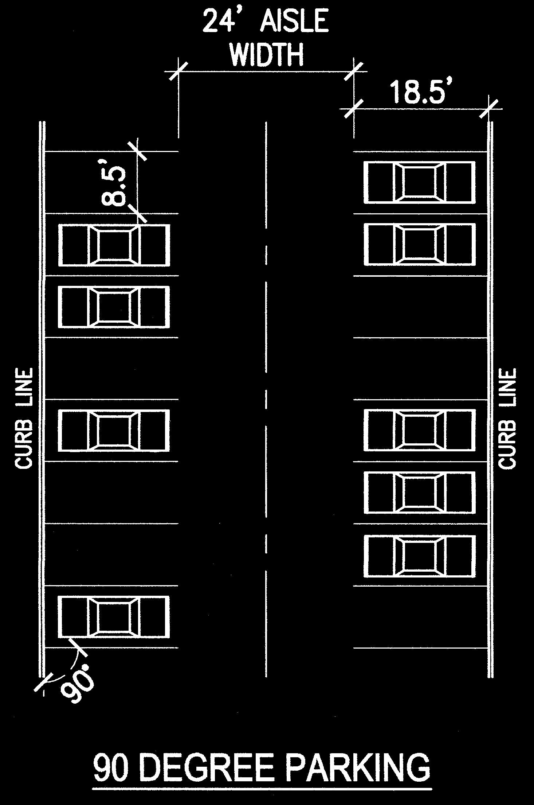

3\. Markings

a. Each required off-street parking space and off-street parking area shall be identified by surface markings at least 4 inches in width. Markings shall be visible at all times. Such markings shall be arranged to provide for orderly and safe loading, unloading, parking and storage of vehicles.

b. One‑way and two‑way accesses into required parking facilities shall be identified by directional arrows.

**4\. Surfacing and Maintenance**

All off-street parking areas, drive aisles, internal roadways, and loading areas for all uses except agriculture or single-family uses in the R-A, R-1 or R-1A districts shall be paved and kept in a dust-free condition at all times. Paving shall consist of asphaltic concrete with a minimum thickness of 4 inches, Portland cement concrete with an equivalent thickness, or bricks or paving blocks intended for outdoor use by motor vehicles.

**5\. Access**

Required parking spaces shall not have direct access to a street or highway. Access to required parking spaces shall be provided by on-site driveways. Off-street parking spaces shall be accessible without backing into or otherwise reentering a public right‑of‑way

**G. Use of Required Parking Spaces**

Required off‑street parking areas shall be used solely for the parking of licensed, motor vehicles in operating condition. Required spaces may not be used for storage of trash dumpsters, the display of goods for sale or lease, for motor vehicle repair or service work of any kind, or for long‑term storage of vehicles, boats, motor homes, campers, mobile homes, or building materials.

**H. Vehicle Stacking Areas**

**1\. Minimum Number of Spaces**

Off‑street stacking spaces shall be provided as follows:

| Activity Type | Minimum Spaces | Measured From |
| --- | --- | --- |
| Bank teller lane | 4 | Teller or Window |
| Automated teller machine | 3 | Teller |
| Restaurant drive-through | 6 | Order Box |
| Restaurant drive-through | 4 | Order Box to Pick-Up Window |
| Car wash stall, automatic | 6 | Entrance |
| Car wash stall, self-service | 3 | Entrance |
| Gasoline pump island | 2 | Pump Island |
| Other | Determined by County Highway Dept. based on Traffic Study |

**2\. Design and Layout**

Required stacking spaces are subject to the following design and layout standards.

a. Size

Stacking spaces must be a minimum of 8 feet by 20 feet in size.

b. Location

Stacking spaces may not impede on- or off-site traffic movements or move­ments

into or out of off-street parking spaces.

c. Design

Stacking spaces must be separated from other internal driveways by raised medians

if deem­ed necessary by the Highway Administrator for traffic movement and

safety.

**I. Parking and Storage of Large Vehicles and Equipment**

1.  **1-3/4 -Ton Capacity**

Outdoor storage or overnight outdoor parking of tractor-trailers, semi-trucks, semi-trailers or other vehicles having a hauling capacity of more than 1-3/4 - ton shall be prohibited in all agricultural, residential and C-1 zoning districts. This prohibition shall not apply to pick-up trucks, personal major recreational equipment or farm vehicles.

1.  **Construction Equipment**

Construction equipment shall not be stored on lots in residential or commercial

districts except during the period of permitted construction on the subject

parcel.

**J. Off-Street Loading**

**1\. No Use of Public Right-of-Way**

At no time shall goods be loaded or unloaded from the right-of-way of a collector or arterial street. No part of any vehicle shall be allowed to extend into the right-of-way of a collector or arterial street while being loaded or unloaded.

**2\. Location**

Plans for location, design and layout of all loading spaces shall be indicated on required site plans.

**3\. Space Size**

Off-street loading spaces, excluding maneuvering areas, shall be at least 10 feet wide and 25 feet long unless off‑street loading will involve the use of semi‑tractor trailer combinations orother vehicles in excess of 25 feet in length, in which case the minimum size of a space shall be 12 feet by 54 feet.

**100.2 Number of Uses/Structures per Lot**

A. Only one principal structure (residence) may be constructed on agriculturally or Residentially zoned property. Accessory buildings and uses must comply with the corresponding zoning district.

B. A lot may be used for more than 1 principal nonresidential **use** and more than 1 principal nonresidential **structure**, provided that all structures are separated by a minimum distance of 15 feet and provided that development on the lot complies with the proper zoning district and all applicable standards of these Zoning Regulations.

**100.3 Traffic Impact Studies**

**A. Applicability**

A traffic impact study may be required with Zoning District Map amendment applications, preliminary plats or planned unit developments that are projected to generate 100 or more peak hour vehicle trips or when the County Commission determines that the proposed development will have a measurable impact on the county road system.

**B. Study Scope**

When a traffic impact study is required, the type and scope of the study shall be determined during a meeting with the County Commission. The County Commission may also involve representatives of or request assessments from other agencies and departments. The elements to be determined during the meeting shall include:

**1\. Type of Study**

The possible types of reports include: a letter report, full traffic impact analysis report or special report (e.g., sight distance survey).

**2\. Definition of Impact Area**

The points of access and key streets and intersections that may be affected by development of the subject tract constitute the Impact Area. Traffic recorder and turning movement assessment locations shall be determined.

**3\. Period of Analysis**

Periods of analysis may include: daily traffic, AM, PM or weekend peak hour.

**4\. Analysis Scenarios**

Scenarios for analysis include: existing conditions, opening year conditions with and without development, and 10 years after opening with and without development.

**5\. Process**

Process for determining trip generation and distribution including: trip generation category, diversion assumptions and distribution assumptions.

**6\. Growth Rate Assumption**

The rate of growth assumed in background traffic assumptions.

**100.3 Traffic Impact Studies**

**A. Applicability**

A traffic impact study may be required with Zoning District Map amendment applications, preliminary plats or planned unit developments that are projected to generate 100 or more peak hour vehicle trips or when the County Commission determines that the proposed development will have a measurable impact on the county road system.

**B. Study Scope**

When a traffic impact study is required, the type and scope of the study shall be determined during a meeting with the County Commission. The County Commission may also involve representatives of or request assessments from other agencies and departments. The elements to be determined during the meeting shall include:

**1\. Type of Study**

The possible types of reports include: a letter report, full traffic impact analysis report or special report (e.g., sight distance survey).

**2\. Definition of Impact Area**

The points of access and key streets and intersections that may be affected by development of the subject tract constitute the Impact Area. Traffic recorder and turning movement assessment locations shall be determined.

**3\. Period of Analysis**

Periods of analysis may include: daily traffic, AM, PM or weekend peak hour.

**4\. Analysis Scenarios**

Scenarios for analysis include: existing conditions, opening year conditions with and without development, and 10 years after opening with and without development.

**5\. Process**

Process for determining trip generation and distribution including: trip generation category, diversion assumptions and distribution assumptions.

**6\. Growth Rate Assumption**

The rate of growth assumed in background traffic assumptions.

**7\. Pipeline Development**

Planned developments in the area that have been approved or are under review.

**C. Traffic Study Elements**

A letter report or special report shall only include those elements agreed upon in the meeting. A full traffic impact study shall include the following elements:

**1\. Existing Condition Survey**

a. Street System Description

The street system shall be described including geometric features, lane usage, traffic control, signage, sight distances and adjacent uses and curb cuts.

b. Traffic Volumes

Existing traffic volumes shall be provided for the impact area including both AADT (Average Annual Daily Traffic) and "Design" peak hour volumes. AADT may be derived from current counts of the Missouri Department of Transportation (if available) and peak hour volumes shall be done from field counts. Data shall be adjusted for daily and seasonal variations. Turning movement counts for the peak hour shall be provided for critical intersections. Peak hour periods shall be as determined at the meeting.

c. Capacity Analysis

Existing capacity of signalized and non-signalized intersections.

d. Other

Other items may be required at the discretion of the County Commission depending upon the type and scale of the project. These may include but are not limited to: queue length analysis, pedestrian counts, accident data, traffic speeds (both 50th and 85th percentile), and stopping sight distances.

**2\. Future Without Development**

Capacity analysis is to be provided for opening year and plus 10-year for key intersections (and roadway segments where appropriate) without the development but including any planned developments. The analysis shall be based upon the Highway Capacity Manual or other methodologies approved in advance by the County Commission.

**3\. Future With Development**

*   1.  Projections of the daily and peak hour traffic generation of the project shall be made using the latest edition of the Institute of Transportation Engineers Trip Generation Report unless the County Commission determines that locally derived data will provide more accurate forecasts. Data from similar facilities may be used where the information is not available from ITE.
    2.  The projected trips shall be distributed onto the road network as agreed in the

meeting.

*   1.  Capacity analysis for opening year and plus 10-year for key intersections (and

roadway segments where appropriate).

*   1.  Special analysis as may be required to determine warrants for signals, minimum

safe sight distances, gap analysis, turning radius requirements, queue length

analysis, turning lane length analysis, curb cut locations or similar requirements.

**4\. Mitigation Plan**

Where the analysis indicates that the project will create deficiencies in the impact area, improvements shall be recommended which shall include projected cost estimates. The design of improvements shall be in accordance with specifications of the County Commison and, where appropriate, the Missouri Department of Transportation. Where the County Commission determines that a mitigation plan is not adequate to address the traffic impacts of the project, it may serve as a basis for denial of the rezoning or planned unit development request.

**5\. Consultants**

The County Commission may require that an independent consultant be hired by the county to perform required traffic impact studies or to review all or part of a study prepared by the applicant’s consultants.

a. The County Commission shall determine the scope of services to be performed by the independent consultant and receive a cost estimate of such services.

b. The applicant shall provide an amount equal to the estimate to the County Commission, who will deposit the amount in an escrow or special account set up for this purpose. Any funds not used for the independent consultant shall be returned to the applicant in a timely manner without interest.

1.  The County Commission may require additional fees for the independent review if:
    *   the County Commission expands the scope of the required review;
    *   the applicant substantially amends the application;
    *   additional meetings involving the consultants are requested by the applicant;
    *   the consultant's appearance is requested at Planning and Zoning Commission

or County Commission meetings beyond what was initially anticipated;

*   *   **or** the consultant's attendance is required at meetings with agencies or boards which were not anticipated in the earlier scope of services.

**100.4 Intersection Visibility**

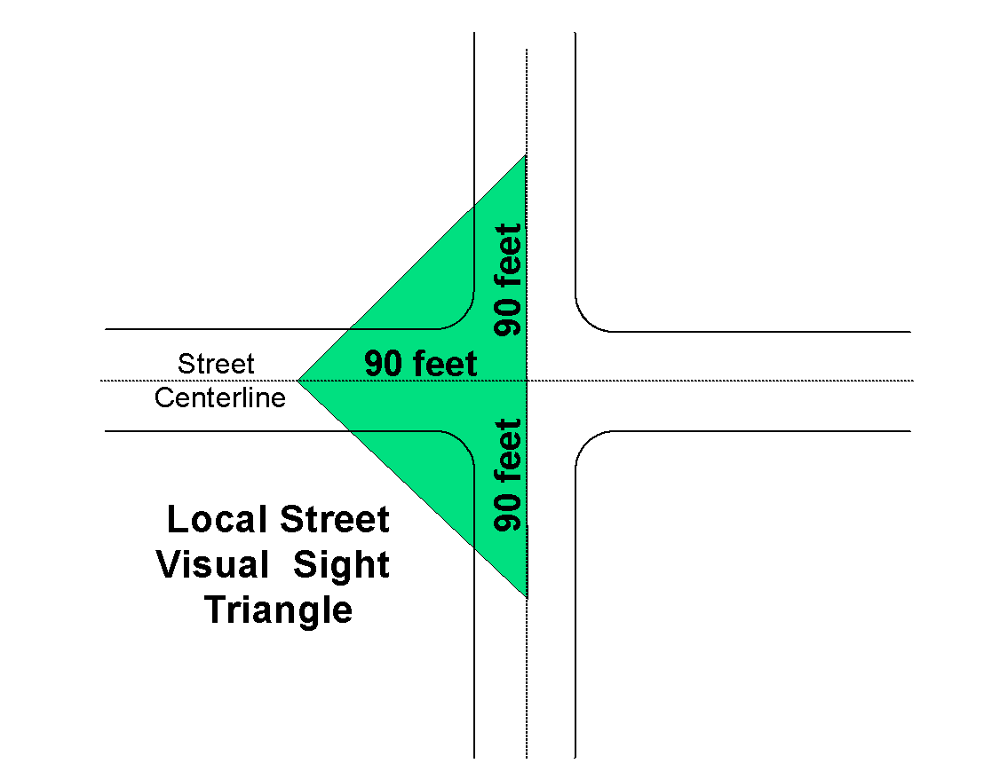

Nothing shall be erected, placed, planted, or allowed to grow in such a manner as to impede or obstruct vision between a height of 2 feet and 10 feet (measured from the edge of the road driving surface nearest the obstruction) within an imaginary triangular area formed by points on each street center line located:

1.  90 feet from the intersection of local street center lines and a third (diagonal) line connecting the two

points; or

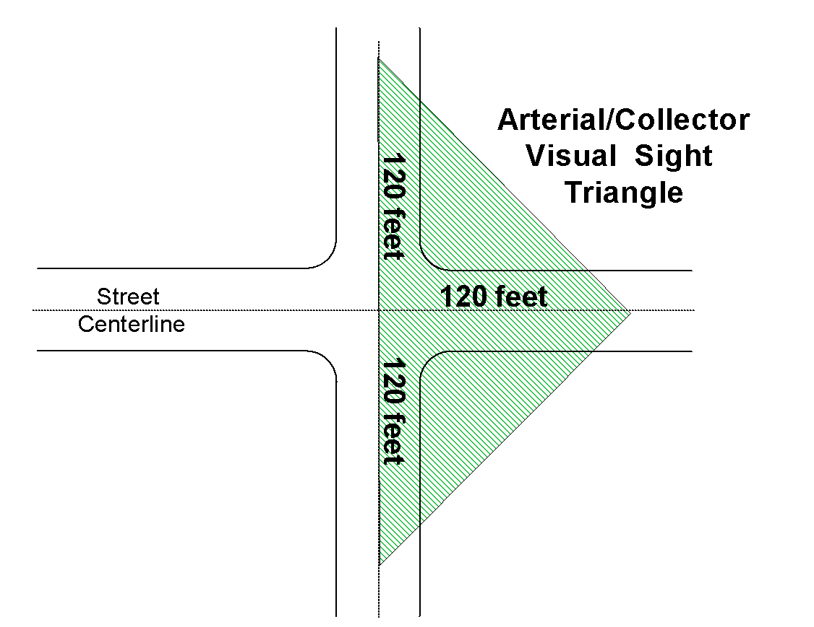

B. 120 feet from the intersection of collector or arterial street center lines and a third (diagonal) line connecting the two points.

**100.5 Historic Preservation**

Whenever there is an existing structure with potential historic value or a site with likelihood to yield a significant archaeological remains, consideration shall be given to preserving the structure or protecting the site prior to any construction or reuse of the property.

**A. Site Evaluation Criteria**

Prior to approval of the Final Plat, sites should be evaluated to determine if one of the following are present on the site:

1\. Structures over 50 years of age;

2\. Exceptional works of well-known architects or builders (even if the structure is less than 50 years old);

3\. Structures or features listed on the Ray County, State, or National Historic Registers; or

4\. Structures that are significant in terms of American history, architecture, culture, archaeology or engineering.

**B. Discovery**

If, during any construction, any archeologically or historically significant structure or features are discovered, the property owner shall notify the Ray County Historical Society and the state historic preservation officer of the discovery. Upon discovery of archeologically or historically significant structures, all construction activity shall cease until significant items have been salvaged.

**100.6 Residential Design Standards**

All detached houses shall be subject to the residential design standards of this Article, provided that houses located within mobile home parks shall not be subject to these standards. The County’s currently adopted building codes shall govern all building requirements.

**A. Minimum Size**

**1\. Width and Depth**

Detached houses shall have a minimum exterior dimension of 22 feet on any

side.

**2\. Living Area**

Each detached house shall comply with the minimum living area standard of the underlying zoning district.

**B. Roof**

**1\. Pitch**

The roof shall have a minimum 5:12 pitch (i.e., a vertical rise of at least 5 inches for every 12 inches of horizontal run).

**2\. Materials**

The roof must be covered with material that is customarily used on site‑built houses in Ray County, including approved wood, asphalt composition shingles, or fiberglass, and metal roofs.

**3\. Eaves and Overhangs**

The roof shall have a minimum eave projection and roof overhang of 12 inches on each of the exterior walls. Eave projections and roof overhangs shall be architecturally integrated into the design of the house. Gutters shall not be counted in calculating roof overhang.

**C. Exterior Siding**

Exterior siding shall be made of materials customarily used on site‑built houses in Ray County, such as wood, composition, simulated wood, clapboards, conventional vinyl or metal siding, brick, stucco, or similar materials. Siding material shall extend below the top of the foundation or curtain wall or the joint between the siding and enclosure wall shall be flashed in accordance with the building code.

**D. Siting and Placement**

**1\. Siting**

Manufactured housing units shall be installed in accordance with the recommended installation procedures of the manufacturer and the standards set by the International Conference of Building Officials (ICBO) and published in the most recent edition of "Guidelines for Manufactured Housing Installations." A continuous, permanent concrete or masonry foundation or masonry curtain wall, unpierced except for required ventilation and access which may include walk‑out basements and garages, shall be installed under the perimeter of the home, in accordance with the above‑referenced ICBO "Guidelines." All running gear, tongues, axles, and wheels must be removed at the time of installation of the house on the lot.

**2\. Placement**

Detached houses shall be placed so that the apparent entrance or “front” of the structure faces or parallels the primary street frontage, except where the lot is 3 or more acres in size and the unit is set back at least 150 feet from all property lines.

**E. Entrance Landing Area**

At the main entrance door there shall be a landing that is a minimum of 3 feet by 3 feet, constructed to meet applicable building code requirements.

**F. Finished Floor Elevation**

The finished floor elevation of the first floor of the detached house shall be a maximum of 24 inches above the exterior finish grade of the lot on which it is located, as measured at the main entrance of the dwelling.

**G. Attached Additions**

Any attached addition shall comply with county building codes.

**H. Garages**

Detached garages may be constructed on the same lot as a detached house, provided that such structures comply with all applicable building code requirements.

**BLANK**

**Article 110 Environmental**

**110.1 Dams and Water Impoundment Structures**

**A. General**

Dams and water impoundment structures shall be planned, designed and constructed under the supervision of a structural or professional engineer registered in the State of Missouri and shall comply with all applicable county and state standards. A preliminary engineering report, including soil investigations and design procedures, in accordance with state and county standards, may be submitted to the county prior to any development approval. The applicant's engineer shall certify that the dam is constructed in accordance with the approved plans and specifications. (See Article 80.13)

**B. Dams**

A dam construction permit must be obtained from the Building Official before beginning construction of any dam. A dam construction permit shall only be granted as follows:

1\. Dams that are proposed to be constructed on parcels of less than 20 acres in area shall be designed by a professional engineer registered in the State of Missouri. Prior to construction of such dam, detailed design plans shall be submitted for review by the Building Official for compliance with all applicable county and state standards. After the construction of such dam, the engineer shall certify that the dam is built in accordance with the approved plans.

2\. Submitted plans must show the method of dam construction, the materials to be used for fill, including the specified soil types, all proposed structures for the control of excess water, and the maximum land area that the impounded water could cover. The plan shall note the number of acres contained in the drainage area topographically higher than the lowest point of the dam.

3\. Dams that impound water from a drainage area of 20 acres or more shall be designed by a professional engineer registered in the State of Missouri. Prior to construction of such, detailed design plans and specifications shall be submitted to the County Engineer for design review and compliance with State of Missouri standards. The professional engineer shall certify that the dam has been constructed in accordance with the plans and specifications and State of Missouri standards.

4\. No pond or lake shall be located closer than 50 feet to any county, state or city road, street or road right‑of‑way.

5\. No pond or lake shall impound water over a utility easement, except a drainage easement, or over an existing utility line including sewage lateral fields. Where impounded waters will back up on to other (off-site) property, water impoundment easements shall be required and recorded.

6\. Ponds or lakes with a surface area of 1 acre or less (at normal pool level or normal spillway elevation) and used exclusively for an individual dwelling unit’s sewage retention or for agricultural purposes shall be exempt from the standards of this Article.

**C. Retention Basins**

When the development of a site will substantially increase the runoff of stormwater onto adjoining properties, the County Engineer may require that retention basins be provided on‑site to control the rate of runoff.

**D. Dam Breach Studies**

Decision-making bodies shall be authorized to require the preparation of a dam breach study for lakes with an area of 5 acres or more (at normal spillway elevation). When required, breach studies shall be prepared by a professional engineer registered in the State of Missouri.

As in the case of FIRM floodplain mapping, development shall be discouraged within the designated dam breach area.

**110.2 Stormwater Management**

Stormwater is water from rain or melting snow that does not soak into the ground. It flows from rooftops, over paved areas and bare soil, and through sloped lawns. As it flows, this runoff collects and transports soil, manure, salt, pesticides, fertilizer, oil and grease, leaves, litter and other potential pollutants. Contaminants include: livestock waste, fuels and solvents, pesticides, and chemical fertilizers. Contrary to popular belief, most storm sewers do not carry storm water to wastewater treatment plants. Stormwater is unavoidable, but keeping harmful chemicals and materials out of runoff, as well as designing detention areas that would reduce the flows and, therefore, the amount of erosion can reduce its effects.

Soil type can affect surface water contamination. Although runoff occurs from all soil types, clay soils are more likely to cause surface water runoff because they are less permeable. Eroding soil is considered a water pollutant.

For additional information, contact the University of Missouri Extension Service, the Ray County Soil and Water Conservation District, the Missouri Department of Natural Resources, Missouri Department of Conservation, and the Ray County Health Department.

**A. Practices that will reduce stormwater runoff and improve water quality in streams**

1\. Cover bare soil with vegetable and flower gardens, grass seed, and natural prairie

grass coverings.

2\. Remove all debris from ditches and creeks and from areas where they might be

swept into a channel.

3\. Consider using materials other than concrete or asphalt for drives and walkways

that would allow for more seepage into the ground.

4\. Keep basement windows or doors sealed against leaks.

5\. Slope the yard away from the foundation to prevent water from pooling near the

structure.

6\. Use downspouts to carry water from the roof onto grassy areas.

7\. Consider a landscaping layout engineered to reduce runoff.

8\. Pump and repair on-site septic systems on a regular basis.

9\. Replace septic systems if it is more than 30 years old, made of soil or

undersized for any additions you have made to your house.

10\. Do not drive vehicles on the drain field.

11\. Do not pave, build, or pile heavy objects on a drain field.

12\. Divert roof runoff and other surface runoff away from the drain field.

13\. Do not dispose of tissues, diapers, sanitary napkins, cigarette butts and other

solid waste down the toilet.

14\. Paints, solvents, acids, drain cleaners, oils and pesticides can pass untreated

through your system and contaminate the groundwater.

15\. Consider the individual characteristics of the site when building; such as soil

type and depth; depth to bedrock; depth to the water table; and location of

wetlands, streams, or other surface water.

These Zoning Regulations may require all development of more than 20 acres to submit a stormwater plan for review.

**_Active Channel –_** _The area of the stream channel that is subject to frequent flows (approximately once per one and a half years), and that includes the portion of the channel below where the floodplain flattens._

## B. Stream Protection

No person shall knowingly deposit or dump trash,

debris, or other obstacles into a Ray County active

stream, or otherwise pollute, contaminate, or

significantly retard the flow of water through the

watercourse.

## C. Stream Buffer Setbacks

This stream buffer setback ordinance is intended to protect and maintain the native vegetation along all stream systems within Ray county jurisdictional authority. This ordinance establishes minimal acceptable requirements for the design of buffers to protect the streams, wetlands and floodplains of Ray County; to protect the water quality of watercourses, reservoirs, lakes and other significant water resources within Ray County; to protect Ray County’s riparian and aquatic ecosystems; and to provide for the environmentally sound use of Ray County’s land resources.

**1\. Structure Setback Requirements**

No structures shall be constructed within 50’ of the stream bank, or in no case within 100’ of the centerline of an active stream channel.

1.  **Drainage Construction**

Stormwater drainage construction may occur within the 100’ setback requirement, if approved by the County Engineer.

1.  **Water Pollution Hazards**

The following land uses and/or activities are designated as potential water pollution hazards, and must be set back from any active stream channel or water body by the distance indicated below:

*   1.  Storage of hazardous substances (150 feet)
    2.  Above or below ground petroleum storage facilities (150 feet)
    3.  Drain fields from on-site sewage disposal and treatment systems (i.e. septic systems –100 feet)
    4.  Raised septic systems (250 feet)
    5.  Solid waste landfills or junkyards (300 feet)
    6.  Confined animal feedlot operations (250 feet)
    7.  Subsurface discharges from a wastewater treatment plant (100 feet)
    8.  Land applications of biosolids (100 feet)

1.  **Zone 1- Streamside Zone**
    1.  The function of the streamside zone is to protect the physical and ecological integrity of the stream ecosystem.
    2.  The streamside zone will begin at the edge of the stream bank of the active channel and extend a minimum of 50 feet from the high bank of any stream or waterbody.
    3.  Allowable uses within this zone are height restricted to:
        1.  Flood control structures
        2.  Utility rights of way
        3.  Footpaths
        4.  Road crossings, where permitted.
2.  **Zone 2 – Secondary Streamside Zone**
    1.  The function of the secondary streamside zone is to protect key components of the stream and to provide a distance between upland development and the streamside zone.
    2.  The secondary streamside zone will begin at the outer edge of the streamside zone (Zone 1) and extend a minimum of 50 feet.
    3.  Allowable uses within the secondary streamside zone are restricted to:
        1.  Biking and hiking paths
        2.  Stormwater management facilities with the approval of the Ray County Engineer
        3.  Recreational uses approved by Planning and Zoning .
        4.  Limited tree clearing with the approval of the Planning & Zoning Administrator
        5.  Targeted vegetation is that of mature native vegetation adapted to the region.

**D. Plat Requirements**

All plats containing active stream channels shall show Zones 1 and 2 and provide a note stating, “There shall be no clearing, grading, construction or disturbance of vegetation except as permitted by Ray County.”

**E. Violation**

Any violation of this Article of the ordinance will receive written notice of the violation and given a specific length of time to remedy the problems. Failure to do so will constitute a misdemeanor with a minimum penalty of $250 or the actual cost of clean-up, whichever is greater, per incident.

**110.3 Renewable Energy**

Renewable energy sources (e.g. wind generators, solar collectors, etc.) are encouraged in Ray County. (See Article 60.3H)

**110.4 Junk, Trash and Derelict Vehicles**

The regulations of this Article are intended to prohibit the accumulation of junk, debris, building materials, used furniture, or other waste items or the repair, restoration, assembly, disassembly, storage or standing of any inoperable vehicle where it is visible and uncovered from surrounding property or roads. In order to adequately investigate complaints, Planning and Zoning does not accept anonymous complaints.

**A. Determination of Junk or Debris Status**

Piles or accumulation of junk or debris shall be determined to be a nuisance when any one or more of the following conditions exist:

1.  Accumulation of junk, debris, building materials, used furniture, household trash, tires, barrels or other waste items appear on any property which has the potential to be a:
    1.  Health hazard
    2.  Fire hazard
    3.  Nuisance to adjacent property owners
    4.  Degrade water quality of active streams.
2.  The burial of trash or debris is considered to be operating a Landfill and is subject to all regulations regarding Waste-Related Use (Article 60.2X).
3.  Any complaint regarding the accumulation of junk, debris, trash, building materials, used furniture, or other waste items located on property within unincorporated Ray County shall be processed by the Planning and Zoning Administrator or designee by:
    1.  Receiving a complaint from any citizen of the County;
    2.  Completing a Complaint form which will include the name and phone number of the person lodging the complaint;
    3.  Inspecting the property for any violation(s).
4.  Upon completion of the inspection the Planning and Zoning Administrator or designee will:
    1.  Make a determination that there was no violation of this ordinance;
    2.  Call the person reporting the problem and give them the results of their investigation;
    3.  Make a determination that there is a violation of this ordinance;
    4.  Send a certified letter to the property owner on which the violation is occurring;
    5.  Indicate the nature of the violation, Code reference, number of days to correct the problem, and the follow up procedure.
    6.  Staff will call the informer to advise them a certified letter has been sent.
    7.  At the end of the allotted time, the property will be inspected for compliance.
    8.  If not in compliance, the complaint will be turned over to the County Prosecutor for prosecution.
    9.  Each incident of a complaint shall be considered a separate citation.

**B. Determination of Vehicle Status**

1.  **Inoperable**

A motor vehicle shall be determined to be inoperable when any one or more of the following conditions exist:

*   1.  it is disassembled in whole or in part;

b. it is unable to move or it has not been moved under its own power within a continuous period of 10 days or more; or

c. its license plates have been expired for 30 days or more.

**2\. Storage**

Inoperable motor vehicles shall not be stored, nor shall they be allowed to stand in any zoning district in any manner except as follows:

a. In a legally established and conforming wrecking or salvage yard.

b. In a fully enclosed storage structure such as a garage or barn.

c. Where it is covered and/or is not visible from adjacent roads or

property. A suitable fence that screens inoperable motor vehicles from public

view is permitted.

**C.** Junk Vehicles and/or Trash/Debris are not “grandfathered” and all violations are effective as of June 10, 2005.

**110.5 Liquid Gas Tanks**

Permanently installed liquid gas tanks with a capacity of 10,000+ gallons shall be permitted only in I-1 or I-2 zoning districts. They shall confirm to the zoning restrictions and those of the 2000 Uniform Fire Code, as adopted by Ray County.

Temporary storage tanks of 10,000+ gallons liquid gas must have a Conditional Use Permit and conform to the restrictions that may be required to allow the installation of such a tank.

**110.6 Floodplain Management**

**A. Floodplain Designations**

1\. The special flood hazard areas of unincorporated Ray County are subject to periodic inundation that results in loss of life, property, health and safety hazards, disruption of commerce and governmental services, extraordinary public expenditures of flood protection and relief, and impairment of the tax base, all of which adversely affect the public health, safety and general welfare.

2\. These flood losses are caused by the cumulative effect of obstructions in floodplains causing increases in flood heights and velocities, and by the occupancy in flood hazard areas by uses vulnerable to floods or hazardous to other lands that are inadequately elevated, flood proofed, or otherwise unprotected from flood damages.

**B. Statutory Authority**

The regulations of this Article are adopted pursuant to the powers granted and limitations imposed by the Constitution and laws of the State of Missouri, including the statutory authority conferred by RSMo 49.600.

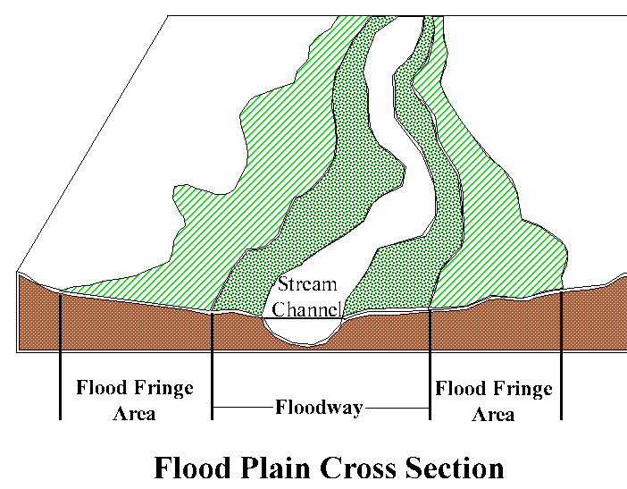

**C. Purpose**

It is the purpose of these regulations to promote the public health, safety and general welfare and to minimize public and private losses due to flood conditions in specific areas by provisions designed to:

1\. restrict or prohibit uses that are dangerous to health, safety and property due to water or erosion hazards or that result in damaging increases in erosion or in flood heights or velocities;

2\. require that uses vulnerable to floods, including facilities that serve such uses, be protected against flood damage at the time of initial construction;

3\. control the alteration of natural floodplains, stream channels and natural protective barriers that are involved in the accommodation of flood waters;

4\. control filling, grading, dredging and other development that may increase erosion or flood damage waters;

5\. prevent or regulate the construction of flood barriers that will unnaturally divert flood waters or that may increase flood hazards to other lands; and

6\. maintain the county’s eligibility for participation in the National Flood Insurance Program (NFIP) as defined in 44 Code of Federal Regulations (CFR) 59.22(a)(3); and to meet the requirements of 44 CFR 60.3(d).

**D. Objectives**

The objectives of the regulations of this Article are:

1\. to protect human life and health;

2\. to minimize expenditure of public money for costly flood control projects;

3\. to minimize the need for rescue and relief efforts associated with flooding and generally undertaken at the expense of the general public;

4\. to minimize prolonged business interruptions;

5\. to minimize damage to public facilities and utilities such as water and gas mains, electric, telephone and sewer lines, streets and bridges located in floodplains;

6\. to help maintain a stable tax base by providing for the sound use and development of flood prone areas in such a manner as to minimize flood blight areas;

7\. to protect individuals from buying lands that are unsuited for intended purposes because of flood hazard; and

8\. to assure that eligibility is maintained for property owners in the county to purchase flood insurance in the National Flood Insurance Program.

**E. Applicability**

The regulations of this Article shall apply to all areas of unincorporated Ray County identified as numbered and unnumbered A zones, AE, AO, and AH Zones, on the Flood Insurance Rate Map and the Flood Boundary and Floodway Map dated January 19, 1983 as amended, and any future revisions thereto. In all areas covered by this Article, no development shall be permitted except upon the issuance of a Floodplain Development Permit granted in accordance with the procedures and standards of this Article.

**F. Basis For Establishing the Areas of Special Flood Hazard**

The areas of special flood hazard identified by the Federal Emergency Management agency in its Flood Insurance Study, dated January 19, 1983 with accompanying maps and other supporting data, and any revision thereto are adopted by reference and declared to be a part of this Article.

**G. Warning and Disclaimer of Liability**

The degree of flood protection required by this Article is considered reasonable for regulatory purposes and is based on scientific and engineering consideration. Larger

floods can and will occur on rare occasions, and flood heights may be increased by manmade or natural causes. The regulations of this Article do not imply that land outside special flood hazard areas or that uses permitted within such areas will be free from flooding or flood damages. This Article shall not create liability on the part of the Ray County or by any officer or employee thereof for any flood damages that result from reliance on this Article or any administrative decision lawfully made hereunder.

**H. Interpretation**

In their interpretation and application, the provisions of this Article shall be held to be minimum requirements and shall be liberally construed in favor of the governing body and shall not be deemed a limitation or repeal of any other powers granted by state statutes.

**I. Compliance**

No development located within known flood hazard areas of unincorporated Ray County shall be located, extended, converted or structurally altered without full compliance with the terms of this Article and other applicable regulations.

**J. Abrogation and Greater Restrictions**

This Article is not intended to repeal, abrogate or impair any existent easements, covenants or deed restrictions. However, where this Article imposes greater restrictions, the provision of this Article shall prevail.

**110.7 Floodplain Definitions**

The definitions of this Article shall be used solely for the purpose of interpreting and administering the Floodplain Management provisions of this Article. If the definitions of this Article conflict with other definitions of these Zoning Regulations, the definitions of this Article shall control.

| Term | Definition |
| --- | --- |
| Agricultural Commodities | agricultural products and livestock. |
| Agricultural Structure | means any structure used exclusively in connection with the production, harvesting, storage, drying, or raising of agricultural commodities. |
| Accessory or Appurtenant Structure | means a structure that is on the same parcel of property as the principal structure to be insured and the use of which is incidental to the use of the principal structure. |
| Area of Special Flood Hazard | is the land in the floodplain within the county subject to a 1 percent or greater chance of flooding in any given year, e.g. “100 year Flood Plain.” |
| Base Flood | means the flood having a 1 percent chance of being equaled or exceeded in any given year. |
| Basement | means any area of the structure having its floor below ground level on all sides. |
| Development | means any man‑made change to improved or unimproved real estate, including but not limited to buildings or other structures, levees, levee systems, mining, dredging, filling, grading, paving, excavation or drilling operations, or storage of equipment or materials. |
| Elevated Building | means, for insurance purposes, a non‑basement building which has its lowest elevated floor raised above ground level by foundation walls, shear walls, posts, piers, pilings, or columns. |
| Existing Construction | means for the purposes of determining rates, structures for which the “start of construction” commenced before the effective date of the FIRM or before January 19, 1983, for FIRMs effective before that date. “Existing construction” may also be referred to as “existing structures.” |
| Existing ManufacturedHome Park or Subdivision | means a manufactured home park or subdivision for which the construction of facilities for servicing the lots on which the manufactured housing units are to be affixed (including, at a minimum, the installation of utilities, the construction of streets, and either final site grading or the pouring of concrete pads) is completed before the effective date of the floodplain management regulations of the county. |
| Expansion of an Existing Manufactured Home Park or Subdivision | means the preparation of additional sites by the construction of facilities for servicing the lots on which the manufactured housing units are to be affixed (including the installation of utilities, the construction of streets, and either final site grading or the pouring of concrete pads). |
| Flood or Flooding | means a general and temporary condition of partial or complete inundation of normally dry land areas from (a) the overflow of inland and/or (b) the unusual and rapid accumulation or runoff of surface waters from any source. |
| Flood Boundary and Floodway Map (FBFM) | means an official map of the county on which the Floodplain Administrator has delineated both special flood hazard areas and the designated regulatory floodway. |
| Flood Elevation Determination | means a determination by the Floodplain Administrator of the water surface ‑elevations of the base flood, that is, the flood level that has a 1 percent or greater chance of occurrence in any given year. |
| Flood Elevation Study | means an examination, evaluation and determination of flood hazards. |
| Flood Fringe | means the area outside the floodway encroachment lines, but still subject to inundation by the regulatory flood. |
| Flood Hazard Boundary Map (FHBM) | means an official map of the county issued by the Floodplain Administrator, where the boundaries of the flood areas having special flood hazards have been designated as (unnumbered or numbered) A zones. |
| Flood Insurance Rate Map (FIRM) | means an official map of the county, on which the Floodplain Administrator has delineated both the special flood hazard areas and the risk premium zones applicable to the county. |
| Flood Insurance Study (FIS) | means an examination, evaluation and determination of flood hazards and, if appropriate, corresponding water surface elevations. |
| Floodplain or Flood‑prone Area | means any land area susceptible to being inundated by water from any source (see “flooding”). |
| Floodplain Management | means the operation of an overall program of corrective and preventive measures for reducing flood damage, including but not limited to emergency preparedness plans, flood control works, and floodplain management regulations. |
| Floodplain Management Regulations | means zoning ordinances, subdivision regulations, building codes, health regulations, special purpose ordinances (such as floodplain and grading ordinances) and other applications of police power. The term describes such state or local regulations, in any combination thereof, that provide standards for the purpose of flood damage prevention and reduction. |
| Flood proofing | means any combination of structural and nonstructural additions, changes, or adjustments to structures that reduce or eliminate flood damage to real estate or improved real property, water and sanitary facilities, or structures and their contents. |
| Floodway or Regulatory Floodway | means the channel of a river or other watercourse and the adjacent land areas that must be reserved in order to discharge the base flood without cumulatively increasing the water surface elevation more than 1 foot. |
| Floodway Encroachment Lines | means the lines marking the limits of floodways, on federal, state and local floodplain maps. |
| Freeboard | means a factor of safety usually expressed in feet above a flood level for purposes of floodplain management. “Freeboard” tends to compensate for the many unknown factors that could contribute to flood heights greater than the height calculated for a selected size flood and floodway conditions, such as bridge openings and the hydrological effect of urbanization of the watershed. |
| Functionally Dependent Use | means a use that cannot perform its intended purpose unless it is located or carried out in close proximity to water. This term includes only docking facilities and facilities that are necessary for the loading and unloading of cargo or passengers, but does not include long‑term storage or related manufacturing facilities. |
| Highest Adjacent Grade | means the highest natural elevation of the ground surface prior to construction next to the proposed walls of a structure. |
| Historic Structure | means any structure that is: (a) listed individually in the National Register of Historic Places (a listing maintained by the Department of Interior) or preliminarily determined by the Secretary of the Interior as meeting the requirements for individual listing on the National Register; (b) certified or preliminarily determined by the Secretary of the Interior as contributing to the historical significance of a registered historic district or a district preliminarily determined by the Secretary to qualify as a registered historic district; (c) individually listed on a state inventory of historic places in states with historic preservation programs which have been approved by the Secretary of the Interior; or (d) individually listed on a local inventory of historic places in communities with historic preservation programs that have been certified either (i) by an approved state program as determined by the Secretary of the Interior or (ii) directly by the Secretary of the Interior in states without approved programs. |
| Lowest Floor | means the lowest floor of the lowest enclosed area, including basement. An unfinished or flood‑resistant enclosure, usable solely for parking of vehicles, building access, or storage, in an area other than a basement area, is not considered a building’s lowest floor, provided that such enclosure is not built so as to render the structure in violation of the applicable flood proofing design requirements of this Article. |
| Manufactured Housing Unit | means a structure, transportable in 1 or more Articles, that is built on a permanent chassis and is designed for use with or without a permanent foundation when attached to the required utilities. The term “manufactured housing unit” does not include a “recreational vehicle.” |
| Manufactured Home Park or Subdivision | means a parcel (or contiguous parcels) of land divided into 2 or more manufactured housing unit lots for rent or sale. |
| Market Value or Fair Market Value | means an estimate of what is fair, economic, just and equitable value under normal local market conditions. |
| Mean Sea Level | means, for purposes of the National Flood Insurance Program the National Geodetic Vertical Datum (NGVD) of 1929 or other datum, to which base flood elevations shown on the county’s Flood Insurance Rate Map are referenced. |
| New Construction | means, for the purposes of determining insurance rates, structures for which the “start of construction” commenced on or after the effective date of an initial FIRM or after December 31, 1974, whichever is later, and includes any subsequent improvements to such structures. For floodplain management purposes, “new construction” means structures for which the “start of construction” commenced on or after the effective date of the floodplain management regulations adopted the county and includes any subsequent improvements to such structures. |
| New Manufactured Home Park or Subdivision | means a manufactured home park or subdivision for which the construction of facilities for servicing the lot on which the manufactured housing units are to be affixed (including at a minimum, the installation of utilities, the construction of streets, and either final site grading or the pouring of concrete pads) is completed on or after the effective date of floodplain management regulations adopted by the county. |
| Person | includes any individual or group of individuals, corporation, partnership, association, or any other entity, including federal, state, and local governments and agencies. |
| Principally Above Ground | means that at least 51 percent of the actual cash value of the structure, less land value, is above ground. |
| Recreational Vehicle | means a vehicle which is (a) built on a single chassis; (b) 400 square feet or less when measured at the largest horizontal projections; (c) designed to be self‑propelled or permanently towable by a light‑ duty truck; and (d) designed primarily not for use as a permanent dwelling but as temporary living quarters for recreational, camping, travel, or seasonal use. |
| Remedy A Violation | means to bring the structure or other development into compliance with federal, state, or local floodplain management regulations; or, if this is not possible, to reduce the impacts of its noncompliance. |
| Risk Premium Rates | means those rates established by the Floodplain Administrator pursuant to individual studies and investigations which are undertaken to provide flood insurance in accordance with Article 1307 of the National Flood Disaster Protection Act of 1973 and the accepted actuarial principles. “Risk premium rates” include provisions for operating costs and allowances. |
| Special Flood Hazard Area | see “area of special flood hazard.” |
| Special Hazard Area | means an area having special flood hazards and shown on an FHBM, FIRM or FBFM as zones (unnumbered or numbered) A and AE. |
| Start of Construction | includes substantial‑improvements, and means the date the building permit was issued, provided the actual start of construction, repair, reconstruction, rehabilitation, addition placement, or other improvements were within 180 days of the permit date. The actual start means either the first placement of permanent construction of a structure on-site, such as the pouring of slabs or footings, the installation of piles, the construction of columns, any work beyond the stage of excavation, or the placement of a manufactured housing unit on a foundation. Permanent construction does not include land preparation, such as clearing, grading and filling, the installation of streets and/or walkways, excavation for a basement, footings, piers, foundations, the erection of temporary forms, nor installation on the property of accessory structures, such as garages or sheds not occupied as dwelling units or not part of the main structure. For a substantial‑improvement, the actual start of construction means the first alteration of any wall, ceiling, floor, or other structural part of a building, whether or not that alteration affects the external dimensions of the building. |
| State Coordinating Agency | means that agency of the state government, or other office designated by the governor of the state or by state statute at the request of the Floodplain Administrator to assist in the implementation of the National Flood Insurance Program in that state. |
| Structure | means, for floodplain management purposes, a walled and roofed building, including a gas or liquid storage tank, that is principally above ground, as well as a manufactured housing unit. |
| Structure | for insurance purposes, means a walled and roofed building, other than a gas or liquid storage tank, that is principally above ground and affixed to a permanent site, as well as a manufactured housing unit on a permanent foundation. For the latter purpose, the term includes a building while in the course of construction, alteration or repair, but does not include building materials or supplies intended for use in such construction, alteration or repair, unless such materials or supplies are within an enclosed building on the premises. |
| Substantial‑Damage | means damage of any origin sustained by a structure whereby the cost of restoring the structure to pre‑damaged condition would equal or exceed 50 percent of the market value of the structure before the damage occurred, |
| Substantial‑Improvement | means any reconstruction, rehabilitation, addition, or other improvement of a structure, the cost of which equals or exceeds 50 percent of the market value of the structure before “start of construction” of the improvement. This term includes structures which have incurred “substantial damage,” regardless of the actual repair work performed. The term does not, however, include either (a) any project for improvement of a structure to correct existing violations of state or local health, sanitary, or safety code specifications that have been identified by the local code enforcement official and which are the minimum necessary to assure safe living conditions, or (b) any alteration of an “historic structure,” provided that the alteration will not preclude the structure’s continued designation as a “historic structure.” |
| Variance | means a grant of relief by the county from the terms of a floodplain management regulation. |
| Violation | means the failure of a structure or other development to be fully compliant with the county’s floodplain management regulations. A structure or other development without the elevation certificate, other certifications, or other evidence of compliance required by this Article is presumed to be in violation until such time as that documentation is provided. |
| Water Surface Elevation | means the height, in relation to the National Geodetic Vertical Datum (NGVD) of 1929 (or other datum where specified) of floods of various magnitudes and frequencies in the floodplain. |

**110.8 Floodplain Administration and Procedures**

**A. Designation of Local Floodplain Administrator**

The Planning and Zoning Administrator shall be responsible for administering and implementing the provisions of this Article.

**B. Duties of the Floodplain Administrator**

Duties of the Floodplain Administrator shall include:

1\. Review all development permits to assure that sites are reasonably safe from flooding and that the permit requirements of this Article have been satisfied.

2\. Review permits for proposed development to assure that all necessary permits have been obtained from those federal, state or local governmental agencies from which prior approval is required.

3\. Notify adjacent communities and the Missouri State Emergency Management Agency prior to any alteration or relocation of a watercourse, and shall submit evidence of such notification to the Federal Emergency Management Agency.

4\. Assure that maintenance is provided within the altered or relocated portion of said watercourse so that the flood carrying capacity is not diminished.

5\. Verify, record and maintain record of the actual elevation (in relation to mean sea level) of the lowest floor (including basement) of all new or substantially improved structures.

6\. Verify, record and maintain record of the actual elevation (in relation to mean sea level) to which the new or substantially improved structures have been flood proofed.

7\. When flood proofing is utilized for a particular structure the Building Official shall be presented certification from a registered professional engineer or architect.

8\. Issue Floodplain Development Permits for all approved applications.

**C. Floodplain Development Permit Required**

No person, firm or corporation shall initiate any development or substantial improvement or cause the same to be done without first obtaining a separate permit for development as defined in this Article.

**D. Application for Permit**

To obtain a permit, the applicant shall first file an application in writing on a form furnished for that purpose. Every such application shall:

1\. Identify and describe the work to be covered by the permit.

2\. Describe the land on which the proposed work is to be done by lot, block tract and house and street address, or similar legal description that will readily identify and definitely locate that proposed building or work.

3\. Indicate the use or occupancy for which the proposed work is intended.

4\. Be accompanied by plans and specifications for proposed construction.

5\. Be signed by the permittee or their authorized agent who may be required to submit evidence to indicate such authority.

6\. Indicate the value of the structures and improvements.

7\. Specify whether development is to be located in designated flood fringe or floodway.

8\. Identify the existing base flood elevation and the elevation of the proposed development.

9\. Give such other information as reasonably may be required by the Floodplain Administrator.

**E. Appeals**

Appeals of decisions of the Floodplain Administrator shall be processed in accordance with the procedures of Article 30.14.

**110.9 General Flood Hazard Reduction Standards**

A. No permit for development shall be granted for new construction, substantial improvements and other improvements including the placement of manufactured housing units and mobile homes within all numbered and unnumbered A zones or AE zones unless the general flood hazard reduction standards of this Article are satisfied.

B. All areas identified as unnumbered A zones on the Flood Insurance Rate Map are subject to inundation of the 100‑year flood; however, the water surface (flood) elevation was not provided. The unnumbered A zones shall be subject to all standards of these Zoning Regulations. If Flood Insurance Study data is not available the county shall be authorized to use any base flood elevation or floodway data currently available from federal, state, or other sources.

C. Until a floodway has been designated, no new construction, substantial improvements or other development, including fill, shall be permitted within any unnumbered or

numbered A zones or AE zones on the Flood Insurance Rate Map unless the applicant has demonstrated that the proposed use, when combined with all other existing and reasonably anticipated uses, will not increase the water surface elevation of the 100‑year flood more than 1 foot at any point within the county.

D. All new construction, subdivision proposals, substantial improvements, prefabricated structures, placement of manufactured housing units and mobile homes and other developments shall require:

1\. Design or anchorage to prevent flotation, collapse or lateral movement of the structure resulting from hydrodynamic and hydrostatic loads, including the effects of buoyancy.

2\. New or replacement water supply systems and/or sanitary sewage systems be designed to minimize or eliminate infiltration of flood waters into the systems and discharges from the systems into flood waters, and on‑site waste disposal systems be located so as to avoid impairment or contamination.

3\. Construction with materials resistant to flood damage, utilizing methods and practices that minimize flood damage, and with electrical, heating, ventilation, plumbing, and air conditioning equipment and other service facilities that are designed and/or located so as to prevent water from entering or accumulating within the components during conditions of flooding.

4\. All utility and sanitary facilities be elevated or flood proofed up to the regulatory flood protection elevation.

5\. Subdivision proposals and other proposed new development, including manufactured housing units and mobile home parks, located within special flood hazard areas are required to assure that:

a. all such proposals are consistent with the need to minimize flood damage;

b. all public utilities and facilities such as sewer, gas, electrical and water systems are located and constructed to minimize or eliminate flood damage;

c. adequate drainage is provided so as to reduce exposure to flood hazards; and

d. all proposals for development of 5 acres or more or 50 lots or more include base flood elevation data.

E. The storage or processing of materials that are in time of flooding buoyant, flammable, explosive, or could be injurious to human, animal or plant life is prohibited. Storage of other material or equipment may be allowed if not subject to major damage by floods and firmly anchored to prevent flotation or if readily removable from the area within the time available after flood warning.

F. Structures used solely for agricultural purposes in connection with the production, harvesting, storage, drying or raising of agricultural commodities, including the raising of livestock may be constructed at-grade and wet-flood proofed, provided that:

1\. there is no human habitation or occupancy of the structure;

2\. the structure is of single-wall design;

3\. there is no permanent retail, wholesale or manufacturing use included in the structure;

4\. a variance has been granted from the standards of this Article; and

5\. a Floodplain Development Permit has been issued.

G. Structures used solely for parking and limited storage purposes, not attached to any other structure on the site, of limited investment value and not larger than 400 square feet, may be constructed at-grade and wet-flood proofed, provided that

1\. there is no human habitation or occupancy of the structure;

2\. the structure is of single-wall design;

3\. a variance has been granted from the standards of this Article; and

4\. a Floodplain Development Permit has been issued.

**110.10 Residential and Nonresidential Building Floodplain Protection Standards**

**A. Applicability**

The standards of this Article shall apply in all areas identified as numbered and unnumbered A zones, AE and AH zones, where base flood elevation data has been provided.

**B. Residential**

New construction or substantial improvements of residential structures, including manufactured housing units and mobile homes, shall have the lowest floor, including the basement, elevated to at least 1 foot above the base flood elevation.

**C. Nonresidential**

New construction or substantial improvements of nonresidential structures shall have the lowest floor, including basement, elevated to at least 1 foot above the base flood elevation or, together with attendant utility and sanitary facilities, be flood proofed so that below the base flood elevation the structure is water tight with walls substantially impermeable to the passage of water and with structural components having the capability of resisting hydrostatic and hydrodynamic loads and effects of buoyancy. A registered professional engineer, architect or surveyor shall certify that the standards of

this sub-Article are satisfied. Such certification shall be provided to the Floodplain Administrator at the time of application for a Floodplain Development Permit.

**D. Residential and Nonresidential**

Fully enclosed areas below the lowest floor (to be used solely for the parking of vehicles, building access or storage in an area other than a basement) that are subject to flooding shall be designed to automatically equalize hydrostatic flood forces on exterior walls by allowing for the entry and exit of floodwaters. Designs for meeting this requirement must either be certified by a registered professional engineer, architect or surveyor or meet or exceed the following minimum criteria:

1\. a minimum of 2 openings with a total net area of not less than 1 square inch for every 1 square foot of enclosed area subject to flooding shall be provided; and

1.  the bottom of all openings shall be no higher than 1 foot above grade. Openings may be equipped with screens, louvers, valves, or other coverings or devices provided that they permit the automatic entry and exit of floodwaters.

Within AH zones adequate drainage paths around structures on slopes shall be required in order to guide floodwaters around and away from proposed structures.

**110.11 Floodplain Standards for Manufactured Housing Units and Mobile Homes**

A. All manufactured housing units and mobile homes to be placed within all numbered and unnumbered A zones, AE and AH zones shall be required to be installed using methods and practices that minimize flood damage. For the purposes of this requirement, manufactured housing units and mobile homes must be elevated and anchored to resist flotation, collapse or lateral movement. Methods of anchoring must be designed and installed in accordance with local building codes or FEMA guidelines. In the event that over‑the‑top frame ties to ground anchors are used, the following specific requirements (or their equivalent) shall be met:

1\. Over‑the‑top ties be provided at each of the four corners of the mobile home with two additional ties per side at the intermediate locations and manufactured housing units and mobile homes less than 50 feet long requiring one additional tie per side.

2\. Frame ties be provided at each corner of the home with five additional ties per side at

intermediate points and manufactured housing units and mobile homes less than 50 feet

long requiring four additional ties per side.

3\. All components of the anchoring system be capable of carrying a force of 4,800

pounds.

4\. Any additions to manufactured housing units and mobile homes be similarly anchored.

B. Require that all manufactured housing units and mobile homes to be placed or substantially improved within all numbered and unnumbered A zones, AE and AH zones be elevated so that either:

1\. a permanent foundation is provided and elevated such that the lowest floor of the manufactured housing unit or mobile home is at least 1 foot above the base flood elevation; or

2\. the manufactured housing or mobile home chassis is supported by reinforced piers or other foundation elements of at least equivalent strength that are no less than 36 inches in height above grade and be secured attached to an adequately anchored foundation system to resist flotation, collapse or lateral movement.

**110.12 Standards for Areas of Shallow Flooding**

Located within the areas of special flood hazard are areas designated as AO zones. These areas have special flood hazards associated with base flood depths of 1 to 3 feet where a clearly defined channel does not exist and where the path of flooding is unpredictable and indeterminate.

**A. AO Zones**

The standards of this sub-Article shall apply in all AO zones.

**1\. Residential**

All new construction and substantial improvements of residential structures shall have the lowest floor (including the basement) elevated above the highest adjacent grade at least as high as 2 feet above the depth number specified in feet on the Flood Insurance Rate Map (at least 2 feet if no depth number is specified).

**2\. Nonresidential**

All new construction and substantial improvements of nonresidential structures shall:

a. Have the lowest floor (including the basement) elevated above the highest adjacent grade at least as high as 2 feet above the depth number specified in feet on the Flood Insurance Rate Map (at least 2 feet if no depth number is specified), or

b. Together with attendant utility and sanitary facilities be completely flood proofed to or above that level so that any space below that level is watertight with walls substantially impermeable to the passage of water and with structural components having the capability of resisting hydrostatic and hydrodynamic loads and effects of buoyancy. Such certification shall be provided to the Floodplain Administrator at the time of application for a Floodplain Development Permit.

**3\. Residential and Nonresidential**

Adequate drainage paths shall be provided around all structures on slopes shall be required in order to guide floodwaters around and away from proposed structures.

**B. AH Zones**

The standards of this sub-Article shall apply in all AH zones.

1\. The specific building protection standards for all areas of special flood hazard where base flood elevation data has been provided shall be as set forth in Article 110.8.

2\. Adequate drainage paths shall be provided around all structures on slopes shall be required in order to guide floodwaters around and away from proposed structures.

**110.13 Standards for Floodways**

Located within the areas of special flood hazard are areas designated as floodways. Floodways are extremely hazardous areas due to the velocity of flood waters that carry debris and possible projectiles. The standards of this Article shall apply within floodways.

**A. Allowed Uses**

Only uses having a low flood‑damage potential and not obstructing flood flows shall be permitted within the floodway. The following are recommended uses within the floodway:

1\. Agricultural uses such as general farming, pasture, nurseries, forestry.

2\. Residential uses such as lawns, gardens, parking and play areas.

3\. Nonresidential areas such as loading areas, parking, airport landing strips.

4\. Public and private recreational uses such as golf courses, archery ranges, picnic grounds, parks, wildlife and nature preserves.

**B. Encroachments**

All encroachments, including fill, new construction, substantial improvements and other developments shall be prohibited unless certification by a professional registered engineer is provided demonstrating that encroachments shall not result in any increase of flood levels during occurrence of the base flood discharge. No use shall increase the flood levels of the regulatory flood elevation.

**C. Standards**

Any uses or encroachments that the county allows within the floodway shall be subject to all other applicable standards of this Article.

**D. Unnumbered A Zones**

In unnumbered A zones, the county shall be authorized to use any floodway data currently available from federal, state, or other sources.

**110.14 Floodplain Standards for Recreational Vehicles**

Recreational vehicles within numbered or unnumbered A zones, AO, AE and AH zones shall either:

A. be on site for fewer than 180 consecutive days and be fully licensed and legal for highway use; or

B. comply with the permitting, elevating and anchoring requirements for manufactured housing units and mobile homes, as set out in this Article.

For the purpose of this Article, a recreational vehicle shall be deemed ready for highway use if it is on its wheels or jacking system, is attached to the site only by quick-connect type utilities and securing devices, and has no permanently attached additions.

**110.15 Floodplain Variances**

**A. Procedure**

Variances from the regulations and standards of this Article may be requested and granted in accordance with the procedures of Article 30.8, as modified by the provisions of this Article.

**B. Variance Criteria**

In passing upon applications for variances from the provisions of this Article, the Board of Zoning Adjustment shall consider all technical data and evaluations, all relevant factors, standards specified in other Articles of this Article, and the following criteria:

1\. The danger to life and property due to flood damage.

2\. The danger that materials may be swept onto other lands to the injury of others.

3\. The susceptibility of the proposed facility and its contents to flood damage and the effect of such damage on the individual owner.

4\. The importance of services provided by the proposed facility to the community.

5\. The necessity to the facility of a waterfront location, where applicable.

6\. The availability of alternate locations, not subject to flood damage, for the proposed

use.

7\. The compatibility of the proposed use with existing and anticipated development.

8\. The relationship of the proposed use to the _Comprehensive Plan_ and floodplain management program for that area.

9\. The safety of access to the property in times of flood for ordinary and emergency vehicles.

10\. The expected heights, velocity, duration, rate of rise and sediment transport of the flood

waters, if applicable, expected at the site.

11\. The costs of providing governmental services during and after flood conditions,

including maintenance and repair of public utilities and facilities such as sewer, gas, electrical, water systems, streets, and bridges.

**C. Conditions for Approval of Variances**

Generally, Variances may be issued for new construction and substantial improvements to be erected on a lot of ½ acre or less in area contiguous to and surrounded by lots with existing structures constructed below the base flood level, providing the conditions of paragraphs 1 through 5 of this sub-Article (immediately below) have been fully considered. As the lot size increases beyond ½ acre, the technical justification required for issuing the variance increases.

1\. Variances may be issued for the reconstruction, rehabilitation or restoration of structures listed on the National Register of Historic Places or the State Inventory of Historic Places, without regard to the procedures set forth in the remainder of this Article.

2\. Variances shall not be issued within any designated floodway if any increase in flood levels during the base flood discharge would result.

3\. Variances shall only be issued upon a determination that the variance is the minimum necessary, considering the flood hazard, to afford relief.

4\. Variances shall only be issued upon:

a. a showing of good and sufficient cause;

b. a determination that failure to grant the variance would result in exceptional hardship to the applicant; and

c. a determination that the granting of a variance will not result in increased flood heights, additional threats to public safety, extraordinary public expense, create nuisances, cause fraud on or victimization of the public, or conflict with existing local laws or ordinances.

5\. Any applicant to whom a variance is granted shall be given a written notice (over the signature of the Presiding Commissioner of the County Commission) that the cost of flood insurance will increase to as high as $25 per $100 of coverage and that construction below the base flood elevation increases risks to life and property. Such notification shall be maintained with the record of all variance actions.

**110.16 Floodplain Nonconformities**

A structure or the use of a structure or premises that was lawful at the time of establishment but that does not comply with the provisions of this Article may be continued, subject to the following conditions:

**A. Discontinuance and Abandonment**

A nonconformity under this Article that is discontinued or remains vacant for a continuous period of 12 months, shall be presumed abandoned and shall not thereafter be reestablished or resumed. Any subsequent use or occupancy of the structure or land site must conform with all applicable provisions of this Article. The presumption of abandonment may be rebutted upon a showing, to the satisfaction of the Floodplain Administrator that during such period, the owner of the land or structure has been:

1\. maintaining the land and structure in accordance with all applicable regulations, including the Building Code and did not intend to discontinue the use; or

2\. has been actively and continuously marketing the land or structure for sale or lease; or

3\. has been engaged in other activities that would affirmatively prove there was not an intent to abandon.

**B. Nuisances**

Uses or adjuncts thereof that are or become nuisances shall not be entitled to continue as nonconformity.

**C. Damage or Destruction**

If any nonconformity is destroyed by any means, including flood, it shall not be reconstructed if the cost is more than 50 percent of the market value of the structure before the damage occurred, unless it is reconstructed in compliance with all applicable provisions of this Article. This limitation does not include the cost of any alteration to comply with existing state or local health, sanitary, building or safety codes or regulations or the cost of any alteration of a structure listed on the National Register of Historic Places or a State Inventory of Historic Places.

**110.17 Floodplain Violations**

Violation of the provisions of this floodplain ordinance or failure to comply with any of its requirements (including violations of conditions and safeguards established in connection with granting of variances) shall constitute a misdemeanor. Any person who violates this ordinance or fails to comply with any of its requirements shall, upon conviction thereof, be fined not more than $100, and in addition, shall pay all costs and expenses involved in the case. Each day such violation continues shall be considered a separate offense. Nothing herein contained shall prevent Ray County or other appropriate authority from taking such other lawful action as is necessary to prevent or remedy any violation.

**110.18 Floodplain Amendments**

The regulations, restrictions and boundaries set forth in this Article may from time to time be amended, supplemented, changed or appealed to reflect any and all changes in the National Flood Disaster Protection Act of 1973. All such amendments shall be processed in accordance with the procedures of Article 30.2. A copy of amendments approved will be provided to the Federal Emergency Management Agency.

**Article 120 Signs**

**120.1 General**

**A. Purposes**

The regulations of this Article are intended to safeguard the public health, safety and welfare by controlling the location, size, and design characteristics of signs. The specific purposes of the regulations are to:

1\. permit the effective use of signs as a means of communication in the county;

2\. maintain and enhance the aesthetic environment and the ability of the county to attract sources of economic development and growth;

3\. maintain pedestrian and traffic safety and minimize the distractions, hazards and obstructions caused by signs;

4\. minimize the possible adverse effects of signs on nearby public and private property; and

5\. enable the fair and consistent enforcement of these sign regulations.

**B. Applicability**

Signs may be erected, placed, established, painted, created or maintained only in conformance with the provisions of this Article.

**C. Relationship to State Regulations**

The sign regulations of this Article shall not supersede but be in addition to the State of Missouri rules and regulations relating to the control of advertising in areas adjacent to interstate and federal‑aid primary highways.

1\. Sign placement on State Highways must be approved by MoDOT.

**120.2 Definitions**

The definitions of this Article shall be used in interpreting and administering the Sign regulations of this Article. If the definitions of this Article conflict with other definitions of these Zoning Regulations, the definitions of this Article shall control.

| Term | Definition |
| --- | --- |
| Advertising Sign | Any sign that that advertises or directs attention to a business, commodity, service or entertainment conducted, sold, or offered at a location other than the premises on which the sign is located. |
| Animated Sign | Any sign that uses movement or change of lighting to depict action or create a special effect or scene. |
| Banner | Any sign of lightweight fabric or similar material that is permanently mounted to a pole or a building by a permanent frame at one or more edges. National flags, state or municipal flags, or the official flag of any institution shall not be considered a banner. |
| Term | Definition |
| --- | --- |
| Beacon | Any light with one or more beams directed into the atmosphere or directed at one or more points not on the same lot as the light source; also, any light with one or more beams that rotate or move. |
| Bench Sign | Any sign that is part of, or affixed to, a bench, including, but not limited to, a sidewalk bench, park bench, or a bench at a bus stop or railroad station. |
| Billboard | Any sign with a sign area in excess of 350 square feet that advertises or directs attention to a business, commodity, service or entertainment conducted, sold, or offered at a location other than the premises on which the sign is located. |
| Building Marker | Any sign indicating the name of a building and date and incidental information about its construction, which sign is cut into a masonry surface or made of bronze or other permanent material. |
| Building Sign | Any sign attached to any Article of a building, as contrasted to a "Freestanding Sign." Building signs include but are not necessarily limited to the following: banners, building markers, canopy signs, identification signs, incidental signs, projecting signs, residential signs (some), roof signs, temporary signs, wall signs and window signs. |
| Canopy Sign | Any sign that is a Article of or attached to an awning, canopy, or other fabric, plastic, or structural protective cover over a door, entrance, window, or outdoor service area. A marquee is not a canopy. |
| Changeable Copy Sign | A sign or portion thereof with characters, letters, or illustrations that can be changed or rearranged without altering the face or the surface of the sign, not including animated signs and time/temperature signs. A sign where the message changes more than eight times per day shall be considered an animated sign and not a changeable copy sign for the purposes of this Article. A sign where the only copy that changes is an electronic or mechanical indication of time and/or temperature shall be considered a time/temperature sign and not a changeable copy sign. |
| Commercial Message | Any sign, wording, logo, or other representation that directly or indirectly names, advertises or calls attention to a business, product, service or commercial activity. |
| Construction Sign | A temporary sign indicating that construction is occurring on that zoning lot. |
| Directional Sign | A sign indicating only the name of a business or activity and the distance or directions to such business or activity. |
| Term | Definition |
| --- | --- |
| Election Sign | Any sign promoting, supporting or opposing any candidate, office, issue or proposition to be voted upon at any public election. A candidate is a person who has filed for a particular office with county Election Commission. An issue or proposition is an item placed on the ballot by the county Election Commission for a vote of the public. |
| Entrance Sign | A freestanding or wall sign located at the entrance of a subdivision, office park, park or forest preserve, providing only the name and/or location of that activity. |
| Flag | Any fabric, banner, or bunting containing distinctive colors, patterns, or symbols, used as a symbol of a government, political subdivision or other entity. |
| Flashing Sign | A sign, the illumination of which is not kept constant in intensity at all times when in use, and which exhibits sudden or marked changes in lighting effects. |
| Freestanding Sign | A sign not attached to a building or structure other than its own support, supported by one or more columns, uprights or braces in or upon the ground. Includes ground -mounted monument signs, pylon signs and pole signs. |
| Identification Sign | A sign bearing the address of the premises and/or the name of its occupant but containing no logo and no commercial message. |
| Illuminated Sign | Any sign that has characters, letters, figures, designs or outlines illuminated by electric lights, luminous tubes, or any other artificial means as part of the sign. |
| Incidental Sign | A sign, generally informational, that has a purpose secondary to the use of the lot on which it is located, such as "no parking, " "entrance," "loading only," "telephone," and similar information and directives. No sign with a commercial message legible from a position off the lot on which the sign is located shall be considered incidental. |
| Institutional Sign | A sign identifying or advertising an institutional or business use permitted in a residential district, where such sign is located on the same premises as such use. |
| Junior Poster Panel | Any sign with a sign area of up to 350 square feet that advertises or directs attention to a business, commodity, service or entertainment conducted, sold, or offered at a location other than the premises on which the sign is located. |
| Logo Sign | A sign that may wholly of partly devoted to a readily recognizable symbol. |
| Merchandise Display Sign | A sign that is an integral part of a product display rack (also known as “point-of-purchase sign”). |
| Noncommercial Message | Any sign, wording, logo or other representation that directly or indirectly expresses, conveys, or calls attention to political, religious, social or other noncommercial information, sentiments, or beliefs, but not including incidental sign messages. |
| Term | Definition |
| --- | --- |
| Pennant | Any lightweight plastic, fabric, or other material, whether or not containing a message of any kind, suspended from a rope, wire, or string, usually in series, designed to move in the wind. |
| Portable Sign | Any sign not permanently attached to the ground or other permanent structure or a sign designed to be transported, including, but not limited to, signs designed to be transported by means of wheels; signs made as A-frames or T-frames; menu and sandwich board signs; balloons used as signs; umbrellas used for commercial messages; and signs attached to or pained on vehicles parked and visible from the public right-of-way, unless said vehicle is used in the normal day-to-day operations of the business. |
| Projecting Sign | Any sign attached to a building wall and extending laterally more than 18 inches from the face of such wall. |
| Real Estate Sign | A sign pertaining to the sale or lease of a tract of land on which the sign is located or to the sale or lease of one more structures on the tract where the sign is located. |
| Residential Sign | Any sign located in a residential zoning district that contains no commercial message. |
| Roof Sign | A sign that is placed above or supported on the top of a building. |
| Roof Sign, Integral | Any sign erected and constructed as an integral or essential integral Article of a normal roof structure of any design, such that no Article of the sign extends vertically above the highest portion of the roof and such that no Article of the sign is separated from the rest of the roof by a space of more than six inches. |
| Sign | Any device, fixture, placard, or structure that uses color, form, graphic, illumination, symbol or writing to advertise, announces the purpose of, or identify the purpose of a person or entity, or to communicate information of any kind to the public. |
| Suspended Sign | A sign that is suspended from the underside of a horizontal plane surface and is supported by such surface. |
| Temporary Sign | Any sign that is used only temporarily and is not permanently mounted. |
| Time/Temperature Sign | Any sign indicating the time and/or temperature. |
| Vehicle Sign | A sign attached to an operable vehicle licensed to operate on the public streets. Any sign attached to an inoperable or unlicensed vehicle or any sign attached to a vehicle that is regularly parked for more than 72 hours in a location conspicuously visible from a public street shall be deemed a portable sign. |
| Term | Definition |
| --- | --- |
| Wall Sign | Any sign attached parallel to, but within 6 inches of a wall, painted on the wall surface or, or erected and confined within the limits of an outside wall of any building or structure, which is supported by such wall or building, and which displays only one sign surface. |
| Window Sign | Any sign that is placed inside a window or upon the window panes or glass and is visible from the exterior of the window. |

**120.3 Computations and Measurements**

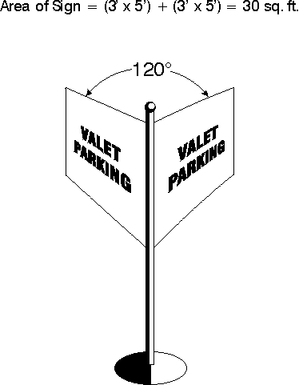

**A. Sign Area of Individual Signs**

The area of a sign face (which is also the sign area of a wall sign or other sign with only one face) is computed by means of the smallest square, circle, rectangle, triangle or combination thereof that will encompass the extreme limits of the writing, representation, emblem, or other display, together with any material or color forming an integral Article of the background of the display or used to differentiate the sign from the backdrop or structure against which it is placed, but not including any supporting framework, bracing or decorative fence or wall when such supporting device otherwise meets the regulations of these Zoning Regulations and is clearly incidental to the display itself.

**B. Area of Double‑Faced Signs**

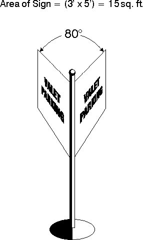

Where the sign faces of a double‑faced sign are parallel or the interior angle formed by the faces is 90 degrees or less, only 1 display face shall be counted in computing sign area. If the 2 faces of a double‑faced sign are of unequal area, the area of the larger sign face shall be counted as the sign’s area. In all other cases, the areas of all faces of a multi‑faced sign shall be added together to compute the area of the sign.

**C. Height**

The height of a sign shall be computed as the distance to the highest point of the sign or sign structure, measured from the elevation of the road to which it is oriented, or, if there is no road, from the finished grade elevation beneath the sign.

**D. Wall Area**

In computing the area of a wall only the first 12 feet of building height shall be used.

**E. Maximum Total Permitted Sign Area for a Lot**

The permitted sum of the area of all individual signs on a lot shall be computed by applying the formula set out in Table 120‑2, (Maximum Total Sign Area), to the lot frontage, building frontage, or wall area, as specified in the table. Lots fronting on 2 or more streets shall be allowed the stated sign area for each street frontage. However, the total sign area that is oriented toward a particular street may not exceed the portion of the lot's total sign area allocation that is derived from the lot, building, or wall area frontage on that street.

**120.4 Signs Exempt from Regulation**

The following signs shall be exempt from regulation under this Article:

A. Any public notice or warning required by a valid and applicable federal, state, or local law or regulation.

B. Signs that are not oriented to or intended to be legible from a street or other private property;

C. Traffic control-type signs on private property, not exceeding 3 square feet in area, the faces of which contain no commercial message of any sort;

D. Merchandise display signs not exceeding 3 square feet.

E. Signs inside of buildings;

F. Works of art that do not contain any commercial message and are not intended to attract attention to the type of business or activity conducted on the premises;

G. Building number and address signs containing no commercial message;

H. Memorial signs, tablets, names of buildings, and date of erection when cut into any masonry surface or when constructed of metal and affixed flat against a structure; and

I. Flags.

**120.5 Prohibited Sign Types**

All signs not expressly permitted under this Article or exempt from regulation are prohibited. Such signs include, but are not limited to:

A. Animated signs;

B. Beacons;

C. Bench signs;

D. Flashing signs;

E. Pennants;

F. Strings of lights not permanently mounted to a rigid background, unless expressly exempted;

G. Inflatable signs and tethered balloons;

H. Portable signs;

I. Roof signs;

J. Signs that by their position, working, illumination, size, shape or color, obstruct, impair, obscure, or interfere with traffic signs, signals, or devices;

K. Signs that mimic official traffic control signs and devices;

L. Signs that obstruct any window, door, fire escape, stairway, or opening intended to provide light, air, ingress, or egress for any building that would cause a violation of building codes;

M. Illuminated signs that cause glare onto traffic or adjacent property; and

N. Signs painted on, attached to, or affixed to any trees, rocks, or other similar organic or inorganic natural matter including light or utility poles or similar apparatus.

**120.6 Location**

**A. Setbacks**

No signs shall be located in side setbacks adjacent to residential zoning districts.

**B. Visibility Triangles**

All signs shall comply with the Intersection Visibility requirements of Article 100.4.

**C. Right-of-Way**

All signs shall be located outside the public right-of-way.

**D. Vehicle and Pedestrian Area Clearances**

When a sign extends over an area where vehicles travel or are parked, the bottom of the sign structure must be at least 14 feet above the ground. When a sign extends over a sidewalk or other area accessible to pedestrians, the bottom of the sign structure must be at least 8½ feet above the ground, provided that a free-hanging valance may extend to within 7½ feet above the ground.

**120.7 Permitted Sign Types**

Signs shall be allowed in accordance with _Table 120-1, Permitted Sign Types_.

**A. Signs Permitted Without Permits**

An “A” indicates that a sign type is allowed in the respective zoning district without a permit. Signs permitted without permits are subject to all other applicable regulations of this Article.

**B. Signs Requiring Permits**

A “P” indicates that a sign type is permitted in the respective zoning district only after a sign permit for the subject sign has been obtained in accordance with Article 30.7. Such signs shall be subject to all other applicable regulations of this Article. Sign permits shall be required for new signs, new sign structures and prior to changing the sign face on an existing sign structure.

**C. Signs Requiring Conditional Use Permits**

A “C” indicates that a sign type is allowed only after review and approval of a conditional use permit, in accordance with the procedures of Article 30.9. In addition to the conditional use permit, a sign permit must also be obtained in accordance with Article 30.10. Such signs shall be subject to all other applicable regulations of this Article.

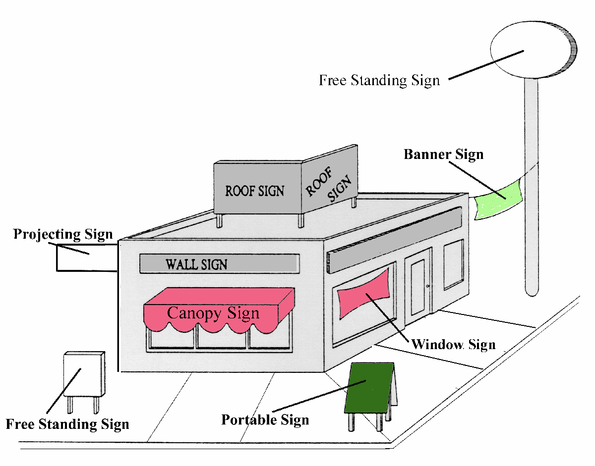

**D. Signs Not Allowed**

An “N” indicates that a sign type is not allowed in the respective district.

**E. Special Sign Standards**

Special sign standards that apply to certain types of signs are indicated in the _Permitted Sign Types Table_ by \[bracketed\] letters

**Table 120-1**

# Permitted Sign Types

|  | Zoning District Class |
| --- | --- |
| Sign Type | R-A/R-1 | Residential (R) | Commercial (C ) | Industrial (I) |
| Freestanding Signs [bracketed letters refer to standards that follow the table] |
| Advertising Billboards and Junior Poster Panels | C | N | C [B] | C [B] |
| Entrance | P [D] | P [D] | P [D] | P [D] |
| Identification | A [E] | A [E] | A [E] | A [E] |
| Incidental | A [F] | A [F] | A [F] | A [F] |
| Residential | A [G] | A [G] | N | N |
| Temporary | A [H] | A [H] | P [H] | P [H] |
| Other | N | N | P | P |
| Building Signs |
| --- |
| Banner | N | N | P [A] | P [A] |
| Building Marker | A [C] | A [C] | A [C] | A [C] |
| Canopy | N | N | P | N |
| Entrance | P [D] | P [D] | P [D] | P [D] |
| Identification | A [E] | A [E] | A [E] | A [E] |
| Incidental | A [F] | A [F] | A [F] | A [F] |
| Projecting | N | N | P | P |
| Residential | A [G] | A [G] | N | N |
| Suspended | N | N | P | P |
| Temporary | A [H] | A [H] | P [H] | P [H] |
| Time/Temperature | N | N | A | A |
| Wall | P [I] | N | P [I] | P [I] |
| Window Sign | N | N | A [J] | A [J] |

Residential = R-1A, R-1B, R-2, R-3 and R-MHP districts

Letters in brackets \[x\] refer to Special Sign Standards of Article 120.8.

**120.8 Special Sign Standards**

**A. Banners**

See Article 120.11 and 120.12.

**B. Billboards and Junior Poster Panels**

Billboards and Junior Poster Panels (also called as “billboards”) shall be allowed only if reviewed and approved as a Conditional Use, pursuant to Article 30.6 and only if they comply with the following standards:

1\. Billboards and Junior Poster Panels may be located only on lots with frontage on numbered state roads.

2\. Billboards and Junior Poster Panels shall not be located within 300 feet of any R-1, R-1A, R-1B, R-2, R-3 or R-MHP zoning district.

1.  Billboards and Junior Poster Panels shall not be erected within 1,400 feet of other Billboards and Junior Poster Panels on the same side of the road. Double-faced sign structures having parallel sign surfaces and adjacent sign structures having touching sign surfaces with an angle no greater than 90 degrees between sign surfaces shall not be prohibited by this requirement, provided they do not exceed applicable sign surface area limits.
2.  The maximum gross area of any billboard shall not exceed 700 square feet.

5\. No billboard shall be attached to the roof of any building.

6\. No billboard shall have more than 1 viewable sign face directed toward the same direction.

7\. Billboards and Junior Poster Panels may be illuminated by electrical lighting of the surface of the sign face, provided that no flashing, blinking or intermittent lighting of billboard sign faces shall be allowed.

8\. Billboard and Junior Poster Panels are structures for purposes of the Zoning Regulations, and they shall be subject to setback, height and other zoning district standards.

**C. Building Markers**

**1\. Residential Districts**

Building markers in residential districts shall be not larger than 2 square feet in area.

**2\. Agricultural/Commercial/Manufacturing Districts**

Building Markers in agricultural, commercial and manufacturing districts shall be not larger than 4 square feet in area.

**D. Entrance Signs**

**1\. Residential Development**

One entrance sign shall be allowed per entrance within a residential development. Entrance signs shall not exceed 24 square feet in area, with a maximum height of 5 feet and a minimum setback of 7.5 feet from all rights-of-way. Entrance signs for residential development shall be allowed in addition to all other allowed signage within a development and shall not be counted in calculating a site’s maximum allowed signage.

**2\. Nonresidential Development**

Entrance signs for nonresidential developments shall comply with all other applicable standards of this Article and shall be counted in calculating a site’s maximum allowed signage.

**E. Identification Signs**

**1\. Residential Districts**

Identification signs in residential districts shall be no larger than 2 square feet in area.

Identification signs may carry only the property address and occupant name. They shall carry no commercial message.

**2\. Agricultural/Commercial/Manufacturing Districts**

Identification signs in agricultural, commercial and manufacturing districts shall be not larger than 16 square feet in area. Identification signs may carry only the property address and occupant name. They shall carry no commercial message.

**F. Incidental Signs**

The size of incidental signs shall not exceed 2 square feet. Incidental signs shall not be counted toward the maximum number of signs permitted on a lot.

**G. Residential Signs**

Residential signs shall carry no commercial message except that they may contain a message identifying a permitted home occupation.

**H. Temporary Signs**

Temporary signs shall be allowed in addition to all signs allowed under this Article and shall not be counted in calculating a site’s maximum allowable signage. Temporary signs shall be subject to the following standards.

**1\. Setbacks and Height**

Temporary signs are subject to the setback and height standards of Article 120.10.

**2\. Agricultural, Residential and Nonresidential Districts**

The following types of temporary signs shall be allowed in all base-zoning districts.

a. Construction Signs

One temporary sign, up to 12 square feet in area, shall be permitted for the duration of an allowed construction project.

b. Temporary Uses and Special Events

One temporary sign, up to 12 square feet in area, shall be permitted for temporary uses and special events for which a temporary use permit has been issued. Such signs shall be allowed for the duration of the temporary use permit or such other time as expressly established at the time of approval of the temporary use permit.

c. Real Estate Signs

One temporary real estate (“for sale” or “for rent”) sign shall be permitted per lot. Temporary real estate signs shall not exceed 6 square feet in area in R-1A, R-1B and R-2 districts or 32 square feet in all other districts.

d. Directional Signs

One temporary directional sign, up to 4 square feet in area, shall be permitted per development or per each 1,000 linear feet of street right-of-way within a development. Directional signs shall be allowed during the time that lots are being marketed.

e. Election Signs

Signs pertaining to official Ray County elections (whether for public office or ballot issues) shall be permitted for a period of no more than 90 days before and not more than 30 days following the election. Such signs shall be allowed without a permit.

**I. Wall Signs**

See Article 120.11 and120.12.

**J. Window Signs**

See Article 120.11 and 120.12.

**120.9 Maximum Total Sign Area Per Lot**

The sum of the area of all building and freestanding signs on a lot shall be less than or equal to the maximum permitted sign area indicated in Table 120-2 (Maximum Total Sign Area Per Lot). The lowest number resulting from any of the applicable alternative computations in any column in Table 120-2 shall be the maximum total sign area permitted for the respective district class.

Table 120-2

**Maximum Total Sign Area Per Lot**

|  |  | Zoning Districts |  |
| --- | --- | --- | --- |
|  | R-A/R-1 | Residential | C-1/C-2/C-3 | I-1/I-2 |
| Square feet of sign area per linear foot of street frontage | N/A | N/A | 2 | 2 |
| Maximum on vacant land* (square feet) | 32 | 12 | 100 | 100 |
| Absolute maximum (square feet) | 64 | 18 | 375 | 750 |

Residential = R-1A, R-1B, R-2, R-3 and R-MHP districts

\*Vacant Land = land without principal structures

**120.10 Number and Dimensions**

All allowed signs shall comply with the standards of Table 120-3

**Table 120-3**

**Number and Dimension of Individual Signs**

|  |  | Zoning Districts |  |
| --- | --- | --- | --- |
|  | R-A/R-1 | Residential | C-1/C-2/C-3 | I-1/I-2 |
| Freestanding Signs |  |  |  |  |
| Maximum Number [1] | 2 | 1 | 1 per street frontage to |
|  |  |  | to which access is taken |
| Maximum Sign Area (square feet) | 32 [2] | 6 [2] | 375 | 750 |
| --- | --- | --- | --- | --- |
| Maximum Height (feet) | 15 [3] | 6 | 40 | 40 |
| Minimum Setback (from right-of-way) | 20 | 1/2 of required zoning district setback | 20 | 30 |
| Building Signs |  |  |  |  |
| Maximum Number (See Article 151-12.11) | 1 | 1 | No Maximum |  |
| Max. Area (pct. of wall area to which attached) | N/A | N/A | 25 | 25 |
| Maximum Area (square feet) | 32 | 2 | N/A | N/A |

Residential = R-1A, R-1B, R-2, R-3 and R-MHP districts

\*1 per road entrance or driveway · N/A = “Not Applicable”

\[1\] Maximum number does not include temporary signs, residential development entrance signs or

incidental signs.

\[2\] Maximum size restriction does not apply to residential development entrance signs.

\[3\] Identification signs over private driveways may be up to 20 feet in height.

**120.11 Building Signs in Nonresidential Districts**

Building signs in nonresidential districts shall be subject to the standards of Table 120-4.

**Table 120-4**

**Building Signs in Nonresidential Districts**

| Sign Type | Number Permitted | Maximum Area |
| --- | --- | --- |
| Banner | 1 per principal building | 5% of wall area |
| Canopy | 1 per building entrance | 16 square feet |
| Projecting | 1 per principal building | 5% of wall area |
| Roof, Integral | 2 per principal building | 5% of wall area |
| Suspended | 1 per building entrance | 5% of wall area |
| Wall | No Limit | 10% of wall area |
| Window | No Limit | 25% of window area |

**120.12 Sign Characteristics**

All allowed signs shall comply with Table 120-5, Permitted Sign Characteristics.

Table 120-5

**Permitted Sign Characteristics**

| Characteristic | District Class |
| --- | --- |
| R-A/R-1/Residential | Other |
| Changeable Copy | No | Yes |
| Illumination, Internal | No | Yes |
| Illumination, External | Yes | Yes |
| Illumination, Exposed Bulbs or Neon | No | No |

Residential = R-1A, R-1B, R-2, R-3 and R-MHP districts

**120.13 Design, Construction and Maintenance**

All signs shall be designed, constructed, and maintained in accordance with the following standards:

A. Signs shall be constructed with fireproof and fire-resistant materials in accordance with the National Electrical Code.

B. All signs shall be constructed to withstand a wind load pressure of at least 25 p.s.f. of surface and shall also be fastened, supported and maintained so as to withstand a wind load pressure of at least 25 p.s.f. per American Society of Engineering standards.

C. Except for banners, flags, temporary signs, and window signs conforming in all respects with the requirements of this Article, all signs shall be constructed of permanent materials and shall be permanently attached to the ground, a building, or another structure by direct attachment to a rigid wall, frame, or structure.

**D. Signs in the Public Right‑of‑Way and Other Public Property**

No signs shall be allowed in the public right‑of‑way or on other publicly owned or leased property, except for the following:

1\. Permanent signs, which shall be limited to:

a. public signs erected by or on behalf of a governmental body to post legal notices, identify public property, convey public information, and direct or regulate pedestrian or vehicular traffic; and

b. informational signs of a public utility regarding its poles, lines, pipes, or other facilities.

2\. Emergency warning signs erected by a governmental agency, a public utility company, or a contractor doing authorized or permitted work within the public right‑of‑way; and

3\. Any sign installed or placed on public property, except in conformance with the requirements of this paragraph, shall be forfeited to the public and subject to confiscation. In addition to other remedies of these Zoning Regulations, the county shall have the right to recover from the owner or person placing such a sign the full costs of removal and disposal of such sign.

**E. Metal Signs**

Signs constructed of metal and illuminated by any means requiring internal wiring or electrically wired accessory fixtures attached to a metal sign shall maintain a free clearance to grade of 9 feet. Accessory lighting fixtures attached to a non‑metal frame sign shall also maintain a clearance of 9 feet to grade. No metal freestanding sign shall be located within 8 feet vertically and 4 feet horizontally of electric wires or conductors in free air carrying more than 48 volts, whether or not such wires or conductors are insulated or otherwise protected.

**F. Maintenance**

All signs shall be maintained in a clean, presentable manner, free from loose paint, paper or other materials. Any sign in disarray or broken condition shall be removed.

**G. Nonconforming Signs**

See Article 130.5.

**BLANK**

**Article 130 Nonconformity**

**130.1 General**

**A. Purpose**

The regulations of this Article govern uses, structures, lots and other situations that came into existence legally but that do not conform to one or more requirements of these Zoning Regulations. It is the general policy of the county to allow uses, struc­tures or lots that came into existence legally and in conformance with then-applicable requirements but that do not conform to all of the applicable re­quirements of these Zoning Regulations to continue to exist and be put to productive use, but to bring as many aspects of such use into compliance with the current Zoning Regulations as is reasonably possible, all subject to the regulations of this Article. The regulations of this Article are intended to recognize the interests of the proper­ty owner in continuing to use property but to control the expansion of nonconformity, prohibit re-establishment of abandoned nonconformity and limit re-establishment of nonconforming structures that have been substantially destroyed.

**B. Authority to Continue**

Any nonconformity that legally existed on June 1, 2005 or that becomes nonconforming upon the adoption of any amendment to these Zoning Regulations may be continued in accordance with the provisions of this Article.

**C. Determination of Nonconformity Status**

The burden of establishing that a nonconformity is a legal nonconformity shall, in all cases be solely upon the owner of such nonconformity.

**D. Repairs and Maintenance**

Incidental repairs and normal maintenance of nonconformity shall be permitted unless such repairs are otherwise expressly prohibited by these Zoning Regulations. Nothing in this Article shall be construed to prevent structures from being structurally strengthened or restored to a safe condition, in accordance with an official order of a public official.

**E.** **Change of Tenancy or Ownership**

The status of a nonconformity is not affected by changes of tenancy, ownership, or management.

**130.2 Nonconforming Uses**

**A. Definition**

A nonconforming use is a use that was legally established but which is no longer allowed by the use regulations of the zoning district in which it is located.

**B. Expansion**

A nonconforming use shall not be enlarged or expanded unless one of the following conditions exists:

1\. such expansion eliminates or reduces the nonconforming aspects of the situation

1.  the expansion is into a part of a building or other structure that was lawfully and

manifestly designed or arranged for such use; or

3\. the expansion is for a living space addition to a house.

4\. Expansion for the sole purpose of providing off-street parking shall not be considered expansion of a nonconforming use.

**C.** **Change of Use**

A nonconforming use may not be changed to any use other than a use allowed in the zoning district in which it is located.

**D. Loss of Legal Nonconformity Status**

1.  **Abandonment**

If a nonconforming use ceases for any reason for a period of more than 180 days, the use shall be considered abandoned. Once abandoned, the use’s legal nonconforming status shall be lost and re‑establishment of the use shall be prohibited. Any subsequent use of the property shall comply with the regulations of the zoning district in which it is located.

1.  **Damage or Destruction**

If a nonconforming use or a structure containing a nonconforming use is destroyed by any means to the extent of more than 50 percent of its value immediately prior to damage, the nonconforming use shall not be restored unless in full compliance with the provisions of these Zoning Regulations.

If a nonconforming use or structure containing a nonconforming use is damaged by less than 50 percent of its value immediately prior to damage, the use may be re-established to the extent that existed before the time of damage, provided that such repairs, restoration or reconstruction are substantially completed within 12 months of the date of such damage.

1.  **Accessory Uses and Structures**

No use or structure that is accessory to a principal nonconforming use or structure shall continue after such principal use or structure shall have ceased or terminated, unless it complies with all regulations of these Zoning Regulations.

**130.3 Nonconforming Structures**

**A. Definition**

A nonconforming structure is any building or structure that was legally established but which no longer complies with the Density, Intensity and Dimensional Standards of Article 70.

**B.** **Use**

A nonconforming structure may be used for any use allowed in the underlying zoning district.

# C. Expansion

A nonconforming structure may be enlarged or expanded if the expansion does not increase the extent of nonconformity, e.g. setbacks, lot coverage, use.

**D.** **Moving**

A nonconforming structure may be moved in whole or in part to another location if the movement or relocation does not increase the extent of nonconformity.

**E.** **Loss of Legal Nonconforming Status; Damage or Destruction**

If a nonconforming structure is damaged or destroyed to the extent of more than 50 percent of its value immediately prior to damage, the nonconforming structure shall not be restored unless in compliance with the provisions of these Zoning Regulations. If a nonconforming structure is damaged by less than 50 percent of its value immediately prior to damage, the structure may be re-established to the extent that existed before the time of damage, provided that such repairs, restoration or reconstruction are substantially completed within 12 months of the date of such damage.

**130.4 Nonconforming Lots**

**A. Definition**

A nonconforming lot is a tract of land, designated on a duly recorded subdivision plat, or by a duly recorded deed, or by other lawful means, that complied with the lot area, lot width and lot depth standards of the zoning district in which it was located at the time of its creation, but which does not comply with the minimum lot area, lot width or lot depth requirements of the zoning district in which it is now located.

# B. Use

**1\. Vacant Lots**

a. In the R-A district, nonconforming lots may be used for detached houses and residential accessory structures and uses allowed in the R-A District, subject to the applicable setback and lot coverage requirements of Article 70. Detached houses may be constructed, and may be reconstructed if damaged or destroyed.

1.  In Residential districts nonconforming lots may be developed with detached houses. Construction of such houses shall comply with all of the regulations (except lot area, width and depth) applicable to detached houses in the zoning district in which the lot is located; provided however, that the following side setback requirements shall apply in place of the side setback requirements otherwise applicable:

(1) The house shall be placed on the lot so as to provide a side setback on each side of the dwelling.

(2) The sum of the widths of the 2 side setbacks on each lot shall not be less than the smaller of:

i. 25 percent of the width of the lot,

ii. The minimum total for both side setbacks prescribed by the dimensional standards of the subject zoning district.

(3) No side setback shall be less than 10 percent of the width of the lot, and in no case less than 5 feet.

1.  In all nonresidential and nonagricultural base zoning districts, nonconforming lots may be developed with uses allowed in the underlying zoning district, provided that they comply with the minimum setback standards the underlying zoning district. If the underlying zoning district allows a variety of uses or a variety of intensities of uses and one or more uses or intensities would comply with applicable lot area, lot width or other dimensional standards, while others would not, then only the uses or intensities that comply with applicable dimensional standards shall be permitted.
    1.  **Developed Lots**

If a nonconforming lot is occupied by a building or structure, then the owner may continue the use of that building or structure and may expand the structure in any way that does not increase the extent of nonconformity, provided that the expansion complies with the building code. An increase in building size shall not be deemed to increase the extent of nonconformity unless it encroaches into a required minimum setback, exceeds the maximum allowed height or otherwise violates a required zoning district dimensional standard.

**130.5 Nonconforming Signs**

**A. Definition**

A nonconforming sign is a sign that was legally established but which no longer complies with the sign regulations of these Zoning Regulations.

**B. Expansion**

A nonconforming sign shall not be enlarged or expanded.

**C. Moving**

A nonconforming sign shall not be moved in whole or in part to any other location unless the move results in the entire sign being brought into compliance with all applicable regulations of these Zoning Regulations.

**D. Loss of Legal Nonconforming Status**

If a sign is destroyed by any means to the extent of more than 50 percent of its replacement value, it may not be reestablished except in compliance with all applicable regulations of these Zoning Regulations.

**Article 140 Violations, Penalties and Enforcement**

**140.1 Responsibility for Enforcement**

The Planning and Zoning Administrator shall enforce these Zoning Regulations.

Ray County operates under statues pertaining to second and third class counties, pursuant to RSMo Chapter 64.800 to 64.840 and 64.845 to 64.895.

**140.2 Types of Violations**

All of the following represent violations of these Zoning Regulations and will be subject to the remedies and penalties provided in the Zoning Regulations, the County Code and state law.

**A. Subdivision, Development or Use Without Required Permits or Approvals**

It is a violation of the Zoning Regulations to engage in any subdividing, development, use, construction, remodeling or other activity of any nature without obtaining all the permits, approvals, certificates and other forms of authorization required by these Zoning Regulations.

**B. Subdivision, Development or Use Inconsistent with Permit**

It is a violation of the Zoning Regulations to engage in any development, use, construction, remodeling, or other activity of any nature in any way inconsistent with the terms and conditions of any permit, approval, certificate or other form of authorization required in order to engage in such activity.

**C. Subdivision, Development or Use Inconsistent with Conditions**

It is a violation of the Zoning Regulations to violate, by act or omission, any term, condition, or qualification imposed by a decision-making body upon a required permit, certificate, or other form of authorization.

**D. Subdivision, Development or Use Inconsistent with Zoning Regulations**

It is a violation of the Zoning Regulations to erect, construct, reconstruct, remodel, alter, maintain, move, or use any building or structure or to use any land in violation or contravention of any zoning, subdivision, or other regulation of the Zoning Regulations, or any amendment thereof.

**E. Making Lots or Setbacks Nonconforming**

It is a violation of the Zoning Regulations to reduce or diminish any lot area so that the setbacks or open spaces are smaller than prescribed by the Zoning Regulations.

**F. Increasing Intensity of Use**

It is a violation of the Zoning Regulations to increase the intensity of use of any land or structure, except in accordance with the procedural and substantive requirements of the Zoning Regulations.

**G. Continuing Violations**

It is a violation of the Zoning Regulations to continue any of the violations specified in this Article. Each day that a violation continues shall be considered a separate offense.

**140.3 Remedies and Enforcement Powers**

The county shall have those remedies and enforcement powers authorized in RSMo. 64.895 for the violation of zoning, subdivision or development-related Zoning Regulations provisions.

**140.4 Enforcement Procedures**

**A. Inspections**

Upon reasonable cause to believe that any of the provisions of these Zoning Regulations have or will be violated, the Planning and Zoning Administrator shall have the power to cause any land, building structure, place or premises to be inspected and examined and to order in writing the remedying of any Zoning Regulations violation found to exist.

**B. Procedures**

In the case of violations of the Zoning Regulations, the Planning and Zoning Administrator shall give written notice of the nature of the violation to the property owner and to any other person who is party to the agreement and to any applicant for any relevant permit, after which the persons receiving notice shall have 10 days, or such longer period as the Planning and Zoning Administrator allows, to correct the violation. If the violation is not corrected within the required time frame, the Planning and Zoning Administrator shall use all penalties, remedies and enforcement powers available under this Article. Notices of violation must state the nature of the violation, the time period allowed for coming into compliance and the nature of subsequent penalties and enforcement actions should the situation not be corrected.

# Building Permit Required

Any person or entity wishing to build or alter any structure shall obtain a building permit from the Building Official.

# Certificate of Occupancy

1\. A certification of occupancy shall be obtained from the Building Official by any person or entity wishing to occupy land, building or use, except for accessory agricultural uses.

*   1.  A Certificate of Occupancy shall state that the building or proposed use of a building or land complies with all the building and health laws and orders and with the provisions of these regulations. No building or land will be occupied until the County Health Department has made a final inspection of the wastewater disposal system after installation and has given approval to the County Building Official for issuance of the Certificate Of Occupancy (CO). A record of all certificates shall be kept on file in the office of the county Building Official.

2\. Certificate of Occupancy for a Building

The certificate of occupancy for a new building or the alteration of an existing building shall be applied for in writing concurrently with the application for a building permit and shall be issued within 10 days after the erection or alteration of such building or part thereof shall have been completed in conformity with the provisions of these provisions.

1.  **Violations**

1\. Any owner, lessee or tenant of land located within any unincorporated area of Ray County, who violates any regulations or orders relating to the subdivision of land or zoning of land, or any regulations relating to building or setback lines, or any regulations and restrictions made and adopted under the provisions of RSMo 64.800 to 64.840 and RSMo 64.845 to 64.880 shall be guilty of a misdemeanor.

1.  In the event any subdivision of land is begun or made in violation of RSMo 64.800 to 64.840 and RSMo 64.845 to 64.880, or of any official master plan, or any planning or zoning order, regulation or restriction made and adopted under these provisions, the County Commission, the County Planning and Zoning Commission, the Prosecuting Attorney, or any officer or official appointed or designated under the provisions of RSMo 64.895, or the owner of any private property or any public body the property of whom is affected by such a violation may institute in the Circuit Court of the County, any appropriate action of proceedings to prevent such unlawful subdivision development or erection, construction, reconstruction, alteration, relocation or maintenance or use, or to retrain, abate or correct such violation, or to prevent the occupancy of such building or structure or unlawful use of such land, and to prevent any illegal act, conduct, business or use in or about the premises.

3\. The official appointed or designated under the provisions of RSMo 64.895 shall have the power to cause any land, building, structure, place or premises to be inspected and examined and to order in writing the remedying of any condition found to exist there or threat in violation of any of the regulations or orders adopted or made under the provisions of this document and RSMo 64.800 to 64.6840 and RSMo 64.845 to 64.880.

1.  The owner or general agent of any such land, building, structure, or premises where a violation of any such orders, regulations or restrictions has been committed or shall exist, and any other person who knowingly permits, takes part or assists in such violation, or maintains any building or premises in which such violation exists, shall be guilty of a misdemeanor.

5\. Unless otherwise directed, violations of these regulations and restrictions set forth in these Zoning Regulations shall constitute a misdemeanor. Any person who violates this ordinance or fails to comply with any of its requirements shall, upon conviction thereof, be fined not more than $100, and in addition, shall pay all costs and expenses involved in the case. Each day such violation continues shall be considered a separate offense. Nothing herein contained shall prevent Ray County or other appropriate authority from taking such other lawful action as is necessary to prevent or remedy any violation.

1.  **Conditional Use Permit Revocation**

1\. A Conditional Use Permit may be revoked at any time by the County Commission upon recommendation of the Planning and Zoning Commission. Before revoking the Conditional Use Permit, the Planning and Zoning Commission shall conduct a public hearing where the matter will be discussed with testimony and evidence taken on the subject. At the close of the public hearing, the Planning and Zoning Commission shall make a recommendation to the County Commission for its consideration and final action.

2\. Prior to the public hearing on the possible revocation of a Conditional Use Permit, a written notice (by certified mail) that a violation has occurred shall be mailed to the permit holder. The notice shall afford the permit holder a specific time period to abate the violation or otherwise correct the problem and shall further grant the permit holder a hearing before the Planning and Zoning Commission in accordance with the preceding paragraph 1.

1.  A Conditional Use Permit may be revoked for any one of the following reasons:

a. The permit holder made material misrepresentations or false statements of fact in the application or during the hearing on the application;

b. The provisions or conditions of these Zoning Regulations have been violated;

c. The conditions placed upon such use as part of the Conditional Use Permit approval are not being met, or the use is not complying with any other county regulations applicable to the operation of such uses.

**Article 150 Definitions**

**150.1 Terms and Uses Defined**

The following terms shall have the meanings ascribed. Uses not specifically defined shall have their common, ordinary meaning. In either case, the Planning & Zoning Administrator shall have the authority to interpret the definition of any word as it applies to the enforcement of these Zoning Regulations.

| Term | Definition |
| --- | --- |
| Abandonment | When the use of a property has ceased and the property has been vacant for180 days, abandonment of use will be presumed unless the owner can show that a diligent effort has been made to sell, rent, or use the property for a legally permissible use. |
| Abandoned Vehicle | Any motorized vehicle incapable of immediately being driven or not properly licenses or inspected for safety in accordance with state law. Farm equipment is exempted. |
| Abate, Abatement | To end a nuisance, emergence, or nonconformance. |
| Abutting | Having a common border with or being separated from such common border only by an alley, easement or right-of-way. |
| Access | A means of vehicular entry to or exit from property. |
| Accessory Apartment | A dwelling unit that is wholly contained within the principal structure and is never rented. Typical uses include a “mother-in-law” apartment, guest apartment or domestic workers’ quarters. |
| Accessory Dwelling Unit | A separate dwelling located on the same lot as the principal structure, which is a maximum of 850 sq. ft. footprint, contains no kitchen (per building code requirements) or a “kitchenette”, and is never for rent. Typical uses include a “mother-in-law” apartment, guest cottage or domestic employee quarters. |
| Accessory Structure | A structure that: (1) is subordinate to and services a principal building or a principal use legally existing on the same zoning lot; (2) is subordinate in area, extent and purpose to the principal building or principal use; (3) contributes to the comfort, convenience or necessity of the occupants, business or industry of the principal structure or principal use served and (4) is located on the same zoning lot as the principal structure or principal use served. |
| Accessory Use | A use that: (1) is subordinate to and services a principal building or a principal use legally existing on the same zoning lot; (2) is subordinate in area, extent and purpose to the principal building or principal use; (3) contributes to the comfort, convenience or necessity of the occupants, business or industry of the principal structure or principal use served and (4) is located on the same zoning lot as the principal structure or principal use served. |
| Acreage, Net | A measure of developable land area after excluding existing dedicated rights-of-way and flood control and drainage easements. |
| Acreage, Gross | The acreage within the perimeter of a development tract, plus one half the right-of-way of all adjoining streets and alleys. |
| Term | Definition |
| --- | --- |
| Address | The number or other designation assigned to a housing unit, business establishment, or other structure for purposes of mail delivery, emergency services, and so forth. |
| Adjoining Properties | Property that touches or is directly across a street from the subject property or within 1000 feet. |
| Adult Bookstore | An establishment having 10 percent or more of its stock and trade, books, photographs, magazines, films for sale or viewing on the premises by use of motion picture devises, video machines, or other coin‑operated means, or other periodicals which are distinguished or characterized by their principal emphasis on matters depicting, describing or relating to specified sexual activities as that term is defined in this Article. |
| Adult Entertainment Facility | Any building, structure or facility which contains or is used entirely or partially for commercial entertainment, including theaters used for presenting live presentations, video tapes or films, predominantly distinguished or characterized by their principal emphasis on matters depicting, describing or relating to specified sexual activities as that term is defined in this Article, or exotic dance facilities (regardless of whether the theater or facility provides a live presentation, video tape or film presentation), where the patrons either:(1) engage in personal contact with, or allow personal contact by employees, devices or equipment, or by personnel provided by the establishment which appeals to the prurient interest of the patrons; or(2) observe any live presentation, video tape or film presentation of persons wholly or partially nude with their genitals or pubic region exposed or covered only with transparent or open covering, or in the case of female persons with the areola and nipple of the breast exposed or covered only with transparent or open covering, or to observe specified sexual activities as that term is defined in this Article. |
| Adult | An individual who is at least 18 years of age. |
| Adult Use | Any Adult Bookstore, Adult Entertainment Facility, Bath House, Massage Shop, or Modeling Studio. |
| Agricultural Use | The use of a tract of land for the growing of crops, pasture, nursery, or the raising of poultry, including the structures necessary for carrying out farming operations and the residence, or residences, of those owning or operating the premises, a member of their family, or persons employed thereon, and their family; but such use shall not include feedlots. |
| Agricultural Sales and Service | An establishment engaged in sale from the premises of feed, grain, fertilizers, pesticides and similar goods or in the provision of agriculturally related services with incidental storage on lots other than where the service is rendered. |
| Airstrip, Private | A designated area for takeoffs and landings for small privately owned aircraft that is substantially subordinate to the agricultural use of the property. The airstrip must meet all FAA regulations for operation. |
| Airstrip, Public | A designated area for takeoffs and landings for privately or commercially owned aircraft and meets all FAA regulations for operations. Limited ground support may be included. |
| Alley | A public or private traffic way, other than a street, 20 feet or less in width affording secondary means of access to abutting property. |
| Amusement Parks | A commercially operated park with a predominance of outdoor games and activities for entertainment. |
| Animals, Companion | Any animal that is commonly kept by persons as a pet. The definition includes but is not limited to domesticated dogs, cats and horses. |
| Animals, Exotic or Wild | Any animal that is not normally domesticated in the United States or is not by nature. See Article 60.2C. |
| Animals, Farm | Livestock that are commonly used by persons for use, draft or pleasure purposes. Livestock includes, but is not limited to poultry, cattle, buffalo, swine, sheep, goats, horses, mules, emus, ostriches, elk, alpaca, and llamas. |
| Animal Production | The raising of farm animals or production of animal products on an agricultural or commercial basis. |
| Animal Service | Retail sales, veterinary service, grooming, and boarding of dogs, cats, birds, fish, or similar small animals customarily used as household pets, provided all such activities are totally enclosed within a building. Typical uses include pet stores, small animal clinics, dog bathing and clipping salons, and pet grooming shops, but exclude uses for livestock and large animals. |
| Animals, Zoological or Refuge | An animal preserve that is either public or private that is properly certified by accredited bodies or the US Department of agriculture. |
| Antenna Support Structure | Any pole, telescoping mast, tower, tripod, or any other structure which supports a device used in the transmitting or receiving of radio frequency energy. |
| Antenna Support Structure Heist | The vertical distance measured from the base of the antenna support structure at grade to the highest point of the structure. If the support structure is on a sloped grade, then the average between the highest and lowest grades shall be used in calculating the antenna height. Such height measurement shall also not include lightning arresters 12 feet or less in length. |
| Antenna | See “Tower” |
| Antenna | Any structure or device used to collect or radiate electromagnetic waves, including both directional antennas, such as panels, microwave dishes and satellite dishes and omni‑directional antennas, such as whips but not including satellite earth stations. |
| Architectural Projection | Any physical component of a structure at least three feet above ground elevation over which it is located. |
| Arterial Street or Road | A major vehicular thoroughfare as designated in the Comprehensive Plan. |
| Aviation and Surface Transportation | Airports, landing fields, aircraft parking and service facilities, and related facilities for operation, service, fueling, repair, storage, charter, sales, and rental of aircraft, including activities directly associated with the operation and maintenance of airport facilities and the provision of safety and security. Aviation and Surface Transportation also includes facilities for loading, unloading, and interchange of passengers, baggage, and incidental freight or package express between modes of transportation, including bus terminals, railroad stations, and public transit facilities. |
| Bar or Lounge | A use engaged in the preparation and retail sale of alcoholic beverages for consumption on the premises, including taverns, bars, cocktail lounges, and similar uses other than a Restaurant. |
| Basement | The portion of a building that is partially or wholly below ground level. The basement is not a complete structure and it serves as a substructure or foundation for a building. |
| Bath House | An establishment or business which provides the services of baths of all kinds, including all forms and methods of hydrotherapy, unless operated or supervised by a medical or chiropractic practitioner or professional physical therapist licensed by the state. |
| Bed-and-Breakfast (B&B) | A private residence that offers for rent, sleeping accommodations of six or fewer guest rooms in the innkeeper’s principal residence, and serves breakfasts at no extra cost to its lodgers. Rentals shall not be for more than 21 consecutive days. |
| Billboard | See Article 120.2 |
| Block | Land that is entirely surrounded by public highway, street, roads, railroad right‑of‑way or parks, and the like, or a combination thereof. |
| Board of Zoning Adjustment | The board that has been created by the County Commission to hear and determine Appeals of Administrative Decisions and variances. |
| Boarding, Rooming, or Lodging House | A single-family dwelling where more than two, but fewer than six rooms are provided for lodging for definite periods of times of 30 consecutive days or more where meals may or may not be provided to lodgers. |
| Bond | Any form of security including a cash deposit, surety bond, collateral, property or instrument of credit in an amount and form satisfactory to the County Commission. |
| Botanic Gardens | A public or private facility for the demonstration and observation of the cultivation of flowers, fruits, vegetables or ornamental plants. |
| Building Line (setback line) | The line or lines within a lot created by the intersection of the vertical planes of a building and the ground. The required building setback line is measured from the property line. |
| Building, Principal | A building in which is conducted the principal use of the lot on which it is situated. |
| Building | A structure built, maintained, or intended for use for the shelter or enclosure of persons, animals, or property of any kind. |
| Building, Front of | That exterior wall of a building which faces the abutting street side property line of the lot or parcel |
| Building Permit | A permit issued by Ray County for the construction, erection or alteration of a structure or building. |
| Building, Height of | See “Height, Building” |
| Business or Trade School | A use providing education or training in business, commerce, language, or other similar activity or occupational pursuit, and not otherwise defined as a home occupation, college, university, or public or private educational facility. |
| Cabins, Rental | Separate housekeeping quarters for transient rental of not more than 21 consecutive days. |
| Campground | The use of land designed for occupancy by tents or recreational vehicles for temporary or transient living purposes |
| Care Center | See “Congregate Living” |
| Caretaker’s Residence | A residence located on the premise of a nonresidential use and occupied only by a caretaker or guard. Also see, “Accessory Dwelling Unit.” |
| Cemetery | Land used or intended to be used for burial or cremation of the dead, whether human or animal, including a mausoleum or columbium. |
| Cluster Development | A residential use that divides land into separate lots and where the size of the individual lots may be reduced in order to gain common open space. |
| Club or Lodge | An establishment providing meeting, recreational, or social facilities for a private or nonprofit association, primarily for use by members and guests. Typical uses include private social clubs and fraternal organizations. |
| Co‑location | Locating wireless communications equipment from more than one provider on a single mount, tower, or support structure. |
| Code Enforcement | Duties designated to the Administrator of Planning and Zoning to cause property owners and others responsible for buildings and related land uses to bring their properties up to standards required by building codes, housing codes and other regulations. |
| Collector Street or Road | An intermediate major vehicular thoroughfare as designated in the Comprehensive Plan. |
| College and University Facility | An educational institution or other institutions of higher learning that offer courses of general or specialized study leading to a degree. |
| Commercial Recreational Equipment Storage | A site where privately owned major recreational equipment is stored for compensation. |
| Commercial | A land-use classification that permits facilities for the buying and selling of commodities and services. |
| Communication Tower | A guyed, monopole, or self‑supporting tower, constructed as a free‑standing structure or in association with a building, other permanent structure or equipment, containing one or more antennas intended for transmitting or receiving television, am/fm radio, digital, microwave cellular, telephone, or similar forms of electronic communication. |
| Communication Tower, Amateur | See “tower” |
| Communication Tower,Commercial | See “tower” |
| Communication Service | An establishment primarily engaged in the provision of broadcasting and other information relay services accomplished through the use of electronic and telephonic mechanisms, but excludes those classified as major utility facilities. Typical uses include television, film, or sound recording studios, telecommunication service centers, and telegraph service offices. |
| Communications Facility | A land use facility supporting antennas and microwave dishes that sends and/or receives radio frequencies signals. Communications facilities include structures or towers, accessory buildings, and ground base equipment. |
| Community Recreation, Private | A recreational facility for use by residents and guests of a particular residential development, planned unit development, church, private primary or secondary educational facility, club or lodge, or non‑profit organizations, including both indoor and outdoor facilities. |
| Comprehensive Plan | The Ray County Comprehensive Plan. |
| Conditional Use | A use of land that is not permitted by right, but requires review by the County stating the specific conditions and standards required of that individual use. |
| Condominium | A single dwelling unit under individual ownership within a duplex or multi-dwelling structure. A multiple‑dwelling structure with 2 condominiums shall be considered a duplex and a structure with more than 2 condominiums shall be considered a multiple‑dwelling structure. |
| Congregate Living | A use providing 24-hour supervision and assisted living for more than 15 residents not needing regular medical attention. This classification includes personal care homes for the physically impaired, mentally retarded, developmentally disabled, and persons 62 years of R-Ae or older, maternity homes, and emergency shelters during crisis intervention for victims of crime, abuse, or neglect. |
| Conservation District | A zoning overlay district intended to be applied to selected areas of residential districts in order to increase common open space and preserve the existing natural features of the land. |
| Construction Sales and Service | An establishment primarily engaged in construction activities and incidental storage on lots other than construction sites as well as the retail or wholesale sale, from the premises, of materials used in the construction of buildings or other structures other than retail sale of paint, fixtures and hardware. Typical uses include building materials stores, tool and equipment rental or sales, or building contractors. |
| Consumer Convenience Service | An establishment providing services, primarily to individuals, of a convenient and limited nature, often in access‑controlled facilities that make twenty‑four hour operation possible. Typical uses include the renting of private postal and safety deposit boxes to individuals and automated banking machines. |
| Contiguous | Immediately adjacent to (at one or more points) and not separated by a railroad or right‑of‑way. |
| Convalescent Service | A use providing bed care and in‑patient services for persons requiring regular medical attention, but excluding a facility providing surgical or emergency medical services, and excluding a facility providing care for alcoholism, drug addiction, mental disease, or communicable disease. Typical uses include nursing homes. |
| Covenant, Protective | Contract made between private parties as to the manner in which land may be used with a view towards protecting and preserving the physical and economic integrity of an area. Covenants are not enforced by the county government. |
| Convenience Store | An establishment, not exceeding 5,000 square feet of gross floor area, engaged in the retail sale of food, beverages and other frequently needed items for household use. Gasoline sales may or may not be included. |
| Creek | A stream of surface water sufficient to produce a defined channel or bed. |
| Crop Production | The raising and harvesting of tree crops, row crops, or field crops on an agricultural or commercial basis, including packing and processing. |
| Cul-de-Sac | A street ending in a turn-around, designed, and intended as a permanent or temporary terminus. |
| Cultural Service | A library, museum, or similar registered nonprofit organizational use displaying, preserving, and exhibiting objects of community and cultural interest in one or more of the arts and sciences. |
| Dam | All obstructions, wall embankments or barriers constructed for the purpose of storing or diverting water or creating a pool. |
| Day Care Center | A non‑residential building where care, supervision, custody or control is provided for children or adults for any part of a 24-hour day up to 12 hours of total daily operation, or a residence where such care is provided for more than four unrelated children or adults. |
| Day Care, Group | A day care center that provides care, protection and supervision for 11 to 21 individuals at any one time, including those under the supervision or custody of the day care provider and those under the supervision or custody of employees. |
| Day Care, Commercial | A day care center that provides care, protection and supervision for more than 21 individuals at any one time, including those under the supervision or custody of the day care provider and those under the supervision or custody of employees. |
| Day, Business or Work | A work day in which the Ray County offices are open for business, exclusive of weekends and holidays, as established by the County Commission. |
| Day Care, Family | A day care that provides care, protection and supervision for 5 to 10 non-related individuals at any one time, including those under the supervision or custody of the day care provider and those under the supervision or custody of employees. |
| Decision-Making Body | The entity that is authorized to finally approve or deny an application or permit required under these Zoning Regulations. |
| Dedication | The transfer of property interests from private to public ownership for a public purpose. The transfer may be of fee-simple interest or of a less than fee interest, including an easement. |
| Deed Restriction | An agreement that binds and restricts the land in the hands of present owners and subsequent purchasers. Deed Restrictions are enforced by the land owners involved and not by the county government. |
| Density | The number of dwelling units permitted per net gross acre of land. |
| Design | The location of streets, alignment of streets, grades, and widths of streets, alignment of easements, grades and widths of easements, alignment and right‑of‑way for drainage and sanitary sewers, and the designation of minimum lot area, width and length. |
| Detention Facility | A publicly operated use providing judicially required detention or incarceration of people. |
| Developer | The legal or beneficial owner or the representative thereof, of a lot or parcel of any land proposed for inclusion in a development, including the holder of an option or contract to purchase. |
| Development | The division of a parcel of land into 2 or more parcels; the construction, reconstruction, conversion, structural alternation, relocation, or enlargement of any buildings; any use or change in use of any build­ings or land; any extension of any use of land or any clearing, grading, excavation or other movement of land, for which permission may be required pursuant to these Zoning Regulations |
| Dog | Any canine species over 6 months of age. |
| Driveway | A private roadway of an impervious nature providing access for vehicles to a parking space, garage, dwelling, or other structure. |
| Dump | A lot of land used primarily for the disposal, by abandonment, dumping, burial, burning, or any other means and for what purpose, or garbage, sewage, trash, refuse, junk, discarded machinery, vehicles or parts thereof, or waste material of any kind. (Also see “Sanitary Landfill.”) |
| Duplex | The use of a single lot or parcel for 2 dwelling units contained within a single building, other than a mobile home. |
| Dwelling, Accessory | A separate dwelling unit contained within the structure housing the principal dwelling unit and occupied for residential purposes by a person or persons either employed on the premises or related by blood, marriage or adoption to the occupants of the principal dwelling. Also see “Guest House.” |
| Dwelling for the Elderly and/or Handicapped | A two‑family or multiple‑family residential building having accommodations for and occupied exclusively by elderly or handicapped residents and necessary maintenance personnel. Elderly residents are those people who are at least 62 years of age. Handicapped persons are those people having an impairment that is expected to be of long, continuous and indefinite duration, is a substantial limitation to their ability to live independently, and is of a nature that such ability could be improved by more suitable housing. |
| Dwelling, Single-family | Same as “house.” |
| Dwelling Unit | A building or portion of it designed and used for residential occupancy by a single household and that includes exclusive sleeping, cooking, eating and sanitation facilities. Buildings with more than one set of cooking facilities are considered to be multi-dwelling structures unless the additional cooking facilities are clearly accessory. |
| Earth‑Sheltered Residence | A residence designed as a complete structure below or partially below ground level, whose perimeter walls comply with the yard requirements of the district in which it is located. |
| Easement | A grant by a property owner to the use of land by the public, a corporation, or persons for specific purposes such as the construction of utilities, drainage ways and roadways. |
| Efficiency (apartment) | A dwelling unit containing less than 800 square feet of floor area and no separate bedroom. |
| Entertainment, Indoor | An establishment offering recreation, entertainment or games of skill to the general public for a fee. Typical uses include bowling alleys, bingo parlors, pool halls, theaters, banquet facilities, and video game arcades. |
| Entertainment, Outdoor | An establishment offering recreation, entertainment or games of skill to the general public for a fee. Typical uses include archery ranges, batting cages, golf driving ranges, miniature golf courses and drive-in theaters. |
| Erected | Includes the terms “constructed,” “moved,” “located,” or “relocated.” |
| Extractive Industry | The extraction of minerals, including solids, such as coal and ores; liquids, such as crude petroleum, and gases, such as natural gases. The term also includes quarrying; well operation; milling, such as crushing, screening, washing and flotation; and other preparation customarily done at the extraction site or as part of the extractive activity. (Also see “Gravel Pit”) |
| FAA | Federal Aviation Administration |
| Family | See “Household” |
| Farm Animals | Any animal customarily raised on farms, including, llama, burros, cattle, calves, bison, chickens, horses, turkeys, ducks, geese, donkeys, emus, goats, mules, ostriches, swine, sheep or lambs. |
| Farmland | Land in active agricultural or horticultural use. |
| FCC | Federal Communications Commission |
| Feedlot | A livestock feeding operation carried on for more than 30 days on non-vegetated lots for the purpose of fattening livestock for slaughter, which is classified by the Missouri Department of Natural Resources as a Class 1A, Class 1B, or Class 1C Confinement Animal Feeding Operation. |
| Fence | A construction, not considered a structure, which is designed for screening or enclosing. Landscaping screens of a height of over 6 feet shall be considered a fence whereas random plantings of any height shall not be considered a fence. |
| Final Plat | A plan or map prepared in accordance with the provisions of this regulation and those of any other applicable local regulation, which plat is prepared for recording in the office of the Recorder of Deeds of the county. |
| Financial Service | An establishment primarily engaged in the provision of financial and banking services. Typical uses include banks, savings and loan institutions, stock and bond brokers, loan and lending activities, and similar services. |
| Firearm | Any hand weapon from which a projectile is discharged by an explosive force. |
| Floodplain | That area defined as having a 1% chance of flooding in any given year and shall include all area shown in the 100‑year floodplain as designated on the Flood Insurance Study (F.I.S.), as prepared by the U.S. Federal Emergency Management Agency or its equivalent agency. |
| Floor Area, Gross | The sum of the gross area for each of a building’s stories under roof, measured from the exterior faces of the exterior walls or from the centerline of walls separating two buildings, include the following areas: (a) the area of each floor of the structure and (b) all attic space having headroom of 7 feet‑10 inches or more. |
| Food Sales | An establishment primarily engaged in the retail sale of food or household products for home consumption. Typical uses include grocery stores (including the sale of beer and wine in unopened containers for off‑premise consumption where revenue from the sale of groceries comprises at least 51% of the gross income of the establishment, and at least 51% of the total display or shelf space is devoted to groceries other than beer and wine), delicatessens, meat markets, retail bakeries, and candy shops. |
| Foster Home | A residence in which 12 to 24-hour care is provided to no more than 8 children, 2 or more of which are unrelated to the foster parents. |
| Funeral Service | An establishment engaged in undertaking services such as preparing the human dead for burial and arranging and managing funerals. Typical uses include funeral home or mortuaries. |
| Garage | A structure or part thereof, designed, used or intended to be used for the parking and storage of motor vehicles. |
| Grade, Existing or Natural | The vertical elevation of the existing ground surface prior to excavation or filling. |
| Garden Center | An establishment primarily engaged in the retail sales of horticultural specialties, such as flowers, shrubs and trees, intended for ornamental or landscaping purposes. |
| Grading | The contouring of land to a specified level or slope. |
| Gravel Pit | An open land area where sand, gravel, and rock fragments are mined or excavated for sale or off-tract use. (Also see “Extractive Industry”) |
| Greenbelt | A series of connected open spaces that may follow natural features such as ravines, creeks, or streams. |
| Greenhouse | A glass or plastic enclosure used for the protection and cultivation of plants. |
| Greenhouse, Retail | A greenhouse used to grow bedding and potting plants, ornamental flowers, and related material for sale on or off site. |
| Greenhouse, Production | A greenhouse used to grow produce for the sale to restaurants, farmer's markets, grocery stores and other off‑site markets. |
| Group Residential | The residential use of a site for occupancy by groups of more than six persons not defined as a family, on a weekly or longer basis. Typical uses include occupancy of fraternity or sorority houses, dormitories, residence halls, boarding houses or fraternal orders. |
| Group Home, Class I (Limited) | A home-based facility providing 24-hour care in a protected living arrangement for not more than 8 residents and 2 supervisory personnel. This classification includes foster homes, homes for the physically and mentally impaired, homes for the developmentally disabled, congregate living facilities for persons 62 years of age or older, and maternity homes. It also includes emergency shelter during crisis intervention for victims of crime, abuse, or neglect. |
| Group Home, Class II | A home-based facility providing 24-hour care in a protected living arrangement for not more than 15 residents and not more than 3 supervisory personnel. This classification includes homes for juvenile delinquents, halfway houses providing residence in lieu of institutional sentencing, halfway houses providing residence to those needing correctional and mental institutionalization. |
| Group Home, Class I (General) | A home-based facility providing 24-hour care in a protected living arrangement for more than 8 but not more than 15 residents and not more than 3 supervisory personnel. This classification includes foster homes, homes for the physically and mentally impaired, homes for the developmentally disabled, congregate living facilities for persons 62 years of age or older, and maternity homes. This classification also includes emergency shelter during crisis intervention for victims of crime, abuse, or neglect, and residential rehabilitation for alcohol and chemical dependence. |
| Guest House, For rent | A detached accessory building offered for rent where meals may or may not be provided, for not more than 21 consecutive days. |
| Guest House, Private | An attached or detached accessory building used to house guests of the occupants of the principal building, which is never rented or offered for rent, and that does not contain a kitchen (per building code) or has a “kitchenette.” |
| Guidance Service | An establishment providing out-patient counseling, guidance, recuperative, or similar services to persons requiring rehabilitation assistance as a result of mental illness, alcoholism, detention, drug addiction, or similar condition, on a daytime care basis. |
| Guyed Tower | A communication tower that is supported, in whole or in part, by guy wires and ground anchors. |
| Hazardous Material | Any substance that, because of its quantity, concentration, or physical or chemical characteristics, poses a significant present or potential hazard to human health and safety or to the environment if released into the workplace or the environment. The term includes, but is not limited to, hazardous substances and hazardous wastes. |
| Height (of structure other than a building) | The vertical distance as measured from the average ground elevation to the highest point on such structure. See also “Height, Building.” |
| Height, Building | The vertical distance between the average finished grade (based on an average of the highest and lowest points) at the base of the building being measured and: 1) the average height level between the eaves and ridge line of a gable, hip or gambrel roof; 2) the highest point of a mansard roof; or 3) the highest point of the coping of a flat roof. |
| Home Care Service | A residence where care, supervision, custody, or control is provided for 4 or fewer unrelated children or adults for any part of a 24-hour day up to 12 hours. Home care services shall be considered home occupations. |
| Home Occupation | Any occupation, profession, business, or activity carried on in premises primarily residential in character in accordance with the home occupation requirements of these Zoning Regulations. |
| Homeowners Association, Elective | An incorporated nonprofit organization operating under recorded land agreements through which each lot owner elects to pay annual dues, and there is not jointly owned common property to be maintained. |
| Homeowners Association, Mandatory | An incorporated nonprofit organization operating under recorded land agreements through which: (a) each lot owner is automatically a member; and (b) each lot is automatically subject to a proportionate share of the expenses for the organization’s activities, such as maintaining common property. |
| Horticulture | The growing of horticultural and floricultural specialties, such as flowers, shrubs, or trees intended for ornamental or landscaping purposes, but excluding retail sales. Typical uses include wholesale plant nurseries and greenhouses. |
| Hospital | Uses providing in‑patient medical or surgical care, which also may include out‑patient services and the following types of accessory activities out‑patient clinics, offices, laboratories, teaching facilities, meeting areas, cafeterias maintenance and parking facilities. |
| Hotel-Motel | A building, or a group of buildings, used for transient lodging open to the general public and which may provide additional services such as restaurants, meeting rooms, entertainment, and recreational facilities. A hotel may offer suites, which include kitchen facilities, sitting rooms, and bedrooms. Such establishments may be designated as an automobile court, motel, motor lodge, motor court, tourist cabin, tourist court, or other similar designations. |
| House, Detached | A single dwelling unit, located on its own lot, which is not attached to any other dwelling unit. The term includes residential-design manufactured housing units and modular houses. |
| House, Modular | A detached house that is manufactured in Articles and finally assembled on the site. Modular homes comply with the Missouri Public Service Commission’s adopted building codes and the residential design standards of Article 100.6. |
| House, Attached | A single dwelling unit, located on its own lot, which shares one or more common or abutting walls with one or more dwelling units. An attached house does not share common floor/ceilings with other dwelling units. An attached house is also called a townhouse. |
| Household | Any one of the following: (a) one or more persons related by blood, marriage, adoption, or legal guardianship, including foster children, living together in a dwelling; (b) up to 4 unrelated persons; or (c) 2 unrelated persons and their children living together in a dwelling unit. |
| Impact Fee | A regulatory fee on all new development that may be required by the County as a condition of development approval and collected, at the latest, prior to issuance of a building permit, to insure that necessary funds for transportation improvements, trails, parks, and the like are or will be in place to accommodate the needs generated by such new development or to provide funds to enhance the existing systems. |
| Impervious Surface | Any hard-surfaced, man made area that does not readily absorb or retain water, including but not limited to building roofs, parking and driveway areas, graveled areas, sidewalks and paved recreation areas. |
| Improvements, Public | Any improvement necessary to provide for public needs. |
| Improvements | Any man-made changes to any land or structure. |
| Individual Sewage Disposal System | A sewage treatment and disposal system that (1) infiltrates treated wastewater into soil; (2) discharges wastewater to the surface where the projected daily flow is less than 1,500 gallons; or (3) holds wastewater in a tank for removal or disposal at a remote site. |
| Industrial Service | An establishment engaged in the repair or servicing of industrial, business or consumer machinery, equipment, products or by‑products. Firms that service consumer goods do so by mainly providing centralized services for separate retail outlets. Contractors and building maintenance services and similar uses perform services off‑site. Few customers, especially the general public, come to the site. Typical uses include welding shops; machine shops; tool repair; electric motor repair; repair of scientific or professional instruments; sales, repair, storage, salvage or wrecking of heavy machinery, metal and building materials; towing and vehicle storage; auto and truck salvage and wrecking; heavy truck servicing and repair; tire retreading or recapping; truck stops; building, heating, plumbing or electrical contractors; exterminators; recycling operations; janitorial and building maintenance services; fuel oil distributors; solid fuel yards; above‑ground tanks used for the storage or dispensing of Class I or Class II petroleum products (as defined in the Fire Code); research and development laboratories; laundry, dry‑cleaning and carpet cleaning plants; and photo finishing laboratories. |
| Industrial, Heavy | A use engaged in the basic processing and manufacturing of materials or products predominately from extracted or raw materials, or a use engaged in storage of or manufacturing processes using flammable or explosive materials, or storage or manufacturing processes that potentially involve hazardous or commonly recognized offensive conditions. This is consistent with the I-2 zoning district. |
| Industrial, Light | Research and development activities, the manufacturing, compounding, processing, packaging, storage, assembly and/or treatment of finished or semi-finished products from previously prepared materials, which activities are conducted wholly within an enclosed building. This is consistent with the I-1 zoning district. |
| Interior Lot | See “Lot, Interior.” |
| Junk | Building materials, trash, automobiles, furniture, appliances or any other items that have been discarded on the exterior of a structure and create an unsightly appearance, or a health hazard. |
| Kennel | Boarding and care services for more than 3 dogs, including the keeping of dogs as pets. Typical uses include boarding kennels, pet motels, and dog training centers. |
| Kitchen | Any room principally used, intended or designed to be used for cooking or the preparation of food. The presence of a double sink with plumbing shall be considered as establishing a kitchen. |
| Kitchenette; Limited Kitchen | A limited kitchen facility that does not include a stove, range top or double sink. (See Article 60.3A7) |
| Lattice Tower | A guyed or self‑supporting three or four sided, open, steel frame structure used to support communications equipment. |
| Lawn/Landscaping Service | Lawn maintenance services which are conducted entirely on the property of the consumer, with the exception of a business office or the storage of two units of landscaping equipment (a unit is one trailer with mowers) stored on site. |
| Legal Description | A legal description of a parcel of land defining the boundaries in Article, range, township, or by lot number and subdivision, as would appear on a warranty deed, and prepared by a registered surveyor. |
| Level of Service (LOS) | The level of service specified by the Highway Administrator that will carry a certain load of traffic on a roadway during a specific period. |
| Liquor Sales | An establishment engaged in retail sale for consumption off the premises of alcoholic beverages. Typical uses include liquor stores, bottle shops, or any licensed sales of liquor, beer or wine for off‑site consumption. |
| Livestock | Same as “Farm Animal” |
| Lot | A single, legally created parcel of land intended as a unit for transfer of ownership or for development. Lot includes the word “plot” or “parcel” |
| Lot, Corner | A lot abutting two or more streets at their intersection. |
| Lot, Irregular | A parcel of land that is neither rectangular nor square or when an area cannot be calculated by simple math. |
| Lot Area | The area contained within the boundary lines of a lot, excluding any street, easement for street purposes, or street right-of-way. |
| Lot Frontage | That portion of a lot that abuts a public street, each side of a lot so abutting a public street shall be considered as separate lot frontage. |
| Lot, Interior | A lot other than a corner lot. |
| Lot Line | A line bounding a lot which divides one lot from another or from a street or any other public or private space (same as “property line”) |
| Lot Line, Rear | That lot line which is parallel to and most distant from the street lot line of the lot; in the case of a triangular, or an irregular lot, a line 20 feet in length, entirely within the lot, parallel to and at the maximum possible distance from, the street lot line shall be considered to be the rear lot line. In the case of corner lots, the rear lot line shall be opposite the lot line along which the lot takes access to a street. |
| Lot, Double-frontage | See “Lot, Through” |
| Lot Line, Street | In the case of a lot abutting only one street, the lot line separating a lot from the street; in the case of a corner lot, each lot line separating the lot from a street; in the case of a double frontage lot, each lot line separating the lot from a street shall be considered to be the street lot line, except where the rear setback requirement is greater than the front setback requirement in which case one of two opposing setbacks shall be a rear setback. |
| Lot Measurements | The size of a lot is measured by:(1) lot depth: the mean horizontal distance between the front and rear lot lines.(2) lot frontage: that portion of a lot that abuts a public street. Each side of a lot so abutting a public street shall be considered as separate lost frontage.(3) lot width: the width of a lot at the minimum setback line. |
| Lot, Flag or Panhandle | A lot resulting from the division of a tract of land that, before its division, did not have sufficient width on a street to create more than one lot abutting said street but had sufficient area and depth to be divided into more than one buildable lot. |
| Lot Depth | The mean horizontal distance between the front and rear lot lines. |
| Lot Line, Side | Any lot lines other than a street or rear lot line. |
| Lot, Through (double frontage) | A lot having frontage on 2 nonintersecting streets, as distinguished from a corner lot. |
| Lot, Zoning | A parcel of land: (1) comprised of 1 or more recorded lots that are contiguous and under the same ownership; (2) occupied or intended to be occupied by a principal building or buildings, or principal use or uses, along with permitted accessory buildings or uses; and (3) meeting all of the requirements for area, buildable area, frontage, width, setbacks, and any other requirements set forth in these Zoning Regulations. Lots separated by streets or alleys shall not be considered contiguous for the purposes of this definition. |
| Lot Width | The width of a lot at the minimum building setback line. |
| Major Recreational Equipment | Equipment such as boats and boat trailers, travel trailers, pickup truck campers, camping trailers, tent trailers, converted trucks and buses, self-propelled motor homes, and other related equipment intended for recreational purposes. |
| Manufactured Housing Unit | A dwelling unit constructed in accordance with Federal Manufactured Housing Construction and Safety Standards (HUD code) in effect after June 15, 1976. For the purpose of these Zoning Regulations, the term "manufactured housing unit," when used by itself, shall not include a "residential‑design manufactured housing unit" as defined in this Article. |
| Manufactured Housing Unit, Residential-Design | A manufactured housing unit that complies with all of the residential design standards of Article 100.6. |
| Manufacturing and Production | An establishment engaged in the manufacturing, processing, fabrication, packaging, or assembly of goods. Natural, man‑made, raw, secondary, or partially completed materials may be used. Products may be finished or semi‑finished and are generally made for the wholesale market, for transfer to other plants, or to order for firms or consumers. Goods are generally not displayed or sold on site, but if so, they are a subordinate part of sales. Relatively few customers come to the site. Typical uses include processing of food and related products; catering establishments; slaughter houses and meat packing; weaving or production of textiles or apparel; lumber mills, pulp and paper mills and other wood products manufacturing; woodworking, including cabinet makers; production of chemical, rubber, leather, Ray, bone, plastic, stone, or glass materials or products; printing, publishing and lithography; movie production facilities; concrete batching and asphalt mixing; production or fabrication of metals or metal products including enameling and galvanizing; manufacture or assembly of machinery, equipment, instruments, including musical instruments, vehicles, appliances, precision items and other electrical items; production of artwork and toys; sign making; and production of prefabricated structures, including mobile homes. |
| Map or Zoning District Map | The official Zoning District Map of Ray County. |
| Marina | The wet or dry storage and docking of seaworthy watercraft, including ramps and hoists for boats, for commercial purposes. Marinas also include docks, wharves, piers, floats, or any other similar structure erected, installed, placed, or maintained along a shoreline for the purpose of providing a stationary landing for the anchoring, mooring, housing, or storing of more than 3 watercraft. |
| Massage Business; Day Spa | An establishment which has a fixed place of business, having a source of income or compensation 60 percent or more of which is derived from the practice of any method of pressure on or friction against or stroking, kneading, rubbing, tapping, pounding, vibrating, or stimulation of external parts of the human body with the hands or with the aid of any mechanical, electrical apparatus or appliances with or without such supplementary aids as rubbing alcohol, liniments, antiseptics, oils, powders, creams, lotion, ointment or other similar preparations commonly used in the practice of massage; under such circumstances that it is reasonably expected that the person to whom the treatment is provided or some third person on his or her behalf will pay money or give any other consideration or gratuity; provided that this term shall not include the establishment operated or supervised by a medical or chiropractic practitioner or professional physical therapist licensed by the state. |
| Maximum Extent Feasible | The point at which all possible measures have been undertaken by the applicant, at which point further measures would involve physical or economic hardships that would render a development project infeasible or would be unreasonable in the judgment of a Review or Decision-Making Body. |
| Military Installation | Military facilities of the federal or state government. |
| Mixed-Use Development | See “Planned Unit Development” (PUD) |
| Mobile Home | A movable detached single‑family dwelling unit that was manufactured prior to 1976 or that does not conform to the Manufactured Home Construction and Safety Standards Act (HUD Code). Such units shall provide all of the accommodations necessary to be a dwelling unit and be connected to utilities in conformance with all applicable regulations. A "mobile home" shall also include a "manufactured home" as defined herein when located in a mobile home park. The term "mobile home" does not include a recreational vehicle. |
| Mobile Home Park | A contiguous parcel of land which has been developed for the placement of mobile homes and/or manufactured housing units and is owned in its entirety by an individual, a firm, trust, partnership, public or private association or corporation. |
| Modeling Studio | An establishment or business which provides for a fee or compensation the services of modeling on premises for the purpose of reproducing the human body wholly or partially in the nude by means of photography, painting, sketching, drawing or otherwise. This does not apply to public or private schools wherever persons are enrolled in class. |
| Modular House | See “House, Modular” |
| Monopole Tower | A communication tower consisting of a single pole, constructed without guy wires and ground anchors. |
| Motor Vehicle | A device in, upon, or by which any person or property is, or may be, transported, or drawn, upon a public highway except devices used exclusively upon stationary rails or tracks. |
| Multi‑Unit Housing | The use of a site for 3 or more dwelling units, within one or more buildings, and includes condominium residential. |
| Multi-Dwelling Structure | A structure that contains 3 or more dwelling units that share common walls or floor/ceilings with one or more units. The land underneath the structure is not divided into separate lots. Multi‑dwelling includes structures commonly called garden apartments, apartments and condominiums. |
| Museums | Public or privately owned collections of historical and educational materials that are open to the public. |
| Noise; Noise Pollution | Continuous or episodic excessive noise in the human environment that is damaging or otherwise annoying. |
| Nursing Home | See “Congregate Living” |
| Off-Road Vehicle | Any motorized vehicle designed for or capable of cross-country travel on or immediately over land, water, sand, snow, ice, swampland, or other natural terrain. This excludes registered motorboats. |
| Office, Medical | A use providing consultation, diagnosis, therapeutic, preventative, or corrective personal treatment services by doctors, dentists, medical and dental laboratories, or similar practitioners of medical and healing arts for humans, licensed for such practice by the state. The term includes outpatient clinics and outpatient emergency centers. |
| Office | Any of the following: government office, administrative and business office, professional office or medical office, including outpatient clinics and outpatient emergency centers. |
| Office, Administrative and Business | The use of a building or a portion of a building for the provision of executive, management, or administrative services. Typical uses include administrative offices and services including real estate, insurance, property management, investment, personnel, travel, secretarial services, telephone answering, photocopy and reproduction, and business offices of public utilities, organizations and associations, or other use classifications when the service rendered is that customarily associated with administrative office services. |
| Office, Professional | A use providing professional or consulting services in the fields of law, architecture, design, engineering, accounting, and similar professions. |
| Office, Government | Federal, state, county or city offices, administrative, clerical or public contact services, together with incidental storage and maintenance of necessary vehicles. |
| Open Space; Common | Land within or related to a development, not individually owned or dedicated for public use, that is designed and intended for the common use or enjoyment of the residents of the development. |
| Organic Recycling | Disposal or distribution of biodegradable materials by methods of improved technology. |
| Owner | The person having the right of legal title or beneficial interest in or a contractual right to purchase a parcel of land. For the purpose of providing notices required by these Zoning Regulations, the owner is the person who last paid taxes on any parcel as identified by county property tax records. |
| Parcel | Any legally described area of land. |
| Park-and-Ride Facility | A facility designed for parking automobiles, the occupants of which transfer to public transit to continue their trips. |
| Parking Space | An area located in other than a public right‑of‑way reserved exclusively for the parking of motorized vehicles. |
| Parking, Commercial | Parking of motor vehicles on a temporary basis within a privately owned off‑street parking facility, other than accessory to a principal use. Typical uses include commercial parking lots or parking garages. |
| Parks and Recreation | Parks, playgrounds, swimming pools, recreation facilities, and open spaces available to the general public and under the management or control of a public agency. The term also includes golf courses, whether public or private. |
| Pasture | An area of grass or other vegetative cover grown for the purpose of grazing animals. |
| Pawn Shop | A use engaged in the loaning of money on the security of property pledged in the keeping of the pawnbroker, and the incidental sale of such property. |
| Pedestrian Way | A right‑of‑way dedicated to public use, which cuts across a block to facilitate pedestrian access to adjacent streets and properties. |
| Permanent Foundation | An exterior wall and necessary support columns or piers designed to support any building or a mobile home for the usable life of that structure. The exterior wall of a permanent foundation shall conform to the foundation requirements of the building code. |
| Person | This term includes the words individual, partnership, firm, corporation, association, governmental body and all other legal entities. |
| Personal Improvement Service | An establishment primarily engaged in the provision of informational, instructional, personal improvements and similar services of a nonprofessional nature. Typical uses include photography studios, driving schools, health or physical fitness studios, reducing salons, dance studios, and handicraft or hobby instruction. |
| Personal Wireless Service | Wireless communications technology that provides consumers with the ability to communicate using portable devices not physically interconnected by equipment such as wire or cable. Technologies include, but are not limited to, commercial mobile radio services (CMRS) such as personal communication systems (PCS), specialized mobile radio (SMR), enhanced specialized mobile radio (RSMR), and paging services; or any other local, regional, or global service using functionally equivalent technology. |
| Personal Communications Services (PCS) | Digital wireless telephone technology such as portable phones, pagers, faxes and computers. Such mobile technology promises to allow each consumer to use the same telephone number wherever he or she goes. Also known as personal communications network (PCN). |
| Plan, Sketch | A rough sketch map of a proposed subdivision or site plan of sufficient accuracy to be used for the purpose of discussion and classification. |
| Planned Unit Development (PUD) | An area of land under single ownership containing any combination of two or more principal uses permitted by right or as a conditional use in the district in which the development is proposed. Development may be done as a whole or in a definitely programmed series of development phases. A PUD is an overlay zoning district. |
| Plat | Plat of subdivision, whether preliminary or final. |
| Plat; Final | The final map of all the portion of a subdivision or site plan that is presented to the proper review authority for final approval, and recordation. |
| Plat; Preliminary | A document, prepared by a registered surveyor or engineer, that delineates property lines and shows monuments and other landmarks for the purpose of identifying property, in compliance with the Zoning Regulations regulations. |
| Plat; Re-Plat | A plat used to subdivide a single lot into not more than two lots or combine not more than two lots into one, and has required access and does not require vacation or dedication activities. The process of re-plats shall be handled the same as a Final Plat. |
| Pond | Any island body of water in its natural state or artificially formed or increased that has a surface area of 1,000 square feet or more. |
| Postal Facility | Postal services, including post offices, bulk mail processing, or sorting centers operated by the United States Postal Service. |
| Principal Building | A building in which is conducted the principal use of the lot on which it is situated. |
| Principal Structure | The dominant building that contains the primary permitted use of the zoning district. |
| Principal Use | The primary use for which the zoning district has been or will be granted. |
| Property Line | A line bounding a parcel which divides one parcel from another or from a street or any other public or private space (same as “lot line”) |
| Quasi-Public | An agency that operates services for the good of the public, such as fire districts or electrical providers, which are not part of the official county structure. |
| Railroad Facility | Railroad yards, equipment servicing facilities, and terminal facilities. |
| Rear Setback | See “Setback, Rear.” |
| Rear Lot Line | See “Lot Line, Rear.” |
| Recreation and Entertainment, Indoor | Participatory and spectator‑oriented recreation and entertainment uses conducted within an enclosed building. Typical uses include bowling alleys, billiard parlors, ice and roller skating rinks, arcades, video games and theaters. |
| Recreation and Entertainment, Outdoor | Participatory and spectator‑oriented recreation and entertainment uses conducted in open, partially enclosed, or screened facilities. Typical uses include sports arenas, racing facilities, amusement parks, golf driving ranges and miniature golf courses. |
| Recreational Vehicle Park | A parcel upon which 2 or more recreational vehicles are parked or any parcel upon which space for the parking of recreational vehicles is rented or offered. The term does not include premises on which unoccupied recreational vehicles, whether new or used, are parked for the purposes of inspection, sale, storage, or repair. |
| Recreational Vehicle | A unit designed as temporary living quarters for recreational, camping or travel use that has a body width not exceeding 8 feet and a body length not exceeding 40 feet. Units may have their own power, or be designed to be drawn or mounted on an automotive vehicle. Recreational vehicle shall include motor homes, travel trailers, truck campers, camping trailers, converted buses, houseboats or other similar units as determined by the Planning and Zoning Administrator. A recreational vehicle may or may not include individual toilet and bath. |
| Recycling Collection (Drop‑off) Facility | A facility, including but not limited to Bulk or Single‑Feed Reverse Vending Machines, used for the collection and transfer, but not the actual processing, of any of the following recyclable materials: glass, paper, plastic, cans, or other source‑separated, nonperishable materials. For purposes of this use, “recyclable materials” shall not include motor oil, chemicals, household appliances, tires, automobiles, automobile parts, or perishable materials. |
| Recycling Center | An establishment engaged in the processing, collection and transfer of recyclable materials. Typical recyclable materials include glass, paper, plastic, cans, or other source‑separated, nonperishable materials. |
| Religious Assembly | A use located in a permanent or temporary building and providing regular organized religious worship and religious education incidental thereto, but excluding private primary or secondary educational facilities, community recreational facilities, day care facilities, and parking facilities. A property tax exemption obtained pursuant to state law shall constitute prima facie evidence of religious assembly use. |
| Religious Assembly, Mega | A place of religious assembly that contains parking for more than 300 cars or sanctuary seating for more than 450 persons, and may also have accessory uses such as gymnasiums, school classes during the week, day care, etc. |
| Religious Assembly, Standard | A place of religious assembly that contains parking for less than 300 cars or sanctuary seating for less than 450 persons, classrooms and a fellowship hall. |
| Repair Service, Consumer | An establishment primarily engaged in the provision of repair services to individuals and households rather than firms, but excluding automotive and equipment services uses. Typical uses include appliance repair shops, watch or jewelry repair shops, or musical instrument repair shops. |
| Reservoir | An impoundment of surface waters designed to provide drinking water to the public. |
| Residential Treatment Facility | A facility providing 24-hour supervision, counseling, and treatment for more than 15 residents not needing regular medical attention. This classification includes alcohol and chemical dependence rehabilitation facilities, including facilities to which persons convicted of alcohol or drug‑related offenses are ordered to remain under custodial supervision as a condition of probation or parole, and residential care facilities and halfway houses for the emotionally ill. |
| Residential-Design Manufactured Housing Unit, | See “Manufactured Housing Unit, Residential-Design” |
| Resource Extraction | The on‑site extraction of surface or sub‑surface mineral products or natural resources. Typical extractive uses are quarries, borrow pits, sand and gravel operations, oil and gas extraction, and mining operations. |
| Restaurant, Fast Food | An establishment engaged in the preparation and retail sale of food and beverages in a ready‑to‑consume state, with one or more of the following characteristics:A. it serves ready‑to‑eat foods, frozen deserts, or beverages in edible or paper, plastic or disposable containers;B. it serves foods that customers carry to the restaurant's seating facilities, to motor vehicles, or off‑premises; orC. it serves foods through a pass‑through window, (which includes any and all drive‑in restaurants). |
| Restaurant, General | An establishment engaged in the preparation and retail sale of food and beverages for on‑premises consumption. Typical uses include diners, cafeterias, dinner‑houses and restaurants, but not including fast food restaurants. |
| Retail Sales and Service, General | An establishment primarily engaged in the sale, lease or rent of new or used products to the general public, including those providing personal services, entertainment, product repair or sales of consumer goods, but excluding those establishments more specifically defined in this Article. |
| Retail Sales and Service, Convenience | An establishment primarily engaged in the provision of frequently or recurrently needed services of a personal nature. Typical uses include beauty and barbershops, seamstress, tailor, shoe repair shops, and dry cleaning pick‑up station services. |
| Retirement Housing, Limited | The use of a site for Retirement Housing for 10 or fewer individuals. |
| Retirement Housing | The use of a site for dwelling units designed and marketed specifically for the elderly, persons with physical disabilities or both. |
| Retirement Housing, General | The use of a site for Retirement Housing for more than 10 individuals. |
| Retreat Center | A facility used for professional, educational, or religions conclaves, meetings, conferences or seminars and which may provide meals, housing, and recreation for participants during the period of the retreat or program only. Such centers may not be utilized by the general public for meals or overnight accommodations. |
| Review Body | The entity that is authorized to recommend approval or denial of an application or permit required under these Zoning Regulations. |
| Right-of-Way | A strip of land acquired by reservation, dedication, prescription, or condemnations and intended to be occupied by a street, trail, water line, sanitary sewer, and/or other public utilities or facilities. |
| Road Improvement Fee [RIF] | Fee required by the County to improve existing roadways adjacent to subdivision. |
| Roadside Stand, Accessory | An accessory structure erected for the display and sale of agricultural products produced on the property where the stand is erected. |
| Rural Character Features | Cultivated fields, pastures, rolling hills, ponds, farm buildings, woods fence lines and other similar features that exemplify the rural, agrarian nature of unincorporated Ray County. |
| Safety Service | Facilities for the conduct of public safety and emergency services, including police and fire protection services and emergency medical and ambulance services. |
| Salvage or Junk Yard | A place where junk, waste, discarded or salvaged materials are bought, sold, exchanged, stored, baled, packed, disassembled, or handled, including wrecked automobiles, house wrecking and structural steel materials and equipment, and vehicles or appliances which are inoperable for a period of over seven consecutive days, but not including the interior purchase, sale or storage of used furniture and household equipment. |
| Sanitary Landfill | The burial of non-hazardous and non-medical farm, residential, institutional, commercial or industrial waste. (Also see “Dump”) |
| School, Primary | A public, private or parochial school offering instruction at the elementary school level in the branches of learning and study required to be taught in the public schools of Missouri. |
| School, Secondary | A public, private or parochial school offering instruction at the middle (junior) and senior high school levels in the branches of learning and study required to be taught in the public schools of Missouri. |
| Scrap and Salvage Service | An establishment primarily engaged in the storage, sale, dismantling or other processing of used or waste materials which are not intended for re‑use in their original forms. Typical uses include automotive wrecking yards, junkyards or paper salvage yards. |
| Self‑Service Storage | Storage services primarily for personal effects and household goods within enclosed storage areas having individual access, but excluding use as workshops, hobby shops, manufacturing, or commercial activity. Typical uses include mini‑warehousing. |
| Self‑Support Tower | A communication tower that is constructed without guy wires and ground anchors. Examples include lattice and monopole towers. |
| Senior Housing; Assisted Living | Services in these establishments include assistance with daily activities, such as dressing, grooming, bathing, etc but non-medical in nature. These are also referred to as congregate care facilities. |
| Senior Housing | A multiple-family structure, controlled by either a public body, institutional body, or nonprofit corporation, 80 percent of whose occupants shall be 65 years of age or over, or a multiple-family structure where each unit is occupied by at least one person who is 55 years of age or over and is retired, and where the rental arrangements includes a requirement that all members of each household consume at least one meal per day in a congregate dining facility contained within the multiple-family structure. |
| Septic System, Private | A sewage-treatment system that includes a settling tank through which liquid sewage flows and in which solid sewage settles and is decomposed by bacteria in the absence of oxygen. |
| Service Station | An establishment engaged in the sale of motor vehicle fuel. |
| Setback, Side | A setback extending the full length of the lot in the area between a side lot line and a side building line. |
| Setback, Front | A setback extending the full width of a lot between the street lot line and the front building line. |
| Setback, Street Side | A setback extending the full width of a lot between the street lot line and a side building line. |
| Setback, Rear | A setback extending the full width of the lot in the area between the rear lot line and the rear building line. |
| Sewage Treatment Plant, Public | Any facility designed for the collection, removal, treatment, and disposal of waterborne sewage that serves in excess of two dwelling units and is operated by a publicly regulated board/organization. |
| Sewer, Storm | A drain or channel that carries storm, surface, and ground water drainage but excludes sewage and residential, commercial, and industrial wastes. |
| Shared Driveway | Vehicular access for 2 or more lots where all parties have equal access to use the access to/from a public road. |
| Shooting Range | Any rifle, pistol, silhouette, skeet, trap, black powder or other similar range used for discharging firearms in a sporting event or for practice or instruction in the use of the firearm, or for the testing of a firearm. |
| Side Setback | See “Setback, Side.” |
| Side Lot Line | See “Lot Line, Side.” |
| Sight Distance Triangle | The triangular area formed by a diagonal line connecting two points located on intersecting street right-of-way lines, or the edge of a driveway. |
| Signs | See Article 120 |
| Single‑Family, Attached | The use of a site for 2 or more dwelling units, constructed with common or abutting walls and each located on a separate lot. Also known as townhouses or row houses. |
| Single‑Family, Detached | The use of a site for only 1 dwelling unit, other than a mobile home. |
| Site | A parcel of land for which a permit is issued pursuant to these Zoning Regulations. |
| Small Engine Repair Business | A business that repairs, adjusts, tunes, or modifies gasoline engines of a small horsepower commonly used to power grass trimmers, riding or push lawn mowers, chain saws, log splitters, and similar service equipment. The maximum horsepower for equipment shall not exceed 20 horsepower for small engines. This repair service may also conduct work on electric motors commonly used in small household appliances, power tools, and lawn maintenance equipment. Repair work shall not be permitted on motorcycles, automobiles, trucks, vans, outboard motors, farm tractors, snowmobiles and similar vehicles. |
|  |  |
| Sod Farm | An agricultural use, which, by its nature, lowers the ground elevation over a period of time through the growing of sod, cutting, and transplanting to another location. |
| Specified Sexual Activity | Any of the following:(1) sexual conduct, including acts of masturbation, homosexuality, sexual intercourse or physical contact with a person's unclothed genitals, pubic area, buttocks or, if such person be a female, her breasts;(2) sexual excitement, including the condition of human male or female genitals when in a state of sexual stimulation or arousal; or(3) sadomasochistic abuse, including flagellation or torture by or upon a person or the condition of being fettered, bound or otherwise physically restrained. |
| Spot Zoning | District boundaries, variances, and other amendments to the zoning code and use and area maps that violate sound principles of zoning and are characterized by small parcels of land, asking for privileges not generally extended to property similarly located in the area, or show little evidence of consideration of the general welfare of the public or adjoining properties. |
| Stable, Private | An accessory and related premises designed or used for the keeping of horses, ponies, or mules owned by the occupants of the premises, and not kept for hire, rental, or for the sale of more than 6 stabled animals per year. Such operations must conform to the state department of natural resources regulations pertaining to waste water management and odor control, if applicable. |
| Stable, Public | An establishment for boarding, breeding or raising of more than 6 horses, ponies or mules not owned by the occupants of the premises, or the rental of any number of horses, ponies or mules for riding by other than the occupants of the premises or their nonpaying guests. |
| Stadium; Arena; Amphitheater | A building or outdoor arena or structure specifically designed and used as a place of assembly. |
| Storage, Outside | The storage of any material, property, or motor vehicles in any space outside the principal or accessory buildings on the property for a period of time exceeding 72 consecutive hours. |
| Stormwater Runoff | Surplus surface water generated by rainfall that does not seep into the earth but flows overland to flowing or stagnant bodies of water, measured in depth of inches. |
| Street, Stub | A nonpermanent dead end street intended to be extended in conjunction with the subdivision and development of the adjacent unplatted land. |
| Street, Public | An improved roadway, constructed within the boundaries of an officially deeded and accepted public right-of-way, which affords principal means of access to abutting property and maintained by the County. |
| Street, Private | An impervious roadway privately owned and maintained that is used as the principal means of access to not more than three abutting lots. |
| Street, Marginal Access | A local street that is adjacent to, or is included in, the right-of-way of an expressway, major arterial, collector street, railroad or utility right-of-way and which provides access to abutting properties and protection from through Traffic. |
| Street, Half | Streets with half the required width of the required right-of-way on the bounding edge of a tract being subdivided. |
| Street Dedication | The designation by plat, certified survey map, or written deed of a certain area to be used for public street purposes. A dedication transfers title to the dedicated area from the private landowner to the public domain. |
| Street, Cul-de-sac | A street having one end open to vehicular traffic and the other end temporarily or permanently closed with a vehicular turnaround. |
| Street, Collector | A street designed to carry moderate volumes of traffic from local streets to arterial streets. |
| Street, Center line of | A line halfway between the street right-of-way lines. |
| Street, Local | A street providing access to adjacent land, service to travel short distances, the lowest level of mobility, and access service to other streets. |
| Street | A public thoroughfare (street, drive, avenue, boulevard) that has been or is intended to be dedicated for public use. |
| Street Centerline | A line midway between street right‑of‑way lines. |
| Street Lot Line | See “Lot Line, Street.” |
| Street or Road | A right‑of‑way, dedicated to public use, or a private right‑of‑way which provides principal vehicular and pedestrian access to adjacent properties |
| Street Right‑of‑way Line | The dividing line between a privately owned lot and parcel of land and the outside boundary of a public or private street. |
| Street, Private | A street which is not dedicated for public use and for which no highway authority has any jurisdiction or maintenance responsibilities. |
| Street, Nonresidential | A street internal to a nonresidential subdivision. |
| Street, Minor Arterial | Roadways that serve a mobility function for longer-distance trips but handle moderate volumes of traffic at moderate speeds. Minor arterial streets provide connections to collector routes, which serve communities and local areas. |
| Street; Alley | A public or private traffic way, other than a street, 20 feet or less in width affording secondary means of access to abutting property. Addresses are not assigned to alleys. |
| Street; Major Arterial | A street designed to carry large volumes of traffic and providing for efficient vehicular movement between distant locations. |
| Structural Alterations | Any change in the supporting members off a building, such as bearing walls or partitions, columns, beams or girders, or any complete rebuilding of the roof or the exterior walls. |
| Structure, Accessory | A structure that: (1) is subordinate to and services a principal building or a principal use legally existing on the same zoning lot; (2) is subordinate in area, extent and purpose to the principal building or principal use; (3) contributes to the comfort, convenience or necessity of the occupants, business or industry of the principal structure or principal use served and (4) is located on the same zoning lot as the principal structure or principal use served. |
| Structure | Anything man-made constructed, erected, or placed, which has location in or on the ground or is attached to something having a location on the ground. |
| Subdivider | A person, firm, corporation, partnership, or association who causes land to be divided into a subdivision for itself or for others. |
| Subdivision | The division of a tract of land into 2 or more lots or parcels for the purpose of transfer of ownership or building development, or, if a new street is involved, and division of a parcel of land. Subdivision includes “resubdivision,” as used herein, shall include any further subdivision of a lot or parcel of land previously subdivided, for sale, use, or other purposes, which varies from the latest, approved plat of the same. |
| Subdivision Regulations | The design standards and procedures adopted by local ordinance used to subdivide land. These Zoning Regulations contains the subdivision regulations of Ray County. |
| Tavern | An establishment in which the primary function is the public sale and serving of alcoholic and cereal malt beverages for consumption on the premises, including establishments, commonly known as cocktail lounges and night clubs. |
| Technical Review Committee (TRC) | Representatives from County departments authorized to conduct a technical review of applications. |
| Telecommunications | The transmission, between or among points as specified by the user, of information of the user's choosing, without change in the form or content of the information as sent and received. |
| Temporary Use | See “Use, Temporary.” |
| Topographic Map | A map showing all principal physical features of an area, including elevations. |
| Tower, Commercial | A structure or facility operated for financial gain by a person, corporation, or business. |
| Tower | Any structure that is designed and constructed primarily for the purpose of supporting one or more antennas, including self‑supporting lattice towers, guy towers, or monopole towers. The term shall include, but will not limited to radio and television transmission towers, microwave towers, common‑carrier towers, cellular telephone towers, and alternative tower structures. |
| Tower or Antenna, Commercial | A structure or facility operated for financial gain by a person, corporation, or business. |
| Tower, Amateur Radio | A freestanding or building-mounted structure, including any base, tower or pole, antenna, and appurtenances, intended for airway communications purposes by a person holding a valid amateur radio (HAM) license issued by the Federal Communications Communication. |
| Tower, Amateur or Non‑Commercial | A tower or support used for the private use and enjoyment of an individual and not used for any commercial or industrial use. This shall also include a structure or facility operated by a utility company or governmental entity for its own use (such as an electricity or natural gas provider, water district, or other company which is licensed or regulated by the state, or the federal government). |
| Tract | A currently unbuildable parcel within a specific zoning district. |
| Traffic Impact Study | An analysis of the effect of traffic generated by a development on the capacity, operations, and safety of the public street and highway system. |
| Trail | A way designed for and used by equestrians, pedestrians, and cyclists using non-motorized vehicles. |
| Trailer, Stock | A trailer used for carrying of livestock. |
| Trailer, Travel | See “Recreational Vehicle” |
| Trailer, Utility | A trailer used for the carrying of materials, goods or objects. |
| Trailer | A recreational vehicle that may provide temporary accommodations but is not intended for permanent occupancy. |
| Transitional Housing | A facility providing supervision or detention, or both, for more than 15 residents making the transition from institutional to community living. This classification includes pre‑parole detention facilities and halfway houses for juvenile delinquents and adult offenders. This classification also includes overnight shelters for the homeless. |
| Trash | Garbage, litter, refuse, rubbish or any substance of any kind that creates a public health, safety or fire hazard or a public nuisance. |
| Twin house | A structure that contains 2 primary dwelling units, each located on its own lot. The 2 dwelling units share a common wall along the common lot line. |
| Unplatted | A lot or parcel of land that has never been subdivided, according to the requirements of a governing body. |
| Use | The purpose or activity for which land, or any structure thereon, is designed, arranged, or intended, or for which it is occupied or maintained. |
| Use, Temporary | A use established for a fixed period of time with the intent to discontinue the use upon the expiration of the time. |
| Utility Service, Major | Generating plants, water treatment plants, wastewater treatment plants and similar facilities. |
| Utility Service, Minor | Services that are necessary to support principal development and involve only minor structures, such as lines and poles and specifically including electrical switching facilities and primary substations |
| Vacation | The termination of, or termination of an interest in, an easement, right-of-way, or public dedication of land. |
| Vehicle Repair, General | An establishment that provides service to passenger vehicles, light and medium trucks and other consumer motor vehicles such as motorcycles, boats and recreational vehicles. Generally, the customer does not wait at the site while the service or repair is being performed. Typical uses include full service gas stations with repair or vehicle service bays, quick-lube services, muffler shops, auto repair garages, tire sales and installation, wheel and brake shops, body and fender shops, and similar repair and service activities, but excluding dismantling or salvage. See “Vehicle Service, Limited.” Truck and heavy vehicle service and repair is classified as “Industrial Service” |
| Vehicle Sales/Rental | The sale or rental of automobiles, noncommercial trucks, motorcycles, recreational vehicles, or boats, including incidental storage, maintenance, and servicing. Typical uses include new and used car dealerships, motorcycle dealerships, and boat, trailer, or recreational vehicle dealerships. |
| Vehicle Storage | An establishment offering long-term storage of operating or nonoperating vehicles. Typical uses include storage of private parking tow‑aways or impound yards, but exclude dismantling or salvage. |
| Vehicle Service, Limited | An establishment that provides direct services to motor vehicles where the driver or passengers generally wait in the car or nearby while the service is performed. Typical uses include gas stations (without vehicle repair/service bays) car washes. No repairs are conducted on the site of a limited vehicle service use. See “Vehicle Repair, General.” |
| Veterinary Service | An establishment offering veterinary services and hospitals for animals. Typical uses include pet clinics, dog and cat hospitals, and veterinary hospitals for livestock and large animals. |
| Warehouse and Freight Movement | An establishment engaged in the storage, or movement of goods for themselves or other firms. Goods are generally delivered to other firms or the final consumer, except for some will‑call pickups. There is little on‑site sales activity with the customer present. Typical use include separate warehouses used by retail stores such as furniture and appliance stores; household moving and general freight storage; cold storage plants, including frozen food lockers; storage of weapons and ammunition; major wholesale distribution centers; truck, or air freight terminals; bus barns; parcel services; major post offices; grain terminals; and the stockpiling of sand, gravel, or other aggregate materials. |
| Waste‑Related Use | Uses that receive solid or liquid wastes from others for disposal on the site or for transfer to another location, uses that collect sanitary wastes, or uses that manufacture or produce goods or energy from the composting of organic material. |
| Weekend | Saturday and Sunday. National holidays observed on a Friday or Monday may be included. |
| Wholesale Sales | An establishment engaged in the sale, lease, or rent of products primarily intended for industrial, institutional, or commercial businesses. The uses emphasize on‑site sales or order taking and often include display areas. Businesses may or may not be open to the general public, but sales to the general public are limited. Products may be picked up on‑site or delivered to the customer. Typical use include sale or rental of machinery, equipment, heavy trucks, building materials, special trade tools, welding supplies, machine parts, electrical supplies, janitorial supplies, restaurant equipment and store fixtures; mail order houses; and wholesalers of food, clothing, auto parts, building hardware. |
| Wine-Tasting Room | A facility in which wine products grown or processed on the owner’s property may be tasted and sold for off premise consumption. |
| Yard | The actual space that exists between a lot line and building line |
| Zero Lot Line House (Dwelling Unit) | A dwelling unit that is located on its own lot, not attached to any other dwelling unit and set on or within 2 feet of the interior side lot line. Zoning Lot; See “Lot, Zoning.” |
| Zoned Municipality | A municipality with an adopted zoning ordinance or system of zoning controls in place. |

**BLANK**

**160 Fee Schedule**

**160.1 Fees, Charges and Deposits 2005**

| Zoning & Subdivision |  |
| --- | --- |
| Rezoning |  |
| R-A, R-1, R-1A | $100 |
| R-1B, R-2, R-3, R-MHP, S&O, B-1 | $200 |
| PUD, B-2, I-1, I-2 | $250 |
| + Certified mailings* | Per adjoiner, @ $2.79 |
|  |  |
| Major Subdivision |  |
| Preliminary Plat | $75 + $3 per lot |
| + Adjoiner mailings* | Per adjoiner, @ $.39 |
| Final Plat (each phase) | $75 + $3 per lot |
| Minor Subdivision |  |
| Preliminary Plat | $75+ $3 per lot |
| Final Plat | $75 + $3 per lot |
| + Adjoiner mailings* | Per adjoiner, @ $.39 |
|  |  |
| PUD |  |
| Application | $200 |
| + Certified mailings* | Per adjoiner, $2.79 |
| Preliminary Concept Plan | $100 + $3 per lot |
| Final Development Plan (eachphase) | $100 + $3 per lot |
| + Adjoiner mailings* | Per adjoiner, $.39 |
| Final Plat (each phase) | No P&Z charge |
| Conditional Use Permit | $150 |
| + Certified mailings* | Per adjoiner, $2.79 |
|  |  |
| Vacation of ROW/Easements/Plats | $150 |
|  |  |
| Plans Review (Final ConstructionDrawings) | $325 |
| Stormwater Construction Inspections(each) | $100 |
| Administrative Adjustment | $100 |
|  |  |
| Board of Zoning Adjustment |  |
| Variance | $100 |
| + Certified mailings* | Per adjoiner, @2.79 |
| Appeal | $100 |
|  |  |
| Special Hearings |  |
| Deposit (actual expenses will beDeducted from the deposit) |  |
| Hearing expected to last longerThan 2 hours | $250 |
| Sanitary Land Fill | $50,000 |
|  |  |
| --- | --- |
| + Certified mailings* | Per adjoiner, $2.79 |
| Permits |  |
| Adult Entertainment | $10,000 |
| Amusement Park | $1,000 |
| Farmer’s Market (seasonal) | $50 |
| Bars/Taverns/Night Clubs | $1,500 |
| Bed & Breakfasts | $200 |
| Boarding House | $200 |
| Carnivals | $150 |
| Commercial Sewer System | $2,500 |
| Mineral Extraction | $2,000 |
| Feed Lots | $2,500 |
| Fuel Dealership/Gas Stations | $500 |
| Group Day Care | $100 |
| Guest Cottage (for rent, (R-A only) | $150 |
| Home Occupation | $50 |
| Manufactured Home Dealership | $500 |
| Oil/Gas Production per Lease | $500 |
| Recycling Transfer Center | $200 |
| Recycling Processing Center | $1500 |
| Residential Care Facility | $100 |
| RV Park | $200 |
| Salvage Yard | $15,000 |
| Sanitary Landfill | $20,000 |
| Signs (under 350 sq. ft.) | $50 |
| Signs (over 350 sq. ft.) | $250 |
| Signs (temporary use) | $25 |
| Towers, Commercial | $500 |
| Miscellaneous |  |
| Zoning Regulations | $40 |
|  |  |
| 1997 Comprehensive Plan | $25 |
|  |  |
| 911 Map | $15 |
|  |  |
|  |  |
|  |  |
| Plat copies | $5 |
| 8.5x11 copies, per page | $.50 |
| Building Fees & Permits |  |
| Dwelling or Addition | $0.20/sq ft-$75 Minimum |
| Minor Remodeling, Under $1,000 | $25 |
| Minor Remodeling, Over $1,000 | $100 |
| Garages | $50 |
| Driveway Permit | $25 |
| Commercial & Industrial | $0.10/sq ft-$50 Minimum |
|  |  |
|  |  |
|  |  |
| Farm and Accessory Buildings |  |
| 20+ acres for agriculture use only(permit is still required to buildany structure over 125 sq. ft.) | N/C |
| R-A Zoning | N/C |
| All other zonings | $50 |
| Permits for other Construction |  |
| On-site sewage Permit | $200 |
| Walk-thru sewer inspection | $100 |
|  |
| Sewer Evaluations | $150 |
| Well Inspections | $100 |
| Demolition Permit | $25 |
| Pond Permit |  |
| 40+ acres, not in subdivision | N/C |
| In a subdivision | $50 |
| Swimming Pool | $50 |
| Fences 6 feet up to 8 feet | $50 |
| Inspections |  |
| Per hour or any portion of an hour | $30 |
| Re-inspection, per hour or any portionOf an hour | $40 |
| No permits required on Accessory Structures under 120 sq. ft. |  |

\* or current U.S. Mail charge for certified mail

Postage updated 01-16-07

INDEX

Abandoned Vehicle, **193**

Accessible Parking Spaces, **171**

Accessory Apartments, **116**

Accessory Dwelling Units, **116**

Accessory Structures

human occupancy prohibited (see prohibited accessory uses). _See_ Accessory Uses

Accessory Uses, 115

AG Agricultural District

zoning district regulations, 55

Animal Care

prohibited as home occupation, 121

Animal Production, **97**

Antennas, **97**

Appeals of Administrative Decisions

procedures for, 52

Applicability

of LDC provisions, 1

Applications

authority to file, 15

Attached Houses

use standards for, 100

Authority

to adopt LDC, 1

Aviation and Surface Transportation Facilities (Landing Fields)

use standards for, 101

Bed and Breakfast Inn

use standards for, 101

Block Design, 138

Board of Zoning Adjustment

summary of powers and duties under LDC, 13

Bridges, **142**

Building Coverage

measurement of, 131

building permit, **24**

Burden of Proof Persuasion, **20**

S&O Neighborhood Commercial District, **69**

B-1 Community Commercial District, **71**

B-2 Commercial Services District, **74**

Cabins, 102

Campgrounds

use standards for, 102

Carnival or Circus, **126**

cemetery

exemptions, 25

Cemetery, 90

Commercial Wireless Communcations, **97**

Complete Application

required, 16

Comprehensive Plan

implementation of and consistancy with, 3

Conditional Use Permits

procedures for, 42

Conflicting Provisions

how to interpret, 6

Construction of (LDC) Language, **3**

Contractor's Office, **125**

County Commission

Summary of powers and duties under LDC, 11

Cul‑de‑sacs

table of standards, 139

Dams and Water Impoundment Structures, **150**, **187**

Definitions, **237**

Density

measurement of, 129

Density and Dimensional Standards, 129

Depth, 130

Design standards for, 224

Domestic, 93

Drive-through Uses

vehicle stacking space requirements, 175

driveways, **134**

Easements, 150

Enforcement, **231**

Exceptions to Setbacks, 130

Exemptions, 133, 216

Exotic, 94

Fee Schedule, **267**

Fees

to be submitted with applications, 15

Fences, **122**

Fire Protection, 143

Fireworks Sales, **126**

Floodplain Management, **194**

Form of, 15

Four-to-One Ratio (4

**1)**, 137

Garage, Yard and Rummage Sales, **126**

Guest Houses, **120**

Height

measurement of, 132

Hierarchy, 55

Historic Preservation, **183**

Holiday Sales, **125**

Home Occupations

regulations for, 120

I-1 Limited Industrial District, **77**

I-2 General Industrial District, **80**

Industrial Yard, 103

Intersection Visibility, **182**

junk yards

use standard for, 103

Junk, Trash and Derelict Vehicles, **192**

Kennels

use standards for, 111

Landing Fields

use standard for, 101

Layout and Design, generally, 134

LDC Text Amendments

procedures for, 20

legal description, **17**

Liquid Gas Tanks, **193**

Lot Design, 137

Lots, 130

Major Subdivision, **28**

Manufactured Buildings

temporary use of, 127

measurement of area, 130

Measurements, 215

Measurements, Computations and Exceptions, 129

mining

use standards for, 106

Minor Subdivision, **25**

Missouri Clean Water Commission, 21

Monuments, 151

Motorized Vehicle Tracks, 103

Multi-Unit Housing

use standards for, 104

Nonconforming Lots, **229**

Nonconforming Signs, **230**

Nonconforming Structures, **228**

Nonconforming Uses, **227**

Nonconformities, **227**

Off‑Site Parking, **168**

Off-Street Parking, **161**

OP Open Space and Parks, **82**

Open Space Development, **59**, **60**, **135**

Overlay and Special Purpose Zoning Districts, **85**

Park and Trail Land Dedications, **152**

parking regulations, **161**

Parking Space Sizes, **172**

penalties, **231**

Perimeter Roadway Improvement Fees, **156**

Planned Unit Developments

procedures for, 37

Planning and Zoning Commission

summary of powers and duties under LDC, 12

Planning and Zoning Director and Other Administrative Staff

summary of powers and duties under LDC, 14

Ponds, **187**

Preapplication Conferences, **17**

principal structure, **177**

Processing Cycles, **17**

Prohibited Types, 216

Public Notices, **17**

Purpose and Intent

of LDC generally, 2

R-1 Residential Rural District, **57**

R-1A Residential Low Density District, **59**

R-1B Residential Urban District, **61**

R-2 Residential Duplex District, **62**

R-3 Residential Multi-Unit District, **63**

Real Estate Office (Temporary), **125**

Recreational Equipment Storage, Commercial

use standards for, 105

Recreational Vehicles

hman occupancy prohibited (see prohibited accessory uses), 120

related definitions, 211

Replat, Subdivision, **32**

required improvement table, 136

Residential Design Standards, **184**

Resource Extraction

use standards for, 106

revocation of, 242

R-MHP Residential Mobile Home Park District, **65**

Rules of (Language) Construction, **3**

Seasonal Sales, **125**

Setbacks

measurement of, 130

Severability, **8**

sewer (wastewater) systems, **146**

Shared Driveways, **134**

Shared Parking, **169**

Shooting Ranges

use standards for, 108

Sidewalks, 138

Sight Triangles

intersection visabiltiy, 182

Sign

permit procedures, 47

Soil Extraction, **109**

Solar Collectors

use standards for, 124

Special Hearing Deposit, **15**

Stable

private & public, 92

Stable, Private, 260

Stable, Public, 260

Stormwater management, 148

Stormwater Management, 148, **189**

Stream Setbacks, **190**

Street Sales (garage), **125**

Street Signs and Traffic Markers, 150

Streets, 138

Streetscape, 135

Subdivision Design and Improvements, **133**

subdivision design standards for, 135

Subdivision Guarantees, 152

Subdivision Plats

procedures for, 24

Swimming Pools and Hot Tubs

use standards for, 123

table of permitted types, 218

table of standards, 129

Temporary Uses

regulations for, 124

Time

how measured, 3

Towers, **97**

Towers and Antennae

height exeptions, 132

Trailer Sales, **110**

Transitional Provisions, **6**

trash, **192**

Use Standards, **93**

Use Table, **89**

Utilities, 147

Vacations, **50**

Variances

procedures for, 49

Veterinary Service

use standards for, 111

Violations, **231**

Waiver of, 159

Waste-Related Uses

use standards for, 111

Wastewater Systems, **146**

Water Supply, 143

Water Towers, **148**

Wells, **146**

Width, 130

Written Interpretations

procedures for, 51

Zoning District Name

conversions of, 7

zoning district regulations, 85

Zoning Districts

establishment of, 55

Zoning Map

adoption of and general rules, 5

Zoning Map Amendments

procedures for, 21

ATTACHMENT 1 (May 8, 2008)

RAY COUNTY ROAD STANDARDS

1.Minimum right of way width shall be sixty feet. (Thirty feet each side of center line)

2.Road Section

*   1.  Minimum shoulder to shoulder width shall be twenty eight feet.
    2.  Minimum gravel driving surface width shall be twenty four feet.
    3.  Maximum back slope shall be 3 to 1 cut section and 4 to1 fill section.
    4.  Road- bed shall consist of four hundred ton of rock per mile (two hundred ton of rolled 2 to3 inch rock base and two hundred ton of ¾ to3/2 inch road rock top).
    5.  Typical section

1.  No road shall be placed on or shall become a pond dam.

4\. Culverts shall be minimum fifteen inch corrugated metal or double wall ribbed plastic

pipe and meet all Soil & Water Department specifications.

5\. Driveways

*   1.  Driveway culverts shall be minimum fifteen inch corrugated metal or double wall ribbed plastic pipe.
    2.  Driveway culvert pipes shall be minimum thirty feet long for single drive and fifty feet long for shared drives.
    3.  Minimum twelve foot wide gravel with ten foot radius returns at road.
    4.  Permit required from Planning and Zoning.

6\. Road signs shall be placed per MoDOT standards for size and placement on new roads.

7\. All road right of ways shall be dedicated to the public use.

8\. All roads shall pass a final inspection before being accepted into the Ray County road system.

1.  Road Grades and Elevations.
    1.  No road grade shall be in excess of : Arterial – 7%; Collector – 10%; Local – 12%; except as otherwise approved by the County Commission because of adverse topographic conditions.
    2.  All road ditching (or curbing) shall be designed to provide for surface water drainage from the surrounding area, buildings and pavement. The minimum grade shall not be less than (1/2) of (1) percent.
    3.  The County Commission shall not approve roads that will be subject to frequent or repeated inundation or flooding.

1.  Classification of Roads and Right-of-Way widths.
    1.  Roads shall have the following right-of-ways:

1.Major Arterial……………………100 feet

2.Minor Arterial…………………….80 feet

3.Collector…………………………..60 feet

4.Local Rural………………………..60 feet

5.Local Urban……………………….60 feet

6.Local Commercial – Industrial…...80 feet

1.  Curves and Grade Changes in Roads –Horizontal
    1.  A tangent of at least one hundred feet long shall be introduced between reversed curves on Major, Collector and Local Commercial – Industrial roads; fifty feet on all other type roads.
    2.  Where there is a deflection angle of more than ten degrees in alignment of a road, not including intersections with any road, a curve with a radius adequate to insure safe sight distance shall be made per the following:

1.Arterial and Commercial – Industrial…………350 foot radius.

2.Collector……………………………………….250 foot radius.

3.Local Rural – Urban……………………………100 foot radius.

1.  Cul-De-Sacs
    1.  Cul-de-sacs shall be no longer than 1620 feet (unless topography dictates a need for greater length).
    2.  Cul-de-sacs shall terminate in a circular open space having a radius at the outside of pavement forty feet and radius outside of right-of-way sixty feet.
2.  Chip & Seal Roads (Dust Free Roads)
    1.  Chip & seal roads, in addition to minimum road section (see Road Section 2.), shall have;
        *   1.  Sealer base: consisting of rolled 2 to 3 inches of damp lime waste, sprayed with MC 30 at a rate of 0.35 gallons per square yard.
            2.  Top: two coats; each consisting of 0.30 gallon of MC 800 per square yard with ½ inch thick spread of rolled 3/8 inch clean chat.

ATTACHMENT 2

1.Building codes

a. Ray County has adopted the I.C.C. Code 2003 addition

for building, plumbing and electrical. (County ordinance #)

.